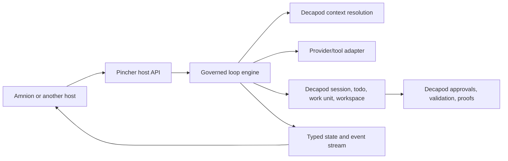

# Architecture

<!-- decapod:capability-overlay:persistent-state:start -->

## Persistent State Architecture Overlay

### State Ownership
- Each entity type MUST have a designated state owner
- State ownership boundaries MUST be explicitly documented
- Cross-boundary state access MUST go through defined interfaces

### Transaction Boundaries
- All multi-entity mutations MUST occur within explicit transactions
- Transaction boundaries MUST be documented in ARCHITECTURE.md
- Compensating transactions for distributed operations

### Storage Abstraction
- Storage ownership, consistency behavior, and access boundaries MUST be explicit
- Portability or swappable implementations are project decisions, not universal requirements
- Migration and rollback treatment MUST match the selected storage technology
<!-- decapod:capability-overlay:persistent-state:end -->

## Direction

Rust library/runtime. Pincher is an embeddable loop engine, not a host
application.

## Executive Summary

Pincher is the governed execution spine for hosts such as Amnion. It owns the
loop and custody boundary while keeping presentation outside the crate.

## Current Facts

- Runtime/language: Rust.
- Surfaces: Cargo library and Decapod integration.
- Product type: service_or_library.

## Architecture Map

- `src/`: Pincher loop and Decapod integration modules.
- `README.md`: host boundary and development contract.
- `.decapod/generated/specs/`: living governance/spec contracts.

## Data Flows

Host intent enters Pincher, governed context is resolved through Decapod, a
provider turn produces bounded proposals/events, and validation/proof state is
returned to the host.

## Strongest Existing Primitives

`AgentEngine`, `RpcClient`, `EventEmitter`, work-unit managers, and commitment
types are the current reusable engine primitives.

## Runtime and Deployment Matrix

- Runtime: Rust library embedded by a foreground host.
- Environment: local Decapod-managed repositories and isolated workspaces.
- Deployment: host-selected; Pincher does not own UI or service deployment.

## Implementation Strategy

Stabilize the loop/event boundary first; add provider adapters and transports
only when a concrete host consumer supplies the compatibility proof.

## System Topology



## Runtime layers

- `AgentEngine`: prepares governed context and executes a provider turn.
- Decapod adapters: `RpcClient`, `Session`, `TodoManager`,
  `WorkspaceManager`, `WorkUnitManager`, and `Validator`.
- Coordination and commitment: multi-agent coordination, event emission, and
  proof/state commitment for host handoff.
- Host boundary: serialized state/events; no screen, layout, or interaction
policy crosses into the engine.

## Topology

Host -> Pincher API -> governed loop -> Decapod/provider adapters -> typed
events and proof-backed handoff.

## Store Boundaries

Pincher may cache run-local context; Decapod owns durable control-plane state.

## State ownership

| Entity | Owner | Lifetime |
| --- | --- | --- |
| Loop execution state | Pincher | Run-scoped; reconstructable from events and custody refs |
| Session, todo, workspace, work unit, approval, validation, proof | Decapod | Durable control-plane state |
| Human-facing view state | Amnion | Host-scoped projection; never authoritative |

Pincher may cache resolved context for a run, but Decapod remains authoritative
for governance decisions and durable records.

## Execution Physics

```text
request -> resolve context -> prepare turn -> propose action -> interlock?
    -> execute approved action -> emit state/event -> validate -> handoff
```

The loop is bounded by cancellation, retry limits, provider timeouts, and
Decapod approval/validation gates. Parallel work is partitioned by task or
work unit and must retain explicit custody identifiers.

## Happy Path Sequence

Request -> governed context -> provider turn -> approved action -> validation
-> proof-backed handoff.

## Error Path

Timeout, interlock, custody conflict, or proof failure remains typed and
visible to the host with its recovery instruction.

## Execution Path

Ingress, policy/interlock checks, bounded execution, event emission, and
verification are the required stages.

## Concurrency and Runtime Model

Concurrent work is partitioned by task/work-unit custody and bounded by retry,
timeout, cancellation, and conflict rules.

## Deployment Topology

Pincher is embedded by a local host; host deployment is outside Pincher's
responsibility.

## Data and Contracts

The public Rust types and serialized events are the current host contract;
Decapod owns durable governance data.

## ADR Register

| ADR | Title | Status |
| --- | --- | --- |
| ADR-001 | Split loop engine from host UX | Accepted |

## Delivery cut line

Pincher carries the loop and host contract. Amnion carries the terminal
cockpit, workspace/conversation views, and human-attention experience. A
future transport may be added only with a versioned interface and a consumer
proof surface.

## Service Contracts

Inbound requests arrive through a host library boundary. Outbound calls use
Pincher's Decapod adapters and provider/tool extension points.

## Schema and Data Contracts

Pincher owns ephemeral loop state and event serialization; Decapod owns durable
sessions, todos, workspaces, work units, approvals, validations, and proofs.

## API and ABI Contracts

The current contract is the public Rust types and serialized events. A separate
wire/ABI contract requires versioning, consumer proof, and migration evidence.

## Multi-Agent Delivery Model

Partition concurrent work by explicit Decapod task/work-unit/workspace scope;
share only typed events, custody references, and proof artifacts.

## Validation Gates

Formatting, tests, lints, and `decapod validate` are blocking promotion gates.

## Operational Planes

Pincher owns loop health, bounded retries, cancellation, and event emission;
Decapod owns custody and proof; Amnion owns presentation health.

## Failure Topology and Recovery

Transient provider failures may retry within budget. Interlocks, custody
conflicts, and proof failures stop or hand off with their causes intact.

## Delivery Plan

1. Stabilize the typed host/event boundary.
2. Add real provider/tool adapters behind that boundary.
3. Add Amnion consumer proof and transport only when needed.

## Risks and Mitigations

| Risk | Mitigation |
| --- | --- |
| UI/runtime boundary drifts | Keep Pincher/Amnion ownership in both living specs |
| Host infers authority from a projection | Preserve Decapod ids, receipts, and proof references |

<!-- decapod:codebase-attestation:start -->
## Codebase Attestation

- Repository signal fingerprint: `4662065c21bacd9fd48af88524e80aa78796a654d6aa58642b9f7fb3da842383`
- Significant implementation surfaces: `.github/` (1 files), `Cargo.lock/` (1 files), `Cargo.toml/` (1 files), `README.md/` (1 files), `src/` (18 files)
- Refreshed from the current codebase by `decapod specs.refresh`
<!-- decapod:codebase-attestation:end -->
