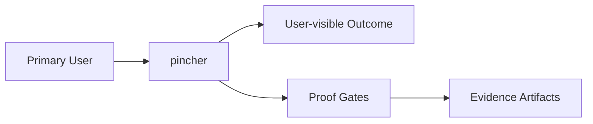

# Intent

<!-- decapod:declared-capabilities:start -->

## Declared Capability Surfaces

- `agent-loop`
- `amnion-host-integration`
- `decapod-trigger-integration`
- `model-inference`
- `multi-agent-coordination`
- `prompt-actor`
- `prompt-context-construction`
- `tool-function-calling`
- `typed-event-emission`

<!-- decapod:declared-capabilities:end -->
## Product Outcome
- Pincher is the complete prompt actor and agent runtime between Amnion and Decapod. Amnion accepts user intent through chat and presents Pincher events; Pincher constructs prompts and context, runs inference and the agent loop, invokes tools, coordinates execution, and automatically triggers Decapod governance; Decapod is a governed control-plane dependency rather than Pincher’s whole purpose.

## What This Project Is
pincher is a service_or_library project built using Rust.
Pincher is the complete prompt actor and agent runtime between Amnion and Decapod. Amnion accepts user intent through chat and presents Pincher events; Pincher constructs prompts and context, runs inference and the agent loop, invokes tools, coordinates execution, and automatically triggers Decapod governance; Decapod is a governed control-plane dependency rather than Pincher’s whole purpose.

Key operating facts:
- **Primary languages**: Rust
- **Detected surfaces**: Amnion, Decapod, Pincher

## Product View

## Inferred Baseline
- Repository: pincher
- Product type: service_or_library
- Primary languages: Rust
- Detected surfaces: Amnion, Decapod, Pincher

## Scope
| Area | In Scope | Proof Surface |
|---|---|---|
| Core workflow | Define a concrete user-visible workflow | Acceptance criteria + tests |
| Data contracts | Document canonical inputs/outputs | [INTERFACES.md](./INTERFACES.md) and schema checks |
| Delivery quality | Block promotion on broken proof surfaces | [VALIDATION.md](./VALIDATION.md) blocking gates |

## Non-Goals (Falsifiable)
| Non-goal | How to falsify |
|---|---|
| Feature creep beyond the primary outcome | Any PR adds capability not tied to outcome criteria |
| Shipping without evidence | Missing validation artifacts for promoted changes |
| Ambiguous ownership boundaries | Missing owner/system-of-record in interfaces |

## Constraints
- Technical: runtime, dependency, and topology boundaries are explicit.
- Operational: deployment, rollback, and incident ownership are defined.
- Security/compliance: sensitive data handling and authz are mandatory.

## Acceptance Criteria (must be objectively testable)
- [ ] A human submits supported intent through Amnion chat; Amnion automatically passes that intent to Pincher; Pincher deterministically constructs prompts and context, runs the complete agent loop with model inference and tool calls, coordinates state and emits typed events for Amnion to present, and automatically invokes Decapod for governed triggers, validation, approvals, repository actions, and proof recording. Completion is auditable from user intent through Pincher execution to Decapod governance and back to the Amnion-visible event stream.
- [ ] Non-functional targets are met (latency, reliability, cost, etc.).
- [ ] Validation gates pass and artifacts are attached.
- [ ] `cargo test` passes for unit/integration coverage
- [ ] `cargo clippy -- -D warnings` passes with no denied lints
- [ ] `cargo fmt --check` passes on the repo

## Epistemic Custody Fields

### Active Assumptions
- [ ] List any assumptions made to proceed.
- [ ] Flag assumptions that require future verification.

### Confidence & Risk Level
- **Confidence**: Low/Medium/High (Rationale: )
- **Risk**: Low/Medium/High (Impact of wrong assumptions: )

### Measured vs Inferred Facts
| Fact | Source (Provenance) | Type (Measured/Inferred) |
|---|---|---|
| | | |

### Unresolved Contradictions
- [ ] List any evidence that conflicts with current assumptions or intent.

### Deferred Questions
- [ ] Questions to be answered later.

### Stop Conditions
- [ ] Explicit conditions under which the agent should stop and ask for help.

### Proof Required Before Completion
- [ ] Specific evidence needed to prove the outcome is met.

## Tradeoffs Register
| Decision | Benefit | Cost | Review Trigger |
|---|---|---|---|
| Simplicity vs extensibility | Faster iteration | Potential rework | Feature set expands |
| Strict gates vs dev speed | Higher confidence | More upfront discipline | Lead time regressions |

## First Implementation Slice
- [ ] Define the smallest user-visible workflow to ship first.
- [ ] Define required data/contracts for that workflow.
- [ ] Define what is intentionally postponed until v2.

## Open Questions (with decision deadlines)
| Question | Owner | Deadline | Decision |
|---|---|---|---|
| Which interfaces are versioned at launch? | TBD | YYYY-MM-DD | |
| Which non-functional target is hardest to hit? | TBD | YYYY-MM-DD | |

<!-- decapod:codebase-attestation:start -->
## Codebase Attestation

- Repository signal fingerprint: `c7478e04a9839d0e9dd29d3a9ee8e4f81c3db619326b0d4d20f1b0d6f185059e`
- Significant implementation surfaces: `Cargo.lock/` (1 files), `Cargo.toml/` (1 files), `README.md/` (1 files), `src/` (18 files)
- Refreshed from the current codebase by `decapod specs.refresh`
<!-- decapod:codebase-attestation:end -->
