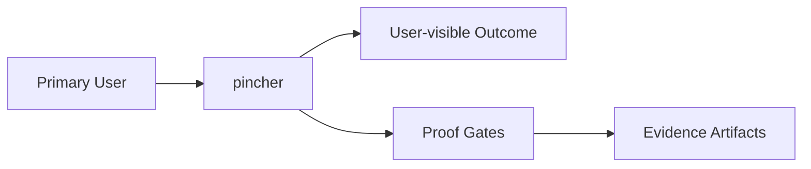

# Intent

<!-- decapod:declared-capabilities:start -->

## Declared Capability Surfaces

- `authentication`
- `background-processing`
- `event-driven`
- `external-integrations`
- `infrastructure-management`
- `persistent-state`
- `public-api`

<!-- decapod:declared-capabilities:end -->
## Product Outcome
- Agent engine. The loop runner. It manages sessions, inference preparation, provider execution, custody, approvals, and runtime control. It ensures Decapod is consulted before inference and before mutation.

## What This Project Is
pincher is a service_or_library project built using Rust.
Agent engine. The loop runner. It manages sessions, inference preparation, provider execution, custody, approvals, and runtime control. It ensures Decapod is consulted before inference and before mutation.

Key operating facts:
- **Primary languages**: Rust
- **Detected surfaces**: cargo, rust

## Product View

## Inferred Baseline
- Repository: pincher
- Product type: service_or_library
- Primary languages: Rust
- Detected surfaces: cargo, rust

## Scope
| Area | In Scope | Proof Surface |
|---|---|---|
| Core workflow | Define a concrete user-visible workflow | Acceptance criteria + tests |
| Data contracts | Document canonical inputs/outputs | [INTERFACES.md](./INTERFACES.md) and schema checks |
| Delivery quality | Block promotion on broken proof surfaces | [VALIDATION.md](./VALIDATION.md) blocking gates |

## Non-Goals (Falsifiable)
| Non-goal | How to falsify |
|---|---|
| Feature creep beyond the primary outcome | Any PR adds capability not tied to outcome criteria |
| Shipping without evidence | Missing validation artifacts for promoted changes |
| Ambiguous ownership boundaries | Missing owner/system-of-record in interfaces |

## Constraints
- Technical: runtime, dependency, and topology boundaries are explicit.
- Operational: deployment, rollback, and incident ownership are defined.
- Security/compliance: sensitive data handling and authz are mandatory.

## Acceptance Criteria (must be objectively testable)
- [ ] Done means Pincher provides a Rust-first agent engine that runs governed inference loops inside explicitly allowed repos, with Decapod consulted before context exposure, before agent execution, before repo mutation, and before completion is accepted. Pincher must manage agent/session lifecycle, provider invocation, repo/worktree custody, claimed todos, approval boundaries, context preparation, execution state, validation checkpoints, failure handling, and proof-backed handoff without owning the UI experience directly. A Pincher-managed run is complete only when the intent is bound to Decapod governance, the allowed scope is explicit, the agent operates through that boundary, required approvals are honored, validation has run, proof artifacts are recorded, and the final state can be rendered by Amnion as either ready, blocked, failed-with-cause, or safely handed off.
- [ ] Non-functional targets are met (latency, reliability, cost, etc.).
- [ ] Validation gates pass and artifacts are attached.
- [ ] `cargo test` passes for unit/integration coverage
- [ ] `cargo clippy -- -D warnings` passes with no denied lints
- [ ] `cargo fmt --check` passes on the repo

## Epistemic Custody Fields

### Active Assumptions
- [ ] List any assumptions made to proceed.
- [ ] Flag assumptions that require future verification.

### Confidence & Risk Level
- **Confidence**: Low/Medium/High (Rationale: )
- **Risk**: Low/Medium/High (Impact of wrong assumptions: )

### Measured vs Inferred Facts
| Fact | Source (Provenance) | Type (Measured/Inferred) |
|---|---|---|
| | | |

### Unresolved Contradictions
- [ ] List any evidence that conflicts with current assumptions or intent.

### Deferred Questions
- [ ] Questions to be answered later.

### Stop Conditions
- [ ] Explicit conditions under which the agent should stop and ask for help.

### Proof Required Before Completion
- [ ] Specific evidence needed to prove the outcome is met.

## Tradeoffs Register
| Decision | Benefit | Cost | Review Trigger |
|---|---|---|---|
| Simplicity vs extensibility | Faster iteration | Potential rework | Feature set expands |
| Strict gates vs dev speed | Higher confidence | More upfront discipline | Lead time regressions |

## First Implementation Slice
- [ ] Define the smallest user-visible workflow to ship first.
- [ ] Define required data/contracts for that workflow.
- [ ] Define what is intentionally postponed until v2.

## Open Questions (with decision deadlines)
| Question | Owner | Deadline | Decision |
|---|---|---|---|
| Which interfaces are versioned at launch? | TBD | YYYY-MM-DD | |
| Which non-functional target is hardest to hit? | TBD | YYYY-MM-DD | |
