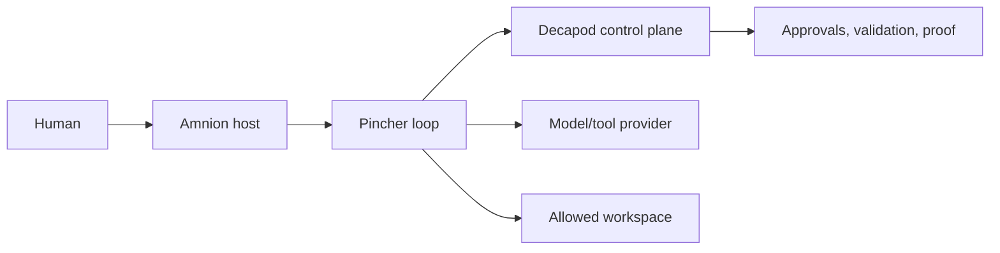

# Security

<!-- decapod:capability-overlay:public-api:start -->

## Public API Security Overlay

### Authentication Requirements
- All public endpoints MUST validate authentication tokens
- Token validation MUST include expiry, revocation, and scope checks
- Anonymous access MUST be explicitly documented and justified

### Input Validation
- All request bodies MUST be validated against schemas
- Reject requests with unknown fields (strict schema validation)
- Size limits MUST be enforced on all request bodies

### Rate Limiting
- Limits and enforcement boundaries MUST be selected for this deployment
- Clustered enforcement behavior MUST be documented when applicable
- Client-visible throttling behavior MUST be part of the contract when applicable
<!-- decapod:capability-overlay:public-api:end -->

## Threat Model

Decapod is the governance authority. Pincher is an execution client inside an
allowed workspace. Amnion is an untrusted presentation projection with no
authority to bypass Pincher or Decapod gates. Providers and tools are external
dependencies and their responses are input data, not instructions to expand
scope.

## Authorization

Decapod session custody, task/work-unit scope, workspace isolation, approval
interlocks, and validation gates authorize mutations. Amnion cannot authorize
them by changing local view state.

## Data Classification

| Class | Examples | Handling |
| --- | --- | --- |
| Public | typed status and non-sensitive event metadata | host-readable |
| Internal | custody refs, validation details, operational logs | scoped access |
| Sensitive | session passwords, API keys, raw secret-bearing prompts | never emit; redact |

## Controls

- Require an active Decapod session for governed mutations.
- Keep repository/worktree scope explicit and isolated.
- Stop on blocking interlocks; never infer approval from a host action.
- Bound retries, timeouts, concurrency, and provider payload exposure.
- Do not log session passwords, API keys, raw secret-bearing prompts, or
  unredacted tool payloads.
- Preserve claimed and verified identity/provenance separately. A local
  session establishes custody and correlation, not provider authentication.

## Threats and verification

| Threat | Control | Proof |
| --- | --- | --- |
| Scope expansion | task/work-unit/workspace binding | custody and validation output |
| Unauthorized mutation | Decapod approval/validation gate | interlock/approval evidence |
| Provider prompt injection | treat provider/tool output as data | bounded adapter tests |
| Replay/duplicate mutation | idempotent request/work-unit identity | semantic tests |
| Secret disclosure | redaction and limited event payloads | log/security review |

<!-- decapod:codebase-attestation:start -->
## Codebase Attestation

- Repository signal fingerprint: `4662065c21bacd9fd48af88524e80aa78796a654d6aa58642b9f7fb3da842383`
- Significant implementation surfaces: `.github/` (1 files), `Cargo.lock/` (1 files), `Cargo.toml/` (1 files), `README.md/` (1 files), `src/` (18 files)
- Refreshed from the current codebase by `decapod specs.refresh`
<!-- decapod:codebase-attestation:end -->
