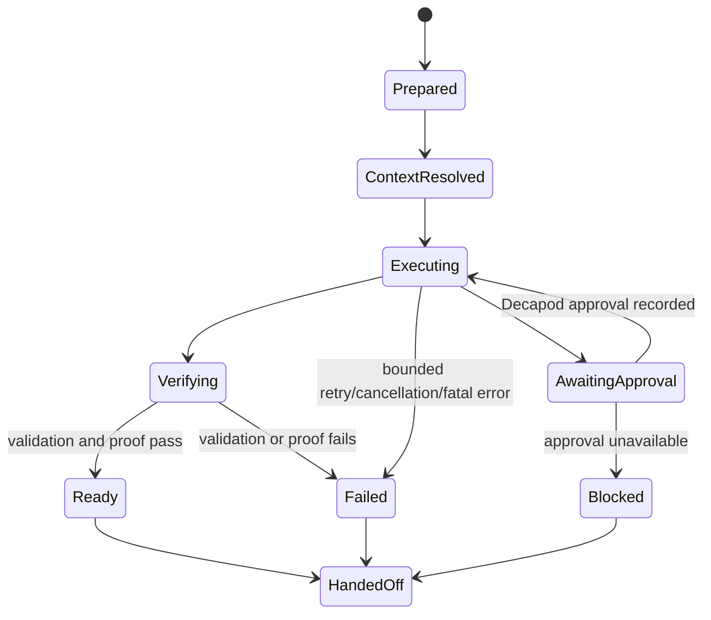

# Semantics## State Machines

## Invariants

| Invariant | Enforcement |
| --- | --- |
| No context exposure without the configured governance boundary | Decapod context resolution before the governed prompt |
| No risky mutation through an unresolved interlock | Decapod approval result is required before continuation |
| No completion claim without proof | Validation and proof records precede handoff |
| No host projection becomes authority | Decapod remains source of truth for custody and gates |
| Retries do not duplicate mutations | Request/correlation and work-unit identity remain attached |

## Determinism

Given the same repository state, intent, governance responses, provider
response, and retry budget, the loop produces the same state transitions and
serialized event ordering. Time, ULIDs, and host metadata are evidence fields,
not decision inputs.

## Terminal states

- `ready`: execution and required verification passed.
- `blocked`: a human or Decapod decision is required.
- `failed`: execution or proof failed with a retained cause.
- `handed_off`: terminal state and evidence are available to a host.

<!-- decapod:codebase-attestation:start -->
## Codebase Attestation

- Repository signal fingerprint: `9a5d7d51c64c895500d86c3b1bf40b14922d860d7043ed1094c7adf5ea2475fa`
- Significant implementation surfaces: `.github/` (1 files), `Cargo.lock/` (1 files), `Cargo.toml/` (1 files), `README.md/` (1 files), `src/` (19 files)
- Refreshed from the current codebase by `decapod specs.refresh`
<!-- decapod:codebase-attestation:end -->
