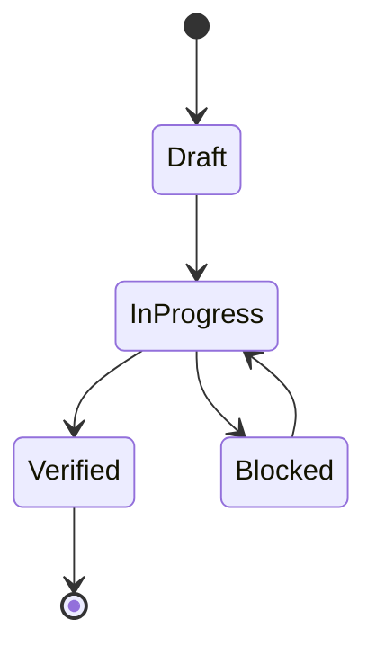

# Semantics

## State Machines

## Invariants
| Invariant | Type | Validation |
|---|---|---|
| No promoted change without proof | System | validation gate |
| Canonical source-of-truth per entity | Data | interface/spec review |
| Mutation events are replayable | Data | deterministic replay |

## Event Sourcing Schema
| Field | Type | Description |
|---|---|---|
| event_id | string | globally unique event id |
| aggregate_id | string | entity/workflow id |
| event_type | string | semantic transition |
| payload | object | transition data |
| recorded_at | timestamp | append time |

## Replay Semantics
- Replay order:
- Conflict resolution:
- Snapshot cadence:
- Determinism proof strategy:

## Error Code Semantics
- Namespace:
- Stable compatibility window:
- Mapping to retry/degrade behavior:

## Domain Rules
- Business rule 1:
- Business rule 2:
- Business rule 3:

## Idempotency Contracts
| Operation | Idempotency Key | Duplicate Behavior |
|---|---|---|
| create/update mutation | request_id | return original result |
| async enqueue | event_id | ignore duplicate enqueue |

## Language Note
- Primary language inferred: Rust

<!-- decapod:codebase-attestation:start -->
## Codebase Attestation

- Repository signal fingerprint: `c7478e04a9839d0e9dd29d3a9ee8e4f81c3db619326b0d4d20f1b0d6f185059e`
- Significant implementation surfaces: `Cargo.lock/` (1 files), `Cargo.toml/` (1 files), `README.md/` (1 files), `src/` (18 files)
- Refreshed from the current codebase by `decapod specs.refresh`
<!-- decapod:codebase-attestation:end -->
