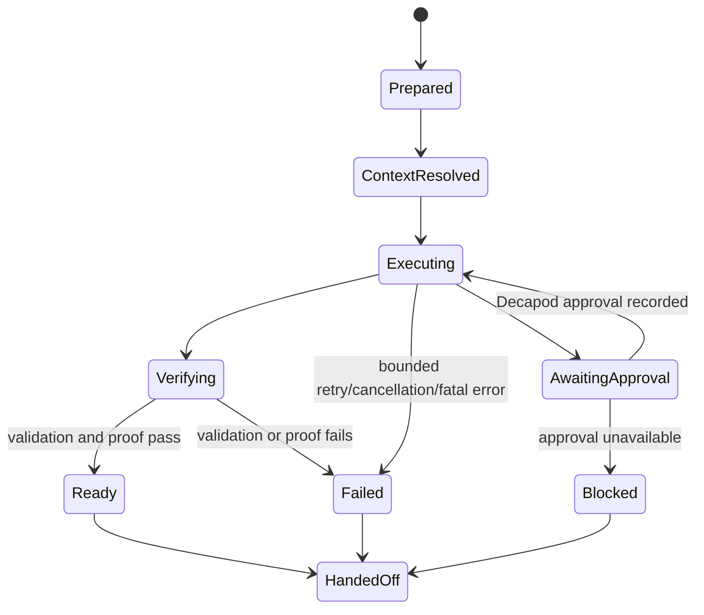

# Semantics## State Machines

<!-- decapod:capability-overlay:background-processing:start -->

## Background Processing Semantics Overlay

### Retry Semantics
- Retry and backoff behavior MUST be selected and documented for each work class
- Poison-work handling MUST be selected and documented for each work class
- Retry MUST preserve the declared side-effect and idempotency semantics

### Idempotency
- Each job MUST declare whether it is idempotent, transactional, compensating, or otherwise duplicate-safe
- Deduplication or compensation mechanisms are project decisions and require proof
- Duplicate execution MUST follow the job's declared duplicate-handling semantics

### Poison Message Handling
- Messages failing after max retries go to dead letter queue
- DLQ MUST be monitored and alerted
- Manual replay capability for DLQ messages
<!-- decapod:capability-overlay:background-processing:end -->

<!-- decapod:capability-overlay:persistent-state:start -->

## Persistent State Semantics Overlay

### Transaction Semantics
- All multi-entity operations MUST be atomic
- Read-after-write consistency within transaction boundaries
- Eventual consistency windows MUST be documented

### Migration Semantics
- Schema migrations MUST be backward-compatible
- Migration rollback procedures MUST be documented
- Data integrity checks post-migration

### Recovery Semantics
- Point-in-time recovery capability
- Recovery objectives MUST be selected for the project and recorded as proof obligations
- Recovery test cadence MUST be selected for the project and recorded as a proof obligation
<!-- decapod:capability-overlay:persistent-state:end -->

## Invariants

| Invariant | Enforcement |
| --- | --- |
| No context exposure without the configured governance boundary | Decapod context resolution before the governed prompt |
| No risky mutation through an unresolved interlock | Decapod approval result is required before continuation |
| No completion claim without proof | Validation and proof records precede handoff |
| No host projection becomes authority | Decapod remains source of truth for custody and gates |
| Retries do not duplicate mutations | Request/correlation and work-unit identity remain attached |

## Determinism

Given the same repository state, intent, governance responses, provider
response, and retry budget, the loop produces the same state transitions and
serialized event ordering. Time, ULIDs, and host metadata are evidence fields,
not decision inputs.

## Terminal states

- `ready`: execution and required verification passed.
- `blocked`: a human or Decapod decision is required.
- `failed`: execution or proof failed with a retained cause.
- `handed_off`: terminal state and evidence are available to a host.

<!-- decapod:codebase-attestation:start -->
## Codebase Attestation

- Repository signal fingerprint: `4662065c21bacd9fd48af88524e80aa78796a654d6aa58642b9f7fb3da842383`
- Significant implementation surfaces: `.github/` (1 files), `Cargo.lock/` (1 files), `Cargo.toml/` (1 files), `README.md/` (1 files), `src/` (18 files)
- Refreshed from the current codebase by `decapod specs.refresh`
<!-- decapod:codebase-attestation:end -->
