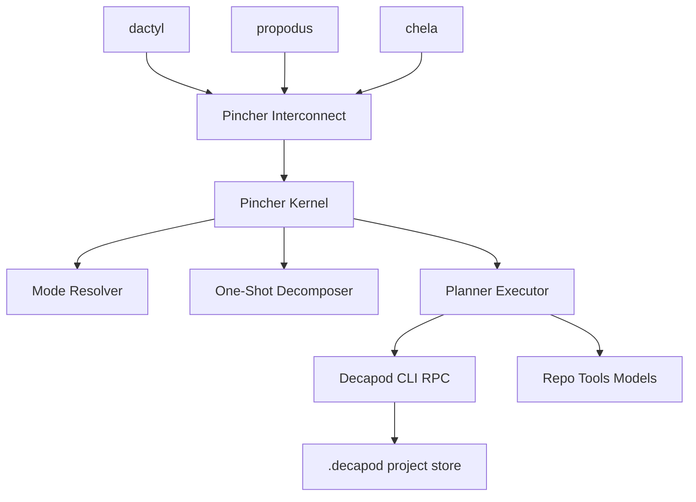
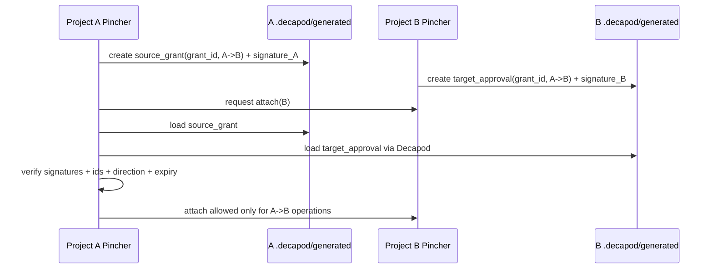
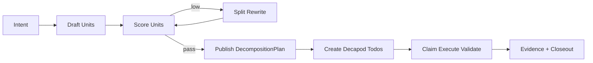
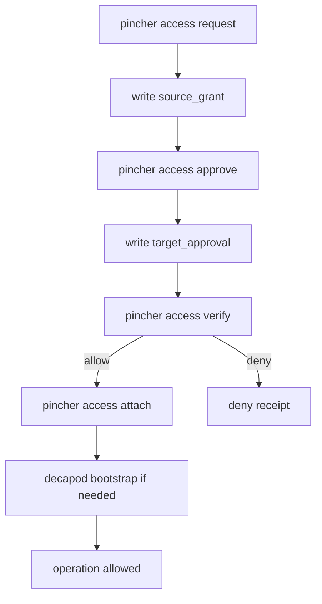
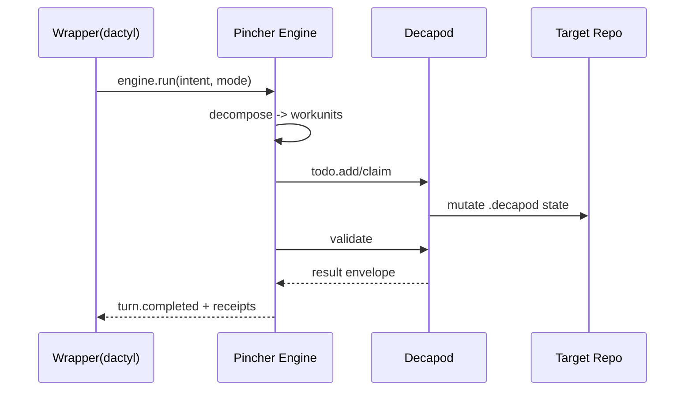

# PINCHER FINDINGS (Ultra-Hardcore Draft)

## 0. Scope and Intent

This document is a deep design and implementation findings dump for Pincher, based on local-repo analysis of:

- `/home/arx/projects/pi-mono`
- `/home/arx/projects/opencode`
- `/home/arx/projects/claude-code`
- `/home/arx/projects/decapod`
- `/home/arx/projects/openclaw`
- `/home/arx/projects/ironclaw`

Target statement of work:

- Pincher is **the core coding-agent engine**, not a wrapper UI layer.
- Wrappers are modality shells (`dactyl`, `propodus`, `chela`) around the engine.
- Pincher uses Decapod as the mandatory control-plane substrate.
- Pincher should support many local Pincher instances running concurrently.
- Pincher instances do not directly communicate with each other.
- Coordination is mediated through project-level `.decapod` state via Decapod CLI/RPC.
- Cross-project access must be explicit, directional, cryptographically signed, and fail-closed.

---

## 1. Executive Synthesis

### 1.1 What to import

From the sampled repos, the strongest design imports for Pincher are:

1. **Thin runtime core + plugin/extension surface** (pi-mono, claude-code, openclaw)
2. **Headless RPC/API server + multiple clients** (pi-mono RPC mode, opencode HTTP/OpenAPI)
3. **Strict permission/action matrix with explicit approvals** (opencode permission model)
4. **Deterministic local control-plane contracts** (decapod constitution/interfaces)
5. **Event-sourced lifecycle + bounded state transitions** (decapod todo/state discipline, ironclaw state machine orientation)
6. **Operational hardening and safety envelopes** (ironclaw threat posture, openclaw channel safety)

### 1.2 What to reject

1. Any architecture where wrapper-specific behavior leaks into engine semantics.
2. Any direct inter-agent peer bus outside Decapod state mediation.
3. Any silent cross-project access without explicit user-signed directional grants.
4. Any “done” claim not backed by deterministic proof artifacts.

### 1.3 High-confidence architecture decision

Pincher should be a **Decapod-native, evented engine kernel** with:

- A deterministic task decomposition core (one-shot-able todo units).
- A mode policy layer (`openclaw` / `ironclaw` / `claw`) as runtime behavior profiles.
- A repo-attach subsystem with directional cryptographic grant validation.
- A wrapper interconnect protocol with `dactyl` as first canonical consumer.

---

## 2. Comparative Findings by Source Repo

## 2.1 pi-mono (coding harness + RPC + extension-first)

Observed strengths:

- Mature **headless RPC mode** over stdin/stdout with explicit command envelope.
- Session persistence with structured JSONL entries and versioned migration.
- Strong extension + skill architecture for progressive disclosure.
- Explicit compaction/branch summarization lifecycle.
- Model/provider abstraction built for portability.

Pincher import recommendations:

- Use command/event envelopes with stable IDs and asynchronous event streams.
- Use explicit session/event schema versions and migration contracts.
- Keep capability growth modular via extension/skill-like boundaries.

Risks to avoid:

- Over-growing engine core with wrapper concerns.
- Unbounded context/session accumulation without compaction rules.

## 2.2 opencode (client/server split + permissions + multi-agent)

Observed strengths:

- Clear server architecture with HTTP/OpenAPI and multiple clients.
- Granular permission model (`allow`/`ask`/`deny`) with wildcard policy DSL.
- Explicit agent types and tool capability partitioning.
- Strong operational API coverage (sessions, config, providers, tooling, TUI hooks).

Pincher import recommendations:

- Expose a stable programmatic surface (RPC first; optional HTTP gateway).
- Define explicit permission policy for operations crossing repo boundaries.
- Keep agent roles and tool-access envelopes explicit and configurable.

Risks to avoid:

- Permission defaults too permissive for cross-repo operations.
- Ambiguous precedence when global/per-agent/per-repo policies conflict.

## 2.3 decapod (control-plane constitution and gates)

Observed strengths:

- Strong local-first control plane and no-daemon posture.
- Canonical interfaces and validation doctrine.
- Strict “no direct .decapod manipulation by agents” boundary.
- Explicit task lifecycle and multi-agent coordination primitives.

Pincher import recommendations:

- Treat Decapod as a foundational control-plane dependency.
- Keep all shared state mutations routed through Decapod CLI/RPC.
- Enforce proof-gated completion and typed failure semantics.

Risks to avoid:

- Building parallel state roots or bypassing Decapod surfaces.
- Letting wrapper-level UX bypass repo governance gates.

## 2.4 claude-code (plugin workflows and specialized subagents)

Observed strengths:

- Workflow plugins codify repeatable high-quality engineering process.
- Specialized reviewer agents with scoped responsibilities.
- Structured phased feature-development model.

Pincher import recommendations:

- Encode standardized decomposition/review pipelines as first-class flows.
- Support specialized “review profiles” bound to mode/policy.

Risks to avoid:

- Tooling sprawl without unified policy and proof surfaces.

## 2.5 openclaw (control-plane gateway + multi-channel integrations)

Observed strengths:

- Strong control-plane framing and channel abstraction discipline.
- Operationally robust docs around routing/security/channel policy.
- Clear focus on isolating channels from core decision/runtime logic.

Pincher import recommendations:

- Keep modality wrappers fully decoupled from engine logic.
- Use strict routing boundaries for channel/wrapper integrations.

Risks to avoid:

- Polluting engine scope with wrapper transport specifics.

## 2.6 ironclaw (security-first agent system orientation)

Observed strengths:

- Defense-in-depth and explicit security boundaries.
- Job state machine rigor and recovery-focused architecture.
- Sandboxing and capability gating mindset.

Pincher import recommendations:

- Formalize state transitions for cross-project attach flows.
- Add explicit recover/fail-closed semantics for authorization failures.

Risks to avoid:

- Complexity creep from over-sandboxing early before core contracts are stable.

---

## 3. Proposed Pincher Engine Architecture

## 3.1 Layer model

```text
+--------------------------------------------------------------+
| Wrapper Layer (dactyl first; then propodus, chela, others)   |
+-----------------------------+--------------------------------+
                              |
                              v
+--------------------------------------------------------------+
| Pincher Interconnect API (stable contracts, versioned)        |
+-----------------------------+--------------------------------+
                              |
                              v
+--------------------------------------------------------------+
| Pincher Engine Kernel                                        |
| - Intent parser                                               |
| - Mode policy resolver (openclaw/ironclaw/claw)              |
| - One-shot task decomposer                                    |
| - Planner/executor                                            |
| - Evidence collector                                          |
+-----------------------------+--------------------------------+
                              |
                              v
+--------------------------------------------------------------+
| Decapod Control Plane                                         |
| - todo/workspace/context/validate/session/rpc                |
| - project-local .decapod store                               |
+-----------------------------+--------------------------------+
                              |
                              v
+--------------------------------------------------------------+
| Repo + Tools + Model Adapters                                 |
+--------------------------------------------------------------+
```

## 3.2 Runtime sequence

```text
wrapper event
  -> pincher bootstrap check (.git root, decapod availability)
  -> intent + policy parse
  -> mode resolve
  -> decompose into one-shot todo units
  -> claim/dispatch through decapod surfaces
  -> execute
  -> collect evidence
  -> validate gates
  -> return structured receipt
```

## 3.3 State model

Pincher should treat these as core entities:

- `ExecutionIntent`
- `ModePolicy`
- `DecompositionPlan`
- `WorkUnit`
- `ExecutionReceipt`
- `BootstrapReceipt`
- `ProjectAccessGrant`
- `ProjectAttachReceipt`
- `ValidationEvidence`

All persisted evidence should be derivable/replayable from project-local control-plane data.

---

## 4. Multi-Instance and Cross-Project Communication Model

## 4.1 Hard rule

No direct A<->B Pincher process channel.

Coordination path must be:

```text
Pincher(A) --Decapod CLI/RPC--> .decapod(ProjectX)
Pincher(B) --Decapod CLI/RPC--> .decapod(ProjectX)
```

This enables coordination by shared durable project state, not by opaque agent IPC.

## 4.2 Access topology

```text
Project A (source)                          Project B (target)
-------------------                         -------------------
Pincher instance A                          Pincher instance B
.dacapod/generated/access/*                 .decapod/generated/access/*
        |                                             |
        +---------- paired directional approvals -----+
                                |
                                v
                 unlock A -> B operations only
```

Note: B->A must require a separate reverse pair.

---

## 5. Cryptographic Access Certificate Design (Draft)

This section proposes concrete structures for the directional approval artifacts requested.

## 5.1 Terminology

- `upstream`: granting source project (initiator), e.g., Project A
- `downstream`: receiving/target project (helper target), e.g., Project B
- Direction token: `A->B`

Alternative naming if preferred:

- `origin` / `target`
- `source` / `destination`

Recommendation: use `source` and `target` in schemas for clarity.

## 5.2 Artifact locations

In **source project** (A):

- `.decapod/generated/access/source-grants/<grant_id>.json`

In **target project** (B):

- `.decapod/generated/access/target-approvals/<grant_id>.json`

Verification manifest (on attach):

- source: `.decapod/generated/access/receipts/<grant_id>-verify.json`
- target: `.decapod/generated/access/receipts/<grant_id>-verify.json`

## 5.3 Core payload (canonical bytes)

Canonical signed payload should include:

- `schema_version`
- `grant_id`
- `direction` (strict literal: `source_to_target`)
- `source_repo_id` (hash of absolute canonical git root path + git origin URL if present)
- `target_repo_id`
- `source_repo_git_root`
- `target_repo_git_root`
- `issued_at`
- `expires_at`
- `issuer_user_fingerprint`
- `nonce`
- `capabilities` (scoped allowlist of operations)
- `constraints` (time, rate, tool class, mode restrictions)

## 5.4 Signature strategy

Draft strategy:

1. Derive `salt_material` from user-side secure material:
   - Candidate: Mozilla/NSS-backed random salt persisted in secure store.
2. Use SSH signing key as identity anchor:
   - `ssh-keygen -Y sign` / verify equivalent flow.
3. Signed payload digest:
   - `digest = SHA-256(canonical_payload_bytes || salt_material_digest)`
4. Record:
   - `signature_format`, `public_key_fingerprint`, `signature`.

Important: store only non-sensitive derivations in repo artifacts. Raw secret material remains outside repo.

## 5.5 Example source grant artifact (A-side)

```json
{
  "schema_version": "0.1.0",
  "artifact_type": "source_grant",
  "grant_id": "gr_01K...",
  "direction": "source_to_target",
  "source_repo": {
    "id": "repo_a_hash",
    "git_root": "/abs/path/to/projectA"
  },
  "target_repo": {
    "id": "repo_b_hash",
    "git_root": "/abs/path/to/projectB"
  },
  "issued_at": "2026-02-24T00:00:00Z",
  "expires_at": "2026-03-24T00:00:00Z",
  "capabilities": [
    "todo.read",
    "todo.claim",
    "todo.done",
    "context.resolve",
    "validate.run"
  ],
  "constraints": {
    "max_parallel_workunits": 3,
    "mode_allowlist": ["claw", "ironclaw"],
    "time_window": "business_hours"
  },
  "signing": {
    "identity": "ssh-ed25519 AAAA...",
    "pubkey_fingerprint": "SHA256:...",
    "signature_scheme": "sshsig+sha256",
    "payload_digest": "sha256:...",
    "signature": "base64..."
  }
}
```

## 5.6 Example target approval artifact (B-side)

```json
{
  "schema_version": "0.1.0",
  "artifact_type": "target_approval",
  "grant_id": "gr_01K...",
  "direction": "source_to_target",
  "source_repo_id": "repo_a_hash",
  "target_repo_id": "repo_b_hash",
  "issued_at": "2026-02-24T00:05:00Z",
  "expires_at": "2026-03-24T00:05:00Z",
  "approval_policy": {
    "allow_bootstrap_if_missing_decapod": true,
    "require_git_root": true,
    "deny_reverse_direction": true
  },
  "signing": {
    "identity": "ssh-ed25519 BBBB...",
    "pubkey_fingerprint": "SHA256:...",
    "signature_scheme": "sshsig+sha256",
    "payload_digest": "sha256:...",
    "signature": "base64..."
  }
}
```

## 5.7 Unlock algorithm

`unlock(A->B)` succeeds only if all are true:

1. Source grant exists in A with matching `grant_id`, `A`, `B`, direction.
2. Target approval exists in B with matching `grant_id`, `A`, `B`, direction.
3. Both signatures validate.
4. Both artifacts unexpired.
5. Capability intersection is non-empty and requested operation is in intersection.
6. Requested operation respects constraints.

Reverse attempts (`B->A`) must fail unless a separate valid pair exists.

## 5.8 Revocation model

- Revocation artifacts stored in both repos under `.decapod/generated/access/revocations/`.
- Verification logic checks revocation set before attach.
- Revocation must be monotonic and immediately effective.

---

## 6. One-Shot Todo Decomposition Model

## 6.1 Decomposition objective

Transform fuzzy work into bounded workunits where each unit is:

- independently claimable,
- independently testable,
- independently closable,
- small enough for one focused execution pass.

## 6.2 Workunit schema (draft)

```json
{
  "workunit_id": "wu_...",
  "parent_intent_id": "intent_...",
  "title": "...",
  "outcome": "single measurable outcome",
  "inputs": ["..."],
  "constraints": ["..."],
  "proof_commands": ["decapod validate", "..."],
  "done_checks": ["artifact exists", "test passes"],
  "risk_level": "low|medium|high",
  "estimated_effort": "xs|s|m"
}
```

## 6.3 Decomposition quality heuristic

Score each workunit on:

- atomicity,
- proofability,
- dependency clarity,
- failure isolation,
- rollback clarity.

Reject units below threshold; split or rewrite.

## 6.4 Suggested decomposition loop

```text
intent
  -> draft N units
  -> score units
  -> split low-score units
  -> emit final plan
  -> create decapod todo records
  -> claim/execute in deterministic order
```

---

## 7. Mode System (`openclaw` / `ironclaw` / `claw`) as Policies

Treat modes as policy bundles, not brand strings.

## 7.1 Proposed policy dimensions

- planning breadth/depth
- retry aggressiveness
- risk tolerance
- write privileges by default
- command permission strictness
- review depth before closeout
- budget caps (tokens/time/tool calls)

## 7.2 Suggested defaults

- `openclaw`: broader exploration, higher branching, wider retries.
- `ironclaw`: conservative execution, stricter approvals, deeper verification.
- `claw`: balanced defaults.

All runs must record resolved mode + policy hash in receipts.

---

## 8. Permission and Policy Engine

## 8.1 Recommended policy precedence

1. hard safety invariants (engine-level)
2. signed cross-project grant constraints
3. project policy (`.decapod/generated/...`)
4. wrapper/user requested mode/config
5. runtime defaults

## 8.2 Recommended decision output

Every allow/deny/ask decision should emit:

- decision id
- policy sources considered
- winning rule
- operation context hash
- timestamp and correlation id

This provides forensic traceability.

---

## 9. Threat Model (Focused)

Top threat classes:

1. unauthorized cross-project attach
2. replayed stale grants
3. forged or tampered approval artifacts
4. wrapper injection of privileged operations
5. policy drift between source/target projects
6. hidden peer channel between Pincher instances

Controls:

- directional pairwise signatures
- nonce + expiry + revocation
- strict repo identity binding
- fail-closed verification
- immutable verification receipts
- no direct inter-agent transport in engine design

---

## 10. Diagrams

## 10.1 Engine + Decapod + wrappers



## 10.2 Directional access unlock



## 10.3 One-shot decomposition



## 10.4 Multi-instance communication boundary

```text
Pincher A (Project A)    X direct IPC forbidden X    Pincher B (Project B)
        |                                                     |
        +---- Decapod CLI/RPC ----> .decapod(Project B) <----+
                     (shared mediated coordination surface)
```

---

## 11. Concrete Build Plan

## Phase 1: Contracts and schemas

- Finalize interconnect envelopes (`run`, `bootstrap`, `decompose`, `request_access`, `attach`).
- Finalize source/target approval schemas.
- Finalize verification receipts + revocation schemas.
- Add schema versioning and migration policy.

## Phase 2: Bootstrap + attach gate

- Implement repo root detection (`.git` parent).
- Implement Decapod presence detection.
- Implement silent bootstrap path (preferred `~/projects/decapod`, fallback installer).
- Implement cross-project attach with directional signature verification.

## Phase 3: Decomposer + execution

- Implement decomposition planner with quality scoring.
- Emit decapod todo units and enforce claim-before-work.
- Bind mode policies into runtime decisions.

## Phase 4: Validation and hardening

- Add deterministic tests for directional access semantics.
- Add adversarial tests for tampered grants and stale signatures.
- Add multi-instance isolation tests.
- Add chaos tests for attach/bootstrap failures.

## Phase 5: Operationalization

- Add observability around policy decisions and attach failures.
- Add recovery/repair commands for grant inconsistencies.
- Add documentation and runbooks.

---

## 12. Suggested Acceptance Gates

Blocking gates:

- directional grant verification pass
- reverse-direction denial pass
- attach denied without paired artifacts
- attach denied on signature mismatch
- bootstrap behavior correct for repos with/without Decapod
- one-shot decomposition quality threshold met
- `decapod validate` pass

Non-blocking but tracked:

- attach latency
- grant signing friction
- decomposition defect escape rate

---

## 13. Key Open Questions (to finalize)

1. Canonical naming: `upstream/downstream` vs `source/target`.
2. Exact NSS + SSH integration mechanics on each OS.
3. Key rotation and grant renewal UX.
4. Whether target-side approval can further narrow source capabilities.
5. How to represent organization/team multi-signer approvals.
6. Whether grants should be bound to specific agent IDs in addition to repo pair.

---

## 14. Immediate Recommendations

1. Freeze schema v0.1 for access artifacts before implementation churn.
2. Build verify-first: implement artifact verifier before attach executor.
3. Keep cross-project scope narrow in v1 (`todo/context/validate` only).
4. Default mode on cross-project operations to `ironclaw` unless explicitly overridden by policy.
5. Keep all cryptographic verification results as durable receipts under `.decapod/generated/access/receipts/`.

---

## 15. Evidence Note

This document contains an inferred **product blend** layer (derived from `pi-mono`, `opencode`, `claude-code`, `openclaw`, and `decapod`) plus a dedicated Codex section added later after `/home/arx/projects/codex` became available locally.


---

## Appendix A: Repo Presence and Metrics

```text
== /home/arx/projects/pi-mono ==
present
files: 638
52M	/home/arx/projects/pi-mono
== /home/arx/projects/opencode ==
present
files: 3748
317M	/home/arx/projects/opencode
== /home/arx/projects/codex ==
missing
== /home/arx/projects/claude-code ==
present
files: 146
39M	/home/arx/projects/claude-code
== /home/arx/projects/decapod ==
present
files: 255
74G	/home/arx/projects/decapod
== /home/arx/projects/openclaw ==
present
files: 5176
248M	/home/arx/projects/openclaw
== /home/arx/projects/ironclaw ==
present
files: 278
9.3M	/home/arx/projects/ironclaw
```

## Appendix B: Top File Extensions by Repo

```text
== /home/arx/projects/pi-mono ==
    489 ts
     81 md
     37 json
      9 sh
      5 png
      5 js
      3 css
      2 jsonl
      2 html
      1 wasm
      1 mjs
      1 code-workspace
      1 c

== /home/arx/projects/opencode ==
   1218 svg
    784 ts
    625 mdx
    282 tsx
    208 png
    180 json
    113 css
     59 sql
     53 md
     45 aac
     42 txt
     40 woff2
     12 rs
      7 xml
      7 otf
      7 astro
      6 lock
      5 toml
      5 ico
      4 ttf

== /home/arx/projects/claude-code ==
    101 md
     15 sh
     12 py
     11 json
      5 ts
      1 ps1
      1 gif

== /home/arx/projects/decapod ==
    113 rs
    113 md
      7 txt
      6 json
      3 jsonl
      2 toml
      2 png
      2 lock
      1 tape
      1 svg
      1 sql
      1 hex
      1 gif
      1 cbor

== /home/arx/projects/openclaw ==
   3482 ts
    762 md
    463 swift
     85 json
     76 kt
     64 prose
     50 png
     49 sh
     14 go
     13 css
     12 jpg
     11 xml
     10 js
      9 mjs
      7 svg
      6 py
      6 mdx
      4 html
      3 yml
      3 plist

== /home/arx/projects/ironclaw ==
    209 rs
     14 toml
     12 json
     11 md
      8 sql
      4 sh
      4 lock
      2 wit
      2 service
      1 yml
      1 wxs
      1 worker
      1 png
      1 js
      1 html
      1 example
      1 dockerfile
      1 css

```

## Appendix C: High-Signal Documentation Index (sampled)

```text
[pi-mono docs candidates]
scripts/session-transcripts.ts
packages/web-ui/src/utils/test-sessions.ts
packages/web-ui/src/storage/stores/sessions-store.ts
packages/web-ui/src/storage/stores/custom-providers-store.ts
packages/tui/README.md
packages/pods/src/models.json
packages/web-ui/example/README.md
packages/web-ui/README.md
README.md
packages/pods/src/commands/models.ts
AGENTS.md
packages/ai/README.md
packages/pods/docs/qwen3-coder.md
packages/pods/docs/plan.md
packages/pods/docs/models.md
packages/pods/docs/kimi-k2.md
packages/pods/docs/implementation-plan.md
packages/pods/docs/gpt-oss.md
packages/pods/docs/gml-4.5.md
packages/pods/README.md
packages/agent/test/bedrock-models.test.ts
packages/agent/README.md
packages/ai/scripts/generate-models.ts
packages/ai/test/bedrock-models.test.ts
packages/mom/README.md
packages/ai/src/models.ts
packages/ai/src/models.generated.ts
packages/mom/docs/v86.md
packages/mom/docs/slack-bot-minimal-guide.md
packages/mom/docs/sandbox.md
packages/mom/docs/new.md
packages/mom/docs/events.md
packages/mom/docs/artifacts-server.md
packages/ai/src/providers/transform-messages.ts
packages/ai/src/providers/simple-options.ts
packages/ai/src/providers/register-builtins.ts
packages/ai/src/providers/openai-responses.ts
packages/ai/src/providers/openai-responses-shared.ts
packages/ai/src/providers/openai-completions.ts
packages/ai/src/providers/openai-codex-responses.ts
packages/ai/src/providers/google.ts
packages/ai/src/providers/google-vertex.ts
packages/ai/src/providers/google-shared.ts
packages/ai/src/providers/google-gemini-cli.ts
packages/ai/src/providers/github-copilot-headers.ts
packages/ai/src/providers/azure-openai-responses.ts
packages/ai/src/providers/anthropic.ts
packages/ai/src/providers/amazon-bedrock.ts
packages/coding-agent/scripts/migrate-sessions.sh
packages/coding-agent/test/agent-session-tree-navigation.test.ts
packages/coding-agent/test/agent-session-concurrent.test.ts
packages/coding-agent/test/agent-session-compaction.test.ts
packages/coding-agent/test/agent-session-branching.test.ts
packages/coding-agent/test/agent-session-auto-compaction-queue.test.ts
packages/coding-agent/test/compaction-extensions.test.ts
packages/coding-agent/test/compaction-extensions-example.test.ts
packages/coding-agent/test/extensions-discovery.test.ts
packages/coding-agent/test/compaction.test.ts
packages/coding-agent/test/compaction-thinking-model.test.ts
packages/coding-agent/test/extensions-runner.test.ts
packages/coding-agent/test/extensions-input-event.test.ts
packages/coding-agent/examples/sdk/README.md
packages/coding-agent/examples/sdk/11-sessions.ts
packages/coding-agent/examples/sdk/06-extensions.ts
packages/coding-agent/examples/rpc-extension-ui.ts
packages/coding-agent/test/session-selector-search.test.ts
packages/coding-agent/test/session-selector-rename.test.ts
packages/coding-agent/test/session-selector-path-delete.test.ts
packages/coding-agent/test/session-manager/tree-traversal.test.ts
packages/coding-agent/test/session-manager/save-entry.test.ts
packages/coding-agent/test/session-manager/migration.test.ts
packages/coding-agent/test/session-manager/labels.test.ts
packages/coding-agent/test/session-manager/file-operations.test.ts
packages/coding-agent/test/session-manager/build-context.test.ts
packages/coding-agent/test/session-info-modified-timestamp.test.ts
packages/coding-agent/test/rpc.test.ts
packages/coding-agent/test/rpc-example.ts
packages/coding-agent/examples/extensions/dirty-repo-guard.ts
packages/coding-agent/examples/extensions/custom-provider-qwen-cli/package.json
packages/coding-agent/src/modes/rpc/rpc-types.ts
packages/coding-agent/src/modes/rpc/rpc-mode.ts
packages/coding-agent/examples/extensions/custom-provider-qwen-cli/index.ts
packages/coding-agent/src/modes/rpc/rpc-client.ts
packages/coding-agent/examples/extensions/custom-provider-gitlab-duo/test.ts
packages/coding-agent/examples/extensions/custom-provider-gitlab-duo/package.json
packages/coding-agent/examples/extensions/custom-provider-gitlab-duo/index.ts
packages/coding-agent/examples/extensions/with-deps/package.json
packages/coding-agent/examples/extensions/with-deps/package-lock.json
packages/coding-agent/examples/extensions/with-deps/index.ts
packages/coding-agent/examples/extensions/widget-placement.ts
packages/coding-agent/examples/extensions/truncated-tool.ts
packages/coding-agent/examples/extensions/trigger-compact.ts
packages/coding-agent/examples/extensions/tools.ts
packages/coding-agent/examples/extensions/tool-override.ts
packages/coding-agent/examples/extensions/todo.ts
packages/coding-agent/examples/extensions/titlebar-spinner.ts
packages/coding-agent/examples/extensions/timed-confirm.ts
packages/coding-agent/examples/extensions/system-prompt-header.ts
packages/coding-agent/examples/extensions/summarize.ts
packages/coding-agent/examples/extensions/custom-provider-anthropic/package.json
packages/coding-agent/examples/extensions/custom-provider-anthropic/package-lock.json
packages/coding-agent/examples/extensions/custom-provider-anthropic/index.ts
packages/coding-agent/examples/extensions/custom-header.ts
packages/coding-agent/examples/extensions/custom-footer.ts
packages/coding-agent/examples/extensions/custom-compaction.ts
packages/coding-agent/examples/extensions/confirm-destructive.ts
packages/coding-agent/examples/extensions/commands.ts
packages/coding-agent/examples/extensions/claude-rules.ts
packages/coding-agent/examples/extensions/built-in-tool-renderer.ts
packages/coding-agent/examples/extensions/bookmark.ts
packages/coding-agent/examples/extensions/bash-spawn-hook.ts
packages/coding-agent/examples/extensions/auto-commit-on-exit.ts
packages/coding-agent/examples/extensions/antigravity-image-gen.ts
packages/coding-agent/examples/extensions/README.md
packages/coding-agent/examples/README.md
packages/coding-agent/examples/extensions/subagent/prompts/scout-and-plan.md
packages/coding-agent/examples/extensions/subagent/prompts/implement.md
packages/coding-agent/examples/extensions/subagent/prompts/implement-and-review.md
packages/coding-agent/examples/extensions/subagent/index.ts
packages/coding-agent/examples/extensions/subagent/agents/worker.md
packages/coding-agent/examples/extensions/subagent/agents/scout.md
packages/coding-agent/examples/extensions/subagent/agents/reviewer.md
packages/coding-agent/examples/extensions/subagent/agents/planner.md
packages/coding-agent/examples/extensions/subagent/agents.ts
packages/coding-agent/examples/extensions/subagent/README.md
packages/coding-agent/examples/extensions/status-line.ts
packages/coding-agent/examples/extensions/ssh.ts
packages/coding-agent/examples/extensions/space-invaders.ts
packages/coding-agent/examples/extensions/snake.ts
packages/coding-agent/examples/extensions/shutdown-command.ts
packages/coding-agent/examples/extensions/session-name.ts
packages/coding-agent/examples/extensions/send-user-message.ts
packages/coding-agent/src/modes/interactive/components/session-selector.ts
packages/coding-agent/src/modes/interactive/components/session-selector-search.ts
packages/coding-agent/src/modes/interactive/components/scoped-models-selector.ts
packages/coding-agent/src/modes/interactive/components/compaction-summary-message.ts
packages/coding-agent/docs/windows.md
packages/coding-agent/docs/tui.md
packages/coding-agent/docs/tree.md
packages/coding-agent/docs/themes.md
packages/coding-agent/docs/termux.md
packages/coding-agent/docs/terminal-setup.md
packages/coding-agent/docs/skills.md
packages/coding-agent/docs/shell-aliases.md
packages/coding-agent/docs/settings.md
packages/coding-agent/docs/session.md
packages/coding-agent/docs/sdk.md
packages/coding-agent/docs/rpc.md
packages/coding-agent/docs/providers.md
packages/coding-agent/docs/prompt-templates.md
packages/coding-agent/docs/packages.md
packages/coding-agent/docs/models.md
packages/coding-agent/docs/keybindings.md
packages/coding-agent/docs/json.md
packages/coding-agent/examples/extensions/sandbox/package.json
packages/coding-agent/examples/extensions/sandbox/package-lock.json
packages/coding-agent/examples/extensions/sandbox/index.ts
packages/coding-agent/examples/extensions/rpc-demo.ts
packages/coding-agent/examples/extensions/reload-runtime.ts
packages/coding-agent/examples/extensions/rainbow-editor.ts
packages/coding-agent/examples/extensions/questionnaire.ts
packages/coding-agent/examples/extensions/question.ts
packages/coding-agent/examples/extensions/qna.ts
packages/coding-agent/examples/extensions/protected-paths.ts
packages/coding-agent/examples/extensions/preset.ts
packages/coding-agent/docs/images/tree-view.png
packages/coding-agent/docs/images/interactive-mode.png
packages/coding-agent/docs/images/exy.png
packages/coding-agent/docs/images/doom-extension.png
packages/coding-agent/docs/extensions.md
packages/coding-agent/docs/development.md
packages/coding-agent/docs/custom-provider.md
packages/coding-agent/docs/compaction.md
packages/coding-agent/README.md
packages/coding-agent/examples/extensions/interactive-shell.ts
packages/coding-agent/examples/extensions/input-transform.ts
packages/coding-agent/examples/extensions/inline-bash.ts
packages/coding-agent/examples/extensions/hello.ts
packages/coding-agent/examples/extensions/handoff.ts
packages/coding-agent/examples/extensions/git-checkpoint.ts
packages/coding-agent/examples/extensions/file-trigger.ts
packages/coding-agent/examples/extensions/event-bus.ts
packages/coding-agent/examples/extensions/plan-mode/utils.ts
packages/coding-agent/examples/extensions/plan-mode/index.ts
packages/coding-agent/examples/extensions/plan-mode/README.md
packages/coding-agent/examples/extensions/pirate.ts
packages/coding-agent/examples/extensions/permission-gate.ts
packages/coding-agent/examples/extensions/overlay-test.ts
packages/coding-agent/examples/extensions/overlay-qa-tests.ts
packages/coding-agent/examples/extensions/notify.ts
packages/coding-agent/examples/extensions/model-status.ts
packages/coding-agent/examples/extensions/modal-editor.ts
packages/coding-agent/examples/extensions/minimal-mode.ts
packages/coding-agent/examples/extensions/message-renderer.ts
packages/coding-agent/examples/extensions/mac-system-theme.ts
packages/coding-agent/examples/extensions/dynamic-resources/index.ts
packages/coding-agent/examples/extensions/dynamic-resources/dynamic.md
packages/coding-agent/examples/extensions/dynamic-resources/dynamic.json
packages/coding-agent/examples/extensions/dynamic-resources/SKILL.md
packages/coding-agent/src/core/session-manager.ts
packages/coding-agent/src/core/compaction/utils.ts
packages/coding-agent/src/core/compaction/index.ts
packages/coding-agent/src/core/compaction/compaction.ts
packages/coding-agent/src/core/compaction/branch-summarization.ts
packages/coding-agent/src/core/agent-session.ts
packages/coding-agent/src/core/extensions/wrapper.ts
packages/coding-agent/src/core/extensions/types.ts
packages/coding-agent/src/core/extensions/runner.ts
packages/coding-agent/src/core/extensions/loader.ts
packages/coding-agent/src/core/extensions/index.ts
packages/coding-agent/examples/extensions/doom-overlay/wad-finder.ts
packages/coding-agent/examples/extensions/doom-overlay/index.ts
packages/coding-agent/src/cli/session-picker.ts
packages/coding-agent/src/cli/list-models.ts
packages/coding-agent/examples/extensions/doom-overlay/doom/doomgeneric_pi.c
packages/coding-agent/test/fixtures/before-compaction.jsonl
packages/coding-agent/test/fixtures/large-session.jsonl
packages/coding-agent/examples/extensions/doom-overlay/doom/build/doom.wasm
packages/coding-agent/examples/extensions/doom-overlay/doom/build/doom.js
packages/coding-agent/examples/extensions/doom-overlay/doom/build.sh

[opencode docs candidates]
README.fr.md
README.es.md
README.de.md
README.da.md
README.bs.md
README.br.md
README.bn.md
README.ar.md
README.uk.md
README.tr.md
README.th.md
README.ru.md
README.pl.md
README.no.md
README.md
README.ko.md
README.ja.md
README.it.md
README.zht.md
README.zh.md
AGENTS.md
sdks/vscode/README.md
github/README.md
packages/web/README.md
packages/web/src/content/docs/tui.mdx
packages/enterprise/README.md
packages/web/src/content/docs/zh-tw/zen.mdx
packages/web/src/content/docs/zh-tw/windows-wsl.mdx
packages/web/src/content/docs/zh-tw/web.mdx
packages/web/src/content/docs/zh-tw/tui.mdx
packages/web/src/content/docs/zh-tw/troubleshooting.mdx
packages/web/src/content/docs/zh-tw/tools.mdx
packages/web/src/content/docs/zh-tw/themes.mdx
packages/web/src/content/docs/zh-tw/skills.mdx
packages/web/src/content/docs/zh-tw/share.mdx
packages/web/src/content/docs/zh-tw/server.mdx
packages/web/src/content/docs/zh-tw/sdk.mdx
packages/web/src/content/docs/zh-tw/rules.mdx
packages/web/src/content/docs/zh-tw/providers.mdx
packages/web/src/content/docs/zh-tw/plugins.mdx
packages/web/src/content/docs/zh-tw/permissions.mdx
packages/web/src/content/docs/zh-tw/network.mdx
packages/web/src/content/docs/zh-tw/modes.mdx
packages/web/src/content/docs/zh-tw/models.mdx
packages/web/src/content/docs/zh-tw/mcp-servers.mdx
packages/web/src/content/docs/zh-tw/lsp.mdx
packages/web/src/content/docs/zh-tw/keybinds.mdx
packages/web/src/content/docs/zh-tw/index.mdx
packages/web/src/content/docs/zh-tw/ide.mdx
packages/web/src/content/docs/zh-tw/gitlab.mdx
packages/web/src/content/docs/zh-tw/github.mdx
packages/web/src/content/docs/zh-tw/formatters.mdx
packages/web/src/content/docs/zh-tw/enterprise.mdx
packages/web/src/content/docs/zh-tw/ecosystem.mdx
packages/web/src/content/docs/zh-tw/custom-tools.mdx
packages/web/src/content/docs/zh-tw/config.mdx
packages/web/src/content/docs/zh-tw/commands.mdx
packages/web/src/content/docs/zh-tw/cli.mdx
packages/web/src/content/docs/zh-tw/agents.mdx
packages/web/src/content/docs/zh-tw/acp.mdx
packages/docs/snippets/snippet-intro.mdx
packages/docs/quickstart.mdx
packages/docs/logo/light.svg
packages/docs/logo/dark.svg
packages/docs/index.mdx
packages/docs/images/hero-light.png
packages/docs/images/hero-dark.png
packages/docs/images/checks-passed.png
packages/docs/favicon.svg
packages/docs/favicon-v3.svg
packages/web/src/content/docs/models.mdx
packages/web/src/content/docs/mcp-servers.mdx
packages/web/src/content/docs/lsp.mdx
packages/web/src/content/docs/zh-cn/zen.mdx
packages/web/src/content/docs/zh-cn/windows-wsl.mdx
packages/web/src/content/docs/zh-cn/web.mdx
packages/web/src/content/docs/zh-cn/tui.mdx
packages/web/src/content/docs/zh-cn/troubleshooting.mdx
packages/web/src/content/docs/zh-cn/tools.mdx
packages/web/src/content/docs/zh-cn/themes.mdx
packages/web/src/content/docs/zh-cn/skills.mdx
packages/web/src/content/docs/zh-cn/share.mdx
packages/web/src/content/docs/zh-cn/server.mdx
packages/web/src/content/docs/zh-cn/sdk.mdx
packages/web/src/content/docs/zh-cn/rules.mdx
packages/web/src/content/docs/zh-cn/providers.mdx
packages/web/src/content/docs/zh-cn/plugins.mdx
packages/web/src/content/docs/zh-cn/permissions.mdx
packages/web/src/content/docs/zh-cn/network.mdx
packages/web/src/content/docs/zh-cn/modes.mdx
packages/web/src/content/docs/zh-cn/models.mdx
packages/web/src/content/docs/zh-cn/mcp-servers.mdx
packages/web/src/content/docs/zh-cn/lsp.mdx
packages/web/src/content/docs/zh-cn/keybinds.mdx
packages/web/src/content/docs/zh-cn/index.mdx
packages/web/src/content/docs/zh-cn/ide.mdx
packages/web/src/content/docs/zh-cn/gitlab.mdx
packages/web/src/content/docs/zh-cn/github.mdx
packages/web/src/content/docs/zh-cn/formatters.mdx
packages/web/src/content/docs/zh-cn/enterprise.mdx
packages/web/src/content/docs/zh-cn/ecosystem.mdx
packages/web/src/content/docs/zh-cn/custom-tools.mdx
packages/web/src/content/docs/zh-cn/config.mdx
packages/web/src/content/docs/zh-cn/commands.mdx
packages/web/src/content/docs/zh-cn/cli.mdx
packages/web/src/content/docs/zh-cn/agents.mdx
packages/web/src/content/docs/zh-cn/acp.mdx
packages/web/src/content/docs/zen.mdx
packages/web/src/content/docs/windows-wsl.mdx
packages/web/src/content/docs/web.mdx
packages/web/src/content/docs/troubleshooting.mdx
packages/docs/essentials/settings.mdx
packages/docs/essentials/reusable-snippets.mdx
packages/docs/essentials/navigation.mdx
packages/docs/essentials/markdown.mdx
packages/docs/essentials/images.mdx
packages/docs/essentials/code.mdx
packages/docs/docs.json
packages/docs/development.mdx
packages/docs/ai-tools/windsurf.mdx
packages/docs/ai-tools/cursor.mdx
packages/docs/ai-tools/claude-code.mdx
packages/docs/README.md
packages/docs/LICENSE
packages/web/src/content/docs/tr/zen.mdx
packages/web/src/content/docs/tr/windows-wsl.mdx
packages/web/src/content/docs/tr/web.mdx
packages/web/src/content/docs/tr/tui.mdx
packages/web/src/content/docs/tr/troubleshooting.mdx
packages/web/src/content/docs/tr/tools.mdx
packages/web/src/content/docs/tr/themes.mdx
packages/web/src/content/docs/tr/skills.mdx
packages/web/src/content/docs/tr/share.mdx
packages/web/src/content/docs/tr/server.mdx
packages/web/src/content/docs/tr/sdk.mdx
packages/web/src/content/docs/tr/rules.mdx
packages/web/src/content/docs/tr/providers.mdx
packages/web/src/content/docs/tr/plugins.mdx
packages/web/src/content/docs/tr/permissions.mdx
packages/web/src/content/docs/tr/network.mdx
packages/web/src/content/docs/tr/modes.mdx
packages/web/src/content/docs/tr/models.mdx
packages/web/src/content/docs/tr/mcp-servers.mdx
packages/web/src/content/docs/tr/lsp.mdx
packages/web/src/content/docs/tr/keybinds.mdx
packages/web/src/content/docs/tr/index.mdx
packages/web/src/content/docs/tr/ide.mdx
packages/web/src/content/docs/tr/gitlab.mdx
packages/web/src/content/docs/tr/github.mdx
packages/web/src/content/docs/tr/formatters.mdx
packages/web/src/content/docs/tr/enterprise.mdx
packages/web/src/content/docs/tr/ecosystem.mdx
packages/web/src/content/docs/tr/custom-tools.mdx
packages/web/src/content/docs/tr/config.mdx
packages/web/src/content/docs/tr/commands.mdx
packages/web/src/content/docs/tr/cli.mdx
packages/web/src/content/docs/tr/agents.mdx
packages/web/src/content/docs/tr/acp.mdx
packages/web/src/content/docs/tools.mdx
packages/web/src/content/docs/themes.mdx
packages/web/src/content/docs/ko/zen.mdx
packages/web/src/content/docs/ko/windows-wsl.mdx
packages/web/src/content/docs/ko/web.mdx
packages/web/src/content/docs/ko/tui.mdx
packages/web/src/content/docs/ko/troubleshooting.mdx
packages/web/src/content/docs/ko/tools.mdx
packages/web/src/content/docs/ko/themes.mdx
packages/web/src/content/docs/ko/skills.mdx
packages/web/src/content/docs/ko/share.mdx
packages/web/src/content/docs/ko/server.mdx
packages/web/src/content/docs/ko/sdk.mdx
packages/web/src/content/docs/ko/rules.mdx
packages/web/src/content/docs/ko/providers.mdx
packages/web/src/content/docs/ko/plugins.mdx
packages/web/src/content/docs/ko/permissions.mdx
packages/web/src/content/docs/ko/network.mdx
packages/web/src/content/docs/ko/modes.mdx
packages/web/src/content/docs/ko/models.mdx
packages/web/src/content/docs/ko/mcp-servers.mdx
packages/web/src/content/docs/ko/lsp.mdx
packages/web/src/content/docs/ko/keybinds.mdx
packages/web/src/content/docs/ko/index.mdx
packages/web/src/content/docs/ko/ide.mdx
packages/web/src/content/docs/ko/gitlab.mdx
packages/web/src/content/docs/ko/github.mdx
packages/web/src/content/docs/ko/formatters.mdx
packages/web/src/content/docs/ko/enterprise.mdx
packages/web/src/content/docs/ko/ecosystem.mdx
packages/web/src/content/docs/ko/custom-tools.mdx
packages/web/src/content/docs/ko/config.mdx
packages/web/src/content/docs/ko/commands.mdx
packages/web/src/content/docs/ko/cli.mdx
packages/web/src/content/docs/ko/agents.mdx
packages/web/src/content/docs/ko/acp.mdx
packages/web/src/content/docs/keybinds.mdx
packages/web/src/content/docs/th/zen.mdx
packages/web/src/content/docs/th/windows-wsl.mdx
packages/web/src/content/docs/th/web.mdx
packages/web/src/content/docs/th/tui.mdx
packages/web/src/content/docs/th/troubleshooting.mdx
packages/web/src/content/docs/th/tools.mdx
packages/web/src/content/docs/th/themes.mdx
packages/web/src/content/docs/th/skills.mdx
packages/web/src/content/docs/th/share.mdx
packages/web/src/content/docs/th/server.mdx
packages/web/src/content/docs/th/sdk.mdx
packages/web/src/content/docs/th/rules.mdx
packages/web/src/content/docs/th/providers.mdx
packages/web/src/content/docs/th/plugins.mdx
packages/web/src/content/docs/th/permissions.mdx
packages/web/src/content/docs/th/network.mdx
packages/web/src/content/docs/th/modes.mdx
packages/web/src/content/docs/th/models.mdx
packages/web/src/content/docs/th/mcp-servers.mdx
packages/web/src/content/docs/th/lsp.mdx
packages/web/src/content/docs/th/keybinds.mdx
packages/web/src/content/docs/th/index.mdx
packages/web/src/content/docs/th/ide.mdx
packages/web/src/content/docs/th/gitlab.mdx
packages/web/src/content/docs/th/github.mdx
packages/web/src/content/docs/th/formatters.mdx
packages/web/src/content/docs/th/enterprise.mdx
packages/web/src/content/docs/th/ecosystem.mdx
packages/web/src/content/docs/th/custom-tools.mdx
packages/web/src/content/docs/th/config.mdx
packages/web/src/content/docs/th/commands.mdx
packages/web/src/content/docs/th/cli.mdx
packages/web/src/content/docs/th/agents.mdx
packages/web/src/content/docs/th/acp.mdx
packages/web/src/content/docs/skills.mdx
packages/web/src/content/docs/share.mdx
packages/web/src/content/docs/server.mdx
packages/web/src/content/docs/sdk.mdx
packages/web/src/content/docs/rules.mdx
packages/web/src/content/docs/ja/zen.mdx
packages/web/src/content/docs/ja/windows-wsl.mdx
packages/web/src/content/docs/ja/web.mdx
packages/web/src/content/docs/ja/tui.mdx
packages/web/src/content/docs/ja/troubleshooting.mdx
packages/web/src/content/docs/ja/tools.mdx
packages/web/src/content/docs/ja/themes.mdx
packages/web/src/content/docs/ja/skills.mdx
packages/web/src/content/docs/ja/share.mdx
packages/web/src/content/docs/ja/server.mdx
packages/web/src/content/docs/ja/sdk.mdx
packages/web/src/content/docs/ja/rules.mdx
packages/web/src/content/docs/ja/providers.mdx
packages/web/src/content/docs/ja/plugins.mdx
packages/web/src/content/docs/ja/permissions.mdx
packages/web/src/content/docs/ja/network.mdx
packages/web/src/content/docs/ja/modes.mdx
packages/web/src/content/docs/ja/models.mdx
packages/web/src/content/docs/ja/mcp-servers.mdx
packages/web/src/content/docs/ja/lsp.mdx
packages/web/src/content/docs/ja/keybinds.mdx
packages/web/src/content/docs/ja/index.mdx
packages/web/src/content/docs/ja/ide.mdx
packages/web/src/content/docs/ja/gitlab.mdx
packages/web/src/content/docs/ja/github.mdx
packages/web/src/content/docs/ja/formatters.mdx

[decapod docs candidates]
README.md
AGENTS.md
src/plugins/policy.rs
src/plugins/mod.rs
src/core/validate.rs
src/core/docs_cli.rs
src/plugins/eval.rs
src/core/docs.rs
src/core/broker.rs
src/core/pool.rs
src/core/standards.rs
src/core/obligation.rs
src/core/assurance.rs
src/core/plan_governance.rs
src/core/trace.rs
src/core/time.rs
src/core/output.rs
src/core/coplayer.rs
src/core/gatekeeper.rs
src/core/state_commit.rs
src/core/proof.rs
src/core/external_action.rs
src/plugins/aptitude.rs
src/plugins/knowledge.rs
src/plugins/federation.rs
src/plugins/container.rs
src/plugins/lcm.rs
src/plugins/reflex.rs
src/plugins/map_ops.rs
src/plugins/doctor.rs
src/plugins/primitives.rs
src/core/scaffold.rs
src/plugins/federation_ext.rs
src/core/project_specs.rs
src/core/mod.rs
src/core/workspace.rs
src/core/todo.rs
src/core/schemas.rs
src/core/rpc.rs
src/core/migration.rs
src/core/mentor.rs
src/core/assets.rs
src/core/workunit.rs
src/core/db.rs
src/core/context_capsule.rs
src/core/store.rs
src/core/repomap.rs
src/core/interview.rs
src/core/flight_recorder.rs
src/core/error.rs
src/constitution/interfaces.rs
src/constitution/core.rs
src/plugins/watcher.rs
src/plugins/heartbeat.rs
src/plugins/gatling.rs
src/plugins/feedback.rs
src/plugins/context.rs
src/plugins/archive.rs
src/plugins/verify.rs
src/plugins/health.rs
src/plugins/workflow.rs
src/plugins/cron.rs
src/plugins/decide.rs
constitution/docs/SKILL_TRANSLATION_MAP.md
constitution/docs/EVAL_TRANSLATION_MAP.md
constitution/docs/RELEASE_PROCESS.md
constitution/docs/README.md
constitution/docs/GOVERNANCE_AUDIT.md
constitution/docs/SECURITY_THREAT_MODEL.md
constitution/docs/PLAYBOOK.md
constitution/docs/NEGLECTED_ASPECTS_LEDGER.md
constitution/docs/MIGRATIONS.md
constitution/docs/MAINTAINERS.md
constitution/docs/CONTROL_PLANE_API.md
constitution/docs/ARCHITECTURE_OVERVIEW.md
constitution/interfaces/PROJECT_SPECS.md
constitution/interfaces/CONTROL_PLANE.md
constitution/interfaces/CLAIMS.md
constitution/interfaces/TESTING.md
constitution/interfaces/PLAN_GOVERNED_EXECUTION.md
constitution/interfaces/KNOWLEDGE_STORE.md
constitution/interfaces/AGENT_CONTEXT_PACK.md
constitution/interfaces/ARCHITECTURE_FOUNDATIONS.md
constitution/interfaces/PROCEDURAL_NORMS.md
constitution/interfaces/LCM.md
constitution/interfaces/MEMORY_SCHEMA.md
constitution/interfaces/MEMORY_INDEX.md
constitution/interfaces/TODO_SCHEMA.md
constitution/interfaces/STORE_MODEL.md
constitution/interfaces/RISK_POLICY_GATE.md
constitution/interfaces/KNOWLEDGE_SCHEMA.md
constitution/interfaces/GLOSSARY.md
constitution/interfaces/DOC_RULES.md
constitution/interfaces/DEMANDS_SCHEMA.md
constitution/core/DECAPOD.md
constitution/core/INTERFACES.md
constitution/core/PLUGINS.md
constitution/core/METHODOLOGY.md
constitution/core/GAPS.md
constitution/core/EMERGENCY_PROTOCOL.md
constitution/core/DEPRECATION.md
constitution/core/DEMANDS.md
constitution/plugins/DECIDE.md
constitution/plugins/AUDIT.md
constitution/plugins/APTITUDE.md
constitution/plugins/CONTAINER.md
constitution/plugins/REFLEX.md
constitution/plugins/WATCHER.md
constitution/plugins/VERIFY.md
constitution/plugins/TRUST.md
constitution/plugins/TODO.md
constitution/plugins/POLICY.md
constitution/plugins/MANIFEST.md
constitution/plugins/KNOWLEDGE.md
constitution/plugins/HEARTBEAT.md
constitution/plugins/HEALTH.md
constitution/plugins/FEEDBACK.md
constitution/plugins/FEDERATION.md
constitution/plugins/EMERGENCY_PROTOCOL.md
constitution/plugins/DB_BROKER.md
constitution/plugins/CRON.md
constitution/plugins/CONTEXT.md
constitution/plugins/AUTOUPDATE.md
constitution/plugins/ARCHIVE.md
templates/AGENTS.md
templates/README.md

[openclaw docs candidates]
extensions/zalouser/README.md
extensions/zalo/README.md
extensions/google-gemini-cli-auth/README.md
extensions/google-antigravity-auth/README.md
extensions/voice-call/README.md
extensions/twitch/README.md
extensions/tlon/README.md
extensions/qwen-portal-auth/README.md
extensions/open-prose/skills/prose/lib/README.md
README.md
AGENTS.md
extensions/copilot-proxy/README.md
extensions/open-prose/skills/prose/examples/roadmap/README.md
extensions/open-prose/skills/prose/examples/README.md
extensions/bluebubbles/README.md
extensions/open-prose/README.md
assets/chrome-extension/README.md
extensions/nostr/README.md
docs/zh-CN/web/control-ui.md
docs/zh-CN/tools/web.md
docs/zh-CN/tools/thinking.md
docs/zh-CN/tools/subagents.md
docs/zh-CN/tools/slash-commands.md
docs/zh-CN/tools/skills.md
docs/zh-CN/tools/skills-config.md
docs/zh-CN/tools/reactions.md
docs/zh-CN/tools/plugin.md
docs/zh-CN/tools/multi-agent-sandbox-tools.md
docs/zh-CN/tools/lobster.md
docs/zh-CN/tools/llm-task.md
docs/zh-CN/tools/index.md
docs/zh-CN/tools/firecrawl.md
docs/zh-CN/tools/exec.md
docs/zh-CN/tools/exec-approvals.md
docs/zh-CN/tools/elevated.md
docs/zh-CN/tools/creating-skills.md
docs/zh-CN/tools/clawhub.md
docs/zh-CN/tools/chrome-extension.md
docs/zh-CN/tools/browser.md
docs/zh-CN/tools/browser-login.md
docs/zh-CN/tools/browser-linux-troubleshooting.md
docs/zh-CN/tools/apply-patch.md
docs/zh-CN/tools/agent-send.md
docs/zh-CN/start/wizard.md
docs/zh-CN/start/showcase.md
docs/zh-CN/start/setup.md
docs/zh-CN/start/quickstart.md
docs/zh-CN/start/openclaw.md
docs/zh-CN/start/onboarding.md
docs/zh-CN/start/lore.md
docs/zh-CN/start/hubs.md
docs/zh-CN/start/getting-started.md
docs/zh-CN/start/docs-directory.md
docs/zh-CN/start/bootstrapping.md
docs/zh-CN/security/formal-verification.md
docs/zh-CN/reference/wizard.md
docs/zh-CN/reference/transcript-hygiene.md
docs/zh-CN/reference/token-use.md
docs/zh-CN/reference/test.md
docs/zh-CN/reference/templates/USER.dev.md
docs/zh-CN/reference/templates/TOOLS.md
docs/zh-CN/reference/templates/TOOLS.dev.md
docs/zh-CN/reference/templates/SOUL.md
docs/zh-CN/reference/templates/SOUL.dev.md
docs/zh-CN/reference/templates/IDENTITY.dev.md
docs/zh-CN/reference/templates/HEARTBEAT.md
docs/zh-CN/reference/templates/BOOTSTRAP.md
docs/zh-CN/reference/templates/BOOT.md
docs/zh-CN/reference/templates/AGENTS.md
docs/zh-CN/reference/templates/AGENTS.dev.md
docs/zh-CN/reference/session-management-compaction.md
docs/zh-CN/reference/rpc.md
docs/zh-CN/reference/device-models.md
docs/zh-CN/reference/credits.md
docs/zh-CN/reference/api-usage-costs.md
docs/zh-CN/reference/RELEASING.md
docs/zh-CN/reference/AGENTS.default.md
docs/zh-CN/providers/zai.md
docs/zh-CN/providers/xiaomi.md
docs/zh-CN/providers/vercel-ai-gateway.md
docs/zh-CN/providers/venice.md
docs/zh-CN/providers/synthetic.md
docs/zh-CN/providers/qwen.md
docs/zh-CN/providers/qianfan.md
docs/zh-CN/providers/openrouter.md
docs/zh-CN/providers/opencode.md
docs/zh-CN/providers/openai.md
docs/zh-CN/providers/ollama.md
docs/zh-CN/providers/moonshot.md
docs/zh-CN/providers/models.md
docs/zh-CN/providers/minimax.md
docs/zh-CN/providers/index.md
docs/zh-CN/providers/glm.md
docs/zh-CN/providers/github-copilot.md
docs/zh-CN/providers/deepgram.md
docs/zh-CN/providers/claude-max-api-proxy.md
docs/zh-CN/providers/bedrock.md
docs/zh-CN/providers/anthropic.md
extensions/minimax-portal-auth/README.md
docs/zh-CN/gateway/tools-invoke-http-api.md
docs/zh-CN/gateway/security/index.md
docs/zh-CN/concepts/architecture.md
extensions/lobster/README.md
extensions/llm-task/README.md
src/hooks/bundled/README.md
docs/zh-CN/cli/security.md
docs/zh-CN/cli/channels.md
docs/zh-CN/channels/zalouser.md
docs/zh-CN/channels/zalo.md
docs/zh-CN/channels/whatsapp.md
docs/zh-CN/channels/twitch.md
docs/zh-CN/channels/troubleshooting.md
docs/zh-CN/channels/tlon.md
docs/zh-CN/channels/telegram.md
docs/zh-CN/channels/slack.md
docs/zh-CN/channels/signal.md
docs/zh-CN/channels/pairing.md
docs/zh-CN/channels/nostr.md
docs/zh-CN/channels/nextcloud-talk.md
docs/zh-CN/channels/msteams.md
docs/zh-CN/channels/mattermost.md
docs/zh-CN/channels/matrix.md
docs/zh-CN/channels/location.md
docs/zh-CN/channels/line.md
docs/zh-CN/channels/index.md
docs/zh-CN/channels/imessage.md
docs/zh-CN/channels/groups.md
docs/zh-CN/channels/group-messages.md
docs/zh-CN/channels/grammy.md
docs/zh-CN/channels/googlechat.md
docs/zh-CN/channels/feishu.md
docs/zh-CN/channels/discord.md
docs/zh-CN/channels/channel-routing.md
docs/zh-CN/channels/broadcast-groups.md
docs/zh-CN/channels/bluebubbles.md
docs/zh-CN/AGENTS.md
docs/web/control-ui.md
docs/security/README.md
docs/reference/templates/AGENTS.md
docs/reference/templates/AGENTS.dev.md
docs/reference/rpc.md
docs/reference/AGENTS.default.md
apps/macos/README.md
src/gateway/server-methods/AGENTS.md
docs/ja-JP/start/wizard.md
docs/ja-JP/start/getting-started.md
docs/ja-JP/AGENTS.md
docs/gateway/tools-invoke-http-api.md
docs/gateway/security/index.md
docs/concepts/architecture.md
docs/cli/security.md
docs/cli/channels.md
apps/ios/README.md
apps/android/README.md
Swabble/README.md
scripts/shell-helpers/README.md

[ironclaw docs candidates]
AGENTS.md
wit/tool.wit
tools-src/telegram/telegram-tool.capabilities.json
tools-src/telegram/src/types.rs
tools-src/telegram/src/transport.rs
tools-src/telegram/src/session.rs
tools-src/telegram/src/lib.rs
tools-src/telegram/src/auth.rs
tools-src/telegram/src/api.rs
tools-src/telegram/Cargo.toml
tools-src/slack/src/types.rs
tools-src/slack/src/lib.rs
tools-src/slack/src/api.rs
tools-src/slack/slack-tool.capabilities.json
tools-src/slack/README.md
tools-src/slack/Cargo.toml
README.md
tools-src/okta/src/types.rs
tools-src/okta/src/lib.rs
tools-src/okta/src/api.rs
tools-src/okta/okta-tool.capabilities.json
tools-src/okta/Cargo.toml
tools-src/google-docs/src/types.rs
tools-src/google-docs/src/lib.rs
tools-src/google-docs/src/api.rs
tools-src/google-docs/google-docs-tool.capabilities.json
tools-src/google-docs/Cargo.toml
tools-src/google-slides/src/types.rs
tools-src/google-slides/src/lib.rs
tools-src/google-slides/src/api.rs
tools-src/google-slides/google-slides-tool.capabilities.json
tools-src/google-slides/Cargo.toml
tools-src/google-calendar/src/types.rs
tools-src/google-calendar/src/lib.rs
tools-src/google-calendar/src/api.rs
tools-src/google-calendar/google-calendar-tool.capabilities.json
tools-src/google-calendar/Cargo.toml
src/tools/wasm/wrapper.rs
src/tools/wasm/storage.rs
src/tools/wasm/runtime.rs
src/tools/wasm/rate_limiter.rs
src/tools/wasm/mod.rs
src/tools/wasm/loader.rs
src/tools/wasm/limits.rs
src/tools/wasm/host.rs
src/tools/wasm/error.rs
src/tools/wasm/credential_injector.rs
src/tools/wasm/capabilities_schema.rs
src/tools/wasm/capabilities.rs
src/tools/wasm/allowlist.rs
src/tools/tool.rs
src/tools/sandbox.rs
src/tools/registry.rs
src/tools/mod.rs
tools-src/google-sheets/src/types.rs
tools-src/google-sheets/src/lib.rs
tools-src/google-sheets/src/api.rs
tools-src/google-sheets/google-sheets-tool.capabilities.json
tools-src/google-sheets/Cargo.toml
tools-src/gmail/src/types.rs
src/tools/mcp/session.rs
tools-src/gmail/src/lib.rs
tools-src/gmail/src/api.rs
src/tools/mcp/protocol.rs
src/tools/mcp/mod.rs
src/tools/mcp/config.rs
src/tools/mcp/client.rs
src/tools/mcp/auth.rs
tools-src/gmail/gmail-tool.capabilities.json
tools-src/gmail/Cargo.toml
tools-src/TOOLS.md
tools-src/google-drive/Cargo.toml
tools-src/google-drive/google-drive-tool.capabilities.json
tools-src/google-drive/src/types.rs
tools-src/google-drive/src/lib.rs
tools-src/google-drive/src/api.rs
migrations/V4__sandbox_columns.sql
migrations/V3__tool_failures.sql
src/tools/builtin/time.rs
src/tools/builtin/taskrabbit.rs
src/tools/builtin/shell.rs
src/tools/builtin/routine.rs
src/tools/builtin/restaurant.rs
src/tools/builtin/mod.rs
src/tools/builtin/memory.rs
src/tools/builtin/marketplace.rs
src/tools/builtin/json.rs
src/tools/builtin/job.rs
src/tools/builtin/http.rs
src/tools/builtin/file.rs
src/tools/builtin/extension_tools.rs
src/tools/builtin/ecommerce.rs
src/tools/builtin/echo.rs
src/tools/builder/validation.rs
src/tools/builder/testing.rs
src/tools/builder/templates.rs
src/tools/builder/mod.rs
src/tools/builder/core.rs
docs/ANALYSIS.md
docs/TELEGRAM_SETUP.md
docs/BUILDING_CHANNELS.md
docker/sandbox.Dockerfile
src/sandbox/error.rs
src/sandbox/container.rs
src/sandbox/config.rs
src/sandbox/manager.rs
src/sandbox/mod.rs
src/cli/tool.rs
src/sandbox/proxy/policy.rs
src/sandbox/proxy/mod.rs
src/sandbox/proxy/http.rs
src/sandbox/proxy/allowlist.rs
```

## Appendix D: Selected Source Excerpts

### D.1 pi-mono RPC mode excerpt

```text
# RPC Mode

RPC mode enables headless operation of the coding agent via a JSON protocol over stdin/stdout. This is useful for embedding the agent in other applications, IDEs, or custom UIs.

**Note for Node.js/TypeScript users**: If you're building a Node.js application, consider using `AgentSession` directly from `@mariozechner/pi-coding-agent` instead of spawning a subprocess. See [`src/core/agent-session.ts`](../src/core/agent-session.ts) for the API. For a subprocess-based TypeScript client, see [`src/modes/rpc/rpc-client.ts`](../src/modes/rpc/rpc-client.ts).

## Starting RPC Mode

```bash
pi --mode rpc [options]
```

Common options:
- `--provider <name>`: Set the LLM provider (anthropic, openai, google, etc.)
- `--model <pattern>`: Model pattern or ID (supports `provider/id` and optional `:<thinking>`)
- `--no-session`: Disable session persistence
- `--session-dir <path>`: Custom session storage directory

## Protocol Overview

- **Commands**: JSON objects sent to stdin, one per line
- **Responses**: JSON objects with `type: "response"` indicating command success/failure
- **Events**: Agent events streamed to stdout as JSON lines

All commands support an optional `id` field for request/response correlation. If provided, the corresponding response will include the same `id`.

## Commands

### Prompting

#### prompt

Send a user prompt to the agent. Returns immediately; events stream asynchronously.

```json
{"id": "req-1", "type": "prompt", "message": "Hello, world!"}
```

With images:
```json
{"type": "prompt", "message": "What's in this image?", "images": [{"type": "image", "data": "base64-encoded-data", "mimeType": "image/png"}]}
```

**During streaming**: If the agent is already streaming, you must specify `streamingBehavior` to queue the message:

```json
{"type": "prompt", "message": "New instruction", "streamingBehavior": "steer"}
```

- `"steer"`: Interrupt the agent mid-run. Message is delivered after current tool execution, remaining tools are skipped.
- `"followUp"`: Wait until the agent finishes. Message is delivered only when agent stops.

If the agent is streaming and no `streamingBehavior` is specified, the command returns an error.

**Extension commands**: If the message is an extension command (e.g., `/mycommand`), it executes immediately even during streaming. Extension commands manage their own LLM interaction via `pi.sendMessage()`.

**Input expansion**: Skill commands (`/skill:name`) and prompt templates (`/template`) are expanded before sending/queueing.

Response:
```json
{"id": "req-1", "type": "response", "command": "prompt", "success": true}
```

The `images` field is optional. Each image uses `ImageContent` format: `{"type": "image", "data": "base64-encoded-data", "mimeType": "image/png"}`.

#### steer

Queue a steering message to interrupt the agent mid-run. Delivered after current tool execution, remaining tools are skipped. Skill commands and prompt templates are expanded. Extension commands are not allowed (use `prompt` instead).

```json
{"type": "steer", "message": "Stop and do this instead"}
```

With images:
```json
{"type": "steer", "message": "Look at this instead", "images": [{"type": "image", "data": "base64-encoded-data", "mimeType": "image/png"}]}
```

The `images` field is optional. Each image uses `ImageContent` format (same as `prompt`).

Response:
```json
{"type": "response", "command": "steer", "success": true}
```

See [set_steering_mode](#set_steering_mode) for controlling how steering messages are processed.

#### follow_up

Queue a follow-up message to be processed after the agent finishes. Delivered only when agent has no more tool calls or steering messages. Skill commands and prompt templates are expanded. Extension commands are not allowed (use `prompt` instead).

```json
{"type": "follow_up", "message": "After you're done, also do this"}
```

With images:
```json
{"type": "follow_up", "message": "Also check this image", "images": [{"type": "image", "data": "base64-encoded-data", "mimeType": "image/png"}]}
```

The `images` field is optional. Each image uses `ImageContent` format (same as `prompt`).

Response:
```json
{"type": "response", "command": "follow_up", "success": true}
```

See [set_follow_up_mode](#set_follow_up_mode) for controlling how follow-up messages are processed.

#### abort

Abort the current agent operation.

```json
{"type": "abort"}
```

Response:
```json
{"type": "response", "command": "abort", "success": true}
```

#### new_session

Start a fresh session. Can be cancelled by a `session_before_switch` extension event handler.

```json
{"type": "new_session"}
```

With optional parent session tracking:
```json
{"type": "new_session", "parentSession": "/path/to/parent-session.jsonl"}
```

Response:
```json
{"type": "response", "command": "new_session", "success": true, "data": {"cancelled": false}}
```

If an extension cancelled:
```json
{"type": "response", "command": "new_session", "success": true, "data": {"cancelled": true}}
```

### State

#### get_state

Get current session state.

```json
{"type": "get_state"}
```

Response:
```json
{
  "type": "response",
  "command": "get_state",
  "success": true,
  "data": {
    "model": {...},
    "thinkingLevel": "medium",
    "isStreaming": false,
    "isCompacting": false,
    "steeringMode": "all",
    "followUpMode": "one-at-a-time",
    "sessionFile": "/path/to/session.jsonl",
    "sessionId": "abc123",
    "sessionName": "my-feature-work",
    "autoCompactionEnabled": true,
    "messageCount": 5,
    "pendingMessageCount": 0
  }
}
```

The `model` field is a full [Model](#model) object or `null`. The `sessionName` field is the display name set via `set_session_name`, or omitted if not set.

#### get_messages

Get all messages in the conversation.

```json
{"type": "get_messages"}
```

Response:
```json
{
  "type": "response",
  "command": "get_messages",
  "success": true,
  "data": {"messages": [...]}
}
```

Messages are `AgentMessage` objects (see [Message Types](#message-types)).

### Model

#### set_model

Switch to a specific model.

```json
{"type": "set_model", "provider": "anthropic", "modelId": "claude-sonnet-4-20250514"}
```

Response contains the full [Model](#model) object:
```json
{
  "type": "response",
  "command": "set_model",
  "success": true,
  "data": {...}
}
```

```

### D.2 opencode permissions excerpt

```text
---
title: Permissions
description: Control which actions require approval to run.
---

OpenCode uses the `permission` config to decide whether a given action should run automatically, prompt you, or be blocked.

As of `v1.1.1`, the legacy `tools` boolean config is deprecated and has been merged into `permission`. The old `tools` config is still supported for backwards compatibility.

---

## Actions

Each permission rule resolves to one of:

- `"allow"` — run without approval
- `"ask"` — prompt for approval
- `"deny"` — block the action

---

## Configuration

You can set permissions globally (with `*`), and override specific tools.

```json title="opencode.json"
{
  "$schema": "https://opencode.ai/config.json",
  "permission": {
    "*": "ask",
    "bash": "allow",
    "edit": "deny"
  }
}
```

You can also set all permissions at once:

```json title="opencode.json"
{
  "$schema": "https://opencode.ai/config.json",
  "permission": "allow"
}
```

---

## Granular Rules (Object Syntax)

For most permissions, you can use an object to apply different actions based on the tool input.

```json title="opencode.json"
{
  "$schema": "https://opencode.ai/config.json",
  "permission": {
    "bash": {
      "*": "ask",
      "git *": "allow",
      "npm *": "allow",
      "rm *": "deny",
      "grep *": "allow"
    },
    "edit": {
      "*": "deny",
      "packages/web/src/content/docs/*.mdx": "allow"
    }
  }
}
```

Rules are evaluated by pattern match, with the **last matching rule winning**. A common pattern is to put the catch-all `"*"` rule first, and more specific rules after it.

### Wildcards

Permission patterns use simple wildcard matching:

- `*` matches zero or more of any character
- `?` matches exactly one character
- All other characters match literally

### Home Directory Expansion

You can use `~` or `$HOME` at the start of a pattern to reference your home directory. This is particularly useful for [`external_directory`](#external-directories) rules.

- `~/projects/*` -> `/Users/username/projects/*`
- `$HOME/projects/*` -> `/Users/username/projects/*`
- `~` -> `/Users/username`

### External Directories

Use `external_directory` to allow tool calls that touch paths outside the working directory where OpenCode was started. This applies to any tool that takes a path as input (for example `read`, `edit`, `list`, `glob`, `grep`, and many `bash` commands).

Home expansion (like `~/...`) only affects how a pattern is written. It does not make an external path part of the current workspace, so paths outside the working directory must still be allowed via `external_directory`.

For example, this allows access to everything under `~/projects/personal/`:

```json title="opencode.json"
{
  "$schema": "https://opencode.ai/config.json",
  "permission": {
    "external_directory": {
      "~/projects/personal/**": "allow"
    }
  }
}
```

Any directory allowed here inherits the same defaults as the current workspace. Since [`read` defaults to `allow`](#defaults), reads are also allowed for entries under `external_directory` unless overridden. Add explicit rules when a tool should be restricted in these paths, such as blocking edits while keeping reads:

```json title="opencode.json"
{
  "$schema": "https://opencode.ai/config.json",
  "permission": {
    "external_directory": {
      "~/projects/personal/**": "allow"
    },
    "edit": {
      "~/projects/personal/**": "deny"
    }
  }
}
```

Keep the list focused on trusted paths, and layer extra allow or deny rules as needed for other tools (for example `bash`).

---

## Available Permissions

OpenCode permissions are keyed by tool name, plus a couple of safety guards:

- `read` — reading a file (matches the file path)
- `edit` — all file modifications (covers `edit`, `write`, `patch`, `multiedit`)
- `glob` — file globbing (matches the glob pattern)
- `grep` — content search (matches the regex pattern)
- `list` — listing files in a directory (matches the directory path)
- `bash` — running shell commands (matches parsed commands like `git status --porcelain`)
- `task` — launching subagents (matches the subagent type)
- `skill` — loading a skill (matches the skill name)
- `lsp` — running LSP queries (currently non-granular)
- `todoread`, `todowrite` — reading/updating the todo list
- `webfetch` — fetching a URL (matches the URL)
- `websearch`, `codesearch` — web/code search (matches the query)
- `external_directory` — triggered when a tool touches paths outside the project working directory
- `doom_loop` — triggered when the same tool call repeats 3 times with identical input

---

## Defaults

If you don’t specify anything, OpenCode starts from permissive defaults:

- Most permissions default to `"allow"`.
- `doom_loop` and `external_directory` default to `"ask"`.
- `read` is `"allow"`, but `.env` files are denied by default:

```json title="opencode.json"
{
  "permission": {
    "read": {
      "*": "allow",
      "*.env": "deny",
      "*.env.*": "deny",
      "*.env.example": "allow"
    }
  }
}
```

---

## What “Ask” Does

When OpenCode prompts for approval, the UI offers three outcomes:

- `once` — approve just this request
- `always` — approve future requests matching the suggested patterns (for the rest of the current OpenCode session)
- `reject` — deny the request

The set of patterns that `always` would approve is provided by the tool (for example, bash approvals typically whitelist a safe command prefix like `git status*`).

---

## Agents

You can override permissions per agent. Agent permissions are merged with the global config, and agent rules take precedence. [Learn more](/docs/agents#permissions) about agent permissions.

:::note
Refer to the [Granular Rules (Object Syntax)](#granular-rules-object-syntax) section above for more detailed pattern matching examples.
:::

```json title="opencode.json"
{
  "$schema": "https://opencode.ai/config.json",
  "permission": {
    "bash": {
      "*": "ask",
      "git *": "allow",
      "git commit *": "deny",
      "git push *": "deny",
      "grep *": "allow"
    }
  },
  "agent": {
    "build": {
      "permission": {
        "bash": {
          "*": "ask",
          "git *": "allow",
          "git commit *": "ask",
          "git push *": "deny",
          "grep *": "allow"
        }
      }
    }
  }
}
```

You can also configure agent permissions in Markdown:

```markdown title="~/.config/opencode/agents/review.md"
---
description: Code review without edits
mode: subagent
permission:
  edit: deny
  bash: ask
  webfetch: deny
---

Only analyze code and suggest changes.
```

:::tip
Use pattern matching for commands with arguments. `"grep *"` allows `grep pattern file.txt`, while `"grep"` alone would block it. Commands like `git status` work for default behavior but require explicit permission (like `"git status *"`) when arguments are passed.
:::
```

### D.3 opencode server excerpt

```text
---
title: Server
description: Interact with opencode server over HTTP.
---

import config from "../../../config.mjs"
export const typesUrl = `${config.github}/blob/dev/packages/sdk/js/src/gen/types.gen.ts`

The `opencode serve` command runs a headless HTTP server that exposes an OpenAPI endpoint that an opencode client can use.

---

### Usage

```bash
opencode serve [--port <number>] [--hostname <string>] [--cors <origin>]
```

#### Options

| Flag            | Description                         | Default          |
| --------------- | ----------------------------------- | ---------------- |
| `--port`        | Port to listen on                   | `4096`           |
| `--hostname`    | Hostname to listen on               | `127.0.0.1`      |
| `--mdns`        | Enable mDNS discovery               | `false`          |
| `--mdns-domain` | Custom domain name for mDNS service | `opencode.local` |
| `--cors`        | Additional browser origins to allow | `[]`             |

`--cors` can be passed multiple times:

```bash
opencode serve --cors http://localhost:5173 --cors https://app.example.com
```

---

### Authentication

Set `OPENCODE_SERVER_PASSWORD` to protect the server with HTTP basic auth. The username defaults to `opencode`, or set `OPENCODE_SERVER_USERNAME` to override it. This applies to both `opencode serve` and `opencode web`.

```bash
OPENCODE_SERVER_PASSWORD=your-password opencode serve
```

---

### How it works

When you run `opencode` it starts a TUI and a server. Where the TUI is the
client that talks to the server. The server exposes an OpenAPI 3.1 spec
endpoint. This endpoint is also used to generate an [SDK](/docs/sdk).

:::tip
Use the opencode server to interact with opencode programmatically.
:::

This architecture lets opencode support multiple clients and allows you to interact with opencode programmatically.

You can run `opencode serve` to start a standalone server. If you have the
opencode TUI running, `opencode serve` will start a new server.

---

#### Connect to an existing server

When you start the TUI it randomly assigns a port and hostname. You can instead pass in the `--hostname` and `--port` [flags](/docs/cli). Then use this to connect to its server.

The [`/tui`](#tui) endpoint can be used to drive the TUI through the server. For example, you can prefill or run a prompt. This setup is used by the OpenCode [IDE](/docs/ide) plugins.

---

## Spec

The server publishes an OpenAPI 3.1 spec that can be viewed at:

```
http://<hostname>:<port>/doc
```

For example, `http://localhost:4096/doc`. Use the spec to generate clients or inspect request and response types. Or view it in a Swagger explorer.

---

## APIs

The opencode server exposes the following APIs.

---

### Global

| Method | Path             | Description                    | Response                             |
| ------ | ---------------- | ------------------------------ | ------------------------------------ |
| `GET`  | `/global/health` | Get server health and version  | `{ healthy: true, version: string }` |
| `GET`  | `/global/event`  | Get global events (SSE stream) | Event stream                         |

---

### Project

| Method | Path               | Description             | Response                                      |
| ------ | ------------------ | ----------------------- | --------------------------------------------- |
| `GET`  | `/project`         | List all projects       | <a href={typesUrl}><code>Project[]</code></a> |
| `GET`  | `/project/current` | Get the current project | <a href={typesUrl}><code>Project</code></a>   |

---

### Path & VCS

| Method | Path    | Description                          | Response                                    |
| ------ | ------- | ------------------------------------ | ------------------------------------------- |
| `GET`  | `/path` | Get the current path                 | <a href={typesUrl}><code>Path</code></a>    |
| `GET`  | `/vcs`  | Get VCS info for the current project | <a href={typesUrl}><code>VcsInfo</code></a> |

---

### Instance

| Method | Path                | Description                  | Response  |
| ------ | ------------------- | ---------------------------- | --------- |
| `POST` | `/instance/dispose` | Dispose the current instance | `boolean` |

---

### Config

| Method  | Path                | Description                       | Response                                                                                 |
| ------- | ------------------- | --------------------------------- | ---------------------------------------------------------------------------------------- |
| `GET`   | `/config`           | Get config info                   | <a href={typesUrl}><code>Config</code></a>                                               |
| `PATCH` | `/config`           | Update config                     | <a href={typesUrl}><code>Config</code></a>                                               |
| `GET`   | `/config/providers` | List providers and default models | `{ providers: `<a href={typesUrl}>Provider[]</a>`, default: { [key: string]: string } }` |

---

### Provider

| Method | Path                             | Description                          | Response                                                                            |
| ------ | -------------------------------- | ------------------------------------ | ----------------------------------------------------------------------------------- |
| `GET`  | `/provider`                      | List all providers                   | `{ all: `<a href={typesUrl}>Provider[]</a>`, default: {...}, connected: string[] }` |
| `GET`  | `/provider/auth`                 | Get provider authentication methods  | `{ [providerID: string]: `<a href={typesUrl}>ProviderAuthMethod[]</a>` }`           |
| `POST` | `/provider/{id}/oauth/authorize` | Authorize a provider using OAuth     | <a href={typesUrl}><code>ProviderAuthAuthorization</code></a>                       |
| `POST` | `/provider/{id}/oauth/callback`  | Handle OAuth callback for a provider | `boolean`                                                                           |

---

### Sessions

| Method   | Path                                     | Description                           | Notes                                                                              |
| -------- | ---------------------------------------- | ------------------------------------- | ---------------------------------------------------------------------------------- |
| `GET`    | `/session`                               | List all sessions                     | Returns <a href={typesUrl}><code>Session[]</code></a>                              |
| `POST`   | `/session`                               | Create a new session                  | body: `{ parentID?, title? }`, returns <a href={typesUrl}><code>Session</code></a> |
| `GET`    | `/session/status`                        | Get session status for all sessions   | Returns `{ [sessionID: string]: `<a href={typesUrl}>SessionStatus</a>` }`          |
| `GET`    | `/session/:id`                           | Get session details                   | Returns <a href={typesUrl}><code>Session</code></a>                                |
| `DELETE` | `/session/:id`                           | Delete a session and all its data     | Returns `boolean`                                                                  |
| `PATCH`  | `/session/:id`                           | Update session properties             | body: `{ title? }`, returns <a href={typesUrl}><code>Session</code></a>            |
| `GET`    | `/session/:id/children`                  | Get a session's child sessions        | Returns <a href={typesUrl}><code>Session[]</code></a>                              |
| `GET`    | `/session/:id/todo`                      | Get the todo list for a session       | Returns <a href={typesUrl}><code>Todo[]</code></a>                                 |
| `POST`   | `/session/:id/init`                      | Analyze app and create `AGENTS.md`    | body: `{ messageID, providerID, modelID }`, returns `boolean`                      |
| `POST`   | `/session/:id/fork`                      | Fork an existing session at a message | body: `{ messageID? }`, returns <a href={typesUrl}><code>Session</code></a>        |
| `POST`   | `/session/:id/abort`                     | Abort a running session               | Returns `boolean`                                                                  |
| `POST`   | `/session/:id/share`                     | Share a session                       | Returns <a href={typesUrl}><code>Session</code></a>                                |
| `DELETE` | `/session/:id/share`                     | Unshare a session                     | Returns <a href={typesUrl}><code>Session</code></a>                                |
| `GET`    | `/session/:id/diff`                      | Get the diff for this session         | query: `messageID?`, returns <a href={typesUrl}><code>FileDiff[]</code></a>        |
| `POST`   | `/session/:id/summarize`                 | Summarize the session                 | body: `{ providerID, modelID }`, returns `boolean`                                 |
| `POST`   | `/session/:id/revert`                    | Revert a message                      | body: `{ messageID, partID? }`, returns `boolean`                                  |
| `POST`   | `/session/:id/unrevert`                  | Restore all reverted messages         | Returns `boolean`                                                                  |
| `POST`   | `/session/:id/permissions/:permissionID` | Respond to a permission request       | body: `{ response, remember? }`, returns `boolean`                                 |

---

### Messages

| Method | Path                              | Description                             | Notes                                                                                                                                                                 |
| ------ | --------------------------------- | --------------------------------------- | --------------------------------------------------------------------------------------------------------------------------------------------------------------------- |
| `GET`  | `/session/:id/message`            | List messages in a session              | query: `limit?`, returns `{ info: `<a href={typesUrl}>Message</a>`, parts: `<a href={typesUrl}>Part[]</a>`}[]`                                                        |
| `POST` | `/session/:id/message`            | Send a message and wait for response    | body: `{ messageID?, model?, agent?, noReply?, system?, tools?, parts }`, returns `{ info: `<a href={typesUrl}>Message</a>`, parts: `<a href={typesUrl}>Part[]</a>`}` |
| `GET`  | `/session/:id/message/:messageID` | Get message details                     | Returns `{ info: `<a href={typesUrl}>Message</a>`, parts: `<a href={typesUrl}>Part[]</a>`}`                                                                           |
| `POST` | `/session/:id/prompt_async`       | Send a message asynchronously (no wait) | body: same as `/session/:id/message`, returns `204 No Content`                                                                                                        |
| `POST` | `/session/:id/command`            | Execute a slash command                 | body: `{ messageID?, agent?, model?, command, arguments }`, returns `{ info: `<a href={typesUrl}>Message</a>`, parts: `<a href={typesUrl}>Part[]</a>`}`               |
| `POST` | `/session/:id/shell`              | Run a shell command                     | body: `{ agent, model?, command }`, returns `{ info: `<a href={typesUrl}>Message</a>`, parts: `<a href={typesUrl}>Part[]</a>`}`                                       |

---

### Commands

| Method | Path       | Description       | Response                                      |
| ------ | ---------- | ----------------- | --------------------------------------------- |
| `GET`  | `/command` | List all commands | <a href={typesUrl}><code>Command[]</code></a> |

---

### Files

| Method | Path                     | Description                        | Response                                                                                    |
| ------ | ------------------------ | ---------------------------------- | ------------------------------------------------------------------------------------------- |
| `GET`  | `/find?pattern=<pat>`    | Search for text in files           | Array of match objects with `path`, `lines`, `line_number`, `absolute_offset`, `submatches` |
| `GET`  | `/find/file?query=<q>`   | Find files and directories by name | `string[]` (paths)                                                                          |
| `GET`  | `/find/symbol?query=<q>` | Find workspace symbols             | <a href={typesUrl}><code>Symbol[]</code></a>                                                |
| `GET`  | `/file?path=<path>`      | List files and directories         | <a href={typesUrl}><code>FileNode[]</code></a>                                              |
| `GET`  | `/file/content?path=<p>` | Read a file                        | <a href={typesUrl}><code>FileContent</code></a>                                             |
| `GET`  | `/file/status`           | Get status for tracked files       | <a href={typesUrl}><code>File[]</code></a>                                                  |

#### `/find/file` query parameters

- `query` (required) — search string (fuzzy match)
- `type` (optional) — limit results to `"file"` or `"directory"`
- `directory` (optional) — override the project root for the search
- `limit` (optional) — max results (1–200)
- `dirs` (optional) — legacy flag (`"false"` returns only files)

---

### Tools (Experimental)

| Method | Path                                        | Description                              | Response                                     |
| ------ | ------------------------------------------- | ---------------------------------------- | -------------------------------------------- |
| `GET`  | `/experimental/tool/ids`                    | List all tool IDs                        | <a href={typesUrl}><code>ToolIDs</code></a>  |
| `GET`  | `/experimental/tool?provider=<p>&model=<m>` | List tools with JSON schemas for a model | <a href={typesUrl}><code>ToolList</code></a> |

---

### LSP, Formatters & MCP

| Method | Path         | Description                | Response                                                 |
| ------ | ------------ | -------------------------- | -------------------------------------------------------- |
| `GET`  | `/lsp`       | Get LSP server status      | <a href={typesUrl}><code>LSPStatus[]</code></a>          |
| `GET`  | `/formatter` | Get formatter status       | <a href={typesUrl}><code>FormatterStatus[]</code></a>    |
| `GET`  | `/mcp`       | Get MCP server status      | `{ [name: string]: `<a href={typesUrl}>MCPStatus</a>` }` |
| `POST` | `/mcp`       | Add MCP server dynamically | body: `{ name, config }`, returns MCP status object      |

---

### Agents

| Method | Path     | Description               | Response                                    |
| ------ | -------- | ------------------------- | ------------------------------------------- |
| `GET`  | `/agent` | List all available agents | <a href={typesUrl}><code>Agent[]</code></a> |

---

### Logging

| Method | Path   | Description                                                  | Response  |
| ------ | ------ | ------------------------------------------------------------ | --------- |
| `POST` | `/log` | Write log entry. Body: `{ service, level, message, extra? }` | `boolean` |

---

### TUI

| Method | Path                    | Description                                 | Response               |
| ------ | ----------------------- | ------------------------------------------- | ---------------------- |
| `POST` | `/tui/append-prompt`    | Append text to the prompt                   | `boolean`              |
| `POST` | `/tui/open-help`        | Open the help dialog                        | `boolean`              |
| `POST` | `/tui/open-sessions`    | Open the session selector                   | `boolean`              |
| `POST` | `/tui/open-themes`      | Open the theme selector                     | `boolean`              |
| `POST` | `/tui/open-models`      | Open the model selector                     | `boolean`              |
| `POST` | `/tui/submit-prompt`    | Submit the current prompt                   | `boolean`              |
| `POST` | `/tui/clear-prompt`     | Clear the prompt                            | `boolean`              |
| `POST` | `/tui/execute-command`  | Execute a command (`{ command }`)           | `boolean`              |
```

### D.4 decapod control-plane interface excerpt

```text
# CONTROL_PLANE.md - Agent<->Decapod Control Plane Patterns (Repo-Specific)

**Authority:** patterns (interoperability and sequencing; not a project contract)
**Layer:** Interfaces
**Binding:** Yes
**Scope:** sequencing and interoperability patterns between agents and the Decapod CLI
**Non-goals:** subsystem inventories (see PLUGINS registry) or authority definitions (see SYSTEM)

This document is about *how* agents should use Decapod as a local control plane: sequencing, patterns, and interoperability rules.

It is intentionally higher-level than subsystem docs. It exists to prevent "agents poking files and DBs" from becoming the de facto interface.

General methodology lives in `specs/INTENT.md` and `methodology/ARCHITECTURE.md`.

---

## 1. The Contract: Agents Talk to Decapod, Not the Internals

The control plane exists to make multi-agent behavior converge.

Golden rules:

1. Agents must not directly manipulate shared state (databases, state files) if a Decapod command exists for it.
2. Agents must not read or write `<repo>/.decapod/*` files directly; access is only through `decapod` CLI surfaces.
3. Agents must not invent parallel CLIs or parallel state roots.
4. Agents must claim a TODO (`decapod todo claim --id <task-id>`) before substantive implementation work on that task (claim: `claim.todo.claim_before_work`).
5. If the command surface is missing, the work is to add the surface, not to bypass it.
6. Preserve control-plane opacity at the operator interface: communicate intent/actions/outcomes, not command-surface mechanics, unless diagnostics are explicitly requested.
7. Liveness must be maintained through invocation heartbeat: each Decapod command invocation should refresh agent presence.
8. Session access must be bound to agent identity plus ephemeral password (`DECAPOD_AGENT_ID` + `DECAPOD_SESSION_PASSWORD`) for command authorization (claim: `claim.session.agent_password_required`).
9. Control-plane operations MUST remain daemonless and local-first; no required always-on coordinator may become a hidden dependency.
10. No single session may hold datastore locks across user turns; lock scope must stay within a bounded command invocation.

This is how you get determinism, auditability, and eventually policy.

---

## 2. The Standard Sequence (Every Meaningful Change)

This is the default sequence when operating in a Decapod-managed repo:

1. Read the contract: constitution `specs/INTENT.md`, `methodology/ARCHITECTURE.md`, `specs/SYSTEM.md`, then local project specs `.decapod/generated/specs/INTENT.md`, `.decapod/generated/specs/ARCHITECTURE.md`, `.decapod/generated/specs/INTERFACES.md`, `.decapod/generated/specs/VALIDATION.md`.
2. Discover proof: identify the smallest proof surface that can falsify success (`decapod validate`, tests, etc.).
3. Use Decapod as the interface: read/write shared state through `decapod ...` commands.
4. Add a repo TODO for multi-step work before implementation (dogfood mode inside this repo).
5. Claim the task before implementation (`decapod todo claim --id <task-id>`).
6. Implement the change.
7. Run proof and report results.
8. Close the TODO with the explicit command `decapod todo done --id <task-id>` and record the event.

If you cannot name the proof surface, you're not ready to claim correctness.

### 2.1 Invocation Checkpoints (Required)

For every meaningful task, agents MUST call Decapod at three checkpoints:

1. **Before plan commitment**: initialize/resolve context (`decapod rpc --op agent.init`, `decapod rpc --op context.resolve`).
2. **Before mutation**: claim work and ensure canonical workspace (`decapod todo claim`, `decapod workspace ensure`).
3. **After mutation**: run proof surfaces (`decapod validate` plus required tests) before completion claims.

Skipping a checkpoint invalidates completion claims.

---

## 3. Interoperability: The Thin Waist

Decapod is a thin waist only if subsystems share the same interface qualities.

Subsystem requirements (agent-visible):

- Stable command group (`decapod <subsystem> ...`)
- Stable JSON envelope (`--format json` or equivalent)
- Store-aware behavior (`--store user|repo` plus `--root <path>` escape hatch)
- Schema/discovery surface (`decapod <subsystem> schema`)

Cross-cutting requirements:

- one place to validate repo invariants (`decapod validate`)
- one place to discover what exists (schema/discovery, doc map)
- one place to manage entrypoints to agents (link subsystem, planned)

If a subsystem cannot meet these, it is not a control-plane subsystem yet. Treat it as planned.

---

## 3.6 Invocation Heartbeat

Decapod uses invocation heartbeat for agent presence:

- Decapod auto-clocks liveness on normal command invocation.
- Explicit `decapod todo heartbeat` remains available for forced/manual heartbeat and optional autoclaim.
- Control-plane checks must detect regressions where heartbeat decoration is removed.

This keeps liveness aligned with actual command-driven activity without requiring a daemon process.

---

## 3.5 Subsystem Truth (No Phantom Features)

Subsystem status is defined only in the subsystem registry:

- `core/PLUGINS.md` (§3.5)

Other docs must not restate subsystem lists. They must route to the registry.

---

## 4. Stores: How Multi-Agent Work Stays Sane

Decapod supports multiple stores. The store is part of the request context.

Rules:

- default store is the user store
- repo dogfooding must be explicit (`--store repo`), or narrowly auto-detected via sentinel in this repo
- the store boundary is a hard boundary: no auto-seeding from repo to user

If an agent is confused about which store it is operating on, it must stop and ask.

---

## 5. Concurrency Pattern: Request, Don’t Poke

SQLite is fast and simple until there are multiple writers and long-lived reads across multiple agents.

The desired pattern is:

Agents -> Decapod request surface -> serialized mutations + coalesced reads -> shared state

Scope discipline:

- start local-first and boring (in-process broker)
- do not build a distributed system inside a local tool
- prove value by solving two concrete problems first:
  - serialized writes
  - in-flight read de-duplication

The win is the protocol: once all access goes through one request layer, you can add tracing, priorities, idempotency keys, and audit trails without rewriting the world.

### 5.1 Ambiguity and Capability Boundaries

1. If intent is ambiguous or policy boundaries conflict, agents MUST stop and ask for clarification before irreversible implementation.
2. Agents MUST NOT claim capabilities absent from the command surface; missing capability is a gap to report, not permission to improvise hidden behavior.
3. Lock/contention failures (`VALIDATE_TIMEOUT_OR_LOCK` and related typed failures) are blocking failures until explicitly resolved or retried successfully.

---

## 6. Validate Doctrine (Proof Currency)

Agents should treat proof as the control plane's currency:

- if validation exists, run it
- if validation doesn't exist, add the smallest validation gate that prevents drift
- if something is claimed in docs, validation should be able to detect it

This is how the repo avoids "doc reality" diverging from "code reality."

Validate taxonomy (intended):

- structural: directory rules, template buckets, namespace purge
- store: blank-slate user store, repo dogfood invariants
- interfaces: schema presence, output envelopes
- provenance: audit trails (planned)
- docs: doc graph reachability, subsystem registry consistency

Severity levels:

- error: fails validation (blocks claims)
- warn: allowed but noisy
- info: telemetry

### 6.1 Locking and Liveness Contract

Validation and promotion-critical checks must preserve control-plane liveness:

1. `decapod validate` MUST terminate boundedly (success or typed failure).
2. Lock/contention failures MUST return structured, machine-readable error markers (`VALIDATE_TIMEOUT_OR_LOCK` family), never silent hangs.
3. Transactions in validation paths MUST be short-lived and scoped to a single invocation.
4. Promotion-relevant commands MUST treat typed timeout/lock failures as blocking failures by default.

Validate coverage matrix (starter; expand over time):

| Claim | Planned/Current Check |
|------|------------------------|
| docs are machine-traceable | Doc Graph Gate (reachability via `## Links`) |
| subsystems don’t drift | Plugins<->CLI Gate (registry matches `decapod --help`) |
| user store is blank-slate | Store: user blank-slate gate |
| repo backlog is reproducible | repo todo rebuild fingerprint gate |

---

## Links

### Core Router
- `core/DECAPOD.md` - **Router and navigation charter (START HERE)**

### Authority (Constitution Layer)
- `specs/INTENT.md` - **Methodology contract (READ FIRST)**
- `specs/SYSTEM.md` - System definition and authority doctrine

### Registry (Core Indices)
- `core/PLUGINS.md` - Subsystem registry
- `core/INTERFACES.md` - Interface contracts index
- `core/METHODOLOGY.md` - Methodology guides index

### Contracts (Interfaces Layer - This Document)
- `interfaces/DOC_RULES.md` - Doc compilation rules
- `interfaces/STORE_MODEL.md` - Store semantics
- `interfaces/CLAIMS.md` - Promises ledger
- `interfaces/GLOSSARY.md` - Term definitions
- `interfaces/TESTING.md` - Testing contract

### Practice (Methodology Layer)
- `methodology/SOUL.md` - Agent identity
- `methodology/ARCHITECTURE.md` - Architecture practice

### Operations (Plugins Layer)
- `plugins/TODO.md` - Work tracking
- `plugins/MANIFEST.md` - Manifest patterns
- `plugins/VERIFY.md` - Validation subsystem
```

### D.5 decapod project specs contract excerpt

```text
# PROJECT_SPECS.md - Local Project Specs Contract

**Authority:** interface (local project spec contract)
**Layer:** Interfaces
**Binding:** Yes
**Scope:** canonical repo-local `.decapod/generated/specs/*.md` artifact set and constitution mapping
**Non-goals:** replacing constitution authority docs

---

## Canonical Local Project Specs Set

Decapod-managed projects MUST contain exactly this canonical local specs surface:

1. `.decapod/generated/specs/README.md`
2. `.decapod/generated/specs/INTENT.md`
3. `.decapod/generated/specs/ARCHITECTURE.md`
4. `.decapod/generated/specs/INTERFACES.md`
5. `.decapod/generated/specs/VALIDATION.md`

This set is hardcoded in the Decapod binary (`core::project_specs::LOCAL_PROJECT_SPECS`) and consumed by:
- `decapod init` scaffolding
- `decapod validate` project specs gate
- `decapod rpc --op context.resolve` local project context payload

---

## Constitution Mapping

| Local spec | Purpose | Constitution dependency |
|---|---|---|
| `.decapod/generated/specs/INTENT.md` | Product/repo purpose and creator-maintainer outcome | `specs/INTENT.md` |
| `.decapod/generated/specs/ARCHITECTURE.md` | Technical implementation architecture | `interfaces/ARCHITECTURE_FOUNDATIONS.md` |
| `.decapod/generated/specs/INTERFACES.md` | Inbound/outbound contracts and failure semantics | `interfaces/CONTROL_PLANE.md` |
| `.decapod/generated/specs/VALIDATION.md` | Proof surfaces, promotion gates, and evidence model | `interfaces/TESTING.md` |
| `.decapod/generated/specs/README.md` | Local specs index and navigation | `core/INTERFACES.md` |

---

## Enforcement

1. Missing canonical local specs files are validation failures.
2. Placeholder intent/architecture content is a validation failure.
3. `context.resolve` MUST surface canonical local specs paths and mapping refs when present.

---

## Links

### Core Router
- `core/DECAPOD.md` - **Router and navigation charter (START HERE)**

### Authority (Constitution Layer)
- `specs/INTENT.md` - **Methodology contract (READ FIRST)**
- `specs/SYSTEM.md` - System definition and authority doctrine

### Related Interfaces
- `interfaces/ARCHITECTURE_FOUNDATIONS.md` - Architecture quality primitives
- `interfaces/CONTROL_PLANE.md` - Agent sequencing patterns
- `interfaces/TESTING.md` - Proof and validation contract
- `interfaces/CLAIMS.md` - Claims ledger
```

### D.6 ironclaw architecture analysis excerpt

```text
# IronClaw Deep Architecture Analysis
## Understanding the Agent Looper Pattern Through Production Implementation

**Analysis Date:** 2026-02-14  
**Repository:** IronClaw - Secure Personal AI Assistant  
**Methodology Framework:** Decapod Intent-Driven Engineering  
**Purpose:** Decode the agent looper architecture to illuminate OpenClaw's core patterns

---

## 1. The Agent Looper: Core Thesis

### What Is An Agent Looper?

An **agent looper** is a fundamental pattern for autonomous AI systems: a persistent process that continuously receives input, reasons about it using an LLM, executes tools based on that reasoning, and maintains state across iterations. It's the difference between a stateless function call and a living, learning agent.

IronClaw is a **production-hardened implementation** of this pattern. By studying it, you understand not just *what* an agent looper is, but *how to build one that actually works* at scale.

### The Philosophical Core

IronClaw embodies the Decapod principle of **Intent-Driven Engineering**:

> *"Humans steer; agents execute. But agents must execute within constraints that preserve system integrity."*

The agent looper isn't just a while-loop with an LLM call. It's a **state machine** with:
- Explicit lifecycle boundaries (turns, sessions, jobs)
- Defense in depth (safety layers at every boundary)
- Persistence as a first-class concern (memory isn't an afterthought)
- Extensibility through clean abstractions (tools, channels, providers)

---

## 2. The Electron-Level Architecture

### 2.1 Process Architecture: Where the Electrons Flow

```
┌─────────────────────────────────────────────────────────────────────────────────────┐
│                           IRONCLAW PROCESS MODEL                                     │
├─────────────────────────────────────────────────────────────────────────────────────┤
│                                                                                      │
│  ┌────────────────────────────────────────────────────────────────────────────┐    │
│  │                         MAIN PROCESS (Orchestrator)                         │    │
│  │  ┌──────────────┐  ┌──────────────┐  ┌──────────────┐  ┌──────────────┐   │    │
│  │  │  Tokio RT    │  │   Channel    │  │    Agent     │  │   Database   │   │    │
│  │  │  (Async)     │  │   Manager    │  │    Loop      │  │   Traits     │   │    │
│  │  └──────┬───────┘  └──────┬───────┘  └──────┬───────┘  └──────┬───────┘   │    │
│  │         │                 │                  │                  │          │    │
│  │         └─────────────────┴──────────────────┴──────────────────┘          │    │
│  │                            │                                               │    │
│  │  Memory Layout:            │                                               │    │
│  │  - Stack: Per-task futures │                                               │    │
│  │  - Heap: Shared state      │                                               │    │
│  │    (Arc<RwLock<T>>)        │                                               │    │
│  │  - TLS: Secrets (encrypted)│                                               │    │
│  └────────────────────────────┼───────────────────────────────────────────────┘    │
│                               │                                                     │
│                               │ Docker API (Unix socket / TCP)                      │
│                               ▼                                                     │
│  ┌────────────────────────────────────────────────────────────────────────────┐    │
│  │                    CONTAINER NAMESPACE (Per Job)                            │    │
│  │  ┌─────────────────────────────────────────────────────────────────────┐   │    │
│  │  │  Worker Process (ironclaw worker --job-id <uuid>)                  │   │    │
│  │  │  ┌────────────┐  ┌────────────┐  ┌────────────┐  ┌────────────┐   │   │    │
│  │  │  │ HTTP Client│  │ Tool Exec  │  │ LLM Proxy  │  │ Tool Reg   │   │   │    │
│  │  │  │ (to orch)  │  │ (blocking) │  │ (auth)     │  │ (isolated) │   │   │    │
│  │  │  └─────┬──────┘  └─────┬──────┘  └─────┬──────┘  └─────┬──────┘   │   │    │
│  │  │        └───────────────┴───────────────┴───────────────┘          │   │    │
│  │  │  Memory: Isolated cgroup + network namespace                       │   │    │
│  │  └───────────────────────────────────────────────────────────────────┘   │    │
│  │                                                                         │    │
│  │  Network: Veth pair → Docker bridge → Host network                       │    │
│  │  Packets: HTTP/1.1 + Bearer tokens (per-job auth)                        │    │
│  └────────────────────────────────────────────────────────────────────────────┘    │
│                                                                                      │
└─────────────────────────────────────────────────────────────────────────────────────┘
```

**Key Insight:** The process boundary is a **security boundary**. The orchestrator holds secrets; the worker executes untrusted code. They communicate via HTTP, not shared memory.

### 2.2 Threading Model: Tokio's Work-Stealing Scheduler

```rust
// From src/main.rs - simplified
tokio::runtime::Builder::new_multi_thread()
    .worker_threads(num_cpus::get())
    .enable_all()
    .build()
    .unwrap()
    .block_on(async_main())
```

**What This Means:**
- **No OS threads per connection** - Thousands of concurrent connections on ~8 threads
- **Work-stealing queue** - Tasks migrate between threads automatically
- **Cooperative scheduling** - `.await` points are yield points
- **Zero-cost abstractions** - No runtime overhead for async/await

**The Agent Loop Pattern in Tokio:**

```rust
// Conceptual representation of src/agent/agent_loop.rs
loop {
    // State: Idle (parked, no CPU)
    let msg = message_stream.next().await; // Yield point
    
    // State: Processing (spawned on worker thread)
    let result = process_message(msg).await; // May yield multiple times
    
    // State: Sending Response
    channel.send(result).await; // I/O yield
    
    // State: Return to Idle
}
```

Each `.await` is a **voluntary context switch** where Tokio parks this task and runs another. The CPU electrons flow to whatever task is ready.

### 2.3 Memory Architecture: The Heap is the Source of Truth

```
┌─────────────────────────────────────────────────────────────────┐
│                    IRONCLAW HEAP LAYOUT                          │
├─────────────────────────────────────────────────────────────────┤
│                                                                  │
│  ┌──────────────────────────────────────────────────────────┐  │
│  │                  GLOBAL SINGLETONS                        │  │
│  │  Arc<AgentLoop> ───────────────┐                         │  │
│  │  Arc<ToolRegistry> ────────────┼── Shared across threads │  │
│  │  Arc<SafetyLayer> ─────────────┘   (immutable refs)      │  │
│  └──────────────────────────────────────────────────────────┘  │
│                              │                                   │
│  ┌───────────────────────────▼──────────────────────────────┐  │
│  │              PER-THREAD STATE (ThreadLocal)               │  │
│  │  Span::current() - Tracing context                        │  │
│  └──────────────────────────────────────────────────────────┘  │
│                              │                                   │
│  ┌───────────────────────────▼──────────────────────────────┐  │
│  │              PER-JOB CONTEXT (Allocated per request)      │  │
│  │  ┌─────────────┐  ┌─────────────┐  ┌─────────────┐      │  │
│  │  │ JobContext  │  │   Session   │  │  Workspace  │      │  │
│  │  │  { Arc }    │  │   Memory    │  │  Snapshot   │      │  │
│  │  └─────────────┘  └─────────────┘  └─────────────┘      │  │
│  └──────────────────────────────────────────────────────────┘  │
│                              │                                   │
│  ┌───────────────────────────▼──────────────────────────────┐  │
│  │              DATABASE CONNECTION POOL                     │  │
│  │  deadpool-postgres: Arc<Pool>                            │  │
│  │  - Reuses TCP connections to PostgreSQL                   │  │
│  │  - Bounded parallelism (prevents thundering herd)         │  │
│  └──────────────────────────────────────────────────────────┘  │
│                                                                  │
└─────────────────────────────────────────────────────────────────┘
```

**Key Pattern: Arc<RwLock<T>> for Shared Mutable State**

```rust
// From src/tools/registry.rs
pub struct ToolRegistry {
    tools: RwLock<HashMap<String, Arc<dyn Tool>>>,
    builtin_names: RwLock<HashSet<String>>,
}
```

- **Read-heavy operations** (tool lookup): Fast, concurrent reads
- **Write operations** (tool registration): Exclusive lock, brief
- **No data races** enforced by Rust's borrow checker at compile time

---

## 3. The State Machine: Digital Logic at the Application Layer

### 3.1 Job State Machine: From Request to Response

```
┌──────────────────────────────────────────────────────────────────────────┐
│                     JOB STATE TRANSITIONS                                 │
└──────────────────────────────────────────────────────────────────────────┘

                              ┌──────────┐
         ┌───────────────────│  PENDING │────────────────────┐
         │                   └────┬─────┘                    │
         │                        │                          │
         │  (Thread assigned)     │ (Container spawned)      │
         ▼                        ▼                          ▼
┌────────────────┐      ┌────────────────┐      ┌────────────────┐
│ IN_PROGRESS    │      │ IN_PROGRESS    │      │ IN_PROGRESS    │
│ (Orchestrator) │      │ (Container)    │      │ (Claude Code)  │
└───────┬────────┘      └───────┬────────┘      └───────┬────────┘
        │                       │                       │
        │                       │                       │
   ┌────┴────┐             ┌────┴────┐            ┌────┴────┐
   ▼         ▼             ▼         ▼            ▼         ▼
┌──────┐  ┌──────┐     ┌──────┐  ┌──────┐    ┌──────┐  ┌──────┐
│COMPLE│  │FAILED│     │COMPLE│  │FAILED│    │COMPLE│  │FAILED│
│TED   │  │      │     │TED   │  │      │    │TED   │  │      │
└──┬───┘  └──────┘     └──┬───┘  └──────┘    └──┬───┘  └──────┘
   │                      │                      │
   │                      │                      │
   ▼                      ▼                      ▼
┌──────────────────────────────────────────────────────────────┐
│                        SUBMITTED                              │
│  (Awaiting user confirmation - undo/redo/compact/clear)      │
└───────────────────────────────┬───────────────────────────────┘
                                │
                    ┌───────────┴───────────┐
                    ▼                       ▼
            ┌──────────┐            ┌──────────┐
            │ ACCEPTED │            │ MODIFIED │
            │ (Archived)│           │ (Redone) │
            └──────────┘            └────┬─────┘
                                         │
                                         └──────► (Back to IN_PROGRESS)

SPECIAL STATES:
┌──────────┐     ┌──────────┐     ┌──────────┐
│  STUCK   │────▶│RECOVERING│────▶│IN_PROGRES│
│ (>thresh)│     │(self-repair)   │ (retry)  │
└──────────┘     └──────────┘     └──────────┘

┌──────────────────┐     ┌──────────────────┐
│ AWAITING_APPROVAL│────▶│ IN_PROGRESS      │
│ (Tool needs OK)  │     │ (User approved)  │
└──────────────────┘     └──────────────────┘
```

**Implementation:**

```rust
// From src/context/state.rs
pub enum JobState {
    Pending,
    InProgress,
    Completed,
    Failed,
    Submitted,
    Accepted,
    Interrupted,
    Stuck,
    Recovering,
    AwaitingApproval {
        tool_name: String,
        params: serde_json::Value,
        reason: String,
    },
}
```

**Why This Matters:**

Every state transition is **event-sourced** to the database. If the process crashes mid-job, it can recover by replaying events. This is the **CQRS (Command Query Responsibility Segregation)** pattern applied to agent state.

### 3.2 Thread State Machine: The Conversation Lifecycle

```
┌─────────────────────────────────────────────────────────────────┐
│                    THREAD STATE MACHINE                          │
└─────────────────────────────────────────────────────────────────┘

     ┌──────────┐
     │   IDLE   │◄─────────────────────────────────────────────────┐
     └────┬─────┘                                                  │
          │ (User sends message)                                   │
          ▼                                                        │
┌───────────────────┐                                              │
│    PROCESSING     │                                              │
│  (Agent reasoning │                                              │
│   about message)  │                                              │
└─────────┬─────────┘                                              │
          │                                                        │
     ┌────┴────┐                                                   │
     ▼         ▼                                                   │
┌────────┐ ┌──────────┐                                            │
│ AWAIT  │ │COMPLETED │────────────────────────────────────────────┘
│APPROVAL│ └──────────┘  (Response sent, back to idle)
└────┬───┘
     │ (User approves)
     ▼
┌──────────┐
```

### D.7 openclaw README architecture excerpt

```text
# 🦞 OpenClaw — Personal AI Assistant

<p align="center">
    <picture>
        <source media="(prefers-color-scheme: light)" srcset="https://raw.githubusercontent.com/openclaw/openclaw/main/docs/assets/openclaw-logo-text-dark.png">
        
    </picture>
</p>

<p align="center">
  <strong>EXFOLIATE! EXFOLIATE!</strong>
</p>

<p align="center">
  <a href="https://github.com/openclaw/openclaw/actions/workflows/ci.yml?branch=main"></a>
  <a href="https://github.com/openclaw/openclaw/releases"></a>
  <a href="https://discord.gg/clawd"></a>
  <a href="LICENSE"></a>
</p>

**OpenClaw** is a _personal AI assistant_ you run on your own devices.
It answers you on the channels you already use (WhatsApp, Telegram, Slack, Discord, Google Chat, Signal, iMessage, Microsoft Teams, WebChat), plus extension channels like BlueBubbles, Matrix, Zalo, and Zalo Personal. It can speak and listen on macOS/iOS/Android, and can render a live Canvas you control. The Gateway is just the control plane — the product is the assistant.

If you want a personal, single-user assistant that feels local, fast, and always-on, this is it.

[Website](https://openclaw.ai) · [Docs](https://docs.openclaw.ai) · [DeepWiki](https://deepwiki.com/openclaw/openclaw) · [Getting Started](https://docs.openclaw.ai/start/getting-started) · [Updating](https://docs.openclaw.ai/install/updating) · [Showcase](https://docs.openclaw.ai/start/showcase) · [FAQ](https://docs.openclaw.ai/start/faq) · [Wizard](https://docs.openclaw.ai/start/wizard) · [Nix](https://github.com/openclaw/nix-openclaw) · [Docker](https://docs.openclaw.ai/install/docker) · [Discord](https://discord.gg/clawd)

Preferred setup: run the onboarding wizard (`openclaw onboard`) in your terminal.
The wizard guides you step by step through setting up the gateway, workspace, channels, and skills. The CLI wizard is the recommended path and works on **macOS, Linux, and Windows (via WSL2; strongly recommended)**.
Works with npm, pnpm, or bun.
New install? Start here: [Getting started](https://docs.openclaw.ai/start/getting-started)

**Subscriptions (OAuth):**

- **[Anthropic](https://www.anthropic.com/)** (Claude Pro/Max)
- **[OpenAI](https://openai.com/)** (ChatGPT/Codex)

Model note: while any model is supported, I strongly recommend **Anthropic Pro/Max (100/200) + Opus 4.6** for long‑context strength and better prompt‑injection resistance. See [Onboarding](https://docs.openclaw.ai/start/onboarding).

## Models (selection + auth)

- Models config + CLI: [Models](https://docs.openclaw.ai/concepts/models)
- Auth profile rotation (OAuth vs API keys) + fallbacks: [Model failover](https://docs.openclaw.ai/concepts/model-failover)

## Install (recommended)

Runtime: **Node ≥22**.

```bash
npm install -g openclaw@latest
# or: pnpm add -g openclaw@latest

openclaw onboard --install-daemon
```

The wizard installs the Gateway daemon (launchd/systemd user service) so it stays running.

## Quick start (TL;DR)

Runtime: **Node ≥22**.

Full beginner guide (auth, pairing, channels): [Getting started](https://docs.openclaw.ai/start/getting-started)

```bash
openclaw onboard --install-daemon

openclaw gateway --port 18789 --verbose

# Send a message
openclaw message send --to +1234567890 --message "Hello from OpenClaw"

# Talk to the assistant (optionally deliver back to any connected channel: WhatsApp/Telegram/Slack/Discord/Google Chat/Signal/iMessage/BlueBubbles/Microsoft Teams/Matrix/Zalo/Zalo Personal/WebChat)
openclaw agent --message "Ship checklist" --thinking high
```

Upgrading? [Updating guide](https://docs.openclaw.ai/install/updating) (and run `openclaw doctor`).

## Development channels

- **stable**: tagged releases (`vYYYY.M.D` or `vYYYY.M.D-<patch>`), npm dist-tag `latest`.
- **beta**: prerelease tags (`vYYYY.M.D-beta.N`), npm dist-tag `beta` (macOS app may be missing).
- **dev**: moving head of `main`, npm dist-tag `dev` (when published).

Switch channels (git + npm): `openclaw update --channel stable|beta|dev`.
Details: [Development channels](https://docs.openclaw.ai/install/development-channels).

## From source (development)

Prefer `pnpm` for builds from source. Bun is optional for running TypeScript directly.

```bash
git clone https://github.com/openclaw/openclaw.git
cd openclaw

pnpm install
pnpm ui:build # auto-installs UI deps on first run
pnpm build

pnpm openclaw onboard --install-daemon

# Dev loop (auto-reload on TS changes)
pnpm gateway:watch
```

Note: `pnpm openclaw ...` runs TypeScript directly (via `tsx`). `pnpm build` produces `dist/` for running via Node / the packaged `openclaw` binary.

## Security defaults (DM access)

OpenClaw connects to real messaging surfaces. Treat inbound DMs as **untrusted input**.

Full security guide: [Security](https://docs.openclaw.ai/gateway/security)

Default behavior on Telegram/WhatsApp/Signal/iMessage/Microsoft Teams/Discord/Google Chat/Slack:

- **DM pairing** (`dmPolicy="pairing"` / `channels.discord.dm.policy="pairing"` / `channels.slack.dm.policy="pairing"`): unknown senders receive a short pairing code and the bot does not process their message.
- Approve with: `openclaw pairing approve <channel> <code>` (then the sender is added to a local allowlist store).
- Public inbound DMs require an explicit opt-in: set `dmPolicy="open"` and include `"*"` in the channel allowlist (`allowFrom` / `channels.discord.dm.allowFrom` / `channels.slack.dm.allowFrom`).

Run `openclaw doctor` to surface risky/misconfigured DM policies.

## Highlights

- **[Local-first Gateway](https://docs.openclaw.ai/gateway)** — single control plane for sessions, channels, tools, and events.
- **[Multi-channel inbox](https://docs.openclaw.ai/channels)** — WhatsApp, Telegram, Slack, Discord, Google Chat, Signal, BlueBubbles (iMessage), iMessage (legacy), Microsoft Teams, Matrix, Zalo, Zalo Personal, WebChat, macOS, iOS/Android.
- **[Multi-agent routing](https://docs.openclaw.ai/gateway/configuration)** — route inbound channels/accounts/peers to isolated agents (workspaces + per-agent sessions).
- **[Voice Wake](https://docs.openclaw.ai/nodes/voicewake) + [Talk Mode](https://docs.openclaw.ai/nodes/talk)** — always-on speech for macOS/iOS/Android with ElevenLabs.
- **[Live Canvas](https://docs.openclaw.ai/platforms/mac/canvas)** — agent-driven visual workspace with [A2UI](https://docs.openclaw.ai/platforms/mac/canvas#canvas-a2ui).
- **[First-class tools](https://docs.openclaw.ai/tools)** — browser, canvas, nodes, cron, sessions, and Discord/Slack actions.
- **[Companion apps](https://docs.openclaw.ai/platforms/macos)** — macOS menu bar app + iOS/Android [nodes](https://docs.openclaw.ai/nodes).
- **[Onboarding](https://docs.openclaw.ai/start/wizard) + [skills](https://docs.openclaw.ai/tools/skills)** — wizard-driven setup with bundled/managed/workspace skills.

## Star History

[](https://www.star-history.com/#openclaw/openclaw&type=date&legend=top-left)

## Everything we built so far

### Core platform

- [Gateway WS control plane](https://docs.openclaw.ai/gateway) with sessions, presence, config, cron, webhooks, [Control UI](https://docs.openclaw.ai/web), and [Canvas host](https://docs.openclaw.ai/platforms/mac/canvas#canvas-a2ui).
- [CLI surface](https://docs.openclaw.ai/tools/agent-send): gateway, agent, send, [wizard](https://docs.openclaw.ai/start/wizard), and [doctor](https://docs.openclaw.ai/gateway/doctor).
- [Pi agent runtime](https://docs.openclaw.ai/concepts/agent) in RPC mode with tool streaming and block streaming.
- [Session model](https://docs.openclaw.ai/concepts/session): `main` for direct chats, group isolation, activation modes, queue modes, reply-back. Group rules: [Groups](https://docs.openclaw.ai/concepts/groups).
- [Media pipeline](https://docs.openclaw.ai/nodes/images): images/audio/video, transcription hooks, size caps, temp file lifecycle. Audio details: [Audio](https://docs.openclaw.ai/nodes/audio).

### Channels

- [Channels](https://docs.openclaw.ai/channels): [WhatsApp](https://docs.openclaw.ai/channels/whatsapp) (Baileys), [Telegram](https://docs.openclaw.ai/channels/telegram) (grammY), [Slack](https://docs.openclaw.ai/channels/slack) (Bolt), [Discord](https://docs.openclaw.ai/channels/discord) (discord.js), [Google Chat](https://docs.openclaw.ai/channels/googlechat) (Chat API), [Signal](https://docs.openclaw.ai/channels/signal) (signal-cli), [BlueBubbles](https://docs.openclaw.ai/channels/bluebubbles) (iMessage, recommended), [iMessage](https://docs.openclaw.ai/channels/imessage) (legacy imsg), [Microsoft Teams](https://docs.openclaw.ai/channels/msteams) (extension), [Matrix](https://docs.openclaw.ai/channels/matrix) (extension), [Zalo](https://docs.openclaw.ai/channels/zalo) (extension), [Zalo Personal](https://docs.openclaw.ai/channels/zalouser) (extension), [WebChat](https://docs.openclaw.ai/web/webchat).
- [Group routing](https://docs.openclaw.ai/concepts/group-messages): mention gating, reply tags, per-channel chunking and routing. Channel rules: [Channels](https://docs.openclaw.ai/channels).

### Apps + nodes

- [macOS app](https://docs.openclaw.ai/platforms/macos): menu bar control plane, [Voice Wake](https://docs.openclaw.ai/nodes/voicewake)/PTT, [Talk Mode](https://docs.openclaw.ai/nodes/talk) overlay, [WebChat](https://docs.openclaw.ai/web/webchat), debug tools, [remote gateway](https://docs.openclaw.ai/gateway/remote) control.
- [iOS node](https://docs.openclaw.ai/platforms/ios): [Canvas](https://docs.openclaw.ai/platforms/mac/canvas), [Voice Wake](https://docs.openclaw.ai/nodes/voicewake), [Talk Mode](https://docs.openclaw.ai/nodes/talk), camera, screen recording, Bonjour pairing.
- [Android node](https://docs.openclaw.ai/platforms/android): [Canvas](https://docs.openclaw.ai/platforms/mac/canvas), [Talk Mode](https://docs.openclaw.ai/nodes/talk), camera, screen recording, optional SMS.
- [macOS node mode](https://docs.openclaw.ai/nodes): system.run/notify + canvas/camera exposure.

### Tools + automation

- [Browser control](https://docs.openclaw.ai/tools/browser): dedicated openclaw Chrome/Chromium, snapshots, actions, uploads, profiles.
- [Canvas](https://docs.openclaw.ai/platforms/mac/canvas): [A2UI](https://docs.openclaw.ai/platforms/mac/canvas#canvas-a2ui) push/reset, eval, snapshot.
- [Nodes](https://docs.openclaw.ai/nodes): camera snap/clip, screen record, [location.get](https://docs.openclaw.ai/nodes/location-command), notifications.
- [Cron + wakeups](https://docs.openclaw.ai/automation/cron-jobs); [webhooks](https://docs.openclaw.ai/automation/webhook); [Gmail Pub/Sub](https://docs.openclaw.ai/automation/gmail-pubsub).
- [Skills platform](https://docs.openclaw.ai/tools/skills): bundled, managed, and workspace skills with install gating + UI.

### Runtime + safety

- [Channel routing](https://docs.openclaw.ai/concepts/channel-routing), [retry policy](https://docs.openclaw.ai/concepts/retry), and [streaming/chunking](https://docs.openclaw.ai/concepts/streaming).
- [Presence](https://docs.openclaw.ai/concepts/presence), [typing indicators](https://docs.openclaw.ai/concepts/typing-indicators), and [usage tracking](https://docs.openclaw.ai/concepts/usage-tracking).
- [Models](https://docs.openclaw.ai/concepts/models), [model failover](https://docs.openclaw.ai/concepts/model-failover), and [session pruning](https://docs.openclaw.ai/concepts/session-pruning).
- [Security](https://docs.openclaw.ai/gateway/security) and [troubleshooting](https://docs.openclaw.ai/channels/troubleshooting).

### Ops + packaging

- [Control UI](https://docs.openclaw.ai/web) + [WebChat](https://docs.openclaw.ai/web/webchat) served directly from the Gateway.
- [Tailscale Serve/Funnel](https://docs.openclaw.ai/gateway/tailscale) or [SSH tunnels](https://docs.openclaw.ai/gateway/remote) with token/password auth.
- [Nix mode](https://docs.openclaw.ai/install/nix) for declarative config; [Docker](https://docs.openclaw.ai/install/docker)-based installs.
- [Doctor](https://docs.openclaw.ai/gateway/doctor) migrations, [logging](https://docs.openclaw.ai/logging).

## How it works (short)

```
WhatsApp / Telegram / Slack / Discord / Google Chat / Signal / iMessage / BlueBubbles / Microsoft Teams / Matrix / Zalo / Zalo Personal / WebChat
               │
               ▼
┌───────────────────────────────┐
│            Gateway            │
│       (control plane)         │
│     ws://127.0.0.1:18789      │
└──────────────┬────────────────┘
               │
               ├─ Pi agent (RPC)
               ├─ CLI (openclaw …)
               ├─ WebChat UI
               ├─ macOS app
               └─ iOS / Android nodes
```

## Key subsystems

- **[Gateway WebSocket network](https://docs.openclaw.ai/concepts/architecture)** — single WS control plane for clients, tools, and events (plus ops: [Gateway runbook](https://docs.openclaw.ai/gateway)).
- **[Tailscale exposure](https://docs.openclaw.ai/gateway/tailscale)** — Serve/Funnel for the Gateway dashboard + WS (remote access: [Remote](https://docs.openclaw.ai/gateway/remote)).
- **[Browser control](https://docs.openclaw.ai/tools/browser)** — openclaw‑managed Chrome/Chromium with CDP control.
- **[Canvas + A2UI](https://docs.openclaw.ai/platforms/mac/canvas)** — agent‑driven visual workspace (A2UI host: [Canvas/A2UI](https://docs.openclaw.ai/platforms/mac/canvas#canvas-a2ui)).
- **[Voice Wake](https://docs.openclaw.ai/nodes/voicewake) + [Talk Mode](https://docs.openclaw.ai/nodes/talk)** — always‑on speech and continuous conversation.
- **[Nodes](https://docs.openclaw.ai/nodes)** — Canvas, camera snap/clip, screen record, `location.get`, notifications, plus macOS‑only `system.run`/`system.notify`.

## Tailscale access (Gateway dashboard)

OpenClaw can auto-configure Tailscale **Serve** (tailnet-only) or **Funnel** (public) while the Gateway stays bound to loopback. Configure `gateway.tailscale.mode`:

- `off`: no Tailscale automation (default).
- `serve`: tailnet-only HTTPS via `tailscale serve` (uses Tailscale identity headers by default).
- `funnel`: public HTTPS via `tailscale funnel` (requires shared password auth).

Notes:

- `gateway.bind` must stay `loopback` when Serve/Funnel is enabled (OpenClaw enforces this).
- Serve can be forced to require a password by setting `gateway.auth.mode: "password"` or `gateway.auth.allowTailscale: false`.
- Funnel refuses to start unless `gateway.auth.mode: "password"` is set.
- Optional: `gateway.tailscale.resetOnExit` to undo Serve/Funnel on shutdown.

Details: [Tailscale guide](https://docs.openclaw.ai/gateway/tailscale) · [Web surfaces](https://docs.openclaw.ai/web)

## Remote Gateway (Linux is great)

It’s perfectly fine to run the Gateway on a small Linux instance. Clients (macOS app, CLI, WebChat) can connect over **Tailscale Serve/Funnel** or **SSH tunnels**, and you can still pair device nodes (macOS/iOS/Android) to execute device‑local actions when needed.

- **Gateway host** runs the exec tool and channel connections by default.
- **Device nodes** run device‑local actions (`system.run`, camera, screen recording, notifications) via `node.invoke`.
  In short: exec runs where the Gateway lives; device actions run where the device lives.

Details: [Remote access](https://docs.openclaw.ai/gateway/remote) · [Nodes](https://docs.openclaw.ai/nodes) · [Security](https://docs.openclaw.ai/gateway/security)

## macOS permissions via the Gateway protocol

The macOS app can run in **node mode** and advertises its capabilities + permission map over the Gateway WebSocket (`node.list` / `node.describe`). Clients can then execute local actions via `node.invoke`:

- `system.run` runs a local command and returns stdout/stderr/exit code; set `needsScreenRecording: true` to require screen-recording permission (otherwise you’ll get `PERMISSION_MISSING`).
- `system.notify` posts a user notification and fails if notifications are denied.
- `canvas.*`, `camera.*`, `screen.record`, and `location.get` are also routed via `node.invoke` and follow TCC permission status.

Elevated bash (host permissions) is separate from macOS TCC:

- Use `/elevated on|off` to toggle per‑session elevated access when enabled + allowlisted.
- Gateway persists the per‑session toggle via `sessions.patch` (WS method) alongside `thinkingLevel`, `verboseLevel`, `model`, `sendPolicy`, and `groupActivation`.

Details: [Nodes](https://docs.openclaw.ai/nodes) · [macOS app](https://docs.openclaw.ai/platforms/macos) · [Gateway protocol](https://docs.openclaw.ai/concepts/architecture)

## Agent to Agent (sessions\_\* tools)

- Use these to coordinate work across sessions without jumping between chat surfaces.
- `sessions_list` — discover active sessions (agents) and their metadata.
- `sessions_history` — fetch transcript logs for a session.
- `sessions_send` — message another session; optional reply‑back ping‑pong + announce step (`REPLY_SKIP`, `ANNOUNCE_SKIP`).

Details: [Session tools](https://docs.openclaw.ai/concepts/session-tool)

## Skills registry (ClawHub)

```

## Appendix E: Full File Inventories (raw)

### Inventory: /home/arx/projects/pi-mono

```text
CONTRIBUTING.md
AGENTS.md
package.json
package-lock.json
biome.json
README.md
LICENSE
pi-mono.code-workspace
test.sh
tsconfig.json
tsconfig.base.json
pi-test.sh
packages/web-ui/tsconfig.json
packages/web-ui/tsconfig.build.json
scripts/sync-versions.js
scripts/session-transcripts.ts
scripts/release.mjs
scripts/cost.ts
scripts/build-binaries.sh
packages/tui/vitest.config.ts
packages/tui/tsconfig.build.json
packages/web-ui/src/utils/test-sessions.ts
packages/web-ui/src/utils/proxy-utils.ts
packages/web-ui/src/utils/model-discovery.ts
packages/web-ui/src/utils/i18n.ts
packages/web-ui/src/utils/format.ts
packages/web-ui/src/utils/auth-token.ts
packages/web-ui/src/utils/attachment-utils.ts
packages/web-ui/src/tools/types.ts
packages/tui/test/wrap-ansi.test.ts
packages/tui/test/virtual-terminal.ts
packages/tui/test/viewport-overwrite-repro.ts
packages/tui/test/tui-render.test.ts
packages/tui/test/tui-overlay-style-leak.test.ts
packages/tui/test/truncated-text.test.ts
packages/tui/test/test-themes.ts
packages/tui/test/terminal-image.test.ts
packages/tui/test/stdin-buffer.test.ts
packages/tui/test/select-list.test.ts
packages/tui/test/overlay-short-content.test.ts
packages/tui/test/overlay-options.test.ts
packages/tui/test/markdown.test.ts
packages/tui/test/keys.test.ts
packages/tui/test/key-tester.ts
packages/tui/test/input.test.ts
packages/tui/test/image-test.ts
packages/tui/test/fuzzy.test.ts
packages/tui/test/editor.test.ts
packages/tui/test/chat-simple.ts
packages/tui/test/bug-regression-isimageline-startswith-bug.test.ts
packages/tui/test/autocomplete.test.ts
packages/web-ui/src/tools/renderers/GetCurrentTimeRenderer.ts
packages/web-ui/src/tools/renderers/DefaultRenderer.ts
packages/web-ui/src/tools/renderers/CalculateRenderer.ts
packages/web-ui/src/tools/renderers/BashRenderer.ts
packages/web-ui/src/tools/renderer-registry.ts
packages/web-ui/src/tools/javascript-repl.ts
packages/web-ui/src/tools/index.ts
packages/web-ui/src/tools/extract-document.ts
packages/tui/src/utils.ts
packages/tui/src/undo-stack.ts
packages/tui/src/tui.ts
packages/tui/src/terminal.ts
packages/tui/src/terminal-image.ts
packages/tui/src/stdin-buffer.ts
packages/tui/src/kill-ring.ts
packages/tui/src/keys.ts
packages/tui/src/keybindings.ts
packages/tui/src/index.ts
packages/tui/src/fuzzy.ts
packages/tui/src/editor-component.ts
packages/web-ui/src/tools/artifacts/index.ts
packages/web-ui/src/tools/artifacts/artifacts.ts
packages/web-ui/src/tools/artifacts/artifacts-tool-renderer.ts
packages/web-ui/src/tools/artifacts/TextArtifact.ts
packages/web-ui/src/tools/artifacts/SvgArtifact.ts
packages/web-ui/src/tools/artifacts/PdfArtifact.ts
packages/web-ui/src/tools/artifacts/MarkdownArtifact.ts
packages/web-ui/src/tools/artifacts/ImageArtifact.ts
packages/web-ui/src/tools/artifacts/HtmlArtifact.ts
packages/web-ui/src/tools/artifacts/GenericArtifact.ts
packages/web-ui/src/tools/artifacts/ExcelArtifact.ts
packages/web-ui/src/tools/artifacts/DocxArtifact.ts
packages/web-ui/src/tools/artifacts/Console.ts
packages/web-ui/src/tools/artifacts/ArtifactPill.ts
packages/web-ui/src/tools/artifacts/ArtifactElement.ts
packages/web-ui/src/storage/types.ts
packages/tui/src/components/truncated-text.ts
packages/tui/src/components/text.ts
packages/tui/src/components/spacer.ts
packages/tui/src/components/settings-list.ts
packages/tui/src/components/select-list.ts
packages/tui/src/components/markdown.ts
packages/tui/src/components/loader.ts
packages/tui/src/components/input.ts
packages/tui/src/components/image.ts
packages/tui/src/components/editor.ts
packages/tui/src/components/cancellable-loader.ts
packages/tui/src/components/box.ts
packages/tui/src/autocomplete.ts
packages/tui/package.json
packages/tui/README.md
packages/tui/CHANGELOG.md
packages/web-ui/src/storage/stores/settings-store.ts
packages/web-ui/src/storage/stores/sessions-store.ts
packages/web-ui/src/storage/stores/provider-keys-store.ts
packages/web-ui/src/storage/stores/custom-providers-store.ts
packages/web-ui/src/storage/store.ts
packages/pods/tsconfig.build.json
packages/web-ui/src/storage/backends/indexeddb-storage-backend.ts
packages/web-ui/src/storage/app-storage.ts
packages/pods/src/types.ts
packages/pods/src/ssh.ts
packages/pods/src/models.json
packages/pods/src/model-configs.ts
packages/pods/src/index.ts
packages/pods/src/config.ts
packages/web-ui/src/prompts/prompts.ts
packages/web-ui/src/index.ts
packages/pods/src/commands/prompt.ts
packages/pods/src/commands/pods.ts
packages/pods/src/commands/models.ts
packages/pods/src/cli.ts
packages/pods/scripts/pod_setup.sh
packages/pods/scripts/model_run.sh
packages/pods/package.json
packages/web-ui/src/dialogs/SettingsDialog.ts
packages/web-ui/src/dialogs/SessionListDialog.ts
packages/web-ui/src/dialogs/ProvidersModelsTab.ts
packages/web-ui/src/dialogs/PersistentStorageDialog.ts
packages/web-ui/src/dialogs/ModelSelector.ts
packages/web-ui/src/dialogs/CustomProviderDialog.ts
packages/web-ui/src/dialogs/AttachmentOverlay.ts
packages/web-ui/src/dialogs/ApiKeyPromptDialog.ts
packages/pods/docs/qwen3-coder.md
packages/pods/docs/plan.md
packages/pods/docs/models.md
packages/pods/docs/kimi-k2.md
packages/pods/docs/implementation-plan.md
packages/pods/docs/gpt-oss.md
packages/pods/docs/gml-4.5.md
packages/pods/README.md
packages/web-ui/src/components/sandbox/SandboxRuntimeProvider.ts
packages/web-ui/src/components/sandbox/RuntimeMessageRouter.ts
packages/web-ui/src/components/sandbox/RuntimeMessageBridge.ts
packages/web-ui/src/components/sandbox/FileDownloadRuntimeProvider.ts
packages/web-ui/src/components/sandbox/ConsoleRuntimeProvider.ts
packages/web-ui/src/components/sandbox/AttachmentsRuntimeProvider.ts
packages/web-ui/src/components/sandbox/ArtifactsRuntimeProvider.ts
packages/web-ui/src/components/message-renderer-registry.ts
packages/web-ui/src/components/ThinkingBlock.ts
packages/web-ui/src/components/StreamingMessageContainer.ts
packages/web-ui/src/components/SandboxedIframe.ts
packages/web-ui/src/components/ProviderKeyInput.ts
packages/web-ui/src/components/Messages.ts
packages/web-ui/src/components/MessageList.ts
packages/web-ui/src/components/MessageEditor.ts
packages/web-ui/src/components/Input.ts
packages/web-ui/src/components/ExpandableSection.ts
packages/web-ui/src/components/CustomProviderCard.ts
packages/web-ui/src/components/ConsoleBlock.ts
packages/web-ui/src/components/AttachmentTile.ts
packages/web-ui/src/components/AgentInterface.ts
packages/web-ui/src/app.css
packages/web-ui/src/ChatPanel.ts
packages/mom/tsconfig.build.json
packages/mom/README.md
packages/mom/CHANGELOG.md
packages/web-ui/scripts/count-prompt-tokens.ts
packages/web-ui/package.json
packages/web-ui/CHANGELOG.md
packages/web-ui/README.md
packages/mom/src/tools/write.ts
packages/mom/src/tools/truncate.ts
packages/mom/src/tools/read.ts
packages/mom/src/tools/index.ts
packages/mom/src/tools/edit.ts
packages/mom/src/tools/bash.ts
packages/mom/src/tools/attach.ts
packages/mom/src/store.ts
packages/mom/src/slack.ts
packages/mom/src/sandbox.ts
packages/mom/src/main.ts
packages/mom/src/log.ts
packages/mom/src/events.ts
packages/mom/src/download.ts
packages/mom/src/context.ts
packages/mom/src/agent.ts
packages/web-ui/example/vite.config.ts
packages/web-ui/example/tsconfig.json
packages/mom/scripts/migrate-timestamps.ts
packages/mom/package.json
packages/coding-agent/vitest.config.ts
packages/coding-agent/tsconfig.examples.json
packages/coding-agent/tsconfig.build.json
packages/web-ui/example/src/main.ts
packages/web-ui/example/src/custom-messages.ts
packages/web-ui/example/src/app.css
packages/web-ui/example/package.json
packages/web-ui/example/index.html
packages/web-ui/example/README.md
packages/mom/docs/v86.md
packages/mom/docs/slack-bot-minimal-guide.md
packages/mom/docs/sandbox.md
packages/mom/docs/new.md
packages/mom/docs/events.md
packages/mom/docs/artifacts-server.md
packages/mom/docker.sh
packages/mom/dev.sh
packages/agent/package.json
packages/agent/README.md
packages/agent/CHANGELOG.md
packages/agent/vitest.config.ts
packages/agent/tsconfig.build.json
packages/coding-agent/CHANGELOG.md
packages/coding-agent/docs/windows.md
packages/coding-agent/docs/tui.md
packages/coding-agent/docs/tree.md
packages/coding-agent/docs/themes.md
packages/coding-agent/docs/termux.md
packages/coding-agent/docs/terminal-setup.md
packages/coding-agent/docs/skills.md
packages/coding-agent/docs/shell-aliases.md
packages/coding-agent/docs/settings.md
packages/coding-agent/docs/session.md
packages/coding-agent/docs/sdk.md
packages/coding-agent/docs/rpc.md
packages/coding-agent/docs/providers.md
packages/coding-agent/docs/prompt-templates.md
packages/coding-agent/docs/packages.md
packages/coding-agent/docs/models.md
packages/coding-agent/docs/keybindings.md
packages/coding-agent/docs/json.md
packages/ai/vitest.config.ts
packages/ai/tsconfig.build.json
packages/coding-agent/docs/images/tree-view.png
packages/coding-agent/docs/images/interactive-mode.png
packages/coding-agent/docs/images/exy.png
packages/coding-agent/docs/images/doom-extension.png
packages/coding-agent/docs/extensions.md
packages/coding-agent/docs/development.md
packages/coding-agent/docs/custom-provider.md
packages/coding-agent/test/utilities.ts
packages/coding-agent/docs/compaction.md
packages/coding-agent/test/truncate-to-width.test.ts
packages/coding-agent/test/tree-selector.test.ts
packages/coding-agent/test/tools.test.ts
packages/coding-agent/test/test-theme-colors.ts
packages/coding-agent/README.md
packages/coding-agent/test/system-prompt.test.ts
packages/coding-agent/test/streaming-render-debug.ts
packages/coding-agent/test/skills.test.ts
packages/coding-agent/test/settings-manager.test.ts
packages/coding-agent/test/settings-manager-bug.test.ts
packages/coding-agent/test/session-selector-search.test.ts
packages/coding-agent/test/session-selector-rename.test.ts
packages/coding-agent/test/session-selector-path-delete.test.ts
packages/coding-agent/test/session-manager/tree-traversal.test.ts
packages/coding-agent/test/session-manager/save-entry.test.ts
packages/coding-agent/test/session-manager/migration.test.ts
packages/coding-agent/test/session-manager/labels.test.ts
packages/coding-agent/test/session-manager/file-operations.test.ts
packages/coding-agent/test/session-manager/build-context.test.ts
packages/coding-agent/test/session-info-modified-timestamp.test.ts
packages/coding-agent/test/sdk-skills.test.ts
packages/coding-agent/test/rpc.test.ts
packages/coding-agent/test/rpc-example.ts
packages/coding-agent/test/resource-loader.test.ts
packages/coding-agent/test/prompt-templates.test.ts
packages/coding-agent/test/plan-mode-utils.test.ts
packages/coding-agent/test/path-utils.test.ts
packages/coding-agent/test/package-manager.test.ts
packages/coding-agent/test/package-manager-ssh.test.ts
packages/coding-agent/test/package-command-paths.test.ts
packages/coding-agent/test/model-resolver.test.ts
packages/coding-agent/test/model-registry.test.ts
packages/coding-agent/test/interactive-mode-status.test.ts
packages/coding-agent/test/image-processing.test.ts
packages/coding-agent/test/git-update.test.ts
packages/coding-agent/test/git-ssh-url.test.ts
packages/coding-agent/test/frontmatter.test.ts
packages/agent/test/bedrock-models.test.ts
packages/agent/test/agent.test.ts
packages/agent/test/agent-loop.test.ts
packages/agent/src/types.ts
packages/agent/src/proxy.ts
packages/agent/src/index.ts
packages/agent/src/agent.ts
packages/agent/src/agent-loop.ts
packages/agent/test/e2e.test.ts
packages/agent/test/bedrock-utils.ts
packages/agent/test/utils/calculate.ts
packages/agent/test/utils/get-current-time.ts
packages/ai/test/google-shared-gemini3-unsigned-tool-call.test.ts
packages/ai/test/google-gemini-cli-retry-delay.test.ts
packages/ai/test/google-gemini-cli-empty-stream.test.ts
packages/ai/test/google-gemini-cli-claude-thinking-header.test.ts
packages/ai/test/github-copilot-anthropic.test.ts
packages/ai/test/empty.test.ts
packages/ai/test/zen.test.ts
packages/ai/test/xhigh.test.ts
packages/ai/test/unicode-surrogate.test.ts
packages/ai/test/transform-messages-copilot-openai-to-anthropic.test.ts
packages/ai/test/total-tokens.test.ts
packages/ai/test/tool-call-without-result.test.ts
packages/ai/test/tool-call-id-normalization.test.ts
packages/ai/test/tokens.test.ts
packages/ai/test/supports-xhigh.test.ts
packages/ai/test/stream.test.ts
packages/ai/test/openai-responses-reasoning-replay-e2e.test.ts
packages/ai/test/openai-completions-tool-result-images.test.ts
packages/ai/test/openai-completions-tool-choice.test.ts
packages/ai/test/openai-codex-stream.test.ts
packages/ai/test/oauth.ts
packages/ai/test/interleaved-thinking.test.ts
packages/ai/test/image-tool-result.test.ts
packages/ai/test/google-tool-call-missing-args.test.ts
packages/ai/test/google-thinking-signature.test.ts
packages/coding-agent/test/extensions-input-event.test.ts
packages/coding-agent/test/extensions-discovery.test.ts
packages/coding-agent/test/compaction.test.ts
packages/coding-agent/test/compaction-thinking-model.test.ts
packages/coding-agent/test/compaction-extensions.test.ts
packages/coding-agent/test/compaction-extensions-example.test.ts
packages/coding-agent/test/clipboard-image.test.ts
packages/coding-agent/test/clipboard-image-bmp-conversion.test.ts
packages/coding-agent/test/block-images.test.ts
packages/coding-agent/test/auth-storage.test.ts
packages/coding-agent/test/args.test.ts
packages/coding-agent/test/agent-session-tree-navigation.test.ts
packages/coding-agent/test/agent-session-concurrent.test.ts
packages/coding-agent/test/agent-session-compaction.test.ts
packages/coding-agent/test/agent-session-branching.test.ts
packages/coding-agent/test/agent-session-auto-compaction-queue.test.ts
packages/ai/test/data/red-circle.png
packages/ai/test/cross-provider-handoff.test.ts
packages/ai/test/context-overflow.test.ts
packages/ai/test/cache-retention.test.ts
packages/ai/test/bedrock-utils.ts
packages/ai/test/bedrock-models.test.ts
packages/ai/test/azure-utils.ts
packages/ai/test/anthropic-tool-name-normalization.test.ts
packages/ai/test/abort.test.ts
packages/coding-agent/test/fixtures/skills/valid-skill/SKILL.md
packages/coding-agent/test/fixtures/skills/unknown-field/SKILL.md
packages/coding-agent/src/config.ts
packages/coding-agent/test/fixtures/skills/no-frontmatter/SKILL.md
packages/ai/src/utils/validation.ts
packages/ai/src/utils/typebox-helpers.ts
packages/ai/src/utils/sanitize-unicode.ts
packages/ai/src/utils/overflow.ts
packages/coding-agent/src/utils/tools-manager.ts
packages/coding-agent/src/utils/sleep.ts
packages/coding-agent/src/utils/shell.ts
packages/coding-agent/src/utils/photon.ts
packages/coding-agent/src/utils/mime.ts
packages/coding-agent/src/utils/image-resize.ts
packages/coding-agent/src/utils/image-convert.ts
packages/coding-agent/src/utils/git.ts
packages/coding-agent/src/utils/frontmatter.ts
packages/coding-agent/src/utils/clipboard.ts
packages/coding-agent/src/utils/clipboard-native.ts
packages/coding-agent/src/utils/clipboard-image.ts
packages/coding-agent/src/utils/changelog.ts
packages/coding-agent/src/cli/session-picker.ts
packages/coding-agent/src/cli/list-models.ts
packages/coding-agent/src/cli/file-processor.ts
packages/coding-agent/src/cli/config-selector.ts
packages/coding-agent/src/cli/args.ts
packages/coding-agent/src/cli.ts
packages/coding-agent/test/fixtures/skills/nested/child-skill/SKILL.md
packages/ai/src/utils/oauth/types.ts
packages/ai/src/utils/oauth/pkce.ts
packages/ai/src/utils/oauth/openai-codex.ts
packages/ai/src/utils/oauth/index.ts
packages/ai/src/utils/oauth/google-gemini-cli.ts
packages/ai/src/utils/oauth/google-antigravity.ts
packages/ai/src/utils/oauth/github-copilot.ts
packages/ai/src/utils/oauth/anthropic.ts
packages/ai/src/utils/json-parse.ts
packages/ai/src/utils/http-proxy.ts
packages/ai/src/utils/event-stream.ts
packages/ai/src/types.ts
packages/ai/src/stream.ts
packages/coding-agent/scripts/migrate-sessions.sh
packages/coding-agent/package.json
packages/coding-agent/test/fixtures/skills/name-mismatch/SKILL.md
packages/coding-agent/test/fixtures/skills/multiline-description/SKILL.md
packages/coding-agent/src/modes/rpc/rpc-types.ts
packages/coding-agent/src/modes/rpc/rpc-mode.ts
packages/coding-agent/src/modes/rpc/rpc-client.ts
packages/coding-agent/src/modes/print-mode.ts
packages/ai/src/providers/transform-messages.ts
packages/ai/src/providers/simple-options.ts
packages/ai/src/providers/register-builtins.ts
packages/ai/src/providers/openai-responses.ts
packages/ai/src/providers/openai-responses-shared.ts
packages/ai/src/providers/openai-completions.ts
packages/ai/src/providers/openai-codex-responses.ts
packages/ai/src/providers/google.ts
packages/ai/src/providers/google-vertex.ts
packages/ai/src/providers/google-shared.ts
packages/ai/src/providers/google-gemini-cli.ts
packages/ai/src/providers/github-copilot-headers.ts
packages/ai/src/providers/azure-openai-responses.ts
packages/ai/src/providers/anthropic.ts
packages/ai/src/providers/amazon-bedrock.ts
packages/ai/src/models.ts
packages/ai/src/models.generated.ts
packages/ai/src/index.ts
packages/ai/src/env-api-keys.ts
packages/ai/src/cli.ts
packages/ai/src/api-registry.ts
packages/coding-agent/test/fixtures/skills/missing-description/SKILL.md
packages/ai/scripts/generate-test-image.ts
packages/ai/scripts/generate-models.ts
packages/ai/package.json
packages/ai/README.md
packages/ai/CHANGELOG.md
packages/coding-agent/examples/rpc-extension-ui.ts
packages/coding-agent/test/fixtures/skills/long-name/SKILL.md
packages/coding-agent/test/fixtures/skills/invalid-yaml/SKILL.md
packages/coding-agent/src/modes/interactive/theme/theme.ts
packages/coding-agent/src/modes/interactive/theme/theme-schema.json
packages/coding-agent/src/modes/interactive/theme/light.json
packages/coding-agent/src/modes/interactive/theme/dark.json
packages/coding-agent/src/modes/interactive/interactive-mode.ts
packages/coding-agent/test/fixtures/skills/invalid-name-chars/SKILL.md
packages/coding-agent/test/fixtures/skills/disable-model-invocation/SKILL.md
packages/coding-agent/examples/sdk/README.md
packages/coding-agent/examples/sdk/12-full-control.ts
packages/coding-agent/test/fixtures/skills/consecutive-hyphens/SKILL.md
packages/coding-agent/examples/sdk/11-sessions.ts
packages/coding-agent/examples/sdk/10-settings.ts
packages/coding-agent/examples/sdk/09-api-keys-and-oauth.ts
packages/coding-agent/examples/sdk/08-prompt-templates.ts
packages/coding-agent/examples/sdk/07-context-files.ts
packages/coding-agent/examples/sdk/06-extensions.ts
packages/coding-agent/examples/sdk/05-tools.ts
packages/coding-agent/examples/sdk/04-skills.ts
packages/coding-agent/examples/sdk/03-custom-prompt.ts
packages/coding-agent/examples/sdk/02-custom-model.ts
packages/coding-agent/examples/sdk/01-minimal.ts
packages/coding-agent/src/modes/interactive/components/custom-editor.ts
packages/coding-agent/src/modes/interactive/components/countdown-timer.ts
packages/coding-agent/src/modes/interactive/components/config-selector.ts
packages/coding-agent/src/modes/interactive/components/compaction-summary-message.ts
packages/coding-agent/src/modes/interactive/components/branch-summary-message.ts
packages/coding-agent/src/modes/interactive/components/bordered-loader.ts
packages/coding-agent/src/modes/interactive/components/bash-execution.ts
packages/coding-agent/src/modes/interactive/components/assistant-message.ts
packages/coding-agent/src/modes/interactive/components/armin.ts
packages/coding-agent/src/modes/index.ts
packages/coding-agent/src/migrations.ts
packages/coding-agent/src/main.ts
packages/coding-agent/src/index.ts
packages/coding-agent/examples/extensions/with-deps/package.json
packages/coding-agent/examples/extensions/with-deps/package-lock.json
packages/coding-agent/examples/extensions/with-deps/index.ts
packages/coding-agent/examples/extensions/widget-placement.ts
packages/coding-agent/examples/extensions/truncated-tool.ts
packages/coding-agent/examples/extensions/trigger-compact.ts
packages/coding-agent/examples/extensions/tools.ts
packages/coding-agent/examples/extensions/tool-override.ts
packages/coding-agent/examples/extensions/todo.ts
packages/coding-agent/examples/extensions/titlebar-spinner.ts
packages/coding-agent/examples/extensions/timed-confirm.ts
packages/coding-agent/examples/extensions/system-prompt-header.ts
packages/coding-agent/examples/extensions/summarize.ts
packages/coding-agent/test/fixtures/skills-collision/second/calendar/SKILL.md
packages/coding-agent/src/modes/interactive/components/visual-truncate.ts
packages/coding-agent/examples/extensions/subagent/prompts/scout-and-plan.md
packages/coding-agent/src/modes/interactive/components/user-message.ts
packages/coding-agent/examples/extensions/subagent/prompts/implement.md
packages/coding-agent/src/modes/interactive/components/user-message-selector.ts
packages/coding-agent/examples/extensions/subagent/prompts/implement-and-review.md
packages/coding-agent/src/modes/interactive/components/tree-selector.ts
packages/coding-agent/src/modes/interactive/components/tool-execution.ts
packages/coding-agent/src/modes/interactive/components/thinking-selector.ts
packages/coding-agent/src/modes/interactive/components/theme-selector.ts
packages/coding-agent/src/modes/interactive/components/skill-invocation-message.ts
packages/coding-agent/src/modes/interactive/components/show-images-selector.ts
packages/coding-agent/src/modes/interactive/components/settings-selector.ts
packages/coding-agent/examples/extensions/subagent/index.ts
packages/coding-agent/src/modes/interactive/components/session-selector.ts
packages/coding-agent/src/modes/interactive/components/session-selector-search.ts
packages/coding-agent/src/modes/interactive/components/scoped-models-selector.ts
packages/coding-agent/src/modes/interactive/components/oauth-selector.ts
packages/coding-agent/src/modes/interactive/components/model-selector.ts
packages/coding-agent/src/modes/interactive/components/login-dialog.ts
packages/coding-agent/src/modes/interactive/components/keybinding-hints.ts
packages/coding-agent/src/modes/interactive/components/index.ts
packages/coding-agent/src/modes/interactive/components/footer.ts
packages/coding-agent/src/modes/interactive/components/extension-selector.ts
packages/coding-agent/src/modes/interactive/components/extension-input.ts
packages/coding-agent/src/modes/interactive/components/extension-editor.ts
packages/coding-agent/src/modes/interactive/components/dynamic-border.ts
packages/coding-agent/src/modes/interactive/components/diff.ts
packages/coding-agent/src/modes/interactive/components/daxnuts.ts
packages/coding-agent/src/modes/interactive/components/custom-message.ts
packages/coding-agent/test/fixtures/before-compaction.jsonl
packages/coding-agent/test/fixtures/assistant-message-with-thinking-code.json
packages/coding-agent/test/extensions-runner.test.ts
packages/coding-agent/test/fixtures/skills-collision/first/calendar/SKILL.md
packages/coding-agent/test/fixtures/large-session.jsonl
packages/coding-agent/examples/extensions/mac-system-theme.ts
packages/coding-agent/examples/extensions/interactive-shell.ts
packages/coding-agent/examples/extensions/input-transform.ts
packages/coding-agent/examples/extensions/inline-bash.ts
packages/coding-agent/examples/extensions/hello.ts
packages/coding-agent/examples/extensions/handoff.ts
packages/coding-agent/examples/extensions/git-checkpoint.ts
packages/coding-agent/examples/extensions/file-trigger.ts
packages/coding-agent/examples/extensions/event-bus.ts
packages/coding-agent/examples/extensions/dynamic-resources/index.ts
packages/coding-agent/examples/extensions/dynamic-resources/dynamic.md
packages/coding-agent/examples/extensions/dynamic-resources/dynamic.json
packages/coding-agent/examples/extensions/dynamic-resources/SKILL.md
packages/coding-agent/examples/extensions/subagent/agents/worker.md
packages/coding-agent/examples/extensions/subagent/agents/scout.md
packages/coding-agent/examples/extensions/subagent/agents/reviewer.md
packages/coding-agent/examples/extensions/subagent/agents/planner.md
packages/coding-agent/examples/extensions/subagent/agents.ts
packages/coding-agent/examples/extensions/subagent/README.md
packages/coding-agent/examples/extensions/status-line.ts
packages/coding-agent/examples/extensions/ssh.ts
packages/coding-agent/examples/extensions/space-invaders.ts
packages/coding-agent/examples/extensions/snake.ts
packages/coding-agent/examples/extensions/shutdown-command.ts
packages/coding-agent/examples/extensions/session-name.ts
packages/coding-agent/examples/extensions/send-user-message.ts
packages/coding-agent/examples/extensions/sandbox/package.json
packages/coding-agent/examples/extensions/doom-overlay/wad-finder.ts
packages/coding-agent/examples/extensions/sandbox/package-lock.json
packages/coding-agent/examples/extensions/doom-overlay/index.ts
packages/coding-agent/examples/extensions/sandbox/index.ts
packages/coding-agent/examples/extensions/rpc-demo.ts
packages/coding-agent/examples/extensions/reload-runtime.ts
packages/coding-agent/examples/extensions/rainbow-editor.ts
packages/coding-agent/examples/extensions/questionnaire.ts
packages/coding-agent/examples/extensions/question.ts
packages/coding-agent/examples/extensions/qna.ts
packages/coding-agent/examples/extensions/protected-paths.ts
packages/coding-agent/examples/extensions/preset.ts
packages/coding-agent/src/core/tools/write.ts
packages/coding-agent/examples/extensions/plan-mode/utils.ts
packages/coding-agent/examples/extensions/doom-overlay/doom/doomgeneric_pi.c
packages/coding-agent/examples/extensions/plan-mode/index.ts
packages/coding-agent/examples/extensions/plan-mode/README.md
packages/coding-agent/examples/extensions/pirate.ts
packages/coding-agent/examples/extensions/permission-gate.ts
packages/coding-agent/examples/extensions/overlay-test.ts
packages/coding-agent/examples/extensions/overlay-qa-tests.ts
packages/coding-agent/examples/extensions/notify.ts
packages/coding-agent/examples/extensions/model-status.ts
packages/coding-agent/examples/extensions/modal-editor.ts
packages/coding-agent/examples/extensions/minimal-mode.ts
packages/coding-agent/examples/extensions/message-renderer.ts
packages/coding-agent/src/core/resolve-config-value.ts
packages/coding-agent/src/core/prompt-templates.ts
packages/coding-agent/src/core/package-manager.ts
packages/coding-agent/src/core/model-resolver.ts
packages/coding-agent/src/core/model-registry.ts
packages/coding-agent/src/core/messages.ts
packages/coding-agent/src/core/keybindings.ts
packages/coding-agent/src/core/index.ts
packages/coding-agent/src/core/footer-data-provider.ts
packages/coding-agent/src/core/tools/truncate.ts
packages/coding-agent/examples/extensions/doom-overlay/doom/build/doom.wasm
packages/coding-agent/src/core/tools/read.ts
packages/coding-agent/src/core/tools/path-utils.ts
packages/coding-agent/src/core/tools/ls.ts
packages/coding-agent/src/core/tools/index.ts
packages/coding-agent/src/core/tools/grep.ts
packages/coding-agent/src/core/tools/find.ts
packages/coding-agent/src/core/tools/edit.ts
packages/coding-agent/src/core/tools/edit-diff.ts
packages/coding-agent/src/core/tools/bash.ts
packages/coding-agent/src/core/timings.ts
packages/coding-agent/src/core/system-prompt.ts
packages/coding-agent/src/core/slash-commands.ts
packages/coding-agent/src/core/skills.ts
packages/coding-agent/src/core/settings-manager.ts
packages/coding-agent/src/core/session-manager.ts
packages/coding-agent/src/core/extensions/wrapper.ts
packages/coding-agent/src/core/sdk.ts
packages/coding-agent/src/core/extensions/types.ts
packages/coding-agent/src/core/resource-loader.ts
packages/coding-agent/src/core/extensions/runner.ts
packages/coding-agent/src/core/extensions/loader.ts
packages/coding-agent/src/core/extensions/index.ts
packages/coding-agent/examples/extensions/custom-footer.ts
packages/coding-agent/examples/extensions/custom-compaction.ts
packages/coding-agent/examples/extensions/confirm-destructive.ts
packages/coding-agent/examples/extensions/commands.ts
packages/coding-agent/examples/extensions/claude-rules.ts
packages/coding-agent/examples/extensions/built-in-tool-renderer.ts
packages/coding-agent/examples/extensions/bookmark.ts
packages/coding-agent/examples/extensions/bash-spawn-hook.ts
packages/coding-agent/examples/extensions/auto-commit-on-exit.ts
packages/coding-agent/examples/extensions/antigravity-image-gen.ts
packages/coding-agent/examples/extensions/README.md
packages/coding-agent/examples/README.md
packages/coding-agent/examples/extensions/doom-overlay/README.md
packages/coding-agent/examples/extensions/dirty-repo-guard.ts
packages/coding-agent/examples/extensions/doom-overlay/doom/build/doom.js
packages/coding-agent/examples/extensions/doom-overlay/doom/build.sh
packages/coding-agent/examples/extensions/doom-overlay/doom-keys.ts
packages/coding-agent/examples/extensions/doom-overlay/doom-engine.ts
packages/coding-agent/examples/extensions/doom-overlay/doom-component.ts
packages/coding-agent/src/core/compaction/utils.ts
packages/coding-agent/examples/extensions/custom-provider-qwen-cli/package.json
packages/coding-agent/src/core/export-html/vendor/marked.min.js
packages/coding-agent/src/core/compaction/index.ts
packages/coding-agent/src/core/compaction/compaction.ts
packages/coding-agent/src/core/compaction/branch-summarization.ts
packages/coding-agent/examples/extensions/custom-provider-qwen-cli/index.ts
packages/coding-agent/src/core/bash-executor.ts
packages/coding-agent/src/core/auth-storage.ts
packages/coding-agent/src/core/agent-session.ts
packages/coding-agent/src/core/export-html/vendor/highlight.min.js
packages/coding-agent/src/core/export-html/ansi-to-html.ts
packages/coding-agent/src/core/exec.ts
packages/coding-agent/src/core/event-bus.ts
packages/coding-agent/src/core/diagnostics.ts
packages/coding-agent/src/core/defaults.ts
packages/coding-agent/src/core/export-html/tool-renderer.ts
packages/coding-agent/src/core/export-html/template.js
packages/coding-agent/src/core/export-html/template.css
packages/coding-agent/src/core/export-html/template.html
packages/coding-agent/src/core/export-html/index.ts
packages/coding-agent/examples/extensions/custom-header.ts
packages/coding-agent/examples/extensions/custom-provider-anthropic/package.json
packages/coding-agent/examples/extensions/custom-provider-anthropic/package-lock.json
packages/coding-agent/examples/extensions/custom-provider-anthropic/index.ts
packages/coding-agent/examples/extensions/custom-provider-gitlab-duo/test.ts
packages/coding-agent/examples/extensions/custom-provider-gitlab-duo/package.json
packages/coding-agent/examples/extensions/custom-provider-gitlab-duo/index.ts
```

### Inventory: /home/arx/projects/opencode

```text
README.de.md
README.da.md
README.bs.md
README.br.md
README.bn.md
README.ar.md
LICENSE
CONTRIBUTING.md
README.pl.md
README.no.md
README.md
README.ko.md
README.ja.md
README.it.md
README.fr.md
README.es.md
README.uk.md
README.tr.md
README.th.md
README.ru.md
README.zht.md
README.zh.md
SECURITY.md
STATS.md
AGENTS.md
turbo.json
tsconfig.json
sst.config.ts
sst-env.d.ts
specs/session-composer-refactor-plan.md
specs/project.md
sdks/vscode/tsconfig.json
sdks/vscode/sst-env.d.ts
sdks/vscode/src/extension.ts
infra/stage.ts
infra/secret.ts
infra/enterprise.ts
infra/console.ts
infra/app.ts
sdks/vscode/script/release
sdks/vscode/script/publish
sdks/vscode/package.json
sdks/vscode/eslint.config.mjs
sdks/vscode/esbuild.js
sdks/vscode/bun.lock
sdks/vscode/README.md
script/version.ts
script/sync-zed.ts
script/stats.ts
script/release
script/publish.ts
script/hooks
script/generate.ts
script/format.ts
script/duplicate-pr.ts
script/changelog.ts
script/beta.ts
patches/@standard-community%2Fstandard-openapi@0.2.9.patch
patches/@openrouter%2Fai-sdk-provider@1.5.4.patch
bunfig.toml
bun.lock
flake.lock
flake.nix
github/tsconfig.json
github/sst-env.d.ts
github/script/release
github/script/publish
github/package.json
github/index.ts
github/bun.lock
github/action.yml
github/README.md
packages/extensions/zed/icons/opencode.svg
packages/extensions/zed/extension.toml
packages/script/tsconfig.json
packages/script/sst-env.d.ts
packages/script/src/index.ts
packages/script/package.json
packages/plugin/tsconfig.json
packages/plugin/sst-env.d.ts
packages/web/tsconfig.json
packages/web/sst-env.d.ts
packages/plugin/src/tool.ts
packages/plugin/src/shell.ts
packages/plugin/src/index.ts
packages/plugin/src/example.ts
packages/plugin/script/publish.ts
packages/plugin/package.json
packages/function/tsconfig.json
packages/function/sst-env.d.ts
packages/web/src/types/starlight-virtual.d.ts
packages/web/src/types/lang-map.d.ts
packages/function/src/api.ts
packages/function/package.json
packages/opencode/tsconfig.json
packages/web/src/styles/custom.css
packages/opencode/migration/20260213144116_wakeful_the_professor/snapshot.json
packages/web/src/pages/s/[id].astro
packages/web/src/pages/[...slug].md.ts
packages/web/src/middleware.ts
packages/opencode/migration/20260213144116_wakeful_the_professor/migration.sql
packages/enterprise/vite.config.ts
packages/enterprise/tsconfig.json
packages/web/src/i18n/locales.ts
packages/opencode/test/util/wildcard.test.ts
packages/opencode/test/util/timeout.test.ts
packages/opencode/test/util/lock.test.ts
packages/opencode/test/util/lazy.test.ts
packages/opencode/test/util/iife.test.ts
packages/opencode/test/util/glob.test.ts
packages/opencode/test/util/format.test.ts
packages/opencode/test/util/filesystem.test.ts
packages/opencode/migration/20260211171708_add_project_commands/snapshot.json
packages/enterprise/test/core/storage.test.ts
packages/opencode/migration/20260211171708_add_project_commands/migration.sql
packages/enterprise/test/core/share.test.ts
packages/enterprise/test-debug.ts
packages/enterprise/sst-env.d.ts
packages/opencode/test/tool/write.test.ts
packages/opencode/test/tool/webfetch.test.ts
packages/opencode/test/tool/truncation.test.ts
packages/opencode/test/tool/skill.test.ts
packages/opencode/test/tool/registry.test.ts
packages/opencode/test/tool/read.test.ts
packages/opencode/test/tool/question.test.ts
packages/opencode/test/tool/grep.test.ts
packages/web/src/content/i18n/zh-TW.json
packages/opencode/migration/20260127222353_familiar_lady_ursula/snapshot.json
packages/opencode/test/tool/fixtures/models-api.json
packages/web/src/content/i18n/zh-CN.json
packages/opencode/test/tool/fixtures/large-image.png
packages/web/src/content/i18n/tr.json
packages/web/src/content/i18n/th.json
packages/web/src/content/i18n/ru.json
packages/web/src/content/i18n/pt-BR.json
packages/web/src/content/i18n/pl.json
packages/web/src/content/i18n/nb.json
packages/opencode/test/tool/external-directory.test.ts
packages/web/src/content/i18n/ko.json
packages/opencode/test/tool/edit.test.ts
packages/web/src/content/i18n/ja.json
packages/opencode/test/tool/bash.test.ts
packages/web/src/content/i18n/it.json
packages/opencode/test/tool/apply_patch.test.ts
packages/web/src/content/i18n/fr.json
packages/web/src/content/i18n/es.json
packages/web/src/content/i18n/en.json
packages/web/src/content/i18n/de.json
packages/web/src/content/i18n/da.json
packages/web/src/content/i18n/bs.json
packages/web/src/content/i18n/ar.json
packages/opencode/test/tool/__snapshots__/tool.test.ts.snap
packages/opencode/migration/20260127222353_familiar_lady_ursula/migration.sql
packages/enterprise/src/routes/share/[shareID].tsx
packages/opencode/drizzle.config.ts
packages/opencode/test/storage/json-migration.test.ts
packages/enterprise/src/routes/share.tsx
packages/enterprise/src/routes/index.tsx
packages/opencode/bunfig.toml
packages/opencode/test/snapshot/snapshot.test.ts
packages/enterprise/src/routes/api/[...path].ts
packages/enterprise/src/routes/[...404].tsx
packages/enterprise/src/global.d.ts
packages/enterprise/src/entry-server.tsx
packages/enterprise/src/entry-client.tsx
packages/opencode/bin/opencode
packages/opencode/README.md
packages/opencode/Dockerfile
packages/opencode/AGENTS.md
packages/opencode/test/skill/skill.test.ts
packages/opencode/test/skill/discovery.test.ts
packages/enterprise/src/core/storage.ts
packages/web/src/content/docs/tui.mdx
packages/enterprise/src/core/share.ts
packages/enterprise/src/app.tsx
packages/enterprise/src/app.css
packages/identity/mark.svg
packages/identity/mark-light.svg
packages/identity/mark-96x96.png
packages/identity/mark-512x512.png
packages/identity/mark-512x512-light.png
packages/identity/mark-192x192.png
packages/enterprise/script/scrap.ts
packages/opencode/test/session/structured-output.test.ts
packages/opencode/test/session/structured-output-integration.test.ts
packages/opencode/test/session/session.test.ts
packages/opencode/test/session/revert-compact.test.ts
packages/opencode/test/session/retry.test.ts
packages/opencode/test/session/prompt.test.ts
packages/opencode/test/session/message-v2.test.ts
packages/opencode/test/session/llm.test.ts
packages/opencode/test/session/instruction.test.ts
packages/opencode/test/session/compaction.test.ts
packages/opencode/test/lsp/client.test.ts
packages/opencode/test/keybind.test.ts
packages/opencode/test/server/session-select.test.ts
packages/opencode/test/server/session-list.test.ts
packages/opencode/test/server/global-session-list.test.ts
packages/opencode/test/scheduler.test.ts
packages/opencode/test/ide/ide.test.ts
packages/opencode/test/question/question.test.ts
packages/web/src/content/docs/zh-tw/zen.mdx
packages/web/src/content/docs/zh-tw/windows-wsl.mdx
packages/web/src/content/docs/zh-tw/web.mdx
packages/web/src/content/docs/zh-tw/tui.mdx
packages/web/src/content/docs/zh-tw/troubleshooting.mdx
packages/web/src/content/docs/zh-tw/tools.mdx
packages/web/src/content/docs/zh-tw/themes.mdx
packages/web/src/content/docs/zh-tw/skills.mdx
packages/web/src/content/docs/zh-tw/share.mdx
packages/web/src/content/docs/zh-tw/server.mdx
packages/web/src/content/docs/zh-tw/sdk.mdx
packages/web/src/content/docs/zh-tw/rules.mdx
packages/web/src/content/docs/zh-tw/providers.mdx
packages/web/src/content/docs/zh-tw/plugins.mdx
packages/web/src/content/docs/zh-tw/permissions.mdx
packages/web/src/content/docs/zh-tw/network.mdx
packages/web/src/content/docs/zh-tw/modes.mdx
packages/web/src/content/docs/zh-tw/models.mdx
packages/web/src/content/docs/zh-tw/mcp-servers.mdx
packages/web/src/content/docs/zh-tw/lsp.mdx
packages/web/src/content/docs/zh-tw/keybinds.mdx
packages/web/src/content/docs/zh-tw/index.mdx
packages/web/src/content/docs/zh-tw/ide.mdx
packages/web/src/content/docs/zh-tw/gitlab.mdx
packages/web/src/content/docs/zh-tw/github.mdx
packages/web/src/content/docs/zh-tw/formatters.mdx
packages/web/src/content/docs/zh-tw/enterprise.mdx
packages/web/src/content/docs/zh-tw/ecosystem.mdx
packages/web/src/content/docs/zh-tw/custom-tools.mdx
packages/web/src/content/docs/zh-tw/config.mdx
packages/web/src/content/docs/zh-tw/commands.mdx
packages/web/src/content/docs/zh-tw/cli.mdx
packages/web/src/content/docs/zh-tw/agents.mdx
packages/web/src/content/docs/zh-tw/acp.mdx
packages/opencode/test/pty/pty-output-isolation.test.ts
packages/enterprise/package.json
packages/enterprise/README.md
packages/opencode/test/fixture/skills/index.json
packages/opencode/test/provider/transform.test.ts
packages/opencode/test/provider/provider.test.ts
packages/opencode/test/provider/gitlab-duo.test.ts
packages/opencode/test/fixture/skills/cloudflare/SKILL.md
packages/opencode/test/provider/copilot/copilot-chat-model.test.ts
packages/opencode/test/provider/copilot/convert-to-copilot-messages.test.ts
packages/opencode/test/provider/amazon-bedrock.test.ts
packages/docs/snippets/snippet-intro.mdx
packages/docs/quickstart.mdx
packages/opencode/test/project/worktree-remove.test.ts
packages/opencode/test/project/project.test.ts
packages/opencode/test/preload.ts
packages/docs/logo/light.svg
packages/docs/logo/dark.svg
packages/docs/index.mdx
packages/opencode/test/plugin/codex.test.ts
packages/opencode/test/plugin/auth-override.test.ts
packages/opencode/test/fixture/skills/agents-sdk/references/callable.md
packages/opencode/test/fixture/skills/agents-sdk/SKILL.md
packages/web/src/content/docs/zh-cn/zen.mdx
packages/web/src/content/docs/zh-cn/windows-wsl.mdx
packages/web/src/content/docs/zh-cn/web.mdx
packages/web/src/content/docs/zh-cn/tui.mdx
packages/web/src/content/docs/zh-cn/troubleshooting.mdx
packages/web/src/content/docs/zh-cn/tools.mdx
packages/web/src/content/docs/zh-cn/themes.mdx
packages/web/src/content/docs/zh-cn/skills.mdx
packages/web/src/content/docs/zh-cn/share.mdx
packages/web/src/content/docs/zh-cn/server.mdx
packages/web/src/content/docs/zh-cn/sdk.mdx
packages/web/src/content/docs/zh-cn/rules.mdx
packages/web/src/content/docs/zh-cn/providers.mdx
packages/web/src/content/docs/zh-cn/plugins.mdx
packages/web/src/content/docs/zh-cn/permissions.mdx
packages/web/src/content/docs/zh-cn/network.mdx
packages/web/src/content/docs/zh-cn/modes.mdx
packages/web/src/content/docs/zh-cn/models.mdx
packages/web/src/content/docs/zh-cn/mcp-servers.mdx
packages/web/src/content/docs/zh-cn/lsp.mdx
packages/web/src/content/docs/zh-cn/keybinds.mdx
packages/web/src/content/docs/zh-cn/index.mdx
packages/web/src/content/docs/zh-cn/ide.mdx
packages/web/src/content/docs/zh-cn/gitlab.mdx
packages/web/src/content/docs/zh-cn/github.mdx
packages/web/src/content/docs/zh-cn/formatters.mdx
packages/web/src/content/docs/zh-cn/enterprise.mdx
packages/web/src/content/docs/zh-cn/ecosystem.mdx
packages/web/src/content/docs/zh-cn/custom-tools.mdx
packages/web/src/content/docs/zh-cn/config.mdx
packages/web/src/content/docs/zh-cn/commands.mdx
packages/web/src/content/docs/zh-cn/cli.mdx
packages/web/src/content/docs/zh-cn/agents.mdx
packages/web/src/content/docs/zh-cn/acp.mdx
packages/web/src/content/docs/zen.mdx
packages/web/src/content/docs/windows-wsl.mdx
packages/web/src/content/docs/web.mdx
packages/web/src/content/docs/troubleshooting.mdx
packages/opencode/test/fixture/lsp/fake-lsp-server.js
packages/opencode/test/permission/next.test.ts
packages/opencode/test/permission/arity.test.ts
packages/opencode/test/fixture/fixture.ts
packages/opencode/test/permission-task.test.ts
packages/docs/images/hero-light.png
packages/docs/images/hero-dark.png
packages/docs/images/checks-passed.png
packages/docs/favicon.svg
packages/docs/favicon-v3.svg
packages/opencode/test/patch/patch.test.ts
packages/opencode/test/file/time.test.ts
packages/opencode/test/file/ripgrep.test.ts
packages/opencode/test/file/path-traversal.test.ts
packages/opencode/test/file/index.test.ts
packages/opencode/test/file/ignore.test.ts
packages/docs/essentials/settings.mdx
packages/docs/essentials/reusable-snippets.mdx
packages/docs/essentials/navigation.mdx
packages/docs/essentials/markdown.mdx
packages/docs/essentials/images.mdx
packages/docs/essentials/code.mdx
packages/docs/docs.json
packages/docs/development.mdx
packages/opencode/test/memory/abort-leak.test.ts
packages/opencode/test/config/markdown.test.ts
packages/docs/ai-tools/windsurf.mdx
packages/docs/ai-tools/cursor.mdx
packages/docs/ai-tools/claude-code.mdx
packages/docs/README.md
packages/docs/LICENSE
packages/opencode/test/mcp/oauth-browser.test.ts
packages/opencode/test/mcp/headers.test.ts
packages/opencode/test/config/fixtures/weird-model-id.md
packages/opencode/test/config/fixtures/no-frontmatter.md
packages/opencode/test/config/fixtures/markdown-header.md
packages/opencode/test/config/fixtures/frontmatter.md
packages/opencode/test/config/fixtures/empty-frontmatter.md
packages/opencode/test/config/config.test.ts
packages/opencode/test/config/agent-color.test.ts
packages/web/src/content/docs/tr/zen.mdx
packages/web/src/content/docs/tr/windows-wsl.mdx
packages/web/src/content/docs/tr/web.mdx
packages/web/src/content/docs/tr/tui.mdx
packages/web/src/content/docs/tr/troubleshooting.mdx
packages/web/src/content/docs/tr/tools.mdx
packages/web/src/content/docs/tr/themes.mdx
packages/web/src/content/docs/tr/skills.mdx
packages/web/src/content/docs/tr/share.mdx
packages/web/src/content/docs/tr/server.mdx
packages/web/src/content/docs/tr/sdk.mdx
packages/web/src/content/docs/tr/rules.mdx
packages/web/src/content/docs/tr/providers.mdx
packages/web/src/content/docs/tr/plugins.mdx
packages/web/src/content/docs/tr/permissions.mdx
packages/web/src/content/docs/tr/network.mdx
packages/web/src/content/docs/tr/modes.mdx
packages/web/src/content/docs/tr/models.mdx
packages/web/src/content/docs/tr/mcp-servers.mdx
packages/web/src/content/docs/tr/lsp.mdx
packages/web/src/content/docs/tr/keybinds.mdx
packages/web/src/content/docs/tr/index.mdx
packages/web/src/content/docs/tr/ide.mdx
packages/web/src/content/docs/tr/gitlab.mdx
packages/web/src/content/docs/tr/github.mdx
packages/web/src/content/docs/tr/formatters.mdx
packages/web/src/content/docs/tr/enterprise.mdx
packages/web/src/content/docs/tr/ecosystem.mdx
packages/web/src/content/docs/tr/custom-tools.mdx
packages/web/src/content/docs/tr/config.mdx
packages/web/src/content/docs/tr/commands.mdx
packages/web/src/content/docs/tr/cli.mdx
packages/web/src/content/docs/tr/agents.mdx
packages/web/src/content/docs/tr/acp.mdx
packages/web/src/content/docs/tools.mdx
packages/web/src/content/docs/themes.mdx
packages/opencode/test/cli/tui/transcript.test.ts
packages/opencode/test/cli/plugin-auth-picker.test.ts
packages/opencode/test/cli/import.test.ts
packages/opencode/test/cli/github-remote.test.ts
packages/opencode/test/cli/github-action.test.ts
packages/opencode/test/bun.test.ts
packages/opencode/test/agent/agent.test.ts
packages/opencode/test/acp/event-subscription.test.ts
packages/opencode/test/acp/agent-interface.test.ts
packages/opencode/test/AGENTS.md
packages/opencode/sst-env.d.ts
packages/web/src/content/docs/it/zen.mdx
packages/web/src/content/docs/it/windows-wsl.mdx
packages/web/src/content/docs/it/web.mdx
packages/web/src/content/docs/it/tui.mdx
packages/web/src/content/docs/it/troubleshooting.mdx
packages/web/src/content/docs/it/tools.mdx
packages/web/src/content/docs/it/themes.mdx
packages/web/src/content/docs/it/skills.mdx
packages/web/src/content/docs/it/share.mdx
packages/web/src/content/docs/it/server.mdx
packages/web/src/content/docs/it/sdk.mdx
packages/web/src/content/docs/it/rules.mdx
packages/web/src/content/docs/it/providers.mdx
packages/web/src/content/docs/it/plugins.mdx
packages/web/src/content/docs/it/permissions.mdx
packages/web/src/content/docs/it/network.mdx
packages/web/src/content/docs/it/modes.mdx
packages/web/src/content/docs/it/models.mdx
packages/web/src/content/docs/it/mcp-servers.mdx
packages/web/src/content/docs/it/lsp.mdx
packages/web/src/content/docs/it/keybinds.mdx
packages/web/src/content/docs/it/index.mdx
packages/web/src/content/docs/it/ide.mdx
packages/web/src/content/docs/it/gitlab.mdx
packages/web/src/content/docs/it/github.mdx
packages/web/src/content/docs/it/formatters.mdx
packages/web/src/content/docs/it/enterprise.mdx
packages/web/src/content/docs/it/ecosystem.mdx
packages/web/src/content/docs/it/custom-tools.mdx
packages/web/src/content/docs/it/config.mdx
packages/web/src/content/docs/it/commands.mdx
packages/web/src/content/docs/it/cli.mdx
packages/web/src/content/docs/it/agents.mdx
packages/web/src/content/docs/th/zen.mdx
packages/web/src/content/docs/th/windows-wsl.mdx
packages/web/src/content/docs/th/web.mdx
packages/web/src/content/docs/th/tui.mdx
packages/web/src/content/docs/th/troubleshooting.mdx
packages/web/src/content/docs/th/tools.mdx
packages/web/src/content/docs/th/themes.mdx
packages/web/src/content/docs/th/skills.mdx
packages/web/src/content/docs/th/share.mdx
packages/web/src/content/docs/it/acp.mdx
packages/web/src/content/docs/th/server.mdx
packages/web/src/content/docs/th/sdk.mdx
packages/web/src/content/docs/th/rules.mdx
packages/web/src/content/docs/th/providers.mdx
packages/web/src/content/docs/th/plugins.mdx
packages/web/src/content/docs/th/permissions.mdx
packages/web/src/content/docs/index.mdx
packages/web/src/content/docs/ide.mdx
packages/web/src/content/docs/th/network.mdx
packages/web/src/content/docs/gitlab.mdx
packages/web/src/content/docs/th/modes.mdx
packages/web/src/content/docs/github.mdx
packages/web/src/content/docs/th/models.mdx
packages/web/src/content/docs/th/mcp-servers.mdx
packages/web/src/content/docs/th/lsp.mdx
packages/web/src/content/docs/th/keybinds.mdx
packages/web/src/content/docs/th/index.mdx
packages/web/src/content/docs/th/ide.mdx
packages/web/src/content/docs/th/gitlab.mdx
packages/web/src/content/docs/th/github.mdx
packages/web/src/content/docs/th/formatters.mdx
packages/web/src/content/docs/th/enterprise.mdx
packages/web/src/content/docs/th/ecosystem.mdx
packages/web/src/content/docs/th/custom-tools.mdx
packages/web/src/content/docs/th/config.mdx
packages/web/src/content/docs/th/commands.mdx
packages/web/src/content/docs/th/cli.mdx
packages/web/src/content/docs/th/agents.mdx
packages/web/src/content/docs/th/acp.mdx
packages/web/src/content/docs/skills.mdx
packages/web/src/content/docs/share.mdx
packages/web/src/content/docs/server.mdx
packages/web/src/content/docs/sdk.mdx
packages/web/src/content/docs/rules.mdx
packages/opencode/src/worktree/index.ts
packages/web/src/content/docs/ru/zen.mdx
packages/web/src/content/docs/fr/zen.mdx
packages/web/src/content/docs/ru/windows-wsl.mdx
packages/web/src/content/docs/ru/web.mdx
packages/web/src/content/docs/fr/windows-wsl.mdx
packages/web/src/content/docs/ru/tui.mdx
packages/web/src/content/docs/fr/web.mdx
packages/web/src/content/docs/ru/troubleshooting.mdx
packages/web/src/content/docs/fr/tui.mdx
packages/web/src/content/docs/ru/tools.mdx
packages/web/src/content/docs/fr/troubleshooting.mdx
packages/web/src/content/docs/ru/themes.mdx
packages/web/src/content/docs/fr/tools.mdx
packages/web/src/content/docs/ru/skills.mdx
packages/web/src/content/docs/fr/themes.mdx
packages/web/src/content/docs/ru/share.mdx
packages/web/src/content/docs/fr/skills.mdx
packages/web/src/content/docs/ru/server.mdx
packages/web/src/content/docs/fr/share.mdx
packages/web/src/content/docs/ru/sdk.mdx
packages/web/src/content/docs/fr/server.mdx
packages/web/src/content/docs/ru/rules.mdx
packages/web/src/content/docs/fr/sdk.mdx
packages/web/src/content/docs/ru/providers.mdx
packages/web/src/content/docs/fr/rules.mdx
packages/web/src/content/docs/ru/plugins.mdx
packages/web/src/content/docs/fr/providers.mdx
packages/web/src/content/docs/ru/permissions.mdx
packages/web/src/content/docs/fr/plugins.mdx
packages/web/src/content/docs/ru/network.mdx
packages/web/src/content/docs/fr/permissions.mdx
packages/web/src/content/docs/ru/modes.mdx
packages/web/src/content/docs/fr/network.mdx
packages/web/src/content/docs/ru/models.mdx
packages/web/src/content/docs/fr/modes.mdx
packages/web/src/content/docs/ru/mcp-servers.mdx
packages/web/src/content/docs/fr/models.mdx
packages/web/src/content/docs/ru/lsp.mdx
packages/web/src/content/docs/fr/mcp-servers.mdx
packages/web/src/content/docs/ru/keybinds.mdx
packages/web/src/content/docs/fr/lsp.mdx
packages/web/src/content/docs/ru/index.mdx
packages/web/src/content/docs/fr/keybinds.mdx
packages/web/src/content/docs/ru/ide.mdx
packages/web/src/content/docs/fr/index.mdx
packages/web/src/content/docs/ru/gitlab.mdx
packages/web/src/content/docs/fr/ide.mdx
packages/web/src/content/docs/ru/github.mdx
packages/web/src/content/docs/fr/gitlab.mdx
packages/web/src/content/docs/ru/formatters.mdx
packages/web/src/content/docs/fr/github.mdx
packages/web/src/content/docs/ru/enterprise.mdx
packages/web/src/content/docs/fr/formatters.mdx
packages/web/src/content/docs/ru/ecosystem.mdx
packages/web/src/content/docs/fr/enterprise.mdx
packages/web/src/content/docs/ru/custom-tools.mdx
packages/web/src/content/docs/fr/ecosystem.mdx
packages/web/src/content/docs/ru/config.mdx
packages/web/src/content/docs/fr/custom-tools.mdx
packages/web/src/content/docs/ru/commands.mdx
packages/web/src/content/docs/fr/config.mdx
packages/web/src/content/docs/ru/cli.mdx
packages/web/src/content/docs/fr/commands.mdx
packages/web/src/content/docs/ru/agents.mdx
packages/web/src/content/docs/fr/cli.mdx
packages/web/src/content/docs/ru/acp.mdx
packages/web/src/content/docs/fr/agents.mdx
packages/web/src/content/docs/fr/acp.mdx
packages/web/src/content/docs/formatters.mdx
packages/desktop/vite.config.ts
packages/desktop/tsconfig.json
packages/desktop/sst-env.d.ts
packages/opencode/src/util/wildcard.ts
packages/opencode/src/util/token.ts
packages/opencode/src/util/timeout.ts
packages/opencode/src/util/signal.ts
packages/opencode/src/util/scrap.ts
packages/opencode/src/util/rpc.ts
packages/opencode/src/util/queue.ts
packages/opencode/src/util/proxied.ts
packages/opencode/src/util/log.ts
packages/opencode/src/util/lock.ts
packages/opencode/src/util/locale.ts
packages/opencode/src/util/lazy.ts
packages/opencode/src/util/keybind.ts
packages/opencode/src/util/iife.ts
packages/opencode/src/util/glob.ts
packages/opencode/src/util/git.ts
packages/opencode/src/util/format.ts
packages/opencode/src/util/fn.ts
packages/opencode/src/util/filesystem.ts
packages/opencode/src/util/eventloop.ts
packages/opencode/src/util/defer.ts
packages/opencode/src/util/context.ts
packages/opencode/src/util/color.ts
packages/opencode/src/util/archive.ts
packages/opencode/src/util/abort.ts
packages/web/src/content/docs/pt-br/zen.mdx
packages/web/src/content/docs/pt-br/windows-wsl.mdx
packages/web/src/content/docs/pt-br/web.mdx
packages/web/src/content/docs/pt-br/tui.mdx
packages/web/src/content/docs/pt-br/troubleshooting.mdx
packages/web/src/content/docs/pt-br/tools.mdx
packages/web/src/content/docs/pt-br/themes.mdx
packages/web/src/content/docs/pt-br/skills.mdx
packages/web/src/content/docs/pt-br/share.mdx
packages/web/src/content/docs/pt-br/server.mdx
packages/web/src/content/docs/pt-br/sdk.mdx
packages/web/src/content/docs/pt-br/rules.mdx
packages/web/src/content/docs/pt-br/providers.mdx
packages/web/src/content/docs/pt-br/plugins.mdx
packages/web/src/content/docs/pt-br/permissions.mdx
packages/web/src/content/docs/pt-br/network.mdx
packages/web/src/content/docs/pt-br/modes.mdx
packages/web/src/content/docs/pt-br/models.mdx
packages/web/src/content/docs/pt-br/mcp-servers.mdx
packages/web/src/content/docs/pt-br/lsp.mdx
packages/web/src/content/docs/pt-br/keybinds.mdx
packages/web/src/content/docs/pt-br/index.mdx
packages/web/src/content/docs/pt-br/ide.mdx
packages/web/src/content/docs/pt-br/gitlab.mdx
packages/web/src/content/docs/pt-br/github.mdx
packages/web/src/content/docs/pt-br/formatters.mdx
packages/web/src/content/docs/pt-br/enterprise.mdx
packages/web/src/content/docs/pt-br/ecosystem.mdx
packages/web/src/content/docs/pt-br/custom-tools.mdx
packages/web/src/content/docs/pt-br/config.mdx
packages/web/src/content/docs/pt-br/commands.mdx
packages/web/src/content/docs/pt-br/cli.mdx
packages/web/src/content/docs/pt-br/agents.mdx
packages/web/src/content/docs/pt-br/acp.mdx
packages/web/src/content/docs/providers.mdx
packages/web/src/content/docs/plugins.mdx
packages/desktop/src/webview-zoom.ts
packages/desktop/src/updater.ts
packages/desktop/src/styles.css
packages/web/src/content/docs/es/zen.mdx
packages/desktop/src/menu.ts
packages/web/src/content/docs/es/windows-wsl.mdx
packages/desktop/src/loading.tsx
packages/web/src/content/docs/es/web.mdx
packages/desktop/src/index.tsx
packages/web/src/content/docs/es/tui.mdx
packages/web/src/content/docs/es/troubleshooting.mdx
packages/web/src/content/docs/es/tools.mdx
packages/web/src/content/docs/es/themes.mdx
packages/web/src/content/docs/es/skills.mdx
packages/web/src/content/docs/es/share.mdx
packages/web/src/content/docs/es/server.mdx
packages/web/src/content/docs/es/sdk.mdx
packages/web/src/content/docs/es/rules.mdx
packages/web/src/content/docs/es/providers.mdx
packages/web/src/content/docs/es/plugins.mdx
packages/web/src/content/docs/es/permissions.mdx
packages/web/src/content/docs/es/network.mdx
packages/web/src/content/docs/es/modes.mdx
packages/web/src/content/docs/es/models.mdx
packages/web/src/content/docs/es/mcp-servers.mdx
packages/web/src/content/docs/es/lsp.mdx
packages/web/src/content/docs/es/keybinds.mdx
packages/web/src/content/docs/es/index.mdx
packages/web/src/content/docs/es/ide.mdx
packages/web/src/content/docs/es/gitlab.mdx
packages/web/src/content/docs/es/github.mdx
packages/web/src/content/docs/es/formatters.mdx
packages/web/src/content/docs/es/enterprise.mdx
packages/web/src/content/docs/es/ecosystem.mdx
packages/web/src/content/docs/es/custom-tools.mdx
packages/web/src/content/docs/es/config.mdx
packages/web/src/content/docs/es/commands.mdx
packages/web/src/content/docs/es/cli.mdx
packages/web/src/content/docs/es/agents.mdx
packages/web/src/content/docs/es/acp.mdx
packages/web/src/content/docs/enterprise.mdx
packages/web/src/content/docs/ecosystem.mdx
packages/desktop/src/i18n/zht.ts
packages/desktop/src/i18n/zh.ts
packages/desktop/src/i18n/ru.ts
packages/desktop/src/i18n/pl.ts
packages/desktop/src/i18n/no.ts
packages/desktop/src/i18n/ko.ts
packages/desktop/src/i18n/ja.ts
packages/desktop/src/i18n/index.ts
packages/desktop/src/i18n/fr.ts
packages/desktop/src/i18n/es.ts
packages/desktop/src/i18n/en.ts
packages/desktop/src/i18n/de.ts
packages/desktop/src/i18n/da.ts
packages/desktop/src/i18n/bs.ts
packages/desktop/src/i18n/br.ts
packages/desktop/src/i18n/ar.ts
packages/desktop/src/entry.tsx
packages/desktop/src/cli.ts
packages/desktop/src/bindings.ts
packages/web/src/content/docs/pl/zen.mdx
packages/web/src/content/docs/pl/windows-wsl.mdx
packages/web/src/content/docs/pl/web.mdx
packages/web/src/content/docs/pl/tui.mdx
packages/web/src/content/docs/pl/troubleshooting.mdx
packages/web/src/content/docs/pl/tools.mdx
packages/web/src/content/docs/pl/themes.mdx
packages/web/src/content/docs/pl/skills.mdx
packages/web/src/content/docs/pl/share.mdx
packages/web/src/content/docs/pl/server.mdx
packages/web/src/content/docs/pl/sdk.mdx
packages/web/src/content/docs/pl/rules.mdx
packages/web/src/content/docs/pl/providers.mdx
packages/web/src/content/docs/pl/plugins.mdx
packages/web/src/content/docs/pl/permissions.mdx
packages/web/src/content/docs/pl/network.mdx
packages/web/src/content/docs/pl/modes.mdx
packages/web/src/content/docs/pl/models.mdx
packages/web/src/content/docs/pl/mcp-servers.mdx
packages/web/src/content/docs/pl/lsp.mdx
packages/web/src/content/docs/pl/keybinds.mdx
packages/web/src/content/docs/pl/index.mdx
packages/web/src/content/docs/pl/ide.mdx
packages/web/src/content/docs/pl/gitlab.mdx
packages/web/src/content/docs/pl/github.mdx
packages/web/src/content/docs/pl/formatters.mdx
packages/opencode/src/tool/write.txt
packages/opencode/src/tool/write.ts
packages/opencode/src/tool/websearch.txt
packages/opencode/src/tool/websearch.ts
packages/opencode/src/tool/webfetch.txt
packages/opencode/src/tool/webfetch.ts
packages/opencode/src/tool/truncation.ts
packages/opencode/src/tool/tool.ts
packages/opencode/src/tool/todowrite.txt
packages/opencode/src/tool/todoread.txt
packages/opencode/src/tool/todo.ts
packages/opencode/src/tool/task.txt
packages/opencode/src/tool/task.ts
packages/opencode/src/tool/skill.ts
packages/opencode/src/tool/registry.ts
packages/opencode/src/tool/read.txt
packages/opencode/src/tool/read.ts
packages/opencode/src/tool/question.txt
packages/opencode/src/tool/question.ts
packages/opencode/src/tool/plan.ts
packages/opencode/src/tool/plan-exit.txt
packages/opencode/src/tool/plan-enter.txt
packages/opencode/src/tool/multiedit.txt
packages/opencode/src/tool/multiedit.ts
packages/opencode/src/tool/lsp.txt
packages/opencode/src/tool/lsp.ts
packages/opencode/src/tool/ls.txt
packages/opencode/src/tool/ls.ts
packages/opencode/src/tool/invalid.ts
packages/opencode/src/tool/grep.txt
packages/opencode/src/tool/grep.ts
packages/opencode/src/tool/glob.txt
packages/opencode/src/tool/glob.ts
packages/opencode/src/tool/external-directory.ts
packages/opencode/src/tool/edit.txt
packages/opencode/src/tool/edit.ts
packages/opencode/src/tool/codesearch.txt
packages/opencode/src/tool/codesearch.ts
packages/opencode/src/tool/batch.txt
packages/opencode/src/tool/batch.ts
packages/opencode/src/tool/bash.txt
packages/opencode/src/tool/bash.ts
packages/opencode/src/tool/apply_patch.txt
packages/opencode/src/tool/apply_patch.ts
packages/web/src/content/docs/pl/enterprise.mdx
packages/web/src/content/docs/pl/ecosystem.mdx
packages/web/src/content/docs/pl/custom-tools.mdx
packages/web/src/content/docs/pl/config.mdx
packages/web/src/content/docs/pl/commands.mdx
packages/web/src/content/docs/pl/cli.mdx
packages/web/src/content/docs/pl/agents.mdx
packages/web/src/content/docs/pl/acp.mdx
packages/web/src/content/docs/permissions.mdx
packages/web/src/content/docs/network.mdx
packages/web/src/content/docs/de/zen.mdx
packages/web/src/content/docs/de/windows-wsl.mdx
packages/web/src/content/docs/de/web.mdx
packages/web/src/content/docs/de/tui.mdx
packages/web/src/content/docs/de/troubleshooting.mdx
packages/web/src/content/docs/de/tools.mdx
packages/web/src/content/docs/de/themes.mdx
packages/web/src/content/docs/de/skills.mdx
packages/web/src/content/docs/de/share.mdx
packages/web/src/content/docs/de/server.mdx
packages/web/src/content/docs/de/sdk.mdx
packages/web/src/content/docs/de/rules.mdx
packages/web/src/content/docs/de/providers.mdx
packages/web/src/content/docs/de/plugins.mdx
packages/web/src/content/docs/de/permissions.mdx
packages/web/src/content/docs/de/network.mdx
packages/web/src/content/docs/de/modes.mdx
packages/web/src/content/docs/de/models.mdx
packages/web/src/content/docs/de/mcp-servers.mdx
packages/web/src/content/docs/de/lsp.mdx
packages/web/src/content/docs/de/keybinds.mdx
packages/web/src/content/docs/de/index.mdx
packages/web/src/content/docs/de/ide.mdx
packages/web/src/content/docs/de/gitlab.mdx
packages/web/src/content/docs/de/github.mdx
packages/web/src/content/docs/de/formatters.mdx
packages/web/src/content/docs/de/enterprise.mdx
packages/web/src/content/docs/de/ecosystem.mdx
packages/web/src/content/docs/de/custom-tools.mdx
packages/web/src/content/docs/de/config.mdx
packages/web/src/content/docs/de/commands.mdx
packages/web/src/content/docs/de/cli.mdx
packages/web/src/content/docs/de/agents.mdx
packages/web/src/content/docs/de/acp.mdx
packages/opencode/src/storage/storage.ts
packages/opencode/src/storage/schema.ts
packages/opencode/src/storage/schema.sql.ts
packages/opencode/src/storage/json-migration.ts
packages/opencode/src/storage/db.ts
packages/opencode/src/sql.d.ts
packages/desktop/src-tauri/tauri.prod.conf.json
packages/desktop/src-tauri/tauri.conf.json
packages/desktop/src-tauri/tauri.beta.conf.json
packages/opencode/src/snapshot/index.ts
packages/opencode/src/skill/skill.ts
packages/opencode/src/skill/index.ts
packages/opencode/src/skill/discovery.ts
packages/web/src/content/docs/nb/zen.mdx
packages/web/src/content/docs/nb/windows-wsl.mdx
packages/web/src/content/docs/nb/web.mdx
packages/web/src/content/docs/nb/tui.mdx
packages/web/src/content/docs/nb/troubleshooting.mdx
packages/web/src/content/docs/nb/tools.mdx
packages/web/src/content/docs/nb/themes.mdx
packages/web/src/content/docs/nb/skills.mdx
packages/web/src/content/docs/nb/share.mdx
packages/web/src/content/docs/nb/server.mdx
packages/web/src/content/docs/nb/sdk.mdx
packages/web/src/content/docs/nb/rules.mdx
packages/web/src/content/docs/nb/providers.mdx
packages/web/src/content/docs/nb/plugins.mdx
packages/web/src/content/docs/nb/permissions.mdx
packages/web/src/content/docs/nb/network.mdx
packages/web/src/content/docs/nb/modes.mdx
packages/web/src/content/docs/nb/models.mdx
packages/web/src/content/docs/nb/mcp-servers.mdx
packages/web/src/content/docs/nb/lsp.mdx
packages/web/src/content/docs/nb/keybinds.mdx
packages/web/src/content/docs/nb/index.mdx
packages/web/src/content/docs/nb/ide.mdx
packages/web/src/content/docs/nb/gitlab.mdx
packages/web/src/content/docs/nb/github.mdx
packages/web/src/content/docs/nb/formatters.mdx
packages/web/src/content/docs/nb/enterprise.mdx
packages/web/src/content/docs/nb/ecosystem.mdx
packages/web/src/content/docs/nb/custom-tools.mdx
packages/web/src/content/docs/nb/config.mdx
packages/web/src/content/docs/nb/commands.mdx
packages/web/src/content/docs/nb/cli.mdx
packages/web/src/content/docs/nb/agents.mdx
packages/web/src/content/docs/nb/acp.mdx
packages/web/src/content/docs/modes.mdx
packages/web/src/content/docs/models.mdx
packages/web/src/content/docs/mcp-servers.mdx
packages/web/src/content/docs/lsp.mdx
packages/opencode/src/shell/shell.ts
packages/desktop/src-tauri/src/windows.rs
packages/desktop/src-tauri/src/window_customizer.rs
packages/desktop/src-tauri/src/server.rs
packages/desktop/src-tauri/src/markdown.rs
packages/desktop/src-tauri/src/main.rs
packages/desktop/src-tauri/src/logging.rs
packages/desktop/src-tauri/src/linux_windowing.rs
packages/desktop/src-tauri/src/linux_display.rs
packages/desktop/src-tauri/src/lib.rs
packages/desktop/src-tauri/src/constants.rs
packages/desktop/src-tauri/src/cli.rs
packages/web/src/content/docs/da/zen.mdx
packages/web/src/content/docs/da/windows-wsl.mdx
packages/web/src/content/docs/da/web.mdx
packages/web/src/content/docs/da/tui.mdx
packages/web/src/content/docs/da/troubleshooting.mdx
packages/web/src/content/docs/da/tools.mdx
packages/web/src/content/docs/da/themes.mdx
packages/web/src/content/docs/da/skills.mdx
packages/web/src/content/docs/da/share.mdx
packages/web/src/content/docs/da/server.mdx
packages/web/src/content/docs/da/sdk.mdx
packages/web/src/content/docs/da/rules.mdx
packages/web/src/content/docs/da/providers.mdx
packages/web/src/content/docs/da/plugins.mdx
packages/web/src/content/docs/da/permissions.mdx
packages/web/src/content/docs/da/network.mdx
packages/web/src/content/docs/da/modes.mdx
packages/web/src/content/docs/da/models.mdx
packages/web/src/content/docs/da/mcp-servers.mdx
packages/web/src/content/docs/da/lsp.mdx
packages/web/src/content/docs/da/keybinds.mdx
packages/web/src/content/docs/da/index.mdx
packages/web/src/content/docs/da/ide.mdx
packages/web/src/content/docs/da/gitlab.mdx
packages/web/src/content/docs/da/github.mdx
packages/web/src/content/docs/da/formatters.mdx
packages/web/src/content/docs/da/enterprise.mdx
packages/web/src/content/docs/da/ecosystem.mdx
packages/web/src/content/docs/da/custom-tools.mdx
packages/web/src/content/docs/da/config.mdx
packages/web/src/content/docs/da/commands.mdx
packages/web/src/content/docs/da/cli.mdx
packages/web/src/content/docs/da/agents.mdx
packages/web/src/content/docs/da/acp.mdx
packages/web/src/content/docs/custom-tools.mdx
packages/web/src/content/docs/config.mdx
packages/web/src/content/docs/commands.mdx
packages/web/src/content/docs/cli.mdx
packages/opencode/src/share/share.sql.ts
packages/opencode/src/share/share-next.ts
packages/desktop/src-tauri/release/appstream.metainfo.xml
packages/web/src/content/docs/ko/zen.mdx
packages/web/src/content/docs/ko/windows-wsl.mdx
packages/web/src/content/docs/ko/web.mdx
packages/web/src/content/docs/ko/tui.mdx
packages/web/src/content/docs/ko/troubleshooting.mdx
packages/web/src/content/docs/ko/tools.mdx
packages/web/src/content/docs/ko/themes.mdx
packages/web/src/content/docs/ko/skills.mdx
packages/web/src/content/docs/ko/share.mdx
packages/web/src/content/docs/ko/server.mdx
packages/web/src/content/docs/ko/sdk.mdx
packages/web/src/content/docs/ko/rules.mdx
packages/web/src/content/docs/ko/providers.mdx
packages/web/src/content/docs/ko/plugins.mdx
packages/web/src/content/docs/ko/permissions.mdx
packages/web/src/content/docs/ko/network.mdx
packages/web/src/content/docs/ko/modes.mdx
packages/web/src/content/docs/ko/models.mdx
packages/web/src/content/docs/ko/mcp-servers.mdx
packages/web/src/content/docs/ko/lsp.mdx
packages/web/src/content/docs/ko/keybinds.mdx
packages/web/src/content/docs/ko/index.mdx
packages/web/src/content/docs/ko/ide.mdx
packages/web/src/content/docs/ko/gitlab.mdx
packages/web/src/content/docs/ko/github.mdx
packages/web/src/content/docs/ko/formatters.mdx
packages/web/src/content/docs/ko/enterprise.mdx
packages/web/src/content/docs/ko/ecosystem.mdx
packages/web/src/content/docs/ko/custom-tools.mdx
packages/web/src/content/docs/ko/config.mdx
packages/web/src/content/docs/ko/commands.mdx
packages/web/src/content/docs/ko/cli.mdx
packages/web/src/content/docs/ko/agents.mdx
packages/web/src/content/docs/ko/acp.mdx
packages/web/src/content/docs/keybinds.mdx
packages/opencode/src/session/todo.ts
packages/opencode/src/session/system.ts
packages/opencode/src/session/summary.ts
packages/opencode/src/session/status.ts
packages/opencode/src/session/session.sql.ts
packages/opencode/src/session/revert.ts
packages/opencode/src/session/retry.ts
packages/web/src/content/docs/bs/zen.mdx
packages/web/src/content/docs/bs/windows-wsl.mdx
packages/web/src/content/docs/bs/web.mdx
packages/web/src/content/docs/bs/tui.mdx
packages/web/src/content/docs/bs/troubleshooting.mdx
packages/web/src/content/docs/bs/tools.mdx
packages/web/src/content/docs/bs/themes.mdx
packages/web/src/content/docs/bs/skills.mdx
packages/web/src/content/docs/bs/share.mdx
packages/web/src/content/docs/bs/server.mdx
packages/web/src/content/docs/bs/sdk.mdx
packages/web/src/content/docs/bs/rules.mdx
packages/web/src/content/docs/bs/providers.mdx
packages/web/src/content/docs/bs/plugins.mdx
packages/web/src/content/docs/bs/permissions.mdx
packages/web/src/content/docs/bs/network.mdx
packages/web/src/content/docs/bs/modes.mdx
packages/web/src/content/docs/bs/models.mdx
packages/web/src/content/docs/bs/mcp-servers.mdx
packages/web/src/content/docs/bs/lsp.mdx
packages/web/src/content/docs/bs/keybinds.mdx
packages/web/src/content/docs/bs/index.mdx
packages/web/src/content/docs/bs/ide.mdx
packages/web/src/content/docs/bs/gitlab.mdx
packages/web/src/content/docs/bs/github.mdx
packages/web/src/content/docs/bs/formatters.mdx
packages/web/src/content/docs/bs/enterprise.mdx
packages/web/src/content/docs/bs/ecosystem.mdx
packages/web/src/content/docs/bs/custom-tools.mdx
packages/web/src/content/docs/bs/config.mdx
packages/web/src/content/docs/bs/commands.mdx
packages/web/src/content/docs/bs/cli.mdx
packages/web/src/content/docs/bs/agents.mdx
packages/web/src/content/docs/bs/acp.mdx
packages/opencode/src/session/prompt/trinity.txt
packages/opencode/src/session/prompt/qwen.txt
packages/opencode/src/session/prompt/plan.txt
packages/opencode/src/session/prompt/plan-reminder-anthropic.txt
packages/opencode/src/session/prompt/max-steps.txt
packages/opencode/src/session/prompt/gemini.txt
packages/opencode/src/session/prompt/copilot-gpt-5.txt
packages/opencode/src/session/prompt/codex_header.txt
packages/opencode/src/session/prompt/build-switch.txt
packages/opencode/src/session/prompt/beast.txt
packages/opencode/src/session/prompt/anthropic.txt
packages/opencode/src/session/prompt/anthropic-20250930.txt
packages/opencode/src/session/prompt.ts
packages/opencode/src/session/processor.ts
packages/opencode/src/session/message.ts
packages/opencode/src/session/message-v2.ts
packages/opencode/src/session/llm.ts
packages/opencode/src/session/instruction.ts
packages/opencode/src/session/index.ts
packages/opencode/src/session/compaction.ts
packages/opencode/src/server/server.ts
packages/web/src/content/docs/ja/zen.mdx
packages/web/src/content/docs/ja/windows-wsl.mdx
packages/web/src/content/docs/ja/web.mdx
packages/web/src/content/docs/ja/tui.mdx
packages/web/src/content/docs/ja/troubleshooting.mdx
packages/web/src/content/docs/ja/tools.mdx
packages/web/src/content/docs/ja/themes.mdx
packages/web/src/content/docs/ja/skills.mdx
packages/web/src/content/docs/ja/share.mdx
packages/web/src/content/docs/ja/server.mdx
packages/web/src/content/docs/ja/sdk.mdx
packages/web/src/content/docs/ja/rules.mdx
packages/web/src/content/docs/ja/providers.mdx
packages/web/src/content/docs/ja/plugins.mdx
packages/web/src/content/docs/ja/permissions.mdx
packages/web/src/content/docs/ja/network.mdx
packages/web/src/content/docs/ja/modes.mdx
packages/web/src/content/docs/ja/models.mdx
packages/web/src/content/docs/ja/mcp-servers.mdx
packages/web/src/content/docs/ja/lsp.mdx
packages/web/src/content/docs/ja/keybinds.mdx
packages/web/src/content/docs/ja/index.mdx
packages/web/src/content/docs/ja/ide.mdx
packages/web/src/content/docs/ja/gitlab.mdx
packages/web/src/content/docs/ja/github.mdx
packages/web/src/content/docs/ja/formatters.mdx
packages/web/src/content/docs/ja/enterprise.mdx
packages/web/src/content/docs/ja/ecosystem.mdx
packages/web/src/content/docs/ja/custom-tools.mdx
packages/web/src/content/docs/ja/config.mdx
packages/web/src/content/docs/ja/commands.mdx
packages/web/src/content/docs/ja/cli.mdx
packages/web/src/content/docs/ja/agents.mdx
packages/web/src/content/docs/ja/acp.mdx
packages/web/src/content/docs/ar/zen.mdx
packages/web/src/content/docs/ar/windows-wsl.mdx
packages/web/src/content/docs/ar/web.mdx
packages/web/src/content/docs/ar/tui.mdx
packages/web/src/content/docs/ar/troubleshooting.mdx
packages/web/src/content/docs/ar/tools.mdx
packages/web/src/content/docs/ar/themes.mdx
packages/web/src/content/docs/ar/skills.mdx
packages/web/src/content/docs/ar/share.mdx
packages/web/src/content/docs/ar/server.mdx
packages/web/src/content/docs/ar/sdk.mdx
packages/web/src/content/docs/ar/rules.mdx
packages/web/src/content/docs/ar/providers.mdx
packages/web/src/content/docs/ar/plugins.mdx
packages/web/src/content/docs/ar/permissions.mdx
packages/web/src/content/docs/ar/network.mdx
packages/web/src/content/docs/ar/modes.mdx
packages/web/src/content/docs/ar/models.mdx
packages/opencode/src/server/routes/tui.ts
packages/opencode/src/server/routes/session.ts
packages/opencode/src/server/routes/question.ts
packages/opencode/src/server/routes/pty.ts
packages/opencode/src/server/routes/provider.ts
packages/opencode/src/server/routes/project.ts
packages/opencode/src/server/routes/permission.ts
packages/opencode/src/server/routes/mcp.ts
packages/opencode/src/server/routes/global.ts
packages/opencode/src/server/routes/file.ts
packages/opencode/src/server/routes/experimental.ts
packages/opencode/src/server/routes/config.ts
packages/opencode/src/server/mdns.ts
packages/opencode/src/server/event.ts
packages/opencode/src/server/error.ts
packages/web/src/content/docs/ar/mcp-servers.mdx
packages/web/src/content/docs/ar/lsp.mdx
packages/web/src/content/docs/ar/keybinds.mdx
packages/web/src/content/docs/ar/index.mdx
packages/web/src/content/docs/ar/ide.mdx
packages/web/src/content/docs/ar/gitlab.mdx
packages/web/src/content/docs/ar/github.mdx
packages/web/src/content/docs/ar/formatters.mdx
packages/web/src/content/docs/ar/enterprise.mdx
packages/web/src/content/docs/ar/ecosystem.mdx
packages/web/src/content/docs/ar/custom-tools.mdx
packages/web/src/content/docs/ar/config.mdx
packages/web/src/content/docs/ar/commands.mdx
packages/web/src/content/docs/ar/cli.mdx
packages/web/src/content/docs/ar/agents.mdx
packages/web/src/content/docs/ar/acp.mdx
packages/web/src/content/docs/agents.mdx
packages/web/src/content/docs/acp.mdx
packages/web/src/content.config.ts
packages/desktop/src-tauri/icons/prod/ios/AppIcon-83.5x83.5@2x.png
packages/desktop/src-tauri/icons/prod/ios/AppIcon-76x76@2x.png
packages/desktop/src-tauri/icons/prod/ios/AppIcon-76x76@1x.png
packages/desktop/src-tauri/icons/prod/ios/AppIcon-60x60@3x.png
packages/desktop/src-tauri/icons/prod/ios/AppIcon-60x60@2x.png
packages/desktop/src-tauri/icons/prod/ios/AppIcon-512@2x.png
packages/desktop/src-tauri/icons/prod/ios/AppIcon-40x40@3x.png
packages/desktop/src-tauri/icons/prod/ios/AppIcon-40x40@2x.png
packages/desktop/src-tauri/icons/prod/ios/AppIcon-40x40@2x-1.png
packages/desktop/src-tauri/icons/prod/ios/AppIcon-40x40@1x.png
packages/desktop/src-tauri/icons/prod/ios/AppIcon-29x29@3x.png
packages/desktop/src-tauri/icons/prod/ios/AppIcon-29x29@2x.png
packages/desktop/src-tauri/icons/prod/ios/AppIcon-29x29@2x-1.png
packages/desktop/src-tauri/icons/prod/ios/AppIcon-29x29@1x.png
packages/desktop/src-tauri/icons/prod/ios/AppIcon-20x20@3x.png
packages/desktop/src-tauri/icons/prod/ios/AppIcon-20x20@2x.png
packages/desktop/src-tauri/icons/prod/ios/AppIcon-20x20@2x-1.png
packages/desktop/src-tauri/icons/prod/ios/AppIcon-20x20@1x.png
packages/desktop/src-tauri/icons/prod/icon.png
packages/desktop/src-tauri/icons/prod/icon.ico
packages/desktop/src-tauri/icons/prod/icon.icns
packages/opencode/src/scheduler/index.ts
packages/opencode/src/question/index.ts
packages/opencode/src/pty/index.ts
packages/desktop/src-tauri/icons/prod/android/values/ic_launcher_background.xml
packages/web/src/components/share/part.tsx
packages/web/src/components/share/part.module.css
packages/web/src/components/share/copy-button.tsx
packages/web/src/components/share/copy-button.module.css
packages/web/src/components/share/content-text.tsx
packages/web/src/components/share/content-text.module.css
packages/web/src/components/share/content-markdown.tsx
packages/web/src/components/share/content-markdown.module.css
packages/web/src/components/share/content-error.tsx
packages/web/src/components/share/content-error.module.css
packages/web/src/components/share/content-diff.tsx
packages/web/src/components/share/content-diff.module.css
packages/web/src/components/share/content-code.tsx
packages/web/src/components/share/content-code.module.css
packages/web/src/components/share/content-bash.tsx
packages/web/src/components/share/content-bash.module.css
packages/web/src/components/share/common.tsx
packages/web/src/components/share.module.css
packages/opencode/src/provider/transform.ts
packages/desktop/src-tauri/icons/beta/ios/AppIcon-83.5x83.5@2x.png
packages/desktop/src-tauri/icons/beta/ios/AppIcon-76x76@2x.png
packages/desktop/src-tauri/icons/beta/ios/AppIcon-76x76@1x.png
packages/desktop/src-tauri/icons/beta/ios/AppIcon-60x60@3x.png
packages/desktop/src-tauri/icons/beta/ios/AppIcon-60x60@2x.png
packages/desktop/src-tauri/icons/beta/ios/AppIcon-512@2x.png
packages/desktop/src-tauri/icons/beta/ios/AppIcon-40x40@3x.png
packages/desktop/src-tauri/icons/beta/ios/AppIcon-40x40@2x.png
packages/desktop/src-tauri/icons/beta/ios/AppIcon-40x40@2x-1.png
packages/desktop/src-tauri/icons/beta/ios/AppIcon-40x40@1x.png
packages/desktop/src-tauri/icons/beta/ios/AppIcon-29x29@3x.png
packages/desktop/src-tauri/icons/beta/ios/AppIcon-29x29@2x.png
packages/desktop/src-tauri/icons/prod/android/mipmap-xxxhdpi/ic_launcher_round.png
packages/desktop/src-tauri/icons/beta/ios/AppIcon-29x29@2x-1.png
packages/desktop/src-tauri/icons/prod/android/mipmap-xxxhdpi/ic_launcher_foreground.png
packages/desktop/src-tauri/icons/beta/ios/AppIcon-29x29@1x.png
packages/desktop/src-tauri/icons/prod/android/mipmap-xxxhdpi/ic_launcher.png
packages/desktop/src-tauri/icons/beta/ios/AppIcon-20x20@3x.png
packages/desktop/src-tauri/icons/beta/ios/AppIcon-20x20@2x.png
packages/desktop/src-tauri/icons/beta/ios/AppIcon-20x20@2x-1.png
packages/desktop/src-tauri/icons/beta/ios/AppIcon-20x20@1x.png
packages/desktop/src-tauri/icons/beta/icon.png
packages/desktop/src-tauri/icons/beta/icon.ico
packages/desktop/src-tauri/icons/beta/icon.icns
packages/web/src/components/icons/index.tsx
packages/web/src/components/icons/custom.tsx
packages/web/src/components/SiteTitle.astro
packages/web/src/components/Share.tsx
packages/web/src/components/Lander.astro
packages/web/src/components/Hero.astro
packages/web/src/components/Header.astro
packages/web/src/components/Head.astro
packages/web/src/components/Footer.astro
packages/desktop/src-tauri/icons/prod/android/mipmap-xxhdpi/ic_launcher_round.png
packages/desktop/src-tauri/icons/prod/android/mipmap-xxhdpi/ic_launcher_foreground.png
packages/desktop/src-tauri/icons/prod/android/mipmap-xxhdpi/ic_launcher.png
packages/desktop/src-tauri/icons/prod/android/mipmap-xhdpi/ic_launcher_round.png
packages/desktop/src-tauri/icons/prod/android/mipmap-xhdpi/ic_launcher_foreground.png
packages/desktop/src-tauri/icons/prod/android/mipmap-xhdpi/ic_launcher.png
packages/web/src/assets/web/web-homepage-see-servers.png
packages/web/src/assets/web/web-homepage-new-session.png
packages/web/src/assets/web/web-homepage-active-session.png
packages/web/src/assets/logo-ornate-light.svg
packages/web/src/assets/logo-ornate-dark.svg
packages/web/src/assets/logo-light.svg
packages/web/src/assets/logo-dark.svg
packages/desktop/src-tauri/icons/beta/android/values/ic_launcher_background.xml
packages/desktop/src-tauri/icons/prod/android/mipmap-mdpi/ic_launcher_round.png
packages/desktop/src-tauri/icons/prod/android/mipmap-mdpi/ic_launcher_foreground.png
packages/desktop/src-tauri/icons/prod/android/mipmap-mdpi/ic_launcher.png
packages/web/src/assets/lander/screenshot.png
packages/web/src/assets/lander/screenshot-vscode.png
packages/web/src/assets/lander/screenshot-splash.png
packages/web/src/assets/lander/screenshot-github.png
packages/web/src/assets/lander/copy.svg
packages/web/src/assets/lander/check.svg
packages/desktop/src-tauri/icons/beta/android/mipmap-xxxhdpi/ic_launcher_round.png
packages/desktop/src-tauri/icons/beta/android/mipmap-xxxhdpi/ic_launcher_foreground.png
packages/desktop/src-tauri/icons/beta/android/mipmap-xxxhdpi/ic_launcher.png
packages/desktop/src-tauri/icons/prod/android/mipmap-hdpi/ic_launcher_round.png
packages/desktop/src-tauri/icons/prod/android/mipmap-hdpi/ic_launcher_foreground.png
packages/desktop/src-tauri/icons/prod/android/mipmap-hdpi/ic_launcher.png
packages/opencode/src/provider/sdk/copilot/responses/tool/web-search.ts
packages/opencode/src/provider/sdk/copilot/responses/tool/web-search-preview.ts
packages/opencode/src/provider/sdk/copilot/responses/tool/local-shell.ts
packages/opencode/src/provider/sdk/copilot/responses/tool/image-generation.ts
packages/opencode/src/provider/sdk/copilot/responses/tool/file-search.ts
packages/opencode/src/provider/sdk/copilot/responses/tool/code-interpreter.ts
packages/opencode/src/provider/sdk/copilot/responses/openai-responses-settings.ts
packages/opencode/src/provider/sdk/copilot/responses/openai-responses-prepare-tools.ts
packages/opencode/src/provider/sdk/copilot/responses/openai-responses-language-model.ts
packages/opencode/src/provider/sdk/copilot/responses/openai-responses-api-types.ts
packages/opencode/src/provider/sdk/copilot/responses/openai-error.ts
packages/opencode/src/provider/sdk/copilot/responses/openai-config.ts
packages/opencode/src/provider/sdk/copilot/responses/map-openai-responses-finish-reason.ts
packages/desktop/src-tauri/icons/beta/android/mipmap-xxhdpi/ic_launcher_round.png
packages/desktop/src-tauri/icons/beta/android/mipmap-xxhdpi/ic_launcher_foreground.png
packages/desktop/src-tauri/icons/beta/android/mipmap-xxhdpi/ic_launcher.png
packages/opencode/src/provider/sdk/copilot/responses/convert-to-openai-responses-input.ts
packages/opencode/src/provider/sdk/copilot/openai-compatible-error.ts
packages/opencode/src/provider/sdk/copilot/index.ts
packages/opencode/src/provider/sdk/copilot/copilot-provider.ts
packages/desktop/src-tauri/icons/prod/android/mipmap-anydpi-v26/ic_launcher.xml
packages/desktop/src-tauri/icons/prod/StoreLogo.png
packages/desktop/src-tauri/icons/prod/Square89x89Logo.png
packages/desktop/src-tauri/icons/prod/Square71x71Logo.png
packages/desktop/src-tauri/icons/prod/Square44x44Logo.png
packages/desktop/src-tauri/icons/prod/Square310x310Logo.png
packages/desktop/src-tauri/icons/prod/Square30x30Logo.png
packages/desktop/src-tauri/icons/prod/Square284x284Logo.png
packages/desktop/src-tauri/icons/prod/Square150x150Logo.png
packages/desktop/src-tauri/icons/prod/Square142x142Logo.png
packages/desktop/src-tauri/icons/prod/Square107x107Logo.png
packages/desktop/src-tauri/icons/prod/64x64.png
packages/desktop/src-tauri/icons/prod/32x32.png
packages/desktop/src-tauri/icons/prod/128x128@2x.png
packages/desktop/src-tauri/icons/prod/128x128.png
packages/desktop/src-tauri/icons/beta/android/mipmap-xhdpi/ic_launcher_round.png
packages/desktop/src-tauri/icons/beta/android/mipmap-xhdpi/ic_launcher_foreground.png
packages/desktop/src-tauri/icons/beta/android/mipmap-xhdpi/ic_launcher.png
packages/web/public/theme.json
packages/web/public/robots.txt
packages/opencode/src/provider/sdk/copilot/chat/openai-compatible-prepare-tools.ts
packages/opencode/src/provider/sdk/copilot/chat/openai-compatible-metadata-extractor.ts
packages/opencode/src/provider/sdk/copilot/chat/openai-compatible-chat-options.ts
packages/opencode/src/provider/sdk/copilot/chat/openai-compatible-chat-language-model.ts
packages/opencode/src/provider/sdk/copilot/chat/openai-compatible-api-types.ts
packages/opencode/src/provider/sdk/copilot/chat/map-openai-compatible-finish-reason.ts
packages/opencode/src/provider/sdk/copilot/chat/get-response-metadata.ts
packages/opencode/src/provider/sdk/copilot/chat/convert-to-openai-compatible-chat-messages.ts
packages/opencode/src/provider/sdk/copilot/README.md
packages/opencode/src/provider/provider.ts
packages/opencode/src/provider/models.ts
packages/opencode/src/provider/error.ts
packages/opencode/src/provider/auth.ts
packages/web/package.json
packages/web/config.mjs
packages/web/astro.config.mjs
packages/web/README.md
packages/desktop/src-tauri/icons/beta/android/mipmap-mdpi/ic_launcher_round.png
packages/desktop/src-tauri/icons/beta/android/mipmap-mdpi/ic_launcher_foreground.png
packages/desktop/src-tauri/icons/beta/android/mipmap-mdpi/ic_launcher.png
packages/opencode/src/project/vcs.ts
packages/opencode/src/project/state.ts
packages/opencode/src/project/project.ts
packages/opencode/src/project/project.sql.ts
packages/opencode/src/project/instance.ts
packages/opencode/src/project/bootstrap.ts
packages/desktop/src-tauri/icons/beta/android/mipmap-hdpi/ic_launcher_round.png
packages/desktop/src-tauri/icons/beta/android/mipmap-hdpi/ic_launcher_foreground.png
packages/desktop/src-tauri/icons/beta/android/mipmap-hdpi/ic_launcher.png
packages/util/tsconfig.json
packages/util/sst-env.d.ts
packages/opencode/src/plugin/index.ts
packages/opencode/src/plugin/copilot.ts
packages/opencode/src/plugin/codex.ts
packages/util/src/slug.ts
packages/util/src/retry.ts
packages/util/src/path.ts
packages/util/src/lazy.ts
packages/util/src/iife.ts
packages/util/src/identifier.ts
packages/util/src/fn.ts
packages/util/src/error.ts
packages/util/src/encode.ts
packages/util/src/binary.ts
packages/util/src/array.ts
packages/util/package.json
packages/opencode/src/permission/next.ts
packages/opencode/src/permission/index.ts
packages/opencode/src/permission/arity.ts
packages/desktop/src-tauri/icons/dev/ios/AppIcon-83.5x83.5@2x.png
packages/desktop/src-tauri/icons/dev/ios/AppIcon-76x76@2x.png
packages/desktop/src-tauri/icons/dev/ios/AppIcon-76x76@1x.png
packages/desktop/src-tauri/icons/dev/ios/AppIcon-60x60@3x.png
packages/desktop/src-tauri/icons/dev/ios/AppIcon-60x60@2x.png
packages/desktop/src-tauri/icons/dev/ios/AppIcon-512@2x.png
packages/desktop/src-tauri/icons/dev/ios/AppIcon-40x40@3x.png
packages/desktop/src-tauri/icons/dev/ios/AppIcon-40x40@2x.png
packages/desktop/src-tauri/icons/dev/ios/AppIcon-40x40@2x-1.png
packages/desktop/src-tauri/icons/dev/ios/AppIcon-40x40@1x.png
packages/desktop/src-tauri/icons/dev/ios/AppIcon-29x29@3x.png
packages/desktop/src-tauri/icons/dev/ios/AppIcon-29x29@2x.png
packages/desktop/src-tauri/icons/dev/ios/AppIcon-29x29@2x-1.png
packages/desktop/src-tauri/icons/dev/ios/AppIcon-29x29@1x.png
packages/desktop/src-tauri/icons/dev/ios/AppIcon-20x20@3x.png
packages/desktop/src-tauri/icons/dev/ios/AppIcon-20x20@2x.png
packages/desktop/src-tauri/icons/dev/ios/AppIcon-20x20@2x-1.png
packages/desktop/src-tauri/icons/dev/ios/AppIcon-20x20@1x.png
packages/desktop/src-tauri/icons/dev/icon.png
packages/desktop/src-tauri/icons/dev/icon.ico
packages/desktop/src-tauri/icons/dev/icon.icns
packages/opencode/src/patch/index.ts
packages/opencode/src/mcp/oauth-provider.ts
packages/opencode/src/mcp/oauth-callback.ts
packages/opencode/src/mcp/index.ts
packages/opencode/src/mcp/auth.ts
packages/desktop/src-tauri/icons/dev/android/values/ic_launcher_background.xml
packages/opencode/src/lsp/server.ts
packages/opencode/src/lsp/language.ts
packages/opencode/src/lsp/index.ts
packages/opencode/src/lsp/client.ts
packages/opencode/src/installation/index.ts
packages/opencode/src/index.ts
packages/desktop/src-tauri/icons/dev/android/mipmap-xxxhdpi/ic_launcher_round.png
packages/desktop/src-tauri/icons/dev/android/mipmap-xxxhdpi/ic_launcher_foreground.png
packages/desktop/src-tauri/icons/dev/android/mipmap-xxxhdpi/ic_launcher.png
packages/opencode/src/ide/index.ts
packages/desktop/src-tauri/icons/dev/android/mipmap-xxhdpi/ic_launcher_round.png
packages/desktop/src-tauri/icons/dev/android/mipmap-xxhdpi/ic_launcher_foreground.png
packages/desktop/src-tauri/icons/dev/android/mipmap-xxhdpi/ic_launcher.png
packages/opencode/src/id/id.ts
packages/ui/vite.config.ts
packages/ui/tsconfig.json
packages/ui/sst-env.d.ts
packages/desktop/src-tauri/icons/dev/android/mipmap-xhdpi/ic_launcher_round.png
packages/desktop/src-tauri/icons/dev/android/mipmap-xhdpi/ic_launcher_foreground.png
packages/desktop/src-tauri/icons/dev/android/mipmap-xhdpi/ic_launcher.png
packages/opencode/src/global/index.ts
packages/desktop/src-tauri/icons/dev/android/mipmap-mdpi/ic_launcher_round.png
packages/desktop/src-tauri/icons/dev/android/mipmap-mdpi/ic_launcher_foreground.png
packages/desktop/src-tauri/icons/dev/android/mipmap-mdpi/ic_launcher.png
packages/opencode/src/format/index.ts
packages/opencode/src/format/formatter.ts
packages/desktop/src-tauri/icons/dev/android/mipmap-hdpi/ic_launcher_round.png
packages/desktop/src-tauri/icons/dev/android/mipmap-hdpi/ic_launcher_foreground.png
packages/desktop/src-tauri/icons/dev/android/mipmap-hdpi/ic_launcher.png
packages/ui/src/theme/types.ts
packages/opencode/src/flag/flag.ts
packages/desktop/src-tauri/icons/dev/android/mipmap-anydpi-v26/ic_launcher.xml
packages/desktop/src-tauri/icons/dev/StoreLogo.png
packages/desktop/src-tauri/icons/dev/Square89x89Logo.png
packages/desktop/src-tauri/icons/dev/Square71x71Logo.png
packages/desktop/src-tauri/icons/dev/Square44x44Logo.png
packages/desktop/src-tauri/icons/dev/Square310x310Logo.png
packages/desktop/src-tauri/icons/dev/Square30x30Logo.png
packages/desktop/src-tauri/icons/dev/Square284x284Logo.png
packages/desktop/src-tauri/icons/dev/Square150x150Logo.png
packages/desktop/src-tauri/icons/dev/Square142x142Logo.png
packages/desktop/src-tauri/icons/dev/Square107x107Logo.png
packages/desktop/src-tauri/icons/dev/64x64.png
packages/desktop/src-tauri/icons/dev/32x32.png
packages/desktop/src-tauri/icons/dev/128x128@2x.png
packages/desktop/src-tauri/icons/dev/128x128.png
packages/opencode/src/file/watcher.ts
packages/opencode/src/file/time.ts
packages/opencode/src/file/ripgrep.ts
packages/opencode/src/file/index.ts
packages/opencode/src/file/ignore.ts
packages/ui/src/theme/themes/vesper.json
packages/ui/src/theme/themes/tokyonight.json
packages/ui/src/theme/themes/solarized.json
packages/ui/src/theme/themes/shadesofpurple.json
packages/ui/src/theme/themes/onedarkpro.json
packages/ui/src/theme/themes/oc-2.json
packages/ui/src/theme/themes/oc-1.json
packages/ui/src/theme/themes/nord.json
packages/ui/src/theme/themes/nightowl.json
packages/ui/src/theme/themes/monokai.json
packages/ui/src/theme/themes/gruvbox.json
packages/ui/src/theme/themes/dracula.json
packages/ui/src/theme/themes/catppuccin.json
packages/ui/src/theme/themes/carbonfox.json
packages/ui/src/theme/themes/ayu.json
packages/ui/src/theme/themes/aura.json
packages/ui/src/theme/resolve.ts
packages/ui/src/theme/loader.ts
packages/ui/src/theme/index.ts
packages/ui/src/theme/desktop-theme.schema.json
packages/ui/src/theme/default-themes.ts
packages/ui/src/theme/context.tsx
packages/ui/src/theme/color.ts
packages/opencode/src/bun/registry.ts
packages/opencode/src/bun/index.ts
packages/opencode/src/env/index.ts
packages/ui/src/styles/utilities.css
packages/ui/src/styles/theme.css
packages/opencode/src/auth/index.ts
packages/opencode/src/control/index.ts
packages/opencode/src/control/control.sql.ts
packages/ui/src/styles/tailwind/utilities.css
packages/ui/src/styles/tailwind/index.css
packages/ui/src/styles/tailwind/colors.css
packages/ui/src/styles/index.css
packages/ui/src/styles/colors.css
packages/ui/src/styles/base.css
packages/ui/src/styles/animations.css
packages/opencode/src/config/markdown.ts
packages/opencode/src/config/config.ts
packages/ui/src/pierre/worker.ts
packages/ui/src/pierre/virtualizer.ts
packages/ui/src/pierre/index.ts
packages/opencode/src/agent/prompt/title.txt
packages/opencode/src/agent/prompt/summary.txt
packages/opencode/src/agent/prompt/explore.txt
packages/opencode/src/agent/prompt/compaction.txt
packages/opencode/src/agent/generate.txt
packages/opencode/src/agent/agent.ts
packages/opencode/src/acp/types.ts
packages/opencode/src/acp/session.ts
packages/opencode/src/acp/agent.ts
packages/opencode/src/acp/README.md
packages/ui/src/i18n/zht.ts
packages/ui/src/i18n/zh.ts
packages/ui/src/i18n/th.ts
packages/ui/src/i18n/ru.ts
packages/ui/src/i18n/pl.ts
packages/ui/src/i18n/no.ts
packages/ui/src/i18n/ko.ts
packages/ui/src/i18n/ja.ts
packages/ui/src/i18n/fr.ts
packages/ui/src/i18n/es.ts
packages/ui/src/i18n/en.ts
packages/ui/src/i18n/de.ts
packages/ui/src/i18n/da.ts
packages/ui/src/i18n/bs.ts
packages/ui/src/i18n/br.ts
packages/ui/src/i18n/ar.ts
packages/opencode/src/command/template/review.txt
packages/opencode/src/command/template/initialize.txt
packages/opencode/src/command/index.ts
packages/opencode/script/seed-e2e.ts
packages/opencode/script/schema.ts
packages/opencode/script/publish.ts
packages/opencode/script/postinstall.mjs
packages/opencode/script/check-migrations.ts
packages/opencode/script/build.ts
packages/ui/src/hooks/use-filtered-list.tsx
packages/ui/src/hooks/index.ts
packages/opencode/parsers-config.ts
packages/ui/src/hooks/create-auto-scroll.tsx
packages/opencode/package.json
packages/ui/src/custom-elements.d.ts
packages/opencode/src/bus/index.ts
packages/opencode/src/bus/global.ts
packages/opencode/src/bus/bus-event.ts
packages/opencode/src/cli/upgrade.ts
packages/opencode/src/cli/ui.ts
packages/opencode/src/cli/network.ts
packages/opencode/src/cli/logo.ts
packages/opencode/src/cli/error.ts
packages/opencode/src/cli/bootstrap.ts
packages/ui/src/context/worker-pool.tsx
packages/ui/src/context/marked.tsx
packages/ui/src/context/index.ts
packages/ui/src/context/i18n.tsx
packages/ui/src/context/helper.tsx
packages/ui/src/context/diff.tsx
packages/ui/src/context/dialog.tsx
packages/ui/src/context/data.tsx
packages/ui/src/context/code.tsx
packages/desktop/src-tauri/entitlements.plist
packages/desktop/src-tauri/icons/beta/android/mipmap-anydpi-v26/ic_launcher.xml
packages/desktop/src-tauri/icons/beta/StoreLogo.png
packages/desktop/src-tauri/icons/beta/Square89x89Logo.png
packages/desktop/src-tauri/icons/beta/Square71x71Logo.png
packages/desktop/src-tauri/icons/beta/Square44x44Logo.png
packages/desktop/src-tauri/icons/beta/Square310x310Logo.png
packages/desktop/src-tauri/icons/beta/Square30x30Logo.png
packages/desktop/src-tauri/icons/beta/Square284x284Logo.png
packages/desktop/src-tauri/icons/beta/Square150x150Logo.png
packages/desktop/src-tauri/icons/beta/Square142x142Logo.png
packages/desktop/src-tauri/icons/beta/Square107x107Logo.png
packages/desktop/src-tauri/icons/beta/64x64.png
packages/desktop/src-tauri/icons/beta/32x32.png
packages/desktop/src-tauri/icons/beta/128x128@2x.png
packages/desktop/src-tauri/icons/beta/128x128.png
packages/desktop/src-tauri/icons/README.md
packages/ui/package.json
packages/desktop/src-tauri/capabilities/default.json
packages/desktop/src-tauri/build.rs
packages/slack/tsconfig.json
packages/slack/sst-env.d.ts
packages/desktop/src-tauri/assets/nsis-sidebar.bmp
packages/desktop/src-tauri/assets/nsis-header.bmp
packages/desktop/src-tauri/Cargo.toml
packages/desktop/src-tauri/Cargo.lock
packages/slack/src/index.ts
packages/slack/package.json
packages/slack/README.md
packages/desktop/scripts/utils.ts
packages/desktop/scripts/prepare.ts
packages/desktop/scripts/predev.ts
packages/desktop/scripts/copy-bundles.ts
packages/desktop/package.json
packages/desktop/index.html
packages/desktop/README.md
packages/desktop/AGENTS.md
packages/containers/tsconfig.json
packages/containers/tauri-linux/Dockerfile
packages/sdk/openapi.json
packages/containers/script/build.ts
packages/ui/src/components/typewriter.tsx
packages/ui/src/components/typewriter.css
packages/ui/src/components/tooltip.tsx
packages/ui/src/components/tooltip.css
packages/ui/src/components/toast.tsx
packages/ui/src/components/toast.css
packages/ui/src/components/text-shimmer.tsx
packages/ui/src/components/text-shimmer.css
packages/ui/src/components/text-field.tsx
packages/ui/src/components/text-field.css
packages/ui/src/components/tag.tsx
packages/ui/src/components/tag.css
packages/ui/src/components/tabs.tsx
packages/ui/src/components/tabs.css
packages/ui/src/components/switch.tsx
packages/ui/src/components/switch.css
packages/ui/src/components/sticky-accordion-header.tsx
packages/ui/src/components/sticky-accordion-header.css
packages/ui/src/components/spinner.tsx
packages/ui/src/components/spinner.css
packages/ui/src/components/session-turn.tsx
packages/ui/src/components/session-turn.css
packages/ui/src/components/session-review.tsx
packages/ui/src/components/session-review.css
packages/ui/src/components/select.tsx
packages/ui/src/components/select.css
packages/ui/src/components/scroll-view.tsx
packages/ui/src/components/scroll-view.css
packages/ui/src/components/resize-handle.tsx
packages/ui/src/components/resize-handle.css
packages/ui/src/components/radio-group.tsx
packages/ui/src/components/radio-group.css
packages/containers/rust/Dockerfile
packages/sdk/js/tsconfig.json
packages/sdk/js/sst-env.d.ts
packages/ui/src/components/provider-icons/types.ts
packages/ui/src/components/provider-icons/sprite.svg
packages/ui/src/components/provider-icon.tsx
packages/ui/src/components/provider-icon.css
packages/ui/src/components/progress.tsx
packages/ui/src/components/progress.css
packages/ui/src/components/progress-circle.tsx
packages/ui/src/components/progress-circle.css
packages/ui/src/components/popover.tsx
packages/ui/src/components/popover.css
packages/ui/src/components/message-part.tsx
packages/ui/src/components/message-part.css
packages/ui/src/components/message-nav.tsx
packages/ui/src/components/message-nav.css
packages/ui/src/components/markdown.tsx
packages/ui/src/components/markdown.css
packages/ui/src/components/logo.tsx
packages/ui/src/components/logo.css
packages/ui/src/components/list.tsx
packages/ui/src/components/list.css
packages/ui/src/components/line-comment.tsx
packages/ui/src/components/line-comment.css
packages/ui/src/components/keybind.tsx
packages/ui/src/components/keybind.css
packages/ui/src/components/inline-input.tsx
packages/ui/src/components/inline-input.css
packages/ui/src/components/image-preview.tsx
packages/ui/src/components/image-preview.css
packages/ui/src/components/icon.tsx
packages/ui/src/components/icon.css
packages/ui/src/components/icon-button.tsx
packages/ui/src/components/icon-button.css
packages/ui/src/components/hover-card.tsx
packages/ui/src/components/hover-card.css
packages/ui/src/components/font.tsx
packages/containers/publish/Dockerfile
packages/ui/src/components/file-icons/types.ts
packages/ui/src/components/file-icons/sprite.svg
packages/ui/src/components/file-icon.tsx
packages/ui/src/components/file-icon.css
packages/ui/src/components/favicon.tsx
packages/ui/src/components/dropdown-menu.tsx
packages/ui/src/components/dropdown-menu.css
packages/ui/src/components/dock-surface.tsx
packages/ui/src/components/dock-surface.css
packages/ui/src/components/dock-prompt.tsx
packages/ui/src/components/diff.tsx
packages/ui/src/components/diff.css
packages/ui/src/components/diff-ssr.tsx
packages/ui/src/components/diff-changes.tsx
packages/ui/src/components/diff-changes.css
packages/ui/src/components/dialog.tsx
packages/ui/src/components/dialog.css
packages/ui/src/components/context-menu.tsx
packages/ui/src/components/context-menu.css
packages/ui/src/components/collapsible.tsx
packages/ui/src/components/collapsible.css
packages/ui/src/components/code.tsx
packages/ui/src/components/code.css
packages/ui/src/components/checkbox.tsx
packages/ui/src/components/checkbox.css
packages/ui/src/components/card.tsx
packages/ui/src/components/card.css
packages/ui/src/components/button.tsx
packages/ui/src/components/button.css
packages/ui/src/components/basic-tool.tsx
packages/ui/src/components/basic-tool.css
packages/ui/src/components/avatar.tsx
packages/ui/src/components/avatar.css
packages/containers/bun-node/Dockerfile
packages/sdk/js/src/v2/server.ts
packages/sdk/js/src/v2/index.ts
packages/ui/src/components/app-icons/types.ts
packages/ui/src/components/app-icons/sprite.svg
packages/ui/src/components/app-icon.tsx
packages/ui/src/components/app-icon.css
packages/ui/src/components/accordion.tsx
packages/ui/src/components/accordion.css
packages/containers/base/Dockerfile
packages/containers/README.md
packages/sdk/js/src/v2/gen/types.gen.ts
packages/sdk/js/src/v2/gen/sdk.gen.ts
packages/ui/src/assets/images/social-share.png
packages/sdk/js/src/v2/gen/core/utils.gen.ts
packages/ui/src/assets/images/social-share-zen.png
packages/sdk/js/src/v2/gen/core/types.gen.ts
packages/ui/src/assets/images/social-share-black.png
packages/sdk/js/src/v2/gen/core/serverSentEvents.gen.ts
packages/sdk/js/src/v2/gen/core/queryKeySerializer.gen.ts
packages/sdk/js/src/v2/gen/core/pathSerializer.gen.ts
packages/sdk/js/src/v2/gen/core/params.gen.ts
packages/sdk/js/src/v2/gen/core/bodySerializer.gen.ts
packages/sdk/js/src/v2/gen/core/auth.gen.ts
packages/console/resource/tsconfig.json
packages/console/resource/sst-env.d.ts
packages/console/resource/resource.node.ts
packages/console/resource/resource.cloudflare.ts
packages/console/resource/package.json
packages/console/resource/bun.lock
packages/sdk/js/src/v2/gen/client/utils.gen.ts
packages/sdk/js/src/v2/gen/client/types.gen.ts
packages/sdk/js/src/v2/gen/client/index.ts
packages/sdk/js/src/v2/gen/client/client.gen.ts
packages/sdk/js/src/v2/gen/client.gen.ts
packages/sdk/js/src/v2/client.ts
packages/sdk/js/src/server.ts
packages/sdk/js/src/index.ts
packages/console/mail/sst-env.d.ts
packages/console/mail/package.json
packages/sdk/js/src/gen/types.gen.ts
packages/sdk/js/src/gen/sdk.gen.ts
packages/sdk/js/src/gen/core/utils.gen.ts
packages/sdk/js/src/gen/core/types.gen.ts
packages/sdk/js/src/gen/core/serverSentEvents.gen.ts
packages/sdk/js/src/gen/core/queryKeySerializer.gen.ts
packages/sdk/js/src/gen/core/pathSerializer.gen.ts
packages/sdk/js/src/gen/core/params.gen.ts
packages/sdk/js/src/gen/core/bodySerializer.gen.ts
packages/sdk/js/src/gen/core/auth.gen.ts
packages/console/mail/emails/templates/static/zen-logo.png
packages/console/mail/emails/templates/static/rubik-latin.woff2
packages/console/mail/emails/templates/static/right-arrow.png
packages/console/mail/emails/templates/static/logo.png
packages/console/mail/emails/templates/static/ibm-plex-mono-latin-700.woff2
packages/console/mail/emails/templates/static/ibm-plex-mono-latin-600.woff2
packages/console/mail/emails/templates/static/ibm-plex-mono-latin-500.woff2
packages/console/mail/emails/templates/static/ibm-plex-mono-latin-400.woff2
packages/console/mail/emails/templates/static/JetBrainsMono-Regular.woff2
packages/console/mail/emails/templates/static/JetBrainsMono-Medium.woff2
packages/console/mail/emails/templates/InviteEmail.tsx
packages/console/mail/emails/styles.ts
packages/console/mail/emails/components.tsx
packages/sdk/js/src/gen/client/utils.gen.ts
packages/sdk/js/src/gen/client/types.gen.ts
packages/sdk/js/src/gen/client/index.ts
packages/sdk/js/src/gen/client/client.gen.ts
packages/sdk/js/src/gen/client.gen.ts
packages/sdk/js/src/client.ts
packages/console/function/tsconfig.json
packages/console/function/sst-env.d.ts
packages/sdk/js/script/publish.ts
packages/sdk/js/script/build.ts
packages/sdk/js/package.json
packages/console/function/src/log-processor.ts
packages/console/function/src/auth.ts
packages/console/function/package.json
packages/sdk/js/example/example.ts
packages/ui/src/assets/icons/provider/google.svg
packages/ui/src/assets/icons/provider/google-vertex.svg
packages/ui/src/assets/icons/provider/google-vertex-anthropic.svg
packages/ui/src/assets/icons/provider/github-models.svg
packages/ui/src/assets/icons/provider/github-copilot.svg
packages/ui/src/assets/icons/provider/friendli.svg
packages/ui/src/assets/icons/provider/fireworks-ai.svg
packages/ui/src/assets/icons/provider/fastrouter.svg
packages/ui/src/assets/icons/provider/deepseek.svg
packages/ui/src/assets/icons/provider/deepinfra.svg
packages/ui/src/assets/icons/provider/cortecs.svg
packages/ui/src/assets/icons/provider/cohere.svg
packages/ui/src/assets/icons/provider/cloudflare-workers-ai.svg
packages/ui/src/assets/icons/provider/cloudflare-ai-gateway.svg
packages/ui/src/assets/icons/provider/chutes.svg
packages/ui/src/assets/icons/provider/cerebras.svg
packages/ui/src/assets/icons/provider/baseten.svg
packages/ui/src/assets/icons/provider/bailing.svg
packages/ui/src/assets/icons/provider/azure.svg
packages/ui/src/assets/icons/provider/azure-cognitive-services.svg
packages/ui/src/assets/icons/provider/anthropic.svg
packages/ui/src/assets/icons/provider/amazon-bedrock.svg
packages/ui/src/assets/icons/provider/alibaba.svg
packages/ui/src/assets/icons/provider/alibaba-cn.svg
packages/ui/src/assets/icons/provider/aihubmix.svg
packages/ui/src/assets/icons/provider/abacus.svg
packages/ui/src/assets/icons/provider/zhipuai.svg
packages/ui/src/assets/icons/provider/zhipuai-coding-plan.svg
packages/ui/src/assets/icons/provider/zenmux.svg
packages/ui/src/assets/icons/provider/zai.svg
packages/ui/src/assets/icons/provider/zai-coding-plan.svg
packages/ui/src/assets/icons/provider/xiaomi.svg
packages/ui/src/assets/icons/provider/xai.svg
packages/ui/src/assets/icons/provider/wandb.svg
packages/ui/src/assets/icons/provider/vultr.svg
packages/ui/src/assets/icons/provider/vercel.svg
packages/ui/src/assets/icons/provider/venice.svg
packages/ui/src/assets/icons/provider/v0.svg
packages/ui/src/assets/icons/provider/upstage.svg
packages/ui/src/assets/icons/provider/togetherai.svg
packages/ui/src/assets/icons/provider/synthetic.svg
packages/ui/src/assets/icons/provider/submodel.svg
packages/ui/src/assets/icons/provider/siliconflow.svg
packages/ui/src/assets/icons/provider/siliconflow-cn.svg
packages/ui/src/assets/icons/provider/scaleway.svg
packages/ui/src/assets/icons/provider/sap-ai-core.svg
packages/ui/src/assets/icons/provider/requesty.svg
packages/ui/src/assets/icons/provider/poe.svg
packages/ui/src/assets/icons/provider/perplexity.svg
packages/ui/src/assets/icons/provider/ovhcloud.svg
packages/ui/src/assets/icons/provider/openrouter.svg
packages/ui/src/assets/icons/provider/opencode.svg
packages/ui/src/assets/icons/provider/openai.svg
packages/ui/src/assets/icons/provider/ollama-cloud.svg
packages/ui/src/assets/icons/provider/nvidia.svg
packages/ui/src/assets/icons/provider/nebius.svg
packages/ui/src/assets/icons/provider/nano-gpt.svg
packages/ui/src/assets/icons/provider/morph.svg
packages/ui/src/assets/icons/provider/moonshotai.svg
packages/ui/src/assets/icons/provider/moonshotai-cn.svg
packages/ui/src/assets/icons/provider/modelscope.svg
packages/ui/src/assets/icons/provider/mistral.svg
packages/ui/src/assets/icons/provider/minimax.svg
packages/ui/src/assets/icons/provider/minimax-cn.svg
packages/ui/src/assets/icons/provider/lucidquery.svg
packages/ui/src/assets/icons/provider/lmstudio.svg
packages/ui/src/assets/icons/provider/llama.svg
packages/ui/src/assets/icons/provider/kimi-for-coding.svg
packages/ui/src/assets/icons/provider/io-net.svg
packages/ui/src/assets/icons/provider/inference.svg
packages/ui/src/assets/icons/provider/inception.svg
packages/ui/src/assets/icons/provider/iflowcn.svg
packages/ui/src/assets/icons/provider/huggingface.svg
packages/ui/src/assets/icons/provider/helicone.svg
packages/ui/src/assets/icons/provider/groq.svg
packages/console/core/tsconfig.json
packages/console/core/sst-env.d.ts
packages/opencode/src/cli/cmd/agent.ts
packages/opencode/src/cli/cmd/acp.ts
packages/opencode/src/cli/cmd/auth.ts
packages/opencode/src/cli/cmd/cmd.ts
packages/console/core/src/workspace.ts
packages/console/core/src/util/price.ts
packages/console/core/src/util/memo.ts
packages/console/core/src/util/log.ts
packages/console/core/src/util/fn.ts
packages/console/core/src/util/env.cloudflare.ts
packages/console/core/src/util/date.ts
packages/console/core/src/util/date.test.ts
packages/console/core/src/user.ts
packages/console/core/src/schema/workspace.sql.ts
packages/console/core/src/schema/user.sql.ts
packages/console/core/src/schema/provider.sql.ts
packages/console/core/src/schema/model.sql.ts
packages/console/core/src/schema/key.sql.ts
packages/console/core/src/schema/ip.sql.ts
packages/console/core/src/schema/billing.sql.ts
packages/console/core/src/schema/benchmark.sql.ts
packages/console/core/src/schema/auth.sql.ts
packages/console/core/src/schema/account.sql.ts
packages/console/core/src/provider.ts
packages/console/core/src/model.ts
packages/console/core/src/key.ts
packages/console/core/src/identifier.ts
packages/console/core/src/drizzle/types.ts
packages/console/core/src/drizzle/index.ts
packages/console/core/src/context.ts
packages/console/core/src/black.ts
packages/console/core/src/billing.ts
packages/console/core/src/aws.ts
packages/console/core/src/actor.ts
packages/console/core/src/account.ts
packages/console/core/script/update-models.ts
packages/console/core/script/update-black.ts
packages/console/core/script/reset-db.ts
packages/console/core/script/pull-models.ts
packages/console/core/script/promote-models.ts
packages/console/core/script/promote-black.ts
packages/console/core/script/lookup-user.ts
packages/console/core/script/disable-reload.ts
packages/console/core/script/credit-workspace.ts
packages/console/core/script/black-transfer.ts
packages/console/core/script/black-select-workspaces.ts
packages/console/core/script/black-onboard-waitlist.ts
packages/console/core/script/black-gift.ts
packages/console/core/script/black-cancel-waitlist.ts
packages/console/core/package.json
packages/console/app/vite.config.ts
packages/console/app/tsconfig.json
packages/console/app/test/rateLimiter.test.ts
packages/console/app/sst-env.d.ts
packages/opencode/src/cli/cmd/web.ts
packages/opencode/src/cli/cmd/upgrade.ts
packages/opencode/src/cli/cmd/uninstall.ts
packages/opencode/src/cli/cmd/tui/worker.ts
packages/opencode/src/cli/cmd/tui/win32.ts
packages/opencode/src/cli/cmd/tui/util/transcript.ts
packages/opencode/src/cli/cmd/tui/util/terminal.ts
packages/opencode/src/cli/cmd/tui/util/signal.ts
packages/opencode/src/cli/cmd/tui/util/selection.ts
packages/opencode/src/cli/cmd/tui/util/editor.ts
packages/opencode/src/cli/cmd/tui/util/clipboard.ts
packages/console/core/migrations/meta/_journal.json
packages/console/core/migrations/meta/0055_snapshot.json
packages/console/core/migrations/meta/0054_snapshot.json
packages/console/core/migrations/meta/0053_snapshot.json
packages/console/core/migrations/meta/0052_snapshot.json
packages/console/core/migrations/meta/0051_snapshot.json
packages/console/core/migrations/meta/0050_snapshot.json
packages/console/core/migrations/meta/0049_snapshot.json
packages/console/core/migrations/meta/0048_snapshot.json
packages/console/core/migrations/meta/0047_snapshot.json
packages/console/core/migrations/meta/0046_snapshot.json
packages/console/core/migrations/meta/0045_snapshot.json
packages/console/core/migrations/meta/0044_snapshot.json
packages/console/core/migrations/meta/0043_snapshot.json
packages/console/core/migrations/meta/0042_snapshot.json
packages/console/core/migrations/meta/0041_snapshot.json
packages/console/core/migrations/meta/0040_snapshot.json
packages/console/core/migrations/meta/0039_snapshot.json
packages/console/core/migrations/meta/0038_snapshot.json
packages/console/core/migrations/meta/0037_snapshot.json
packages/console/core/migrations/meta/0036_snapshot.json
packages/console/core/migrations/meta/0035_snapshot.json
packages/console/core/migrations/meta/0034_snapshot.json
packages/console/core/migrations/meta/0033_snapshot.json
packages/console/core/migrations/meta/0032_snapshot.json
packages/console/core/migrations/meta/0031_snapshot.json
packages/console/core/migrations/meta/0030_snapshot.json
packages/console/core/migrations/meta/0029_snapshot.json
packages/console/core/migrations/meta/0028_snapshot.json
packages/console/core/migrations/meta/0027_snapshot.json
packages/console/core/migrations/meta/0026_snapshot.json
packages/console/core/migrations/meta/0025_snapshot.json
packages/console/core/migrations/meta/0024_snapshot.json
packages/console/core/migrations/meta/0023_snapshot.json
packages/console/core/migrations/meta/0022_snapshot.json
packages/console/core/migrations/meta/0021_snapshot.json
packages/console/core/migrations/meta/0020_snapshot.json
packages/console/core/migrations/meta/0019_snapshot.json
packages/console/core/migrations/meta/0018_snapshot.json
packages/console/core/migrations/meta/0017_snapshot.json
packages/console/core/migrations/meta/0016_snapshot.json
packages/console/core/migrations/meta/0015_snapshot.json
packages/console/core/migrations/meta/0014_snapshot.json
packages/console/core/migrations/meta/0013_snapshot.json
packages/console/core/migrations/meta/0012_snapshot.json
packages/console/core/migrations/meta/0011_snapshot.json
packages/console/core/migrations/meta/0010_snapshot.json
packages/console/core/migrations/meta/0009_snapshot.json
packages/console/core/migrations/meta/0008_snapshot.json
packages/console/core/migrations/meta/0007_snapshot.json
packages/console/core/migrations/meta/0006_snapshot.json
packages/console/core/migrations/meta/0005_snapshot.json
packages/console/core/migrations/meta/0004_snapshot.json
packages/console/core/migrations/meta/0003_snapshot.json
packages/console/core/migrations/meta/0002_snapshot.json
packages/console/core/migrations/meta/0001_snapshot.json
packages/console/core/migrations/meta/0000_snapshot.json
packages/console/app/src/style/token/space.css
packages/console/core/migrations/0055_moaning_karnak.sql
packages/console/app/src/style/token/font.css
packages/console/core/migrations/0054_numerous_annihilus.sql
packages/console/app/src/style/token/color.css
packages/console/core/migrations/0053_gigantic_hardball.sql
packages/console/core/migrations/0052_aromatic_agent_zero.sql
packages/console/core/migrations/0051_jazzy_green_goblin.sql
packages/console/core/migrations/0050_bumpy_mephistopheles.sql
packages/console/app/src/style/reset.css
packages/console/core/migrations/0049_noisy_domino.sql
packages/console/app/src/style/index.css
packages/console/core/migrations/0048_mean_frank_castle.sql
packages/console/core/migrations/0047_huge_omega_red.sql
packages/console/core/migrations/0046_charming_black_bolt.sql
packages/console/core/migrations/0045_cuddly_diamondback.sql
packages/console/core/migrations/0044_tiny_captain_midlands.sql
packages/console/core/migrations/0043_lame_calypso.sql
packages/console/core/migrations/0042_flat_nightmare.sql
packages/console/core/migrations/0041_odd_misty_knight.sql
packages/console/core/migrations/0040_broken_gamora.sql
packages/console/core/migrations/0039_striped_forge.sql
packages/console/core/migrations/0038_famous_magik.sql
packages/console/core/migrations/0037_messy_jackal.sql
packages/console/core/migrations/0036_slimy_energizer.sql
packages/console/core/migrations/0035_narrow_blindfold.sql
packages/console/core/migrations/0034_short_bulldozer.sql
packages/console/core/migrations/0033_cynical_jack_flag.sql
packages/console/core/migrations/0032_white_doctor_doom.sql
packages/console/core/migrations/0031_outgoing_outlaw_kid.sql
packages/console/core/migrations/0030_ordinary_ultragirl.sql
packages/console/core/migrations/0029_panoramic_harrier.sql
packages/console/core/migrations/0028_careful_cerise.sql
packages/console/core/migrations/0027_hot_wong.sql
packages/console/core/migrations/0026_numerous_prodigy.sql
packages/console/core/migrations/0025_legal_joseph.sql
packages/console/core/migrations/0024_early_black_crow.sql
packages/console/core/migrations/0023_optimal_paibok.sql
packages/console/core/migrations/0022_nice_dreadnoughts.sql
packages/console/core/migrations/0021_flawless_clea.sql
packages/console/core/migrations/0020_supreme_jack_power.sql
packages/console/core/migrations/0019_dazzling_cable.sql
packages/console/core/migrations/0018_nervous_iron_lad.sql
packages/console/core/migrations/0017_woozy_thaddeus_ross.sql
packages/console/core/migrations/0016_cold_la_nuit.sql
packages/console/core/migrations/0015_cloudy_revanche.sql
packages/console/core/migrations/0014_demonic_princess_powerful.sql
packages/console/core/migrations/0013_absurd_hobgoblin.sql
packages/console/core/migrations/0012_bright_photon.sql
packages/console/core/migrations/0011_freezing_phil_sheldon.sql
packages/console/core/migrations/0010_needy_sue_storm.sql
packages/console/core/migrations/0009_redundant_piledriver.sql
packages/console/core/migrations/0008_eminent_ultimatum.sql
packages/console/core/migrations/0007_familiar_nightshade.sql
packages/console/core/migrations/0006_parallel_gauntlet.sql
packages/console/core/migrations/0005_jazzy_skrulls.sql
packages/console/core/migrations/0004_first_mockingbird.sql
packages/console/core/migrations/0003_dusty_clint_barton.sql
packages/console/core/migrations/0002_violet_loners.sql
packages/console/core/migrations/0001_serious_whistler.sql
packages/console/core/migrations/0000_fluffy_raza.sql
packages/console/core/drizzle.config.ts
packages/ui/src/assets/icons/file-types/astro.svg
packages/ui/src/assets/icons/file-types/astro-config.svg
packages/ui/src/assets/icons/file-types/assembly.svg
packages/ui/src/assets/icons/file-types/asciidoc.svg
packages/ui/src/assets/icons/file-types/arduino.svg
packages/ui/src/assets/icons/file-types/architecture.svg
packages/ui/src/assets/icons/file-types/appveyor.svg
packages/ui/src/assets/icons/file-types/apps-script.svg
packages/ui/src/assets/icons/file-types/applescript.svg
packages/ui/src/assets/icons/file-types/apollo.svg
packages/ui/src/assets/icons/file-types/apiblueprint.svg
packages/ui/src/assets/icons/file-types/antlr.svg
packages/ui/src/assets/icons/file-types/angular.svg
packages/ui/src/assets/icons/file-types/android.svg
packages/ui/src/assets/icons/file-types/amplify.svg
packages/ui/src/assets/icons/file-types/advpl.svg
packages/ui/src/assets/icons/file-types/adonis.svg
packages/ui/src/assets/icons/file-types/adobe-swc.svg
packages/ui/src/assets/icons/file-types/adobe-photoshop_light.svg
packages/ui/src/assets/icons/file-types/adobe-photoshop.svg
packages/ui/src/assets/icons/file-types/adobe-illustrator_light.svg
packages/ui/src/assets/icons/file-types/adobe-illustrator.svg
packages/ui/src/assets/icons/file-types/ada.svg
packages/ui/src/assets/icons/file-types/actionscript.svg
packages/ui/src/assets/icons/file-types/abc.svg
packages/ui/src/assets/icons/file-types/abap.svg
packages/ui/src/assets/icons/file-types/3d.svg
packages/opencode/src/cli/cmd/tui/ui/toast.tsx
packages/opencode/src/cli/cmd/tui/ui/spinner.ts
packages/opencode/src/cli/cmd/tui/ui/link.tsx
packages/opencode/src/cli/cmd/tui/ui/dialog.tsx
packages/opencode/src/cli/cmd/tui/ui/dialog-select.tsx
packages/console/app/src/style/component/button.css
packages/opencode/src/cli/cmd/tui/ui/dialog-prompt.tsx
packages/opencode/src/cli/cmd/tui/ui/dialog-help.tsx
packages/opencode/src/cli/cmd/tui/ui/dialog-export-options.tsx
packages/opencode/src/cli/cmd/tui/ui/dialog-confirm.tsx
packages/opencode/src/cli/cmd/tui/ui/dialog-alert.tsx
packages/console/app/src/style/base.css
packages/opencode/src/cli/cmd/tui/thread.ts
packages/ui/src/assets/icons/app/zed.svg
packages/ui/src/assets/icons/app/zed-dark.svg
packages/ui/src/assets/icons/app/xcode.png
packages/ui/src/assets/icons/app/vscode.svg
packages/ui/src/assets/icons/app/textmate.png
packages/ui/src/assets/icons/app/terminal.png
packages/ui/src/assets/icons/app/sublimetext.svg
packages/ui/src/assets/icons/app/powershell.svg
packages/ui/src/assets/icons/app/iterm2.svg
packages/ui/src/assets/icons/app/ghostty.svg
packages/ui/src/assets/icons/app/finder.png
packages/ui/src/assets/icons/app/file-explorer.svg
packages/ui/src/assets/icons/app/cursor.svg
packages/ui/src/assets/icons/app/antigravity.svg
packages/ui/src/assets/icons/app/android-studio.svg
packages/opencode/src/cli/cmd/tui/routes/session/sidebar.tsx
packages/opencode/src/cli/cmd/tui/routes/session/question.tsx
packages/opencode/src/cli/cmd/tui/routes/session/permission.tsx
packages/opencode/src/cli/cmd/tui/routes/session/index.tsx
packages/opencode/src/cli/cmd/tui/routes/session/header.tsx
packages/opencode/src/cli/cmd/tui/routes/session/footer.tsx
packages/opencode/src/cli/cmd/tui/routes/session/dialog-timeline.tsx
packages/opencode/src/cli/cmd/tui/routes/session/dialog-subagent.tsx
packages/opencode/src/cli/cmd/tui/routes/session/dialog-message.tsx
packages/opencode/src/cli/cmd/tui/routes/session/dialog-fork-from-timeline.tsx
packages/opencode/src/cli/cmd/tui/routes/home.tsx
packages/opencode/src/cli/cmd/tui/event.ts
packages/console/app/src/routes/zen/v1/responses.ts
packages/console/app/src/routes/zen/v1/models/[model].ts
packages/console/app/src/routes/zen/v1/models.ts
packages/console/app/src/routes/zen/v1/messages.ts
packages/console/app/src/routes/zen/v1/chat/completions.ts
packages/opencode/src/cli/cmd/tui/context/theme/zenburn.json
packages/opencode/src/cli/cmd/tui/context/theme/vesper.json
packages/opencode/src/cli/cmd/tui/context/theme/vercel.json
packages/opencode/src/cli/cmd/tui/context/theme/tokyonight.json
packages/opencode/src/cli/cmd/tui/context/theme/synthwave84.json
packages/opencode/src/cli/cmd/tui/context/theme/solarized.json
packages/opencode/src/cli/cmd/tui/context/theme/rosepine.json
packages/opencode/src/cli/cmd/tui/context/theme/palenight.json
packages/opencode/src/cli/cmd/tui/context/theme/osaka-jade.json
packages/opencode/src/cli/cmd/tui/context/theme/orng.json
packages/opencode/src/cli/cmd/tui/context/theme/one-dark.json
packages/opencode/src/cli/cmd/tui/context/theme/nord.json
packages/opencode/src/cli/cmd/tui/context/theme/nightowl.json
packages/opencode/src/cli/cmd/tui/context/theme/monokai.json
packages/opencode/src/cli/cmd/tui/context/theme/mercury.json
packages/opencode/src/cli/cmd/tui/context/theme/matrix.json
packages/opencode/src/cli/cmd/tui/context/theme/material.json
packages/opencode/src/cli/cmd/tui/context/theme/lucent-orng.json
packages/opencode/src/cli/cmd/tui/context/theme/kanagawa.json
packages/opencode/src/cli/cmd/tui/context/theme/gruvbox.json
packages/opencode/src/cli/cmd/tui/context/theme/github.json
packages/opencode/src/cli/cmd/tui/context/theme/flexoki.json
packages/opencode/src/cli/cmd/tui/context/theme/everforest.json
packages/opencode/src/cli/cmd/tui/context/theme/dracula.json
packages/opencode/src/cli/cmd/tui/context/theme/cursor.json
packages/opencode/src/cli/cmd/tui/context/theme/cobalt2.json
packages/opencode/src/cli/cmd/tui/context/theme/catppuccin.json
packages/opencode/src/cli/cmd/tui/context/theme/catppuccin-macchiato.json
packages/opencode/src/cli/cmd/tui/context/theme/catppuccin-frappe.json
packages/opencode/src/cli/cmd/tui/context/theme/carbonfox.json
packages/opencode/src/cli/cmd/tui/context/theme/ayu.json
packages/opencode/src/cli/cmd/tui/context/theme/aura.json
packages/opencode/src/cli/cmd/tui/context/theme.tsx
packages/opencode/src/cli/cmd/tui/context/sync.tsx
packages/opencode/src/cli/cmd/tui/context/sdk.tsx
packages/opencode/src/cli/cmd/tui/context/route.tsx
packages/opencode/src/cli/cmd/tui/context/prompt.tsx
packages/opencode/src/cli/cmd/tui/context/local.tsx
packages/opencode/src/cli/cmd/tui/context/kv.tsx
packages/opencode/src/cli/cmd/tui/context/keybind.tsx
packages/opencode/src/cli/cmd/tui/context/helper.tsx
packages/opencode/src/cli/cmd/tui/context/exit.tsx
packages/opencode/src/cli/cmd/tui/context/directory.ts
packages/opencode/src/cli/cmd/tui/context/args.tsx
packages/console/app/src/routes/zen/util/trialLimiter.ts
packages/console/app/src/routes/zen/util/stickyProviderTracker.ts
packages/console/app/src/routes/zen/util/rateLimiter.ts
packages/ui/src/assets/fonts/iosevka-nerd-font.woff2
packages/ui/src/assets/fonts/iosevka-nerd-font-bold.woff2
packages/ui/src/assets/fonts/inter.woff2
packages/ui/src/assets/fonts/inter.otf
packages/ui/src/assets/fonts/inter-italic.woff2
packages/ui/src/assets/fonts/inter-italic.otf
packages/ui/src/assets/fonts/ibm-plex-mono.otf
packages/console/app/src/routes/zen/util/provider/provider.ts
packages/console/app/src/routes/zen/util/provider/openai.ts
packages/console/app/src/routes/zen/util/provider/openai-compatible.ts
packages/console/app/src/routes/zen/util/provider/google.ts
packages/console/app/src/routes/zen/util/provider/anthropic.ts
packages/console/app/src/routes/zen/util/logger.ts
packages/console/app/src/routes/zen/util/handler.ts
packages/console/app/src/routes/zen/util/error.ts
packages/console/app/src/routes/zen/util/dataDumper.ts
packages/ui/src/assets/fonts/geist.woff2
packages/ui/src/assets/fonts/geist.ttf
packages/ui/src/assets/fonts/geist-regular.otf
packages/ui/src/assets/fonts/geist-mono.ttf
packages/ui/src/assets/fonts/geist-mono-italic.woff2
packages/ui/src/assets/fonts/geist-mono-italic.ttf
packages/ui/src/assets/fonts/geist-medium.otf
packages/ui/src/assets/fonts/geist-italic.woff2
packages/ui/src/assets/fonts/geist-italic.ttf
packages/ui/src/assets/fonts/geist-italic-regular.otf
packages/ui/src/assets/fonts/geist-italic-medium.otf
packages/ui/src/assets/fonts/UbuntuMonoNerdFontMono-Regular.woff2
packages/ui/src/assets/fonts/UbuntuMonoNerdFontMono-Bold.woff2
packages/ui/src/assets/fonts/SauceCodeProNerdFontMono-Regular.woff2
packages/ui/src/assets/fonts/SauceCodeProNerdFontMono-Bold.woff2
packages/ui/src/assets/fonts/RobotoMonoNerdFontMono-Regular.woff2
packages/ui/src/assets/fonts/RobotoMonoNerdFontMono-Bold.woff2
packages/ui/src/assets/fonts/MesloLGSNerdFontMono-Regular.woff2
packages/ui/src/assets/fonts/MesloLGSNerdFontMono-Bold.woff2
packages/ui/src/assets/fonts/JetBrainsMonoNerdFontMono-Regular.woff2
packages/ui/src/assets/fonts/JetBrainsMonoNerdFontMono-Bold.woff2
packages/ui/src/assets/fonts/IntoneMonoNerdFontMono-Regular.woff2
packages/ui/src/assets/fonts/IntoneMonoNerdFontMono-Bold.woff2
packages/ui/src/assets/fonts/InconsolataNerdFontMono-Regular.woff2
packages/ui/src/assets/fonts/InconsolataNerdFontMono-Bold.woff2
packages/ui/src/assets/fonts/HackNerdFontMono-Regular.woff2
packages/ui/src/assets/fonts/HackNerdFontMono-Bold.woff2
packages/ui/src/assets/fonts/GeistMonoNerdFontMono-Regular.woff2
packages/ui/src/assets/fonts/GeistMonoNerdFontMono-Medium.woff2
packages/ui/src/assets/fonts/GeistMonoNerdFontMono-Bold.woff2
packages/ui/src/assets/fonts/FiraCodeNerdFontMono-Regular.woff2
packages/ui/src/assets/fonts/FiraCodeNerdFontMono-Bold.woff2
packages/ui/src/assets/fonts/CaskaydiaCoveNerdFontMono-Regular.woff2
packages/ui/src/assets/fonts/CaskaydiaCoveNerdFontMono-Bold.woff2
packages/ui/src/assets/fonts/BlexMonoNerdFontMono-Regular.woff2
packages/ui/src/assets/fonts/BlexMonoNerdFontMono-Medium.woff2
packages/ui/src/assets/fonts/BlexMonoNerdFontMono-Bold.woff2
packages/opencode/src/cli/cmd/tui/component/todo-item.tsx
packages/opencode/src/cli/cmd/tui/component/tips.tsx
packages/opencode/src/cli/cmd/tui/component/textarea-keybindings.ts
packages/opencode/src/cli/cmd/tui/component/spinner.tsx
packages/console/app/src/routes/zen/lite/v1/chat/completions.ts
packages/console/app/src/routes/zen/index.tsx
packages/console/app/src/routes/zen/index.css
packages/ui/src/assets/favicon/web-app-manifest-512x512.png
packages/ui/src/assets/favicon/web-app-manifest-192x192.png
packages/ui/src/assets/favicon/site.webmanifest
packages/ui/src/assets/favicon/favicon.svg
packages/ui/src/assets/favicon/favicon.ico
packages/ui/src/assets/favicon/favicon-v3.svg
packages/ui/src/assets/favicon/favicon-v3.ico
packages/ui/src/assets/favicon/favicon-96x96.png
packages/ui/src/assets/favicon/favicon-96x96-v3.png
packages/ui/src/assets/favicon/apple-touch-icon.png
packages/ui/src/assets/favicon/apple-touch-icon-v3.png
packages/opencode/src/cli/cmd/tui/component/prompt/stash.tsx
packages/opencode/src/cli/cmd/tui/component/prompt/index.tsx
packages/opencode/src/cli/cmd/tui/component/prompt/history.tsx
packages/opencode/src/cli/cmd/tui/component/prompt/frecency.tsx
packages/opencode/src/cli/cmd/tui/component/prompt/autocomplete.tsx
packages/opencode/src/cli/cmd/tui/component/logo.tsx
packages/opencode/src/cli/cmd/tui/component/dialog-theme-list.tsx
packages/opencode/src/cli/cmd/tui/component/dialog-tag.tsx
packages/opencode/src/cli/cmd/tui/component/dialog-status.tsx
packages/opencode/src/cli/cmd/tui/component/dialog-stash.tsx
packages/opencode/src/cli/cmd/tui/component/dialog-skill.tsx
packages/opencode/src/cli/cmd/tui/component/dialog-session-rename.tsx
packages/opencode/src/cli/cmd/tui/component/dialog-session-list.tsx
packages/opencode/src/cli/cmd/tui/component/dialog-provider.tsx
packages/opencode/src/cli/cmd/tui/component/dialog-model.tsx
packages/opencode/src/cli/cmd/tui/component/dialog-mcp.tsx
packages/opencode/src/cli/cmd/tui/component/dialog-command.tsx
packages/opencode/src/cli/cmd/tui/component/dialog-agent.tsx
packages/opencode/src/cli/cmd/tui/component/border.tsx
packages/opencode/src/cli/cmd/tui/attach.ts
packages/opencode/src/cli/cmd/tui/app.tsx
packages/opencode/src/cli/cmd/stats.ts
packages/opencode/src/cli/cmd/session.ts
packages/opencode/src/cli/cmd/serve.ts
packages/opencode/src/cli/cmd/run.ts
packages/opencode/src/cli/cmd/pr.ts
packages/opencode/src/cli/cmd/models.ts
packages/opencode/src/cli/cmd/mcp.ts
packages/opencode/src/cli/cmd/import.ts
packages/opencode/src/cli/cmd/github.ts
packages/opencode/src/cli/cmd/generate.ts
packages/opencode/src/cli/cmd/export.ts
packages/console/app/src/routes/workspace/common.tsx
packages/opencode/src/cli/cmd/debug/snapshot.ts
packages/opencode/src/cli/cmd/debug/skill.ts
packages/opencode/src/cli/cmd/debug/scrap.ts
packages/opencode/src/cli/cmd/debug/ripgrep.ts
packages/opencode/src/cli/cmd/debug/lsp.ts
packages/opencode/src/cli/cmd/debug/index.ts
packages/opencode/src/cli/cmd/debug/file.ts
packages/opencode/src/cli/cmd/debug/config.ts
packages/opencode/src/cli/cmd/debug/agent.ts
packages/opencode/src/cli/cmd/db.ts
packages/ui/src/assets/audio/alert-09.aac
packages/ui/src/assets/audio/alert-08.aac
packages/ui/src/assets/audio/alert-07.aac
packages/ui/src/assets/audio/alert-06.aac
packages/ui/src/assets/audio/alert-05.aac
packages/ui/src/assets/audio/alert-04.aac
packages/ui/src/assets/audio/alert-03.aac
packages/ui/src/assets/audio/alert-02.aac
packages/ui/src/assets/audio/alert-01.aac
packages/console/app/src/routes/workspace/[id]/usage-section.tsx
packages/console/app/src/routes/workspace/[id]/usage-section.module.css
packages/ui/script/tailwind.ts
packages/ui/script/colors.txt
packages/ui/src/assets/audio/nope-02.aac
packages/ui/src/assets/audio/nope-01.aac
packages/ui/src/assets/audio/bip-bop-10.aac
packages/ui/src/assets/audio/bip-bop-09.aac
packages/ui/src/assets/audio/bip-bop-08.aac
packages/ui/src/assets/audio/bip-bop-07.aac
packages/ui/src/assets/audio/bip-bop-06.aac
packages/ui/src/assets/audio/bip-bop-05.aac
packages/ui/src/assets/audio/bip-bop-04.aac
packages/ui/src/assets/audio/bip-bop-03.aac
packages/ui/src/assets/audio/bip-bop-02.aac
packages/ui/src/assets/audio/bip-bop-01.aac
packages/ui/src/assets/audio/alert-10.aac
packages/ui/src/assets/audio/nope-09.aac
packages/ui/src/assets/audio/nope-08.aac
packages/ui/src/assets/audio/nope-07.aac
packages/ui/src/assets/audio/nope-06.aac
packages/ui/src/assets/audio/nope-05.aac
packages/ui/src/assets/audio/nope-04.aac
packages/ui/src/assets/audio/nope-03.aac
packages/ui/src/assets/audio/staplebops-01.aac
packages/ui/src/assets/audio/nope-12.aac
packages/ui/src/assets/audio/nope-11.aac
packages/ui/src/assets/audio/nope-10.aac
packages/ui/src/assets/audio/staplebops-03.aac
packages/ui/src/assets/audio/staplebops-02.aac
packages/ui/src/assets/audio/staplebops-04.aac
packages/ui/src/assets/audio/staplebops-05.aac
packages/ui/src/assets/icons/file-types/browserlist_light.svg
packages/ui/src/assets/icons/file-types/browserlist.svg
packages/ui/src/assets/icons/file-types/brainfuck.svg
packages/ui/src/assets/icons/file-types/bower.svg
packages/ui/src/assets/icons/file-types/blitz.svg
packages/ui/src/assets/icons/file-types/blink_light.svg
packages/ui/src/assets/icons/file-types/blink.svg
packages/ui/src/assets/icons/file-types/blender.svg
packages/ui/src/assets/icons/file-types/bithound.svg
packages/ui/src/assets/icons/file-types/bitbucket.svg
packages/ui/src/assets/icons/file-types/biome.svg
packages/ui/src/assets/icons/file-types/bicep.svg
packages/ui/src/assets/icons/file-types/bibtex-style.svg
packages/ui/src/assets/icons/file-types/bibliography.svg
packages/ui/src/assets/icons/file-types/bench-ts.svg
packages/ui/src/assets/icons/file-types/bench-jsx.svg
packages/ui/src/assets/icons/file-types/bench-js.svg
packages/ui/src/assets/icons/file-types/beancount.svg
packages/ui/src/assets/icons/file-types/bbx.svg
packages/ui/src/assets/icons/file-types/bazel.svg
packages/ui/src/assets/icons/file-types/ballerina.svg
packages/ui/src/assets/icons/file-types/babel.svg
packages/ui/src/assets/icons/file-types/azure.svg
packages/ui/src/assets/icons/file-types/azure-pipelines.svg
packages/ui/src/assets/icons/file-types/autoit.svg
packages/ui/src/assets/icons/file-types/autohotkey.svg
packages/ui/src/assets/icons/file-types/auto_light.svg
packages/ui/src/assets/icons/file-types/auto.svg
packages/ui/src/assets/icons/file-types/authors.svg
packages/ui/src/assets/icons/file-types/aurelia.svg
packages/ui/src/assets/icons/file-types/audio.svg
packages/ui/src/assets/icons/file-types/astyle.svg
packages/ui/src/assets/audio/staplebops-07.aac
packages/ui/src/assets/audio/staplebops-06.aac
packages/ui/src/assets/audio/yup-01.aac
packages/ui/src/assets/icons/file-types/coala.svg
packages/ui/src/assets/icons/file-types/cmake.svg
packages/ui/src/assets/icons/file-types/cloudfoundry.svg
packages/ui/src/assets/icons/file-types/clojure.svg
packages/ui/src/assets/icons/file-types/cline.svg
packages/ui/src/assets/icons/file-types/claude.svg
packages/ui/src/assets/icons/file-types/clangd.svg
packages/ui/src/assets/icons/file-types/citation.svg
packages/ui/src/assets/icons/file-types/circleci_light.svg
packages/ui/src/assets/icons/file-types/circleci.svg
packages/ui/src/assets/icons/file-types/chrome.svg
packages/ui/src/assets/icons/file-types/chess_light.svg
packages/ui/src/assets/icons/file-types/chess.svg
packages/ui/src/assets/icons/file-types/changelog.svg
packages/ui/src/assets/icons/file-types/certificate.svg
packages/ui/src/assets/icons/file-types/cds.svg
packages/ui/src/assets/icons/file-types/cbx.svg
packages/ui/src/assets/icons/file-types/capnp.svg
packages/ui/src/assets/icons/file-types/capacitor.svg
packages/ui/src/assets/icons/file-types/cake.svg
packages/ui/src/assets/icons/file-types/cairo.svg
packages/ui/src/assets/icons/file-types/cadence.svg
packages/ui/src/assets/icons/file-types/caddy.svg
packages/ui/src/assets/icons/file-types/cabal.svg
packages/ui/src/assets/icons/file-types/c3.svg
packages/ui/src/assets/icons/file-types/c.svg
packages/console/app/src/routes/workspace/[id]/settings/settings-section.tsx
packages/ui/src/assets/icons/file-types/bun_light.svg
packages/console/app/src/routes/workspace/[id]/settings/settings-section.module.css
packages/ui/src/assets/icons/file-types/bun.svg
packages/console/app/src/routes/workspace/[id]/settings/index.tsx
packages/ui/src/assets/icons/file-types/buildkite.svg
packages/ui/src/assets/icons/file-types/bucklescript.svg
packages/ui/src/assets/icons/file-types/buck.svg
packages/ui/src/assets/icons/file-types/bruno.svg
packages/ui/src/assets/audio/yup-02.aac
packages/console/app/src/routes/workspace/[id]/provider-section.tsx
packages/ui/src/assets/audio/yup-03.aac
packages/ui/src/assets/audio/yup-04.aac
packages/console/app/src/routes/workspace/[id]/provider-section.module.css
packages/console/app/src/routes/workspace/[id]/new-user-section.tsx
packages/console/app/src/routes/workspace/[id]/new-user-section.module.css
packages/console/app/src/routes/workspace/[id]/model-section.tsx
packages/console/app/src/routes/workspace/[id]/model-section.module.css
packages/ui/src/assets/icons/file-types/cuda.svg
packages/ui/src/assets/icons/file-types/cucumber.svg
packages/ui/src/assets/icons/file-types/css.svg
packages/ui/src/assets/icons/file-types/css-map.svg
packages/ui/src/assets/icons/file-types/csharp.svg
packages/ui/src/assets/icons/file-types/crystal_light.svg
packages/ui/src/assets/icons/file-types/crystal.svg
packages/ui/src/assets/icons/file-types/credits.svg
packages/ui/src/assets/icons/file-types/craco.svg
packages/ui/src/assets/icons/file-types/cpp.svg
packages/ui/src/assets/icons/file-types/copilot_light.svg
packages/ui/src/assets/icons/file-types/copilot.svg
packages/ui/src/assets/icons/file-types/controller.svg
packages/ui/src/assets/icons/file-types/contributing.svg
packages/ui/src/assets/icons/file-types/context.svg
packages/ui/src/assets/icons/file-types/contentlayer.svg
packages/ui/src/assets/icons/file-types/console.svg
packages/ui/src/assets/icons/file-types/conduct.svg
packages/ui/src/assets/icons/file-types/concourse.svg
packages/ui/src/assets/icons/file-types/commitlint.svg
packages/ui/src/assets/icons/file-types/commitizen.svg
packages/ui/src/assets/icons/file-types/command.svg
packages/ui/src/assets/icons/file-types/coloredpetrinets.svg
packages/ui/src/assets/icons/file-types/coldfusion.svg
packages/ui/src/assets/icons/file-types/coffee.svg
packages/ui/src/assets/icons/file-types/coderabbit-ai.svg
packages/ui/src/assets/icons/file-types/codeowners.svg
packages/ui/src/assets/icons/file-types/codecov.svg
packages/ui/src/assets/icons/file-types/code-climate_light.svg
packages/ui/src/assets/icons/file-types/code-climate.svg
packages/ui/src/assets/icons/file-types/coconut.svg
packages/ui/src/assets/icons/file-types/cobol.svg
packages/ui/src/assets/audio/yup-05.aac
packages/ui/src/assets/audio/yup-06.aac
packages/ui/src/assets/icons/file-types/flow.svg
packages/ui/src/assets/icons/file-types/flash.svg
packages/ui/src/assets/icons/file-types/firebase.svg
packages/ui/src/assets/icons/file-types/figma.svg
packages/ui/src/assets/icons/file-types/favicon.svg
packages/ui/src/assets/icons/file-types/fastlane.svg
packages/ui/src/assets/icons/file-types/exe.svg
packages/ui/src/assets/icons/file-types/excalidraw.svg
packages/ui/src/assets/icons/file-types/eslint.svg
packages/ui/src/assets/icons/file-types/esbuild.svg
packages/ui/src/assets/icons/file-types/erlang.svg
packages/ui/src/assets/icons/file-types/epub.svg
packages/ui/src/assets/icons/file-types/ember.svg
packages/ui/src/assets/icons/file-types/email.svg
packages/ui/src/assets/icons/file-types/elm.svg
packages/ui/src/assets/icons/file-types/elixir.svg
packages/ui/src/assets/icons/file-types/ejs.svg
packages/ui/src/assets/icons/file-types/editorconfig.svg
packages/ui/src/assets/icons/file-types/edge.svg
packages/ui/src/assets/icons/file-types/dune.svg
packages/ui/src/assets/icons/file-types/duc.svg
packages/ui/src/assets/icons/file-types/drone_light.svg
packages/ui/src/assets/icons/file-types/drone.svg
packages/ui/src/assets/icons/file-types/drizzle.svg
packages/ui/src/assets/icons/file-types/drawio.svg
packages/ui/src/assets/icons/file-types/dotjs.svg
packages/ui/src/assets/icons/file-types/document.svg
packages/ui/src/assets/icons/file-types/doctex-installer.svg
packages/ui/src/assets/icons/file-types/docker.svg
packages/ui/src/assets/icons/file-types/dll.svg
packages/ui/src/assets/icons/file-types/django.svg
packages/ui/src/assets/icons/file-types/disc.svg
packages/ui/src/assets/icons/file-types/folder-azure-pipelines.svg
packages/ui/src/assets/icons/file-types/folder-azure-pipelines-open.svg
packages/ui/src/assets/icons/file-types/folder-aws.svg
packages/ui/src/assets/icons/file-types/folder-aws-open.svg
packages/ui/src/assets/icons/file-types/folder-aurelia.svg
packages/ui/src/assets/icons/file-types/folder-aurelia-open.svg
packages/ui/src/assets/icons/file-types/folder-audio.svg
packages/ui/src/assets/icons/file-types/folder-audio-open.svg
packages/ui/src/assets/icons/file-types/folder-attachment.svg
packages/ui/src/assets/icons/file-types/folder-attachment-open.svg
packages/ui/src/assets/icons/file-types/folder-atom.svg
packages/ui/src/assets/icons/file-types/folder-atom-open.svg
packages/ui/src/assets/icons/file-types/folder-astro.svg
packages/ui/src/assets/icons/file-types/folder-astro-open.svg
packages/ui/src/assets/icons/file-types/folder-archive.svg
packages/ui/src/assets/icons/file-types/folder-archive-open.svg
packages/ui/src/assets/icons/file-types/folder-app.svg
packages/ui/src/assets/icons/file-types/folder-app-open.svg
packages/ui/src/assets/icons/file-types/folder-apollo.svg
packages/ui/src/assets/icons/file-types/folder-apollo-open.svg
packages/ui/src/assets/icons/file-types/folder-api.svg
packages/ui/src/assets/icons/file-types/folder-api-open.svg
packages/ui/src/assets/icons/file-types/folder-ansible.svg
packages/ui/src/assets/icons/file-types/folder-ansible-open.svg
packages/ui/src/assets/icons/file-types/folder-animation.svg
packages/ui/src/assets/icons/file-types/folder-animation-open.svg
packages/ui/src/assets/icons/file-types/folder-angular.svg
packages/ui/src/assets/icons/file-types/folder-angular-open.svg
packages/ui/src/assets/icons/file-types/folder-android.svg
packages/ui/src/assets/icons/file-types/folder-android-open.svg
packages/ui/src/assets/icons/file-types/folder-admin.svg
packages/ui/src/assets/icons/file-types/folder-admin-open.svg
packages/ui/src/assets/icons/file-types/folder-claude.svg
packages/ui/src/assets/icons/file-types/folder-claude-open.svg
packages/ui/src/assets/icons/file-types/folder-class.svg
packages/ui/src/assets/icons/file-types/folder-class-open.svg
packages/ui/src/assets/icons/file-types/folder-circleci.svg
packages/ui/src/assets/icons/file-types/folder-circleci-open.svg
packages/ui/src/assets/icons/file-types/folder-ci.svg
packages/ui/src/assets/icons/file-types/folder-ci-open.svg
packages/ui/src/assets/icons/file-types/folder-changesets.svg
packages/ui/src/assets/icons/file-types/folder-changesets-open.svg
packages/ui/src/assets/icons/file-types/folder-cart.svg
packages/ui/src/assets/icons/file-types/folder-cart-open.svg
packages/ui/src/assets/icons/file-types/folder-buildkite.svg
packages/ui/src/assets/icons/file-types/folder-buildkite-open.svg
packages/ui/src/assets/icons/file-types/folder-bower.svg
packages/ui/src/assets/icons/file-types/folder-bower-open.svg
packages/ui/src/assets/icons/file-types/folder-bloc.svg
packages/ui/src/assets/icons/file-types/folder-bloc-open.svg
packages/ui/src/assets/icons/file-types/folder-blender.svg
packages/ui/src/assets/icons/file-types/folder-blender-open.svg
packages/ui/src/assets/icons/file-types/folder-bicep.svg
packages/ui/src/assets/icons/file-types/folder-bicep-open.svg
packages/ui/src/assets/icons/file-types/folder-bibliography.svg
packages/ui/src/assets/icons/file-types/folder-bibliography-open.svg
packages/ui/src/assets/icons/file-types/folder-benchmark.svg
packages/ui/src/assets/icons/file-types/folder-benchmark-open.svg
packages/ui/src/assets/icons/file-types/folder-batch.svg
packages/ui/src/assets/icons/file-types/folder-batch-open.svg
packages/ui/src/assets/icons/file-types/folder-base.svg
packages/ui/src/assets/icons/file-types/folder-base-open.svg
packages/ui/src/assets/icons/file-types/folder-backup.svg
packages/ui/src/assets/icons/file-types/folder-backup-open.svg
packages/ui/src/assets/icons/file-types/folder-contract.svg
packages/ui/src/assets/icons/file-types/folder-contract-open.svg
packages/ui/src/assets/icons/file-types/folder-context.svg
packages/ui/src/assets/icons/file-types/folder-context-open.svg
packages/ui/src/assets/icons/file-types/folder-content.svg
packages/ui/src/assets/icons/file-types/folder-content-open.svg
packages/ui/src/assets/icons/file-types/folder-container.svg
packages/ui/src/assets/icons/file-types/folder-container-open.svg
packages/ui/src/assets/icons/file-types/folder-constant.svg
packages/ui/src/assets/icons/file-types/folder-constant-open.svg
packages/ui/src/assets/icons/file-types/folder-console.svg
packages/ui/src/assets/icons/file-types/folder-console-open.svg
packages/ui/src/assets/icons/file-types/folder-connection.svg
packages/ui/src/assets/icons/file-types/folder-connection-open.svg
packages/ui/src/assets/icons/file-types/folder-config.svg
packages/ui/src/assets/icons/file-types/folder-config-open.svg
packages/ui/src/assets/icons/file-types/folder-components.svg
packages/ui/src/assets/icons/file-types/folder-components-open.svg
packages/ui/src/assets/icons/file-types/folder-command.svg
packages/ui/src/assets/icons/file-types/folder-command-open.svg
packages/ui/src/assets/icons/file-types/folder-cobol.svg
packages/ui/src/assets/icons/file-types/folder-cobol-open.svg
packages/ui/src/assets/icons/file-types/folder-cluster.svg
packages/ui/src/assets/icons/file-types/folder-cluster-open.svg
packages/ui/src/assets/icons/file-types/folder-cloudflare.svg
packages/ui/src/assets/icons/file-types/folder-cloudflare-open.svg
packages/ui/src/assets/icons/file-types/folder-cloud-functions.svg
packages/ui/src/assets/icons/file-types/folder-cloud-functions-open.svg
packages/ui/src/assets/icons/file-types/folder-cline.svg
packages/ui/src/assets/icons/file-types/folder-cline-open.svg
packages/ui/src/assets/icons/file-types/folder-client.svg
packages/ui/src/assets/icons/file-types/folder-client-open.svg
packages/ui/src/assets/icons/file-types/folder-dist.svg
packages/ui/src/assets/icons/file-types/folder-dist-open.svg
packages/ui/src/assets/icons/file-types/folder-directive.svg
packages/ui/src/assets/icons/file-types/folder-directive-open.svg
packages/ui/src/assets/icons/file-types/folder-desktop.svg
packages/ui/src/assets/icons/file-types/folder-desktop-open.svg
packages/ui/src/assets/icons/file-types/folder-delta.svg
packages/ui/src/assets/icons/file-types/folder-delta-open.svg
packages/ui/src/assets/icons/file-types/folder-decorators.svg
packages/ui/src/assets/icons/file-types/folder-decorators-open.svg
packages/ui/src/assets/icons/file-types/folder-debug.svg
packages/ui/src/assets/icons/file-types/folder-debug-open.svg
packages/ui/src/assets/icons/file-types/folder-database.svg
packages/ui/src/assets/icons/file-types/folder-database-open.svg
packages/ui/src/assets/icons/file-types/folder-dart.svg
packages/ui/src/assets/icons/file-types/folder-dart-open.svg
packages/ui/src/assets/icons/file-types/folder-cypress.svg
packages/ui/src/assets/icons/file-types/folder-cypress-open.svg
packages/ui/src/assets/icons/file-types/folder-custom.svg
packages/ui/src/assets/icons/file-types/folder-custom-open.svg
packages/ui/src/assets/icons/file-types/folder-cursor_light.svg
packages/ui/src/assets/icons/file-types/folder-cursor.svg
packages/ui/src/assets/icons/file-types/folder-cursor-open_light.svg
packages/ui/src/assets/icons/file-types/folder-cursor-open.svg
packages/ui/src/assets/icons/file-types/folder-css.svg
packages/ui/src/assets/icons/file-types/folder-css-open.svg
packages/ui/src/assets/icons/file-types/folder-coverage.svg
packages/ui/src/assets/icons/file-types/folder-coverage-open.svg
packages/ui/src/assets/icons/file-types/folder-core.svg
packages/ui/src/assets/icons/file-types/folder-core-open.svg
packages/ui/src/assets/icons/file-types/folder-controller.svg
packages/ui/src/assets/icons/file-types/folder-controller-open.svg
packages/ui/src/assets/icons/file-types/folder-firebase.svg
packages/ui/src/assets/icons/file-types/folder-firebase-open.svg
packages/ui/src/assets/icons/file-types/folder-favicon.svg
packages/ui/src/assets/icons/file-types/folder-favicon-open.svg
packages/ui/src/assets/icons/file-types/folder-fastlane.svg
packages/ui/src/assets/icons/file-types/folder-fastlane-open.svg
packages/ui/src/assets/icons/file-types/folder-export.svg
packages/ui/src/assets/icons/file-types/folder-export-open.svg
packages/ui/src/assets/icons/file-types/folder-expo.svg
packages/ui/src/assets/icons/file-types/folder-expo-open.svg
packages/ui/src/assets/icons/file-types/folder-examples.svg
packages/ui/src/assets/icons/file-types/folder-examples-open.svg
packages/ui/src/assets/icons/file-types/folder-event.svg
packages/ui/src/assets/icons/file-types/folder-event-open.svg
packages/ui/src/assets/icons/file-types/folder-error.svg
packages/ui/src/assets/icons/file-types/folder-error-open.svg
packages/ui/src/assets/icons/file-types/folder-environment.svg
packages/console/app/src/routes/workspace/[id]/members/role-dropdown.tsx
packages/console/app/src/routes/workspace/[id]/members/role-dropdown.css
packages/console/app/src/routes/workspace/[id]/members/member-section.tsx
packages/console/app/src/routes/workspace/[id]/members/member-section.module.css
packages/console/app/src/routes/workspace/[id]/members/index.tsx
packages/ui/src/assets/icons/file-types/folder-environment-open.svg
packages/ui/src/assets/icons/file-types/folder-enum.svg
packages/ui/src/assets/icons/file-types/folder-enum-open.svg
packages/ui/src/assets/icons/file-types/folder-element.svg
packages/ui/src/assets/icons/file-types/folder-element-open.svg
packages/ui/src/assets/icons/file-types/folder-dump.svg
packages/ui/src/assets/icons/file-types/folder-dump-open.svg
packages/ui/src/assets/icons/file-types/folder-drizzle.svg
packages/ui/src/assets/icons/file-types/folder-drizzle-open.svg
packages/ui/src/assets/icons/file-types/folder-download.svg
packages/ui/src/assets/icons/file-types/folder-download-open.svg
packages/ui/src/assets/icons/file-types/folder-docs.svg
packages/ui/src/assets/icons/file-types/folder-docs-open.svg
packages/ui/src/assets/icons/file-types/folder-docker.svg
packages/ui/src/assets/icons/file-types/folder-docker-open.svg
packages/ui/src/assets/icons/file-types/dinophp.svg
packages/ui/src/assets/icons/file-types/diff.svg
packages/ui/src/assets/icons/file-types/dhall.svg
packages/ui/src/assets/icons/file-types/dependencies-update.svg
packages/ui/src/assets/icons/file-types/dependabot.svg
packages/ui/src/assets/icons/file-types/deno_light.svg
packages/ui/src/assets/icons/file-types/deno.svg
packages/ui/src/assets/icons/file-types/denizenscript.svg
packages/ui/src/assets/icons/file-types/deepsource.svg
packages/ui/src/assets/icons/file-types/database.svg
packages/ui/src/assets/icons/file-types/dart_generated.svg
packages/ui/src/assets/icons/file-types/folder-gradle.svg
packages/ui/src/assets/icons/file-types/folder-gradle-open.svg
packages/ui/src/assets/icons/file-types/folder-godot.svg
packages/ui/src/assets/icons/file-types/folder-godot-open.svg
packages/ui/src/assets/icons/file-types/folder-global.svg
packages/ui/src/assets/icons/file-types/folder-global-open.svg
packages/ui/src/assets/icons/file-types/folder-gitlab.svg
packages/ui/src/assets/icons/file-types/folder-gitlab-open.svg
packages/ui/src/assets/icons/file-types/folder-github.svg
packages/ui/src/assets/icons/file-types/folder-github-open.svg
packages/ui/src/assets/icons/file-types/folder-gitea.svg
packages/ui/src/assets/icons/file-types/folder-gitea-open.svg
packages/ui/src/assets/icons/file-types/folder-git.svg
packages/ui/src/assets/icons/file-types/folder-git-open.svg
packages/ui/src/assets/icons/file-types/folder-gh-workflows.svg
packages/ui/src/assets/icons/file-types/folder-gh-workflows-open.svg
packages/ui/src/assets/icons/file-types/folder-generator.svg
packages/ui/src/assets/icons/file-types/folder-generator-open.svg
packages/ui/src/assets/icons/file-types/folder-gamemaker.svg
packages/ui/src/assets/icons/file-types/folder-gamemaker-open.svg
packages/ui/src/assets/icons/file-types/folder-functions.svg
packages/ui/src/assets/icons/file-types/folder-functions-open.svg
packages/ui/src/assets/icons/file-types/folder-forgejo.svg
packages/ui/src/assets/icons/file-types/folder-forgejo-open.svg
packages/ui/src/assets/icons/file-types/folder-font.svg
packages/ui/src/assets/icons/file-types/folder-font-open.svg
packages/ui/src/assets/icons/file-types/folder-flutter.svg
packages/ui/src/assets/icons/file-types/folder-flutter-open.svg
packages/ui/src/assets/icons/file-types/folder-flow.svg
packages/ui/src/assets/icons/file-types/folder-flow-open.svg
packages/ui/src/assets/icons/file-types/folder-firestore.svg
packages/ui/src/assets/icons/file-types/dart.svg
packages/ui/src/assets/icons/file-types/d.svg
packages/ui/src/assets/icons/file-types/folder-firestore-open.svg
packages/ui/src/assets/icons/file-types/cypress.svg
packages/ui/src/assets/icons/file-types/cursor_light.svg
packages/ui/src/assets/icons/file-types/cursor.svg
packages/ui/src/assets/icons/file-types/folder-interface.svg
packages/ui/src/assets/icons/file-types/folder-interface-open.svg
packages/ui/src/assets/icons/file-types/folder-interceptor.svg
packages/ui/src/assets/icons/file-types/folder-interceptor-open.svg
packages/ui/src/assets/icons/file-types/folder-intellij_light.svg
packages/ui/src/assets/icons/file-types/folder-intellij.svg
packages/ui/src/assets/icons/file-types/folder-intellij-open_light.svg
packages/ui/src/assets/icons/file-types/folder-intellij-open.svg
packages/ui/src/assets/icons/file-types/folder-include.svg
packages/ui/src/assets/icons/file-types/folder-include-open.svg
packages/ui/src/assets/icons/file-types/folder-import.svg
packages/ui/src/assets/icons/file-types/folder-import-open.svg
packages/ui/src/assets/icons/file-types/folder-images.svg
packages/ui/src/assets/icons/file-types/folder-images-open.svg
packages/ui/src/assets/icons/file-types/folder-i18n.svg
packages/ui/src/assets/icons/file-types/folder-i18n-open.svg
packages/ui/src/assets/icons/file-types/folder-husky.svg
packages/ui/src/assets/icons/file-types/folder-husky-open.svg
packages/ui/src/assets/icons/file-types/folder-hook.svg
packages/ui/src/assets/icons/file-types/folder-hook-open.svg
packages/ui/src/assets/icons/file-types/folder-home.svg
packages/ui/src/assets/icons/file-types/folder-home-open.svg
packages/ui/src/assets/icons/file-types/folder-helper.svg
packages/ui/src/assets/icons/file-types/folder-helper-open.svg
packages/ui/src/assets/icons/file-types/folder-helm.svg
packages/ui/src/assets/icons/file-types/folder-helm-open.svg
packages/ui/src/assets/icons/file-types/folder-gulp.svg
packages/ui/src/assets/icons/file-types/folder-gulp-open.svg
packages/ui/src/assets/icons/file-types/folder-guard.svg
packages/ui/src/assets/icons/file-types/folder-guard-open.svg
packages/ui/src/assets/icons/file-types/folder-graphql.svg
packages/ui/src/assets/icons/file-types/folder-graphql-open.svg
packages/ui/src/assets/icons/file-types/folder-link.svg
packages/ui/src/assets/icons/file-types/folder-link-open.svg
packages/ui/src/assets/icons/file-types/folder-lib.svg
packages/ui/src/assets/icons/file-types/folder-lib-open.svg
packages/ui/src/assets/icons/file-types/folder-less.svg
packages/ui/src/assets/icons/file-types/folder-less-open.svg
packages/ui/src/assets/icons/file-types/folder-lefthook.svg
packages/ui/src/assets/icons/file-types/folder-lefthook-open.svg
packages/ui/src/assets/icons/file-types/folder-layout.svg
packages/ui/src/assets/icons/file-types/folder-layout-open.svg
packages/ui/src/assets/icons/file-types/folder-kusto.svg
packages/ui/src/assets/icons/file-types/folder-kusto-open.svg
packages/ui/src/assets/icons/file-types/folder-kubernetes.svg
packages/ui/src/assets/icons/file-types/folder-kubernetes-open.svg
packages/ui/src/assets/icons/file-types/folder-keys.svg
packages/ui/src/assets/icons/file-types/folder-keys-open.svg
packages/ui/src/assets/icons/file-types/folder-jupyter.svg
packages/ui/src/assets/icons/file-types/folder-jupyter-open.svg
packages/ui/src/assets/icons/file-types/folder-json.svg
packages/ui/src/assets/icons/file-types/folder-json-open.svg
packages/ui/src/assets/icons/file-types/folder-job.svg
packages/ui/src/assets/icons/file-types/folder-job-open.svg
packages/ui/src/assets/icons/file-types/folder-jinja_light.svg
packages/ui/src/assets/icons/file-types/folder-jinja.svg
packages/ui/src/assets/icons/file-types/folder-jinja-open_light.svg
packages/ui/src/assets/icons/file-types/folder-jinja-open.svg
packages/ui/src/assets/icons/file-types/folder-javascript.svg
packages/ui/src/assets/icons/file-types/folder-javascript-open.svg
packages/ui/src/assets/icons/file-types/folder-java.svg
packages/ui/src/assets/icons/file-types/folder-java-open.svg
packages/ui/src/assets/icons/file-types/folder-ios.svg
packages/ui/src/assets/icons/file-types/folder-ios-open.svg
packages/ui/src/assets/icons/file-types/folder-mercurial.svg
packages/ui/src/assets/icons/file-types/folder-mercurial-open.svg
packages/ui/src/assets/icons/file-types/folder-markdown.svg
packages/ui/src/assets/icons/file-types/folder-markdown-open.svg
packages/ui/src/assets/icons/file-types/folder-mappings.svg
packages/ui/src/assets/icons/file-types/folder-mappings-open.svg
packages/ui/src/assets/icons/file-types/folder-mail.svg
packages/ui/src/assets/icons/file-types/folder-mail-open.svg
packages/ui/src/assets/icons/file-types/folder-macos.svg
packages/ui/src/assets/icons/file-types/folder-macos-open.svg
packages/ui/src/assets/icons/file-types/folder-luau.svg
packages/ui/src/assets/icons/file-types/folder-luau-open.svg
packages/ui/src/assets/icons/file-types/folder-lua.svg
packages/ui/src/assets/icons/file-types/folder-lua-open.svg
packages/ui/src/assets/icons/file-types/folder-lottie.svg
packages/ui/src/assets/icons/file-types/folder-lottie-open.svg
packages/ui/src/assets/icons/file-types/folder-log.svg
packages/ui/src/assets/icons/file-types/folder-log-open.svg
packages/ui/src/assets/icons/file-types/folder-liquibase.svg
packages/ui/src/assets/icons/file-types/folder-liquibase-open.svg
packages/ui/src/assets/icons/file-types/folder-linux.svg
packages/ui/src/assets/icons/file-types/folder-linux-open.svg
packages/ui/src/assets/icons/file-types/folder-mock.svg
packages/ui/src/assets/icons/file-types/folder-mock-open.svg
packages/ui/src/assets/icons/file-types/folder-mobile.svg
packages/ui/src/assets/icons/file-types/folder-mobile-open.svg
packages/ui/src/assets/icons/file-types/folder-mjml.svg
packages/ui/src/assets/icons/file-types/folder-mjml-open.svg
packages/ui/src/assets/icons/file-types/folder-middleware.svg
packages/ui/src/assets/icons/file-types/folder-middleware-open.svg
packages/ui/src/assets/icons/file-types/folder-meta.svg
packages/ui/src/assets/icons/file-types/folder-meta-open.svg
packages/ui/src/assets/icons/file-types/folder-messages.svg
packages/ui/src/assets/icons/file-types/folder-messages-open.svg
packages/ui/src/assets/icons/file-types/folder-moon.svg
packages/ui/src/assets/icons/file-types/folder-moon-open.svg
packages/ui/src/assets/icons/file-types/folder-molecule.svg
packages/ui/src/assets/icons/file-types/folder-molecule-open.svg
packages/ui/src/assets/icons/file-types/folder-mojo.svg
packages/ui/src/assets/icons/file-types/folder-mojo-open.svg
packages/ui/src/assets/icons/file-types/folder-next.svg
packages/ui/src/assets/icons/file-types/folder-next-open.svg
packages/ui/src/assets/icons/file-types/folder-netlify.svg
packages/ui/src/assets/icons/file-types/folder-netlify-open.svg
packages/ui/src/assets/icons/file-types/folder-ngrx-store.svg
packages/ui/src/assets/icons/file-types/folder-ngrx-store-open.svg
packages/ui/src/assets/icons/file-types/folder-node-open.svg
packages/ui/src/assets/icons/file-types/folder-node.svg
packages/console/app/src/routes/workspace/[id]/keys/key-section.tsx
packages/console/app/src/routes/workspace/[id]/keys/key-section.module.css
packages/console/app/src/routes/workspace/[id]/keys/index.tsx
packages/console/app/src/routes/workspace/[id]/index.tsx
packages/console/app/src/routes/workspace/[id]/graph-section.tsx
packages/console/app/src/routes/workspace/[id]/graph-section.module.css
packages/console/app/src/routes/t/[...path].tsx
packages/console/app/src/routes/stripe/webhook.ts
packages/console/app/src/routes/s/[id].ts
packages/console/app/src/routes/workspace/[id]/billing/reload-section.tsx
packages/console/app/src/routes/workspace/[id]/billing/reload-section.module.css
packages/console/app/src/routes/openapi.json.ts
packages/console/app/src/routes/workspace/[id]/billing/payment-section.tsx
packages/console/app/src/routes/workspace/[id]/billing/payment-section.module.css
packages/console/app/src/routes/workspace/[id]/billing/monthly-limit-section.tsx
packages/console/app/src/routes/workspace/[id]/billing/monthly-limit-section.module.css
packages/console/app/src/routes/workspace/[id]/billing/index.tsx
packages/console/app/src/routes/workspace/[id]/billing/black-waitlist-section.module.css
packages/console/app/src/routes/workspace/[id]/billing/black-section.tsx
packages/console/app/src/routes/workspace/[id]/billing/black-section.module.css
packages/console/app/src/routes/workspace/[id]/billing/billing-section.tsx
packages/console/app/src/routes/workspace/[id]/billing/billing-section.module.css
packages/console/app/src/routes/workspace/[id].tsx
packages/console/app/src/routes/workspace/[id].css
packages/console/app/src/routes/workspace.tsx
packages/console/app/src/routes/workspace.css
packages/console/app/src/routes/workspace-picker.tsx
packages/console/app/src/routes/workspace-picker.css
packages/console/app/src/routes/user-menu.tsx
packages/console/app/src/routes/user-menu.css
packages/console/app/src/routes/temp.tsx
packages/console/app/src/entry-client.tsx
packages/console/app/src/context/language.tsx
packages/console/app/src/context/i18n.tsx
packages/console/app/src/context/auth.withActor.ts
packages/console/app/src/context/auth.ts
packages/console/app/src/context/auth.session.ts
packages/console/app/src/config.ts
packages/console/app/src/routes/legal/terms-of-service/index.tsx
packages/console/app/src/routes/legal/terms-of-service/index.css
packages/console/app/src/routes/legal/privacy-policy/index.tsx
packages/console/app/src/routes/legal/privacy-policy/index.css
packages/console/app/src/routes/index.tsx
packages/console/app/src/routes/index.css
packages/console/app/src/component/spotlight.tsx
packages/console/app/src/component/spotlight.css
packages/console/app/src/component/modal.tsx
packages/console/app/src/component/modal.css
packages/console/app/src/component/locale-links.tsx
packages/console/app/src/component/legal.tsx
packages/console/app/src/component/language-picker.tsx
packages/console/app/src/component/language-picker.css
packages/console/app/src/component/icon.tsx
packages/console/app/src/component/header.tsx
packages/console/app/src/component/header-context-menu.css
packages/console/app/src/component/footer.tsx
packages/console/app/src/component/faq.tsx
packages/console/app/src/component/email-signup.tsx
packages/console/app/src/component/dropdown.tsx
packages/console/app/src/component/dropdown.css
packages/console/app/src/routes/enterprise/index.tsx
packages/console/app/src/routes/enterprise/index.css
packages/console/app/src/asset/zen-ornate-light.svg
packages/console/app/src/asset/zen-ornate-dark.svg
packages/console/app/src/asset/logo.svg
packages/console/app/src/asset/logo-ornate-light.svg
packages/console/app/src/asset/logo-ornate-dark.svg
packages/console/app/src/routes/download/types.ts
packages/console/app/src/routes/download/index.tsx
packages/console/app/src/routes/download/index.css
packages/console/app/src/routes/download/[channel]/[platform].ts
packages/console/app/src/asset/lander/wordmark-light.svg
packages/console/app/src/asset/lander/wordmark-dark.svg
packages/console/app/src/asset/lander/screenshot.png
packages/console/app/src/asset/lander/screenshot-vscode.png
packages/console/app/src/asset/lander/screenshot-splash.png
packages/console/app/src/asset/lander/screenshot-github.png
packages/console/app/src/asset/lander/opencode-wordmark-light.svg
packages/console/app/src/asset/lander/opencode-wordmark-dark.svg
packages/console/app/src/asset/lander/opencode-poster.png
packages/console/app/src/asset/lander/opencode-min.mp4
packages/console/app/src/asset/lander/opencode-logo-light.svg
packages/console/app/src/asset/lander/opencode-logo-dark.svg
packages/console/app/src/asset/lander/opencode-desktop-icon.png
packages/console/app/src/asset/lander/opencode-comparison-poster.png
packages/console/app/src/asset/lander/opencode-comparison-min.mp4
packages/console/app/src/asset/lander/logo-light.svg
packages/console/app/src/asset/lander/logo-dark.svg
packages/console/app/src/asset/lander/dock.png
packages/console/app/src/asset/lander/desktop-app-icon.png
packages/console/app/src/asset/lander/copy.svg
packages/console/app/src/asset/lander/check.svg
packages/console/app/src/asset/lander/brand.png
packages/console/app/src/asset/lander/brand-assets-light.svg
packages/console/app/src/asset/lander/brand-assets-dark.svg
packages/console/app/src/asset/lander/avatar-jay.png
packages/console/app/src/asset/lander/avatar-frank.png
packages/console/app/src/asset/lander/avatar-dax.png
packages/console/app/src/asset/lander/avatar-david.png
packages/console/app/src/asset/lander/avatar-adam.png
packages/console/app/src/routes/docs/index.ts
packages/console/app/src/routes/docs/[...path].ts
packages/console/app/src/routes/discord.ts
packages/console/app/src/routes/desktop-feedback.ts
packages/console/app/src/routes/debug/index.ts
packages/console/app/src/routes/changelog/index.tsx
packages/console/app/src/routes/changelog/index.css
packages/console/app/src/routes/changelog.json.ts
packages/ui/src/assets/icons/file-types/folder-private-open.svg
packages/ui/src/assets/icons/file-types/folder-prisma.svg
packages/ui/src/assets/icons/file-types/folder-prisma-open.svg
packages/ui/src/assets/icons/file-types/folder-powershell.svg
packages/ui/src/assets/icons/file-types/folder-powershell-open.svg
packages/ui/src/assets/icons/file-types/folder-policy.svg
packages/ui/src/assets/icons/file-types/folder-policy-open.svg
packages/ui/src/assets/icons/file-types/folder-plugin.svg
packages/ui/src/assets/icons/file-types/folder-plugin-open.svg
packages/ui/src/assets/icons/file-types/folder-plastic.svg
packages/ui/src/assets/icons/file-types/folder-plastic-open.svg
packages/ui/src/assets/icons/file-types/folder-pipe.svg
packages/ui/src/assets/icons/file-types/folder-pipe-open.svg
packages/ui/src/assets/icons/file-types/folder-phpmailer.svg
packages/ui/src/assets/icons/file-types/folder-phpmailer-open.svg
packages/ui/src/assets/icons/file-types/folder-php.svg
packages/ui/src/assets/icons/file-types/folder-php-open.svg
packages/ui/src/assets/icons/file-types/folder-pdm.svg
packages/ui/src/assets/icons/file-types/folder-pdm-open.svg
packages/ui/src/assets/icons/file-types/folder-pdf.svg
packages/ui/src/assets/icons/file-types/folder-pdf-open.svg
packages/ui/src/assets/icons/file-types/folder-packages.svg
packages/ui/src/assets/icons/file-types/folder-packages-open.svg
packages/ui/src/assets/icons/file-types/folder-other.svg
packages/ui/src/assets/icons/file-types/folder-other-open.svg
packages/ui/src/assets/icons/file-types/folder-organism.svg
packages/ui/src/assets/icons/file-types/folder-organism-open.svg
packages/ui/src/assets/icons/file-types/folder-open.svg
packages/ui/src/assets/icons/file-types/folder-obsidian.svg
packages/ui/src/assets/icons/file-types/folder-obsidian-open.svg
packages/ui/src/assets/icons/file-types/folder-nuxt.svg
packages/ui/src/assets/icons/file-types/folder-nuxt-open.svg
packages/ui/src/assets/icons/file-types/folder-routes-open.svg
packages/ui/src/assets/icons/file-types/folder-robot.svg
packages/ui/src/assets/icons/file-types/folder-robot-open.svg
packages/ui/src/assets/icons/file-types/folder-review.svg
packages/ui/src/assets/icons/file-types/folder-review-open.svg
packages/ui/src/assets/icons/file-types/folder-resource.svg
packages/ui/src/assets/icons/file-types/folder-resource-open.svg
packages/ui/src/assets/icons/file-types/folder-resolver.svg
packages/ui/src/assets/icons/file-types/folder-resolver-open.svg
packages/ui/src/assets/icons/file-types/folder-repository.svg
packages/ui/src/assets/icons/file-types/folder-repository-open.svg
packages/ui/src/assets/icons/file-types/folder-redux-reducer.svg
packages/ui/src/assets/icons/file-types/folder-redux-reducer-open.svg
packages/ui/src/assets/icons/file-types/folder-react-components.svg
packages/ui/src/assets/icons/file-types/folder-react-components-open.svg
packages/ui/src/assets/icons/file-types/folder-queue.svg
packages/ui/src/assets/icons/file-types/folder-queue-open.svg
packages/ui/src/assets/icons/file-types/folder-quasar.svg
packages/ui/src/assets/icons/file-types/folder-quasar-open.svg
packages/ui/src/assets/icons/file-types/folder-pytorch.svg
packages/ui/src/assets/icons/file-types/folder-pytorch-open.svg
packages/ui/src/assets/icons/file-types/folder-python.svg
packages/console/app/src/asset/brand/preview-opencode-wordmark-simple-light.png
packages/ui/src/assets/icons/file-types/folder-python-open.svg
packages/ui/src/assets/icons/file-types/folder-public.svg
packages/console/app/src/asset/brand/preview-opencode-wordmark-simple-dark.png
packages/ui/src/assets/icons/file-types/folder-public-open.svg
packages/console/app/src/asset/brand/preview-opencode-wordmark-light.png
packages/ui/src/assets/icons/file-types/folder-proto.svg
packages/console/app/src/asset/brand/preview-opencode-wordmark-dark.png
packages/ui/src/assets/icons/file-types/folder-proto-open.svg
packages/console/app/src/asset/brand/preview-opencode-logo-light.png
packages/ui/src/assets/icons/file-types/folder-prompts.svg
packages/console/app/src/asset/brand/preview-opencode-logo-light-square.png
packages/ui/src/assets/icons/file-types/folder-prompts-open.svg
packages/console/app/src/asset/brand/preview-opencode-logo-dark.png
packages/ui/src/assets/icons/file-types/folder-project.svg
packages/console/app/src/asset/brand/preview-opencode-logo-dark-square.png
packages/ui/src/assets/icons/file-types/folder-project-open.svg
packages/console/app/src/asset/brand/preview-opencode-dark.png
packages/ui/src/assets/icons/file-types/folder-private.svg
packages/console/app/src/asset/brand/opencode-wordmark-simple-light.svg
packages/console/app/src/asset/brand/opencode-wordmark-simple-light.png
packages/console/app/src/asset/brand/opencode-wordmark-simple-dark.svg
packages/console/app/src/asset/brand/opencode-wordmark-simple-dark.png
packages/console/app/src/asset/brand/opencode-wordmark-light.svg
packages/console/app/src/asset/brand/opencode-wordmark-light.png
packages/console/app/src/asset/brand/opencode-wordmark-dark.svg
packages/console/app/src/asset/brand/opencode-wordmark-dark.png
packages/console/app/src/asset/brand/opencode-logo-light.svg
packages/console/app/src/asset/brand/opencode-logo-light.png
packages/console/app/src/asset/brand/opencode-logo-light-square.svg
packages/console/app/src/asset/brand/opencode-logo-light-square.png
packages/ui/src/assets/icons/file-types/folder-src-open.svg
packages/console/app/src/asset/brand/opencode-logo-dark.svg
packages/ui/src/assets/icons/file-types/folder-snippet.svg
packages/console/app/src/asset/brand/opencode-logo-dark.png
packages/ui/src/assets/icons/file-types/folder-snippet-open.svg
packages/console/app/src/asset/brand/opencode-logo-dark-square.svg
packages/ui/src/assets/icons/file-types/folder-snapcraft.svg
packages/console/app/src/asset/brand/opencode-logo-dark-square.png
packages/ui/src/assets/icons/file-types/folder-snapcraft-open.svg
packages/console/app/src/asset/brand/opencode-brand-assets.zip
packages/ui/src/assets/icons/file-types/folder-shared.svg
packages/ui/src/assets/icons/file-types/folder-shared-open.svg
packages/ui/src/assets/icons/file-types/folder-shader.svg
packages/ui/src/assets/icons/file-types/folder-shader-open.svg
packages/ui/src/assets/icons/file-types/folder-serverless.svg
packages/ui/src/assets/icons/file-types/folder-serverless-open.svg
packages/ui/src/assets/icons/file-types/folder-server.svg
packages/ui/src/assets/icons/file-types/folder-server-open.svg
packages/ui/src/assets/icons/file-types/folder-seeders.svg
packages/ui/src/assets/icons/file-types/folder-seeders-open.svg
packages/ui/src/assets/icons/file-types/folder-secure.svg
packages/ui/src/assets/icons/file-types/folder-secure-open.svg
packages/ui/src/assets/icons/file-types/folder-scripts.svg
packages/ui/src/assets/icons/file-types/folder-scripts-open.svg
packages/ui/src/assets/icons/file-types/folder-scons.svg
packages/ui/src/assets/icons/file-types/folder-scons-open.svg
packages/ui/src/assets/icons/file-types/folder-scala.svg
packages/ui/src/assets/icons/file-types/folder-scala-open.svg
packages/ui/src/assets/icons/file-types/folder-sass.svg
packages/ui/src/assets/icons/file-types/folder-sass-open.svg
packages/ui/src/assets/icons/file-types/folder-sandbox.svg
packages/ui/src/assets/icons/file-types/folder-sandbox-open.svg
packages/ui/src/assets/icons/file-types/folder-rust.svg
packages/ui/src/assets/icons/file-types/folder-rust-open.svg
packages/ui/src/assets/icons/file-types/folder-rules.svg
packages/ui/src/assets/icons/file-types/folder-rules-open.svg
packages/ui/src/assets/icons/file-types/folder-routes.svg
packages/ui/src/assets/icons/file-types/folder-temp-open.svg
packages/ui/src/assets/icons/file-types/folder-television.svg
packages/ui/src/assets/icons/file-types/folder-television-open.svg
packages/ui/src/assets/icons/file-types/folder-tasks.svg
packages/ui/src/assets/icons/file-types/folder-tasks-open.svg
packages/ui/src/assets/icons/file-types/folder-taskfile.svg
packages/ui/src/assets/icons/file-types/folder-taskfile-open.svg
packages/ui/src/assets/icons/file-types/folder-target.svg
packages/ui/src/assets/icons/file-types/folder-target-open.svg
packages/ui/src/assets/icons/file-types/folder-syntax.svg
packages/ui/src/assets/icons/file-types/folder-syntax-open.svg
packages/ui/src/assets/icons/file-types/folder-svg.svg
packages/ui/src/assets/icons/file-types/folder-svg-open.svg
packages/ui/src/assets/icons/file-types/folder-svelte.svg
packages/ui/src/assets/icons/file-types/folder-svelte-open.svg
packages/ui/src/assets/icons/file-types/folder-supabase.svg
packages/ui/src/assets/icons/file-types/folder-supabase-open.svg
packages/ui/src/assets/icons/file-types/folder-sublime.svg
packages/ui/src/assets/icons/file-types/folder-sublime-open.svg
packages/ui/src/assets/icons/file-types/folder-stylus.svg
packages/ui/src/assets/icons/file-types/folder-stylus-open.svg
packages/ui/src/assets/icons/file-types/folder-storybook.svg
packages/ui/src/assets/icons/file-types/folder-storybook-open.svg
packages/ui/src/assets/icons/file-types/folder-store.svg
packages/ui/src/assets/icons/file-types/folder-store-open.svg
packages/ui/src/assets/icons/file-types/folder-stencil.svg
packages/ui/src/assets/icons/file-types/folder-stencil-open.svg
packages/ui/src/assets/icons/file-types/folder-stack.svg
packages/ui/src/assets/icons/file-types/folder-stack-open.svg
packages/ui/src/assets/icons/file-types/folder-src.svg
packages/ui/src/assets/icons/file-types/folder-src-tauri.svg
packages/ui/src/assets/icons/file-types/folder-src-tauri-open.svg
packages/ui/src/assets/icons/file-types/folder-vercel-open.svg
packages/ui/src/assets/icons/file-types/folder-utils.svg
packages/ui/src/assets/icons/file-types/folder-utils-open.svg
packages/ui/src/assets/icons/file-types/folder-upload.svg
packages/ui/src/assets/icons/file-types/folder-upload-open.svg
packages/ui/src/assets/icons/file-types/folder-update.svg
packages/ui/src/assets/icons/file-types/folder-update-open.svg
packages/ui/src/assets/icons/file-types/folder-unity.svg
packages/ui/src/assets/icons/file-types/folder-unity-open.svg
packages/ui/src/assets/icons/file-types/folder-ui.svg
packages/ui/src/assets/icons/file-types/folder-ui-open.svg
packages/ui/src/assets/icons/file-types/folder-typescript.svg
packages/ui/src/assets/icons/file-types/folder-typescript-open.svg
packages/ui/src/assets/icons/file-types/folder-turborepo.svg
packages/ui/src/assets/icons/file-types/folder-turborepo-open.svg
packages/ui/src/assets/icons/file-types/folder-trigger.svg
packages/ui/src/assets/icons/file-types/folder-trigger-open.svg
packages/ui/src/assets/icons/file-types/folder-trash.svg
packages/ui/src/assets/icons/file-types/folder-trash-open.svg
packages/ui/src/assets/icons/file-types/folder-tools.svg
packages/ui/src/assets/icons/file-types/folder-tools-open.svg
packages/ui/src/assets/icons/file-types/folder-theme.svg
packages/ui/src/assets/icons/file-types/folder-theme-open.svg
packages/ui/src/assets/icons/file-types/folder-test.svg
packages/ui/src/assets/icons/file-types/folder-test-open.svg
packages/ui/src/assets/icons/file-types/folder-terraform.svg
packages/ui/src/assets/icons/file-types/folder-terraform-open.svg
packages/ui/src/assets/icons/file-types/folder-template.svg
packages/ui/src/assets/icons/file-types/folder-template-open.svg
packages/ui/src/assets/icons/file-types/folder-temp.svg
packages/ui/src/assets/icons/file-types/folder-vuepress-open.svg
packages/ui/src/assets/icons/file-types/folder-vue.svg
packages/ui/src/assets/icons/file-types/folder-vue-open.svg
packages/ui/src/assets/icons/file-types/folder-vue-directives.svg
packages/ui/src/assets/icons/file-types/folder-vue-directives-open.svg
packages/ui/src/assets/icons/file-types/folder-vscode.svg
packages/ui/src/assets/icons/file-types/folder-vscode-open.svg
packages/ui/src/assets/icons/file-types/folder-vm.svg
packages/ui/src/assets/icons/file-types/folder-vm-open.svg
packages/ui/src/assets/icons/file-types/folder-views.svg
packages/ui/src/assets/icons/file-types/folder-views-open.svg
packages/ui/src/assets/icons/file-types/folder-video.svg
packages/ui/src/assets/icons/file-types/folder-video-open.svg
packages/ui/src/assets/icons/file-types/folder-verdaccio.svg
packages/ui/src/assets/icons/file-types/folder-verdaccio-open.svg
packages/ui/src/assets/icons/file-types/folder-vercel.svg
packages/ui/src/assets/icons/file-types/folder-windows.svg
packages/ui/src/assets/icons/file-types/folder-windows-open.svg
packages/ui/src/assets/icons/file-types/folder-webpack.svg
packages/ui/src/assets/icons/file-types/folder-webpack-open.svg
packages/ui/src/assets/icons/file-types/folder-wakatime.svg
packages/ui/src/assets/icons/file-types/folder-wakatime-open.svg
packages/ui/src/assets/icons/file-types/folder-vuex-store.svg
packages/ui/src/assets/icons/file-types/folder-vuex-store-open.svg
packages/ui/src/assets/icons/file-types/folder-vuepress.svg
packages/ui/src/assets/icons/file-types/folder-zeabur-open.svg
packages/ui/src/assets/icons/file-types/folder-yarn.svg
packages/ui/src/assets/icons/file-types/folder-yarn-open.svg
packages/ui/src/assets/icons/file-types/folder-wordpress.svg
packages/ui/src/assets/icons/file-types/folder-wordpress-open.svg
packages/ui/src/assets/icons/file-types/folder.svg
packages/ui/src/assets/icons/file-types/folder-zeabur.svg
packages/ui/src/assets/icons/file-types/font.svg
packages/ui/src/assets/icons/file-types/forth.svg
packages/console/app/README.md
packages/console/app/src/routes/brand/index.tsx
packages/console/app/src/routes/brand/index.css
packages/app/vite.js
packages/app/vite.config.ts
packages/app/tsconfig.json
packages/app/sst-env.d.ts
packages/console/app/src/routes/black/workspace.tsx
packages/console/app/src/routes/black/workspace.css
packages/console/app/src/routes/black/subscribe/[plan].tsx
packages/console/app/src/routes/black/index.tsx
packages/console/app/src/routes/black/common.tsx
packages/console/app/src/routes/black.tsx
packages/console/app/src/routes/black.css
packages/console/app/src/routes/bench/submission.ts
packages/console/app/src/routes/bench/index.tsx
packages/console/app/src/routes/bench/[id].tsx
packages/console/app/src/routes/auth/status.ts
packages/console/app/src/routes/auth/logout.ts
packages/console/app/src/routes/auth/index.ts
packages/console/app/src/routes/auth/authorize.ts
packages/console/app/src/routes/auth/[...callback].ts
packages/console/app/src/routes/api/enterprise.ts
packages/console/app/src/routes/[...404].tsx
packages/console/app/src/routes/[...404].css
packages/console/app/src/middleware.ts
packages/console/app/src/lib/language.ts
packages/app/src/utils/worktree.ts
packages/console/app/src/asset/black/hero.png
packages/console/app/src/lib/github.ts
packages/console/app/src/lib/form-error.ts
packages/console/app/src/lib/changelog.ts
packages/app/src/utils/worktree.test.ts
packages/app/src/utils/uuid.ts
packages/app/src/utils/uuid.test.ts
packages/app/src/utils/time.ts
packages/app/src/utils/terminal-writer.ts
packages/app/src/utils/terminal-writer.test.ts
packages/app/src/utils/speech.ts
packages/app/src/utils/sound.ts
packages/app/src/utils/solid-dnd.tsx
packages/app/src/utils/server.ts
packages/app/src/utils/server-health.ts
packages/app/src/utils/server-health.test.ts
packages/app/src/utils/scoped-cache.ts
packages/app/src/utils/scoped-cache.test.ts
packages/app/src/utils/same.ts
packages/app/src/utils/runtime-adapters.ts
packages/app/src/utils/runtime-adapters.test.ts
packages/app/src/utils/prompt.ts
packages/app/src/utils/persist.ts
packages/app/src/utils/persist.test.ts
packages/app/src/utils/notification-click.ts
packages/app/src/utils/notification-click.test.ts
packages/app/src/utils/index.ts
packages/app/src/utils/id.ts
packages/app/src/utils/dom.ts
packages/app/src/utils/base64.ts
packages/app/src/utils/aim.ts
packages/app/src/utils/agent.ts
packages/app/src/sst-env.d.ts
packages/console/app/src/i18n/zht.ts
packages/console/app/src/i18n/zh.ts
packages/console/app/src/i18n/tr.ts
packages/console/app/src/i18n/th.ts
packages/console/app/src/i18n/ru.ts
packages/console/app/src/i18n/pl.ts
packages/console/app/src/i18n/no.ts
packages/console/app/src/i18n/ko.ts
packages/console/app/src/i18n/ja.ts
packages/console/app/src/i18n/it.ts
packages/console/app/src/i18n/index.ts
packages/console/app/src/i18n/fr.ts
packages/console/app/src/i18n/es.ts
packages/console/app/src/i18n/en.ts
packages/console/app/src/i18n/de.ts
packages/console/app/src/i18n/da.ts
packages/console/app/src/i18n/br.ts
packages/console/app/src/i18n/ar.ts
packages/console/app/src/global.d.ts
packages/console/app/src/entry-server.tsx
packages/app/src/app.tsx
packages/app/src/addons/serialize.ts
packages/app/src/addons/serialize.test.ts
packages/app/script/e2e-local.ts
packages/app/src/pages/session/use-session-hash-scroll.ts
packages/app/src/pages/session/use-session-hash-scroll.test.ts
packages/app/src/pages/session/use-session-commands.tsx
packages/app/src/pages/session/use-session-commands.test.ts
packages/app/src/pages/session/terminal-panel.tsx
packages/app/src/pages/session/terminal-panel.test.ts
packages/app/src/pages/session/terminal-label.ts
packages/app/src/pages/session/session-side-panel.tsx
packages/app/src/pages/session/session-prompt-helpers.ts
packages/app/src/pages/session/session-prompt-dock.test.ts
packages/app/src/pages/session/session-mobile-tabs.tsx
packages/app/src/pages/session/session-command-helpers.ts
packages/app/src/pages/session/scroll-spy.ts
packages/app/src/pages/session/scroll-spy.test.ts
packages/app/src/pages/session/review-tab.tsx
packages/app/src/pages/session/message-timeline.tsx
packages/app/src/pages/session/message-gesture.ts
packages/app/src/pages/session/message-gesture.test.ts
packages/app/src/pages/session/helpers.ts
packages/app/src/pages/session/helpers.test.ts
packages/app/src/pages/session/handoff.ts
packages/app/src/pages/session/file-tabs.tsx
packages/app/src/pages/session/file-tab-scroll.ts
packages/app/src/pages/session/file-tab-scroll.test.ts
packages/app/src/pages/session/composer/session-todo-dock.tsx
packages/app/src/pages/session/composer/session-question-dock.tsx
packages/app/src/pages/session/composer/session-permission-dock.tsx
packages/app/src/pages/session/composer/session-composer-state.ts
packages/app/src/pages/session/composer/session-composer-region.tsx
packages/app/src/pages/session/composer/index.ts
packages/app/src/pages/session.tsx
packages/app/public/oc-theme-preload.js
packages/app/public/_headers
packages/app/playwright.config.ts
packages/app/package.json
packages/app/index.html
packages/app/happydom.ts
packages/app/src/pages/layout/sidebar-workspace.tsx
packages/app/src/pages/layout/sidebar-workspace.test.ts
packages/app/src/pages/layout/sidebar-workspace-helpers.ts
packages/app/src/pages/layout/sidebar-shell.tsx
packages/app/src/pages/layout/sidebar-shell.test.ts
packages/app/src/pages/layout/sidebar-shell-helpers.ts
packages/app/src/pages/layout/sidebar-project.tsx
packages/app/src/pages/layout/sidebar-project-helpers.ts
packages/app/src/pages/layout/sidebar-project-helpers.test.ts
packages/app/src/pages/layout/sidebar-items.tsx
packages/app/src/pages/layout/inline-editor.tsx
packages/app/src/pages/layout/helpers.ts
packages/app/src/pages/layout/helpers.test.ts
packages/app/src/pages/layout/deep-links.ts
packages/app/src/pages/layout.tsx
packages/app/src/pages/home.tsx
packages/app/src/pages/error.tsx
packages/app/src/pages/directory-layout.tsx
packages/app/src/index.ts
packages/app/src/index.css
packages/app/e2e/utils.ts
packages/app/e2e/tsconfig.json
packages/app/e2e/thinking-level.spec.ts
packages/app/src/i18n/zht.ts
packages/app/src/i18n/zh.ts
packages/app/src/i18n/th.ts
packages/app/src/i18n/ru.ts
packages/app/src/i18n/pl.ts
packages/app/src/i18n/parity.test.ts
packages/app/src/i18n/no.ts
packages/app/src/i18n/ko.ts
packages/app/src/i18n/ja.ts
packages/app/src/i18n/fr.ts
packages/app/src/i18n/es.ts
packages/app/src/i18n/en.ts
packages/app/src/i18n/de.ts
packages/app/src/i18n/da.ts
packages/app/src/i18n/bs.ts
packages/app/src/i18n/br.ts
packages/app/src/i18n/ar.ts
packages/app/e2e/terminal/terminal.spec.ts
packages/app/e2e/terminal/terminal-init.spec.ts
packages/app/src/hooks/use-providers.ts
packages/app/src/env.d.ts
packages/app/src/entry.tsx
packages/app/e2e/status/status-popover.spec.ts
packages/app/e2e/sidebar/sidebar.spec.ts
packages/app/e2e/sidebar/sidebar-session-links.spec.ts
packages/app/e2e/sidebar/sidebar-popover-actions.spec.ts
packages/app/e2e/settings/settings.spec.ts
packages/app/e2e/settings/settings-providers.spec.ts
packages/app/e2e/settings/settings-models.spec.ts
packages/app/e2e/settings/settings-keybinds.spec.ts
packages/app/e2e/session/session.spec.ts
packages/app/e2e/session/session-undo-redo.spec.ts
packages/app/e2e/session/session-composer-dock.spec.ts
packages/app/e2e/selectors.ts
packages/app/src/context/terminal.tsx
packages/app/src/context/terminal.test.ts
packages/app/src/context/sync.tsx
packages/app/src/context/sync-optimistic.test.ts
packages/app/src/context/settings.tsx
packages/app/src/context/server.tsx
packages/app/src/context/sdk.tsx
packages/app/src/context/prompt.tsx
packages/app/src/context/platform.tsx
packages/app/src/context/permission.tsx
packages/app/src/context/notification.tsx
packages/app/src/context/notification.test.ts
packages/app/src/context/notification-index.ts
packages/app/src/context/models.tsx
packages/app/src/context/model-variant.ts
packages/app/src/context/model-variant.test.ts
packages/app/src/context/local.tsx
packages/app/src/context/layout.tsx
packages/app/src/context/layout.test.ts
packages/app/src/context/layout-scroll.ts
packages/app/src/context/layout-scroll.test.ts
packages/app/src/context/language.tsx
packages/app/src/context/highlights.tsx
packages/app/e2e/prompt/prompt.spec.ts
packages/app/e2e/prompt/prompt-slash-terminal.spec.ts
packages/app/e2e/prompt/prompt-slash-open.spec.ts
packages/app/e2e/prompt/prompt-multiline.spec.ts
packages/app/e2e/prompt/prompt-mention.spec.ts
packages/app/e2e/prompt/prompt-drop-file.spec.ts
packages/app/e2e/prompt/prompt-drop-file-uri.spec.ts
packages/app/e2e/prompt/prompt-async.spec.ts
packages/app/e2e/prompt/context.spec.ts
packages/ui/src/assets/icons/file-types/zip.svg
packages/ui/src/assets/icons/file-types/zig.svg
packages/ui/src/assets/icons/file-types/zeabur_light.svg
packages/ui/src/assets/icons/file-types/zeabur.svg
packages/ui/src/assets/icons/file-types/yarn.svg
packages/ui/src/assets/icons/file-types/yang.svg
packages/ui/src/assets/icons/file-types/yaml.svg
packages/ui/src/assets/icons/file-types/xml.svg
packages/ui/src/assets/icons/file-types/xmake.svg
packages/ui/src/assets/icons/file-types/xaml.svg
packages/ui/src/assets/icons/file-types/wxt.svg
packages/ui/src/assets/icons/file-types/wrangler.svg
packages/ui/src/assets/icons/file-types/word.svg
packages/ui/src/assets/icons/file-types/wolframlanguage.svg
packages/ui/src/assets/icons/file-types/windicss.svg
packages/ui/src/assets/icons/file-types/werf.svg
packages/ui/src/assets/icons/file-types/wepy.svg
packages/ui/src/assets/icons/file-types/webpack.svg
packages/ui/src/assets/icons/file-types/webhint.svg
packages/ui/src/assets/icons/file-types/webassembly.svg
packages/ui/src/assets/icons/file-types/watchman.svg
packages/ui/src/assets/icons/file-types/wally.svg
packages/ui/src/assets/icons/file-types/wallaby.svg
packages/ui/src/assets/icons/file-types/wakatime_light.svg
packages/ui/src/assets/icons/file-types/wakatime.svg
packages/ui/src/assets/icons/file-types/vuex-store.svg
packages/ui/src/assets/icons/file-types/vue.svg
packages/ui/src/assets/icons/file-types/vue-config.svg
packages/ui/src/assets/icons/file-types/vscode.svg
packages/ui/src/assets/icons/file-types/vlang.svg
packages/ui/src/assets/icons/file-types/vitest.svg
packages/ui/src/assets/icons/file-types/vite.svg
packages/ui/src/assets/icons/file-types/visualstudio.svg
packages/ui/src/assets/icons/file-types/virtual.svg
packages/ui/src/assets/icons/file-types/vim.svg
packages/ui/src/assets/icons/file-types/video.svg
packages/ui/src/assets/icons/file-types/vfl.svg
packages/ui/src/assets/icons/file-types/verilog.svg
packages/ui/src/assets/icons/file-types/verified.svg
packages/ui/src/assets/icons/file-types/verdaccio.svg
packages/ui/src/assets/icons/file-types/vercel_light.svg
packages/ui/src/assets/icons/file-types/vercel.svg
packages/ui/src/assets/icons/file-types/velocity.svg
packages/ui/src/assets/icons/file-types/velite.svg
packages/ui/src/assets/icons/file-types/vedic.svg
packages/ui/src/assets/icons/file-types/varnish.svg
packages/ui/src/assets/icons/file-types/vanilla-extract.svg
packages/ui/src/assets/icons/file-types/vala.svg
packages/ui/src/assets/icons/file-types/vagrant.svg
packages/ui/src/assets/icons/file-types/uv.svg
packages/ui/src/assets/icons/file-types/url.svg
packages/ui/src/assets/icons/file-types/unocss.svg
packages/ui/src/assets/icons/file-types/unity.svg
packages/ui/src/assets/icons/file-types/uml_light.svg
packages/ui/src/assets/icons/file-types/uml.svg
packages/ui/src/assets/icons/file-types/umi.svg
packages/ui/src/assets/icons/file-types/typst.svg
packages/ui/src/assets/icons/file-types/typescript.svg
packages/ui/src/assets/icons/file-types/typescript-def.svg
packages/ui/src/assets/icons/file-types/twine.svg
packages/ui/src/assets/icons/file-types/twig.svg
packages/ui/src/assets/icons/file-types/turborepo_light.svg
packages/ui/src/assets/icons/file-types/turborepo.svg
packages/ui/src/assets/icons/file-types/tune.svg
packages/ui/src/assets/icons/file-types/tsil.svg
packages/ui/src/assets/icons/file-types/tsdoc.svg
packages/ui/src/assets/icons/file-types/tsconfig.svg
packages/ui/src/assets/icons/file-types/trigger.svg
packages/ui/src/assets/icons/file-types/tree.svg
packages/ui/src/assets/icons/file-types/travis.svg
packages/ui/src/assets/icons/file-types/toml_light.svg
packages/ui/src/assets/icons/file-types/toml.svg
packages/ui/src/assets/icons/file-types/todo.svg
packages/ui/src/assets/icons/file-types/tobimake.svg
packages/ui/src/assets/icons/file-types/tobi.svg
packages/ui/src/assets/icons/file-types/tldraw_light.svg
packages/ui/src/assets/icons/file-types/tldraw.svg
packages/ui/src/assets/icons/file-types/tilt.svg
packages/ui/src/assets/icons/file-types/textlint.svg
packages/ui/src/assets/icons/file-types/tex.svg
packages/ui/src/assets/icons/file-types/test-ts.svg
packages/ui/src/assets/icons/file-types/test-jsx.svg
packages/ui/src/assets/icons/file-types/test-js.svg
packages/ui/src/assets/icons/file-types/terraform.svg
packages/ui/src/assets/icons/file-types/template.svg
packages/ui/src/assets/icons/file-types/templ.svg
packages/ui/src/assets/icons/file-types/teal.svg
packages/ui/src/assets/icons/file-types/tcl.svg
packages/ui/src/assets/icons/file-types/taze.svg
packages/ui/src/assets/icons/file-types/tauri.svg
packages/ui/src/assets/icons/file-types/taskfile.svg
packages/ui/src/assets/icons/file-types/tailwindcss.svg
packages/ui/src/assets/icons/file-types/table.svg
packages/ui/src/assets/icons/file-types/systemd_light.svg
packages/ui/src/assets/icons/file-types/systemd.svg
packages/ui/src/assets/icons/file-types/syncpack.svg
packages/ui/src/assets/icons/file-types/swift.svg
packages/ui/src/assets/icons/file-types/swc.svg
packages/ui/src/assets/icons/file-types/sway.svg
packages/app/src/context/global-sync/utils.ts
packages/ui/src/assets/icons/file-types/swagger.svg
packages/ui/src/assets/icons/file-types/svgr.svg
packages/ui/src/assets/icons/file-types/svgo.svg
packages/app/src/context/global-sync/types.ts
packages/ui/src/assets/icons/file-types/svg.svg
packages/app/src/context/global-sync/session-trim.ts
packages/ui/src/assets/icons/file-types/svelte.svg
packages/app/src/context/global-sync/session-trim.test.ts
packages/ui/src/assets/icons/file-types/supabase.svg
packages/app/src/context/global-sync/session-load.ts
packages/ui/src/assets/icons/file-types/subtitles.svg
packages/app/src/context/global-sync/queue.ts
packages/ui/src/assets/icons/file-types/sublime.svg
packages/app/src/context/global-sync/eviction.ts
packages/ui/src/assets/icons/file-types/stylus.svg
packages/ui/src/assets/icons/file-types/stylelint_light.svg
packages/app/src/context/global-sync/event-reducer.ts
packages/ui/src/assets/icons/file-types/stylelint.svg
packages/app/src/context/global-sync/event-reducer.test.ts
packages/ui/src/assets/icons/file-types/stylable.svg
packages/ui/src/assets/icons/file-types/stryker.svg
packages/app/src/context/global-sync/child-store.ts
packages/ui/src/assets/icons/file-types/storybook.svg
packages/ui/src/assets/icons/file-types/stitches_light.svg
packages/app/src/context/global-sync/child-store.test.ts
packages/app/src/context/global-sync/bootstrap.ts
packages/ui/src/assets/icons/file-types/stitches.svg
packages/ui/src/assets/icons/file-types/stencil.svg
packages/ui/src/assets/icons/file-types/steadybit.svg
packages/ui/src/assets/icons/file-types/stan.svg
packages/ui/src/assets/icons/file-types/stackblitz.svg
packages/ui/src/assets/icons/file-types/spwn.svg
packages/app/src/context/global-sync.tsx
packages/ui/src/assets/icons/file-types/sonarcloud.svg
packages/app/src/context/global-sync.test.ts
packages/ui/src/assets/icons/file-types/solidity.svg
packages/app/src/context/global-sdk.tsx
packages/ui/src/assets/icons/file-types/snyk.svg
packages/ui/src/assets/icons/file-types/snowpack_light.svg
packages/ui/src/assets/icons/file-types/snowpack.svg
packages/ui/src/assets/icons/file-types/snapcraft.svg
packages/ui/src/assets/icons/file-types/snakemake.svg
packages/ui/src/assets/icons/file-types/sml.svg
packages/ui/src/assets/icons/file-types/smarty.svg
packages/ui/src/assets/icons/file-types/slug.svg
packages/ui/src/assets/icons/file-types/slint.svg
packages/ui/src/assets/icons/file-types/slim.svg
packages/ui/src/assets/icons/file-types/sketch.svg
packages/ui/src/assets/icons/file-types/siyuan.svg
packages/ui/src/assets/icons/file-types/simulink.svg
packages/ui/src/assets/icons/file-types/silverstripe.svg
packages/ui/src/assets/icons/file-types/shader.svg
packages/ui/src/assets/icons/file-types/settings.svg
packages/ui/src/assets/icons/file-types/serverless.svg
packages/ui/src/assets/icons/file-types/sequelize.svg
packages/ui/src/assets/icons/file-types/sentry.svg
packages/ui/src/assets/icons/file-types/semgrep.svg
packages/ui/src/assets/icons/file-types/semantic-release_light.svg
packages/ui/src/assets/icons/file-types/semantic-release.svg
packages/ui/src/assets/icons/file-types/search.svg
packages/ui/src/assets/icons/file-types/screwdriver.svg
packages/ui/src/assets/icons/file-types/scons_light.svg
packages/ui/src/assets/icons/file-types/scons.svg
packages/ui/src/assets/icons/file-types/scheme.svg
packages/ui/src/assets/icons/file-types/scala.svg
packages/ui/src/assets/icons/file-types/sbt.svg
packages/ui/src/assets/icons/file-types/sass.svg
packages/ui/src/assets/icons/file-types/sas.svg
packages/ui/src/assets/icons/file-types/san.svg
packages/ui/src/assets/icons/file-types/salesforce.svg
packages/ui/src/assets/icons/file-types/rust.svg
packages/ui/src/assets/icons/file-types/ruff.svg
packages/ui/src/assets/icons/file-types/ruby.svg
packages/ui/src/assets/icons/file-types/rubocop_light.svg
packages/ui/src/assets/icons/file-types/rubocop.svg
packages/ui/src/assets/icons/file-types/rspec.svg
packages/ui/src/assets/icons/file-types/routing.svg
packages/ui/src/assets/icons/file-types/rome.svg
packages/ui/src/assets/icons/file-types/rollup.svg
packages/ui/src/assets/icons/file-types/rojo.svg
packages/ui/src/assets/icons/file-types/rocket.svg
packages/ui/src/assets/icons/file-types/robots.svg
packages/ui/src/assets/icons/file-types/robot.svg
packages/ui/src/assets/icons/file-types/roblox.svg
packages/ui/src/assets/icons/file-types/roadmap.svg
packages/ui/src/assets/icons/file-types/riot.svg
packages/ui/src/assets/icons/file-types/restql.svg
packages/ui/src/assets/icons/file-types/rescript.svg
packages/ui/src/assets/icons/file-types/rescript-interface.svg
packages/ui/src/assets/icons/file-types/replit.svg
packages/ui/src/assets/icons/file-types/renovate.svg
packages/ui/src/assets/icons/file-types/remix_light.svg
packages/ui/src/assets/icons/file-types/remix.svg
packages/ui/src/assets/icons/file-types/remark.svg
packages/ui/src/assets/icons/file-types/regedit.svg
packages/ui/src/assets/icons/file-types/redux-store.svg
packages/ui/src/assets/icons/file-types/redux-selector.svg
packages/ui/src/assets/icons/file-types/redux-reducer.svg
packages/ui/src/assets/icons/file-types/redux-action.svg
packages/ui/src/assets/icons/file-types/red.svg
packages/ui/src/assets/icons/file-types/reason.svg
packages/ui/src/assets/icons/file-types/readme.svg
packages/ui/src/assets/icons/file-types/react_ts.svg
packages/ui/src/assets/icons/file-types/react.svg
packages/ui/src/assets/icons/file-types/rc.svg
packages/ui/src/assets/icons/file-types/rbxmk.svg
packages/ui/src/assets/icons/file-types/razor.svg
packages/ui/src/assets/icons/file-types/raml.svg
packages/ui/src/assets/icons/file-types/racket.svg
packages/ui/src/assets/icons/file-types/r.svg
packages/ui/src/assets/icons/file-types/qwik.svg
packages/ui/src/assets/icons/file-types/quokka.svg
packages/ui/src/assets/icons/file-types/quasar.svg
packages/ui/src/assets/icons/file-types/quarto.svg
packages/ui/src/assets/icons/file-types/qsharp.svg
packages/ui/src/assets/icons/file-types/pytorch.svg
packages/ui/src/assets/icons/file-types/python.svg
packages/ui/src/assets/icons/file-types/python-misc.svg
packages/ui/src/assets/icons/file-types/purescript.svg
packages/ui/src/assets/icons/file-types/puppeteer.svg
packages/ui/src/assets/icons/file-types/puppet.svg
packages/ui/src/assets/icons/file-types/pug.svg
packages/ui/src/assets/icons/file-types/protractor.svg
packages/ui/src/assets/icons/file-types/proto.svg
packages/ui/src/assets/icons/file-types/prompt.svg
packages/ui/src/assets/icons/file-types/prolog.svg
packages/ui/src/assets/icons/file-types/processing.svg
packages/ui/src/assets/icons/file-types/prisma.svg
packages/ui/src/assets/icons/file-types/prettier.svg
packages/ui/src/assets/icons/file-types/pre-commit.svg
packages/ui/src/assets/icons/file-types/powershell.svg
packages/ui/src/assets/icons/file-types/powerpoint.svg
packages/ui/src/assets/icons/file-types/posthtml.svg
packages/ui/src/assets/icons/file-types/postcss.svg
packages/ui/src/assets/icons/file-types/poetry.svg
packages/ui/src/assets/icons/file-types/pnpm_light.svg
packages/ui/src/assets/icons/file-types/pnpm.svg
packages/ui/src/assets/icons/file-types/pm2-ecosystem.svg
packages/ui/src/assets/icons/file-types/plop.svg
packages/ui/src/assets/icons/file-types/playwright.svg
packages/ui/src/assets/icons/file-types/plastic.svg
packages/ui/src/assets/icons/file-types/pkl.svg
packages/ui/src/assets/icons/file-types/pipeline.svg
packages/ui/src/assets/icons/file-types/pinejs.svg
packages/ui/src/assets/icons/file-types/phpunit.svg
packages/ui/src/assets/icons/file-types/phpstan.svg
packages/ui/src/assets/icons/file-types/php_elephant_pink.svg
packages/ui/src/assets/icons/file-types/php_elephant.svg
packages/ui/src/assets/icons/file-types/php.svg
packages/ui/src/assets/icons/file-types/php-cs-fixer.svg
packages/ui/src/assets/icons/file-types/perl.svg
packages/ui/src/assets/icons/file-types/percy.svg
packages/ui/src/assets/icons/file-types/pdm.svg
packages/ui/src/assets/icons/file-types/pdf.svg
packages/ui/src/assets/icons/file-types/payload_light.svg
packages/ui/src/assets/icons/file-types/payload.svg
packages/ui/src/assets/icons/file-types/pawn.svg
packages/ui/src/assets/icons/file-types/pascal.svg
packages/ui/src/assets/icons/file-types/parcel.svg
packages/ui/src/assets/icons/file-types/panda.svg
packages/ui/src/assets/icons/file-types/palette.svg
packages/ui/src/assets/icons/file-types/packship.svg
packages/ui/src/assets/icons/file-types/oxlint.svg
packages/ui/src/assets/icons/file-types/otne.svg
packages/ui/src/assets/icons/file-types/openapi_light.svg
packages/ui/src/assets/icons/file-types/openapi.svg
packages/ui/src/assets/icons/file-types/opam.svg
packages/ui/src/assets/icons/file-types/opa.svg
packages/ui/src/assets/icons/file-types/odin.svg
packages/ui/src/assets/icons/file-types/ocaml.svg
packages/ui/src/assets/icons/file-types/objective-cpp.svg
packages/ui/src/assets/icons/file-types/objective-c.svg
packages/ui/src/assets/icons/file-types/nx.svg
packages/ui/src/assets/icons/file-types/nuxt.svg
packages/ui/src/assets/icons/file-types/nunjucks.svg
packages/ui/src/assets/icons/file-types/nuget.svg
packages/ui/src/assets/icons/file-types/npm.svg
packages/ui/src/assets/icons/file-types/nodemon.svg
packages/ui/src/assets/icons/file-types/nodejs_alt.svg
packages/ui/src/assets/icons/file-types/nodejs.svg
packages/ui/src/assets/icons/file-types/nix.svg
packages/ui/src/assets/icons/file-types/nim.svg
packages/ui/src/assets/icons/file-types/ngrx-state.svg
packages/ui/src/assets/icons/file-types/ngrx-selectors.svg
packages/ui/src/assets/icons/file-types/ngrx-reducer.svg
packages/ui/src/assets/icons/file-types/ngrx-entity.svg
packages/ui/src/assets/icons/file-types/ngrx-effects.svg
packages/ui/src/assets/icons/file-types/ngrx-actions.svg
packages/ui/src/assets/icons/file-types/nginx.svg
packages/ui/src/assets/icons/file-types/next_light.svg
packages/ui/src/assets/icons/file-types/next.svg
packages/ui/src/assets/icons/file-types/netlify_light.svg
packages/ui/src/assets/icons/file-types/netlify.svg
packages/ui/src/assets/icons/file-types/nest.svg
packages/ui/src/assets/icons/file-types/ndst.svg
packages/ui/src/assets/icons/file-types/nano-staged_light.svg
packages/ui/src/assets/icons/file-types/nano-staged.svg
packages/ui/src/assets/icons/file-types/mxml.svg
packages/ui/src/assets/icons/file-types/moonscript.svg
packages/ui/src/assets/icons/file-types/moon.svg
packages/ui/src/assets/icons/file-types/mojo.svg
packages/ui/src/assets/icons/file-types/modernizr.svg
packages/ui/src/assets/icons/file-types/mocha.svg
packages/ui/src/assets/icons/file-types/mjml.svg
packages/ui/src/assets/icons/file-types/mint.svg
packages/ui/src/assets/icons/file-types/minecraft.svg
packages/ui/src/assets/icons/file-types/minecraft-fabric.svg
packages/ui/src/assets/icons/file-types/meson.svg
packages/ui/src/assets/icons/file-types/mermaid.svg
packages/ui/src/assets/icons/file-types/merlin.svg
packages/ui/src/assets/icons/file-types/mercurial.svg
packages/ui/src/assets/icons/file-types/mdx.svg
packages/ui/src/assets/icons/file-types/mdsvex.svg
packages/ui/src/assets/icons/file-types/maven.svg
packages/ui/src/assets/icons/file-types/matlab.svg
packages/ui/src/assets/icons/file-types/mathematica.svg
packages/ui/src/assets/icons/file-types/markojs.svg
packages/ui/src/assets/icons/file-types/markdownlint.svg
packages/ui/src/assets/icons/file-types/markdown.svg
packages/ui/src/assets/icons/file-types/markdoc.svg
packages/ui/src/assets/icons/file-types/markdoc-config.svg
packages/ui/src/assets/icons/file-types/makefile.svg
packages/ui/src/assets/icons/file-types/lyric.svg
packages/ui/src/assets/icons/file-types/luau.svg
packages/ui/src/assets/icons/file-types/lua.svg
packages/ui/src/assets/icons/file-types/lottie.svg
packages/ui/src/assets/icons/file-types/lolcode.svg
packages/ui/src/assets/icons/file-types/log.svg
packages/ui/src/assets/icons/file-types/lock.svg
packages/ui/src/assets/icons/file-types/livescript.svg
packages/ui/src/assets/icons/file-types/lisp.svg
packages/ui/src/assets/icons/file-types/liquid.svg
packages/ui/src/assets/icons/file-types/lintstaged.svg
packages/ui/src/assets/icons/file-types/lilypond.svg
packages/ui/src/assets/icons/file-types/lighthouse.svg
packages/ui/src/assets/icons/file-types/lib.svg
packages/ui/src/assets/icons/file-types/liara.svg
packages/ui/src/assets/icons/file-types/less.svg
packages/ui/src/assets/icons/file-types/lerna.svg
packages/ui/src/assets/icons/file-types/lefthook.svg
packages/ui/src/assets/icons/file-types/lbx.svg
packages/ui/src/assets/icons/file-types/latexmk.svg
packages/ui/src/assets/icons/file-types/laravel.svg
packages/app/e2e/projects/workspaces.spec.ts
packages/ui/src/assets/icons/file-types/label.svg
packages/ui/src/assets/icons/file-types/kusto.svg
packages/app/e2e/projects/workspace-new-session.spec.ts
packages/ui/src/assets/icons/file-types/kubernetes.svg
packages/app/e2e/projects/projects-switch.spec.ts
packages/ui/src/assets/icons/file-types/kotlin.svg
packages/app/e2e/projects/projects-close.spec.ts
packages/ui/src/assets/icons/file-types/knip.svg
packages/app/e2e/projects/project-edit.spec.ts
packages/ui/src/assets/icons/file-types/kl.svg
packages/ui/src/assets/icons/file-types/kivy.svg
packages/ui/src/assets/icons/file-types/keystatic.svg
packages/ui/src/assets/icons/file-types/key.svg
packages/ui/src/assets/icons/file-types/kcl.svg
packages/ui/src/assets/icons/file-types/karma.svg
packages/ui/src/assets/icons/file-types/just.svg
packages/ui/src/assets/icons/file-types/jupyter.svg
packages/ui/src/assets/icons/file-types/julia.svg
packages/ui/src/assets/icons/file-types/jsr_light.svg
packages/ui/src/assets/icons/file-types/jsr.svg
packages/ui/src/assets/icons/file-types/json.svg
packages/ui/src/assets/icons/file-types/jsconfig.svg
packages/ui/src/assets/icons/file-types/jinja_light.svg
packages/ui/src/assets/icons/file-types/jinja.svg
packages/ui/src/assets/icons/file-types/jest.svg
packages/ui/src/assets/icons/file-types/jenkins.svg
packages/ui/src/assets/icons/file-types/javascript.svg
packages/ui/src/assets/icons/file-types/javascript-map.svg
packages/ui/src/assets/icons/file-types/javaclass.svg
packages/ui/src/assets/icons/file-types/java.svg
packages/ui/src/assets/icons/file-types/jar.svg
packages/ui/src/assets/icons/file-types/istanbul.svg
packages/ui/src/assets/icons/file-types/ionic.svg
packages/ui/src/assets/icons/file-types/installation.svg
packages/ui/src/assets/icons/file-types/imba.svg
packages/ui/src/assets/icons/file-types/image.svg
packages/ui/src/assets/icons/file-types/ifanr-cloud.svg
packages/ui/src/assets/icons/file-types/idris.svg
packages/ui/src/assets/icons/file-types/i18n.svg
packages/ui/src/assets/icons/file-types/husky.svg
packages/ui/src/assets/icons/file-types/hurl.svg
packages/ui/src/assets/icons/file-types/huff_light.svg
packages/ui/src/assets/icons/file-types/huff.svg
packages/ui/src/assets/icons/file-types/http.svg
packages/ui/src/assets/icons/file-types/html.svg
packages/ui/src/assets/icons/file-types/hpp.svg
packages/ui/src/assets/icons/file-types/hosts_light.svg
packages/ui/src/assets/icons/file-types/hosts.svg
packages/ui/src/assets/icons/file-types/horusec.svg
packages/ui/src/assets/icons/file-types/hjson.svg
packages/ui/src/assets/icons/file-types/histoire.svg
packages/ui/src/assets/icons/file-types/hex.svg
packages/ui/src/assets/icons/file-types/heroku.svg
packages/ui/src/assets/icons/file-types/helm.svg
packages/ui/src/assets/icons/file-types/hcl_light.svg
packages/ui/src/assets/icons/file-types/hcl.svg
packages/ui/src/assets/icons/file-types/haxe.svg
packages/ui/src/assets/icons/file-types/haskell.svg
packages/ui/src/assets/icons/file-types/harmonix.svg
packages/ui/src/assets/icons/file-types/hardhat.svg
packages/ui/src/assets/icons/file-types/handlebars.svg
packages/ui/src/assets/icons/file-types/haml.svg
packages/ui/src/assets/icons/file-types/hadolint.svg
packages/ui/src/assets/icons/file-types/hack.svg
packages/ui/src/assets/icons/file-types/h.svg
packages/ui/src/assets/icons/file-types/gulp.svg
packages/ui/src/assets/icons/file-types/grunt.svg
packages/ui/src/assets/icons/file-types/groovy.svg
packages/ui/src/assets/icons/file-types/gridsome.svg
packages/ui/src/assets/icons/file-types/graphql.svg
packages/ui/src/assets/icons/file-types/graphcool.svg
packages/ui/src/assets/icons/file-types/grain.svg
packages/ui/src/assets/icons/file-types/grafana-alloy.svg
packages/ui/src/assets/icons/file-types/gradle.svg
packages/ui/src/assets/icons/file-types/godot.svg
packages/ui/src/assets/icons/file-types/godot-assets.svg
packages/ui/src/assets/icons/file-types/go_gopher.svg
packages/ui/src/assets/icons/file-types/go.svg
packages/ui/src/assets/icons/file-types/go-mod.svg
packages/ui/src/assets/icons/file-types/gnuplot.svg
packages/ui/src/assets/icons/file-types/gleam.svg
packages/ui/src/assets/icons/file-types/gitpod.svg
packages/ui/src/assets/icons/file-types/gitlab.svg
packages/ui/src/assets/icons/file-types/github-sponsors.svg
packages/ui/src/assets/icons/file-types/github-actions-workflow.svg
packages/ui/src/assets/icons/file-types/git.svg
packages/ui/src/assets/icons/file-types/gemini.svg
packages/ui/src/assets/icons/file-types/gemini-ai.svg
packages/ui/src/assets/icons/file-types/gemfile.svg
packages/ui/src/assets/icons/file-types/gcp.svg
packages/ui/src/assets/icons/file-types/gatsby.svg
packages/ui/src/assets/icons/file-types/garden.svg
packages/ui/src/assets/icons/file-types/gamemaker.svg
packages/ui/src/assets/icons/file-types/fusebox.svg
packages/ui/src/assets/icons/file-types/fsharp.svg
packages/ui/src/assets/icons/file-types/freemarker.svg
packages/ui/src/assets/icons/file-types/foxpro.svg
packages/ui/src/assets/icons/file-types/fortran.svg
packages/app/src/context/file/watcher.ts
packages/app/src/context/file/watcher.test.ts
packages/app/src/context/file/view-cache.ts
packages/app/src/context/file/types.ts
packages/app/src/context/file/tree-store.ts
packages/app/src/context/file/path.ts
packages/app/src/context/file/path.test.ts
packages/app/src/context/file/content-cache.ts
packages/app/src/context/file.tsx
packages/app/src/context/file-content-eviction-accounting.test.ts
packages/app/src/context/comments.tsx
packages/app/src/context/comments.test.ts
packages/app/src/context/command.tsx
packages/app/src/context/command.test.ts
packages/app/src/context/command-keybind.test.ts
packages/app/e2e/models/models-visibility.spec.ts
packages/app/e2e/models/model-picker.spec.ts
packages/app/e2e/fixtures.ts
packages/console/app/script/generate-sitemap.ts
packages/app/src/components/titlebar.tsx
packages/app/src/components/titlebar-history.ts
packages/app/src/components/titlebar-history.test.ts
packages/app/src/components/terminal.tsx
packages/app/src/components/status-popover.tsx
packages/app/src/components/settings-providers.tsx
packages/app/src/components/settings-permissions.tsx
packages/app/src/components/settings-models.tsx
packages/app/src/components/settings-mcp.tsx
packages/app/src/components/settings-keybinds.tsx
packages/app/src/components/settings-general.tsx
packages/app/src/components/settings-commands.tsx
packages/app/src/components/settings-agents.tsx
packages/console/app/public/theme.json
packages/console/app/public/robots.txt
packages/console/app/public/opencode-brand-assets.zip
packages/console/app/package.json
packages/console/app/src/app.css
packages/console/app/src/app.tsx
packages/app/README.md
packages/app/AGENTS.md
package.json
packages/app/src/components/session/session-sortable-terminal-tab.tsx
packages/app/src/components/session/session-sortable-tab.tsx
packages/app/src/components/session/session-new-view.tsx
packages/app/src/components/session/session-header.tsx
packages/app/src/components/session/session-context-tab.tsx
packages/app/src/components/session/session-context-metrics.ts
packages/app/src/components/session/session-context-metrics.test.ts
packages/app/src/components/session/session-context-format.ts
packages/app/src/components/session/session-context-breakdown.ts
packages/app/src/components/session/session-context-breakdown.test.ts
packages/app/src/components/session/index.ts
packages/app/src/components/session-context-usage.tsx
packages/app/e2e/actions.ts
packages/app/e2e/AGENTS.md
packages/app/bunfig.toml
packages/app/e2e/app/titlebar-history.spec.ts
packages/app/e2e/app/session.spec.ts
packages/app/e2e/app/server-default.spec.ts
packages/app/e2e/app/palette.spec.ts
packages/app/e2e/app/navigation.spec.ts
packages/app/e2e/app/home.spec.ts
nix/scripts/normalize-bun-binaries.ts
nix/scripts/canonicalize-node-modules.ts
nix/opencode.nix
nix/node_modules.nix
nix/hashes.json
nix/desktop.nix
install
packages/app/src/components/dialog-select-model-unpaid.tsx
packages/app/src/components/dialog-select-mcp.tsx
packages/app/src/components/dialog-select-file.tsx
packages/app/src/components/dialog-select-directory.tsx
packages/app/src/components/dialog-release-notes.tsx
packages/app/src/components/dialog-manage-models.tsx
packages/app/src/components/dialog-fork.tsx
packages/app/src/components/dialog-edit-project.tsx
packages/app/src/components/dialog-custom-provider.tsx
packages/app/src/components/dialog-connect-provider.tsx
packages/app/src/components/file-tree.test.ts
packages/app/src/components/dialog-settings.tsx
packages/app/src/components/dialog-select-server.tsx
packages/app/src/components/dialog-select-provider.tsx
packages/app/src/components/dialog-select-model.tsx
packages/app/src/components/model-tooltip.tsx
packages/app/src/components/link.tsx
packages/app/src/components/file-tree.tsx
packages/app/src/components/prompt-input.tsx
packages/app/e2e/commands/tab-close.spec.ts
packages/app/e2e/commands/panels.spec.ts
packages/app/e2e/commands/input-focus.spec.ts
packages/app/src/components/server/server-row.tsx
packages/app/src/components/prompt-input/context-items.tsx
packages/app/src/components/prompt-input/build-request-parts.ts
packages/app/src/components/prompt-input/build-request-parts.test.ts
packages/app/src/components/prompt-input/attachments.ts
packages/app/src/components/prompt-input/editor-dom.test.ts
packages/app/src/components/prompt-input/drag-overlay.tsx
packages/app/src/components/prompt-input/editor-dom.ts
packages/app/src/components/prompt-input/history.test.ts
packages/app/src/components/prompt-input/submit.ts
packages/app/src/components/prompt-input/submit.test.ts
packages/app/src/components/prompt-input/slash-popover.tsx
packages/app/src/components/prompt-input/placeholder.ts
packages/app/src/components/prompt-input/placeholder.test.ts
packages/app/src/components/prompt-input/image-attachments.tsx
packages/app/src/components/prompt-input/history.ts
packages/app/e2e/files/file-viewer.spec.ts
packages/app/e2e/files/file-tree.spec.ts
packages/app/e2e/files/file-open.spec.ts
```

### Inventory: /home/arx/projects/claude-code

```text
CODEX.md
GEMINI.md
CLAUDE.md
AGENTS.md
scripts/sweep.ts
scripts/lifecycle-comment.ts
scripts/issue-lifecycle.ts
scripts/comment-on-duplicates.sh
scripts/backfill-duplicate-comments.ts
scripts/auto-close-duplicates.ts
plugins/security-guidance/hooks/security_reminder_hook.py
plugins/security-guidance/hooks/hooks.json
examples/settings/settings-strict.json
examples/settings/settings-lax.json
examples/settings/settings-bash-sandbox.json
examples/settings/README.md
examples/hooks/bash_command_validator_example.py
plugins/ralph-wiggum/scripts/setup-ralph-loop.sh
demo.gif
plugins/ralph-wiggum/hooks/stop-hook.sh
plugins/ralph-wiggum/hooks/hooks.json
Script/run_devcontainer_claude_code.ps1
SECURITY.md
README.md
LICENSE.md
CHANGELOG.md
plugins/ralph-wiggum/commands/ralph-loop.md
plugins/ralph-wiggum/commands/help.md
plugins/ralph-wiggum/commands/cancel-ralph.md
plugins/ralph-wiggum/README.md
plugins/code-review/commands/code-review.md
plugins/code-review/README.md
plugins/frontend-design/skills/frontend-design/SKILL.md
plugins/frontend-design/README.md
plugins/pr-review-toolkit/commands/review-pr.md
plugins/pr-review-toolkit/agents/type-design-analyzer.md
plugins/pr-review-toolkit/agents/silent-failure-hunter.md
plugins/pr-review-toolkit/agents/pr-test-analyzer.md
plugins/pr-review-toolkit/agents/comment-analyzer.md
plugins/pr-review-toolkit/agents/code-simplifier.md
plugins/pr-review-toolkit/agents/code-reviewer.md
plugins/pr-review-toolkit/README.md
plugins/feature-dev/commands/feature-dev.md
plugins/feature-dev/agents/code-reviewer.md
plugins/feature-dev/agents/code-explorer.md
plugins/feature-dev/agents/code-architect.md
plugins/feature-dev/README.md
plugins/claude-opus-4-5-migration/skills/claude-opus-4-5-migration/references/prompt-snippets.md
plugins/claude-opus-4-5-migration/skills/claude-opus-4-5-migration/references/effort.md
plugins/claude-opus-4-5-migration/skills/claude-opus-4-5-migration/SKILL.md
plugins/claude-opus-4-5-migration/README.md
plugins/plugin-dev/skills/skill-development/references/skill-creator-original.md
plugins/plugin-dev/skills/skill-development/SKILL.md
plugins/explanatory-output-style/hooks/hooks.json
plugins/agent-sdk-dev/README.md
plugins/README.md
plugins/explanatory-output-style/hooks-handlers/session-start.sh
plugins/explanatory-output-style/README.md
plugins/agent-sdk-dev/commands/new-sdk-app.md
plugins/agent-sdk-dev/agents/agent-sdk-verifier-ts.md
plugins/agent-sdk-dev/agents/agent-sdk-verifier-py.md
plugins/plugin-dev/skills/plugin-structure/references/manifest-reference.md
plugins/plugin-dev/skills/plugin-structure/references/component-patterns.md
plugins/plugin-dev/README.md
plugins/plugin-dev/skills/plugin-structure/examples/standard-plugin.md
plugins/plugin-dev/skills/plugin-structure/examples/minimal-plugin.md
plugins/plugin-dev/skills/plugin-structure/examples/advanced-plugin.md
plugins/plugin-dev/skills/plugin-structure/SKILL.md
plugins/plugin-dev/skills/plugin-structure/README.md
plugins/commit-commands/commands/clean_gone.md
plugins/commit-commands/commands/commit.md
plugins/commit-commands/commands/commit-push-pr.md
plugins/commit-commands/README.md
plugins/learning-output-style/hooks/hooks.json
plugins/plugin-dev/skills/command-development/references/testing-strategies.md
plugins/plugin-dev/skills/command-development/references/plugin-features-reference.md
plugins/plugin-dev/skills/command-development/references/marketplace-considerations.md
plugins/plugin-dev/skills/command-development/references/interactive-commands.md
plugins/plugin-dev/skills/command-development/references/frontmatter-reference.md
plugins/plugin-dev/skills/command-development/references/documentation-patterns.md
plugins/plugin-dev/skills/command-development/references/advanced-workflows.md
plugins/plugin-dev/skills/command-development/examples/simple-commands.md
plugins/plugin-dev/skills/command-development/examples/plugin-commands.md
plugins/learning-output-style/hooks-handlers/session-start.sh
plugins/plugin-dev/skills/command-development/SKILL.md
plugins/plugin-dev/skills/command-development/README.md
plugins/learning-output-style/README.md
plugins/plugin-dev/skills/plugin-settings/scripts/validate-settings.sh
plugins/plugin-dev/skills/plugin-settings/scripts/parse-frontmatter.sh
plugins/plugin-dev/skills/hook-development/scripts/validate-hook-schema.sh
plugins/plugin-dev/skills/hook-development/scripts/test-hook.sh
plugins/plugin-dev/skills/hook-development/scripts/hook-linter.sh
plugins/plugin-dev/skills/hook-development/scripts/README.md
plugins/plugin-dev/skills/plugin-settings/references/real-world-examples.md
plugins/plugin-dev/skills/plugin-settings/references/parsing-techniques.md
plugins/plugin-dev/skills/agent-development/scripts/validate-agent.sh
plugins/plugin-dev/skills/hook-development/references/patterns.md
plugins/plugin-dev/skills/hook-development/references/migration.md
plugins/plugin-dev/skills/hook-development/references/advanced.md
plugins/plugin-dev/skills/plugin-settings/examples/read-settings-hook.sh
plugins/plugin-dev/skills/plugin-settings/examples/example-settings.md
plugins/plugin-dev/skills/plugin-settings/examples/create-settings-command.md
plugins/plugin-dev/skills/plugin-settings/SKILL.md
plugins/plugin-dev/skills/agent-development/references/triggering-examples.md
plugins/plugin-dev/skills/agent-development/references/system-prompt-design.md
plugins/plugin-dev/skills/agent-development/references/agent-creation-system-prompt.md
plugins/plugin-dev/skills/hook-development/examples/validate-write.sh
plugins/plugin-dev/skills/hook-development/examples/validate-bash.sh
plugins/plugin-dev/skills/hook-development/examples/load-context.sh
plugins/plugin-dev/skills/hook-development/SKILL.md
plugins/plugin-dev/skills/agent-development/examples/complete-agent-examples.md
plugins/plugin-dev/skills/agent-development/examples/agent-creation-prompt.md
plugins/plugin-dev/skills/agent-development/SKILL.md
plugins/plugin-dev/commands/create-plugin.md
plugins/plugin-dev/skills/mcp-integration/examples/stdio-server.json
plugins/plugin-dev/skills/mcp-integration/references/tool-usage.md
plugins/plugin-dev/skills/mcp-integration/examples/sse-server.json
plugins/plugin-dev/skills/mcp-integration/examples/http-server.json
plugins/plugin-dev/skills/mcp-integration/SKILL.md
plugins/plugin-dev/skills/mcp-integration/references/authentication.md
plugins/plugin-dev/skills/mcp-integration/references/server-types.md
plugins/plugin-dev/agents/skill-reviewer.md
plugins/plugin-dev/agents/plugin-validator.md
plugins/plugin-dev/agents/agent-creator.md
plugins/hookify/utils/__init__.py
plugins/hookify/skills/writing-rules/SKILL.md
plugins/hookify/matchers/__init__.py
plugins/hookify/hooks/userpromptsubmit.py
plugins/hookify/hooks/stop.py
plugins/hookify/hooks/pretooluse.py
plugins/hookify/hooks/posttooluse.py
plugins/hookify/hooks/hooks.json
plugins/hookify/hooks/__init__.py
plugins/hookify/examples/sensitive-files-warning.local.md
plugins/hookify/examples/require-tests-stop.local.md
plugins/hookify/examples/dangerous-rm.local.md
plugins/hookify/examples/console-log-warning.local.md
plugins/hookify/core/rule_engine.py
plugins/hookify/core/config_loader.py
plugins/hookify/core/__init__.py
plugins/hookify/commands/list.md
plugins/hookify/commands/hookify.md
plugins/hookify/commands/help.md
plugins/hookify/commands/configure.md
plugins/hookify/README.md
plugins/hookify/agents/conversation-analyzer.md
```

### Inventory: /home/arx/projects/decapod

```text
README.md
Cargo.toml
Cargo.lock
CHANGELOG.md
GEMINI.md
CODEX.md
CLAUDE.md
AGENTS.md
SECURITY.md
tasks/todo.md
tasks/lessons.md
tasks/decisions/002-coplayer-policy-tightening.md
tasks/decisions/001-instruction-stack.md
examples/fixtures/validate_envelope.json
examples/claude_code_workflow.md
artifacts/provenance/artifact_manifest.json
artifacts/provenance/intent_convergence_checklist.json
artifacts/provenance/proof_manifest.json
CONTRIBUTING.md
docs/VERIFICATION.md
docs/metrics/KCR_TREND.jsonl
tests/lcm_determinism.rs
tests/agent_rpc_suite.rs
tests/state_commit_phase_gate.rs
tests/entrypoint_correctness.rs
tests/init_config_behavior.rs
tests/validate_optional_artifact_gates.rs
tests/skill_governance_kernel.rs
tests/gatling_results.jsonl
tests/gatling.rs
tests/eval_kernel.rs
tests/workunit_schema.rs
tests/workunit_publish_gate.rs
tests/workunit_cli.rs
tests/knowledge_promotion_cli.rs
tests/kernel_phase4_regression.rs
tests/daemonless_lifecycle.rs
tests/context_capsule_schema.rs
tests/context_capsule_rpc.rs
tests/context_capsule_cli.rs
tests/chaos_replay.rs
tests/verify_mvp.rs
tests/plan_governed_execution.rs
tests/validate_termination.rs
tests/release_check_policy.rs
tests/examples_interop.rs
tests/cli_contracts.rs
tests/commit_often_gate.rs
tests/rpc_golden_vectors.rs
tests/core/core.rs
templates/README.md
templates/OVERRIDE.md
templates/GEMINI.md
templates/CODEX.md
templates/CLAUDE.md
templates/AGENTS.md
templates/SPEC.md
templates/INTENT.md
templates/DRIFT_ROW.md
templates/CLAIM_NODE.md
templates/ADR.md
tests/assurance_harness.rs
tests/todo_enforcement.rs
tests/schema_markdown.rs
src/lib.rs
tests/golden/rpc/v1/agent_init.response.json
tests/golden/rpc/v1/agent_init.request.json
src/plugins/policy.rs
src/plugins/mod.rs
src/plugins/eval.rs
src/plugins/aptitude.rs
src/plugins/knowledge.rs
src/plugins/federation.rs
src/plugins/container.rs
src/plugins/lcm.rs
src/plugins/reflex.rs
src/plugins/map_ops.rs
src/plugins/doctor.rs
src/plugins/primitives.rs
src/plugins/federation_ext.rs
src/plugins/decide.rs
src/plugins/cron.rs
src/plugins/verify.rs
src/plugins/health.rs
src/plugins/workflow.rs
src/plugins/watcher.rs
src/plugins/heartbeat.rs
src/plugins/gatling.rs
src/plugins/feedback.rs
src/plugins/context.rs
src/plugins/archive.rs
src/main.rs
tests/plugins/mod.rs
tests/plugins/aptitude.rs
tests/plugins/obligation.rs
tests/plugins/todo.rs
tests/plugins/policy.rs
tests/plugins/health.rs
tests/plugins/federation.rs
tests/plugins/decide.rs
tests/golden/state_commit/v1/scope_record.cbor
tests/golden/state_commit/v1/state_commit_root.txt
tests/golden/state_commit/v1/scope_record_hash.txt
tests/golden/state_commit/v1/scope_record.cbor.hex
src/core/gatekeeper.rs
src/core/state_commit.rs
src/core/proof.rs
src/core/external_action.rs
tests/fixtures/state_commit_repo/target.txt
tests/fixtures/state_commit_repo/日本語ファイル.txt
src/core/validate.rs
src/core/scaffold.rs
src/core/project_specs.rs
src/core/mod.rs
src/core/workspace.rs
src/core/todo.rs
src/core/schemas.rs
src/core/rpc.rs
src/core/migration.rs
src/core/mentor.rs
src/core/assets.rs
src/core/workunit.rs
src/core/db.rs
src/core/context_capsule.rs
src/core/store.rs
src/core/repomap.rs
src/core/interview.rs
src/core/flight_recorder.rs
src/core/error.rs
src/core/docs_cli.rs
src/core/docs.rs
src/core/broker.rs
src/core/pool.rs
src/core/standards.rs
src/core/obligation.rs
src/core/assurance.rs
src/core/plan_governance.rs
src/core/trace.rs
src/core/time.rs
src/core/output.rs
src/core/coplayer.rs
tests/fixtures/state_commit_repo/regular.txt
tests/fixtures/state_commit_repo/lfs_pointer.txt
tests/fixtures/state_commit_repo/initial.txt
tests/fixtures/state_commit_repo/exec_test.rs
tests/crash_consistency.rs
tests/canonical_evidence_gate.rs
src/constitution/mod.rs
src/constitution/interfaces.rs
src/constitution/specs.rs
src/constitution/methodology.rs
src/constitution/core.rs
tests/fixtures/migration/legacy_tasks.sql
tests/fixtures/migration/expected_todo_events.jsonl
tests/golden_vectors/src/main.rs
assets/screenshot-task-2.png
tests/golden_vectors/Cargo.toml
tests/golden_vectors/Cargo.lock
assets/decapod-demo.tape
assets/decapod-demo.gif
LICENSE
assets/decapod-ultra.svg
assets/screenshot-task-1.png
crates/build/constitution_index.rs
constitution/docs/SKILL_TRANSLATION_MAP.md
constitution/docs/EVAL_TRANSLATION_MAP.md
constitution/docs/RELEASE_PROCESS.md
constitution/architecture/WEB.md
constitution/plugins/DECIDE.md
constitution/plugins/AUDIT.md
constitution/plugins/APTITUDE.md
constitution/plugins/CONTAINER.md
constitution/plugins/REFLEX.md
constitution/plugins/WATCHER.md
constitution/plugins/VERIFY.md
constitution/plugins/TRUST.md
constitution/plugins/TODO.md
constitution/plugins/POLICY.md
constitution/plugins/MANIFEST.md
constitution/plugins/KNOWLEDGE.md
constitution/plugins/HEARTBEAT.md
constitution/plugins/HEALTH.md
constitution/plugins/FEEDBACK.md
constitution/plugins/FEDERATION.md
constitution/plugins/EMERGENCY_PROTOCOL.md
constitution/plugins/DB_BROKER.md
constitution/plugins/CRON.md
constitution/plugins/CONTEXT.md
constitution/plugins/AUTOUPDATE.md
constitution/plugins/ARCHIVE.md
constitution/architecture/UI.md
constitution/architecture/SECURITY.md
constitution/architecture/OBSERVABILITY.md
constitution/architecture/MEMORY.md
constitution/architecture/FRONTEND.md
constitution/architecture/DATA.md
constitution/architecture/CONCURRENCY.md
constitution/architecture/CLOUD.md
constitution/architecture/CACHING.md
constitution/architecture/ALGORITHMS.md
constitution/interfaces/PROJECT_SPECS.md
constitution/interfaces/CONTROL_PLANE.md
constitution/interfaces/CLAIMS.md
constitution/interfaces/TESTING.md
constitution/interfaces/PLAN_GOVERNED_EXECUTION.md
constitution/interfaces/KNOWLEDGE_STORE.md
constitution/interfaces/AGENT_CONTEXT_PACK.md
constitution/interfaces/ARCHITECTURE_FOUNDATIONS.md
constitution/interfaces/PROCEDURAL_NORMS.md
constitution/interfaces/LCM.md
constitution/interfaces/MEMORY_SCHEMA.md
constitution/interfaces/MEMORY_INDEX.md
constitution/interfaces/TODO_SCHEMA.md
constitution/interfaces/STORE_MODEL.md
constitution/interfaces/RISK_POLICY_GATE.md
constitution/interfaces/KNOWLEDGE_SCHEMA.md
constitution/interfaces/GLOSSARY.md
constitution/interfaces/DOC_RULES.md
constitution/interfaces/DEMANDS_SCHEMA.md
constitution/docs/README.md
constitution/docs/GOVERNANCE_AUDIT.md
benches/perf_1_3.rs
constitution/methodology/TESTING.md
constitution/core/DECAPOD.md
constitution/docs/SECURITY_THREAT_MODEL.md
constitution/docs/PLAYBOOK.md
constitution/docs/NEGLECTED_ASPECTS_LEDGER.md
constitution/docs/MIGRATIONS.md
constitution/docs/MAINTAINERS.md
constitution/docs/CONTROL_PLANE_API.md
constitution/docs/ARCHITECTURE_OVERVIEW.md
benches/perf_1_2.rs
benches/perf_1_1.rs
constitution/core/GAPS.md
constitution/core/EMERGENCY_PROTOCOL.md
constitution/core/DEPRECATION.md
constitution/core/DEMANDS.md
constitution/core/PLUGINS.md
constitution/core/METHODOLOGY.md
constitution/core/INTERFACES.md
constitution/methodology/MEMORY.md
constitution/methodology/KNOWLEDGE.md
constitution/methodology/ARCHITECTURE.md
constitution/methodology/SOUL.md
constitution/methodology/CI_CD.md
constitution/specs/skills/SKILL_GOVERNANCE.md
constitution/specs/GIT.md
constitution/specs/engineering/FRONTEND_BACKEND_E2E.md
constitution/specs/evaluations/VARIANCE_EVALS.md
constitution/specs/evaluations/JUDGE_CONTRACT.md
constitution/specs/DB_BROKER_QUEUE.md
constitution/specs/SYSTEM.md
constitution/specs/SECURITY.md
constitution/specs/AMENDMENTS.md
constitution/specs/INTENT.md
```

### Inventory: /home/arx/projects/openclaw

```text
zizmor.yml
vitest.unit.config.ts
vitest.live.config.ts
vitest.gateway.config.ts
vitest.extensions.config.ts
vitest.e2e.config.ts
vitest.config.ts
ui/vitest.node.config.ts
ui/vitest.config.ts
ui/vite.config.ts
git-hooks/pre-commit
fly.toml
fly.private.toml
extensions/zalouser/src/zca.ts
extensions/zalouser/src/types.ts
extensions/zalouser/src/tool.ts
extensions/zalouser/src/status-issues.ts
extensions/zalouser/src/status-issues.test.ts
extensions/zalouser/src/send.ts
extensions/zalouser/src/runtime.ts
extensions/zalouser/src/probe.ts
extensions/zalouser/src/onboarding.ts
extensions/zalouser/src/monitor.ts
extensions/zalouser/src/config-schema.ts
extensions/zalouser/src/channel.ts
extensions/zalouser/src/channel.test.ts
extensions/zalouser/src/accounts.ts
extensions/zalouser/package.json
extensions/zalouser/openclaw.plugin.json
extensions/zalouser/index.ts
extensions/zalouser/README.md
extensions/zalouser/CHANGELOG.md
ui/src/ui/views/usageTypes.ts
ui/src/ui/app-scroll.test.ts
ui/src/ui/views/usageStyles.ts
ui/src/ui/views/usage.ts
ui/src/ui/app-render.ts
ui/src/ui/app-render.helpers.ts
ui/src/ui/app-render.helpers.node.test.ts
ui/src/ui/app-render-usage-tab.ts
ui/src/ui/app-polling.ts
ui/src/ui/app-lifecycle.ts
ui/src/ui/app-gateway.ts
ui/src/ui/app-events.ts
ui/src/ui/app-defaults.ts
ui/src/ui/app-chat.ts
ui/src/ui/app-channels.ts
extensions/zalo/src/types.ts
extensions/zalo/src/token.ts
extensions/zalo/src/status-issues.ts
extensions/zalo/src/send.ts
extensions/zalo/src/runtime.ts
extensions/zalo/src/proxy.ts
extensions/zalo/src/probe.ts
extensions/zalo/src/onboarding.ts
extensions/zalo/src/monitor.webhook.test.ts
extensions/zalo/src/monitor.ts
extensions/zalo/src/config-schema.ts
extensions/zalo/src/channel.ts
extensions/zalo/src/channel.directory.test.ts
extensions/zalo/src/api.ts
extensions/zalo/src/actions.ts
extensions/zalo/src/accounts.ts
extensions/zalo/package.json
extensions/zalo/openclaw.plugin.json
extensions/zalo/index.ts
extensions/zalo/README.md
extensions/zalo/CHANGELOG.md
ui/src/ui/views/usage-styles/usageStyles-part3.ts
ui/src/ui/views/usage-styles/usageStyles-part2.ts
ui/src/ui/views/usage-styles/usageStyles-part1.ts
ui/src/ui/views/usage-render-overview.ts
ui/src/ui/views/usage-render-details.ts
ui/src/ui/views/usage-query.ts
ui/src/ui/views/usage-metrics.ts
ui/src/ui/views/skills.ts
ui/src/ui/views/sessions.ts
ui/src/ui/views/sessions.test.ts
ui/src/ui/views/overview.ts
ui/src/ui/views/nodes.ts
ui/src/ui/views/nodes-exec-approvals.ts
ui/src/ui/views/markdown-sidebar.ts
ui/src/ui/views/logs.ts
ui/src/ui/views/instances.ts
ui/src/ui/views/gateway-url-confirmation.ts
ui/src/ui/views/exec-approval.ts
ui/src/ui/views/debug.ts
ui/src/ui/views/cron.ts
ui/src/ui/views/cron.test.ts
ui/src/ui/views/config.ts
ui/src/ui/views/config.browser.test.ts
ui/src/ui/views/config-form.ts
ui/src/ui/views/config-form.shared.ts
ui/src/ui/views/config-form.render.ts
ui/src/ui/views/config-form.node.ts
ui/src/ui/views/config-form.analyze.ts
ui/src/ui/views/chat.ts
ui/src/ui/views/chat.test.ts
ui/src/ui/views/channels.whatsapp.ts
ui/src/ui/views/channels.types.ts
ui/src/ui/views/channels.ts
ui/src/ui/views/channels.telegram.ts
ui/src/ui/views/channels.slack.ts
ui/src/ui/views/channels.signal.ts
ui/src/ui/views/channels.shared.ts
ui/src/ui/views/channels.nostr.ts
ui/src/ui/views/channels.nostr-profile-form.ts
ui/src/ui/views/channels.imessage.ts
ui/src/ui/views/channels.googlechat.ts
ui/src/ui/views/channels.discord.ts
ui/src/ui/views/channels.config.ts
ui/src/ui/views/agents.ts
ui/src/ui/views/agents-utils.ts
ui/src/ui/views/agents-panels-tools-skills.ts
ui/src/ui/views/agents-panels-status-files.ts
ui/src/ui/uuid.ts
ui/src/ui/uuid.test.ts
ui/src/ui/usage-helpers.ts
ui/src/ui/usage-helpers.node.test.ts
ui/src/ui/ui-types.ts
ui/src/ui/types/chat-types.ts
ui/src/ui/types.ts
ui/src/ui/tool-display.ts
extensions/whatsapp/src/runtime.ts
extensions/whatsapp/src/resolve-target.test.ts
extensions/whatsapp/src/channel.ts
ui/src/ui/tool-display.json
ui/src/ui/theme.ts
extensions/whatsapp/package.json
ui/src/ui/theme-transition.ts
extensions/whatsapp/openclaw.plugin.json
ui/src/ui/text-direction.ts
extensions/whatsapp/index.ts
ui/src/ui/text-direction.test.ts
ui/src/ui/storage.ts
ui/src/ui/presenter.ts
ui/src/ui/navigation.ts
ui/src/ui/navigation.test.ts
ui/src/ui/navigation.browser.test.ts
ui/src/ui/markdown.ts
ui/src/ui/markdown.test.ts
ui/src/ui/icons.ts
ui/src/ui/gateway.ts
ui/src/ui/format.ts
ui/src/ui/format.test.ts
ui/src/ui/focus-mode.browser.test.ts
ui/src/ui/device-identity.ts
ui/src/ui/device-auth.ts
ui/src/styles/layout.mobile.css
ui/src/styles/layout.css
ui/src/styles/config.css
ui/src/styles/components.css
ui/src/ui/data/moonshot-kimi-k2.ts
ui/src/styles/chat/tool-cards.css
ui/src/styles/chat/text.css
ui/src/styles/chat/sidebar.css
ui/src/styles/chat/layout.css
ui/src/styles/chat/grouped.css
ui/src/styles/chat.css
ui/src/styles/base.css
ui/src/styles.css
ui/src/main.ts
ui/public/favicon.svg
ui/public/favicon.ico
ui/public/favicon-32.png
ui/public/apple-touch-icon.png
ui/package.json
ui/index.html
tsdown.config.ts
tsconfig.test.json
tsconfig.plugin-sdk.dts.json
tsconfig.json
ui/src/ui/controllers/usage.ts
ui/src/ui/controllers/skills.ts
ui/src/ui/controllers/sessions.ts
ui/src/ui/controllers/presence.ts
ui/src/ui/controllers/nodes.ts
ui/src/ui/controllers/logs.ts
ui/src/ui/controllers/exec-approvals.ts
ui/src/ui/controllers/exec-approval.ts
ui/src/ui/controllers/devices.ts
ui/src/ui/controllers/debug.ts
ui/src/ui/controllers/cron.ts
extensions/voice-call/src/webhook.ts
extensions/voice-call/src/webhook-security.ts
extensions/voice-call/src/webhook-security.test.ts
extensions/voice-call/src/voice-mapping.ts
extensions/voice-call/src/utils.ts
extensions/voice-call/src/types.ts
extensions/voice-call/src/tunnel.ts
extensions/voice-call/src/telephony-tts.ts
extensions/voice-call/src/telephony-audio.ts
extensions/voice-call/src/runtime.ts
extensions/voice-call/src/response-generator.ts
ui/src/ui/controllers/config/form-utils.ts
test/test-env.ts
test/setup.ts
ui/src/ui/controllers/config/form-utils.node.test.ts
test/provider-timeout.e2e.test.ts
ui/src/ui/controllers/config/form-coerce.ts
ui/src/ui/controllers/config.ts
ui/src/ui/controllers/config.test.ts
ui/src/ui/controllers/chat.ts
ui/src/ui/controllers/chat.test.ts
ui/src/ui/controllers/channels.types.ts
ui/src/ui/controllers/channels.ts
ui/src/ui/controllers/assistant-identity.ts
ui/src/ui/controllers/agents.ts
ui/src/ui/controllers/agent-skills.ts
ui/src/ui/controllers/agent-identity.ts
ui/src/ui/controllers/agent-files.ts
ui/src/ui/config-form.browser.test.ts
test/mocks/baileys.ts
test/media-understanding.auto.e2e.test.ts
ui/src/ui/components/resizable-divider.ts
test/inbound-contract.providers.test.ts
ui/src/ui/chat/tool-helpers.ts
extensions/voice-call/src/providers/twilio/webhook.ts
ui/src/ui/chat/tool-helpers.test.ts
extensions/voice-call/src/providers/twilio/api.ts
ui/src/ui/chat/tool-cards.ts
ui/src/ui/chat/message-normalizer.ts
ui/src/ui/chat/message-normalizer.test.ts
ui/src/ui/chat/message-extract.ts
ui/src/ui/chat/message-extract.test.ts
ui/src/ui/chat/grouped-render.ts
ui/src/ui/chat/copy-as-markdown.ts
ui/src/ui/chat/constants.ts
extensions/voice-call/src/providers/twilio.ts
extensions/voice-call/src/providers/twilio.test.ts
extensions/voice-call/src/providers/tts-openai.ts
extensions/voice-call/src/providers/telnyx.ts
extensions/voice-call/src/providers/stt-openai-realtime.ts
extensions/voice-call/src/providers/plivo.ts
ui/src/ui/chat-markdown.browser.test.ts
extensions/voice-call/src/providers/plivo.test.ts
ui/src/ui/assistant-identity.ts
extensions/voice-call/src/providers/mock.ts
ui/src/ui/app.ts
extensions/voice-call/src/providers/index.ts
ui/src/ui/app-view-state.ts
extensions/voice-call/src/providers/base.ts
ui/src/ui/app-tool-stream.ts
ui/src/ui/app-settings.ts
ui/src/ui/app-settings.test.ts
ui/src/ui/app-scroll.ts
extensions/voice-call/src/media-stream.ts
extensions/voice-call/src/media-stream.test.ts
test/helpers/temp-home.ts
test/helpers/poll.ts
test/helpers/paths.ts
test/helpers/normalize-text.ts
test/helpers/inbound-contract.ts
test/helpers/envelope-timestamp.ts
test/global-setup.ts
test/gateway.multi.e2e.test.ts
extensions/voice-call/src/manager/twiml.ts
extensions/voice-call/src/manager/timers.ts
extensions/voice-call/src/manager/store.ts
extensions/voice-call/src/manager/state.ts
extensions/voice-call/src/manager/outbound.ts
extensions/voice-call/src/manager/lookup.ts
extensions/voice-call/src/manager/events.ts
extensions/voice-call/src/manager/events.test.ts
extensions/voice-call/src/manager/context.ts
extensions/voice-call/src/manager.ts
extensions/voice-call/src/manager.test.ts
extensions/voice-call/src/core-bridge.ts
extensions/voice-call/src/config.ts
extensions/voice-call/src/config.test.ts
extensions/voice-call/src/cli.ts
extensions/voice-call/src/allowlist.ts
extensions/voice-call/package.json
extensions/voice-call/openclaw.plugin.json
extensions/voice-call/index.ts
extensions/voice-call/README.md
extensions/voice-call/CHANGELOG.md
test/fixtures/child-process-bridge/child.js
extensions/llm-task/src/llm-task-tool.ts
test/auto-reply.retry.test.ts
extensions/llm-task/src/llm-task-tool.test.ts
extensions/llm-task/package.json
extensions/llm-task/openclaw.plugin.json
extensions/llm-task/index.ts
extensions/llm-task/README.md
extensions/twitch/test/setup.ts
extensions/nostr/test/setup.ts
extensions/line/src/runtime.ts
extensions/twitch/src/utils/twitch.ts
extensions/line/src/channel.ts
extensions/line/src/channel.sendPayload.test.ts
extensions/twitch/src/utils/markdown.ts
extensions/line/src/channel.logout.test.ts
extensions/line/src/card-command.ts
extensions/twitch/src/types.ts
extensions/line/package.json
extensions/twitch/src/twitch-client.ts
extensions/line/openclaw.plugin.json
extensions/twitch/src/twitch-client.test.ts
extensions/line/index.ts
extensions/twitch/src/token.ts
extensions/twitch/src/token.test.ts
extensions/twitch/src/status.ts
extensions/twitch/src/status.test.ts
extensions/twitch/src/send.ts
extensions/twitch/src/send.test.ts
extensions/twitch/src/runtime.ts
extensions/twitch/src/resolver.ts
extensions/twitch/src/probe.ts
extensions/twitch/src/probe.test.ts
extensions/twitch/src/plugin.ts
extensions/twitch/src/plugin.test.ts
extensions/twitch/src/outbound.ts
extensions/twitch/src/outbound.test.ts
extensions/twitch/src/onboarding.ts
extensions/twitch/src/onboarding.test.ts
extensions/twitch/src/monitor.ts
extensions/twitch/src/config.ts
extensions/twitch/src/config.test.ts
extensions/twitch/src/config-schema.ts
extensions/twitch/src/client-manager-registry.ts
extensions/twitch/src/actions.ts
extensions/twitch/src/access-control.ts
extensions/twitch/src/access-control.test.ts
extensions/twitch/package.json
extensions/twitch/openclaw.plugin.json
extensions/twitch/index.ts
extensions/twitch/README.md
extensions/twitch/CHANGELOG.md
extensions/nostr/src/types.ts
extensions/nostr/src/types.test.ts
extensions/nostr/src/seen-tracker.ts
extensions/nostr/src/runtime.ts
extensions/nostr/src/nostr-state-store.ts
extensions/nostr/src/nostr-state-store.test.ts
extensions/nostr/src/nostr-profile.ts
extensions/nostr/src/nostr-profile.test.ts
extensions/nostr/src/nostr-profile.fuzz.test.ts
extensions/nostr/src/nostr-profile-import.ts
extensions/nostr/src/nostr-profile-import.test.ts
extensions/nostr/src/nostr-profile-http.ts
extensions/nostr/src/nostr-profile-http.test.ts
extensions/nostr/src/nostr-bus.ts
extensions/nostr/src/nostr-bus.test.ts
extensions/nostr/src/nostr-bus.integration.test.ts
extensions/nostr/src/nostr-bus.fuzz.test.ts
extensions/nostr/src/metrics.ts
extensions/nostr/src/config-schema.ts
extensions/nostr/src/channel.ts
extensions/nostr/src/channel.test.ts
extensions/nostr/package.json
extensions/nostr/openclaw.plugin.json
extensions/nostr/index.ts
extensions/nostr/README.md
extensions/nostr/CHANGELOG.md
extensions/irc/src/types.ts
extensions/irc/src/send.ts
extensions/irc/src/runtime.ts
extensions/irc/src/protocol.ts
extensions/irc/src/protocol.test.ts
extensions/irc/src/probe.ts
extensions/irc/src/policy.ts
extensions/irc/src/policy.test.ts
extensions/irc/src/onboarding.ts
extensions/irc/src/onboarding.test.ts
extensions/irc/src/normalize.ts
extensions/irc/src/normalize.test.ts
extensions/irc/src/monitor.ts
extensions/irc/src/monitor.test.ts
extensions/irc/src/inbound.ts
extensions/irc/src/control-chars.ts
extensions/irc/src/config-schema.ts
extensions/irc/src/config-schema.test.ts
extensions/irc/src/client.ts
extensions/irc/src/client.test.ts
extensions/irc/src/channel.ts
extensions/irc/src/accounts.ts
extensions/irc/package.json
extensions/irc/openclaw.plugin.json
extensions/irc/index.ts
src/wizard/session.ts
src/wizard/session.test.ts
src/wizard/prompts.ts
src/wizard/onboarding.types.ts
src/wizard/onboarding.ts
src/wizard/onboarding.test.ts
src/wizard/onboarding.gateway-config.ts
src/wizard/onboarding.gateway-config.test.ts
src/wizard/onboarding.finalize.ts
src/wizard/onboarding.completion.ts
src/wizard/onboarding.completion.test.ts
src/wizard/clack-prompter.ts
extensions/tlon/src/urbit/sse-client.ts
extensions/tlon/src/urbit/sse-client.test.ts
extensions/tlon/src/urbit/send.ts
extensions/tlon/src/urbit/send.test.ts
extensions/tlon/src/urbit/http-api.ts
extensions/tlon/src/urbit/auth.ts
extensions/tlon/src/types.ts
extensions/tlon/src/targets.ts
extensions/tlon/src/runtime.ts
extensions/tlon/src/onboarding.ts
src/whatsapp/normalize.ts
src/whatsapp/normalize.test.ts
extensions/imessage/src/runtime.ts
extensions/imessage/src/channel.ts
extensions/imessage/package.json
extensions/imessage/openclaw.plugin.json
extensions/imessage/index.ts
extensions/tlon/src/monitor/utils.ts
extensions/tlon/src/monitor/processed-messages.ts
extensions/tlon/src/monitor/processed-messages.test.ts
extensions/tlon/src/monitor/index.ts
extensions/tlon/src/monitor/history.ts
extensions/tlon/src/monitor/discovery.ts
extensions/tlon/src/config-schema.ts
extensions/tlon/src/config-schema.test.ts
extensions/tlon/src/channel.ts
extensions/tlon/package.json
extensions/tlon/openclaw.plugin.json
extensions/tlon/index.ts
extensions/tlon/README.md
extensions/thread-ownership/openclaw.plugin.json
extensions/thread-ownership/index.ts
extensions/thread-ownership/index.test.ts
extensions/googlechat/src/types.ts
extensions/googlechat/src/types.config.ts
extensions/googlechat/src/targets.ts
extensions/googlechat/src/targets.test.ts
extensions/googlechat/src/runtime.ts
extensions/googlechat/src/resolve-target.test.ts
extensions/googlechat/src/onboarding.ts
extensions/googlechat/src/monitor.ts
extensions/googlechat/src/monitor.test.ts
extensions/googlechat/src/channel.ts
extensions/googlechat/src/auth.ts
extensions/googlechat/src/api.ts
extensions/googlechat/src/api.test.ts
extensions/googlechat/src/actions.ts
extensions/googlechat/src/accounts.ts
extensions/googlechat/package.json
extensions/googlechat/openclaw.plugin.json
extensions/googlechat/index.ts
extensions/nextcloud-talk/src/types.ts
extensions/nextcloud-talk/src/signature.ts
extensions/nextcloud-talk/src/send.ts
extensions/nextcloud-talk/src/runtime.ts
extensions/nextcloud-talk/src/room-info.ts
extensions/nextcloud-talk/src/policy.ts
extensions/nextcloud-talk/src/policy.test.ts
extensions/nextcloud-talk/src/onboarding.ts
extensions/nextcloud-talk/src/normalize.ts
extensions/nextcloud-talk/src/monitor.ts
extensions/nextcloud-talk/src/monitor.read-body.test.ts
extensions/nextcloud-talk/src/inbound.ts
extensions/nextcloud-talk/src/format.ts
extensions/nextcloud-talk/src/config-schema.ts
extensions/nextcloud-talk/src/channel.ts
extensions/nextcloud-talk/src/accounts.ts
extensions/nextcloud-talk/package.json
extensions/nextcloud-talk/openclaw.plugin.json
extensions/nextcloud-talk/index.ts
extensions/telegram/src/runtime.ts
extensions/telegram/src/channel.ts
extensions/telegram/package.json
extensions/telegram/openclaw.plugin.json
extensions/telegram/index.ts
src/web/vcard.ts
src/web/test-helpers.ts
src/web/session.ts
src/web/session.test.ts
src/web/reconnect.ts
src/web/reconnect.test.ts
src/web/qr-image.ts
src/web/qr-image.test.ts
src/web/outbound.ts
src/web/outbound.test.ts
src/web/monitor-inbox.streams-inbound-messages.test.ts
src/web/monitor-inbox.captures-media-path-image-messages.test.ts
src/web/monitor-inbox.blocks-messages-from-unauthorized-senders-not-allowfrom.test.ts
src/web/monitor-inbox.allows-messages-from-senders-allowfrom-list.test.ts
src/web/media.ts
src/web/media.test.ts
src/web/logout.test.ts
src/web/login.ts
src/web/login.test.ts
src/web/login.coverage.test.ts
src/web/login-qr.ts
src/web/login-qr.test.ts
extensions/talk-voice/openclaw.plugin.json
extensions/talk-voice/index.ts
extensions/google-gemini-cli-auth/package.json
extensions/google-gemini-cli-auth/openclaw.plugin.json
extensions/google-gemini-cli-auth/oauth.ts
extensions/google-gemini-cli-auth/oauth.test.ts
extensions/google-gemini-cli-auth/index.ts
extensions/google-gemini-cli-auth/README.md
extensions/slack/src/runtime.ts
extensions/google-antigravity-auth/package.json
src/web/inbound/types.ts
src/web/inbound/send-api.ts
src/web/inbound/send-api.test.ts
src/web/inbound/monitor.ts
src/web/inbound/media.ts
extensions/slack/src/channel.ts
src/web/inbound/media.node.test.ts
src/web/inbound/extract.ts
src/web/inbound/dedupe.ts
src/web/inbound/access-control.ts
src/web/inbound/access-control.pairing-history.test.ts
extensions/slack/package.json
extensions/slack/openclaw.plugin.json
extensions/slack/index.ts
src/web/inbound.ts
src/web/inbound.test.ts
src/web/inbound.media.test.ts
extensions/msteams/src/token.ts
extensions/msteams/src/store-fs.ts
extensions/msteams/src/storage.ts
extensions/msteams/src/sent-message-cache.ts
extensions/msteams/src/sent-message-cache.test.ts
extensions/msteams/src/send.ts
extensions/msteams/src/send-context.ts
extensions/msteams/src/sdk.ts
extensions/msteams/src/sdk-types.ts
extensions/msteams/src/runtime.ts
extensions/msteams/src/resolve-allowlist.ts
extensions/msteams/src/reply-dispatcher.ts
extensions/msteams/src/probe.ts
extensions/msteams/src/probe.test.ts
extensions/msteams/src/polls.ts
extensions/msteams/src/polls.test.ts
extensions/msteams/src/polls-store.test.ts
extensions/msteams/src/polls-store-memory.ts
extensions/msteams/src/policy.ts
extensions/msteams/src/policy.test.ts
extensions/msteams/src/pending-uploads.ts
extensions/msteams/src/outbound.ts
extensions/msteams/src/onboarding.ts
extensions/msteams/src/monitor.ts
extensions/msteams/src/monitor-types.ts
extensions/msteams/src/monitor-handler/message-handler.ts
extensions/msteams/src/monitor-handler/inbound-media.ts
extensions/msteams/src/monitor-handler.ts
extensions/msteams/src/messenger.ts
extensions/msteams/src/messenger.test.ts
extensions/msteams/src/mentions.ts
extensions/msteams/src/mentions.test.ts
extensions/msteams/src/media-helpers.ts
extensions/msteams/src/media-helpers.test.ts
extensions/msteams/src/index.ts
extensions/msteams/src/inbound.ts
extensions/msteams/src/inbound.test.ts
extensions/msteams/src/graph-upload.ts
extensions/msteams/src/graph-chat.ts
extensions/msteams/src/file-lock.ts
extensions/msteams/src/file-consent.ts
extensions/msteams/src/file-consent-helpers.ts
extensions/msteams/src/file-consent-helpers.test.ts
extensions/msteams/src/errors.ts
extensions/msteams/src/errors.test.ts
extensions/msteams/src/directory-live.ts
extensions/msteams/src/conversation-store.ts
extensions/msteams/src/conversation-store-memory.ts
extensions/msteams/src/conversation-store-fs.ts
extensions/msteams/src/conversation-store-fs.test.ts
extensions/msteams/src/channel.ts
extensions/msteams/src/channel.directory.test.ts
src/web/auto-reply/util.ts
src/web/auto-reply/types.ts
src/web/auto-reply/session-snapshot.ts
src/web/auto-reply/session-snapshot.test.ts
extensions/signal/src/runtime.ts
extensions/signal/src/channel.ts
extensions/msteams/src/attachments/types.ts
extensions/signal/package.json
extensions/msteams/src/attachments/shared.ts
extensions/signal/openclaw.plugin.json
extensions/msteams/src/attachments/payload.ts
extensions/msteams/src/attachments/html.ts
extensions/signal/index.ts
extensions/msteams/src/attachments/graph.ts
extensions/msteams/src/attachments/download.ts
extensions/msteams/src/attachments.ts
extensions/msteams/src/attachments.test.ts
extensions/msteams/package.json
extensions/msteams/openclaw.plugin.json
extensions/msteams/index.ts
extensions/msteams/CHANGELOG.md
extensions/qwen-portal-auth/openclaw.plugin.json
extensions/qwen-portal-auth/oauth.ts
extensions/qwen-portal-auth/index.ts
extensions/qwen-portal-auth/README.md
extensions/minimax-portal-auth/package.json
extensions/minimax-portal-auth/openclaw.plugin.json
extensions/minimax-portal-auth/oauth.ts
extensions/minimax-portal-auth/index.ts
extensions/minimax-portal-auth/README.md
src/web/auto-reply/monitor/process-message.ts
src/web/auto-reply/monitor/process-message.inbound-contract.test.ts
src/web/auto-reply/monitor/peer.ts
src/web/auto-reply/monitor/on-message.ts
src/web/auto-reply/monitor/message-line.ts
src/web/auto-reply/monitor/message-line.test.ts
src/web/auto-reply/monitor/last-route.ts
src/web/auto-reply/monitor/group-members.ts
src/web/auto-reply/monitor/group-gating.ts
src/web/auto-reply/monitor/group-gating.test.ts
src/web/auto-reply/monitor/group-activation.ts
src/web/auto-reply/monitor/echo.ts
src/web/auto-reply/monitor/commands.ts
src/web/auto-reply/monitor/broadcast.ts
src/web/auto-reply/monitor/ack-reaction.ts
src/web/auto-reply/monitor.ts
src/web/auto-reply/mentions.ts
src/web/auto-reply/mentions.test.ts
src/web/auto-reply/loggers.ts
src/web/auto-reply/heartbeat-runner.ts
src/web/auto-reply/heartbeat-runner.timestamp.test.ts
src/web/auto-reply/deliver-reply.ts
src/web/auto-reply/constants.ts
src/web/auto-reply.web-auto-reply.uses-per-agent-mention-patterns-group-gating.test.ts
src/web/auto-reply.web-auto-reply.supports-always-group-activation-silent-token-preserves.test.ts
src/web/auto-reply.web-auto-reply.sends-tool-summaries-immediately-responseprefix.test.ts
src/web/auto-reply.web-auto-reply.requires-mention-group-chats-injects-history-replying.test.ts
src/web/auto-reply.web-auto-reply.reconnects-after-connection-close.e2e.test.ts
src/web/auto-reply.web-auto-reply.prefixes-body-same-phone-marker-from.test.ts
src/web/auto-reply.web-auto-reply.falls-back-text-media-send-fails.test.ts
src/web/auto-reply.web-auto-reply.compresses-common-formats-jpeg-cap.e2e.test.ts
src/web/auto-reply.typing-controller-idle.test.ts
src/web/auto-reply.ts
src/web/auto-reply.partial-reply-gating.test.ts
src/web/auto-reply.impl.ts
src/web/auto-reply.broadcast-groups.skips-unknown-broadcast-agent-ids-agents-list.test.ts
src/web/auto-reply.broadcast-groups.broadcasts-sequentially-configured-order.test.ts
src/web/auth-store.ts
src/web/active-listener.ts
src/web/accounts.whatsapp-auth.test.ts
src/web/accounts.ts
src/web/accounts.test.ts
src/version.ts
src/version.test.ts
extensions/phone-control/openclaw.plugin.json
extensions/phone-control/index.ts
extensions/memory-lancedb/package.json
extensions/memory-lancedb/openclaw.plugin.json
extensions/memory-lancedb/index.ts
extensions/memory-lancedb/index.test.ts
extensions/memory-lancedb/config.ts
extensions/google-antigravity-auth/openclaw.plugin.json
extensions/google-antigravity-auth/index.ts
extensions/google-antigravity-auth/README.md
src/utils/usage-format.ts
src/utils/usage-format.test.ts
src/utils/transcript-tools.ts
src/utils/transcript-tools.test.ts
src/utils/shell-argv.ts
src/utils/queue-helpers.ts
src/utils/provider-utils.ts
src/utils/normalize-secret-input.ts
src/utils/message-channel.ts
src/utils/message-channel.test.ts
src/utils/fetch-timeout.ts
src/utils/directive-tags.ts
src/utils/delivery-context.ts
src/utils/delivery-context.test.ts
src/utils/boolean.ts
src/utils/boolean.test.ts
src/utils/account-id.ts
src/utils.ts
src/utils.test.ts
extensions/memory-core/package.json
extensions/memory-core/openclaw.plugin.json
extensions/memory-core/index.ts
src/types/qrcode-terminal.d.ts
src/types/proper-lockfile.d.ts
src/types/pdfjs-dist-legacy.d.ts
src/types/osc-progress.d.ts
src/types/node-llama-cpp.d.ts
src/types/node-edge-tts.d.ts
src/types/napi-rs-canvas.d.ts
src/types/lydell-node-pty.d.ts
src/types/cli-highlight.d.ts
extensions/open-prose/skills/prose/state/sqlite.md
extensions/open-prose/skills/prose/state/postgres.md
extensions/open-prose/skills/prose/state/in-context.md
extensions/open-prose/skills/prose/state/filesystem.md
extensions/open-prose/skills/prose/prose.md
extensions/feishu/src/wiki.ts
extensions/feishu/src/wiki-schema.ts
extensions/feishu/src/typing.ts
extensions/feishu/src/types.ts
extensions/feishu/src/tools-config.ts
extensions/feishu/src/targets.ts
extensions/feishu/src/targets.test.ts
extensions/feishu/src/streaming-card.ts
extensions/feishu/src/send.ts
extensions/feishu/src/runtime.ts
extensions/feishu/src/reply-dispatcher.ts
extensions/feishu/src/reply-dispatcher.test.ts
extensions/feishu/src/reactions.ts
extensions/feishu/src/probe.ts
extensions/feishu/src/policy.ts
extensions/feishu/src/perm.ts
extensions/feishu/src/perm-schema.ts
extensions/feishu/src/outbound.ts
extensions/feishu/src/onboarding.ts
extensions/feishu/src/monitor.ts
extensions/feishu/src/mention.ts
extensions/feishu/src/media.ts
extensions/feishu/src/media.test.ts
extensions/feishu/src/dynamic-agent.ts
extensions/feishu/src/drive.ts
extensions/feishu/src/drive-schema.ts
extensions/feishu/src/docx.ts
extensions/feishu/src/doc-schema.ts
extensions/feishu/src/directory.ts
extensions/feishu/src/dedup.ts
extensions/feishu/src/config-schema.ts
extensions/feishu/src/client.ts
extensions/feishu/src/channel.ts
extensions/feishu/src/channel.test.ts
extensions/feishu/src/bot.ts
extensions/feishu/src/bot.test.ts
extensions/feishu/src/bot.checkBotMentioned.test.ts
extensions/feishu/src/bitable.ts
extensions/feishu/src/accounts.ts
extensions/mattermost/src/types.ts
extensions/mattermost/src/runtime.ts
extensions/mattermost/src/onboarding.ts
extensions/mattermost/src/onboarding-helpers.ts
extensions/mattermost/src/normalize.ts
extensions/open-prose/skills/prose/primitives/session.md
src/tui/tui.ts
src/tui/tui.test.ts
src/tui/tui.submit-handler.test.ts
src/tui/tui-waiting.ts
src/tui/tui-waiting.test.ts
src/tui/tui-types.ts
src/tui/tui-stream-assembler.ts
src/tui/tui-stream-assembler.test.ts
src/tui/tui-status-summary.ts
src/tui/tui-session-actions.ts
src/tui/tui-session-actions.test.ts
src/tui/tui-overlays.ts
src/tui/tui-overlays.test.ts
src/tui/tui-local-shell.ts
src/tui/tui-local-shell.test.ts
src/tui/tui-input-history.test.ts
src/tui/tui-formatters.ts
src/tui/tui-formatters.test.ts
src/tui/tui-event-handlers.ts
src/tui/tui-event-handlers.test.ts
src/tui/tui-command-handlers.ts
src/tui/tui-command-handlers.test.ts
extensions/open-prose/skills/prose/lib/vm-improver.prose
extensions/open-prose/skills/prose/lib/user-memory.prose
extensions/open-prose/skills/prose/lib/project-memory.prose
extensions/open-prose/skills/prose/lib/program-improver.prose
extensions/open-prose/skills/prose/lib/profiler.prose
extensions/open-prose/skills/prose/lib/inspector.prose
extensions/open-prose/skills/prose/lib/error-forensics.prose
extensions/open-prose/skills/prose/lib/cost-analyzer.prose
extensions/open-prose/skills/prose/lib/calibrator.prose
extensions/open-prose/skills/prose/lib/README.md
extensions/open-prose/skills/prose/help.md
src/tui/theme/theme.ts
src/tui/theme/theme.test.ts
src/tui/theme/syntax-theme.ts
src/tui/gateway-chat.ts
src/tui/gateway-chat.test.ts
extensions/mattermost/src/mattermost/send.ts
extensions/mattermost/src/mattermost/reconnect.ts
extensions/mattermost/src/mattermost/reconnect.test.ts
extensions/mattermost/src/mattermost/probe.ts
extensions/mattermost/src/mattermost/monitor.ts
extensions/mattermost/src/mattermost/monitor-websocket.ts
extensions/mattermost/src/mattermost/monitor-websocket.test.ts
extensions/mattermost/src/mattermost/monitor-onchar.ts
extensions/mattermost/src/mattermost/monitor-helpers.ts
extensions/mattermost/src/mattermost/index.ts
extensions/mattermost/src/mattermost/client.ts
extensions/mattermost/src/mattermost/accounts.ts
extensions/mattermost/src/group-mentions.ts
extensions/mattermost/src/config-schema.ts
extensions/mattermost/src/channel.ts
extensions/mattermost/src/channel.test.ts
extensions/mattermost/package.json
extensions/mattermost/openclaw.plugin.json
extensions/mattermost/index.ts
extensions/feishu/skills/feishu-wiki/SKILL.md
extensions/feishu/skills/feishu-perm/SKILL.md
extensions/open-prose/skills/prose/guidance/system-prompt.md
extensions/open-prose/skills/prose/guidance/patterns.md
extensions/open-prose/skills/prose/guidance/antipatterns.md
src/tui/components/user-message.ts
extensions/feishu/skills/feishu-drive/SKILL.md
src/tui/components/tool-execution.ts
src/tui/components/selectors.ts
src/tui/components/searchable-select-list.ts
src/tui/components/searchable-select-list.test.ts
src/tui/components/fuzzy-filter.ts
src/tui/components/filterable-select-list.ts
src/tui/components/custom-editor.ts
src/tui/components/chat-log.ts
src/tui/components/assistant-message.ts
src/tui/commands.ts
src/tui/commands.test.ts
src/tts/tts.ts
extensions/feishu/skills/feishu-doc/references/block-types.md
extensions/feishu/skills/feishu-doc/SKILL.md
src/tts/tts.test.ts
extensions/feishu/package.json
extensions/feishu/openclaw.plugin.json
extensions/feishu/index.ts
src/tts/tts-core.ts
src/tts/prepare-text.test.ts
extensions/discord/src/runtime.ts
extensions/discord/src/channel.ts
extensions/discord/package.json
extensions/discord/openclaw.plugin.json
extensions/discord/index.ts
src/test-utils/ports.ts
src/test-utils/channel-plugins.ts
extensions/matrix/src/types.ts
extensions/matrix/src/tool-actions.ts
extensions/matrix/src/runtime.ts
extensions/matrix/src/resolve-targets.ts
extensions/matrix/src/resolve-targets.test.ts
extensions/matrix/src/outbound.ts
extensions/matrix/src/onboarding.ts
extensions/diagnostics-otel/src/service.ts
extensions/diagnostics-otel/src/service.test.ts
extensions/diagnostics-otel/package.json
extensions/diagnostics-otel/openclaw.plugin.json
extensions/diagnostics-otel/index.ts
extensions/open-prose/skills/prose/examples/roadmap/syntax/open-prose-syntax.prose
src/test-helpers/workspace.ts
extensions/open-prose/skills/prose/examples/roadmap/simple-pipeline.prose
extensions/open-prose/skills/prose/examples/roadmap/parallel-review.prose
extensions/open-prose/skills/prose/examples/roadmap/iterative-refinement.prose
extensions/open-prose/skills/prose/examples/roadmap/README.md
extensions/open-prose/skills/prose/examples/README.md
extensions/open-prose/skills/prose/examples/49-prose-run-retrospective.prose
extensions/open-prose/skills/prose/examples/48-habit-miner.prose
extensions/open-prose/skills/prose/examples/47-language-self-improvement.prose
extensions/open-prose/skills/prose/examples/46-workflow-crystallizer.prose
extensions/open-prose/skills/prose/examples/46-run-endpoint-ux-test-fast.prose
extensions/open-prose/skills/prose/examples/45-run-endpoint-ux-test-with-remediation.prose
extensions/open-prose/skills/prose/examples/45-plugin-release.prose
extensions/open-prose/skills/prose/examples/44-run-endpoint-ux-test.prose
extensions/open-prose/skills/prose/examples/43-rlm-pairwise.prose
extensions/open-prose/skills/prose/examples/42-rlm-filter-recurse.prose
extensions/open-prose/skills/prose/examples/41-rlm-divide-conquer.prose
extensions/open-prose/skills/prose/examples/40-rlm-self-refine.prose
extensions/open-prose/skills/prose/examples/39-architect-by-simulation.prose
extensions/open-prose/skills/prose/examples/38-skill-scan.prose
extensions/open-prose/skills/prose/examples/37-the-forge.prose
extensions/open-prose/skills/prose/examples/36-bug-hunter.prose
extensions/open-prose/skills/prose/examples/35-feature-factory.prose
extensions/open-prose/skills/prose/examples/34-content-pipeline.prose
extensions/open-prose/skills/prose/examples/33-pr-review-autofix.prose
extensions/open-prose/skills/prose/examples/31-captains-chair-with-memory.prose
extensions/open-prose/skills/prose/examples/30-captains-chair-simple.prose
extensions/open-prose/skills/prose/examples/29-captains-chair.prose
extensions/open-prose/skills/prose/examples/28-gas-town.prose
extensions/open-prose/skills/prose/examples/28-automated-pr-review.prose
extensions/open-prose/skills/prose/examples/27-string-interpolation.prose
extensions/open-prose/skills/prose/examples/26-parameterized-blocks.prose
extensions/open-prose/skills/prose/examples/25-conditionals.prose
extensions/open-prose/skills/prose/examples/24-choice-blocks.prose
extensions/open-prose/skills/prose/examples/23-retry-with-backoff.prose
extensions/open-prose/skills/prose/examples/22-error-handling.prose
extensions/open-prose/skills/prose/examples/21-pipeline-operations.prose
extensions/open-prose/skills/prose/examples/20-fixed-loops.prose
extensions/open-prose/skills/prose/examples/19-advanced-parallel.prose
extensions/open-prose/skills/prose/examples/18-mixed-parallel-sequential.prose
extensions/open-prose/skills/prose/examples/17-parallel-research.prose
extensions/open-prose/skills/prose/examples/16-parallel-reviews.prose
extensions/open-prose/skills/prose/examples/15-inline-sequences.prose
extensions/open-prose/skills/prose/examples/14-composition-blocks.prose
extensions/open-prose/skills/prose/examples/13-variables-and-context.prose
extensions/open-prose/skills/prose/examples/12-secure-agent-permissions.prose
extensions/open-prose/skills/prose/examples/11-skills-and-imports.prose
extensions/open-prose/skills/prose/examples/10-code-review-agents.prose
extensions/open-prose/skills/prose/examples/09-research-with-agents.prose
extensions/open-prose/skills/prose/examples/08-blog-post.prose
extensions/open-prose/skills/prose/examples/07-refactor.prose
extensions/open-prose/skills/prose/examples/06-explain-codebase.prose
extensions/open-prose/skills/prose/examples/05-debug-issue.prose
extensions/open-prose/skills/prose/examples/04-write-and-refine.prose
extensions/open-prose/skills/prose/examples/03-code-review.prose
extensions/open-prose/skills/prose/examples/02-research-and-summarize.prose
extensions/open-prose/skills/prose/examples/01-hello-world.prose
extensions/open-prose/skills/prose/compiler.md
extensions/device-pair/openclaw.plugin.json
extensions/device-pair/index.ts
src/test-helpers/state-dir-env.ts
extensions/open-prose/skills/prose/alts/kafka.md
extensions/open-prose/skills/prose/alts/homer.md
extensions/open-prose/skills/prose/alts/folk.md
extensions/open-prose/skills/prose/alts/borges.md
extensions/open-prose/skills/prose/alts/arabian-nights.md
extensions/open-prose/skills/prose/alt-borges.md
extensions/open-prose/skills/prose/SKILL.md
extensions/open-prose/skills/prose/LICENSE
extensions/open-prose/package.json
extensions/open-prose/openclaw.plugin.json
extensions/open-prose/index.ts
extensions/open-prose/README.md
extensions/matrix/src/matrix/send/types.ts
extensions/matrix/src/matrix/send/targets.ts
extensions/matrix/src/matrix/send/targets.test.ts
extensions/matrix/src/matrix/send/media.ts
extensions/matrix/src/matrix/send/formatting.ts
extensions/matrix/src/matrix/send/client.ts
extensions/matrix/src/matrix/send.ts
extensions/matrix/src/matrix/send.test.ts
extensions/matrix/src/matrix/probe.ts
extensions/matrix/src/matrix/poll-types.ts
extensions/matrix/src/matrix/poll-types.test.ts
src/terminal/theme.ts
src/terminal/table.ts
src/terminal/table.test.ts
src/terminal/stream-writer.ts
src/terminal/stream-writer.test.ts
src/terminal/restore.ts
src/terminal/restore.test.ts
src/terminal/prompt-style.ts
src/terminal/progress-line.ts
src/terminal/palette.ts
src/terminal/note.ts
src/terminal/links.ts
src/terminal/ansi.ts
src/imessage/targets.ts
src/imessage/targets.test.ts
src/imessage/send.ts
src/imessage/send.test.ts
src/imessage/probe.ts
src/imessage/probe.test.ts
extensions/matrix/src/matrix/monitor/types.ts
extensions/matrix/src/matrix/monitor/threads.ts
extensions/matrix/src/matrix/monitor/rooms.ts
extensions/matrix/src/matrix/monitor/rooms.test.ts
extensions/matrix/src/matrix/monitor/room-info.ts
extensions/matrix/src/matrix/monitor/replies.ts
extensions/matrix/src/matrix/monitor/mentions.ts
extensions/matrix/src/matrix/monitor/media.ts
extensions/matrix/src/matrix/monitor/media.test.ts
extensions/matrix/src/matrix/monitor/location.ts
extensions/matrix/src/matrix/monitor/index.ts
extensions/matrix/src/matrix/monitor/handler.ts
extensions/matrix/src/matrix/monitor/events.ts
extensions/matrix/src/matrix/monitor/direct.ts
extensions/matrix/src/matrix/monitor/auto-join.ts
extensions/matrix/src/matrix/monitor/allowlist.ts
extensions/matrix/src/matrix/monitor/allowlist.test.ts
extensions/matrix/src/matrix/index.ts
extensions/matrix/src/matrix/format.ts
extensions/matrix/src/matrix/format.test.ts
extensions/matrix/src/matrix/deps.ts
extensions/matrix/src/matrix/credentials.ts
src/imessage/monitor/types.ts
src/imessage/monitor/runtime.ts
src/imessage/monitor/monitor-provider.ts
src/imessage/monitor/deliver.ts
src/imessage/monitor.updates-last-route-chat-id-direct-messages.test.ts
src/imessage/monitor.ts
src/imessage/monitor.skips-group-messages-without-mention-by-default.test.ts
src/imessage/index.ts
src/imessage/constants.ts
src/imessage/client.ts
src/imessage/client.test.ts
src/imessage/accounts.ts
extensions/copilot-proxy/package.json
extensions/copilot-proxy/openclaw.plugin.json
extensions/copilot-proxy/index.ts
extensions/copilot-proxy/README.md
extensions/matrix/src/matrix/client/types.ts
extensions/matrix/src/matrix/client/storage.ts
extensions/matrix/src/matrix/client/shared.ts
extensions/matrix/src/matrix/client/runtime.ts
extensions/matrix/src/matrix/client/logging.ts
extensions/matrix/src/matrix/client/create-client.ts
extensions/matrix/src/matrix/client/config.ts
extensions/matrix/src/matrix/client.ts
extensions/matrix/src/matrix/client.test.ts
extensions/matrix/src/matrix/active-client.ts
src/hooks/workspace.ts
src/hooks/types.ts
src/hooks/plugin-hooks.ts
extensions/matrix/src/matrix/actions/types.ts
extensions/matrix/src/matrix/actions/summary.ts
extensions/matrix/src/matrix/actions/room.ts
extensions/matrix/src/matrix/actions/reactions.ts
src/hooks/loader.ts
extensions/matrix/src/matrix/actions/pins.ts
src/hooks/loader.test.ts
extensions/matrix/src/matrix/actions/messages.ts
src/hooks/llm-slug-generator.ts
extensions/matrix/src/matrix/actions/client.ts
src/hooks/internal-hooks.ts
src/hooks/internal-hooks.test.ts
src/hooks/installs.ts
src/hooks/install.ts
src/hooks/install.test.ts
src/hooks/hooks.ts
extensions/matrix/src/matrix/actions.ts
src/hooks/hooks-status.ts
extensions/matrix/src/matrix/accounts.ts
src/hooks/hooks-install.e2e.test.ts
extensions/matrix/src/matrix/accounts.test.ts
src/hooks/gmail.ts
src/hooks/gmail.test.ts
src/hooks/gmail-watcher.ts
src/hooks/gmail-watcher.test.ts
src/hooks/gmail-setup-utils.ts
src/hooks/gmail-setup-utils.test.ts
extensions/matrix/src/group-mentions.ts
src/hooks/gmail-ops.ts
src/hooks/frontmatter.ts
extensions/matrix/src/directory-live.ts
src/hooks/frontmatter.test.ts
src/hooks/config.ts
extensions/matrix/src/directory-live.test.ts
extensions/matrix/src/config-schema.ts
extensions/matrix/src/channel.ts
extensions/matrix/src/channel.directory.test.ts
extensions/matrix/src/actions.ts
extensions/matrix/package.json
extensions/matrix/openclaw.plugin.json
extensions/matrix/index.ts
extensions/matrix/CHANGELOG.md
extensions/bluebubbles/src/types.ts
extensions/bluebubbles/src/targets.ts
extensions/bluebubbles/src/targets.test.ts
extensions/bluebubbles/src/send.ts
extensions/bluebubbles/src/send.test.ts
extensions/bluebubbles/src/runtime.ts
extensions/bluebubbles/src/reactions.ts
extensions/bluebubbles/src/reactions.test.ts
extensions/bluebubbles/src/probe.ts
extensions/bluebubbles/src/onboarding.ts
extensions/bluebubbles/src/monitor.ts
extensions/bluebubbles/src/monitor.test.ts
extensions/bluebubbles/src/monitor-shared.ts
extensions/bluebubbles/src/monitor-reply-cache.ts
extensions/bluebubbles/src/monitor-processing.ts
extensions/bluebubbles/src/monitor-normalize.ts
extensions/bluebubbles/src/media-send.ts
extensions/bluebubbles/src/config-schema.ts
extensions/bluebubbles/src/chat.ts
extensions/bluebubbles/src/chat.test.ts
extensions/bluebubbles/src/channel.ts
extensions/bluebubbles/src/attachments.ts
extensions/bluebubbles/src/attachments.test.ts
extensions/bluebubbles/src/actions.ts
extensions/bluebubbles/src/actions.test.ts
extensions/bluebubbles/src/accounts.ts
extensions/bluebubbles/package.json
extensions/bluebubbles/openclaw.plugin.json
extensions/bluebubbles/index.ts
extensions/bluebubbles/README.md
src/hooks/bundled/session-memory/handler.ts
src/hooks/bundled/session-memory/handler.test.ts
src/hooks/bundled/session-memory/HOOK.md
extensions/lobster/src/lobster-tool.ts
extensions/lobster/src/lobster-tool.test.ts
extensions/lobster/package.json
extensions/lobster/openclaw.plugin.json
extensions/lobster/index.ts
extensions/lobster/SKILL.md
extensions/lobster/README.md
src/telegram/webhook.ts
src/telegram/webhook.test.ts
src/telegram/webhook-set.ts
src/telegram/voice.ts
src/telegram/voice.test.ts
src/telegram/update-offset-store.ts
src/telegram/update-offset-store.test.ts
src/telegram/token.ts
src/telegram/token.test.ts
src/telegram/targets.ts
src/telegram/targets.test.ts
src/telegram/sticker-cache.ts
src/telegram/sticker-cache.test.ts
src/telegram/sent-message-cache.ts
src/telegram/sent-message-cache.test.ts
src/telegram/send.video-note.test.ts
src/telegram/send.ts
src/telegram/send.returns-undefined-empty-input.test.ts
src/telegram/send.proxy.test.ts
src/telegram/send.preserves-thread-params-plain-text-fallback.test.ts
src/telegram/send.edit-message.test.ts
src/telegram/send.caption-split.test.ts
src/telegram/reaction-level.ts
src/telegram/reaction-level.test.ts
src/telegram/proxy.ts
src/telegram/proxy.test.ts
src/telegram/probe.ts
src/telegram/probe.test.ts
src/telegram/network-errors.ts
src/telegram/network-errors.test.ts
src/telegram/network-config.ts
src/telegram/network-config.test.ts
src/telegram/monitor.ts
src/telegram/monitor.test.ts
src/telegram/model-buttons.ts
src/telegram/model-buttons.test.ts
src/telegram/inline-buttons.ts
src/telegram/inline-buttons.test.ts
src/telegram/index.ts
src/telegram/group-migration.ts
src/telegram/group-migration.test.ts
src/telegram/format.wrap-md.test.ts
src/telegram/format.ts
src/telegram/format.test.ts
src/telegram/fetch.ts
src/telegram/fetch.test.ts
src/telegram/draft-stream.ts
src/telegram/draft-stream.test.ts
src/telegram/draft-chunking.ts
src/telegram/draft-chunking.test.ts
src/telegram/download.ts
src/telegram/download.test.ts
src/telegram/caption.ts
src/hooks/bundled/command-logger/handler.ts
src/hooks/bundled/command-logger/HOOK.md
src/telegram/bot/types.ts
src/telegram/bot/helpers.ts
src/telegram/bot/helpers.test.ts
src/telegram/bot/delivery.ts
src/telegram/bot/delivery.test.ts
src/telegram/bot.ts
src/telegram/bot.test.ts
src/telegram/bot.media.includes-location-text-ctx-fields-pins.e2e.test.ts
src/telegram/bot.media.downloads-media-file-path-no-file-download.e2e.test.ts
src/telegram/bot.create-telegram-bot.sends-replies-without-native-reply-threading.test.ts
src/telegram/bot.create-telegram-bot.routes-dms-by-telegram-accountid-binding.test.ts
src/telegram/bot.create-telegram-bot.matches-usernames-case-insensitively-grouppolicy-is.test.ts
src/telegram/bot.create-telegram-bot.matches-tg-prefixed-allowfrom-entries-case-insensitively.test.ts
src/telegram/bot.create-telegram-bot.installs-grammy-throttler.test.ts
src/telegram/bot.create-telegram-bot.dedupes-duplicate-callback-query-updates-by-update.test.ts
src/telegram/bot.create-telegram-bot.blocks-all-group-messages-grouppolicy-is.test.ts
src/telegram/bot.create-telegram-bot.applies-topic-skill-filters-system-prompts.test.ts
src/telegram/bot.create-telegram-bot.accepts-group-messages-mentionpatterns-match-without-botusername.test.ts
src/telegram/bot-updates.ts
src/telegram/bot-native-commands.ts
src/telegram/bot-native-commands.test.ts
src/telegram/bot-native-commands.plugin-auth.test.ts
src/telegram/bot-native-command-menu.ts
src/telegram/bot-native-command-menu.test.ts
src/telegram/bot-message.ts
src/telegram/bot-message.test.ts
src/telegram/bot-message-dispatch.ts
src/telegram/bot-message-dispatch.test.ts
src/telegram/bot-message-context.ts
src/telegram/bot-message-context.sender-prefix.test.ts
src/telegram/bot-message-context.dm-topic-threadid.test.ts
src/telegram/bot-message-context.dm-threads.test.ts
src/telegram/bot-handlers.ts
src/telegram/bot-access.ts
src/telegram/audit.ts
src/telegram/audit.test.ts
src/telegram/api-logging.ts
src/telegram/allowed-updates.ts
src/telegram/accounts.ts
src/telegram/accounts.test.ts
src/hooks/bundled/bootstrap-extra-files/handler.ts
src/hooks/bundled/bootstrap-extra-files/handler.test.ts
src/hooks/bundled/bootstrap-extra-files/HOOK.md
src/hooks/bundled/boot-md/handler.ts
src/hooks/bundled/boot-md/HOOK.md
src/hooks/bundled/README.md
src/hooks/bundled-dir.ts
src/globals.ts
src/globals.test.ts
src/slack/types.ts
src/slack/token.ts
src/slack/threading.ts
src/slack/threading.test.ts
src/slack/threading-tool-context.ts
src/slack/threading-tool-context.test.ts
src/slack/targets.ts
src/slack/targets.test.ts
src/slack/send.ts
src/slack/scopes.ts
src/slack/resolve-users.ts
src/slack/resolve-channels.ts
src/slack/resolve-channels.test.ts
src/slack/probe.ts
src/slack/monitor/types.ts
src/slack/monitor/thread-resolution.ts
src/slack/monitor/thread-resolution.test.ts
src/slack/monitor/slash.ts
src/slack/monitor/slash.policy.test.ts
src/slack/monitor/slash.command-arg-menus.test.ts
src/slack/monitor/replies.ts
src/slack/monitor/provider.ts
src/slack/monitor/policy.ts
src/slack/monitor/message-handler/types.ts
src/slack/monitor/message-handler/prepare.ts
src/slack/monitor/message-handler/prepare.sender-prefix.test.ts
src/slack/monitor/message-handler/prepare.inbound-contract.test.ts
src/slack/monitor/message-handler/dispatch.ts
src/slack/monitor/message-handler.ts
src/slack/monitor/media.ts
src/slack/monitor/media.test.ts
src/slack/monitor/events/reactions.ts
src/slack/monitor/events/pins.ts
src/slack/monitor/events/messages.ts
src/slack/monitor/events/members.ts
src/slack/monitor/events/channels.ts
src/slack/monitor/events.ts
src/slack/monitor/context.ts
src/slack/monitor/context.test.ts
src/slack/monitor/commands.ts
src/slack/monitor/channel-config.ts
src/slack/monitor/channel-config.test.ts
src/slack/monitor/auth.ts
src/slack/monitor/allow-list.ts
src/slack/monitor.ts
src/slack/monitor.tool-result.threads-top-level-replies-replytomode-is-all.test.ts
src/slack/monitor.tool-result.sends-tool-summaries-responseprefix.test.ts
src/slack/monitor.tool-result.forces-thread-replies-replytoid-is-set.test.ts
src/slack/monitor.threading.missing-thread-ts.test.ts
src/slack/monitor.test.ts
src/slack/monitor.test-helpers.ts
src/slack/index.ts
src/cli/webhooks-cli.ts
src/cli/wait.ts
src/cli/wait.test.ts
src/slack/http/registry.ts
src/slack/http/registry.test.ts
src/slack/http/index.ts
src/slack/format.ts
src/slack/format.test.ts
src/slack/directory-live.ts
src/slack/client.ts
src/slack/client.test.ts
src/slack/channel-migration.ts
src/slack/channel-migration.test.ts
src/slack/actions.ts
src/slack/actions.read.test.ts
src/slack/accounts.ts
src/cli/update-cli/wizard.ts
src/cli/update-cli/update-command.ts
src/cli/update-cli/suppress-deprecations.ts
src/cli/update-cli/status.ts
src/cli/update-cli/shared.ts
src/cli/update-cli/progress.ts
src/cli/update-cli.ts
src/cli/update-cli.test.ts
src/cli/tui-cli.ts
src/cli/tagline.ts
src/cli/system-cli.ts
src/cli/skills-cli.ts
src/cli/skills-cli.test.ts
src/cli/security-cli.ts
src/cli/sandbox-cli.ts
src/cli/run-main.ts
src/cli/run-main.test.ts
src/cli/run-main.exit.test.ts
src/cli/route.ts
src/cli/respawn-policy.ts
src/cli/respawn-policy.test.ts
src/cli/prompt.ts
src/cli/prompt.test.ts
src/cli/progress.ts
src/cli/progress.test.ts
src/signal/sse-reconnect.ts
src/signal/send.ts
src/signal/send-reactions.ts
src/signal/send-reactions.test.ts
src/signal/reaction-level.ts
src/signal/probe.ts
src/signal/probe.test.ts
src/cli/program/routes.ts
docs/zh-CN/web/webchat.md
docs/zh-CN/web/tui.md
src/cli/program/routes.test.ts
docs/zh-CN/web/index.md
src/cli/program/register.subclis.ts
docs/zh-CN/web/dashboard.md
src/cli/program/register.subclis.e2e.test.ts
docs/zh-CN/web/control-ui.md
src/cli/program/register.status-health-sessions.ts
src/cli/program/register.setup.ts
src/cli/program/register.onboard.ts
src/cli/program/register.message.ts
src/cli/program/register.maintenance.ts
src/cli/program/register.configure.ts
docs/zh-CN/vps.md
src/cli/program/register.agent.ts
docs/zh-CN/tts.md
src/cli/program/preaction.ts
src/signal/monitor/mentions.ts
src/signal/monitor/mentions.test.ts
src/signal/monitor/event-handler.types.ts
src/signal/monitor/event-handler.ts
src/signal/monitor/event-handler.mention-gating.test.ts
src/signal/monitor/event-handler.inbound-contract.test.ts
src/signal/monitor.ts
src/signal/monitor.tool-result.sends-tool-summaries-responseprefix.test.ts
src/signal/monitor.tool-result.pairs-uuid-only-senders-uuid-allowlist-entry.e2e.test.ts
src/signal/monitor.test.ts
src/signal/monitor.event-handler.typing-read-receipts.e2e.test.ts
src/signal/monitor.event-handler.sender-prefix.e2e.test.ts
src/signal/index.ts
src/signal/identity.ts
src/signal/format.ts
src/signal/format.test.ts
src/signal/daemon.ts
src/signal/daemon.test.ts
src/signal/client.ts
src/signal/accounts.ts
src/gateway/ws-logging.ts
src/gateway/ws-log.ts
src/gateway/ws-log.test.ts
src/gateway/tools-invoke-http.ts
src/gateway/tools-invoke-http.test.ts
src/gateway/test-helpers.ts
src/gateway/test-helpers.server.ts
src/gateway/test-helpers.openai-mock.ts
src/gateway/test-helpers.mocks.ts
src/gateway/test-helpers.e2e.ts
src/gateway/sessions-resolve.ts
src/gateway/sessions-patch.ts
src/gateway/sessions-patch.test.ts
src/gateway/session-utils.types.ts
src/gateway/session-utils.ts
src/gateway/session-utils.test.ts
src/gateway/session-utils.fs.ts
src/gateway/session-utils.fs.test.ts
src/cli/program/message/register.thread.ts
src/cli/program/message/register.send.ts
src/cli/program/message/register.read-edit-delete.ts
src/cli/program/message/register.reactions.ts
src/cli/program/message/register.poll.ts
src/cli/program/message/register.pins.ts
src/cli/program/message/register.permissions-search.ts
src/cli/program/message/register.emoji-sticker.ts
src/cli/program/message/register.discord-admin.ts
src/cli/program/message/register.broadcast.ts
src/cli/program/message/helpers.ts
src/cli/program/helpers.ts
src/cli/program/help.ts
src/cli/program/context.ts
src/cli/program/config-guard.ts
src/cli/program/config-guard.test.ts
src/cli/program/command-registry.ts
src/cli/program/build-program.ts
src/cli/program.ts
src/cli/program.smoke.e2e.test.ts
src/cli/program.nodes-media.e2e.test.ts
src/cli/program.nodes-basic.e2e.test.ts
src/cli/program.force.test.ts
src/cli/profile.ts
src/cli/profile.test.ts
src/cli/profile-utils.ts
src/cli/ports.ts
src/cli/plugins-cli.ts
src/cli/plugin-registry.ts
src/cli/parse-timeout.ts
src/cli/parse-duration.ts
src/cli/parse-duration.test.ts
src/cli/parse-bytes.ts
src/cli/parse-bytes.test.ts
src/cli/pairing-cli.ts
src/cli/pairing-cli.test.ts
src/cli/outbound-send-deps.ts
src/cli/nodes-screen.ts
src/cli/nodes-screen.test.ts
src/cli/nodes-run.ts
src/shared/text/reasoning-tags.ts
src/shared/text/reasoning-tags.test.ts
docs/zh-CN/tools/web.md
docs/zh-CN/tools/thinking.md
docs/zh-CN/tools/subagents.md
docs/zh-CN/tools/slash-commands.md
docs/zh-CN/tools/skills.md
docs/zh-CN/tools/skills-config.md
docs/zh-CN/tools/reactions.md
docs/zh-CN/tools/plugin.md
docs/zh-CN/tools/multi-agent-sandbox-tools.md
docs/zh-CN/tools/lobster.md
docs/zh-CN/tools/llm-task.md
docs/zh-CN/tools/index.md
docs/zh-CN/tools/firecrawl.md
docs/zh-CN/tools/exec.md
docs/zh-CN/tools/exec-approvals.md
docs/zh-CN/tools/elevated.md
docs/zh-CN/tools/creating-skills.md
docs/zh-CN/tools/clawhub.md
docs/zh-CN/tools/chrome-extension.md
docs/zh-CN/tools/browser.md
docs/zh-CN/tools/browser-login.md
docs/zh-CN/tools/browser-linux-troubleshooting.md
docs/zh-CN/tools/apply-patch.md
docs/zh-CN/tools/agent-send.md
src/gateway/server/ws-types.ts
src/cli/nodes-cli/types.ts
src/cli/nodes-cli/rpc.ts
src/cli/nodes-cli/register.ts
src/cli/nodes-cli/register.status.ts
src/cli/nodes-cli/register.screen.ts
src/cli/nodes-cli/register.pairing.ts
src/cli/nodes-cli/register.notify.ts
src/cli/nodes-cli/register.location.ts
src/cli/nodes-cli/register.invoke.ts
src/cli/nodes-cli/register.canvas.ts
src/cli/nodes-cli/register.camera.ts
src/cli/nodes-cli/format.ts
src/cli/nodes-cli/cli-utils.ts
src/cli/nodes-cli/a2ui-jsonl.ts
src/cli/nodes-cli.ts
src/cli/nodes-cli.coverage.test.ts
src/cli/nodes-canvas.ts
src/cli/nodes-canvas.test.ts
src/cli/nodes-camera.ts
src/sessions/transcript-events.ts
src/cli/nodes-camera.test.ts
src/sessions/session-label.ts
src/sessions/session-key-utils.ts
src/sessions/send-policy.ts
src/sessions/send-policy.test.ts
src/sessions/model-overrides.ts
src/sessions/level-overrides.ts
src/sessions/input-provenance.ts
docs/zh-CN/start/wizard.md
docs/zh-CN/start/showcase.md
docs/zh-CN/start/setup.md
docs/zh-CN/start/quickstart.md
docs/zh-CN/start/openclaw.md
docs/zh-CN/start/onboarding.md
docs/zh-CN/start/lore.md
docs/zh-CN/start/hubs.md
docs/zh-CN/start/getting-started.md
docs/zh-CN/start/docs-directory.md
docs/zh-CN/start/bootstrapping.md
src/gateway/server/ws-connection/message-handler.ts
src/gateway/server/ws-connection/auth-messages.ts
src/gateway/server/ws-connection.ts
src/gateway/server/tls.ts
src/gateway/server/plugins-http.ts
src/gateway/server/plugins-http.test.ts
src/gateway/server/http-listen.ts
src/gateway/server/hooks.ts
src/gateway/server/health-state.ts
src/gateway/server/close-reason.ts
src/cli/node-cli/register.ts
src/cli/node-cli/daemon.ts
docs/zh-CN/security/formal-verification.md
src/cli/node-cli.ts
src/cli/models-cli.ts
src/cli/models-cli.test.ts
src/cli/memory-cli.ts
src/cli/memory-cli.test.ts
src/cli/logs-cli.ts
src/cli/logs-cli.test.ts
src/cli/hooks-cli.ts
src/cli/hooks-cli.test.ts
src/cli/help-format.ts
src/cli/gateway.sigterm.e2e.test.ts
src/cli/gateway-rpc.ts
src/gateway/server/__tests__/test-utils.ts
src/gateway/server.ts
src/gateway/server.talk-config.e2e.test.ts
src/gateway/server.sessions.gateway-server-sessions-a.e2e.test.ts
src/gateway/server.sessions-send.e2e.test.ts
src/gateway/server.roles-allowlist-update.e2e.test.ts
src/gateway/server.reload.e2e.test.ts
src/gateway/server.plugin-http-auth.test.ts
src/gateway/server.nodes.late-invoke.test.ts
src/gateway/server.models-voicewake-misc.e2e.test.ts
src/gateway/server.ios-client-id.e2e.test.ts
src/gateway/server.impl.ts
src/gateway/server.hooks.e2e.test.ts
src/gateway/server.health.e2e.test.ts
src/gateway/server.cron.e2e.test.ts
src/gateway/server.config-patch.e2e.test.ts
src/gateway/server.config-apply.e2e.test.ts
src/gateway/server.chat.gateway-server-chat.e2e.test.ts
src/gateway/server.chat.gateway-server-chat-b.e2e.test.ts
src/gateway/server.channels.e2e.test.ts
src/gateway/server.canvas-auth.e2e.test.ts
src/gateway/server.auth.e2e.test.ts
src/gateway/server.agent.gateway-server-agent-b.e2e.test.ts
src/gateway/server.agent.gateway-server-agent-a.e2e.test.ts
src/gateway/server-ws-runtime.ts
src/gateway/server-wizard-sessions.ts
src/gateway/server-utils.ts
src/gateway/server-utils.test.ts
src/gateway/server-tailscale.ts
src/gateway/server-startup.ts
src/gateway/server-startup-memory.ts
src/gateway/server-startup-memory.test.ts
src/gateway/server-startup-log.ts
src/gateway/server-shared.ts
src/gateway/server-session-key.ts
src/gateway/server-runtime-state.ts
src/gateway/server-runtime-config.ts
src/gateway/server-restart-sentinel.ts
src/gateway/server-reload.real-scenario.test.ts
src/gateway/server-reload.integration.test.ts
src/gateway/server-reload.config-during-reply.test.ts
src/gateway/server-reload-handlers.ts
src/gateway/server-plugins.ts
src/gateway/server-plugins.test.ts
src/gateway/server-node-subscriptions.ts
src/security/windows-acl.ts
src/gateway/server-node-subscriptions.test.ts
src/security/windows-acl.test.ts
src/gateway/server-node-events.ts
src/security/skill-scanner.ts
src/gateway/server-node-events.test.ts
src/security/skill-scanner.test.ts
src/gateway/server-node-events-types.ts
src/security/secret-equal.ts
src/gateway/server-model-catalog.ts
src/security/secret-equal.test.ts
src/gateway/server-mobile-nodes.ts
src/security/fix.ts
src/security/fix.test.ts
src/security/external-content.ts
src/security/external-content.test.ts
src/security/channel-metadata.ts
src/security/audit.ts
src/security/audit.test.ts
src/security/audit-fs.ts
src/security/audit-extra.ts
src/security/audit-extra.sync.ts
src/security/audit-extra.sync.test.ts
src/security/audit-extra.async.ts
src/security/audit-channel.ts
src/cli/gateway-cli/shared.ts
src/cli/gateway-cli/run.ts
src/cli/gateway-cli/run-loop.ts
src/cli/gateway-cli/run-loop.test.ts
src/cli/gateway-cli/register.ts
src/cli/gateway-cli/discover.ts
src/cli/gateway-cli/dev.ts
src/cli/gateway-cli/call.ts
src/cli/gateway-cli.ts
src/cli/gateway-cli.coverage.e2e.test.ts
src/cli/exec-approvals-cli.ts
src/cli/exec-approvals-cli.test.ts
src/cli/docs-cli.ts
src/cli/dns-cli.ts
src/cli/dns-cli.test.ts
src/cli/directory-cli.ts
src/cli/devices-cli.ts
src/cli/deps.ts
src/cli/deps.test.ts
docs/zh-CN/reference/wizard.md
docs/zh-CN/reference/transcript-hygiene.md
docs/zh-CN/reference/token-use.md
docs/zh-CN/reference/test.md
src/scripts/canvas-a2ui-copy.test.ts
src/runtime.ts
src/cli/daemon-cli/types.ts
src/cli/daemon-cli/status.ts
src/cli/daemon-cli/status.print.ts
src/cli/daemon-cli/status.gather.ts
src/cli/daemon-cli/shared.ts
src/cli/daemon-cli/runners.ts
src/cli/daemon-cli/response.ts
src/cli/daemon-cli/register.ts
src/cli/daemon-cli/probe.ts
src/cli/daemon-cli/lifecycle.ts
src/cli/daemon-cli/install.ts
src/cli/daemon-cli.ts
src/cli/daemon-cli.coverage.e2e.test.ts
src/cli/daemon-cli-compat.ts
src/cli/daemon-cli-compat.test.ts
docs/zh-CN/reference/templates/USER.dev.md
docs/zh-CN/reference/templates/TOOLS.md
docs/zh-CN/reference/templates/TOOLS.dev.md
docs/zh-CN/reference/templates/SOUL.md
docs/zh-CN/reference/templates/SOUL.dev.md
docs/zh-CN/reference/templates/IDENTITY.dev.md
docs/zh-CN/reference/templates/HEARTBEAT.md
docs/zh-CN/reference/templates/BOOTSTRAP.md
docs/zh-CN/reference/templates/BOOT.md
docs/zh-CN/reference/templates/AGENTS.md
docs/zh-CN/reference/templates/AGENTS.dev.md
docs/zh-CN/reference/session-management-compaction.md
docs/zh-CN/reference/rpc.md
docs/zh-CN/reference/device-models.md
docs/zh-CN/reference/credits.md
docs/zh-CN/reference/api-usage-costs.md
docs/zh-CN/reference/RELEASING.md
docs/zh-CN/reference/AGENTS.default.md
src/routing/session-key.ts
src/routing/session-key.test.ts
src/routing/resolve-route.ts
src/routing/resolve-route.test.ts
src/routing/bindings.ts
src/cli/cron-cli/shared.ts
src/cli/cron-cli/shared.test.ts
src/cli/cron-cli/register.ts
src/cli/cron-cli/register.cron-simple.ts
src/cli/cron-cli/register.cron-edit.ts
src/cli/cron-cli/register.cron-add.ts
src/cli/cron-cli.ts
src/cli/cron-cli.test.ts
src/cli/config-cli.ts
src/cli/config-cli.test.ts
src/cli/completion-cli.ts
docs/zh-CN/refactor/strict-config.md
docs/zh-CN/refactor/plugin-sdk.md
docs/zh-CN/refactor/outbound-session-mirroring.md
docs/zh-CN/refactor/exec-host.md
docs/zh-CN/refactor/clawnet.md
src/cli/command-options.ts
src/cli/command-format.ts
src/cli/cli-utils.ts
src/cli/cli-name.ts
src/cli/channels-cli.ts
src/cli/channel-options.ts
src/cli/channel-auth.ts
src/cli/browser-cli.ts
src/cli/browser-cli.test.ts
src/cli/browser-cli-state.ts
src/gateway/server-methods/wizard.ts
src/gateway/server-methods/web.ts
src/gateway/server-methods/voicewake.ts
src/gateway/server-methods/usage.ts
src/gateway/server-methods/usage.test.ts
src/gateway/server-methods/usage.sessions-usage.test.ts
src/gateway/server-methods/update.ts
src/gateway/server-methods/types.ts
src/gateway/server-methods/tts.ts
src/gateway/server-methods/talk.ts
src/gateway/server-methods/system.ts
src/gateway/server-methods/skills.update.normalizes-api-key.test.ts
src/gateway/server-methods/skills.ts
src/gateway/server-methods/sessions.ts
src/gateway/server-methods/send.ts
src/gateway/server-methods/send.test.ts
src/gateway/server-methods/nodes.ts
src/gateway/server-methods/nodes.helpers.ts
src/gateway/server-methods/models.ts
src/gateway/server-methods/logs.ts
src/cli/browser-cli-state.cookies-storage.ts
src/gateway/server-methods/logs.test.ts
src/cli/browser-cli-shared.ts
src/gateway/server-methods/health.ts
src/cli/browser-cli-manage.ts
src/gateway/server-methods/exec-approvals.ts
src/cli/browser-cli-inspect.ts
src/gateway/server-methods/exec-approval.ts
src/cli/browser-cli-inspect.test.ts
src/gateway/server-methods/exec-approval.test.ts
src/cli/browser-cli-extension.ts
src/gateway/server-methods/devices.ts
src/cli/browser-cli-extension.test.ts
src/gateway/server-methods/cron.ts
src/cli/browser-cli-examples.ts
src/gateway/server-methods/connect.ts
src/cli/browser-cli-debug.ts
src/gateway/server-methods/config.ts
src/cli/browser-cli-actions-observe.ts
src/gateway/server-methods/chat.ts
src/gateway/server-methods/chat.transcript-writes.guardrail.test.ts
src/gateway/server-methods/chat.inject.parentid.e2e.test.ts
src/gateway/server-methods/channels.ts
src/gateway/server-methods/browser.ts
src/gateway/server-methods/agents.ts
src/gateway/server-methods/agents-mutate.test.ts
src/gateway/server-methods/agent.ts
src/gateway/server-methods/agent.test.ts
src/gateway/server-methods/agent-timestamp.ts
src/gateway/server-methods/agent-timestamp.test.ts
src/gateway/server-methods/agent-job.ts
src/gateway/server-methods/agent-job.test.ts
src/gateway/server-methods/AGENTS.md
src/gateway/server-methods.ts
src/providers/qwen-portal-oauth.ts
src/gateway/server-methods-list.ts
src/providers/qwen-portal-oauth.test.ts
src/gateway/server-maintenance.ts
src/providers/google-shared.preserves-parameters-type-is-missing.test.ts
src/gateway/server-lanes.ts
src/providers/google-shared.ensures-function-call-comes-after-user-turn.test.ts
src/gateway/server-http.ts
src/providers/github-copilot-token.ts
src/gateway/server-http.hooks-request-timeout.test.ts
src/providers/github-copilot-token.test.ts
src/gateway/server-discovery.ts
src/providers/github-copilot-models.ts
src/gateway/server-discovery.test.ts
src/providers/github-copilot-auth.ts
src/gateway/server-discovery-runtime.ts
src/gateway/server-cron.ts
src/gateway/server-constants.ts
src/gateway/server-close.ts
src/gateway/server-chat.ts
src/gateway/server-chat.agent-events.test.ts
src/gateway/server-chat-registry.test.ts
src/gateway/server-channels.ts
src/gateway/server-browser.ts
src/gateway/server-broadcast.ts
src/gateway/server-broadcast.test.ts
src/cli/browser-cli-actions-input/shared.ts
src/cli/browser-cli-actions-input/register.ts
src/cli/browser-cli-actions-input/register.navigation.ts
src/cli/browser-cli-actions-input/register.form-wait-eval.ts
src/cli/browser-cli-actions-input/register.files-downloads.ts
src/cli/browser-cli-actions-input/register.element.ts
src/cli/browser-cli-actions-input.ts
src/cli/banner.ts
src/cli/argv.ts
src/cli/argv.test.ts
src/cli/acp-cli.ts
src/process/spawn-utils.ts
src/process/spawn-utils.test.ts
src/process/restart-recovery.ts
src/process/restart-recovery.test.ts
src/process/lanes.ts
src/process/exec.ts
src/process/exec.test.ts
src/process/command-queue.ts
src/process/command-queue.test.ts
src/process/child-process-bridge.ts
src/process/child-process-bridge.test.ts
src/polls.ts
src/polls.test.ts
docs/zh-CN/providers/zai.md
docs/zh-CN/providers/xiaomi.md
docs/zh-CN/providers/vercel-ai-gateway.md
docs/zh-CN/providers/venice.md
docs/zh-CN/providers/synthetic.md
docs/zh-CN/providers/qwen.md
docs/zh-CN/providers/qianfan.md
docs/zh-CN/providers/openrouter.md
docs/zh-CN/providers/opencode.md
docs/zh-CN/providers/openai.md
docs/zh-CN/providers/ollama.md
docs/zh-CN/providers/moonshot.md
docs/zh-CN/providers/models.md
docs/zh-CN/providers/minimax.md
docs/zh-CN/providers/index.md
docs/zh-CN/providers/glm.md
docs/zh-CN/providers/github-copilot.md
docs/zh-CN/providers/deepgram.md
docs/zh-CN/providers/claude-max-api-proxy.md
docs/zh-CN/providers/bedrock.md
docs/zh-CN/providers/anthropic.md
docs/zh-CN/prose.md
docs/zh-CN/plugins/zalouser.md
docs/zh-CN/plugins/voice-call.md
docs/zh-CN/plugins/manifest.md
docs/zh-CN/plugins/agent-tools.md
src/plugins/wired-hooks-session.test.ts
src/plugins/wired-hooks-message.test.ts
src/plugins/wired-hooks-gateway.test.ts
src/plugins/wired-hooks-compaction.test.ts
src/plugins/wired-hooks-after-tool-call.e2e.test.ts
src/plugins/voice-call.plugin.test.ts
src/plugins/update.ts
src/plugins/uninstall.ts
src/plugins/uninstall.test.ts
src/plugins/types.ts
src/plugins/tools.ts
src/plugins/tools.optional.test.ts
src/plugins/status.ts
src/plugins/source-display.ts
src/plugins/source-display.test.ts
src/plugins/slots.ts
src/plugins/slots.test.ts
src/plugins/services.ts
src/plugins/schema-validator.ts
src/channels/web/index.ts
src/channels/web/index.test.ts
src/channels/typing.ts
src/channels/typing.test.ts
src/channels/targets.ts
src/channels/targets.test.ts
src/channels/session.ts
src/channels/sender-label.ts
src/channels/sender-identity.ts
src/channels/sender-identity.test.ts
src/channels/reply-prefix.ts
src/channels/registry.ts
src/channels/registry.test.ts
docs/zh-CN/platforms/windows.md
docs/zh-CN/platforms/raspberry-pi.md
docs/zh-CN/platforms/oracle.md
docs/zh-CN/platforms/macos.md
src/plugins/runtime/types.ts
src/plugins/runtime/native-deps.ts
src/plugins/runtime/index.ts
src/plugins/runtime.ts
src/plugins/registry.ts
src/plugins/providers.ts
src/plugins/manifest.ts
src/plugins/manifest-registry.ts
src/plugins/loader.ts
src/plugins/loader.test.ts
src/plugins/installs.ts
src/plugins/install.ts
src/plugins/install.e2e.test.ts
src/plugins/http-registry.ts
src/plugins/http-path.ts
src/plugins/hooks.ts
src/plugins/hook-runner-global.ts
src/plugins/enable.ts
src/plugins/discovery.ts
src/plugins/discovery.test.ts
src/plugins/config-state.ts
src/plugins/config-state.test.ts
src/plugins/config-schema.ts
src/plugins/commands.ts
src/plugins/cli.ts
src/plugins/cli.test.ts
src/plugins/bundled-dir.ts
src/plugin-sdk/index.ts
src/plugin-sdk/index.test.ts
docs/zh-CN/platforms/mac/xpc.md
docs/zh-CN/platforms/mac/webchat.md
docs/zh-CN/platforms/mac/voicewake.md
docs/zh-CN/platforms/mac/voice-overlay.md
docs/zh-CN/platforms/mac/skills.md
docs/zh-CN/platforms/mac/signing.md
docs/zh-CN/platforms/mac/remote.md
docs/zh-CN/platforms/mac/release.md
docs/zh-CN/platforms/mac/permissions.md
docs/zh-CN/platforms/mac/peekaboo.md
docs/zh-CN/platforms/mac/menu-bar.md
docs/zh-CN/platforms/mac/logging.md
docs/zh-CN/platforms/mac/icon.md
docs/zh-CN/platforms/mac/health.md
docs/zh-CN/platforms/mac/dev-setup.md
docs/zh-CN/platforms/mac/child-process.md
docs/zh-CN/platforms/mac/canvas.md
docs/zh-CN/platforms/mac/bundled-gateway.md
docs/zh-CN/platforms/linux.md
docs/zh-CN/platforms/ios.md
docs/zh-CN/platforms/index.md
docs/zh-CN/platforms/digitalocean.md
docs/zh-CN/platforms/android.md
docs/zh-CN/pi.md
docs/zh-CN/pi-dev.md
docs/zh-CN/perplexity.md
src/pairing/pairing-store.ts
src/pairing/pairing-store.test.ts
src/pairing/pairing-messages.ts
src/pairing/pairing-messages.test.ts
src/pairing/pairing-labels.ts
src/channels/plugins/whatsapp-heartbeat.ts
src/channels/plugins/types.ts
src/channels/plugins/types.plugin.ts
src/channels/plugins/types.core.ts
src/channels/plugins/types.adapters.ts
src/channels/plugins/status.ts
src/node-host/with-timeout.ts
src/node-host/runner.ts
src/node-host/runner.test.ts
src/node-host/invoke.ts
src/node-host/invoke-browser.ts
src/node-host/config.ts
docs/zh-CN/nodes/voicewake.md
docs/zh-CN/nodes/troubleshooting.md
docs/zh-CN/nodes/talk.md
docs/zh-CN/nodes/media-understanding.md
docs/zh-CN/nodes/location-command.md
docs/zh-CN/nodes/index.md
docs/zh-CN/nodes/images.md
docs/zh-CN/nodes/camera.md
docs/zh-CN/nodes/audio.md
docs/zh-CN/network.md
docs/zh-CN/logging.md
src/gateway/protocol/schema/wizard.ts
src/gateway/protocol/schema/types.ts
src/gateway/protocol/schema/snapshot.ts
src/gateway/protocol/schema/sessions.ts
src/gateway/protocol/schema/protocol-schemas.ts
src/gateway/protocol/schema/primitives.ts
src/gateway/protocol/schema/nodes.ts
src/gateway/protocol/schema/logs-chat.ts
src/gateway/protocol/schema/frames.ts
src/gateway/protocol/schema/exec-approvals.ts
src/gateway/protocol/schema/error-codes.ts
src/gateway/protocol/schema/devices.ts
src/gateway/protocol/schema/cron.ts
src/gateway/protocol/schema/config.ts
src/gateway/protocol/schema/channels.ts
src/gateway/protocol/schema/agents-models-skills.ts
src/gateway/protocol/schema/agent.ts
src/gateway/protocol/schema.ts
src/gateway/protocol/index.ts
src/gateway/protocol/index.test.ts
src/gateway/protocol/client-info.ts
src/gateway/probe.ts
src/gateway/origin-check.ts
src/gateway/origin-check.test.ts
src/gateway/openresponses-parity.e2e.test.ts
src/gateway/openresponses-http.ts
src/gateway/openresponses-http.e2e.test.ts
src/gateway/openai-http.ts
src/gateway/openai-http.e2e.test.ts
src/gateway/open-responses.schema.ts
src/gateway/node-registry.ts
src/gateway/node-command-policy.ts
src/gateway/node-command-policy.test.ts
src/gateway/net.ts
src/gateway/net.test.ts
src/gateway/live-image-probe.ts
src/gateway/http-utils.ts
src/gateway/http-common.ts
src/gateway/hooks.ts
src/gateway/hooks.test.ts
src/gateway/hooks-mapping.ts
src/gateway/hooks-mapping.test.ts
src/gateway/gateway.e2e.test.ts
src/gateway/gateway-models.profiles.live.test.ts
src/gateway/gateway-cli-backend.live.test.ts
src/gateway/exec-approval-manager.ts
src/gateway/device-auth.ts
src/gateway/control-ui.ts
src/gateway/control-ui.test.ts
src/gateway/control-ui-shared.ts
src/gateway/config-reload.ts
src/gateway/config-reload.test.ts
src/gateway/client.ts
src/gateway/client.maxpayload.test.ts
src/gateway/client.e2e.test.ts
src/gateway/chat-sanitize.ts
src/gateway/chat-sanitize.test.ts
src/gateway/chat-attachments.ts
src/gateway/chat-attachments.test.ts
src/gateway/chat-abort.ts
src/gateway/call.ts
src/gateway/call.test.ts
src/gateway/boot.ts
src/gateway/boot.test.ts
src/gateway/auth.ts
src/gateway/auth.test.ts
src/gateway/auth-rate-limit.ts
src/gateway/auth-rate-limit.test.ts
src/gateway/assistant-identity.ts
src/gateway/assistant-identity.test.ts
src/extensionAPI.ts
src/entry.ts
src/docs/slash-commands-doc.test.ts
src/docker-setup.test.ts
docs/zh-CN/install/updating.md
docs/zh-CN/install/uninstall.md
docs/zh-CN/install/render.mdx
docs/zh-CN/install/railway.mdx
docs/zh-CN/install/northflank.mdx
docs/zh-CN/install/node.md
docs/zh-CN/install/nix.md
docs/zh-CN/install/migrating.md
docs/zh-CN/install/macos-vm.md
docs/zh-CN/install/installer.md
docs/zh-CN/install/index.md
docs/zh-CN/install/hetzner.md
docs/zh-CN/install/gcp.md
docs/zh-CN/install/fly.md
docs/zh-CN/install/exe-dev.md
docs/zh-CN/install/docker.md
docs/zh-CN/install/development-channels.md
docs/zh-CN/install/bun.md
docs/zh-CN/install/ansible.md
docs/zh-CN/index.md
src/memory/types.ts
src/memory/sync-session-files.ts
src/memory/sync-memory-files.ts
src/memory/status-format.ts
src/memory/sqlite.ts
src/memory/sqlite-vec.ts
src/memory/session-files.ts
src/memory/session-files.test.ts
src/memory/search-manager.ts
src/memory/search-manager.test.ts
src/memory/qmd-scope.ts
src/memory/qmd-query-parser.ts
src/memory/qmd-manager.ts
src/memory/qmd-manager.test.ts
src/memory/provider-key.ts
src/memory/openai-batch.ts
src/memory/node-llama.ts
src/memory/memory-schema.ts
src/memory/manager.vector-dedupe.test.ts
src/memory/manager.ts
src/memory/manager.sync-errors-do-not-crash.test.ts
src/memory/manager.embedding-token-limit.test.ts
src/memory/manager.embedding-batches.test.ts
src/memory/manager.batch.test.ts
src/memory/manager.atomic-reindex.test.ts
src/memory/manager.async-search.test.ts
src/memory/manager-sync-ops.ts
src/memory/manager-search.ts
src/memory/manager-embedding-ops.ts
src/memory/manager-cache-key.ts
src/memory/internal.ts
src/memory/internal.test.ts
src/memory/index.ts
src/memory/index.test.ts
src/memory/hybrid.ts
src/memory/hybrid.test.ts
src/memory/headers-fingerprint.ts
src/memory/embeddings.ts
src/memory/embeddings.test.ts
src/memory/embeddings-voyage.ts
src/memory/embeddings-voyage.test.ts
src/memory/embeddings-openai.ts
src/memory/embeddings-gemini.ts
src/memory/embedding-model-limits.ts
src/memory/embedding-input-limits.ts
src/memory/embedding-chunk-limits.ts
src/memory/batch-voyage.ts
src/memory/batch-voyage.test.ts
src/memory/batch-openai.ts
src/memory/batch-gemini.ts
src/memory/backend-config.ts
src/memory/backend-config.test.ts
docs/zh-CN/help/troubleshooting.md
docs/zh-CN/help/testing.md
docs/zh-CN/help/submitting-an-issue.md
docs/zh-CN/help/submitting-a-pr.md
docs/zh-CN/help/scripts.md
docs/zh-CN/help/index.md
docs/zh-CN/help/faq.md
docs/zh-CN/help/environment.md
docs/zh-CN/help/debugging.md
src/media/store.ts
src/discord/voice-message.ts
src/media/store.test.ts
src/discord/token.ts
src/media/store.redirect.test.ts
src/discord/token.test.ts
src/media/store.header-ext.test.ts
src/discord/targets.ts
src/media/server.ts
src/discord/targets.test.ts
src/media/server.test.ts
src/discord/send.types.ts
src/media/png-encode.ts
src/discord/send.ts
src/media/parse.ts
src/discord/send.shared.ts
src/media/parse.test.ts
src/discord/send.sends-basic-channel-messages.test.ts
src/media/mime.ts
src/discord/send.reactions.ts
src/media/mime.test.ts
src/discord/send.permissions.ts
src/media/input-files.ts
src/discord/send.outbound.ts
src/media/image-ops.ts
src/discord/send.messages.ts
src/media/host.ts
src/discord/send.guild.ts
src/media/host.test.ts
src/discord/send.emojis-stickers.ts
src/media/fetch.ts
src/discord/send.creates-thread.test.ts
src/media/fetch.test.ts
src/discord/send.channels.ts
src/media/constants.ts
src/discord/resolve-users.ts
src/media/constants.test.ts
src/discord/resolve-channels.ts
src/media/audio.ts
src/discord/resolve-channels.test.ts
src/media/audio.test.ts
src/discord/probe.ts
src/media/audio-tags.ts
src/discord/probe.intents.test.ts
src/discord/pluralkit.ts
src/discord/pluralkit.test.ts
docs/zh-CN/gateway/troubleshooting.md
docs/zh-CN/gateway/tools-invoke-http-api.md
docs/zh-CN/gateway/tailscale.md
src/media-understanding/video.ts
src/media-understanding/types.ts
docs/zh-CN/gateway/security/index.md
src/media-understanding/scope.ts
src/media-understanding/scope.test.ts
src/media-understanding/runner.vision-skip.test.ts
src/media-understanding/runner.ts
src/media-understanding/runner.entries.ts
src/media-understanding/runner.deepgram.test.ts
docs/zh-CN/gateway/sandboxing.md
src/media-understanding/runner.auto-audio.test.ts
docs/zh-CN/gateway/sandbox-vs-tool-policy-vs-elevated.md
src/media-understanding/resolve.ts
docs/zh-CN/gateway/remote.md
src/media-understanding/resolve.test.ts
docs/zh-CN/gateway/remote-gateway-readme.md
docs/zh-CN/gateway/protocol.md
docs/zh-CN/gateway/pairing.md
docs/zh-CN/gateway/openresponses-http-api.md
docs/zh-CN/gateway/openai-http-api.md
docs/zh-CN/gateway/network-model.md
docs/zh-CN/gateway/multiple-gateways.md
docs/zh-CN/gateway/logging.md
docs/zh-CN/gateway/local-models.md
docs/zh-CN/gateway/index.md
docs/zh-CN/gateway/heartbeat.md
docs/zh-CN/gateway/health.md
docs/zh-CN/gateway/gateway-lock.md
docs/zh-CN/gateway/doctor.md
docs/zh-CN/gateway/discovery.md
docs/zh-CN/gateway/configuration.md
docs/zh-CN/gateway/configuration-examples.md
docs/zh-CN/gateway/cli-backends.md
docs/zh-CN/gateway/bridge-protocol.md
docs/zh-CN/gateway/bonjour.md
docs/zh-CN/gateway/background-process.md
docs/zh-CN/gateway/authentication.md
src/channels/plugins/status-issues/whatsapp.ts
src/channels/plugins/status-issues/telegram.ts
src/channels/plugins/status-issues/shared.ts
src/channels/plugins/status-issues/discord.ts
src/channels/plugins/status-issues/bluebubbles.ts
src/channels/plugins/slack.actions.ts
src/channels/plugins/slack.actions.test.ts
src/channels/plugins/setup-helpers.ts
src/channels/plugins/pairing.ts
src/channels/plugins/pairing-message.ts
docs/zh-CN/experiments/research/memory.md
src/media-understanding/providers/zai/index.ts
src/media-understanding/providers/shared.ts
docs/zh-CN/experiments/proposals/model-config.md
src/channels/plugins/outbound/whatsapp.ts
src/channels/plugins/outbound/whatsapp.test.ts
src/channels/plugins/outbound/telegram.ts
src/channels/plugins/outbound/telegram.test.ts
src/channels/plugins/outbound/slack.ts
src/channels/plugins/outbound/slack.test.ts
src/channels/plugins/outbound/signal.ts
src/channels/plugins/outbound/load.ts
src/channels/plugins/outbound/imessage.ts
src/channels/plugins/outbound/discord.ts
src/media-understanding/providers/openai/index.ts
src/media-understanding/providers/openai/audio.ts
src/media-understanding/providers/openai/audio.test.ts
docs/zh-CN/experiments/plans/openresponses-gateway.md
docs/zh-CN/experiments/plans/group-policy-hardening.md
docs/zh-CN/experiments/plans/cron-add-hardening.md
docs/zh-CN/experiments/onboarding-config-protocol.md
src/discord/monitor/typing.ts
src/discord/monitor/threading.ts
src/discord/monitor/threading.test.ts
src/discord/monitor/system-events.ts
src/discord/monitor/sender-identity.ts
src/discord/monitor/reply-delivery.ts
src/discord/monitor/reply-context.ts
src/discord/monitor/provider.ts
src/discord/monitor/provider.proxy.test.ts
src/discord/monitor/presence.ts
src/discord/monitor/presence.test.ts
src/discord/monitor/presence-cache.ts
src/discord/monitor/presence-cache.test.ts
src/discord/monitor/native-command.ts
src/discord/monitor/message-utils.ts
src/discord/monitor/message-handler.ts
src/discord/monitor/message-handler.process.ts
src/discord/monitor/message-handler.process.test.ts
src/discord/monitor/message-handler.preflight.types.ts
src/discord/monitor/message-handler.preflight.ts
src/discord/monitor/message-handler.inbound-contract.test.ts
src/discord/monitor/listeners.ts
src/discord/monitor/gateway-registry.ts
src/discord/monitor/gateway-registry.test.ts
src/discord/monitor/gateway-plugin.ts
src/discord/monitor/format.ts
src/discord/monitor/exec-approvals.ts
src/discord/monitor/exec-approvals.test.ts
src/discord/monitor/allow-list.ts
src/discord/monitor/allow-list.test.ts
src/discord/monitor/agent-components.ts
src/discord/monitor/agent-components.test.ts
src/discord/monitor.ts
src/discord/monitor.tool-result.sends-status-replies-responseprefix.test.ts
src/discord/monitor.tool-result.accepts-guild-messages-mentionpatterns-match.e2e.test.ts
src/discord/monitor.test.ts
src/discord/monitor.gateway.ts
src/discord/monitor.gateway.test.ts
src/discord/index.ts
src/discord/gateway-logging.ts
src/discord/gateway-logging.test.ts
src/discord/directory-live.ts
src/discord/chunk.ts
src/discord/chunk.test.ts
src/discord/audit.ts
src/discord/audit.test.ts
src/discord/api.ts
src/discord/api.test.ts
src/discord/accounts.ts
src/channels/plugins/onboarding/whatsapp.ts
src/channels/plugins/onboarding/telegram.ts
src/channels/plugins/onboarding/slack.ts
src/channels/plugins/onboarding/signal.ts
src/channels/plugins/onboarding/signal.test.ts
src/channels/plugins/onboarding/imessage.ts
src/channels/plugins/onboarding/helpers.ts
src/channels/plugins/onboarding/discord.ts
src/channels/plugins/onboarding/channel-access.ts
src/channels/plugins/onboarding-types.ts
docs/zh-CN/diagnostics/flags.md
docs/zh-CN/debug/node-issue.md
docs/zh-CN/date-time.md
src/media-understanding/providers/minimax/index.ts
src/channels/plugins/normalize/whatsapp.ts
src/channels/plugins/normalize/telegram.ts
src/channels/plugins/normalize/slack.ts
src/channels/plugins/normalize/signal.ts
src/channels/plugins/normalize/signal.test.ts
src/media-understanding/providers/index.ts
src/channels/plugins/normalize/imessage.ts
src/media-understanding/providers/image.ts
src/channels/plugins/normalize/imessage.test.ts
src/channels/plugins/normalize/discord.ts
src/channels/plugins/message-actions.ts
src/channels/plugins/message-action-names.ts
src/channels/plugins/media-limits.ts
src/channels/plugins/load.ts
src/channels/plugins/load.test.ts
src/channels/plugins/index.ts
src/channels/plugins/index.test.ts
src/channels/plugins/helpers.ts
src/channels/plugins/group-mentions.ts
src/channels/plugins/directory-config.ts
src/channels/plugins/directory-config.test.ts
src/channels/plugins/config-writes.ts
src/channels/plugins/config-writes.test.ts
src/channels/plugins/config-schema.ts
src/channels/plugins/config-helpers.ts
src/channels/plugins/channel-config.ts
src/channels/plugins/catalog.ts
src/channels/plugins/catalog.test.ts
src/channels/plugins/bluebubbles-actions.ts
src/channels/plugins/allowlist-match.ts
src/media-understanding/providers/groq/index.ts
src/daemon/systemd.ts
src/daemon/systemd.test.ts
src/daemon/systemd-unit.ts
src/daemon/systemd-unit.test.ts
src/daemon/systemd-linger.ts
src/daemon/systemd-hints.ts
src/daemon/systemd-availability.test.ts
src/daemon/service.ts
src/daemon/service-runtime.ts
src/daemon/service-env.ts
src/daemon/service-env.test.ts
src/daemon/service-audit.ts
src/daemon/service-audit.test.ts
src/daemon/schtasks.ts
src/daemon/schtasks.test.ts
src/daemon/runtime-paths.ts
src/daemon/runtime-paths.test.ts
src/daemon/runtime-parse.ts
src/daemon/program-args.ts
src/daemon/program-args.test.ts
src/daemon/paths.ts
src/daemon/paths.test.ts
src/daemon/node-service.ts
src/daemon/launchd.ts
src/daemon/launchd.test.ts
src/daemon/launchd-plist.ts
src/daemon/inspect.ts
src/daemon/diagnostics.ts
src/daemon/constants.ts
src/daemon/constants.test.ts
src/channels/plugins/agent-tools/whatsapp-login.ts
src/media-understanding/providers/google/video.ts
src/media-understanding/providers/google/video.test.ts
src/media-understanding/providers/google/index.ts
src/media-understanding/providers/google/audio.ts
docs/zh-CN/concepts/usage-tracking.md
docs/zh-CN/concepts/typing-indicators.md
docs/zh-CN/concepts/typebox.md
docs/zh-CN/concepts/timezone.md
docs/zh-CN/concepts/system-prompt.md
docs/zh-CN/concepts/streaming.md
docs/zh-CN/concepts/sessions.md
docs/zh-CN/concepts/session.md
docs/zh-CN/concepts/session-tool.md
docs/zh-CN/concepts/session-pruning.md
docs/zh-CN/concepts/retry.md
docs/zh-CN/concepts/queue.md
docs/zh-CN/concepts/presence.md
docs/zh-CN/concepts/oauth.md
docs/zh-CN/concepts/multi-agent.md
docs/zh-CN/concepts/models.md
docs/zh-CN/concepts/model-providers.md
docs/zh-CN/concepts/model-failover.md
docs/zh-CN/concepts/messages.md
docs/zh-CN/concepts/memory.md
docs/zh-CN/concepts/markdown-formatting.md
docs/zh-CN/concepts/features.md
docs/zh-CN/concepts/context.md
docs/zh-CN/concepts/compaction.md
docs/zh-CN/concepts/architecture.md
docs/zh-CN/concepts/agent.md
docs/zh-CN/concepts/agent-workspace.md
docs/zh-CN/concepts/agent-loop.md
src/media-understanding/providers/deepgram/index.ts
src/media-understanding/providers/deepgram/audio.ts
src/media-understanding/providers/deepgram/audio.test.ts
src/media-understanding/providers/deepgram/audio.live.test.ts
src/channels/plugins/actions/telegram.ts
src/channels/plugins/actions/telegram.test.ts
src/channels/plugins/actions/signal.ts
src/channels/plugins/actions/signal.test.ts
src/media-understanding/providers/anthropic/index.ts
src/media-understanding/index.ts
src/media-understanding/format.ts
src/media-understanding/format.test.ts
src/media-understanding/errors.ts
src/media-understanding/defaults.ts
src/media-understanding/concurrency.ts
src/media-understanding/audio-preflight.ts
src/media-understanding/attachments.ts
src/media-understanding/attachments.ssrf.test.ts
src/media-understanding/apply.ts
src/media-understanding/apply.e2e.test.ts
src/channels/plugins/actions/discord/handle-action.ts
src/channels/plugins/actions/discord/handle-action.test.ts
src/channels/plugins/actions/discord/handle-action.guild-admin.ts
src/channels/plugins/actions/discord.ts
src/channels/plugins/actions/discord.test.ts
src/channels/mention-gating.ts
src/channels/mention-gating.test.ts
src/channels/logging.ts
src/channels/location.ts
src/channels/location.test.ts
src/channels/dock.ts
src/channels/conversation-label.ts
src/channels/conversation-label.test.ts
src/channels/command-gating.ts
src/channels/command-gating.test.ts
src/channels/chat-type.ts
src/channels/chat-type.test.ts
src/channels/channel-config.ts
src/channels/channel-config.test.ts
docs/zh-CN/cli/webhooks.md
docs/zh-CN/cli/voicecall.md
docs/zh-CN/cli/update.md
docs/zh-CN/cli/uninstall.md
docs/zh-CN/cli/tui.md
docs/zh-CN/cli/system.md
docs/zh-CN/cli/status.md
src/markdown/whatsapp.ts
docs/zh-CN/cli/skills.md
src/markdown/whatsapp.test.ts
src/markdown/tables.ts
docs/zh-CN/cli/setup.md
src/markdown/render.ts
docs/zh-CN/cli/sessions.md
src/markdown/ir.ts
src/markdown/ir.table-bullets.test.ts
docs/zh-CN/cli/security.md
src/markdown/frontmatter.ts
docs/zh-CN/cli/sandbox.md
src/markdown/frontmatter.test.ts
docs/zh-CN/cli/reset.md
src/markdown/fences.ts
docs/zh-CN/cli/plugins.md
src/markdown/code-spans.ts
docs/zh-CN/cli/pairing.md
docs/zh-CN/cli/onboard.md
docs/zh-CN/cli/nodes.md
docs/zh-CN/cli/node.md
docs/zh-CN/cli/models.md
docs/zh-CN/cli/message.md
docs/zh-CN/cli/memory.md
docs/zh-CN/cli/logs.md
docs/zh-CN/cli/index.md
docs/zh-CN/cli/hooks.md
docs/zh-CN/cli/health.md
docs/zh-CN/cli/gateway.md
docs/zh-CN/cli/doctor.md
docs/zh-CN/cli/docs.md
docs/zh-CN/cli/dns.md
docs/zh-CN/cli/directory.md
docs/zh-CN/cli/devices.md
docs/zh-CN/cli/dashboard.md
docs/zh-CN/cli/cron.md
docs/zh-CN/cli/configure.md
docs/zh-CN/cli/config.md
docs/zh-CN/cli/channels.md
docs/zh-CN/cli/browser.md
docs/zh-CN/cli/approvals.md
docs/zh-CN/cli/agents.md
docs/zh-CN/cli/agent.md
docs/zh-CN/cli/acp.md
src/channels/allowlists/resolve-utils.ts
src/channels/allowlist-match.ts
src/channels/ack-reactions.ts
src/channels/ack-reactions.test.ts
src/channel-web.ts
src/channel-web.barrel.test.ts
src/canvas-host/server.ts
src/canvas-host/server.test.ts
src/canvas-host/server.state-dir.test.ts
docs/zh-CN/channels/zalouser.md
src/macos/relay.ts
src/cron/validate-timestamp.ts
docs/zh-CN/channels/zalo.md
docs/zh-CN/channels/whatsapp.md
docs/zh-CN/channels/twitch.md
docs/zh-CN/channels/troubleshooting.md
docs/zh-CN/channels/tlon.md
docs/zh-CN/channels/telegram.md
docs/zh-CN/channels/slack.md
docs/zh-CN/channels/signal.md
docs/zh-CN/channels/pairing.md
docs/zh-CN/channels/nostr.md
docs/zh-CN/channels/nextcloud-talk.md
docs/zh-CN/channels/msteams.md
docs/zh-CN/channels/mattermost.md
src/macos/relay-smoke.ts
src/macos/relay-smoke.test.ts
src/macos/gateway-daemon.ts
docs/zh-CN/channels/matrix.md
docs/zh-CN/channels/location.md
docs/zh-CN/channels/line.md
docs/zh-CN/channels/index.md
docs/zh-CN/channels/imessage.md
docs/zh-CN/channels/groups.md
docs/zh-CN/channels/group-messages.md
docs/zh-CN/channels/grammy.md
docs/zh-CN/channels/googlechat.md
src/cron/types.ts
src/cron/store.ts
src/cron/store.test.ts
src/cron/session-reaper.ts
src/cron/session-reaper.test.ts
src/canvas-host/a2ui/index.html
src/canvas-host/a2ui.ts
docs/zh-CN/channels/feishu.md
docs/zh-CN/channels/discord.md
docs/zh-CN/channels/channel-routing.md
docs/zh-CN/channels/broadcast-groups.md
docs/zh-CN/channels/bluebubbles.md
docs/zh-CN/brave-search.md
src/cron/service/timer.ts
docs/zh-CN/automation/webhook.md
src/cron/service/store.ts
docs/zh-CN/automation/troubleshooting.md
src/cron/service/state.ts
docs/zh-CN/automation/poll.md
docs/zh-CN/automation/hooks.md
docs/zh-CN/automation/gmail-pubsub.md
docs/zh-CN/automation/cron-vs-heartbeat.md
docs/zh-CN/automation/cron-jobs.md
docs/zh-CN/automation/auth-monitoring.md
docs/zh-CN/AGENTS.md
docs/whatsapp-openclaw.jpg
docs/whatsapp-openclaw-ai-zh.jpg
src/cron/service/ops.ts
src/cron/service/normalize.ts
src/cron/service/locked.ts
src/cron/service/jobs.ts
src/cron/service/jobs.schedule-error-isolation.test.ts
src/cron/service.ts
src/cron/service.store.migration.test.ts
src/cron/service.store-migration.test.ts
src/cron/service.skips-main-jobs-empty-systemevent-text.test.ts
src/cron/service.runs-one-shot-main-job-disables-it.test.ts
src/cron/service.restart-catchup.test.ts
src/cron/service.rearm-timer-when-running.test.ts
src/cron/service.read-ops-nonblocking.test.ts
src/cron/service.prevents-duplicate-timers.test.ts
src/cron/service.jobs.test.ts
src/cron/service.issue-regressions.test.ts
src/cron/service.issue-13992-regression.test.ts
src/cron/service.every-jobs-fire.test.ts
src/cron/service.delivery-plan.test.ts
src/logging/subsystem.ts
src/cron/schedule.ts
src/cron/schedule.test.ts
src/logging/subsystem.test.ts
src/cron/run-log.ts
src/cron/run-log.test.ts
src/logging/state.ts
src/cron/payload-migration.ts
src/cron/parse.ts
src/logging/redact.ts
src/cron/normalize.ts
src/logging/redact.test.ts
src/cron/normalize.test.ts
src/logging/redact-identifier.ts
src/logging/parse-log-line.ts
src/logging/parse-log-line.test.ts
src/logging/logger.ts
src/logging/logger.import-side-effects.test.ts
src/logging/levels.ts
src/logging/diagnostic.ts
src/logging/console.ts
src/logging/console-timestamp.test.ts
src/logging/console-settings.test.ts
src/logging/console-prefix.test.ts
src/logging/console-capture.test.ts
src/logging/config.ts
src/logging.ts
src/logger.ts
src/logger.test.ts
docs/web/webchat.md
docs/web/tui.md
docs/web/index.md
docs/web/dashboard.md
docs/web/control-ui.md
docs/vps.md
docs/tts.md
src/link-understanding/runner.ts
src/cron/isolated-agent/session.ts
src/link-understanding/index.ts
src/cron/isolated-agent/session.test.ts
src/link-understanding/format.ts
src/cron/isolated-agent/run.ts
src/link-understanding/detect.ts
src/cron/isolated-agent/helpers.ts
src/link-understanding/detect.test.ts
src/cron/isolated-agent/delivery-target.ts
src/link-understanding/defaults.ts
src/link-understanding/apply.ts
src/cron/isolated-agent.uses-last-non-empty-agent-text-as.e2e.test.ts
src/cron/isolated-agent.ts
src/cron/isolated-agent.skips-delivery-without-whatsapp-recipient-besteffortdeliver-true.e2e.test.ts
src/cron/isolated-agent.delivers-response-has-heartbeat-ok-but-includes.test.ts
src/cron/delivery.ts
src/cron/delivery.test.ts
src/cron/cron-protocol-conformance.test.ts
docs/tools/web.md
docs/tools/thinking.md
docs/tools/subagents.md
docs/tools/slash-commands.md
docs/tools/skills.md
docs/tools/skills-config.md
docs/tools/reactions.md
docs/tools/plugin.md
docs/tools/multi-agent-sandbox-tools.md
docs/tools/lobster.md
docs/tools/llm-task.md
docs/tools/index.md
docs/tools/firecrawl.md
docs/tools/exec.md
docs/tools/exec-approvals.md
docs/tools/elevated.md
docs/tools/creating-skills.md
docs/tools/clawhub.md
docs/tools/chrome-extension.md
docs/tools/browser.md
docs/tools/browser-login.md
docs/tools/browser-linux-troubleshooting.md
docs/tools/apply-patch.md
docs/tools/agent-send.md
docs/style.css
src/line/webhook.ts
src/line/webhook.test.ts
src/line/types.ts
src/line/template-messages.ts
src/line/template-messages.test.ts
src/line/signature.ts
src/line/signature.test.ts
src/line/send.ts
src/line/send.test.ts
src/line/rich-menu.ts
src/line/rich-menu.test.ts
src/line/reply-chunks.ts
src/line/reply-chunks.test.ts
src/line/probe.ts
src/line/probe.test.ts
src/line/monitor.ts
src/line/monitor.read-body.test.ts
src/line/markdown-to-line.ts
src/line/markdown-to-line.test.ts
src/line/index.ts
src/line/http-registry.ts
docs/start/wizard.md
docs/start/wizard-cli-reference.md
docs/start/wizard-cli-automation.md
docs/start/showcase.md
docs/start/setup.md
docs/start/quickstart.md
docs/start/openclaw.md
docs/start/onboarding.md
docs/start/onboarding-overview.md
docs/start/lore.md
docs/start/hubs.md
docs/start/getting-started.md
docs/start/docs-directory.md
docs/start/bootstrapping.md
src/browser/trash.ts
src/browser/target-id.ts
src/browser/target-id.test.ts
src/browser/server.ts
src/browser/server.post-tabs-open-profile-unknown-returns-404.test.ts
src/browser/server.evaluate-disabled-does-not-block-storage.test.ts
src/browser/server.auth-token-gates-http.test.ts
src/browser/server.agent-contract-snapshot-endpoints.test.ts
src/browser/server.agent-contract-form-layout-act-commands.test.ts
src/browser/server-context.types.ts
src/browser/server-context.ts
src/browser/server-context.remote-tab-ops.test.ts
src/browser/server-context.list-known-profile-names.test.ts
src/browser/server-context.hot-reload-profiles.test.ts
src/browser/server-context.ensure-tab-available.prefers-last-target.test.ts
src/browser/screenshot.ts
src/browser/screenshot.e2e.test.ts
src/line/flex-templates/types.ts
src/line/flex-templates/schedule-cards.ts
src/line/flex-templates/message.ts
src/line/flex-templates/media-control-cards.ts
src/line/flex-templates/basic-cards.ts
src/line/flex-templates.ts
src/line/flex-templates.test.ts
src/line/download.ts
src/line/config-schema.ts
src/line/bot.ts
src/line/bot-message-context.ts
src/line/bot-message-context.test.ts
src/line/bot-handlers.ts
src/line/bot-handlers.test.ts
src/line/bot-access.ts
src/line/auto-reply-delivery.ts
src/line/auto-reply-delivery.test.ts
src/line/accounts.ts
src/line/accounts.test.ts
docs/security/formal-verification.md
docs/security/THREAT-MODEL-ATLAS.md
docs/security/README.md
docs/security/CONTRIBUTING-THREAT-MODEL.md
src/browser/routes/utils.ts
src/browser/routes/utils.test.ts
src/browser/routes/types.ts
src/browser/routes/tabs.ts
src/browser/routes/path-output.ts
src/browser/routes/index.ts
src/browser/routes/dispatcher.ts
src/browser/routes/dispatcher.abort.test.ts
src/browser/routes/basic.ts
src/browser/routes/agent.ts
src/browser/routes/agent.storage.ts
src/browser/routes/agent.snapshot.ts
src/browser/routes/agent.shared.ts
src/browser/routes/agent.debug.ts
src/browser/routes/agent.act.ts
src/browser/routes/agent.act.shared.ts
src/browser/pw-tools-core.waits-next-download-saves-it.test.ts
src/browser/pw-tools-core.ts
src/browser/pw-tools-core.trace.ts
src/browser/pw-tools-core.storage.ts
src/browser/pw-tools-core.state.ts
src/browser/pw-tools-core.snapshot.ts
src/browser/pw-tools-core.shared.ts
src/browser/pw-tools-core.screenshots-element-selector.test.ts
src/browser/pw-tools-core.responses.ts
src/browser/pw-tools-core.last-file-chooser-arm-wins.test.ts
src/browser/pw-tools-core.interactions.ts
src/browser/pw-tools-core.interactions.evaluate.abort.test.ts
src/browser/pw-tools-core.downloads.ts
src/browser/pw-tools-core.clamps-timeoutms-scrollintoview.test.ts
src/browser/pw-tools-core.activity.ts
src/browser/pw-session.ts
src/browser/pw-session.test.ts
src/browser/pw-session.get-page-for-targetid.extension-fallback.test.ts
src/browser/pw-session.browserless.live.test.ts
src/browser/pw-role-snapshot.ts
src/browser/pw-role-snapshot.test.ts
src/browser/pw-ai.ts
src/browser/pw-ai.test.ts
src/browser/pw-ai-state.ts
src/browser/pw-ai-module.ts
src/browser/profiles.ts
src/browser/profiles.test.ts
src/browser/profiles-service.ts
src/browser/profiles-service.test.ts
src/browser/extension-relay.ts
src/browser/extension-relay.test.ts
src/browser/control-service.ts
src/browser/control-auth.ts
src/browser/control-auth.auto-token.test.ts
src/browser/constants.ts
docs/reference/wizard.md
docs/reference/transcript-hygiene.md
docs/reference/token-use.md
docs/reference/test.md
src/browser/config.ts
src/browser/config.test.ts
src/browser/client.ts
src/browser/client.test.ts
src/browser/client-fetch.ts
src/browser/client-fetch.loopback-auth.test.ts
src/browser/client-actions.ts
src/browser/client-actions-types.ts
src/browser/client-actions-state.ts
src/browser/client-actions-observe.ts
src/browser/client-actions-core.ts
src/browser/chrome.ts
src/browser/chrome.test.ts
src/browser/chrome.profile-decoration.ts
src/browser/chrome.executables.ts
src/browser/chrome.default-browser.test.ts
src/browser/cdp.ts
src/browser/cdp.test.ts
src/browser/cdp.helpers.ts
src/browser/cdp.helpers.test.ts
src/browser/bridge-server.ts
docs/reference/templates/USER.dev.md
docs/reference/templates/TOOLS.md
docs/reference/templates/TOOLS.dev.md
docs/reference/templates/SOUL.md
docs/reference/templates/SOUL.dev.md
docs/reference/templates/IDENTITY.dev.md
docs/reference/templates/HEARTBEAT.md
docs/reference/templates/BOOTSTRAP.md
docs/reference/templates/BOOT.md
docs/reference/templates/AGENTS.md
docs/reference/templates/AGENTS.dev.md
docs/reference/session-management-compaction.md
docs/reference/rpc.md
docs/reference/device-models.md
docs/reference/credits.md
docs/reference/api-usage-costs.md
docs/reference/RELEASING.md
docs/reference/AGENTS.default.md
docs/refactor/strict-config.md
docs/refactor/plugin-sdk.md
docs/refactor/outbound-session-mirroring.md
docs/refactor/exec-host.md
docs/refactor/clawnet.md
src/config/zod-schema.ts
src/config/zod-schema.session.ts
src/config/zod-schema.sensitive.ts
src/config/zod-schema.providers.ts
src/config/zod-schema.providers-whatsapp.ts
src/config/zod-schema.providers-core.ts
src/config/zod-schema.hooks.ts
src/config/zod-schema.core.ts
src/config/zod-schema.channels.ts
src/config/zod-schema.approvals.ts
src/config/zod-schema.agents.ts
src/config/zod-schema.agent-runtime.ts
src/config/zod-schema.agent-defaults.ts
src/config/version.ts
src/config/validation.ts
src/config/ui-seam-color.test.ts
src/config/types.whatsapp.ts
src/config/types.tts.ts
src/config/types.ts
src/config/types.tools.ts
src/config/types.telegram.ts
src/config/types.slack.ts
src/config/types.skills.ts
src/config/types.signal.ts
src/config/types.sandbox.ts
src/config/types.queue.ts
src/config/types.plugins.ts
src/config/types.openclaw.ts
src/config/types.node-host.ts
src/config/types.msteams.ts
src/config/types.models.ts
src/config/types.messages.ts
src/config/types.memory.ts
src/config/types.irc.ts
src/config/types.imessage.ts
src/config/types.hooks.ts
src/config/types.googlechat.ts
src/config/types.gateway.ts
src/config/types.discord.ts
src/config/types.cron.ts
src/config/types.channels.ts
src/config/types.browser.ts
src/config/types.base.ts
src/config/types.auth.ts
src/config/types.approvals.ts
src/config/types.agents.ts
src/config/types.agent-defaults.ts
src/config/test-helpers.ts
src/config/telegram-webhook-secret.test.ts
src/config/telegram-custom-commands.ts
src/config/talk.ts
src/config/slack-token-validation.test.ts
src/config/slack-http-config.test.ts
docs/providers/zai.md
docs/providers/xiaomi.md
docs/providers/vllm.md
docs/providers/vercel-ai-gateway.md
docs/providers/venice.md
docs/providers/together.md
docs/providers/synthetic.md
docs/providers/qwen.md
docs/providers/qianfan.md
docs/providers/openrouter.md
docs/providers/opencode.md
docs/providers/openai.md
docs/providers/ollama.md
docs/providers/nvidia.md
docs/providers/moonshot.md
docs/providers/models.md
docs/providers/minimax.md
docs/providers/litellm.md
docs/providers/index.md
docs/providers/huggingface.md
docs/providers/glm.md
docs/providers/github-copilot.md
docs/providers/deepgram.md
docs/providers/cloudflare-ai-gateway.md
docs/providers/claude-max-api-proxy.md
docs/providers/bedrock.md
docs/providers/anthropic.md
docs/prose.md
docs/plugins/zalouser.md
docs/plugins/voice-call.md
docs/plugins/manifest.md
docs/plugins/agent-tools.md
src/config/sessions/types.ts
src/config/sessions/transcript.ts
src/config/sessions/transcript.test.ts
src/config/sessions/store.ts
src/config/sessions/store.pruning.test.ts
src/config/sessions/store.lock.test.ts
src/config/sessions/session-key.ts
src/config/sessions/reset.ts
src/config/sessions/reset.test.ts
src/config/sessions/paths.ts
src/config/sessions/paths.test.ts
src/config/sessions/metadata.ts
src/config/sessions/metadata.test.ts
src/config/sessions/main-session.ts
src/config/sessions/group.ts
src/config/sessions/delivery-info.ts
src/config/sessions.ts
src/config/sessions.test.ts
src/config/sessions.cache.test.ts
src/config/schema.ts
src/config/schema.test.ts
src/config/schema.labels.ts
src/config/schema.irc.ts
src/config/schema.hints.ts
src/config/schema.hints.test.ts
src/config/schema.help.ts
src/config/runtime-overrides.ts
src/config/runtime-overrides.test.ts
src/config/redact-snapshot.ts
src/config/redact-snapshot.test.ts
src/config/port-defaults.ts
src/config/plugin-auto-enable.ts
src/config/plugin-auto-enable.test.ts
src/config/paths.ts
src/config/paths.test.ts
src/config/normalize-paths.ts
src/config/normalize-paths.test.ts
src/config/model-alias-defaults.test.ts
src/config/merge-patch.ts
src/config/merge-config.ts
src/config/markdown-tables.ts
src/config/logging.ts
src/config/legacy.ts
src/config/legacy.shared.ts
src/config/legacy.rules.ts
src/config/legacy.migrations.ts
src/config/legacy.migrations.part-3.ts
src/config/legacy.migrations.part-2.ts
src/config/legacy.migrations.part-1.ts
src/config/legacy-migrate.ts
src/config/io.write-config.test.ts
src/config/io.ts
src/config/io.compat.test.ts
src/config/includes.ts
src/config/includes.test.ts
src/config/group-policy.ts
src/config/env-vars.ts
src/config/env-substitution.ts
src/config/env-substitution.test.ts
src/config/env-preserve.ts
src/config/env-preserve.test.ts
src/config/env-preserve-io.test.ts
src/config/defaults.ts
src/config/config.web-search-provider.test.ts
src/config/config.ts
src/config/config.tools-alsoAllow.test.ts
src/config/config.telegram-custom-commands.test.ts
src/config/config.talk-voicealiases.test.ts
src/config/config.talk-api-key-fallback.test.ts
src/config/config.skills-entries-config.test.ts
src/config/config.schema-regressions.test.ts
src/config/config.schema-key.test.ts
src/config/config.sandbox-docker.test.ts
src/config/config.pruning-defaults.test.ts
src/config/config.preservation-on-validation-failure.test.ts
src/config/config.plugin-validation.test.ts
src/config/config.nix-integration-u3-u5-u9.e2e.test.ts
src/config/config.multi-agent-agentdir-validation.test.ts
src/config/config.msteams.test.ts
src/config/config.model-compat-schema.test.ts
src/config/config.legacy-config-detection.rejects-routing-allowfrom.e2e.test.ts
src/config/config.legacy-config-detection.accepts-imessage-dmpolicy.e2e.test.ts
src/config/config.irc.test.ts
src/config/config.identity-defaults.test.ts
src/config/config.identity-avatar.test.ts
src/config/config.gateway-tools-config.test.ts
src/config/config.gateway-remote-transport.test.ts
src/config/config.env-vars.test.ts
src/config/config.discord.test.ts
src/config/config.discord-presence.test.ts
src/config/config.compaction-settings.test.ts
src/config/config.broadcast.test.ts
src/config/config.backup-rotation.test.ts
src/config/config.agent-concurrency-defaults.test.ts
src/config/config-paths.ts
src/config/config-paths.test.ts
src/config/commands.ts
src/config/commands.test.ts
src/config/channel-capabilities.ts
src/config/channel-capabilities.test.ts
src/config/cache-utils.ts
src/config/agent-limits.ts
src/config/agent-dirs.ts
src/config/agent-dirs.test.ts
src/auto-reply/types.ts
src/auto-reply/tool-meta.ts
src/auto-reply/tool-meta.test.ts
src/auto-reply/tokens.ts
src/auto-reply/thinking.ts
src/auto-reply/thinking.test.ts
src/auto-reply/templating.ts
src/auto-reply/status.ts
src/auto-reply/status.test.ts
src/auto-reply/skill-commands.ts
src/auto-reply/skill-commands.test.ts
src/auto-reply/send-policy.ts
docs/platforms/windows.md
docs/platforms/raspberry-pi.md
docs/platforms/oracle.md
docs/platforms/macos.md
src/compat/legacy-names.ts
docs/platforms/mac/xpc.md
docs/platforms/mac/webchat.md
docs/platforms/mac/voicewake.md
docs/platforms/mac/voice-overlay.md
docs/platforms/mac/skills.md
docs/platforms/mac/signing.md
docs/platforms/mac/remote.md
docs/platforms/mac/release.md
docs/platforms/mac/permissions.md
docs/platforms/mac/peekaboo.md
docs/platforms/mac/menu-bar.md
docs/platforms/mac/logging.md
docs/platforms/mac/icon.md
docs/platforms/mac/health.md
docs/platforms/mac/dev-setup.md
docs/platforms/mac/child-process.md
docs/platforms/mac/canvas.md
docs/platforms/mac/bundled-gateway.md
docs/platforms/linux.md
docs/platforms/ios.md
docs/platforms/index.md
docs/platforms/digitalocean.md
docs/platforms/android.md
docs/pi.md
docs/pi-dev.md
docs/perplexity.md
src/infra/wsl.ts
src/infra/ws.ts
src/infra/widearea-dns.ts
src/infra/widearea-dns.test.ts
src/infra/warning-filter.ts
src/infra/warning-filter.test.ts
src/infra/voicewake.ts
src/infra/update-startup.ts
src/infra/update-startup.test.ts
src/infra/update-runner.ts
src/infra/update-runner.test.ts
src/infra/update-global.ts
src/infra/update-check.ts
src/infra/update-check.test.ts
src/infra/update-channels.ts
src/infra/unhandled-rejections.ts
src/infra/unhandled-rejections.test.ts
src/infra/unhandled-rejections.fatal-detection.test.ts
src/infra/transport-ready.ts
src/infra/transport-ready.test.ts
src/infra/tmp-openclaw-dir.ts
src/infra/tmp-openclaw-dir.test.ts
docs/nodes/voicewake.md
docs/nodes/troubleshooting.md
docs/nodes/talk.md
docs/nodes/media-understanding.md
docs/nodes/location-command.md
docs/nodes/index.md
docs/nodes/images.md
docs/nodes/camera.md
docs/nodes/audio.md
docs/network.md
docs/logging.md
src/infra/tls/gateway.ts
src/infra/tls/fingerprint.ts
src/infra/tls/fingerprint.test.ts
src/infra/tailscale.ts
src/infra/tailscale.test.ts
src/infra/tailnet.ts
src/infra/system-presence.ts
src/infra/system-presence.test.ts
src/infra/system-events.ts
src/infra/system-events.test.ts
src/infra/state-migrations.ts
src/infra/state-migrations.fs.ts
src/infra/ssh-tunnel.ts
src/infra/ssh-config.ts
src/infra/ssh-config.test.ts
src/infra/skills-remote.ts
src/infra/shell-env.ts
src/infra/shell-env.test.ts
src/infra/session-maintenance-warning.ts
src/infra/session-cost-usage.types.ts
src/infra/session-cost-usage.ts
src/infra/session-cost-usage.test.ts
src/infra/runtime-guard.ts
src/infra/runtime-guard.test.ts
src/infra/run-node.test.ts
src/infra/retry.ts
src/infra/retry.test.ts
src/infra/retry-policy.ts
src/infra/restart.ts
src/infra/restart-sentinel.ts
src/infra/restart-sentinel.test.ts
src/infra/provider-usage.types.ts
src/infra/provider-usage.ts
src/infra/provider-usage.test.ts
src/infra/provider-usage.shared.ts
src/infra/provider-usage.load.ts
src/infra/provider-usage.format.ts
src/infra/provider-usage.fetch.zai.ts
src/infra/provider-usage.fetch.ts
src/infra/provider-usage.fetch.shared.ts
src/infra/provider-usage.fetch.minimax.ts
src/infra/provider-usage.fetch.gemini.ts
src/infra/provider-usage.fetch.copilot.ts
src/infra/provider-usage.fetch.codex.ts
src/infra/provider-usage.fetch.claude.ts
src/infra/provider-usage.fetch.antigravity.ts
src/infra/provider-usage.fetch.antigravity.test.ts
src/infra/provider-usage.auth.ts
src/infra/provider-usage.auth.normalizes-keys.test.ts
src/infra/ports.ts
src/infra/ports.test.ts
src/infra/ports-types.ts
src/infra/ports-lsof.ts
src/infra/ports-inspect.ts
src/infra/ports-inspect.test.ts
src/infra/ports-format.ts
src/infra/path-env.ts
src/infra/path-env.test.ts
docs/ja-JP/start/wizard.md
docs/ja-JP/start/getting-started.md
docs/ja-JP/index.md
docs/ja-JP/AGENTS.md
docs/install/updating.md
docs/install/uninstall.md
docs/install/render.mdx
docs/install/railway.mdx
docs/install/northflank.mdx
docs/install/node.md
docs/install/nix.md
docs/install/migrating.md
docs/install/macos-vm.md
docs/install/installer.md
docs/install/index.md
docs/install/hetzner.md
docs/install/gcp.md
docs/install/fly.md
docs/install/exe-dev.md
docs/install/docker.md
docs/install/development-channels.md
docs/install/bun.md
docs/install/ansible.md
docs/index.md
src/infra/outbound/targets.ts
src/infra/outbound/targets.test.ts
src/infra/outbound/target-resolver.ts
src/infra/outbound/target-resolver.test.ts
src/infra/outbound/target-normalization.ts
src/infra/outbound/target-errors.ts
src/infra/outbound/payloads.ts
src/infra/outbound/payloads.test.ts
src/infra/outbound/outbound-session.ts
src/infra/outbound/outbound-session.test.ts
src/infra/outbound/outbound-send-service.ts
src/infra/outbound/outbound-policy.ts
src/infra/outbound/outbound-policy.test.ts
src/infra/outbound/message.ts
src/infra/outbound/message.e2e.test.ts
src/infra/outbound/message-action-spec.ts
src/infra/outbound/message-action-runner.ts
src/infra/outbound/message-action-runner.threading.test.ts
src/infra/outbound/message-action-runner.test.ts
src/infra/outbound/message-action-params.ts
src/infra/outbound/format.ts
src/infra/outbound/format.test.ts
src/infra/outbound/envelope.ts
src/infra/outbound/envelope.test.ts
src/infra/outbound/directory-cache.ts
src/infra/outbound/delivery-queue.ts
src/infra/outbound/delivery-queue.test.ts
src/infra/outbound/deliver.ts
src/infra/outbound/deliver.test.ts
src/infra/outbound/channel-target.ts
src/infra/outbound/channel-selection.ts
src/infra/outbound/channel-adapters.ts
src/infra/outbound/agent-delivery.ts
src/infra/outbound/agent-delivery.test.ts
src/infra/outbound/abort.ts
src/infra/os-summary.ts
src/infra/openclaw-root.ts
src/infra/node-shell.ts
src/infra/node-pairing.ts
docs/images/mobile-ui-screenshot.png
docs/images/groups-flow.svg
docs/images/feishu-step6-event-subscription.png
docs/images/feishu-step5-bot-capability.png
docs/images/feishu-step4-permissions.png
docs/images/feishu-step3-credentials.png
docs/images/feishu-step2-create-app.png
src/infra/net/ssrf.ts
src/infra/net/ssrf.pinning.test.ts
src/infra/net/fetch-guard.ts
src/infra/net/fetch-guard.ssrf.test.ts
src/infra/machine-name.ts
src/infra/json-file.ts
src/infra/is-main.ts
src/infra/infra-store.test.ts
src/infra/infra-runtime.test.ts
src/infra/infra-parsing.test.ts
src/infra/http-body.ts
src/infra/http-body.test.ts
src/infra/home-dir.ts
src/infra/home-dir.test.ts
src/infra/heartbeat-wake.ts
src/infra/heartbeat-wake.test.ts
src/infra/heartbeat-visibility.ts
src/infra/heartbeat-visibility.test.ts
src/infra/heartbeat-runner.ts
src/infra/heartbeat-runner.sender-prefers-delivery-target.test.ts
src/infra/heartbeat-runner.scheduler.test.ts
src/infra/heartbeat-runner.returns-default-unset.test.ts
src/infra/heartbeat-runner.respects-ackmaxchars-heartbeat-acks.test.ts
src/infra/heartbeat-runner.model-override.test.ts
src/infra/heartbeat-runner.ghost-reminder.test.ts
src/infra/heartbeat-runner.cron-system-event-filter.test.ts
src/infra/heartbeat-events.ts
src/infra/heartbeat-events-filter.ts
src/infra/heartbeat-active-hours.ts
src/infra/heartbeat-active-hours.test.ts
src/infra/git-commit.ts
src/infra/gateway-lock.ts
src/infra/gateway-lock.test.ts
src/infra/fs-safe.ts
src/infra/format-time/format-time.test.ts
src/infra/format-time/format-relative.ts
src/infra/format-time/format-duration.ts
src/infra/format-time/format-datetime.ts
src/infra/file-lock.ts
src/infra/fetch.ts
src/infra/fetch.test.ts
src/infra/exec-safety.ts
src/infra/exec-host.ts
src/infra/exec-approvals.ts
src/infra/exec-approvals.test.ts
src/infra/exec-approvals-analysis.ts
src/infra/exec-approvals-allowlist.ts
src/infra/exec-approval-forwarder.ts
src/infra/exec-approval-forwarder.test.ts
src/infra/errors.ts
src/infra/env.ts
src/infra/env.test.ts
src/infra/env-file.ts
src/infra/dotenv.ts
src/infra/dotenv.test.ts
src/infra/diagnostic-flags.ts
src/infra/diagnostic-events.ts
src/infra/device-pairing.ts
src/infra/device-pairing.test.ts
src/infra/device-identity.ts
src/infra/device-identity.state-dir.test.ts
src/infra/device-auth-store.ts
src/infra/dedupe.ts
src/infra/control-ui-assets.ts
src/infra/control-ui-assets.test.ts
src/infra/clipboard.ts
src/infra/channels-status-issues.ts
src/infra/channel-summary.ts
src/infra/channel-activity.ts
src/infra/canvas-host-url.ts
src/infra/brew.ts
src/infra/brew.test.ts
src/infra/bonjour.ts
src/infra/bonjour.test.ts
src/infra/bonjour-errors.ts
src/infra/bonjour-discovery.ts
src/infra/bonjour-discovery.test.ts
src/infra/bonjour-ciao.ts
src/infra/binaries.ts
src/infra/backoff.ts
src/infra/archive.ts
src/infra/archive.test.ts
src/infra/agent-events.ts
src/infra/agent-events.test.ts
src/infra/abort-pattern.test.ts
src/index.ts
src/index.test.ts
docs/help/troubleshooting.md
docs/help/testing.md
docs/help/submitting-an-issue.md
docs/help/submitting-a-pr.md
docs/help/scripts.md
docs/help/index.md
docs/help/faq.md
docs/help/environment.md
docs/help/debugging.md
src/auto-reply/reply/untrusted-context.ts
src/auto-reply/reply/typing.ts
src/auto-reply/reply/typing.test.ts
src/auto-reply/reply/typing-mode.ts
src/auto-reply/reply/test-helpers.ts
src/auto-reply/reply/test-ctx.ts
src/auto-reply/reply/subagents-utils.ts
src/auto-reply/reply/subagents-utils.test.ts
src/auto-reply/reply/streaming-directives.ts
src/auto-reply/reply/stage-sandbox-media.ts
src/auto-reply/reply/session.ts
src/auto-reply/reply/session.test.ts
src/auto-reply/reply/session-usage.ts
src/auto-reply/reply/session-usage.test.ts
src/auto-reply/reply/session-updates.ts
src/auto-reply/reply/session-updates.incrementcompactioncount.test.ts
src/auto-reply/reply/session-run-accounting.ts
src/auto-reply/reply/session-resets.test.ts
src/auto-reply/reply/session-reset-model.ts
src/auto-reply/reply/route-reply.ts
src/auto-reply/reply/route-reply.test.ts
src/auto-reply/reply/response-prefix-template.ts
src/auto-reply/reply/response-prefix-template.test.ts
src/auto-reply/reply/reply-threading.ts
src/auto-reply/reply/reply-tags.ts
src/auto-reply/reply/reply-routing.test.ts
src/auto-reply/reply/reply-reference.ts
src/auto-reply/reply/reply-payloads.ts
src/auto-reply/reply/reply-payloads.auto-threading.test.ts
src/auto-reply/reply/reply-inline.ts
src/auto-reply/reply/reply-elevated.ts
src/auto-reply/reply/reply-dispatcher.ts
src/auto-reply/reply/reply-directives.ts
docs/gateway/troubleshooting.md
docs/gateway/tools-invoke-http-api.md
docs/gateway/tailscale.md
docs/assets/showcase/xuezh-pronunciation.jpeg
docs/assets/showcase/winix-air-purifier.jpg
docs/assets/showcase/wine-cellar-skill.jpg
docs/assets/showcase/wienerlinien.png
docs/assets/showcase/tesco-shop.jpg
docs/assets/showcase/snag.png
docs/assets/showcase/roof-camera-sky.jpg
docs/assets/showcase/roborock-status.svg
docs/assets/showcase/roborock-screenshot.jpg
docs/assets/showcase/pr-review-telegram.jpg
docs/assets/showcase/papla-tts.jpg
docs/assets/showcase/padel-screenshot.jpg
docs/assets/showcase/padel-cli.svg
docs/assets/showcase/oura-health.png
docs/assets/showcase/ios-testflight.jpg
docs/assets/showcase/gohome-grafana.png
docs/assets/showcase/codexmonitor.png
docs/assets/showcase/bambu-cli.png
docs/assets/showcase/agents-ui.jpg
docs/assets/pixel-lobster.svg
docs/assets/openclaw-logo-text.png
docs/assets/openclaw-logo-text-dark.png
src/auto-reply/reply/queue/types.ts
docs/gateway/security/index.md
src/auto-reply/reply/queue/state.ts
src/auto-reply/reply/queue/settings.ts
src/auto-reply/reply/queue/normalize.ts
src/auto-reply/reply/queue/enqueue.ts
src/auto-reply/reply/queue/drain.ts
src/auto-reply/reply/queue/directive.ts
src/auto-reply/reply/queue/cleanup.ts
docs/gateway/sandboxing.md
src/auto-reply/reply/queue.ts
docs/gateway/sandbox-vs-tool-policy-vs-elevated.md
src/auto-reply/reply/queue.collect-routing.test.ts
docs/gateway/remote.md
src/auto-reply/reply/provider-dispatcher.ts
docs/gateway/remote-gateway-readme.md
src/auto-reply/reply/normalize-reply.ts
docs/gateway/protocol.md
src/auto-reply/reply/normalize-reply.test.ts
docs/gateway/pairing.md
src/auto-reply/reply/model-selection.ts
docs/gateway/openresponses-http-api.md
src/auto-reply/reply/model-selection.override-respected.test.ts
docs/gateway/openai-http-api.md
src/auto-reply/reply/model-selection.inherit-parent.test.ts
docs/gateway/network-model.md
src/auto-reply/reply/mentions.ts
docs/gateway/multiple-gateways.md
src/auto-reply/reply/mentions.test.ts
docs/gateway/logging.md
src/auto-reply/reply/memory-flush.ts
docs/gateway/local-models.md
src/auto-reply/reply/memory-flush.test.ts
docs/gateway/index.md
src/auto-reply/reply/line-directives.ts
docs/gateway/heartbeat.md
src/auto-reply/reply/line-directives.test.ts
docs/gateway/health.md
src/auto-reply/reply/inbound-text.ts
docs/gateway/gateway-lock.md
src/auto-reply/reply/inbound-text.test.ts
docs/gateway/doctor.md
src/auto-reply/reply/inbound-meta.ts
src/auto-reply/reply/inbound-dedupe.ts
docs/gateway/discovery.md
src/auto-reply/reply/inbound-context.ts
docs/gateway/configuration.md
src/auto-reply/reply/history.ts
docs/gateway/configuration-reference.md
src/auto-reply/reply/history.test.ts
docs/gateway/configuration-examples.md
src/auto-reply/reply/groups.ts
docs/gateway/cli-backends.md
src/auto-reply/reply/get-reply.ts
docs/gateway/bridge-protocol.md
src/auto-reply/reply/get-reply-run.ts
docs/gateway/bonjour.md
src/auto-reply/reply/get-reply-run.media-only.test.ts
docs/gateway/background-process.md
src/auto-reply/reply/get-reply-inline-actions.ts
docs/gateway/authentication.md
src/auto-reply/reply/get-reply-directives.ts
src/auto-reply/reply/get-reply-directives-utils.ts
src/auto-reply/reply/get-reply-directives-apply.ts
src/auto-reply/reply/formatting.test.ts
src/auto-reply/reply/followup-runner.ts
src/auto-reply/reply/followup-runner.test.ts
docs/experiments/research/memory.md
src/auto-reply/reply/exec/directive.ts
src/auto-reply/reply/exec.ts
src/auto-reply/reply/dispatcher-registry.ts
src/auto-reply/reply/dispatch-from-config.ts
src/auto-reply/reply/dispatch-from-config.test.ts
src/auto-reply/reply/directives.ts
src/auto-reply/reply/directive-handling.ts
src/auto-reply/reply/directive-handling.shared.ts
src/auto-reply/reply/directive-handling.queue-validation.ts
src/auto-reply/reply/directive-handling.persist.ts
src/auto-reply/reply/directive-handling.parse.ts
src/auto-reply/reply/directive-handling.model.ts
src/auto-reply/reply/directive-handling.model.test.ts
src/auto-reply/reply/directive-handling.model-picker.ts
src/auto-reply/reply/directive-handling.impl.ts
src/auto-reply/reply/directive-handling.fast-lane.ts
src/auto-reply/reply/directive-handling.auth.ts
src/auto-reply/reply/debug-commands.ts
src/auto-reply/reply/config-value.ts
src/auto-reply/reply/config-commands.ts
src/auto-reply/reply/commands.ts
src/auto-reply/reply/commands.test.ts
src/auto-reply/reply/commands-types.ts
src/auto-reply/reply/commands-tts.ts
src/auto-reply/reply/commands-subagents.ts
src/auto-reply/reply/commands-status.ts
src/auto-reply/reply/commands-session.ts
src/auto-reply/reply/commands-ptt.ts
src/auto-reply/reply/commands-policy.test.ts
src/auto-reply/reply/commands-plugin.ts
src/auto-reply/reply/commands-parsing.test.ts
src/auto-reply/reply/commands-models.ts
src/auto-reply/reply/commands-info.ts
src/auto-reply/reply/commands-info.test.ts
src/auto-reply/reply/commands-core.ts
src/auto-reply/reply/commands-context.ts
src/auto-reply/reply/commands-context-report.ts
src/auto-reply/reply/commands-config.ts
src/auto-reply/reply/commands-compact.ts
src/auto-reply/reply/commands-bash.ts
src/auto-reply/reply/commands-approve.ts
src/auto-reply/reply/commands-approve.test.ts
src/auto-reply/reply/commands-allowlist.ts
src/auto-reply/reply/body.ts
src/auto-reply/reply/block-streaming.ts
src/auto-reply/reply/block-reply-pipeline.ts
src/auto-reply/reply/block-reply-coalescer.ts
src/auto-reply/reply/bash-command.ts
src/auto-reply/reply/audio-tags.ts
src/auto-reply/reply/agent-runner.ts
src/auto-reply/reply/agent-runner.transient-http-retry.test.ts
src/auto-reply/reply/agent-runner.response-usage-footer.test.ts
src/auto-reply/reply/agent-runner.reasoning-tags.test.ts
src/auto-reply/reply/agent-runner.messaging-tools.test.ts
src/auto-reply/reply/agent-runner.memory-flush.runreplyagent-memory-flush.uses-configured-prompts-memory-flush-runs.test.ts
src/auto-reply/reply/agent-runner.memory-flush.runreplyagent-memory-flush.skips-memory-flush-sandbox-workspace-is-read.test.ts
src/auto-reply/reply/agent-runner.memory-flush.runreplyagent-memory-flush.skips-memory-flush-cli-providers.test.ts
src/auto-reply/reply/agent-runner.memory-flush.runreplyagent-memory-flush.runs-memory-flush-turn-updates-session-metadata.test.ts
src/auto-reply/reply/agent-runner.memory-flush.runreplyagent-memory-flush.increments-compaction-count-flush-compaction-completes.test.ts
src/auto-reply/reply/agent-runner.heartbeat-typing.runreplyagent-typing-heartbeat.still-replies-even-if-session-reset-fails.test.ts
src/auto-reply/reply/agent-runner.heartbeat-typing.runreplyagent-typing-heartbeat.signals-typing-normal-runs.test.ts
src/auto-reply/reply/agent-runner.heartbeat-typing.runreplyagent-typing-heartbeat.signals-typing-block-replies.test.ts
src/auto-reply/reply/agent-runner.heartbeat-typing.runreplyagent-typing-heartbeat.retries-after-compaction-failure-by-resetting-session.test.ts
src/auto-reply/reply/agent-runner.heartbeat-typing.runreplyagent-typing-heartbeat.resets-corrupted-gemini-sessions-deletes-transcripts.test.ts
src/auto-reply/reply/agent-runner.claude-cli.test.ts
src/auto-reply/reply/agent-runner.block-streaming.test.ts
src/auto-reply/reply/agent-runner.auto-compaction-updates-total-tokens.test.ts
src/auto-reply/reply/agent-runner.authprofileid-fallback.test.ts
src/auto-reply/reply/agent-runner-utils.ts
src/auto-reply/reply/agent-runner-utils.test.ts
src/auto-reply/reply/agent-runner-payloads.ts
src/auto-reply/reply/agent-runner-memory.ts
src/auto-reply/reply/agent-runner-helpers.ts
src/auto-reply/reply/agent-runner-execution.ts
src/auto-reply/reply/abort.ts
src/auto-reply/reply/abort.test.ts
src/auto-reply/reply.ts
src/auto-reply/reply.triggers.trigger-handling.targets-active-session-native-stop.e2e.test.ts
src/auto-reply/reply.triggers.trigger-handling.stages-inbound-media-into-sandbox-workspace.test.ts
src/auto-reply/reply.triggers.trigger-handling.stages-inbound-media-into-sandbox-workspace.security.test.ts
src/auto-reply/reply.triggers.trigger-handling.shows-quick-model-picker-grouped-by-model.e2e.test.ts
src/auto-reply/reply.triggers.trigger-handling.shows-endpoint-default-model-status-not-configured.e2e.test.ts
src/auto-reply/reply.triggers.trigger-handling.runs-greeting-prompt-bare-reset.e2e.test.ts
src/auto-reply/reply.triggers.trigger-handling.runs-compact-as-gated-command.e2e.test.ts
src/auto-reply/reply.triggers.trigger-handling.reports-active-auth-profile-key-snippet-status.e2e.test.ts
src/auto-reply/reply.triggers.trigger-handling.keeps-inline-status-unauthorized-senders.e2e.test.ts
src/auto-reply/reply.triggers.trigger-handling.includes-error-cause-embedded-agent-throws.e2e.test.ts
src/auto-reply/reply.triggers.trigger-handling.ignores-inline-elevated-directive-unapproved-sender.e2e.test.ts
src/auto-reply/reply.triggers.trigger-handling.handles-inline-commands-strips-it-before-agent.e2e.test.ts
src/auto-reply/reply.triggers.trigger-handling.filters-usage-summary-current-model-provider.e2e.test.ts
src/auto-reply/reply.triggers.trigger-handling.allows-elevated-off-groups-without-mention.e2e.test.ts
src/auto-reply/reply.triggers.trigger-handling.allows-approved-sender-toggle-elevated-mode.e2e.test.ts
src/auto-reply/reply.triggers.trigger-handling.allows-activation-from-allowfrom-groups.e2e.test.ts
src/auto-reply/reply.triggers.group-intro-prompts.e2e.test.ts
src/auto-reply/reply.raw-body.test.ts
src/auto-reply/reply.media-note.test.ts
src/auto-reply/reply.heartbeat-typing.test.ts
src/auto-reply/reply.directive.parse.test.ts
src/auto-reply/reply.directive.directive-behavior.updates-tool-verbose-during-flight-run-toggle.e2e.test.ts
src/auto-reply/reply.directive.directive-behavior.supports-fuzzy-model-matches-model-directive.e2e.test.ts
src/auto-reply/reply.directive.directive-behavior.shows-current-verbose-level-verbose-has-no.e2e.test.ts
src/auto-reply/reply.directive.directive-behavior.shows-current-elevated-level-as-off-after.e2e.test.ts
src/auto-reply/reply.directive.directive-behavior.returns-status-alongside-directive-only-acks.e2e.test.ts
src/auto-reply/reply.directive.directive-behavior.requires-per-agent-allowlist-addition-global.e2e.test.ts
src/auto-reply/reply.directive.directive-behavior.prefers-alias-matches-fuzzy-selection-is-ambiguous.e2e.test.ts
src/auto-reply/reply.directive.directive-behavior.lists-allowlisted-models-model-list.e2e.test.ts
src/auto-reply/reply.directive.directive-behavior.ignores-inline-model-uses-default-model.e2e.test.ts
src/auto-reply/reply.directive.directive-behavior.defaults-think-low-reasoning-capable-models-no.e2e.test.ts
src/auto-reply/reply.directive.directive-behavior.applies-inline-reasoning-mixed-messages-acks-immediately.e2e.test.ts
src/auto-reply/reply.directive.directive-behavior.accepts-thinking-xhigh-codex-models.e2e.test.ts
src/auto-reply/reply.block-streaming.test.ts
src/auto-reply/model.ts
docs/experiments/proposals/model-config.md
src/auto-reply/model.test.ts
src/auto-reply/media-note.ts
src/auto-reply/media-note.test.ts
src/auto-reply/inbound.test.ts
src/auto-reply/inbound-debounce.ts
src/auto-reply/heartbeat.ts
src/auto-reply/heartbeat.test.ts
src/auto-reply/group-activation.ts
src/auto-reply/envelope.ts
src/auto-reply/envelope.test.ts
src/auto-reply/dispatch.ts
src/auto-reply/dispatch.test.ts
src/auto-reply/commands-registry.types.ts
src/auto-reply/commands-registry.ts
src/auto-reply/commands-registry.test.ts
src/auto-reply/commands-registry.data.ts
src/auto-reply/commands-args.ts
src/auto-reply/command-detection.ts
src/auto-reply/command-control.test.ts
src/auto-reply/command-auth.ts
src/auto-reply/chunk.ts
src/auto-reply/chunk.test.ts
docs/experiments/plans/openresponses-gateway.md
docs/experiments/plans/group-policy-hardening.md
docs/experiments/plans/cron-add-hardening.md
docs/experiments/plans/browser-evaluate-cdp-refactor.md
docs/experiments/onboarding-config-protocol.md
docs/docs.json
docs/diagnostics/flags.md
docs/debug/node-issue.md
docs/date-time.md
src/commands/zai-endpoint-detect.ts
src/commands/zai-endpoint-detect.e2e.test.ts
src/commands/uninstall.ts
src/commands/systemd-linger.ts
src/commands/status.update.ts
src/commands/status.types.ts
src/commands/status.ts
src/commands/status.summary.ts
src/commands/status.scan.ts
src/commands/status.link-channel.ts
src/commands/status.gateway-probe.ts
src/commands/status.format.ts
src/commands/status.e2e.test.ts
src/commands/status.daemon.ts
src/commands/status.command.ts
src/commands/status.agent-local.ts
src/commands/status-all/report-lines.ts
src/commands/status-all/gateway.ts
src/commands/status-all/format.ts
src/commands/status-all/diagnosis.ts
src/commands/status-all/channels.ts
src/commands/status-all/agents.ts
src/commands/status-all.ts
src/commands/signal-install.ts
src/commands/signal-install.test.ts
src/commands/setup.ts
src/commands/sessions.ts
src/commands/sessions.e2e.test.ts
src/commands/sandbox.ts
src/commands/sandbox.e2e.test.ts
src/commands/sandbox-formatters.ts
src/commands/sandbox-formatters.e2e.test.ts
src/commands/sandbox-explain.ts
src/commands/sandbox-explain.e2e.test.ts
src/commands/sandbox-display.ts
src/commands/reset.ts
src/commands/provider-auth-helpers.ts
src/commands/opencode-zen-model-default.ts
src/commands/openai-model-default.ts
src/commands/openai-model-default.e2e.test.ts
src/commands/openai-codex-oauth.ts
src/commands/openai-codex-oauth.test.ts
src/commands/openai-codex-model-default.ts
docs/concepts/usage-tracking.md
docs/concepts/typing-indicators.md
docs/concepts/typebox.md
docs/concepts/timezone.md
docs/concepts/system-prompt.md
docs/concepts/streaming.md
docs/concepts/sessions.md
docs/concepts/session.md
docs/concepts/session-tool.md
docs/concepts/session-pruning.md
docs/concepts/retry.md
docs/concepts/queue.md
docs/concepts/presence.md
docs/concepts/oauth.md
docs/concepts/multi-agent.md
docs/concepts/models.md
docs/concepts/model-providers.md
docs/concepts/model-failover.md
docs/concepts/messages.md
docs/concepts/memory.md
docs/concepts/markdown-formatting.md
docs/concepts/features.md
docs/concepts/context.md
docs/concepts/compaction.md
docs/concepts/architecture.md
docs/concepts/agent.md
docs/concepts/agent-workspace.md
docs/concepts/agent-loop.md
src/commands/onboarding/types.ts
src/commands/onboarding/registry.ts
src/commands/onboarding/plugin-install.ts
src/commands/onboarding/plugin-install.e2e.test.ts
src/commands/onboarding/__tests__/test-utils.ts
src/commands/onboard.ts
src/commands/onboard-types.ts
src/commands/onboard-skills.ts
src/commands/onboard-skills.e2e.test.ts
src/commands/onboard-remote.ts
src/commands/onboard-provider-auth-flags.ts
docs/cli/webhooks.md
docs/cli/voicecall.md
docs/cli/update.md
docs/cli/uninstall.md
docs/cli/tui.md
docs/cli/system.md
docs/cli/status.md
docs/cli/skills.md
docs/cli/setup.md
docs/cli/sessions.md
docs/cli/security.md
docs/cli/sandbox.md
docs/cli/reset.md
docs/cli/plugins.md
docs/cli/pairing.md
docs/cli/onboard.md
docs/cli/nodes.md
docs/cli/node.md
docs/cli/models.md
docs/cli/message.md
docs/cli/memory.md
docs/cli/logs.md
docs/cli/index.md
docs/cli/hooks.md
docs/cli/health.md
docs/cli/gateway.md
docs/cli/doctor.md
docs/cli/docs.md
docs/cli/dns.md
docs/cli/directory.md
docs/cli/devices.md
docs/cli/dashboard.md
docs/cli/cron.md
docs/cli/configure.md
docs/cli/config.md
docs/cli/channels.md
docs/cli/browser.md
docs/cli/approvals.md
docs/cli/agents.md
docs/cli/agent.md
docs/cli/acp.md
docs/ci.md
src/commands/onboard-non-interactive/remote.ts
src/commands/onboard-non-interactive/local.ts
src/commands/onboard-non-interactive/api-keys.ts
src/commands/onboard-non-interactive.ts
src/commands/onboard-non-interactive.provider-auth.e2e.test.ts
src/commands/onboard-non-interactive.gateway.e2e.test.ts
src/commands/onboard-interactive.ts
src/commands/onboard-interactive.e2e.test.ts
src/commands/onboard-hooks.ts
src/commands/onboard-hooks.e2e.test.ts
src/commands/onboard-helpers.ts
src/commands/onboard-helpers.e2e.test.ts
src/commands/onboard-custom.ts
src/commands/onboard-custom.e2e.test.ts
src/commands/onboard-channels.ts
src/commands/onboard-channels.e2e.test.ts
src/commands/onboard-auth.ts
src/commands/onboard-auth.models.ts
src/commands/onboard-auth.e2e.test.ts
src/commands/onboard-auth.credentials.ts
src/commands/onboard-auth.config-opencode.ts
src/commands/onboard-auth.config-minimax.ts
src/commands/onboard-auth.config-litellm.ts
src/commands/onboard-auth.config-gateways.ts
src/commands/onboard-auth.config-core.ts
src/commands/oauth-flow.ts
src/commands/oauth-env.ts
src/commands/node-daemon-runtime.ts
src/commands/node-daemon-install-helpers.ts
src/commands/models/shared.ts
src/commands/models/set.ts
src/commands/models/set-image.ts
src/commands/models/scan.ts
src/commands/models/list.types.ts
src/commands/models/list.ts
src/commands/models/list.table.ts
src/commands/models/list.status.e2e.test.ts
src/commands/models/list.status-command.ts
src/commands/models/list.registry.ts
src/commands/models/list.probe.ts
src/commands/models/list.list-command.ts
src/commands/models/list.list-command.forward-compat.test.ts
src/commands/models/list.format.ts
src/commands/models/list.errors.ts
src/commands/models/list.configured.ts
src/commands/models/list.auth-overview.ts
src/commands/models/image-fallbacks.ts
src/commands/models/fallbacks.ts
src/commands/models/auth.ts
src/commands/models/auth-order.ts
src/commands/models/aliases.ts
src/commands/models.ts
src/commands/models.set.e2e.test.ts
src/commands/models.list.test.ts
src/commands/models.auth.provider-resolution.test.ts
src/commands/model-picker.ts
src/commands/model-picker.e2e.test.ts
src/commands/model-allowlist.ts
src/commands/message.ts
src/commands/message.e2e.test.ts
src/commands/message-format.ts
src/commands/health.ts
src/commands/health.snapshot.e2e.test.ts
src/commands/health.e2e.test.ts
src/commands/health.command.coverage.e2e.test.ts
src/commands/health-format.ts
src/commands/health-format.e2e.test.ts
src/commands/google-gemini-model-default.ts
src/commands/gateway-status/helpers.ts
src/commands/gateway-status.ts
src/commands/gateway-status.e2e.test.ts
src/commands/doctor.warns-state-directory-is-missing.e2e.test.ts
src/commands/doctor.warns-per-agent-sandbox-docker-browser-prune.e2e.test.ts
src/commands/doctor.ts
src/commands/doctor.runs-legacy-state-migrations-yes-mode-without.e2e.test.ts
src/commands/doctor.migrates-routing-allowfrom-channels-whatsapp-allowfrom.e2e.test.ts
src/commands/doctor.falls-back-legacy-sandbox-image-missing.e2e.test.ts
src/commands/doctor-workspace.ts
src/commands/doctor-workspace.e2e.test.ts
src/commands/doctor-workspace-status.ts
src/commands/doctor-update.ts
src/commands/doctor-ui.ts
src/commands/doctor-state-migrations.ts
src/commands/doctor-state-migrations.e2e.test.ts
src/commands/doctor-state-integrity.ts
src/commands/doctor-security.ts
src/commands/doctor-security.e2e.test.ts
src/commands/doctor-sandbox.ts
src/commands/doctor-prompter.ts
src/commands/doctor-platform-notes.ts
src/commands/doctor-platform-notes.launchctl-env-overrides.e2e.test.ts
src/commands/doctor-legacy-config.ts
src/commands/doctor-legacy-config.e2e.test.ts
src/commands/doctor-install.ts
src/commands/doctor-gateway-services.ts
src/commands/doctor-gateway-health.ts
src/commands/doctor-gateway-daemon-flow.ts
src/commands/doctor-format.ts
src/commands/doctor-config-flow.ts
src/commands/doctor-config-flow.e2e.test.ts
src/commands/doctor-completion.ts
src/commands/doctor-auth.ts
src/commands/doctor-auth.deprecated-cli-profiles.e2e.test.ts
src/commands/docs.ts
src/commands/dashboard.ts
src/commands/dashboard.e2e.test.ts
src/commands/daemon-runtime.ts
src/commands/daemon-install-helpers.ts
src/commands/daemon-install-helpers.e2e.test.ts
src/commands/configure.wizard.ts
src/commands/configure.wizard.e2e.test.ts
src/commands/configure.ts
src/commands/configure.shared.ts
src/commands/configure.gateway.ts
src/commands/configure.gateway.e2e.test.ts
src/commands/configure.gateway-auth.ts
src/commands/configure.gateway-auth.e2e.test.ts
src/commands/configure.daemon.ts
src/commands/configure.commands.ts
src/commands/configure.channels.ts
src/commands/cleanup-utils.ts
src/commands/chutes-oauth.ts
src/commands/chutes-oauth.e2e.test.ts
src/commands/channels/status.ts
src/commands/channels/shared.ts
src/commands/channels/resolve.ts
src/commands/channels/remove.ts
src/commands/channels/logs.ts
src/commands/channels/list.ts
src/commands/channels/capabilities.ts
src/commands/channels/capabilities.e2e.test.ts
src/commands/channels/add.ts
src/commands/channels/add-mutators.ts
src/commands/channels.ts
src/commands/channels.surfaces-signal-runtime-errors-channels-status-output.e2e.test.ts
src/commands/channels.adds-non-default-telegram-account.e2e.test.ts
src/commands/auth-token.ts
src/commands/auth-choice.ts
src/commands/auth-choice.preferred-provider.ts
src/commands/auth-choice.moonshot.e2e.test.ts
src/commands/auth-choice.model-check.ts
src/commands/auth-choice.e2e.test.ts
src/commands/auth-choice.default-model.ts
src/commands/auth-choice.apply.xai.ts
src/commands/auth-choice.apply.vllm.ts
src/commands/auth-choice.apply.ts
src/commands/auth-choice.apply.qwen-portal.ts
src/commands/auth-choice.apply.plugin-provider.ts
src/commands/auth-choice.apply.openrouter.ts
src/commands/auth-choice.apply.openai.ts
src/commands/auth-choice.apply.oauth.ts
src/commands/auth-choice.apply.minimax.ts
src/commands/auth-choice.apply.huggingface.ts
src/commands/auth-choice.apply.huggingface.test.ts
src/commands/auth-choice.apply.google-gemini-cli.ts
src/commands/auth-choice.apply.google-antigravity.ts
src/commands/auth-choice.apply.github-copilot.ts
src/commands/auth-choice.apply.copilot-proxy.ts
src/commands/auth-choice.apply.api-providers.ts
src/commands/auth-choice.apply.anthropic.ts
src/commands/auth-choice.api-key.ts
src/commands/auth-choice-prompt.ts
src/commands/auth-choice-options.ts
src/commands/auth-choice-options.e2e.test.ts
src/commands/auth-choice-legacy.ts
src/commands/agents.ts
src/commands/agents.providers.ts
src/commands/agents.identity.e2e.test.ts
src/commands/agents.e2e.test.ts
src/commands/agents.config.ts
src/commands/agents.commands.list.ts
src/commands/agents.commands.identity.ts
src/commands/agents.commands.delete.ts
src/commands/agents.commands.add.ts
src/commands/agents.command-shared.ts
src/commands/agents.bindings.ts
src/commands/agents.add.e2e.test.ts
src/commands/agent/types.ts
src/commands/agent/session.ts
src/commands/agent/session.test.ts
src/commands/agent/session-store.ts
src/commands/agent/run-context.ts
src/commands/agent/delivery.ts
src/commands/agent.ts
src/commands/agent.e2e.test.ts
src/commands/agent.delivery.e2e.test.ts
src/commands/agent-via-gateway.ts
src/commands/agent-via-gateway.e2e.test.ts
appcast.xml
docs/assets/macos-onboarding/05-permissions.png
docs/assets/macos-onboarding/04-choose-gateway.png
docs/assets/macos-onboarding/03-security-notice.png
docs/assets/macos-onboarding/02-local-networks.jpeg
docs/assets/macos-onboarding/01-macos-warning.jpeg
docs/assets/install-script.svg
docs/CNAME
docs.acp.md
docker-setup.sh
docker-compose.yml
assets/dmg-background.png
assets/dmg-background-small.png
docs/channels/zalouser.md
docs/channels/zalo.md
docs/channels/whatsapp.md
docs/channels/twitch.md
docs/channels/troubleshooting.md
docs/channels/tlon.md
docs/channels/telegram.md
docs/channels/slack.md
docs/channels/signal.md
docs/channels/pairing.md
docs/channels/nostr.md
docs/channels/nextcloud-talk.md
docs/channels/msteams.md
docs/channels/mattermost.md
docs/channels/matrix.md
docs/channels/location.md
docs/channels/line.md
docs/channels/irc.md
docs/channels/index.md
docs/channels/imessage.md
docs/channels/groups.md
docs/channels/group-messages.md
docs/channels/grammy.md
docs/channels/googlechat.md
docs/channels/feishu.md
docs/channels/discord.md
docs/channels/channel-routing.md
docs/channels/broadcast-groups.md
docs/channels/bluebubbles.md
docs/brave-search.md
assets/chrome-extension/options.js
assets/chrome-extension/options.html
assets/chrome-extension/manifest.json
docs/automation/webhook.md
docs/automation/troubleshooting.md
docs/automation/poll.md
docs/automation/hooks.md
docs/automation/gmail-pubsub.md
docs/automation/cron-vs-heartbeat.md
docs/automation/cron-jobs.md
docs/automation/auth-monitoring.md
src/agents/bash-process-registry.ts
src/agents/bash-process-registry.e2e.test.ts
assets/chrome-extension/icons/icon48.png
assets/chrome-extension/icons/icon32.png
assets/chrome-extension/icons/icon16.png
assets/chrome-extension/icons/icon128.png
assets/chrome-extension/background.js
assets/chrome-extension/README.md
assets/avatar-placeholder.svg
src/agents/auth-profiles/usage.ts
src/agents/auth-profiles/types.ts
src/agents/auth-profiles/store.ts
src/agents/auth-profiles/session-override.ts
src/agents/auth-profiles/session-override.e2e.test.ts
src/agents/auth-profiles/repair.ts
src/agents/auth-profiles/profiles.ts
src/agents/auth-profiles/paths.ts
src/agents/auth-profiles/order.ts
src/agents/auth-profiles/oauth.ts
src/agents/auth-profiles/oauth.fallback-to-main-agent.e2e.test.ts
src/agents/auth-profiles/external-cli-sync.ts
src/agents/auth-profiles/doctor.ts
src/agents/auth-profiles/display.ts
src/agents/auth-profiles/constants.ts
src/agents/auth-profiles.ts
src/agents/auth-profiles.resolve-auth-profile-order.uses-stored-profiles-no-config-exists.e2e.test.ts
src/agents/auth-profiles.resolve-auth-profile-order.orders-by-lastused-no-explicit-order-exists.e2e.test.ts
src/agents/auth-profiles.resolve-auth-profile-order.normalizes-z-ai-aliases-auth-order.e2e.test.ts
src/agents/auth-profiles.resolve-auth-profile-order.does-not-prioritize-lastgood-round-robin-ordering.e2e.test.ts
src/agents/auth-profiles.markauthprofilefailure.e2e.test.ts
src/agents/auth-profiles.ensureauthprofilestore.e2e.test.ts
src/agents/auth-profiles.chutes.e2e.test.ts
src/agents/auth-profiles.auth-profile-cooldowns.e2e.test.ts
src/agents/auth-health.ts
src/agents/auth-health.e2e.test.ts
src/agents/apply-patch.ts
src/agents/apply-patch.e2e.test.ts
src/agents/apply-patch-update.ts
src/agents/anthropic.setup-token.live.test.ts
src/agents/anthropic-payload-log.ts
src/agents/agent-scope.ts
src/agents/agent-scope.e2e.test.ts
src/agents/agent-paths.ts
src/agents/agent-paths.e2e.test.ts
src/acp/types.ts
src/acp/translator.ts
src/acp/session.ts
src/acp/session.test.ts
src/acp/session-mapper.ts
src/acp/session-mapper.test.ts
src/acp/server.ts
src/acp/meta.ts
src/acp/index.ts
src/acp/event-mapper.ts
src/acp/event-mapper.test.ts
src/acp/commands.ts
src/acp/client.ts
src/acp/client.test.ts
apps/shared/OpenClawKit/Tools/CanvasA2UI/rolldown.config.mjs
apps/shared/OpenClawKit/Tools/CanvasA2UI/bootstrap.js
skills/weather/SKILL.md
apps/shared/OpenClawKit/Tests/OpenClawKitTests/ToolDisplayRegistryTests.swift
apps/shared/OpenClawKit/Tests/OpenClawKitTests/TalkPromptBuilderTests.swift
apps/shared/OpenClawKit/Tests/OpenClawKitTests/TalkHistoryTimestampTests.swift
apps/shared/OpenClawKit/Tests/OpenClawKitTests/TalkDirectiveTests.swift
apps/shared/OpenClawKit/Tests/OpenClawKitTests/JPEGTranscoderTests.swift
apps/shared/OpenClawKit/Tests/OpenClawKitTests/GatewayNodeSessionTests.swift
apps/shared/OpenClawKit/Tests/OpenClawKitTests/ElevenLabsTTSValidationTests.swift
apps/shared/OpenClawKit/Tests/OpenClawKitTests/ChatViewModelTests.swift
apps/shared/OpenClawKit/Tests/OpenClawKitTests/ChatThemeTests.swift
apps/shared/OpenClawKit/Tests/OpenClawKitTests/ChatMarkdownPreprocessorTests.swift
apps/shared/OpenClawKit/Tests/OpenClawKitTests/CanvasSnapshotFormatTests.swift
apps/shared/OpenClawKit/Tests/OpenClawKitTests/CanvasA2UITests.swift
apps/shared/OpenClawKit/Tests/OpenClawKitTests/CanvasA2UIActionTests.swift
apps/shared/OpenClawKit/Tests/OpenClawKitTests/BonjourEscapesTests.swift
apps/shared/OpenClawKit/Tests/OpenClawKitTests/AssistantTextParserTests.swift
skills/wacli/SKILL.md
Swabble/scripts/lint.sh
Swabble/scripts/format.sh
skills/voice-call/SKILL.md
apps/shared/OpenClawKit/Sources/OpenClawProtocol/WizardHelpers.swift
apps/shared/OpenClawKit/Sources/OpenClawProtocol/GatewayModels.swift
apps/shared/OpenClawKit/Sources/OpenClawProtocol/AnyCodable.swift
skills/video-frames/scripts/frame.sh
skills/video-frames/SKILL.md
skills/trello/SKILL.md
skills/tmux/scripts/wait-for-text.sh
skills/tmux/scripts/find-sessions.sh
skills/tmux/SKILL.md
skills/things-mac/SKILL.md
apps/shared/OpenClawKit/Sources/OpenClawKit/ToolDisplay.swift
apps/shared/OpenClawKit/Sources/OpenClawKit/TalkSystemSpeechSynthesizer.swift
apps/shared/OpenClawKit/Sources/OpenClawKit/TalkPromptBuilder.swift
apps/shared/OpenClawKit/Sources/OpenClawKit/TalkHistoryTimestamp.swift
apps/shared/OpenClawKit/Sources/OpenClawKit/TalkDirective.swift
apps/shared/OpenClawKit/Sources/OpenClawKit/TalkCommands.swift
apps/shared/OpenClawKit/Sources/OpenClawKit/SystemCommands.swift
apps/shared/OpenClawKit/Sources/OpenClawKit/StoragePaths.swift
apps/shared/OpenClawKit/Sources/OpenClawKit/ScreenCommands.swift
skills/summarize/SKILL.md
apps/shared/OpenClawKit/Sources/OpenClawKit/Resources/tool-display.json
skills/spotify-player/SKILL.md
apps/shared/OpenClawKit/Sources/OpenClawKit/Resources/CanvasScaffold/scaffold.html
apps/shared/OpenClawKit/Sources/OpenClawKit/RemindersCommands.swift
apps/shared/OpenClawKit/Sources/OpenClawKit/PhotosCommands.swift
apps/shared/OpenClawKit/Sources/OpenClawKit/OpenClawKitResources.swift
apps/shared/OpenClawKit/Sources/OpenClawKit/NodeError.swift
apps/shared/OpenClawKit/Sources/OpenClawKit/MotionCommands.swift
apps/shared/OpenClawKit/Sources/OpenClawKit/LocationSettings.swift
apps/shared/OpenClawKit/Sources/OpenClawKit/LocationCommands.swift
apps/shared/OpenClawKit/Sources/OpenClawKit/JPEGTranscoder.swift
apps/shared/OpenClawKit/Sources/OpenClawKit/InstanceIdentity.swift
apps/shared/OpenClawKit/Sources/OpenClawKit/GatewayTLSPinning.swift
apps/shared/OpenClawKit/Sources/OpenClawKit/GatewayPush.swift
apps/shared/OpenClawKit/Sources/OpenClawKit/GatewayPayloadDecoding.swift
apps/shared/OpenClawKit/Sources/OpenClawKit/GatewayNodeSession.swift
apps/shared/OpenClawKit/Sources/OpenClawKit/GatewayErrors.swift
apps/shared/OpenClawKit/Sources/OpenClawKit/GatewayEndpointID.swift
apps/shared/OpenClawKit/Sources/OpenClawKit/GatewayChannel.swift
apps/shared/OpenClawKit/Sources/OpenClawKit/ElevenLabsKitShim.swift
apps/shared/OpenClawKit/Sources/OpenClawKit/DeviceIdentity.swift
apps/shared/OpenClawKit/Sources/OpenClawKit/DeviceCommands.swift
apps/shared/OpenClawKit/Sources/OpenClawKit/DeviceAuthStore.swift
apps/shared/OpenClawKit/Sources/OpenClawKit/DeepLinks.swift
apps/shared/OpenClawKit/Sources/OpenClawKit/ContactsCommands.swift
apps/shared/OpenClawKit/Sources/OpenClawKit/ChatCommands.swift
apps/shared/OpenClawKit/Sources/OpenClawKit/Capabilities.swift
apps/shared/OpenClawKit/Sources/OpenClawKit/CanvasCommands.swift
apps/shared/OpenClawKit/Sources/OpenClawKit/CanvasCommandParams.swift
apps/shared/OpenClawKit/Sources/OpenClawKit/CanvasA2UIJSONL.swift
apps/shared/OpenClawKit/Sources/OpenClawKit/CanvasA2UICommands.swift
apps/shared/OpenClawKit/Sources/OpenClawKit/CanvasA2UIAction.swift
apps/shared/OpenClawKit/Sources/OpenClawKit/CameraCommands.swift
apps/shared/OpenClawKit/Sources/OpenClawKit/CalendarCommands.swift
apps/shared/OpenClawKit/Sources/OpenClawKit/BridgeFrames.swift
apps/shared/OpenClawKit/Sources/OpenClawKit/BonjourTypes.swift
apps/shared/OpenClawKit/Sources/OpenClawKit/BonjourEscapes.swift
apps/shared/OpenClawKit/Sources/OpenClawKit/AudioStreamingProtocols.swift
apps/shared/OpenClawKit/Sources/OpenClawKit/AsyncTimeout.swift
apps/shared/OpenClawKit/Sources/OpenClawKit/AnyCodable.swift
apps/shared/OpenClawKit/Sources/OpenClawChatUI/ChatViewModel.swift
apps/shared/OpenClawKit/Sources/OpenClawChatUI/ChatView.swift
apps/shared/OpenClawKit/Sources/OpenClawChatUI/ChatTransport.swift
apps/shared/OpenClawKit/Sources/OpenClawChatUI/ChatTheme.swift
apps/shared/OpenClawKit/Sources/OpenClawChatUI/ChatSheets.swift
apps/shared/OpenClawKit/Sources/OpenClawChatUI/ChatSessions.swift
apps/shared/OpenClawKit/Sources/OpenClawChatUI/ChatPayloadDecoding.swift
apps/shared/OpenClawKit/Sources/OpenClawChatUI/ChatModels.swift
apps/shared/OpenClawKit/Sources/OpenClawChatUI/ChatMessageViews.swift
apps/shared/OpenClawKit/Sources/OpenClawChatUI/ChatMarkdownRenderer.swift
apps/shared/OpenClawKit/Sources/OpenClawChatUI/ChatMarkdownPreprocessor.swift
apps/shared/OpenClawKit/Sources/OpenClawChatUI/ChatComposer.swift
apps/shared/OpenClawKit/Sources/OpenClawChatUI/AssistantTextParser.swift
apps/shared/OpenClawKit/Package.swift
skills/sonoscli/SKILL.md
skills/songsee/SKILL.md
skills/slack/SKILL.md
skills/skill-creator/scripts/quick_validate.py
skills/skill-creator/scripts/package_skill.py
skills/skill-creator/scripts/init_skill.py
skills/skill-creator/license.txt
skills/skill-creator/SKILL.md
apps/macos/Tests/OpenClawIPCTests/WorkActivityStoreTests.swift
apps/macos/Tests/OpenClawIPCTests/WindowPlacementTests.swift
apps/macos/Tests/OpenClawIPCTests/WideAreaGatewayDiscoveryTests.swift
apps/macos/Tests/OpenClawIPCTests/WebChatSwiftUISmokeTests.swift
apps/macos/Tests/OpenClawIPCTests/WebChatManagerTests.swift
apps/macos/Tests/OpenClawIPCTests/WebChatMainSessionKeyTests.swift
apps/macos/Tests/OpenClawIPCTests/VoiceWakeTesterTests.swift
apps/macos/Tests/OpenClawIPCTests/VoiceWakeRuntimeTests.swift
apps/macos/Tests/OpenClawIPCTests/VoiceWakeOverlayViewSmokeTests.swift
apps/macos/Tests/OpenClawIPCTests/VoiceWakeOverlayTests.swift
apps/macos/Tests/OpenClawIPCTests/VoiceWakeOverlayControllerTests.swift
apps/macos/Tests/OpenClawIPCTests/VoiceWakeHelpersTests.swift
apps/macos/Tests/OpenClawIPCTests/VoiceWakeGlobalSettingsSyncTests.swift
apps/macos/Tests/OpenClawIPCTests/VoiceWakeForwarderTests.swift
apps/macos/Tests/OpenClawIPCTests/VoicePushToTalkTests.swift
apps/macos/Tests/OpenClawIPCTests/VoicePushToTalkHotkeyTests.swift
apps/macos/Tests/OpenClawIPCTests/UtilitiesTests.swift
apps/macos/Tests/OpenClawIPCTests/TestIsolation.swift
apps/macos/Tests/OpenClawIPCTests/TalkAudioPlayerTests.swift
apps/macos/Tests/OpenClawIPCTests/TailscaleIntegrationSectionTests.swift
apps/macos/Tests/OpenClawIPCTests/SkillsSettingsSmokeTests.swift
apps/macos/Tests/OpenClawIPCTests/SettingsViewSmokeTests.swift
apps/macos/Tests/OpenClawIPCTests/SessionMenuPreviewTests.swift
apps/macos/Tests/OpenClawIPCTests/SessionDataTests.swift
apps/macos/Tests/OpenClawIPCTests/SemverTests.swift
apps/macos/Tests/OpenClawIPCTests/ScreenshotSizeTests.swift
apps/macos/Tests/OpenClawIPCTests/RuntimeLocatorTests.swift
apps/macos/Tests/OpenClawIPCTests/RemotePortTunnelTests.swift
apps/macos/Tests/OpenClawIPCTests/Placeholder.swift
apps/macos/Tests/OpenClawIPCTests/PermissionManagerTests.swift
apps/macos/Tests/OpenClawIPCTests/PermissionManagerLocationTests.swift
apps/macos/Tests/OpenClawIPCTests/OpenClawOAuthStoreTests.swift
apps/macos/Tests/OpenClawIPCTests/OpenClawConfigFileTests.swift
apps/macos/Tests/OpenClawIPCTests/OnboardingWizardStepViewTests.swift
apps/macos/Tests/OpenClawIPCTests/OnboardingViewSmokeTests.swift
apps/macos/Tests/OpenClawIPCTests/OnboardingCoverageTests.swift
apps/macos/Tests/OpenClawIPCTests/NodePairingReconcilePolicyTests.swift
apps/macos/Tests/OpenClawIPCTests/NodePairingApprovalPrompterTests.swift
apps/macos/Tests/OpenClawIPCTests/NodeManagerPathsTests.swift
apps/macos/Tests/OpenClawIPCTests/NixModeStableSuiteTests.swift
apps/macos/Tests/OpenClawIPCTests/ModelCatalogLoaderTests.swift
apps/macos/Tests/OpenClawIPCTests/MenuSessionsInjectorTests.swift
apps/macos/Tests/OpenClawIPCTests/MenuContentSmokeTests.swift
apps/macos/Tests/OpenClawIPCTests/MasterDiscoveryMenuSmokeTests.swift
apps/macos/Tests/OpenClawIPCTests/MacNodeRuntimeTests.swift
apps/macos/Tests/OpenClawIPCTests/MacGatewayChatTransportMappingTests.swift
apps/macos/Tests/OpenClawIPCTests/LowCoverageViewSmokeTests.swift
apps/macos/Tests/OpenClawIPCTests/LowCoverageHelperTests.swift
apps/macos/Tests/OpenClawIPCTests/LogLocatorTests.swift
apps/macos/Tests/OpenClawIPCTests/InstancesStoreTests.swift
apps/macos/Tests/OpenClawIPCTests/InstancesSettingsSmokeTests.swift
apps/macos/Tests/OpenClawIPCTests/HoverHUDControllerTests.swift
skills/sherpa-onnx-tts/SKILL.md
apps/macos/Tests/OpenClawIPCTests/HealthStoreStateTests.swift
apps/macos/Tests/OpenClawIPCTests/HealthDecodeTests.swift
apps/macos/Tests/OpenClawIPCTests/GatewayProcessManagerTests.swift
apps/macos/Tests/OpenClawIPCTests/GatewayLaunchAgentManagerTests.swift
apps/macos/Tests/OpenClawIPCTests/GatewayFrameDecodeTests.swift
apps/macos/Tests/OpenClawIPCTests/GatewayEnvironmentTests.swift
apps/macos/Tests/OpenClawIPCTests/GatewayEndpointStoreTests.swift
apps/macos/Tests/OpenClawIPCTests/GatewayDiscoveryModelTests.swift
apps/macos/Tests/OpenClawIPCTests/GatewayConnectionControlTests.swift
apps/macos/Tests/OpenClawIPCTests/GatewayChannelShutdownTests.swift
apps/macos/Tests/OpenClawIPCTests/GatewayChannelRequestTests.swift
apps/macos/Tests/OpenClawIPCTests/GatewayChannelConnectTests.swift
apps/macos/Tests/OpenClawIPCTests/GatewayChannelConfigureTests.swift
apps/macos/Tests/OpenClawIPCTests/GatewayAutostartPolicyTests.swift
apps/macos/Tests/OpenClawIPCTests/GatewayAgentChannelTests.swift
apps/macos/Tests/OpenClawIPCTests/FileHandleSafeReadTests.swift
apps/macos/Tests/OpenClawIPCTests/FileHandleLegacyAPIGuardTests.swift
apps/macos/Tests/OpenClawIPCTests/ExecApprovalsGatewayPrompterTests.swift
apps/macos/Tests/OpenClawIPCTests/ExecApprovalHelpersTests.swift
apps/macos/Tests/OpenClawIPCTests/ExecAllowlistTests.swift
apps/macos/Tests/OpenClawIPCTests/DeviceModelCatalogTests.swift
apps/macos/Tests/OpenClawIPCTests/CronModelsTests.swift
apps/macos/Tests/OpenClawIPCTests/CronJobEditorSmokeTests.swift
apps/macos/Tests/OpenClawIPCTests/CritterIconRendererTests.swift
apps/macos/Tests/OpenClawIPCTests/CoverageDumpTests.swift
apps/macos/Tests/OpenClawIPCTests/ConfigStoreTests.swift
apps/macos/Tests/OpenClawIPCTests/CommandResolverTests.swift
apps/macos/Tests/OpenClawIPCTests/ChannelsSettingsSmokeTests.swift
apps/macos/Tests/OpenClawIPCTests/CanvasWindowSmokeTests.swift
apps/macos/Tests/OpenClawIPCTests/CanvasIPCTests.swift
apps/macos/Tests/OpenClawIPCTests/CanvasFileWatcherTests.swift
apps/macos/Tests/OpenClawIPCTests/CameraIPCTests.swift
apps/macos/Tests/OpenClawIPCTests/CameraCaptureServiceTests.swift
apps/macos/Tests/OpenClawIPCTests/CLIInstallerTests.swift
apps/macos/Tests/OpenClawIPCTests/AnyCodableEncodingTests.swift
apps/macos/Tests/OpenClawIPCTests/AnthropicOAuthCodeStateTests.swift
apps/macos/Tests/OpenClawIPCTests/AnthropicAuthResolverTests.swift
apps/macos/Tests/OpenClawIPCTests/AnthropicAuthControlsSmokeTests.swift
apps/macos/Tests/OpenClawIPCTests/AgentWorkspaceTests.swift
apps/macos/Tests/OpenClawIPCTests/AgentEventStoreTests.swift
skills/session-logs/SKILL.md
skills/sag/SKILL.md
Swabble/docs/spec.md
skills/peekaboo/SKILL.md
apps/macos/Sources/OpenClawProtocol/GatewayModels.swift
skills/ordercli/SKILL.md
skills/oracle/SKILL.md
Swabble/Tests/swabbleTests/ConfigTests.swift
skills/openhue/SKILL.md
apps/macos/Sources/OpenClawMacCLI/WizardCommand.swift
apps/macos/Sources/OpenClawMacCLI/TypeAliases.swift
apps/macos/Sources/OpenClawMacCLI/GatewayConfig.swift
apps/macos/Sources/OpenClawMacCLI/EntryPoint.swift
apps/macos/Sources/OpenClawMacCLI/DiscoverCommand.swift
apps/macos/Sources/OpenClawMacCLI/ConnectCommand.swift
skills/openai-whisper/SKILL.md
Swabble/Tests/SwabbleKitTests/WakeWordGateTests.swift
src/agents/zai.live.test.ts
apps/macos/Sources/OpenClawIPC/IPC.swift
src/agents/workspace.ts
src/agents/workspace.load-extra-bootstrap-files.test.ts
skills/openai-whisper-api/scripts/transcribe.sh
src/agents/workspace.e2e.test.ts
src/agents/workspace.defaults.e2e.test.ts
src/agents/workspace-templates.ts
src/agents/workspace-templates.e2e.test.ts
src/agents/workspace-run.ts
src/agents/workspace-run.e2e.test.ts
src/agents/venice-models.ts
src/agents/usage.ts
src/agents/usage.e2e.test.ts
src/agents/transcript-policy.ts
src/agents/transcript-policy.test.ts
src/agents/transcript-policy.e2e.test.ts
Swabble/Sources/swabble/main.swift
skills/openai-whisper-api/SKILL.md
apps/macos/Sources/OpenClawDiscovery/WideAreaGatewayDiscovery.swift
apps/macos/Sources/OpenClawDiscovery/GatewayDiscoveryModel.swift
Swabble/Sources/swabble/Commands/TranscribeCommand.swift
Swabble/Sources/swabble/Commands/TestHookCommand.swift
Swabble/Sources/swabble/Commands/TailLogCommand.swift
Swabble/Sources/swabble/Commands/StatusCommand.swift
Swabble/Sources/swabble/Commands/StartStopCommands.swift
Swabble/Sources/swabble/Commands/SetupCommand.swift
Swabble/Sources/swabble/Commands/ServiceCommands.swift
Swabble/Sources/swabble/Commands/ServeCommand.swift
Swabble/Sources/swabble/Commands/MicCommands.swift
Swabble/Sources/swabble/Commands/HealthCommand.swift
Swabble/Sources/swabble/Commands/DoctorCommand.swift
skills/openai-image-gen/scripts/gen.py
skills/openai-image-gen/SKILL.md
Swabble/Sources/swabble/CLI/CLIRegistry.swift
skills/obsidian/SKILL.md
Swabble/Sources/SwabbleKit/WakeWordGate.swift
skills/notion/SKILL.md
skills/nano-pdf/SKILL.md
Swabble/Sources/SwabbleCore/Support/TranscriptsStore.swift
Swabble/Sources/SwabbleCore/Support/OutputFormat.swift
Swabble/Sources/SwabbleCore/Support/Logging.swift
Swabble/Sources/SwabbleCore/Support/AttributedString+Sentences.swift
Swabble/Sources/SwabbleCore/Speech/SpeechPipeline.swift
Swabble/Sources/SwabbleCore/Speech/BufferConverter.swift
skills/nano-banana-pro/scripts/generate_image.py
skills/nano-banana-pro/SKILL.md
Swabble/Sources/SwabbleCore/Hooks/HookExecutor.swift
src/agents/tools/whatsapp-actions.ts
Swabble/Sources/SwabbleCore/Config/Config.swift
Swabble/README.md
Swabble/Package.swift
Swabble/Package.resolved
Swabble/LICENSE
Swabble/CHANGELOG.md
SECURITY.md
src/agents/tools/whatsapp-actions.e2e.test.ts
README.md
LICENSE
src/agents/tools/web-tools.ts
Dockerfile.sandbox-browser
src/agents/tools/web-tools.readability.e2e.test.ts
Dockerfile.sandbox
src/agents/tools/web-tools.fetch.e2e.test.ts
Dockerfile
src/agents/tools/web-tools.enabled-defaults.e2e.test.ts
CONTRIBUTING.md
src/agents/tools/web-shared.ts
src/agents/tools/web-search.ts
src/agents/tools/web-search.e2e.test.ts
src/agents/tools/web-fetch.ts
src/agents/tools/web-fetch.ssrf.e2e.test.ts
src/agents/tools/web-fetch.firecrawl-api-key-normalization.e2e.test.ts
src/agents/tools/web-fetch.cf-markdown.test.ts
src/agents/tools/web-fetch-utils.ts
src/agents/tools/tts-tool.ts
src/agents/tools/telegram-actions.ts
src/agents/tools/telegram-actions.e2e.test.ts
src/agents/tools/slack-actions.ts
src/agents/tools/slack-actions.e2e.test.ts
src/agents/tools/sessions-spawn-tool.ts
src/agents/tools/sessions-send-tool.ts
src/agents/tools/sessions-send-tool.gating.e2e.test.ts
src/agents/tools/sessions-send-tool.a2a.ts
src/agents/tools/sessions-send-helpers.ts
src/agents/tools/sessions-list-tool.ts
src/agents/tools/sessions-list-tool.gating.e2e.test.ts
src/agents/tools/sessions-history-tool.ts
src/agents/tools/sessions-helpers.ts
src/agents/tools/sessions-helpers.e2e.test.ts
src/agents/tools/sessions-announce-target.ts
src/agents/tools/sessions-announce-target.e2e.test.ts
CHANGELOG.md
src/agents/tools/session-status-tool.ts
skills/model-usage/scripts/model_usage.py
src/agents/tools/nodes-utils.ts
AGENTS.md
src/agents/tools/nodes-tool.ts
src/agents/tools/message-tool.ts
src/agents/tools/message-tool.e2e.test.ts
src/agents/tools/memory-tool.ts
src/agents/tools/memory-tool.does-not-crash-on-errors.e2e.test.ts
src/agents/tools/memory-tool.citations.e2e.test.ts
src/agents/tools/image-tool.ts
src/agents/tools/image-tool.helpers.ts
src/agents/tools/image-tool.e2e.test.ts
src/agents/tools/gateway.ts
src/agents/tools/gateway.e2e.test.ts
src/agents/tools/gateway-tool.ts
src/agents/tools/discord-actions.ts
src/agents/tools/discord-actions.e2e.test.ts
src/agents/tools/discord-actions-presence.ts
src/agents/tools/discord-actions-presence.e2e.test.ts
src/agents/tools/discord-actions-moderation.ts
src/agents/tools/discord-actions-messaging.ts
src/agents/tools/discord-actions-guild.ts
apps/macos/Sources/OpenClaw/CanvasWindowController.swift
src/agents/tools/cron-tool.ts
src/agents/tools/cron-tool.e2e.test.ts
apps/macos/Sources/OpenClaw/CanvasWindowController+Window.swift
apps/macos/Sources/OpenClaw/CanvasWindowController+Testing.swift
src/agents/tools/common.ts
apps/macos/Sources/OpenClaw/CanvasWindowController+Navigation.swift
src/agents/tools/common.e2e.test.ts
apps/macos/Sources/OpenClaw/CanvasWindowController+Helpers.swift
src/agents/tools/canvas-tool.ts
apps/macos/Sources/OpenClaw/CanvasWindow.swift
src/agents/tools/browser-tool.ts
apps/macos/Sources/OpenClaw/CanvasSchemeHandler.swift
src/agents/tools/browser-tool.schema.ts
apps/macos/Sources/OpenClaw/CanvasScheme.swift
src/agents/tools/browser-tool.e2e.test.ts
apps/macos/Sources/OpenClaw/CanvasManager.swift
src/agents/tools/agents-list-tool.ts
apps/macos/Sources/OpenClaw/CanvasFileWatcher.swift
src/agents/tools/agent-step.ts
apps/macos/Sources/OpenClaw/CanvasChromeContainerView.swift
apps/macos/Sources/OpenClaw/CanvasA2UIActionMessageHandler.swift
apps/macos/Sources/OpenClaw/CameraCaptureService.swift
apps/macos/Sources/OpenClaw/CLIInstaller.swift
apps/macos/Sources/OpenClaw/CLIInstallPrompter.swift
apps/macos/Sources/OpenClaw/AudioInputDeviceObserver.swift
apps/macos/Sources/OpenClaw/AppState.swift
apps/macos/Sources/OpenClaw/AnyCodable+Helpers.swift
apps/macos/Sources/OpenClaw/AnthropicOAuthCodeState.swift
apps/macos/Sources/OpenClaw/AnthropicOAuth.swift
apps/macos/Sources/OpenClaw/AnthropicAuthControls.swift
apps/macos/Sources/OpenClaw/AgentWorkspace.swift
src/agents/tool-summaries.ts
apps/macos/Sources/OpenClaw/AgentEventsWindow.swift
src/agents/tool-policy.ts
apps/macos/Sources/OpenClaw/AgentEventStore.swift
src/agents/tool-policy.plugin-only-allowlist.e2e.test.ts
src/agents/tool-policy.e2e.test.ts
apps/macos/Sources/OpenClaw/AgeFormatting.swift
apps/macos/Sources/OpenClaw/AboutSettings.swift
src/agents/tool-policy.conformance.ts
apps/macos/README.md
src/agents/tool-policy.conformance.e2e.test.ts
apps/macos/Package.swift
src/agents/tool-images.ts
apps/macos/Package.resolved
src/agents/tool-images.e2e.test.ts
src/agents/tool-display.ts
src/agents/tool-display.json
src/agents/tool-display.e2e.test.ts
src/agents/tool-call-id.ts
src/agents/tool-call-id.e2e.test.ts
src/agents/together-models.ts
src/agents/timeout.ts
src/agents/timeout.e2e.test.ts
skills/model-usage/references/codexbar-cli.md
skills/model-usage/SKILL.md
apps/macos/Icon.icon/icon.json
skills/mcporter/SKILL.md
src/agents/test-helpers/host-sandbox-fs-bridge.ts
src/agents/test-helpers/fast-core-tools.ts
src/agents/test-helpers/fast-coding-tools.ts
src/agents/system-prompt.ts
src/agents/system-prompt.e2e.test.ts
src/agents/system-prompt-report.ts
src/agents/system-prompt-params.ts
src/agents/system-prompt-params.e2e.test.ts
src/agents/synthetic-models.ts
src/agents/subagent-registry.ts
src/agents/subagent-registry.store.ts
src/agents/subagent-registry.persistence.e2e.test.ts
src/agents/subagent-announce.ts
src/agents/subagent-announce.format.e2e.test.ts
src/agents/subagent-announce-queue.ts
apps/macos/Icon.icon/Assets/openclaw-mac.png
src/agents/skills/workspace.ts
src/agents/skills/types.ts
src/agents/skills/serialize.ts
src/agents/skills/refresh.ts
src/agents/skills/refresh.e2e.test.ts
src/agents/skills/plugin-skills.ts
src/agents/skills/frontmatter.ts
src/agents/skills/frontmatter.e2e.test.ts
src/agents/skills/env-overrides.ts
src/agents/skills/config.ts
src/agents/skills/bundled-dir.ts
src/agents/skills/bundled-dir.e2e.test.ts
src/agents/skills/bundled-context.ts
src/agents/skills.ts
src/agents/skills.summarize-skill-description.e2e.test.ts
src/agents/skills.resolveskillspromptforrun.e2e.test.ts
src/agents/skills.loadworkspaceskillentries.e2e.test.ts
src/agents/skills.e2e.test.ts
src/agents/skills.buildworkspaceskillstatus.e2e.test.ts
src/agents/skills.buildworkspaceskillsnapshot.e2e.test.ts
src/agents/skills.build-workspace-skills-prompt.syncs-merged-skills-into-target-workspace.e2e.test.ts
src/agents/skills.build-workspace-skills-prompt.prefers-workspace-skills-managed-skills.e2e.test.ts
src/agents/skills.build-workspace-skills-prompt.applies-bundled-allowlist-without-affecting-workspace-skills.e2e.test.ts
src/agents/skills.agents-skills-directory.e2e.test.ts
src/agents/skills-status.ts
src/agents/skills-status.e2e.test.ts
src/agents/skills-install.ts
src/agents/skills-install.e2e.test.ts
src/agents/shell-utils.ts
src/agents/shell-utils.e2e.test.ts
src/agents/sessions-spawn-threadid.e2e.test.ts
src/agents/session-write-lock.ts
src/agents/session-write-lock.e2e.test.ts
src/agents/session-transcript-repair.ts
src/agents/session-transcript-repair.e2e.test.ts
src/agents/session-tool-result-guard.ts
src/agents/session-tool-result-guard.tool-result-persist-hook.e2e.test.ts
src/agents/session-tool-result-guard.e2e.test.ts
src/agents/session-tool-result-guard-wrapper.ts
src/agents/session-slug.ts
src/agents/session-slug.e2e.test.ts
src/agents/session-file-repair.ts
src/agents/session-file-repair.e2e.test.ts
apps/ios/project.yml
src/agents/schema/typebox.ts
src/agents/schema/clean-for-gemini.ts
apps/ios/fastlane/SETUP.md
apps/ios/fastlane/Fastfile
apps/ios/fastlane/Appfile
apps/macos/Sources/OpenClaw/WorkActivityStore.swift
apps/macos/Sources/OpenClaw/WindowPlacement.swift
apps/macos/Sources/OpenClaw/WebChatSwiftUI.swift
apps/macos/Sources/OpenClaw/WebChatManager.swift
apps/macos/Sources/OpenClaw/VoiceWakeTextUtils.swift
apps/macos/Sources/OpenClaw/VoiceWakeTester.swift
apps/macos/Sources/OpenClaw/VoiceWakeTestCard.swift
apps/macos/Sources/OpenClaw/VoiceWakeSettings.swift
apps/macos/Sources/OpenClaw/VoiceWakeRuntime.swift
apps/macos/Sources/OpenClaw/VoiceWakeOverlayView.swift
apps/macos/Sources/OpenClaw/VoiceWakeOverlayTextViews.swift
apps/macos/Sources/OpenClaw/VoiceWakeOverlayController+Window.swift
apps/macos/Sources/OpenClaw/VoiceWakeOverlayController+Testing.swift
apps/macos/Sources/OpenClaw/VoiceWakeOverlayController+Session.swift
apps/macos/Sources/OpenClaw/VoiceWakeOverlay.swift
apps/macos/Sources/OpenClaw/VoiceWakeHelpers.swift
apps/macos/Sources/OpenClaw/VoiceWakeGlobalSettingsSync.swift
apps/macos/Sources/OpenClaw/VoiceWakeForwarder.swift
apps/macos/Sources/OpenClaw/VoiceWakeChime.swift
apps/macos/Sources/OpenClaw/VoiceSessionCoordinator.swift
apps/macos/Sources/OpenClaw/VoicePushToTalk.swift
apps/macos/Sources/OpenClaw/VisualEffectView.swift
apps/macos/Sources/OpenClaw/ViewMetrics.swift
apps/macos/Sources/OpenClaw/UserDefaultsMigration.swift
apps/macos/Sources/OpenClaw/UsageMenuLabelView.swift
apps/macos/Sources/OpenClaw/UsageData.swift
apps/macos/Sources/OpenClaw/UsageCostData.swift
apps/macos/Sources/OpenClaw/TerminationSignalWatcher.swift
apps/macos/Sources/OpenClaw/TalkOverlayView.swift
apps/macos/Sources/OpenClaw/TalkOverlay.swift
apps/macos/Sources/OpenClaw/TalkModeTypes.swift
apps/macos/Sources/OpenClaw/TalkModeRuntime.swift
apps/macos/Sources/OpenClaw/TalkModeController.swift
apps/macos/Sources/OpenClaw/TalkAudioPlayer.swift
apps/macos/Sources/OpenClaw/TailscaleService.swift
apps/macos/Sources/OpenClaw/TailscaleIntegrationSection.swift
apps/macos/Sources/OpenClaw/SystemRunSettingsView.swift
apps/macos/Sources/OpenClaw/String+NonEmpty.swift
apps/macos/Sources/OpenClaw/StatusPill.swift
apps/macos/Sources/OpenClaw/SoundEffects.swift
apps/macos/Sources/OpenClaw/SkillsSettings.swift
apps/macos/Sources/OpenClaw/SkillsModels.swift
apps/macos/Sources/OpenClaw/ShellExecutor.swift
apps/macos/Sources/OpenClaw/SettingsWindowOpener.swift
apps/macos/Sources/OpenClaw/SettingsRootView.swift
apps/macos/Sources/OpenClaw/SettingsComponents.swift
apps/macos/Sources/OpenClaw/SessionsSettings.swift
apps/macos/Sources/OpenClaw/SessionMenuPreviewView.swift
apps/macos/Sources/OpenClaw/SessionMenuLabelView.swift
apps/macos/Sources/OpenClaw/SessionData.swift
apps/macos/Sources/OpenClaw/SessionActions.swift
apps/macos/Sources/OpenClaw/ScreenshotSize.swift
apps/macos/Sources/OpenClaw/ScreenRecordService.swift
apps/macos/Sources/OpenClaw/RuntimeLocator.swift
src/agents/sandbox/workspace.ts
src/agents/sandbox/types.ts
src/agents/sandbox/types.docker.ts
src/agents/sandbox/tool-policy.ts
src/agents/sandbox/tool-policy.e2e.test.ts
src/agents/sandbox/shared.ts
src/agents/sandbox/runtime-status.ts
src/agents/sandbox/registry.ts
src/agents/sandbox/prune.ts
src/agents/sandbox/manage.ts
src/agents/sandbox/fs-bridge.ts
src/agents/sandbox/fs-bridge.test.ts
src/agents/sandbox/docker.ts
src/agents/sandbox/context.ts
src/agents/sandbox/constants.ts
src/agents/sandbox/config.ts
src/agents/sandbox/config-hash.ts
src/agents/sandbox/browser.ts
src/agents/sandbox/browser-bridges.ts
src/agents/sandbox.ts
src/agents/sandbox.resolveSandboxContext.e2e.test.ts
src/agents/sandbox-skills.e2e.test.ts
src/agents/sandbox-paths.ts
src/agents/sandbox-merge.e2e.test.ts
src/agents/sandbox-explain.e2e.test.ts
src/agents/sandbox-create-args.e2e.test.ts
src/agents/sandbox-agent-config.agent-specific-sandbox-config.e2e.test.ts
src/agents/pty-keys.ts
src/agents/pty-keys.e2e.test.ts
src/agents/pty-dsr.ts
src/agents/pty-dsr.e2e.test.ts
src/agents/pi-tools.workspace-paths.e2e.test.ts
src/agents/pi-tools.whatsapp-login-gating.e2e.test.ts
src/agents/pi-tools.types.ts
src/agents/pi-tools.ts
src/agents/pi-tools.schema.ts
src/agents/pi-tools.safe-bins.e2e.test.ts
src/agents/pi-tools.read.ts
src/agents/pi-tools.policy.ts
src/agents/pi-tools.policy.e2e.test.ts
src/agents/pi-tools.create-openclaw-coding-tools.adds-claude-style-aliases-schemas-without-dropping.e2e.test.ts
src/agents/pi-tools.create-openclaw-coding-tools.adds-claude-style-aliases-schemas-without-dropping-f.e2e.test.ts
src/agents/pi-tools.create-openclaw-coding-tools.adds-claude-style-aliases-schemas-without-dropping-d.e2e.test.ts
src/agents/pi-tools.create-openclaw-coding-tools.adds-claude-style-aliases-schemas-without-dropping-b.e2e.test.ts
src/agents/pi-tools.before-tool-call.ts
src/agents/pi-tools.before-tool-call.e2e.test.ts
src/agents/pi-tools.abort.ts
src/agents/pi-tools-agent-config.e2e.test.ts
src/agents/pi-tool-definition-adapter.ts
src/agents/pi-tool-definition-adapter.e2e.test.ts
src/agents/pi-tool-definition-adapter.after-tool-call.e2e.test.ts
src/agents/pi-settings.ts
src/agents/pi-settings.e2e.test.ts
src/agents/pi-model-discovery.ts
apps/macos/Sources/OpenClaw/Resources/OpenClaw.icns
apps/macos/Sources/OpenClaw/Resources/Info.plist
apps/ios/Tests/VoiceWakePreferencesTests.swift
apps/ios/Tests/VoiceWakeManagerStateTests.swift
apps/ios/Tests/VoiceWakeManagerExtractCommandTests.swift
apps/ios/Tests/VoiceWakeGatewaySyncTests.swift
apps/ios/Tests/SwiftUIRenderSmokeTests.swift
apps/ios/Tests/SettingsNetworkingHelpersTests.swift
apps/ios/Tests/ScreenRecordServiceTests.swift
apps/ios/Tests/ScreenControllerTests.swift
apps/ios/Tests/NodeAppModelInvokeTests.swift
apps/ios/Tests/KeychainStoreTests.swift
apps/ios/Tests/Info.plist
apps/ios/Tests/IOSGatewayChatTransportTests.swift
apps/ios/Tests/GatewaySettingsStoreTests.swift
apps/ios/Tests/GatewayEndpointIDTests.swift
apps/ios/Tests/GatewayDiscoveryModelTests.swift
apps/ios/Tests/GatewayConnectionControllerTests.swift
apps/ios/Tests/DeepLinkParserTests.swift
apps/ios/Tests/CameraControllerErrorTests.swift
apps/ios/Tests/CameraControllerClampTests.swift
apps/ios/Tests/AppCoverageTests.swift
apps/macos/Sources/OpenClaw/Resources/DeviceModels/mac-device-identifiers.json
apps/macos/Sources/OpenClaw/Resources/DeviceModels/ios-device-identifiers.json
apps/macos/Sources/OpenClaw/Resources/DeviceModels/NOTICE.md
apps/macos/Sources/OpenClaw/Resources/DeviceModels/LICENSE.apple-device-identifiers.txt
apps/macos/Sources/OpenClaw/RemoteTunnelManager.swift
apps/macos/Sources/OpenClaw/RemotePortTunnel.swift
apps/macos/Sources/OpenClaw/ProcessInfo+OpenClaw.swift
apps/macos/Sources/OpenClaw/Process+PipeRead.swift
apps/macos/Sources/OpenClaw/PresenceReporter.swift
apps/macos/Sources/OpenClaw/PortGuardian.swift
apps/macos/Sources/OpenClaw/PointingHandCursor.swift
apps/macos/Sources/OpenClaw/PermissionsSettings.swift
apps/macos/Sources/OpenClaw/PermissionManager.swift
apps/macos/Sources/OpenClaw/PeekabooBridgeHostCoordinator.swift
apps/macos/Sources/OpenClaw/OpenClawPaths.swift
apps/macos/Sources/OpenClaw/OpenClawConfigFile.swift
apps/macos/Sources/OpenClaw/OnboardingWizard.swift
apps/macos/Sources/OpenClaw/OnboardingWidgets.swift
apps/macos/Sources/OpenClaw/OnboardingView+Workspace.swift
apps/macos/Sources/OpenClaw/OnboardingView+Wizard.swift
apps/macos/Sources/OpenClaw/OnboardingView+Testing.swift
apps/macos/Sources/OpenClaw/OnboardingView+Pages.swift
apps/macos/Sources/OpenClaw/OnboardingView+Monitoring.swift
apps/macos/Sources/OpenClaw/OnboardingView+Layout.swift
apps/macos/Sources/OpenClaw/OnboardingView+Chat.swift
apps/macos/Sources/OpenClaw/OnboardingView+Actions.swift
apps/macos/Sources/OpenClaw/Onboarding.swift
apps/macos/Sources/OpenClaw/NotifyOverlay.swift
apps/macos/Sources/OpenClaw/NotificationManager.swift
apps/macos/Sources/OpenClaw/NodesStore.swift
apps/macos/Sources/OpenClaw/NodesMenu.swift
apps/macos/Sources/OpenClaw/NodeServiceManager.swift
apps/macos/Sources/OpenClaw/NodePairingApprovalPrompter.swift
src/agents/pi-extensions/context-pruning/tools.ts
src/agents/pi-extensions/context-pruning/settings.ts
src/agents/pi-extensions/context-pruning/runtime.ts
src/agents/pi-extensions/context-pruning/pruner.ts
src/agents/pi-extensions/context-pruning/extension.ts
src/agents/pi-extensions/context-pruning.ts
src/agents/pi-extensions/context-pruning.e2e.test.ts
src/agents/pi-extensions/compaction-safeguard.ts
src/agents/pi-extensions/compaction-safeguard.e2e.test.ts
src/agents/pi-extensions/compaction-safeguard-runtime.ts
src/agents/pi-embedded.ts
src/agents/pi-embedded-utils.ts
src/agents/pi-embedded-utils.e2e.test.ts
src/agents/pi-embedded-subscribe.types.ts
src/agents/pi-embedded-subscribe.ts
src/agents/pi-embedded-subscribe.tools.ts
src/agents/pi-embedded-subscribe.tools.e2e.test.ts
src/agents/pi-embedded-subscribe.subscribe-embedded-pi-session.waits-multiple-compaction-retries-before-resolving.e2e.test.ts
src/agents/pi-embedded-subscribe.subscribe-embedded-pi-session.suppresses-message-end-block-replies-message-tool.e2e.test.ts
src/agents/pi-embedded-subscribe.subscribe-embedded-pi-session.subscribeembeddedpisession.e2e.test.ts
src/agents/pi-embedded-subscribe.subscribe-embedded-pi-session.streams-soft-chunks-paragraph-preference.e2e.test.ts
src/agents/pi-embedded-subscribe.subscribe-embedded-pi-session.splits-long-single-line-fenced-blocks-reopen.e2e.test.ts
src/agents/pi-embedded-subscribe.subscribe-embedded-pi-session.reopens-fenced-blocks-splitting-inside-them.e2e.test.ts
src/agents/pi-embedded-subscribe.subscribe-embedded-pi-session.keeps-indented-fenced-blocks-intact.e2e.test.ts
src/agents/pi-embedded-subscribe.subscribe-embedded-pi-session.keeps-assistanttexts-final-answer-block-replies-are.e2e.test.ts
src/agents/pi-embedded-subscribe.subscribe-embedded-pi-session.includes-canvas-action-metadata-tool-summaries.e2e.test.ts
src/agents/pi-embedded-subscribe.subscribe-embedded-pi-session.filters-final-suppresses-output-without-start-tag.e2e.test.ts
src/agents/pi-embedded-subscribe.subscribe-embedded-pi-session.emits-reasoning-as-separate-message-enabled.e2e.test.ts
src/agents/pi-embedded-subscribe.subscribe-embedded-pi-session.emits-block-replies-text-end-does-not.e2e.test.ts
src/agents/pi-embedded-subscribe.subscribe-embedded-pi-session.does-not-emit-duplicate-block-replies-text.e2e.test.ts
src/agents/pi-embedded-subscribe.subscribe-embedded-pi-session.does-not-duplicate-text-end-repeats-full.e2e.test.ts
src/agents/pi-embedded-subscribe.subscribe-embedded-pi-session.does-not-call-onblockreplyflush-callback-is-not.e2e.test.ts
src/agents/pi-embedded-subscribe.subscribe-embedded-pi-session.does-not-append-text-end-content-is.e2e.test.ts
src/agents/pi-embedded-subscribe.subscribe-embedded-pi-session.calls-onblockreplyflush-before-tool-execution-start-preserve.e2e.test.ts
src/agents/pi-embedded-subscribe.reply-tags.e2e.test.ts
src/agents/pi-embedded-subscribe.raw-stream.ts
src/agents/pi-embedded-subscribe.handlers.types.ts
src/agents/pi-embedded-subscribe.handlers.ts
src/agents/pi-embedded-subscribe.handlers.tools.ts
src/agents/pi-embedded-subscribe.handlers.messages.ts
src/agents/pi-embedded-subscribe.handlers.lifecycle.ts
src/agents/pi-embedded-subscribe.code-span-awareness.e2e.test.ts
apps/macos/Sources/OpenClaw/NodeMode/MacNodeScreenCommands.swift
apps/macos/Sources/OpenClaw/NodeMode/MacNodeRuntimeMainActorServices.swift
apps/macos/Sources/OpenClaw/NodeMode/MacNodeRuntime.swift
apps/macos/Sources/OpenClaw/NodeMode/MacNodeModeCoordinator.swift
apps/macos/Sources/OpenClaw/NodeMode/MacNodeLocationService.swift
apps/macos/Sources/OpenClaw/NSAttributedString+VoiceWake.swift
apps/macos/Sources/OpenClaw/ModelCatalogLoader.swift
apps/macos/Sources/OpenClaw/MicLevelMonitor.swift
apps/macos/Sources/OpenClaw/MenuUsageHeaderView.swift
apps/macos/Sources/OpenClaw/MenuSessionsInjector.swift
apps/macos/Sources/OpenClaw/MenuSessionsHeaderView.swift
apps/macos/Sources/OpenClaw/MenuHostedItem.swift
apps/macos/Sources/OpenClaw/MenuHighlightedHostView.swift
apps/macos/Sources/OpenClaw/MenuContextCardInjector.swift
apps/macos/Sources/OpenClaw/MenuContentView.swift
apps/macos/Sources/OpenClaw/MenuBar.swift
skills/imsg/SKILL.md
apps/macos/Sources/OpenClaw/Logging/OpenClawLogging.swift
apps/macos/Sources/OpenClaw/LogLocator.swift
apps/macos/Sources/OpenClaw/LaunchdManager.swift
apps/macos/Sources/OpenClaw/Launchctl.swift
apps/macos/Sources/OpenClaw/LaunchAgentManager.swift
apps/macos/Sources/OpenClaw/InstancesStore.swift
apps/macos/Sources/OpenClaw/InstancesSettings.swift
apps/macos/Sources/OpenClaw/IconState.swift
apps/macos/Sources/OpenClaw/HoverHUD.swift
apps/macos/Sources/OpenClaw/HeartbeatStore.swift
apps/macos/Sources/OpenClaw/HealthStore.swift
apps/macos/Sources/OpenClaw/GeneralSettings.swift
apps/macos/Sources/OpenClaw/GatewayRemoteConfig.swift
apps/macos/Sources/OpenClaw/GatewayProcessManager.swift
apps/macos/Sources/OpenClaw/GatewayLaunchAgentManager.swift
apps/macos/Sources/OpenClaw/GatewayEnvironment.swift
apps/macos/Sources/OpenClaw/GatewayEndpointStore.swift
apps/macos/Sources/OpenClaw/GatewayDiscoveryPreferences.swift
apps/macos/Sources/OpenClaw/GatewayDiscoveryMenu.swift
apps/macos/Sources/OpenClaw/GatewayDiscoveryHelpers.swift
apps/macos/Sources/OpenClaw/GatewayConnectivityCoordinator.swift
apps/macos/Sources/OpenClaw/GatewayConnection.swift
apps/macos/Sources/OpenClaw/GatewayAutostartPolicy.swift
apps/macos/Sources/OpenClaw/FileHandle+SafeRead.swift
apps/macos/Sources/OpenClaw/ExecApprovalsSocket.swift
apps/macos/Sources/OpenClaw/ExecApprovalsGatewayPrompter.swift
apps/macos/Sources/OpenClaw/ExecApprovals.swift
apps/macos/Sources/OpenClaw/DockIconManager.swift
apps/macos/Sources/OpenClaw/DiagnosticsFileLog.swift
apps/macos/Sources/OpenClaw/DevicePairingApprovalPrompter.swift
apps/macos/Sources/OpenClaw/DeviceModelCatalog.swift
src/agents/pi-embedded-runner/wait-for-idle-before-flush.ts
apps/macos/Sources/OpenClaw/DeepLinks.swift
apps/macos/Sources/OpenClaw/DebugSettings.swift
src/agents/pi-embedded-runner/utils.ts
apps/macos/Sources/OpenClaw/DebugActions.swift
src/agents/pi-embedded-runner/types.ts
apps/macos/Sources/OpenClaw/CronSettings.swift
src/agents/pi-embedded-runner/tool-split.ts
apps/macos/Sources/OpenClaw/CronSettings+Testing.swift
src/agents/pi-embedded-runner/tool-result-truncation.ts
apps/macos/Sources/OpenClaw/CronSettings+Rows.swift
src/agents/pi-embedded-runner/tool-result-truncation.e2e.test.ts
src/agents/pi-embedded-runner/system-prompt.ts
src/agents/pi-embedded-runner/session-manager-init.ts
src/agents/pi-embedded-runner/session-manager-cache.ts
src/agents/pi-embedded-runner/sanitize-session-history.tool-result-details.e2e.test.ts
src/agents/pi-embedded-runner/sandbox-info.ts
src/agents/pi-embedded-runner/runs.ts
apps/macos/Sources/OpenClaw/CronSettings+Layout.swift
apps/macos/Sources/OpenClaw/CronSettings+Helpers.swift
apps/macos/Sources/OpenClaw/CronSettings+Actions.swift
apps/macos/Sources/OpenClaw/CronModels.swift
apps/macos/Sources/OpenClaw/CronJobsStore.swift
apps/macos/Sources/OpenClaw/CronJobEditor.swift
apps/macos/Sources/OpenClaw/CronJobEditor+Testing.swift
apps/macos/Sources/OpenClaw/CronJobEditor+Helpers.swift
apps/macos/Sources/OpenClaw/CritterStatusLabel.swift
apps/macos/Sources/OpenClaw/CritterStatusLabel+Behavior.swift
apps/macos/Sources/OpenClaw/CritterIconRenderer.swift
apps/macos/Sources/OpenClaw/CostUsageMenuView.swift
apps/macos/Sources/OpenClaw/ControlChannel.swift
apps/macos/Sources/OpenClaw/ContextUsageBar.swift
apps/macos/Sources/OpenClaw/ContextMenuCardView.swift
apps/macos/Sources/OpenClaw/Constants.swift
apps/macos/Sources/OpenClaw/ConnectionModeResolver.swift
apps/macos/Sources/OpenClaw/ConnectionModeCoordinator.swift
apps/macos/Sources/OpenClaw/ConfigStore.swift
apps/macos/Sources/OpenClaw/ConfigSettings.swift
apps/macos/Sources/OpenClaw/ConfigSchemaSupport.swift
apps/macos/Sources/OpenClaw/ConfigFileWatcher.swift
apps/macos/Sources/OpenClaw/CommandResolver.swift
apps/macos/Sources/OpenClaw/ChannelsStore.swift
apps/macos/Sources/OpenClaw/ChannelsStore+Lifecycle.swift
apps/macos/Sources/OpenClaw/ChannelsStore+Config.swift
apps/macos/Sources/OpenClaw/ChannelsSettings.swift
apps/macos/Sources/OpenClaw/ChannelsSettings+View.swift
apps/macos/Sources/OpenClaw/ChannelsSettings+Helpers.swift
apps/macos/Sources/OpenClaw/ChannelsSettings+ChannelState.swift
apps/macos/Sources/OpenClaw/ChannelsSettings+ChannelSections.swift
apps/macos/Sources/OpenClaw/ChannelConfigForm.swift
skills/himalaya/references/message-composition.md
skills/himalaya/references/configuration.md
skills/himalaya/SKILL.md
skills/bluebubbles/SKILL.md
src/agents/pi-embedded-runner/run/types.ts
src/agents/pi-embedded-runner/run/payloads.ts
src/agents/pi-embedded-runner/run/payloads.e2e.test.ts
src/agents/pi-embedded-runner/run/params.ts
src/agents/pi-embedded-runner/run/images.ts
src/agents/pi-embedded-runner/run/images.e2e.test.ts
src/agents/pi-embedded-runner/run/attempt.ts
src/agents/pi-embedded-runner/run/attempt.e2e.test.ts
src/agents/pi-embedded-runner/run.ts
src/agents/pi-embedded-runner/run.overflow-compaction.e2e.test.ts
src/agents/pi-embedded-runner/model.ts
src/agents/pi-embedded-runner/model.test.ts
src/agents/pi-embedded-runner/model.e2e.test.ts
src/agents/pi-embedded-runner/logger.ts
src/agents/pi-embedded-runner/lanes.ts
src/agents/pi-embedded-runner/history.ts
src/agents/pi-embedded-runner/google.ts
src/agents/pi-embedded-runner/google.e2e.test.ts
src/agents/pi-embedded-runner/extra-params.ts
src/agents/pi-embedded-runner/extensions.ts
src/agents/pi-embedded-runner/compact.ts
src/agents/pi-embedded-runner/cache-ttl.ts
src/agents/pi-embedded-runner/abort.ts
src/agents/pi-embedded-runner.ts
src/agents/pi-embedded-runner.splitsdktools.e2e.test.ts
src/agents/pi-embedded-runner.sanitize-session-history.test.ts
src/agents/pi-embedded-runner.sanitize-session-history.e2e.test.ts
src/agents/pi-embedded-runner.run-embedded-pi-agent.auth-profile-rotation.e2e.test.ts
src/agents/pi-embedded-runner.resolvesessionagentids.e2e.test.ts
src/agents/pi-embedded-runner.limithistoryturns.e2e.test.ts
src/agents/pi-embedded-runner.history-limit-from-session-key.test.ts
src/agents/pi-embedded-runner.guard.waitforidle-before-flush.test.ts
src/agents/pi-embedded-runner.guard.e2e.test.ts
src/agents/pi-embedded-runner.google-sanitize-thinking.e2e.test.ts
src/agents/pi-embedded-runner.get-dm-history-limit-from-session-key.returns-undefined-sessionkey-is-undefined.e2e.test.ts
src/agents/pi-embedded-runner.get-dm-history-limit-from-session-key.falls-back-provider-default-per-dm-not.e2e.test.ts
src/agents/pi-embedded-runner.e2e.test.ts
src/agents/pi-embedded-runner.createsystempromptoverride.e2e.test.ts
src/agents/pi-embedded-runner.buildembeddedsandboxinfo.e2e.test.ts
src/agents/pi-embedded-runner.applygoogleturnorderingfix.e2e.test.ts
src/agents/pi-embedded-runner-extraparams.live.test.ts
src/agents/pi-embedded-runner-extraparams.e2e.test.ts
src/agents/pi-embedded-messaging.ts
skills/healthcheck/SKILL.md
skills/blucli/SKILL.md
skills/goplaces/SKILL.md
src/agents/pi-embedded-helpers/types.ts
src/agents/pi-embedded-helpers/turns.ts
src/agents/pi-embedded-helpers/thinking.ts
src/agents/pi-embedded-helpers/openai.ts
src/agents/pi-embedded-helpers/messaging-dedupe.ts
src/agents/pi-embedded-helpers/images.ts
src/agents/pi-embedded-helpers/google.ts
src/agents/pi-embedded-helpers/errors.ts
src/agents/pi-embedded-helpers/bootstrap.ts
src/agents/pi-embedded-helpers.validate-turns.e2e.test.ts
src/agents/pi-embedded-helpers.ts
src/agents/pi-embedded-helpers.stripthoughtsignatures.e2e.test.ts
src/agents/pi-embedded-helpers.sanitizeuserfacingtext.e2e.test.ts
src/agents/pi-embedded-helpers.sanitizetoolcallid.e2e.test.ts
src/agents/pi-embedded-helpers.sanitizesessionmessagesimages-thought-signature-stripping.e2e.test.ts
src/agents/pi-embedded-helpers.sanitizegoogleturnordering.e2e.test.ts
src/agents/pi-embedded-helpers.sanitize-session-messages-images.removes-empty-assistant-text-blocks-but-preserves.e2e.test.ts
src/agents/pi-embedded-helpers.sanitize-session-messages-images.keeps-tool-call-tool-result-ids-unchanged.e2e.test.ts
src/agents/pi-embedded-helpers.resolvebootstrapmaxchars.e2e.test.ts
src/agents/pi-embedded-helpers.normalizetextforcomparison.e2e.test.ts
src/agents/pi-embedded-helpers.messaging-duplicate.e2e.test.ts
src/agents/pi-embedded-helpers.istransienthttperror.e2e.test.ts
src/agents/pi-embedded-helpers.ismessagingtoolduplicate.e2e.test.ts
src/agents/pi-embedded-helpers.islikelycontextoverflowerror.e2e.test.ts
src/agents/pi-embedded-helpers.isfailovererrormessage.e2e.test.ts
src/agents/pi-embedded-helpers.iscontextoverflowerror.e2e.test.ts
src/agents/pi-embedded-helpers.iscompactionfailureerror.e2e.test.ts
src/agents/pi-embedded-helpers.iscloudflareorhtmlerrorpage.e2e.test.ts
skills/blogwatcher/SKILL.md
src/agents/pi-embedded-helpers.iscloudcodeassistformaterror.e2e.test.ts
src/agents/pi-embedded-helpers.isbillingerrormessage.e2e.test.ts
src/agents/pi-embedded-helpers.isautherrormessage.e2e.test.ts
src/agents/pi-embedded-helpers.image-size-error.e2e.test.ts
src/agents/pi-embedded-helpers.image-dimension-error.e2e.test.ts
src/agents/pi-embedded-helpers.formatrawassistanterrorforui.e2e.test.ts
src/agents/pi-embedded-helpers.formatassistanterrortext.e2e.test.ts
src/agents/pi-embedded-helpers.downgradeopenai-reasoning.e2e.test.ts
src/agents/pi-embedded-helpers.classifyfailoverreason.e2e.test.ts
src/agents/pi-embedded-helpers.buildbootstrapcontextfiles.e2e.test.ts
src/agents/pi-embedded-block-chunker.ts
src/agents/pi-embedded-block-chunker.e2e.test.ts
src/agents/pi-auth-json.ts
src/agents/pi-auth-json.test.ts
src/agents/opencode-zen-models.ts
src/agents/opencode-zen-models.e2e.test.ts
src/agents/openclaw-tools.ts
src/agents/openclaw-tools.subagents.sessions-spawn-resolves-main-announce-target-from.e2e.test.ts
src/agents/openclaw-tools.subagents.sessions-spawn-prefers-per-agent-subagent-model.e2e.test.ts
src/agents/openclaw-tools.subagents.sessions-spawn-normalizes-allowlisted-agent-ids.e2e.test.ts
src/agents/openclaw-tools.subagents.sessions-spawn-applies-thinking-default.e2e.test.ts
src/agents/openclaw-tools.subagents.sessions-spawn-applies-model-child-session.e2e.test.ts
src/agents/openclaw-tools.subagents.sessions-spawn-announces-agent-wait-lifecycle-events.e2e.test.ts
src/agents/openclaw-tools.subagents.sessions-spawn-allows-cross-agent-spawning-configured.e2e.test.ts
src/agents/openclaw-tools.sessions.e2e.test.ts
src/agents/openclaw-tools.session-status.e2e.test.ts
src/agents/openclaw-tools.camera.e2e.test.ts
src/agents/openclaw-tools.agents.e2e.test.ts
src/agents/openclaw-gateway-tool.e2e.test.ts
src/agents/openai-responses.reasoning-replay.test.ts
src/agents/ollama-stream.ts
src/agents/ollama-stream.test.ts
src/agents/models.profiles.live.test.ts
src/agents/models-config.uses-first-github-copilot-profile-env-tokens.e2e.test.ts
src/agents/models-config.ts
src/agents/models-config.skips-writing-models-json-no-env-token.e2e.test.ts
src/agents/models-config.providers.vllm.test.ts
src/agents/models-config.providers.ts
src/agents/models-config.providers.qianfan.e2e.test.ts
src/agents/models-config.providers.ollama.e2e.test.ts
src/agents/models-config.providers.nvidia.test.ts
src/agents/models-config.providers.minimax.test.ts
src/agents/models-config.normalizes-gemini-3-ids-preview-google-providers.e2e.test.ts
src/agents/models-config.fills-missing-provider-apikey-from-env-var.e2e.test.ts
src/agents/models-config.falls-back-default-baseurl-token-exchange-fails.e2e.test.ts
src/agents/models-config.auto-injects-github-copilot-provider-token-is.e2e.test.ts
src/agents/model-selection.ts
src/agents/model-selection.e2e.test.ts
src/agents/model-scan.ts
src/agents/model-scan.e2e.test.ts
src/agents/model-forward-compat.ts
src/agents/model-fallback.ts
src/agents/model-fallback.e2e.test.ts
src/agents/model-compat.ts
src/agents/model-compat.e2e.test.ts
src/agents/model-catalog.ts
src/agents/model-catalog.test.ts
src/agents/model-catalog.e2e.test.ts
src/agents/model-auth.ts
src/agents/model-auth.e2e.test.ts
src/agents/minimax.live.test.ts
skills/gog/SKILL.md
src/agents/minimax-vlm.ts
src/agents/minimax-vlm.normalizes-api-key.e2e.test.ts
src/agents/memory-search.ts
src/agents/memory-search.e2e.test.ts
src/agents/live-model-filter.ts
src/agents/live-auth-keys.ts
src/agents/live-auth-keys.e2e.test.ts
src/agents/lanes.ts
src/agents/identity.ts
src/agents/identity.per-channel-prefix.e2e.test.ts
src/agents/identity.e2e.test.ts
src/agents/identity-file.ts
src/agents/identity-file.e2e.test.ts
src/agents/identity-avatar.ts
src/agents/identity-avatar.e2e.test.ts
src/agents/huggingface-models.ts
src/agents/huggingface-models.test.ts
src/agents/google-gemini-switch.live.test.ts
src/agents/failover-error.ts
src/agents/failover-error.e2e.test.ts
src/agents/docs-path.ts
src/agents/defaults.ts
src/agents/date-time.ts
src/agents/current-time.ts
src/agents/context.ts
src/agents/context-window-guard.ts
src/agents/context-window-guard.e2e.test.ts
src/agents/compaction.ts
src/agents/compaction.tool-result-details.e2e.test.ts
src/agents/compaction.e2e.test.ts
src/agents/cloudflare-ai-gateway.ts
src/agents/cli-session.ts
skills/bear-notes/SKILL.md
skills/github/SKILL.md
skills/apple-reminders/SKILL.md
src/agents/cli-runner/helpers.ts
skills/gifgrep/SKILL.md
src/agents/cli-runner.ts
src/agents/cli-runner.e2e.test.ts
src/agents/cli-credentials.ts
src/agents/cli-credentials.e2e.test.ts
src/agents/cli-backends.ts
src/agents/claude-cli-runner.ts
src/agents/claude-cli-runner.e2e.test.ts
src/agents/chutes-oauth.ts
src/agents/chutes-oauth.e2e.test.ts
src/agents/channel-tools.ts
src/agents/channel-tools.e2e.test.ts
src/agents/cache-trace.ts
src/agents/cache-trace.e2e.test.ts
src/agents/bootstrap-hooks.ts
src/agents/bootstrap-hooks.e2e.test.ts
src/agents/bootstrap-files.ts
src/agents/bootstrap-files.e2e.test.ts
src/agents/bedrock-discovery.ts
src/agents/bedrock-discovery.e2e.test.ts
src/agents/bash-tools.ts
src/agents/bash-tools.shared.ts
src/agents/bash-tools.process.ts
src/agents/bash-tools.process.send-keys.e2e.test.ts
src/agents/bash-tools.exec.ts
src/agents/bash-tools.exec.pty.e2e.test.ts
src/agents/bash-tools.exec.pty-fallback.e2e.test.ts
src/agents/bash-tools.exec.path.e2e.test.ts
src/agents/bash-tools.exec.background-abort.e2e.test.ts
src/agents/bash-tools.exec.approval-id.e2e.test.ts
src/agents/bash-tools.exec-runtime.ts
src/agents/bash-tools.e2e.test.ts
skills/apple-notes/SKILL.md
skills/gemini/SKILL.md
skills/food-order/SKILL.md
apps/ios/Sources/Onboarding/GatewayOnboardingView.swift
skills/eightctl/SKILL.md
skills/1password/references/get-started.md
skills/1password/references/cli-examples.md
skills/1password/SKILL.md
apps/ios/Sources/Motion/MotionService.swift
apps/ios/Sources/Voice/VoiceWakePreferences.swift
apps/ios/Sources/Voice/VoiceWakeManager.swift
apps/ios/Sources/Voice/VoiceTab.swift
apps/ios/Sources/Voice/TalkOrbOverlay.swift
apps/ios/Sources/Voice/TalkModeManager.swift
apps/ios/Sources/Model/NodeAppModel.swift
apps/ios/Sources/Model/NodeAppModel+Canvas.swift
apps/ios/Sources/Status/VoiceWakeToast.swift
apps/ios/Sources/Status/StatusPill.swift
apps/ios/Sources/Media/PhotoLibraryService.swift
apps/ios/Sources/Settings/VoiceWakeWordsSettingsView.swift
apps/ios/Sources/Settings/SettingsTab.swift
apps/ios/Sources/Settings/SettingsNetworkingHelpers.swift
apps/ios/Sources/SessionKey.swift
apps/ios/Sources/Location/LocationService.swift
apps/ios/Sources/Info.plist
apps/ios/Sources/Services/NotificationService.swift
apps/ios/Sources/Services/NodeServiceProtocols.swift
apps/ios/Sources/Gateway/KeychainStore.swift
apps/ios/Sources/Gateway/GatewaySettingsStore.swift
apps/ios/Sources/Gateway/GatewayHealthMonitor.swift
apps/ios/Sources/Gateway/GatewayDiscoveryModel.swift
apps/ios/Sources/Gateway/GatewayDiscoveryDebugLogView.swift
apps/ios/Sources/Gateway/GatewayConnectionController.swift
apps/ios/Sources/Gateway/GatewayConnectConfig.swift
apps/ios/Sources/Screen/ScreenWebView.swift
apps/ios/Sources/Screen/ScreenTab.swift
apps/ios/Sources/Screen/ScreenRecordService.swift
apps/ios/Sources/Screen/ScreenController.swift
apps/ios/Sources/RootView.swift
apps/ios/Sources/RootTabs.swift
apps/ios/Sources/RootCanvas.swift
apps/ios/Sources/Device/NodeDisplayName.swift
scripts/zai-fallback-repro.ts
apps/ios/Sources/Device/NetworkStatusService.swift
apps/ios/Sources/Device/DeviceStatusService.swift
scripts/write-plugin-sdk-entry-dts.ts
scripts/write-cli-compat.ts
scripts/write-build-info.ts
scripts/watch-node.mjs
scripts/vitest-slowest.mjs
scripts/update-clawtributors.types.ts
scripts/update-clawtributors.ts
scripts/ui.js
scripts/test-shell-completion.ts
scripts/test-parallel.mjs
scripts/test-live-models-docker.sh
scripts/test-live-gateway-models-docker.sh
scripts/test-install-sh-e2e-docker.sh
scripts/test-install-sh-docker.sh
scripts/test-force.ts
scripts/test-cleanup-docker.sh
scripts/termux-sync-widget.sh
scripts/termux-quick-auth.sh
scripts/termux-auth-widget.sh
apps/ios/Sources/Reminders/RemindersService.swift
apps/ios/Sources/OpenClawApp.swift
scripts/firecrawl-compare.ts
apps/ios/Sources/Contacts/ContactsService.swift
scripts/systemd/openclaw-auth-monitor.timer
scripts/systemd/openclaw-auth-monitor.service
scripts/sync-plugin-versions.ts
scripts/sync-moonshot-docs.ts
scripts/sync-labels.ts
scripts/sqlite-vec-smoke.mjs
apps/ios/Sources/Chat/IOSGatewayChatTransport.swift
apps/ios/Sources/Chat/ChatSheet.swift
scripts/e2e/qr-import-docker.sh
scripts/e2e/plugins-docker.sh
scripts/e2e/onboard-docker.sh
scripts/e2e/gateway-network-docker.sh
scripts/e2e/doctor-install-switch-docker.sh
scripts/e2e/Dockerfile.qr-import
scripts/e2e/Dockerfile
scripts/docs-list.js
scripts/docs-link-audit.mjs
scripts/shell-helpers/clawdock-helpers.sh
scripts/shell-helpers/README.md
scripts/setup-auth-system.sh
scripts/sandbox-setup.sh
scripts/sandbox-common-setup.sh
scripts/sandbox-browser-setup.sh
scripts/sandbox-browser-entrypoint.sh
scripts/run-node.mjs
scripts/restart-mac.sh
apps/ios/Sources/Capabilities/NodeCapabilityRouter.swift
scripts/repro/tsx-name-repro.ts
scripts/release-check.ts
apps/ios/Sources/Camera/CameraController.swift
scripts/recover-orphaned-processes.sh
scripts/readability-basic-compare.ts
scripts/protocol-gen.ts
scripts/protocol-gen-swift.ts
apps/ios/Sources/Calendar/CalendarService.swift
scripts/docs-i18n/util.go
scripts/docs-i18n/translator.go
scripts/docs-i18n/tm.go
scripts/docs-i18n/segment.go
scripts/docs-i18n/prompt.go
scripts/docs-i18n/process.go
scripts/docs-i18n/placeholders.go
scripts/docs-i18n/order.go
scripts/docs-i18n/masking.go
scripts/docs-i18n/markdown_segments.go
scripts/docs-i18n/main.go
scripts/docs-i18n/html_translate.go
scripts/docs-i18n/go.sum
scripts/docs-i18n/go.mod
scripts/docs-i18n/glossary.go
scripts/docs-i18n/doc_mode.go
scripts/pre-commit/run-node-tool.sh
scripts/pr-review
scripts/pr-prepare
scripts/pr-merge
scripts/pr
scripts/package-mac-dist.sh
scripts/package-mac-app.sh
scripts/notarize-mac-artifact.sh
scripts/mobile-reauth.sh
scripts/make_appcast.sh
scripts/label-open-issues.ts
scripts/ios-team-id.sh
skills/discord/SKILL.md
apps/ios/Sources/Assets.xcassets/Contents.json
skills/coding-agent/SKILL.md
skills/clawhub/SKILL.md
skills/canvas/SKILL.md
skills/camsnap/SKILL.md
apps/android/settings.gradle.kts
apps/android/gradlew.bat
apps/android/gradlew
scripts/docker/install-sh-smoke/run.sh
scripts/docker/install-sh-smoke/Dockerfile
scripts/docker/install-sh-nonroot/run.sh
apps/ios/Sources/Assets.xcassets/AppIcon.appiconset/icon-83.5@2x.png
scripts/docker/install-sh-nonroot/Dockerfile
apps/android/gradle/wrapper/gradle-wrapper.properties
apps/android/gradle/wrapper/gradle-wrapper.jar
apps/android/gradle.properties
apps/android/build.gradle.kts
apps/ios/Sources/Assets.xcassets/AppIcon.appiconset/icon-29@2x.png
apps/ios/Sources/Assets.xcassets/AppIcon.appiconset/icon-29@1x.png
apps/ios/Sources/Assets.xcassets/AppIcon.appiconset/icon-20@3x.png
apps/ios/Sources/Assets.xcassets/AppIcon.appiconset/icon-20@2x.png
apps/ios/Sources/Assets.xcassets/AppIcon.appiconset/icon-20@1x.png
apps/ios/Sources/Assets.xcassets/AppIcon.appiconset/icon-1024.png
apps/ios/Sources/Assets.xcassets/AppIcon.appiconset/Contents.json
apps/ios/README.md
apps/ios/Sources/Assets.xcassets/AppIcon.appiconset/icon-40@3x.png
apps/ios/Sources/Assets.xcassets/AppIcon.appiconset/icon-40@2x.png
apps/ios/Sources/Assets.xcassets/AppIcon.appiconset/icon-40@1x.png
apps/ios/Sources/Assets.xcassets/AppIcon.appiconset/icon-29@3x.png
apps/ios/Sources/Assets.xcassets/AppIcon.appiconset/icon-60@3x.png
apps/ios/Sources/Assets.xcassets/AppIcon.appiconset/icon-60@2x.png
apps/ios/Sources/Assets.xcassets/AppIcon.appiconset/icon-76@2x.png
scripts/canvas-a2ui-copy.ts
scripts/bundle-a2ui.sh
scripts/build_icon.sh
scripts/build-docs-list.mjs
scripts/build-and-run-mac.sh
scripts/bench-model.ts
scripts/auth-monitor.sh
render.yaml
pnpm-workspace.yaml
scripts/docker/install-sh-e2e/run.sh
scripts/committer
scripts/docker/install-sh-e2e/Dockerfile
scripts/codesign-mac-app.sh
scripts/clawtributors-map.json
scripts/clawlog.sh
scripts/claude-auth-status.sh
scripts/check-ts-max-loc.ts
scripts/changelog-to-html.sh
scripts/create-dmg.sh
scripts/copy-hook-metadata.ts
scripts/debug-claude-usage.ts
scripts/docker/cleanup-smoke/run.sh
scripts/docker/cleanup-smoke/Dockerfile
apps/android/app/build.gradle.kts
apps/android/README.md
apps/android/app/proguard-rules.pro
packages/moltbot/scripts/postinstall.js
packages/moltbot/package.json
packages/moltbot/index.js
apps/android/app/src/main/res/xml/network_security_config.xml
apps/android/app/src/main/res/xml/file_paths.xml
apps/android/app/src/main/res/xml/data_extraction_rules.xml
apps/android/app/src/main/res/xml/backup_rules.xml
packages/clawdbot/scripts/postinstall.js
packages/clawdbot/package.json
packages/clawdbot/index.js
package.json
openclaw.mjs
scripts/dev/ios-node-e2e.ts
scripts/dev/gateway-smoke.ts
scripts/dev/ios-pull-gateway-log.sh
scripts/dev/test-device-pair-telegram.ts
apps/android/app/src/test/java/ai/openclaw/android/voice/VoiceWakeCommandExtractorTest.kt
apps/android/app/src/test/java/ai/openclaw/android/voice/TalkDirectiveParserTest.kt
apps/android/app/src/main/res/values/themes.xml
apps/android/app/src/main/res/values/strings.xml
apps/android/app/src/main/res/values/colors.xml
apps/android/app/src/main/res/mipmap-hdpi/ic_launcher_foreground.png
apps/android/app/src/main/res/mipmap-hdpi/ic_launcher.png
apps/android/app/src/main/res/mipmap-xxxhdpi/ic_launcher_foreground.png
apps/android/app/src/main/res/mipmap-xxxhdpi/ic_launcher.png
apps/android/app/src/main/res/mipmap-anydpi/ic_launcher_round.xml
apps/android/app/src/main/res/mipmap-anydpi/ic_launcher.xml
apps/android/app/src/test/java/ai/openclaw/android/ui/chat/SessionFiltersTest.kt
apps/android/app/src/main/res/mipmap-xxhdpi/ic_launcher_foreground.png
apps/android/app/src/main/res/mipmap-xxhdpi/ic_launcher.png
apps/android/app/src/main/res/mipmap-xhdpi/ic_launcher_foreground.png
apps/android/app/src/main/res/mipmap-xhdpi/ic_launcher.png
apps/android/app/src/test/java/ai/openclaw/android/protocol/OpenClawProtocolConstantsTest.kt
apps/android/app/src/test/java/ai/openclaw/android/protocol/OpenClawCanvasA2UIActionTest.kt
apps/android/app/src/test/java/ai/openclaw/android/gateway/BonjourEscapesTest.kt
apps/android/app/src/test/java/ai/openclaw/android/WakeWordsTest.kt
apps/android/app/src/test/java/ai/openclaw/android/NodeForegroundServiceTest.kt
apps/android/app/src/main/java/ai/openclaw/android/DeviceNames.kt
apps/android/app/src/main/java/ai/openclaw/android/CameraHudState.kt
apps/android/app/src/main/AndroidManifest.xml
apps/android/app/src/main/java/ai/openclaw/android/InstallResultReceiver.kt
apps/android/app/src/main/java/ai/openclaw/android/LocationMode.kt
apps/android/app/src/main/res/mipmap-mdpi/ic_launcher_foreground.png
apps/android/app/src/main/res/mipmap-mdpi/ic_launcher.png
apps/android/app/src/test/java/ai/openclaw/android/node/CanvasControllerSnapshotParamsTest.kt
apps/android/app/src/test/java/ai/openclaw/android/node/SmsManagerTest.kt
apps/android/app/src/test/java/ai/openclaw/android/node/AppUpdateHandlerTest.kt
apps/android/app/src/test/java/ai/openclaw/android/node/JpegSizeLimiterTest.kt
apps/android/app/src/main/java/ai/openclaw/android/NodeRuntime.kt
apps/android/app/src/main/java/ai/openclaw/android/NodeForegroundService.kt
apps/android/app/src/main/java/ai/openclaw/android/NodeApp.kt
apps/android/app/src/main/java/ai/openclaw/android/MainViewModel.kt
apps/android/app/src/main/java/ai/openclaw/android/MainActivity.kt
apps/android/app/src/main/java/ai/openclaw/android/SecurePrefs.kt
apps/android/app/src/main/java/ai/openclaw/android/ScreenCaptureRequester.kt
apps/android/app/src/main/java/ai/openclaw/android/PermissionRequester.kt
apps/android/app/src/main/java/ai/openclaw/android/VoiceWakeMode.kt
apps/android/app/src/main/java/ai/openclaw/android/SessionKey.kt
apps/android/app/src/main/java/ai/openclaw/android/WakeWords.kt
apps/android/app/src/main/java/ai/openclaw/android/chat/ChatModels.kt
apps/android/app/src/main/java/ai/openclaw/android/chat/ChatController.kt
apps/android/app/src/main/java/ai/openclaw/android/voice/VoiceWakeManager.kt
apps/android/app/src/main/java/ai/openclaw/android/voice/VoiceWakeCommandExtractor.kt
apps/android/app/src/main/java/ai/openclaw/android/voice/TalkModeManager.kt
apps/android/app/src/main/java/ai/openclaw/android/voice/TalkDirectiveParser.kt
apps/android/app/src/main/java/ai/openclaw/android/voice/StreamingMediaDataSource.kt
apps/android/app/src/main/java/ai/openclaw/android/protocol/OpenClawProtocolConstants.kt
apps/android/app/src/main/java/ai/openclaw/android/protocol/OpenClawCanvasA2UIAction.kt
apps/android/app/src/main/java/ai/openclaw/android/ui/chat/SessionFilters.kt
apps/android/app/src/main/java/ai/openclaw/android/ui/chat/ChatSheetContent.kt
apps/android/app/src/main/java/ai/openclaw/android/ui/chat/ChatSessionsDialog.kt
apps/android/app/src/main/java/ai/openclaw/android/ui/chat/ChatMessageViews.kt
apps/android/app/src/main/java/ai/openclaw/android/ui/chat/ChatMessageListCard.kt
apps/android/app/src/main/java/ai/openclaw/android/ui/chat/ChatMarkdown.kt
apps/android/app/src/main/java/ai/openclaw/android/ui/chat/ChatComposer.kt
apps/android/app/src/main/java/ai/openclaw/android/ui/TalkOrbOverlay.kt
apps/android/app/src/main/java/ai/openclaw/android/ui/StatusPill.kt
apps/android/app/src/main/java/ai/openclaw/android/ui/SettingsSheet.kt
apps/android/app/src/main/java/ai/openclaw/android/ui/RootScreen.kt
apps/android/app/src/main/java/ai/openclaw/android/ui/OpenClawTheme.kt
apps/android/app/src/main/java/ai/openclaw/android/ui/ChatSheet.kt
apps/android/app/src/main/java/ai/openclaw/android/ui/CameraHudOverlay.kt
apps/android/app/src/main/java/ai/openclaw/android/node/SmsManager.kt
apps/android/app/src/main/java/ai/openclaw/android/node/SmsHandler.kt
apps/android/app/src/main/java/ai/openclaw/android/node/ScreenRecordManager.kt
apps/android/app/src/main/java/ai/openclaw/android/node/ScreenHandler.kt
apps/android/app/src/main/java/ai/openclaw/android/node/NodeUtils.kt
apps/android/app/src/main/java/ai/openclaw/android/node/LocationHandler.kt
apps/android/app/src/main/java/ai/openclaw/android/node/LocationCaptureManager.kt
apps/android/app/src/main/java/ai/openclaw/android/node/JpegSizeLimiter.kt
apps/android/app/src/main/java/ai/openclaw/android/node/InvokeDispatcher.kt
apps/android/app/src/main/java/ai/openclaw/android/node/GatewayEventHandler.kt
apps/android/app/src/main/java/ai/openclaw/android/node/DebugHandler.kt
apps/android/app/src/main/java/ai/openclaw/android/node/ConnectionManager.kt
apps/android/app/src/main/java/ai/openclaw/android/node/CanvasController.kt
apps/android/app/src/main/java/ai/openclaw/android/node/CameraHandler.kt
apps/android/app/src/main/java/ai/openclaw/android/node/CameraCaptureManager.kt
apps/android/app/src/main/java/ai/openclaw/android/node/AppUpdateHandler.kt
apps/android/app/src/main/java/ai/openclaw/android/node/A2UIHandler.kt
apps/android/app/src/main/java/ai/openclaw/android/tools/ToolDisplay.kt
apps/android/app/src/main/java/ai/openclaw/android/gateway/GatewayTls.kt
apps/android/app/src/main/java/ai/openclaw/android/gateway/GatewaySession.kt
apps/android/app/src/main/java/ai/openclaw/android/gateway/GatewayProtocol.kt
apps/android/app/src/main/java/ai/openclaw/android/gateway/GatewayEndpoint.kt
apps/android/app/src/main/java/ai/openclaw/android/gateway/GatewayDiscovery.kt
apps/android/app/src/main/java/ai/openclaw/android/gateway/DeviceIdentityStore.kt
apps/android/app/src/main/java/ai/openclaw/android/gateway/DeviceAuthStore.kt
apps/android/app/src/main/java/ai/openclaw/android/gateway/BonjourEscapes.kt
```

### Inventory: /home/arx/projects/ironclaw

```text
CLAUDE.md
AGENTS.md
wix/main.wxs
wit/tool.wit
wit/channel.wit
deploy/setup.sh
deploy/ironclaw.service
deploy/env.example
deploy/cloud-sql-proxy.service
tools-src/telegram/telegram-tool.capabilities.json
channels-src/whatsapp/whatsapp.capabilities.json
tests/ws_gateway_integration.rs
tests/workspace_integration.rs
tests/wasm_channel_integration.rs
tests/pairing_integration.rs
tests/openai_compat_integration.rs
channels-src/whatsapp/src/lib.rs
channels-src/whatsapp/Cargo.toml
channels-src/whatsapp/Cargo.lock
tools-src/telegram/src/types.rs
tools-src/telegram/src/transport.rs
tools-src/telegram/src/session.rs
tools-src/telegram/src/lib.rs
tools-src/telegram/src/auth.rs
tools-src/telegram/src/api.rs
tools-src/telegram/Cargo.toml
channels-src/telegram/telegram.capabilities.json
src/workspace/search.rs
src/workspace/repository.rs
src/workspace/mod.rs
src/workspace/embeddings.rs
channels-src/telegram/src/lib.rs
src/workspace/document.rs
src/workspace/chunker.rs
channels-src/telegram/build.sh
channels-src/telegram/Cargo.toml
channels-src/telegram/Cargo.lock
tools-src/slack/src/types.rs
tools-src/slack/src/lib.rs
tools-src/slack/src/api.rs
tools-src/slack/slack-tool.capabilities.json
tools-src/slack/README.md
tools-src/slack/Cargo.toml
src/worker/runtime.rs
src/worker/proxy_llm.rs
src/worker/mod.rs
src/worker/claude_bridge.rs
src/worker/api.rs
src/util.rs
src/tracing_fmt.rs
LICENSE-APACHE
FEATURE_PARITY.md
Dockerfile.worker
Dockerfile
Cargo.toml
Cargo.lock
CONTRIBUTING.md
CHANGELOG.md
channels-src/slack/Cargo.lock
build.rs
README.md
tools-src/okta/src/types.rs
tools-src/okta/src/lib.rs
tools-src/okta/src/api.rs
tools-src/okta/okta-tool.capabilities.json
tools-src/okta/Cargo.toml
LICENSE-MIT
channels-src/slack/build.sh
channels-src/slack/Cargo.toml
channels-src/slack/slack.capabilities.json
channels-src/slack/src/lib.rs
src/tools/wasm/wrapper.rs
src/tools/wasm/storage.rs
src/tools/wasm/runtime.rs
src/tools/wasm/rate_limiter.rs
src/tools/wasm/mod.rs
src/tools/wasm/loader.rs
src/tools/wasm/limits.rs
src/tools/wasm/host.rs
src/tools/wasm/error.rs
src/tools/wasm/credential_injector.rs
src/tools/wasm/capabilities_schema.rs
src/tools/wasm/capabilities.rs
src/tools/wasm/allowlist.rs
src/tools/tool.rs
src/tools/sandbox.rs
src/tools/registry.rs
src/tools/mod.rs
src/secrets/types.rs
src/secrets/store.rs
src/secrets/mod.rs
src/secrets/keychain.rs
src/secrets/crypto.rs
tools-src/google-slides/src/types.rs
src/extensions/registry.rs
tools-src/google-slides/src/lib.rs
src/extensions/mod.rs
tools-src/google-slides/src/api.rs
src/extensions/manager.rs
src/extensions/discovery.rs
tools-src/google-slides/google-slides-tool.capabilities.json
tools-src/google-slides/Cargo.toml
src/tools/mcp/session.rs
src/tools/mcp/protocol.rs
src/tools/mcp/mod.rs
src/tools/mcp/config.rs
src/tools/mcp/client.rs
src/tools/mcp/auth.rs
src/evaluation/success.rs
src/evaluation/mod.rs
src/evaluation/metrics.rs
src/sandbox/proxy/policy.rs
src/sandbox/proxy/mod.rs
src/sandbox/proxy/http.rs
src/sandbox/proxy/allowlist.rs
src/sandbox/mod.rs
src/sandbox/manager.rs
src/sandbox/error.rs
src/sandbox/container.rs
src/sandbox/config.rs
tools-src/google-sheets/src/types.rs
tools-src/google-sheets/src/lib.rs
tools-src/google-sheets/src/api.rs
tools-src/google-sheets/google-sheets-tool.capabilities.json
tools-src/google-sheets/Cargo.toml
src/estimation/value.rs
src/estimation/time.rs
src/estimation/mod.rs
src/estimation/learner.rs
src/estimation/cost.rs
src/error.rs
src/tools/builtin/time.rs
src/tools/builtin/taskrabbit.rs
src/tools/builtin/shell.rs
src/tools/builtin/routine.rs
src/tools/builtin/restaurant.rs
src/tools/builtin/mod.rs
src/tools/builtin/memory.rs
src/tools/builtin/marketplace.rs
src/tools/builtin/json.rs
src/tools/builtin/job.rs
src/tools/builtin/http.rs
src/tools/builtin/file.rs
src/tools/builtin/extension_tools.rs
src/tools/builtin/ecommerce.rs
src/tools/builtin/echo.rs
src/safety/validator.rs
src/safety/sanitizer.rs
src/safety/policy.rs
src/safety/mod.rs
src/safety/leak_detector.rs
src/db/postgres.rs
src/db/mod.rs
src/db/libsql_migrations.rs
src/db/libsql_backend.rs
src/tools/builder/validation.rs
src/tools/builder/testing.rs
src/tools/builder/templates.rs
src/tools/builder/mod.rs
src/tools/builder/core.rs
src/pairing/store.rs
src/pairing/mod.rs
tools-src/google-drive/src/types.rs
tools-src/google-drive/src/lib.rs
tools-src/google-drive/src/api.rs
tools-src/google-drive/google-drive-tool.capabilities.json
tools-src/google-drive/Cargo.toml
src/context/state.rs
src/context/mod.rs
src/context/memory.rs
src/context/manager.rs
src/config.rs
src/orchestrator/mod.rs
src/orchestrator/job_manager.rs
src/orchestrator/auth.rs
src/orchestrator/api.rs
src/main.rs
tools-src/google-docs/src/types.rs
src/setup/wizard.rs
src/setup/prompts.rs
src/setup/mod.rs
tools-src/google-docs/src/lib.rs
tools-src/google-docs/src/api.rs
src/setup/channels.rs
src/cli/tool.rs
src/cli/status.rs
src/settings.rs
src/cli/pairing.rs
src/cli/mod.rs
tools-src/google-docs/google-docs-tool.capabilities.json
src/cli/memory.rs
src/cli/mcp.rs
tools-src/google-docs/Cargo.toml
src/cli/config.rs
src/llm/session.rs
src/llm/rig_adapter.rs
src/llm/reasoning.rs
src/llm/provider.rs
src/llm/nearai_chat.rs
src/llm/nearai.rs
src/llm/mod.rs
src/llm/costs.rs
src/lib.rs
src/channels/webhook_server.rs
src/history/store.rs
src/history/mod.rs
src/history/analytics.rs
tools-src/gmail/Cargo.toml
tools-src/TOOLS.md
tools-src/gmail/gmail-tool.capabilities.json
tools-src/google-calendar/src/api.rs
tools-src/google-calendar/src/types.rs
tools-src/google-calendar/google-calendar-tool.capabilities.json
tools-src/google-calendar/Cargo.toml
tools-src/google-calendar/src/lib.rs
src/channels/http.rs
src/channels/channel.rs
src/bootstrap.rs
scripts/build-all.sh
release-plz.toml
src/channels/web/ws.rs
src/channels/web/types.rs
tools-src/gmail/src/types.rs
tools-src/gmail/src/lib.rs
tools-src/gmail/src/api.rs
src/channels/web/auth.rs
src/channels/web/static/style.css
src/channels/web/static/index.html
src/channels/web/static/app.js
src/channels/web/sse.rs
src/channels/web/server.rs
src/channels/web/openai_compat.rs
src/channels/web/mod.rs
src/channels/web/log_layer.rs
migrations/V1__initial.sql
ironclaw.png
migrations/V8__settings.sql
migrations/V7__rename_events.sql
migrations/V6__routines.sql
migrations/V5__claude_code.sql
migrations/V4__sandbox_columns.sql
migrations/V3__tool_failures.sql
migrations/V2__wasm_secure_api.sql
src/channels/repl.rs
src/channels/mod.rs
src/channels/manager.rs
src/channels/wasm/capabilities.rs
src/channels/wasm/bundled.rs
src/channels/wasm/error.rs
src/agent/routine_engine.rs
src/agent/routine.rs
src/agent/router.rs
src/agent/mod.rs
src/agent/heartbeat.rs
src/agent/context_monitor.rs
src/agent/compaction.rs
src/agent/agent_loop.rs
src/channels/wasm/host.rs
src/agent/session_manager.rs
src/agent/session.rs
src/agent/self_repair.rs
src/agent/scheduler.rs
src/agent/task.rs
src/agent/submission.rs
src/channels/wasm/loader.rs
src/agent/undo.rs
src/agent/worker.rs
src/channels/wasm/wrapper.rs
src/channels/wasm/schema.rs
src/channels/wasm/runtime.rs
src/channels/wasm/router.rs
src/channels/wasm/mod.rs
examples/test_heartbeat.rs
docker-compose.yml
docker/sandbox.Dockerfile
docs/ANALYSIS.md
docs/TELEGRAM_SETUP.md
docs/BUILDING_CHANNELS.md
```


## Appendix F: Header Maps from Key Docs (raw)

```text
== /home/arx/projects/pi-mono/packages/coding-agent/docs/rpc.md ==
1:# RPC Mode
7:## Starting RPC Mode
19:## Protocol Overview
27:## Commands
29:### Prompting
31:#### prompt
66:#### steer
88:#### follow_up
110:#### abort
123:#### new_session
146:### State
148:#### get_state
181:#### get_messages
201:### Model
203:#### set_model
221:#### cycle_model
245:#### get_available_models
265:### Thinking
267:#### set_thinking_level
284:#### cycle_thinking_level
302:### Queue Modes
304:#### set_steering_mode
321:#### set_follow_up_mode
338:### Compaction
340:#### compact
368:#### set_auto_compaction
381:### Retry
383:#### set_auto_retry
396:#### abort_retry
409:### Bash
411:#### bash
469:#### abort_bash
482:### Session
484:#### get_session_stats
518:#### export_html
541:#### switch_session
559:#### fork
587:#### get_fork_messages
610:#### get_last_assistant_text
630:#### set_session_name
649:### Commands
651:#### get_commands
690:## Events
694:### Event Types
714:### agent_start
722:### agent_end
733:### turn_start / turn_end
749:### message_start / message_end
758:### message_update (Streaming)
800:### tool_execution_start / tool_execution_update / tool_execution_end
845:### auto_compaction_start / auto_compaction_end
875:### auto_retry_start / auto_retry_end
907:### extension_error
920:## Extension UI Protocol
943:### Extension UI Requests (stdout)
947:#### select
964:#### confirm
981:#### input
997:#### editor
1013:#### notify
1029:#### setStatus
1045:#### setWidget
1062:#### setTitle
1075:#### set_editor_text
1088:### Extension UI Responses (stdin)
1092:#### Value response (select, input, editor)
1098:#### Confirmation response (confirm)
1104:#### Cancellation response (any dialog)
1112:## Error Handling
1136:## Types
1144:### Model
1166:### UserMessage
1179:### AssistantMessage
1206:### ToolResultMessage
1219:### BashExecutionMessage
1236:### Attachment
1251:## Example: Basic Client (Python)
1272:# Send prompt
1275:# Process events
1287:## Example: Interactive Client (Node.js)

== /home/arx/projects/pi-mono/packages/coding-agent/docs/session.md ==
1:# Session File Format
5:## File Location
13:## Deleting Sessions
19:## Session Version
29:## Source Files
39:## Message Types
43:### Content Blocks
72:### Base Message Types (from pi-ai)
119:### Extended Message Types (from pi-coding-agent)
158:### AgentMessage Union
171:## Entry Base
184:## Entry Types
186:### SessionHeader
200:### SessionMessageEntry
210:### ModelChangeEntry
218:### ThinkingLevelChangeEntry
226:### CompactionEntry
238:### BranchSummaryEntry
250:### CustomEntry
260:### CustomMessageEntry
273:### LabelEntry
283:### SessionInfoEntry
293:## Tree Structure
307:## Context Building
319:## Parsing Example
361:## SessionManager API
365:### Static Creation Methods
372:### Static Listing Methods
376:### Instance Methods - Session Management
381:### Instance Methods - Appending (all return entry ID)
391:### Instance Methods - Tree Navigation
403:### Instance Methods - Context & Info

== /home/arx/projects/pi-mono/packages/coding-agent/docs/extensions.md ==
3:# Extensions
31:## Table of Contents
53:## Quick Start
106:## Extension Locations
136:## Available Imports
149:## Writing an Extension
176:### Extension Styles
223:## Events
225:### Lifecycle Overview
283:### Session Events
287:#### session_start
297:#### session_before_switch / session_switch
318:#### session_before_fork / session_fork
335:#### session_before_compact / session_compact
362:#### session_before_tree / session_tree
379:#### session_shutdown
389:### Agent Events
391:#### before_agent_start
414:#### agent_start / agent_end
426:#### turn_start / turn_end
440:#### message_start / message_update / message_end
462:#### tool_execution_start / tool_execution_update / tool_execution_end
480:#### context
492:### Model Events
494:#### model_select
515:### Tool Events
517:#### tool_call
544:#### Typing custom tool input
566:#### tool_result
591:### User Bash Events
593:#### user_bash
611:### Input Events
613:#### input
659:## ExtensionContext
663:### ctx.ui
667:### ctx.hasUI
671:### ctx.cwd
675:### ctx.sessionManager
685:### ctx.modelRegistry / ctx.model
689:### ctx.isIdle() / ctx.abort() / ctx.hasPendingMessages()
693:### ctx.shutdown()
711:### ctx.getContextUsage()
722:### ctx.compact()
738:### ctx.getSystemPrompt()
749:## ExtensionCommandContext
753:### ctx.waitForIdle()
766:### ctx.newSession(options?)
787:### ctx.fork(entryId)
798:### ctx.navigateTree(targetId, options?)
817:### ctx.reload()
873:## ExtensionAPI Methods
875:### pi.on(event, handler)
879:### pi.registerTool(definition)
912:### pi.sendMessage(message, options?)
935:### pi.sendUserMessage(content, options?)
963:### pi.appendEntry(customType, data?)
980:### pi.setSessionName(name)
988:### pi.getSessionName()
999:### pi.setLabel(entryId, label)
1016:### pi.registerCommand(name, options)
1049:### pi.getCommands()
1074:### pi.registerMessageRenderer(customType, renderer)
1078:### pi.registerShortcut(shortcut, options)
1091:### pi.registerFlag(name, options)
1108:### pi.exec(command, args, options?)
1117:### pi.getActiveTools() / pi.getAllTools() / pi.setActiveTools(names)
1128:### pi.setModel(model)
1142:### pi.getThinkingLevel() / pi.setThinkingLevel(level)
1151:### pi.events
1160:### pi.registerProvider(name, config)
1224:## State Management
1258:## Custom Tools
1264:### Tool Definition
1310:### Overriding Built-in Tools
1315:# Extension's read tool replaces built-in read
1321:# No built-in tools, only extension tools
1340:### Remote Execution
1387:### Output Truncation
1439:### Multiple Tools
1457:### Custom Rendering
1463:#### renderCall
1480:#### renderResult
1507:#### Keybinding Hints
1529:#### Best Practices
1537:#### Fallback
1543:## Custom UI
1556:### Dialogs
1575:#### Timed Dialogs with Countdown
1599:#### Manual Dismissal with AbortSignal
1626:### Widgets, Status, and Footer
1681:### Custom Components
1713:#### Overlay Mode (Experimental)
1739:### Custom Editor
1780:### Message Rendering
1811:### Theme Colors
1844:## Error Handling
1850:## Mode Behavior
1861:## Examples Reference

== /home/arx/projects/opencode/packages/web/src/content/docs/agents.mdx ==
16:## Types
22:### Primary agents
35:### Subagents
43:## Built-in
49:### Use build
57:### Use plan
71:### Use general
79:### Use explore
87:### Use compaction
95:### Use title
103:### Use summary
111:## Usage
131:## Configure
137:### JSON
180:### Markdown
213:## Options
219:### Description
237:### Temperature
284:### Max steps
310:### Disable
326:### Prompt
344:### Model
366:### Tools
413:### Permissions
525:### Mode
543:### Hidden
566:### Task permissions
599:### Color
620:### Top P
638:### Additional
665:## Create agents
683:## Use cases
695:## Examples
705:### Documentation agent
727:### Security auditor

== /home/arx/projects/opencode/packages/web/src/content/docs/permissions.mdx ==
12:## Actions
22:## Configuration
48:## Granular Rules (Object Syntax)
73:### Wildcards
81:### Home Directory Expansion
89:### External Directories
128:## Available Permissions
149:## Defaults
172:## What “Ask” Does
184:## Agents

== /home/arx/projects/opencode/packages/web/src/content/docs/server.mdx ==
13:### Usage
19:#### Options
37:### Authentication
47:### How it works
64:#### Connect to an existing server
72:## Spec
84:## APIs
90:### Global
99:### Project
108:### Path & VCS
117:### Instance
125:### Config
135:### Provider
146:### Sessions
171:### Messages
184:### Commands
192:### Files
203:#### `/find/file` query parameters
213:### Tools (Experimental)
222:### LSP, Formatters & MCP
233:### Agents
241:### Logging
249:### TUI
267:### Auth
275:### Events
283:### Docs

== /home/arx/projects/decapod/constitution/interfaces/CONTROL_PLANE.md ==
1:# CONTROL_PLANE.md - Agent<->Decapod Control Plane Patterns (Repo-Specific)
17:## 1. The Contract: Agents Talk to Decapod, Not the Internals
38:## 2. The Standard Sequence (Every Meaningful Change)
53:### 2.1 Invocation Checkpoints (Required)
65:## 3. Interoperability: The Thin Waist
86:## 3.6 Invocation Heartbeat
98:## 3.5 Subsystem Truth (No Phantom Features)
108:## 4. Stores: How Multi-Agent Work Stays Sane
122:## 5. Concurrency Pattern: Request, Don’t Poke
140:### 5.1 Ambiguity and Capability Boundaries
148:## 6. Validate Doctrine (Proof Currency)
172:### 6.1 Locking and Liveness Contract
192:## Links
194:### Core Router
197:### Authority (Constitution Layer)
201:### Registry (Core Indices)
206:### Contracts (Interfaces Layer - This Document)
213:### Practice (Methodology Layer)
217:### Operations (Plugins Layer)

== /home/arx/projects/decapod/constitution/interfaces/PROJECT_SPECS.md ==
1:# PROJECT_SPECS.md - Local Project Specs Contract
11:## Canonical Local Project Specs Set
28:## Constitution Mapping
40:## Enforcement
48:## Links
50:### Core Router
53:### Authority (Constitution Layer)
57:### Related Interfaces

== /home/arx/projects/openclaw/README.md ==
1:# 🦞 OpenClaw — Personal AI Assistant
40:## Models (selection + auth)
45:## Install (recommended)
51:# or: pnpm add -g openclaw@latest
58:## Quick start (TL;DR)
69:# Send a message
72:# Talk to the assistant (optionally deliver back to any connected channel: WhatsApp/Telegram/Slack/Discord/Google Chat/Signal/iMessage/BlueBubbles/Microsoft Teams/Matrix/Zalo/Zalo Personal/WebChat)
78:## Development channels
87:## From source (development)
101:# Dev loop (auto-reload on TS changes)
107:## Security defaults (DM access)
121:## Highlights
132:## Star History
136:## Everything we built so far
138:### Core platform
146:### Channels
151:### Apps + nodes
158:### Tools + automation
166:### Runtime + safety
173:### Ops + packaging
180:## How it works (short)
199:## Key subsystems
208:## Tailscale access (Gateway dashboard)
225:## Remote Gateway (Linux is great)
235:## macOS permissions via the Gateway protocol
250:## Agent to Agent (sessions\_\* tools)
259:## Skills registry (ClawHub)
265:## Chat commands
278:## Apps (optional)
284:### macOS (OpenClaw.app) (optional)
293:### iOS node (optional)
301:### Android node (optional)
307:## Agent workspace + skills
313:## Configuration
327:## Security model (important)
335:### [WhatsApp](https://docs.openclaw.ai/channels/whatsapp)
341:### [Telegram](https://docs.openclaw.ai/channels/telegram)
356:### [Slack](https://docs.openclaw.ai/channels/slack)
360:### [Discord](https://docs.openclaw.ai/channels/discord)
375:### [Signal](https://docs.openclaw.ai/channels/signal)
379:### [BlueBubbles (iMessage)](https://docs.openclaw.ai/channels/bluebubbles)
385:### [iMessage (legacy)](https://docs.openclaw.ai/channels/imessage)
390:### [Microsoft Teams](https://docs.openclaw.ai/channels/msteams)
395:### [WebChat](https://docs.openclaw.ai/web/webchat)
410:## Docs
428:## Advanced docs (discovery + control)
437:## Operations & troubleshooting
445:## Deep dives
453:## Workspace & skills
464:## Platform internals
474:## Email hooks (Gmail)
478:## Molty
488:## Community

== /home/arx/projects/openclaw/AGENTS.md ==
1:# Repository Guidelines
6:## Project Structure & Module Organization
20:## Docs Linking (Mintlify)
32:## Docs i18n (zh-CN)
40:## exe.dev VM ops (general)
51:## Build, Test, and Development Commands
69:## Coding Style & Naming Conventions
78:## Release Channels (Naming)
84:## Testing Guidelines
96:## Commit & Pull Request Guidelines
106:## Shorthand Commands
110:## Git Notes
114:## Security & Configuration Tips
122:## Troubleshooting
126:## Agent-Specific Notes
177:## NPM + 1Password (publish/verify)

== /home/arx/projects/ironclaw/README.md ==
22:## Philosophy
35:## Features
37:### Security First
44:### Always Available
54:### Self-Expanding
60:### Persistent Memory
66:## Installation
68:### Prerequisites
74:## Download or Build
108:# Clone the repository
112:# Build
115:# Run tests
123:### Database Setup
126:# Create database
129:# Enable pgvector
133:## Configuration
145:## Security
149:### WASM Sandbox
165:### Prompt Injection Defense
174:### Data Protection
181:## Architecture
222:### Core Components
236:## Usage
239:# First-time setup (configures database, auth, etc.)
242:# Start interactive REPL
245:# With debug logging
249:## Development
252:# Format code
255:# Lint
258:# Run tests
262:# Run specific test
269:## OpenClaw Heritage
280:## License

== /home/arx/projects/ironclaw/docs/ANALYSIS.md ==
1:# IronClaw Deep Architecture Analysis
2:## Understanding the Agent Looper Pattern Through Production Implementation
11:## 1. The Agent Looper: Core Thesis
13:### What Is An Agent Looper?
19:### The Philosophical Core
33:## 2. The Electron-Level Architecture
35:### 2.1 Process Architecture: Where the Electrons Flow
81:### 2.2 Threading Model: Tokio's Work-Stealing Scheduler
119:### 2.3 Memory Architecture: The Heap is the Source of Truth
172:## 3. The State Machine: Digital Logic at the Application Layer
174:### 3.1 Job State Machine: From Request to Response
254:### 3.2 Thread State Machine: The Conversation Lifecycle
312:## 4. The Agentic Loop: Where Intelligence Lives
314:### 4.1 The Core Loop: Reasoning → Tools → Reasoning
453:### 4.2 Tool Execution Domains: The Security Boundary
499:## 5. Channel Architecture: Packets from Every Direction
501:### 5.1 The Channel Abstraction
530:### 5.2 Channel Implementations
564:### 5.3 The Channel Manager: Merging Streams
609:## 6. Tool System: Extensibility Through Composition
611:### 6.1 Tool Trait: The Universal Interface
633:### 6.2 Tool Categories
679:### 6.3 Tool Discovery: How the LLM Knows What Tools Exist
728:## 7. Workspace & Memory: Persistence as First-Class
730:### 7.1 The Workspace Filesystem
807:### 7.2 Hybrid Search: Reciprocal Rank Fusion
855:### 7.3 Document Chunking Strategy
892:## 8. Safety Layer: Defense in Depth
894:### 8.1 The Threat Model
902:### 8.2 Defense Layers
935:### 8.3 Tool Output Wrapping
975:## 9. Database Architecture: Dual Backend Strategy
977:### 9.1 The Database Trait
1007:### 9.2 Backend Implementations
1037:### 9.3 Schema Translation
1079:## 10. Heartbeat & Routines: Proactive Agency
1081:### 10.1 The Heartbeat Pattern
1141:### 10.2 The Routines System
1203:## 11. Orchestrator/Worker Pattern: Container Sandboxing
1205:### 11.1 Why Docker?
1265:### 11.2 Per-Job Authentication
1293:## 12. From IronClaw to OpenClaw: Pattern Translation
1295:### 12.1 What OpenClaw Can Learn
1310:### 12.2 The Essential Patterns
1397:### 12.3 Key Architectural Decisions
1428:## 13. Decapod Constitution Alignment
1430:### 13.1 Intent-Driven Engineering
1456:### 13.2 The Four Invariants (Applied)
1465:## 14. Deep Dive: A Single Request's Journey
1530:## 15. Conclusion: The Agent Looper as Architectural Pattern
1542:### For OpenClaw Development
1565:## Appendix A: File Organization
1633:## Appendix B: Key Data Structures
1680:## Final Thoughts

```

---

## 16. Phase 2: Implementation Spec (Concrete)

This section upgrades the design from conceptual findings to an implementation-ready contract.

## 16.1 Normative Language

- MUST / MUST NOT = mandatory behavior.
- SHOULD / SHOULD NOT = strong recommendation.
- MAY = optional behavior.

## 16.2 Canonical Paths

All access-governance artifacts are rooted under:

- `SOURCE_REPO/.decapod/generated/access/`
- `TARGET_REPO/.decapod/generated/access/`

Canonical subpaths:

- `source-grants/`
- `target-approvals/`
- `receipts/`
- `revocations/`
- `indexes/`
- `schemas/`

## 16.3 Directory Layout (v0.1)

```text
.decapod/generated/access/
├── schemas/
│   ├── source-grant.v0.1.0.json
│   ├── target-approval.v0.1.0.json
│   ├── verification-receipt.v0.1.0.json
│   ├── revocation.v0.1.0.json
│   └── index.v0.1.0.json
├── source-grants/
│   └── gr_<grant_id>.json
├── target-approvals/
│   └── gr_<grant_id>.json
├── receipts/
│   ├── gr_<grant_id>.verify.<ts>.json
│   ├── gr_<grant_id>.attach.<ts>.json
│   └── gr_<grant_id>.deny.<ts>.json
├── revocations/
│   └── gr_<grant_id>.revocation.<ts>.json
└── indexes/
    ├── grants.index.json
    ├── approvals.index.json
    ├── revocations.index.json
    └── receipts.index.json
```

## 16.4 Repo Identity Derivation

Pincher MUST derive stable repo identities to bind certificates.

### 16.4.1 Inputs

- canonical absolute git root path
- git origin URL (if configured)
- optional repo UUID salt generated on first attach policy init

### 16.4.2 Normalization

1. resolve symlinks (realpath)
2. normalize path separators
3. trim trailing slashes
4. lowercase path on case-insensitive FS only (OS-dependent policy)
5. normalize origin URL to canonical host/path form

### 16.4.3 Repo identity formula

```text
repo_id = sha256(
  "pincher.repo.identity.v1" || "\n" ||
  normalized_git_root || "\n" ||
  normalized_origin_url || "\n" ||
  repo_uuid_salt
)
```

Pincher MUST persist `repo_uuid_salt` at:

- `.decapod/generated/access/indexes/repo.identity.json`

Example:

```json
{
  "schema_version": "0.1.0",
  "repo_id": "sha256:...",
  "normalized_git_root": "/home/arx/projects/projectA",
  "normalized_origin_url": "github.com/org/projectA",
  "repo_uuid_salt": "base64:...",
  "created_at": "2026-02-24T00:00:00Z"
}
```

---

## 17. Artifact Schemas (Exact Drafts)

## 17.1 `source-grant.v0.1.0`

```json
{
  "$schema": "https://json-schema.org/draft/2020-12/schema",
  "$id": "pincher://access/source-grant.v0.1.0",
  "type": "object",
  "additionalProperties": false,
  "required": [
    "schema_version",
    "artifact_type",
    "grant_id",
    "direction",
    "source_repo",
    "target_repo",
    "issued_at",
    "expires_at",
    "nonce",
    "capabilities",
    "constraints",
    "signing"
  ],
  "properties": {
    "schema_version": {"const": "0.1.0"},
    "artifact_type": {"const": "source_grant"},
    "grant_id": {"type": "string", "pattern": "^gr_[A-Za-z0-9_-]{10,128}$"},
    "direction": {"const": "source_to_target"},
    "source_repo": {
      "type": "object",
      "additionalProperties": false,
      "required": ["repo_id", "git_root"],
      "properties": {
        "repo_id": {"type": "string", "pattern": "^sha256:[a-f0-9]{64}$"},
        "git_root": {"type": "string", "minLength": 1}
      }
    },
    "target_repo": {
      "type": "object",
      "additionalProperties": false,
      "required": ["repo_id", "git_root"],
      "properties": {
        "repo_id": {"type": "string", "pattern": "^sha256:[a-f0-9]{64}$"},
        "git_root": {"type": "string", "minLength": 1}
      }
    },
    "issued_at": {"type": "string", "format": "date-time"},
    "expires_at": {"type": "string", "format": "date-time"},
    "nonce": {"type": "string", "pattern": "^[A-Za-z0-9+/=]{16,512}$"},
    "capabilities": {
      "type": "array",
      "minItems": 1,
      "uniqueItems": true,
      "items": {"type": "string", "pattern": "^[a-z0-9_.:-]{3,128}$"}
    },
    "constraints": {
      "type": "object",
      "additionalProperties": false,
      "required": ["max_parallel_workunits", "mode_allowlist"],
      "properties": {
        "max_parallel_workunits": {"type": "integer", "minimum": 1, "maximum": 256},
        "mode_allowlist": {
          "type": "array",
          "minItems": 1,
          "uniqueItems": true,
          "items": {"type": "string", "enum": ["openclaw", "ironclaw", "claw"]}
        },
        "tool_class_allowlist": {
          "type": "array",
          "items": {"type": "string", "pattern": "^[a-z0-9_.:-]{3,128}$"}
        },
        "time_window": {"type": "string", "minLength": 1, "maxLength": 256}
      }
    },
    "signing": {
      "type": "object",
      "additionalProperties": false,
      "required": [
        "signer_identity",
        "public_key_fingerprint",
        "signature_scheme",
        "payload_digest",
        "salt_digest",
        "signature"
      ],
      "properties": {
        "signer_identity": {"type": "string", "minLength": 3, "maxLength": 512},
        "public_key_fingerprint": {"type": "string", "minLength": 8, "maxLength": 256},
        "signature_scheme": {"type": "string", "enum": ["sshsig+sha256"]},
        "payload_digest": {"type": "string", "pattern": "^sha256:[a-f0-9]{64}$"},
        "salt_digest": {"type": "string", "pattern": "^sha256:[a-f0-9]{64}$"},
        "signature": {"type": "string", "pattern": "^[A-Za-z0-9+/=]{32,16384}$"}
      }
    }
  }
}
```

## 17.2 `target-approval.v0.1.0`

```json
{
  "$schema": "https://json-schema.org/draft/2020-12/schema",
  "$id": "pincher://access/target-approval.v0.1.0",
  "type": "object",
  "additionalProperties": false,
  "required": [
    "schema_version",
    "artifact_type",
    "grant_id",
    "direction",
    "source_repo_id",
    "target_repo_id",
    "issued_at",
    "expires_at",
    "approval_policy",
    "signing"
  ],
  "properties": {
    "schema_version": {"const": "0.1.0"},
    "artifact_type": {"const": "target_approval"},
    "grant_id": {"type": "string", "pattern": "^gr_[A-Za-z0-9_-]{10,128}$"},
    "direction": {"const": "source_to_target"},
    "source_repo_id": {"type": "string", "pattern": "^sha256:[a-f0-9]{64}$"},
    "target_repo_id": {"type": "string", "pattern": "^sha256:[a-f0-9]{64}$"},
    "issued_at": {"type": "string", "format": "date-time"},
    "expires_at": {"type": "string", "format": "date-time"},
    "approval_policy": {
      "type": "object",
      "additionalProperties": false,
      "required": [
        "allow_bootstrap_if_missing_decapod",
        "require_git_root",
        "deny_reverse_direction"
      ],
      "properties": {
        "allow_bootstrap_if_missing_decapod": {"type": "boolean"},
        "require_git_root": {"type": "boolean"},
        "deny_reverse_direction": {"type": "boolean"},
        "capability_narrowing": {
          "type": "array",
          "items": {"type": "string", "pattern": "^[a-z0-9_.:-]{3,128}$"}
        }
      }
    },
    "signing": {
      "type": "object",
      "additionalProperties": false,
      "required": [
        "signer_identity",
        "public_key_fingerprint",
        "signature_scheme",
        "payload_digest",
        "salt_digest",
        "signature"
      ],
      "properties": {
        "signer_identity": {"type": "string", "minLength": 3, "maxLength": 512},
        "public_key_fingerprint": {"type": "string", "minLength": 8, "maxLength": 256},
        "signature_scheme": {"type": "string", "enum": ["sshsig+sha256"]},
        "payload_digest": {"type": "string", "pattern": "^sha256:[a-f0-9]{64}$"},
        "salt_digest": {"type": "string", "pattern": "^sha256:[a-f0-9]{64}$"},
        "signature": {"type": "string", "pattern": "^[A-Za-z0-9+/=]{32,16384}$"}
      }
    }
  }
}
```

## 17.3 `verification-receipt.v0.1.0`

```json
{
  "$schema": "https://json-schema.org/draft/2020-12/schema",
  "$id": "pincher://access/verification-receipt.v0.1.0",
  "type": "object",
  "additionalProperties": false,
  "required": [
    "schema_version",
    "receipt_type",
    "receipt_id",
    "grant_id",
    "operation",
    "source_repo_id",
    "target_repo_id",
    "direction",
    "verification_time",
    "result",
    "checks",
    "effective_capabilities",
    "correlation_id"
  ],
  "properties": {
    "schema_version": {"const": "0.1.0"},
    "receipt_type": {"enum": ["verify", "attach", "deny"]},
    "receipt_id": {"type": "string", "pattern": "^rc_[A-Za-z0-9_-]{10,128}$"},
    "grant_id": {"type": "string", "pattern": "^gr_[A-Za-z0-9_-]{10,128}$"},
    "operation": {"type": "string", "pattern": "^[a-z0-9_.:-]{3,128}$"},
    "source_repo_id": {"type": "string", "pattern": "^sha256:[a-f0-9]{64}$"},
    "target_repo_id": {"type": "string", "pattern": "^sha256:[a-f0-9]{64}$"},
    "direction": {"const": "source_to_target"},
    "verification_time": {"type": "string", "format": "date-time"},
    "result": {"type": "string", "enum": ["allow", "deny"]},
    "checks": {
      "type": "array",
      "minItems": 1,
      "items": {
        "type": "object",
        "additionalProperties": false,
        "required": ["name", "status"],
        "properties": {
          "name": {"type": "string", "minLength": 1, "maxLength": 128},
          "status": {"type": "string", "enum": ["pass", "fail", "skip"]},
          "detail": {"type": "string", "maxLength": 8192}
        }
      }
    },
    "effective_capabilities": {
      "type": "array",
      "items": {"type": "string", "pattern": "^[a-z0-9_.:-]{3,128}$"}
    },
    "denial_reason": {"type": "string", "maxLength": 8192},
    "correlation_id": {"type": "string", "pattern": "^[A-Za-z0-9_-]{8,256}$"}
  }
}
```

## 17.4 `revocation.v0.1.0`

```json
{
  "$schema": "https://json-schema.org/draft/2020-12/schema",
  "$id": "pincher://access/revocation.v0.1.0",
  "type": "object",
  "additionalProperties": false,
  "required": [
    "schema_version",
    "artifact_type",
    "revocation_id",
    "grant_id",
    "source_repo_id",
    "target_repo_id",
    "revoked_at",
    "reason",
    "signing"
  ],
  "properties": {
    "schema_version": {"const": "0.1.0"},
    "artifact_type": {"const": "revocation"},
    "revocation_id": {"type": "string", "pattern": "^rv_[A-Za-z0-9_-]{10,128}$"},
    "grant_id": {"type": "string", "pattern": "^gr_[A-Za-z0-9_-]{10,128}$"},
    "source_repo_id": {"type": "string", "pattern": "^sha256:[a-f0-9]{64}$"},
    "target_repo_id": {"type": "string", "pattern": "^sha256:[a-f0-9]{64}$"},
    "revoked_at": {"type": "string", "format": "date-time"},
    "reason": {"type": "string", "minLength": 1, "maxLength": 8192},
    "signing": {
      "type": "object",
      "additionalProperties": false,
      "required": [
        "signer_identity",
        "public_key_fingerprint",
        "signature_scheme",
        "payload_digest",
        "signature"
      ],
      "properties": {
        "signer_identity": {"type": "string", "minLength": 3, "maxLength": 512},
        "public_key_fingerprint": {"type": "string", "minLength": 8, "maxLength": 256},
        "signature_scheme": {"type": "string", "enum": ["sshsig+sha256"]},
        "payload_digest": {"type": "string", "pattern": "^sha256:[a-f0-9]{64}$"},
        "signature": {"type": "string", "pattern": "^[A-Za-z0-9+/=]{32,16384}$"}
      }
    }
  }
}
```

---

## 18. Canonicalization and Signing Spec

## 18.1 Canonical JSON serialization

Pincher MUST canonicalize payloads before hashing/signing:

- UTF-8 encoding
- object keys sorted lexicographically
- no insignificant whitespace
- no trailing zeros in numbers
- booleans and null lowercase
- arrays preserve order

Equivalent to RFC 8785-like behavior.

## 18.2 Signable payload extraction

Pincher MUST sign a projection that excludes mutable/non-authoritative fields.

For grants/approvals, exclude:

- `signing.signature`
- local file path metadata not part of claim

## 18.3 Digest formula

```text
canonical = CanonicalJSON(signable_payload)
salt_digest = sha256(salt_material)
payload_digest = sha256(canonical || "\n" || salt_digest)
```

## 18.4 Signature operation

```text
signature = SSHSign(private_key, payload_digest)
```

Pincher SHOULD support key selection policy:

1. explicitly configured key fingerprint
2. default SSH signing key
3. deny operation if no key is resolvable

## 18.5 Verification operation

```text
Verify(
  pubkey_fingerprint,
  payload_digest,
  signature
) == true
```

Verification MUST fail if:

- payload digest mismatch
- unknown key fingerprint
- signature invalid
- scheme unsupported

---

## 19. Access Decision Algorithm (Normative)

Pseudo-implementation:

```text
function evaluate_access(source_repo, target_repo, operation, context):
  assert context.user_grant_requested == true

  source_artifact = load_source_grant(source_repo, grant_id)
  target_artifact = load_target_approval(target_repo, grant_id)

  if missing(source_artifact) or missing(target_artifact):
    deny("missing_paired_artifacts")

  if source_artifact.direction != "source_to_target":
    deny("invalid_source_direction")

  if target_artifact.direction != "source_to_target":
    deny("invalid_target_direction")

  if source_artifact.source_repo.repo_id != source_repo.repo_id:
    deny("source_repo_mismatch")

  if source_artifact.target_repo.repo_id != target_repo.repo_id:
    deny("target_repo_mismatch")

  if target_artifact.source_repo_id != source_repo.repo_id:
    deny("target_artifact_source_mismatch")

  if target_artifact.target_repo_id != target_repo.repo_id:
    deny("target_artifact_target_mismatch")

  if now > source_artifact.expires_at or now > target_artifact.expires_at:
    deny("artifact_expired")

  if is_revoked(grant_id, source_repo, target_repo):
    deny("grant_revoked")

  if !verify_signature(source_artifact) or !verify_signature(target_artifact):
    deny("signature_verification_failed")

  source_caps = set(source_artifact.capabilities)
  target_caps = maybe_narrow(source_caps, target_artifact.approval_policy.capability_narrowing)
  effective_caps = intersection(source_caps, target_caps)

  if operation not in effective_caps:
    deny("capability_not_granted")

  if violates_constraints(source_artifact.constraints, context):
    deny("constraint_violation")

  allow(effective_caps)
```

Every allow/deny MUST emit a verification receipt in both source and target project stores (via Decapod-mediated write paths).

---

## 20. State Machines (Detailed)

## 20.1 Attach lifecycle states

```text
NEW
  -> REQUESTED
  -> GRANT_ISSUED_SOURCE
  -> APPROVAL_ISSUED_TARGET
  -> VERIFYING
    -> VERIFIED_ALLOW
      -> ATTACHED
      -> ACTIVE
      -> EXPIRED | REVOKED | DETACHED
    -> VERIFIED_DENY
      -> REQUESTED (retry path) | TERMINAL_DENIED
```

## 20.2 Legal transitions table

| From | To | Condition |
|---|---|---|
| `NEW` | `REQUESTED` | user initiates access request |
| `REQUESTED` | `GRANT_ISSUED_SOURCE` | source artifact written |
| `GRANT_ISSUED_SOURCE` | `APPROVAL_ISSUED_TARGET` | target artifact written |
| `APPROVAL_ISSUED_TARGET` | `VERIFYING` | attach attempt begins |
| `VERIFYING` | `VERIFIED_ALLOW` | all checks pass |
| `VERIFYING` | `VERIFIED_DENY` | any check fails |
| `VERIFIED_ALLOW` | `ATTACHED` | attach receipt committed |
| `ATTACHED` | `ACTIVE` | operation begins |
| `ACTIVE` | `DETACHED` | detach requested |
| `ACTIVE` | `EXPIRED` | time-based expiry |
| `ACTIVE` | `REVOKED` | revocation observed |
| `VERIFIED_DENY` | `REQUESTED` | new grant flow initiated |
| `VERIFIED_DENY` | `TERMINAL_DENIED` | user rejects retry |

Invalid transitions MUST fail with typed error.

---

## 21. Error Taxonomy (Typed)

Pincher SHOULD standardize typed errors.

### 21.1 Access errors

- `ACCESS_MISSING_PAIRED_ARTIFACTS`
- `ACCESS_SOURCE_REPO_MISMATCH`
- `ACCESS_TARGET_REPO_MISMATCH`
- `ACCESS_DIRECTION_MISMATCH`
- `ACCESS_SIGNATURE_INVALID`
- `ACCESS_EXPIRED`
- `ACCESS_REVOKED`
- `ACCESS_CAPABILITY_DENIED`
- `ACCESS_CONSTRAINT_VIOLATION`
- `ACCESS_TARGET_NOT_GIT_REPO`

### 21.2 Bootstrap errors

- `BOOTSTRAP_GIT_ROOT_NOT_FOUND`
- `BOOTSTRAP_DECAPOD_INSTALL_FAILED`
- `BOOTSTRAP_DECAPOD_VERSION_UNSUPPORTED`
- `BOOTSTRAP_DECAPOD_INIT_FAILED`

### 21.3 Decomposition errors

- `DECOMP_PARENT_INTENT_INVALID`
- `DECOMP_LOW_QUALITY_UNITS`
- `DECOMP_PROOF_SURFACE_MISSING`

### 21.4 Validation errors

- `VALIDATION_EVIDENCE_MISSING`
- `VALIDATION_MODE_CONTRACT_DRIFT`
- `VALIDATION_POLICY_HASH_MISMATCH`

Each error MUST include:

- `error_code`
- `message`
- `correlation_id`
- `operation`
- `suggested_remediation`

---

## 22. Permission Matrix (Cross-Project)

## 22.1 Capability vocabulary

Recommended capability namespaces:

- `todo.read`
- `todo.add`
- `todo.claim`
- `todo.done`
- `context.resolve`
- `context.scope`
- `validate.run`
- `workspace.status`
- `workspace.ensure`
- `docs.search`
- `docs.show`

### 22.2 Default profile by mode

| Mode | Default cross-project capability profile |
|---|---|
| `ironclaw` | narrow (`todo.read`, `context.resolve`, `validate.run`) |
| `claw` | medium (+ `todo.claim`, `todo.done`) |
| `openclaw` | wide but still policy-gated |

Mode defaults MUST NOT override signed grant constraints.

---

## 23. Versioning and Migration

## 23.1 Compatibility policy

- Patch: no breaking schema changes.
- Minor: additive optional fields only.
- Major: breaking changes allowed with migration tool.

## 23.2 Migration directives

Every artifact MAY contain:

- `migrated_from`
- `migrated_at`
- `migration_tool_version`

Example:

```json
{
  "schema_version": "0.2.0",
  "migrated_from": "0.1.0",
  "migrated_at": "2026-03-01T10:00:00Z",
  "migration_tool_version": "pincher-migrate/0.2.0"
}
```

## 23.3 Migration table

| From | To | Breaking? | Action |
|---|---|---|---|
| `0.1.x` | `0.1.y` | No | in-place rewrite optional |
| `0.1.x` | `0.2.0` | No | additive upgrade |
| `0.x` | `1.0.0` | Potential | explicit migration + re-sign if signable fields changed |

If signable fields change, artifact MUST be re-signed.

---

## 24. Verification and Proof Surfaces (Detailed)

## 24.1 Required proof commands (draft)

- `decapod validate`
- `pincher access verify --source <A> --target <B> --grant <id>`
- `pincher access attach --source <A> --target <B> --grant <id> --op <capability>`
- `pincher decompose check --plan <plan.json>`

## 24.2 Proof matrix

| Scenario | Expected result |
|---|---|
| paired valid artifacts, correct direction | allow |
| only source artifact present | deny |
| only target artifact present | deny |
| signature tampered on source | deny |
| signature tampered on target | deny |
| A->B artifacts used for B->A operation | deny |
| artifact expired | deny |
| artifact revoked | deny |
| requested capability not in intersection | deny |

## 24.3 Evidence artifacts

For each cross-project attach attempt:

- source verify receipt
- target verify receipt
- attach/deny receipt
- policy decision trace
- operation context hash

---

## 25. Concurrency and Locking Spec

## 25.1 Lock domains

- `grant_id` lock for attach verification
- `target_repo` lock for bootstrap init writes
- `decomposition_plan` lock for plan publication

## 25.2 Lock rules

- locks MUST be short-lived and operation-scoped
- lock acquisition timeout MUST produce typed error
- no lock may survive user turn boundaries

## 25.3 Idempotency keys

Attach and verify operations SHOULD include idempotency key:

```text
idempotency_key = sha256(grant_id || operation || source_repo_id || target_repo_id || request_nonce)
```

Duplicate submissions with same key MUST return prior result or deterministic equivalent.

---

## 26. Observability Contract

## 26.1 Required event fields

- `timestamp`
- `correlation_id`
- `source_repo_id`
- `target_repo_id` (if cross-project)
- `grant_id` (if access-related)
- `operation`
- `mode`
- `policy_hash`
- `result`
- `error_code` (if failed)

## 26.2 Core counters

- `pincher_access_verify_total{result=allow|deny}`
- `pincher_access_attach_total{result=success|fail}`
- `pincher_access_denied_total{reason=*}`
- `pincher_bootstrap_total{result=*}`
- `pincher_decompose_units_total`
- `pincher_decompose_rejected_total`

## 26.3 Core latency histograms

- `pincher_access_verify_latency_ms`
- `pincher_access_attach_latency_ms`
- `pincher_bootstrap_latency_ms`
- `pincher_decompose_latency_ms`

---

## 27. Security Hardening Checklist

## 27.1 Artifact integrity

- [ ] canonicalization implementation tested with vectors
- [ ] signature verification tested with invalid signatures
- [ ] repo identity mismatch tested
- [ ] direction mismatch tested
- [ ] replayed old artifacts tested

## 27.2 Key management

- [ ] key fingerprint allowlist configurable
- [ ] key rotation path documented
- [ ] missing key path fail-closed
- [ ] revoked key handling defined

## 27.3 Operational hardening

- [ ] deny all direct peer channels in engine
- [ ] ensure attach path always emits receipts
- [ ] ensure bootstrap path refuses non-git targets
- [ ] ensure reverse-direction denied absent reverse pair

---

## 28. Implementation Pseudocode (Expanded)

## 28.1 `engine.request_project_access`

```text
function request_project_access(source_repo, target_path):
  target_git_root = detect_git_root(target_path)
  if target_git_root == null:
    return error(ACCESS_TARGET_NOT_GIT_REPO)

  grant_id = new_grant_id()
  prompt_user_for_approval(source_repo, target_git_root, grant_id)

  if user_rejected:
    write_receipt(result=deny, reason="user_rejected")
    return deny

  source_grant = build_source_grant(grant_id, source_repo, target_git_root)
  sign(source_grant)
  write_source_artifact(source_grant)

  return pending_target_approval(grant_id)
```

## 28.2 `engine.issue_target_approval`

```text
function issue_target_approval(target_repo, source_repo, grant_id):
  assert user_has_explicitly_approved_target_side == true

  source_grant = read_source_artifact(source_repo, grant_id)
  if source_grant missing:
    return error(ACCESS_MISSING_PAIRED_ARTIFACTS)

  approval = build_target_approval(grant_id, source_repo, target_repo)
  sign(approval)
  write_target_artifact(approval)

  return success
```

## 28.3 `engine.attach_project`

```text
function attach_project(source_repo, target_repo, grant_id, operation, mode):
  verify_result = evaluate_access(source_repo, target_repo, operation, context={mode})

  if verify_result.denied:
    write_deny_receipts(...)
    return denied

  if decapod_missing(target_repo):
    bootstrap_result = bootstrap_decapod(target_repo)
    if bootstrap_result.failed:
      write_deny_receipts(reason=BOOTSTRAP_DECAPOD_INSTALL_FAILED)
      return denied

  attach_receipt = write_attach_receipt(...)
  return attached(attach_receipt)
```

## 28.4 `bootstrap_decapod`

```text
function bootstrap_decapod(target_repo):
  git_root = detect_git_root(target_repo)
  if git_root == null:
    return error(BOOTSTRAP_GIT_ROOT_NOT_FOUND)

  if decapod_binary_available(target_repo):
    return success(action="none")

  if preferred_source_exists("~/projects/decapod"):
    result = install_from_preferred_source(git_root)
    if result.success:
      return success(action="installed_from_preferred")

  fallback = install_from_fallback(git_root)
  if fallback.success:
    return success(action="installed_from_fallback")

  return error(BOOTSTRAP_DECAPOD_INSTALL_FAILED)
```

---

## 29. Test Plan (Exhaustive Draft)

## 29.1 Unit tests

- canonical JSON determinism vectors
- repo identity derivation vectors
- signable projection extraction
- capability intersection logic
- constraint evaluation logic
- expiry boundary logic

## 29.2 Integration tests

- source+target artifact creation flow
- attach allow flow with bootstrap absent/present
- deny flow on all error taxonomy branches
- revocation detection flow
- idempotent attach replay flow

## 29.3 E2E tests

- Project A requests access to B, B approves, A attaches, runs bounded operation
- B tries reverse operation without reverse grants, denied
- reverse grants issued, B->A then allowed
- tamper with source artifact, attach denied
- tamper with target artifact, attach denied
- expired grants, attach denied

## 29.4 Chaos tests

- concurrent attach attempts same grant_id
- filesystem delay/failure on receipt writes
- partial artifact write interruption
- key provider unavailable mid-signing

## 29.5 Performance tests

- verification throughput under concurrent attaches
- attach latency p95/p99 by mode
- decomposition throughput with large parent intents

---

## 30. Failure Matrix (Expanded)

| Failure | Detection | Result | Recovery |
|---|---|---|---|
| missing source artifact | verify check | deny | request new source grant |
| missing target artifact | verify check | deny | request target approval |
| invalid signature | verify check | deny | regenerate and re-sign |
| repo id mismatch | verify check | deny | regenerate artifacts for correct repo pair |
| expiry reached | verify check | deny | renew both artifacts |
| revocation found | revocation check | deny | create new grant pair |
| capability absent | cap intersection | deny | issue updated grants |
| target lacks .git | bootstrap precheck | deny | convert target to git repo or disallow |
| bootstrap install fail | bootstrap runtime | deny | fix install source and retry |
| reverse direction requested | direction check | deny | issue reverse pair |

---

## 31. Governance and Human Approval UX

## 31.1 UX flow requirements

- explicit prompt MUST show source repo, target repo, direction, capabilities, expiry
- prompt MUST require unambiguous confirm/deny
- confirmation MUST be tied to user cryptographic identity
- denial MUST emit receipt with reason

## 31.2 Suggested prompt payload

```text
Pincher Access Request
Source: /path/projectA
Target: /path/projectB
Direction: A -> B only
Capabilities: todo.read, context.resolve, validate.run
Expiry: 30 days

Approve and sign this grant?
[Approve and Sign] [Deny]
```

---

## 32. Data Retention and Cleanup

## 32.1 Retention policy

- active grants retained until expiry + grace period
- receipts retained minimum 90 days
- revocations retained indefinitely or archived immutably

## 32.2 Cleanup rules

- cleanup MUST NOT delete active/referenced artifacts
- cleanup MUST preserve audit chain integrity
- cleanup actions SHOULD generate cleanup receipts

---

## 33. Example Artifact Set (End-to-End)

## 33.1 Source grant (A)

```json
{
  "schema_version": "0.1.0",
  "artifact_type": "source_grant",
  "grant_id": "gr_demo_001",
  "direction": "source_to_target",
  "source_repo": {
    "repo_id": "sha256:aaaaaaaaaaaaaaaaaaaaaaaaaaaaaaaaaaaaaaaaaaaaaaaaaaaaaaaaaaaaaaaa",
    "git_root": "/home/arx/projects/projectA"
  },
  "target_repo": {
    "repo_id": "sha256:bbbbbbbbbbbbbbbbbbbbbbbbbbbbbbbbbbbbbbbbbbbbbbbbbbbbbbbbbbbbbbbb",
    "git_root": "/home/arx/projects/projectB"
  },
  "issued_at": "2026-02-24T10:00:00Z",
  "expires_at": "2026-03-24T10:00:00Z",
  "nonce": "ZGVtb19ub25jZV9B",
  "capabilities": ["todo.read", "context.resolve", "validate.run"],
  "constraints": {
    "max_parallel_workunits": 2,
    "mode_allowlist": ["ironclaw", "claw"]
  },
  "signing": {
    "signer_identity": "user@machine",
    "public_key_fingerprint": "SHA256:AAAA",
    "signature_scheme": "sshsig+sha256",
    "payload_digest": "sha256:1111111111111111111111111111111111111111111111111111111111111111",
    "salt_digest": "sha256:2222222222222222222222222222222222222222222222222222222222222222",
    "signature": "U0lHTkFUVVJF"
  }
}
```

## 33.2 Target approval (B)

```json
{
  "schema_version": "0.1.0",
  "artifact_type": "target_approval",
  "grant_id": "gr_demo_001",
  "direction": "source_to_target",
  "source_repo_id": "sha256:aaaaaaaaaaaaaaaaaaaaaaaaaaaaaaaaaaaaaaaaaaaaaaaaaaaaaaaaaaaaaaaa",
  "target_repo_id": "sha256:bbbbbbbbbbbbbbbbbbbbbbbbbbbbbbbbbbbbbbbbbbbbbbbbbbbbbbbbbbbbbbbb",
  "issued_at": "2026-02-24T10:02:00Z",
  "expires_at": "2026-03-24T10:02:00Z",
  "approval_policy": {
    "allow_bootstrap_if_missing_decapod": true,
    "require_git_root": true,
    "deny_reverse_direction": true,
    "capability_narrowing": ["todo.read", "validate.run"]
  },
  "signing": {
    "signer_identity": "user@machine",
    "public_key_fingerprint": "SHA256:BBBB",
    "signature_scheme": "sshsig+sha256",
    "payload_digest": "sha256:3333333333333333333333333333333333333333333333333333333333333333",
    "salt_digest": "sha256:4444444444444444444444444444444444444444444444444444444444444444",
    "signature": "U0lHTkFUVVJFX0I="
  }
}
```

## 33.3 Verify receipt (allow)

```json
{
  "schema_version": "0.1.0",
  "receipt_type": "verify",
  "receipt_id": "rc_demo_001",
  "grant_id": "gr_demo_001",
  "operation": "validate.run",
  "source_repo_id": "sha256:aaaaaaaaaaaaaaaaaaaaaaaaaaaaaaaaaaaaaaaaaaaaaaaaaaaaaaaaaaaaaaaa",
  "target_repo_id": "sha256:bbbbbbbbbbbbbbbbbbbbbbbbbbbbbbbbbbbbbbbbbbbbbbbbbbbbbbbbbbbbbbbb",
  "direction": "source_to_target",
  "verification_time": "2026-02-24T10:03:00Z",
  "result": "allow",
  "checks": [
    {"name": "source_artifact_present", "status": "pass"},
    {"name": "target_artifact_present", "status": "pass"},
    {"name": "direction_match", "status": "pass"},
    {"name": "signature_source_valid", "status": "pass"},
    {"name": "signature_target_valid", "status": "pass"},
    {"name": "not_expired", "status": "pass"},
    {"name": "not_revoked", "status": "pass"},
    {"name": "capability_allowed", "status": "pass"}
  ],
  "effective_capabilities": ["todo.read", "validate.run"],
  "correlation_id": "corr_demo_001"
}
```

---

## 34. Backlog of Spec-Ready Work Items

1. choose canonical naming (`source/target` vs `upstream/downstream`)
2. finalize salt provider abstraction (`nss` + OS keychain fallback)
3. define signature CLI abstraction for Linux/macOS/WSL parity
4. implement schema validation command surface
5. add golden vectors for canonicalization and signature verification
6. add access index compaction strategy
7. define detached/offline signing workflow for air-gapped users
8. define enterprise/team signer policy extensions

---

## 35. Suggested Decapod Interop Commands for Pincher

Pincher SHOULD implement wrappers around canonical Decapod ops, for example:

- `pincher decapod validate`
- `pincher decapod context resolve`
- `pincher decapod todo add`
- `pincher decapod todo claim`
- `pincher decapod todo done`

And cross-project attach helpers:

- `pincher access request --target <path>`
- `pincher access approve --grant <id> --target <path>`
- `pincher access verify --grant <id> --target <path>`
- `pincher access revoke --grant <id> --target <path>`

These commands should emit machine-readable receipts that can be attached to `.decapod/generated/specs/VALIDATION.md` proof artifacts.

---

## 36. Final Implementation Principle

Pincher will stay coherent only if all of these remain true:

1. Engine semantics are wrapper-agnostic.
2. Cross-project access is explicit, directional, and cryptographically verifiable.
3. Multi-instance coordination remains Decapod-mediated and auditable.
4. Work decomposition remains one-shot, measurable, and proof-gated.
5. Every critical decision emits durable evidence.

---

## 37. Dedicated Codex Section (Local Repo Analysis)

This section is derived from local inspection of `/home/arx/projects/codex` and supplements the earlier product blend.

### 37.1 High-signal codex repo findings

From local files:

- `README.md`: Codex CLI is local-first and supports CLI, app, IDE integrations.
- `codex-rs/README.md`: Rust implementation is primary maintained CLI; includes explicit sandbox policy flags and non-interactive `codex exec`.
- `sdk/typescript/README.md`: SDK wraps CLI and streams JSONL events over stdin/stdout.
- `codex-rs/codex-api/README.md`: strongly typed API layer for Responses/Compaction and SSE parsing.
- `shell-tool-mcp/README.md`: strong sandbox enforcement model via exec interception + `.rules` decision policy and MCP capability signaling.

### 37.2 Codex architecture characteristics relevant to Pincher

1. Native core with explicit policy flags (`read-only`, `workspace-write`, `danger-full-access`).
2. Transport abstraction with typed event streams (SSE/JSONL).
3. Tight coupling between sandbox state and tool execution policy.
4. First-class non-interactive execution path (`exec` mode) for automation.
5. MCP integration as both client and server patterns.

### 37.3 Codex-derived imports for Pincher

- Add explicit runtime sandbox mode surface in Pincher interconnect.
- Standardize streaming event envelope with turn/item completion semantics.
- Define a shell/tool approval policy engine with deterministic matching.
- Keep a non-interactive `pincher exec` surface for CI/automation.
- Add typed API package boundary (wire/client vs business logic split).

### 37.4 Codex-specific risks to avoid

- Overfitting Pincher to one harness execution style.
- Allowing unsafe policy escalation defaults for cross-project operations.
- Mixing wire-format concerns with core decomposition/validation logic.

### 37.5 Codex compatibility view for Pincher modes

| Pincher mode | Suggested codex policy compatibility |
|---|---|
| `ironclaw` | default `read-only` or constrained `workspace-write` |
| `claw` | `workspace-write` with approval-gated sensitive ops |
| `openclaw` | policy-bounded `workspace-write` + wider command envelope |

---

## 38. Phase 3: Reference Implementations + Command Specs

This phase converts the prior contracts into concrete implementation shapes.

## 38.1 Module decomposition (reference)

```text
pincher/
  cmd/
    access.rs
    decompose.rs
    exec.rs
    decapod.rs
  core/
    engine.rs
    mode_policy.rs
    decomposer.rs
    verifier.rs
    bootstrap.rs
  access/
    schema.rs
    canonicalize.rs
    sign.rs
    verify.rs
    revocation.rs
    receipts.rs
  interconnect/
    rpc.rs
    events.rs
    errors.rs
  decapod/
    bridge.rs
    envelopes.rs
  storage/
    indexes.rs
    retention.rs
```

## 38.2 Interconnect command set (v0.1 draft)

### 38.2.1 `engine.run`

Request:

```json
{
  "id": "req_001",
  "op": "engine.run",
  "params": {
    "intent": "Fix flaky test in parser module",
    "mode": "claw",
    "sandbox": "workspace-write",
    "project": "/home/arx/projects/projectA",
    "decompose": true
  }
}
```

Response:

```json
{
  "id": "req_001",
  "success": true,
  "result": {
    "session_id": "sess_...",
    "decomposition_plan_id": "dp_...",
    "receipts": ["rc_..."]
  },
  "allowed_next_ops": ["engine.exec", "engine.status"]
}
```

### 38.2.2 `engine.bootstrap`

Request:

```json
{
  "id": "req_boot_01",
  "op": "engine.bootstrap",
  "params": {
    "project": "/home/arx/projects/projectB",
    "silent": true,
    "preferred_source": "/home/arx/projects/decapod"
  }
}
```

Success result:

```json
{
  "id": "req_boot_01",
  "success": true,
  "result": {
    "bootstrap_receipt_id": "br_...",
    "action": "installed_from_preferred",
    "decapod_version": "x.y.z"
  }
}
```

### 38.2.3 `engine.decompose`

Request:

```json
{
  "id": "req_dec_01",
  "op": "engine.decompose",
  "params": {
    "intent": "Implement directional cross-project grant verification",
    "mode": "ironclaw",
    "max_units": 12
  }
}
```

Response (excerpt):

```json
{
  "id": "req_dec_01",
  "success": true,
  "result": {
    "decomposition_plan": {
      "plan_id": "dp_...",
      "units": [
        {"workunit_id": "wu_1", "title": "Define schema", "risk_level": "low"},
        {"workunit_id": "wu_2", "title": "Implement verifier", "risk_level": "medium"}
      ]
    }
  }
}
```

### 38.2.4 `engine.request_project_access`

Request:

```json
{
  "id": "req_acc_01",
  "op": "engine.request_project_access",
  "params": {
    "source_project": "/home/arx/projects/projectA",
    "target_project": "/home/arx/projects/projectB",
    "requested_capabilities": ["todo.read", "validate.run"],
    "direction": "source_to_target"
  }
}
```

Response:

```json
{
  "id": "req_acc_01",
  "success": true,
  "result": {
    "grant_id": "gr_...",
    "state": "REQUESTED",
    "next": "await_user_signature_source"
  }
}
```

### 38.2.5 `engine.issue_access_approval`

```json
{
  "id": "req_acc_02",
  "op": "engine.issue_access_approval",
  "params": {
    "grant_id": "gr_...",
    "target_project": "/home/arx/projects/projectB",
    "policy": {
      "allow_bootstrap_if_missing_decapod": true,
      "deny_reverse_direction": true
    }
  }
}
```

### 38.2.6 `engine.verify_access_approval`

```json
{
  "id": "req_acc_03",
  "op": "engine.verify_access_approval",
  "params": {
    "grant_id": "gr_...",
    "source_project": "/home/arx/projects/projectA",
    "target_project": "/home/arx/projects/projectB",
    "operation": "validate.run"
  }
}
```

Result:

```json
{
  "id": "req_acc_03",
  "success": true,
  "result": {
    "decision": "allow",
    "receipt_id": "rc_...",
    "effective_capabilities": ["todo.read", "validate.run"]
  }
}
```

### 38.2.7 `engine.attach_project`

```json
{
  "id": "req_att_01",
  "op": "engine.attach_project",
  "params": {
    "grant_id": "gr_...",
    "source_project": "/home/arx/projects/projectA",
    "target_project": "/home/arx/projects/projectB",
    "operation": "validate.run"
  }
}
```

---

## 39. CLI Command Spec (Reference)

## 39.1 Access CLI

### 39.1.1 Request

```bash
pincher access request \
  --source /home/arx/projects/projectA \
  --target /home/arx/projects/projectB \
  --capability todo.read \
  --capability validate.run \
  --direction source_to_target \
  --format json
```

### 39.1.2 Approve target

```bash
pincher access approve \
  --grant-id gr_... \
  --target /home/arx/projects/projectB \
  --deny-reverse-direction true \
  --allow-bootstrap true \
  --format json
```

### 39.1.3 Verify

```bash
pincher access verify \
  --grant-id gr_... \
  --source /home/arx/projects/projectA \
  --target /home/arx/projects/projectB \
  --operation validate.run \
  --format json
```

### 39.1.4 Attach

```bash
pincher access attach \
  --grant-id gr_... \
  --source /home/arx/projects/projectA \
  --target /home/arx/projects/projectB \
  --operation validate.run \
  --format json
```

### 39.1.5 Revoke

```bash
pincher access revoke \
  --grant-id gr_... \
  --source /home/arx/projects/projectA \
  --target /home/arx/projects/projectB \
  --reason "manual emergency revoke" \
  --format json
```

## 39.2 Engine CLI

### 39.2.1 Decompose

```bash
pincher decompose \
  --intent "Implement verifier" \
  --mode ironclaw \
  --max-units 8 \
  --emit-plan .decapod/generated/decomposition/plan.json
```

### 39.2.2 Exec

```bash
pincher exec \
  --intent "Fix parser race" \
  --mode claw \
  --sandbox workspace-write \
  --project /home/arx/projects/projectA
```

### 39.2.3 Bootstrap

```bash
pincher bootstrap \
  --project /home/arx/projects/projectB \
  --silent \
  --preferred-source /home/arx/projects/decapod \
  --format json
```

---

## 40. Event Stream Contract (Reference)

Pincher SHOULD emit an event stream compatible with incremental UI updates.

## 40.1 Event envelope

```json
{
  "event_id": "ev_...",
  "ts": "2026-02-24T12:00:00Z",
  "correlation_id": "corr_...",
  "type": "turn.started",
  "payload": {}
}
```

## 40.2 Event taxonomy

- `turn.started`
- `turn.progress`
- `turn.waiting_approval`
- `turn.tool_call.started`
- `turn.tool_call.completed`
- `turn.completed`
- `turn.failed`
- `access.verify.started`
- `access.verify.completed`
- `access.attach.started`
- `access.attach.completed`
- `bootstrap.started`
- `bootstrap.completed`
- `decompose.started`
- `decompose.completed`

## 40.3 Turn completion payload

```json
{
  "type": "turn.completed",
  "payload": {
    "session_id": "sess_...",
    "mode": "claw",
    "usage": {
      "input_tokens": 1200,
      "output_tokens": 430,
      "tool_calls": 5
    },
    "receipts": ["rc_...", "br_..."]
  }
}
```

---

## 41. Rust Reference Skeleton (Pseudo-Concrete)

```rust
pub struct AccessEngine {
    verifier: AccessVerifier,
    signer: ArtifactSigner,
    store: AccessStore,
    decapod: DecapodBridge,
}

impl AccessEngine {
    pub fn request(&self, req: RequestAccessParams) -> Result<RequestAccessResult, PincherError> {
        let source_repo = self.store.resolve_repo_identity(&req.source_project)?;
        let target_repo = self.store.resolve_repo_identity(&req.target_project)?;
        let grant = SourceGrant::new(req, source_repo, target_repo)?;
        let signed = self.signer.sign_source_grant(grant)?;
        self.store.write_source_grant(&signed)?;
        Ok(RequestAccessResult::from_signed(&signed))
    }

    pub fn verify(&self, req: VerifyAccessParams) -> Result<VerifyAccessResult, PincherError> {
        let source = self.store.read_source_grant(&req.grant_id)?;
        let target = self.store.read_target_approval(&req.grant_id)?;
        let decision = self.verifier.evaluate(&source, &target, &req.operation, &req.context)?;
        let receipt = self.store.write_verification_receipt(&decision)?;
        Ok(VerifyAccessResult { decision, receipt_id: receipt.receipt_id })
    }

    pub fn attach(&self, req: AttachParams) -> Result<AttachResult, PincherError> {
        let verify = self.verify(req.clone().into_verify())?;
        if verify.decision.is_deny() {
            return Err(PincherError::AccessDenied(verify.receipt_id));
        }
        self.decapod.ensure_available(&req.target_project)?;
        let receipt = self.store.write_attach_receipt(&req, &verify)?;
        Ok(AttachResult { attach_receipt_id: receipt.receipt_id })
    }
}
```

---

## 42. TypeScript SDK Reference Skeleton

```ts
export type AccessDecision = "allow" | "deny";

export interface AccessVerifyResult {
  decision: AccessDecision;
  receiptId: string;
  effectiveCapabilities: string[];
}

export class PincherClient {
  constructor(private transport: Transport) {}

  async requestAccess(params: RequestAccessParams): Promise<RequestAccessResult> {
    return this.transport.call("engine.request_project_access", params);
  }

  async verifyAccess(params: VerifyAccessParams): Promise<AccessVerifyResult> {
    return this.transport.call("engine.verify_access_approval", params);
  }

  async attachProject(params: AttachProjectParams): Promise<AttachProjectResult> {
    return this.transport.call("engine.attach_project", params);
  }

  async *runStreamed(params: RunParams): AsyncGenerator<PincherEvent> {
    yield* this.transport.stream("engine.run", params);
  }
}
```

---

## 43. Decapod Bridge Contract

Pincher bridge methods SHOULD be explicit wrappers around Decapod operations.

```text
DecapodBridge::validate(project)
DecapodBridge::context_resolve(project)
DecapodBridge::todo_add(project, title)
DecapodBridge::todo_claim(project, id)
DecapodBridge::todo_done(project, id)
DecapodBridge::workspace_ensure(project)
DecapodBridge::rpc(project, op, params)
```

Each bridge call MUST capture:

- invoked command/op
- source/target repo identity
- start/end timestamps
- exit status
- parsed result envelope
- correlation id

---

## 44. Phase 3 Diagrams

## 44.1 Command flow



## 44.2 Runtime interconnect



## 44.3 Directional grant asymmetry

```text
Grant pair exists: A -> B

Allowed:
  A operates in B (within capability intersection)
Denied:
  B operates in A (unless separate B->A pair exists)
```

---

## 45. Phase 3 Delivery Checklist

- [ ] Implement access artifact parser + validator
- [ ] Implement canonicalization + signing engine
- [ ] Implement verify and attach command surfaces
- [ ] Implement source/target receipt writers
- [ ] Implement Decapod bootstrap bridge
- [ ] Implement event stream and typed errors
- [ ] Implement CLI wrappers and JSON output contracts
- [ ] Add golden vectors and integration/e2e suites
- [ ] Add docs for commands and schema references

---

## 46. Product Blend + Codex Layering Note

The findings now deliberately contain two layers:

1. **Product blend layer**: inferred architecture synthesis from non-codex repos (pi-mono, opencode, claude-code, decapod, openclaw, ironclaw).
2. **Dedicated Codex layer**: direct local-codex observations and compatibility mapping.

Pincher should continue using both:

- product blend for broad architectural strengths,
- codex layer for concrete local-first CLI/SDK/sandbox interconnect patterns.


## Appendix G: Codex Local Evidence (raw)

### G.1 Codex file inventory

```text
third_party/wezterm/LICENSE
third_party/meriyah/LICENSE
shell-tool-mcp/tsup.config.ts
shell-tool-mcp/tsconfig.json
shell-tool-mcp/tests/osRelease.test.ts
shell-tool-mcp/tests/bashSelection.test.ts
shell-tool-mcp/src/types.ts
shell-tool-mcp/src/platform.ts
shell-tool-mcp/src/osRelease.ts
shell-tool-mcp/src/index.ts
shell-tool-mcp/src/constants.ts
shell-tool-mcp/src/bashSelection.ts
shell-tool-mcp/patches/zsh-exec-wrapper.patch
shell-tool-mcp/patches/bash-exec-wrapper.patch
shell-tool-mcp/package.json
shell-tool-mcp/jest.config.cjs
shell-tool-mcp/README.md
sdk/typescript/tsup.config.ts
sdk/typescript/tsconfig.json
docs/tui-stream-chunking-validation.md
docs/tui-stream-chunking-tuning.md
docs/tui-stream-chunking-review.md
docs/tui-request-user-input.md
docs/tui-chat-composer.md
docs/tui-alternate-screen.md
docs/slash_commands.md
docs/skills.md
docs/sandbox.md
docs/prompts.md
docs/open-source-fund.md
docs/license.md
docs/js_repl.md
docs/install.md
docs/getting-started.md
docs/exit-confirmation-prompt-design.md
docs/execpolicy.md
docs/exec.md
docs/example-config.md
docs/contributing.md
docs/config.md
docs/authentication.md
docs/agents_md.md
docs/CLA.md
defs.bzl
sdk/typescript/tests/runStreamed.test.ts
sdk/typescript/tests/run.test.ts
sdk/typescript/tests/responsesProxy.ts
sdk/typescript/tests/exec.test.ts
sdk/typescript/tests/codexExecSpy.ts
sdk/typescript/tests/abort.test.ts
sdk/typescript/src/turnOptions.ts
sdk/typescript/src/threadOptions.ts
sdk/typescript/src/thread.ts
sdk/typescript/src/outputSchemaFile.ts
sdk/typescript/src/items.ts
sdk/typescript/src/index.ts
sdk/typescript/src/exec.ts
sdk/typescript/src/events.ts
sdk/typescript/src/codexOptions.ts
sdk/typescript/src/codex.ts
sdk/typescript/samples/structured_output_zod.ts
sdk/typescript/samples/structured_output.ts
sdk/typescript/samples/helpers.ts
sdk/typescript/samples/basic_streaming.ts
sdk/typescript/package.json
sdk/typescript/jest.config.cjs
sdk/typescript/eslint.config.js
sdk/typescript/README.md
scripts/stage_npm_packages.py
scripts/readme_toc.py
scripts/mock_responses_websocket_server.py
scripts/debug-codex.sh
scripts/check-module-bazel-lock.sh
scripts/asciicheck.py
rbe.bzl
pnpm-workspace.yaml
pnpm-lock.yaml
patches/windows-link.patch
patches/toolchains_llvm_bootstrapped_resource_dir.patch
patches/aws-lc-sys_memcmp_check.patch
patches/BUILD.bazel
package.json
justfile
flake.nix
flake.lock
MODULE.bazel.lock
MODULE.bazel
LICENSE
CHANGELOG.md
BUILD.bazel
AGENTS.md
SECURITY.md
README.md
NOTICE
cliff.toml
announcement_tip.toml
codex-cli/scripts/build_container.sh
codex-cli/scripts/run_in_container.sh
codex-cli/scripts/install_native_deps.py
codex-cli/scripts/README.md
codex-cli/scripts/init_firewall.sh
codex-cli/package.json
codex-cli/scripts/build_npm_package.py
codex-rs/Cargo.toml
codex-rs/Cargo.lock
codex-rs/BUILD.bazel
codex-rs/README.md
codex-rs/ansi-escape/src/lib.rs
codex-rs/ansi-escape/README.md
codex-rs/ansi-escape/Cargo.toml
codex-rs/ansi-escape/BUILD.bazel
codex-cli/bin/rg
codex-cli/bin/codex.js
codex-cli/Dockerfile
codex-rs/codex-experimental-api-macros/src/lib.rs
codex-rs/codex-experimental-api-macros/Cargo.toml
codex-rs/codex-experimental-api-macros/BUILD.bazel
codex-rs/cli/tests/mcp_list.rs
codex-rs/cli/tests/mcp_add_remove.rs
codex-rs/cli/tests/features.rs
codex-rs/cli/tests/execpolicy.rs
codex-rs/codex-client/src/transport.rs
codex-rs/codex-client/src/telemetry.rs
codex-rs/codex-client/src/sse.rs
codex-rs/codex-client/src/retry.rs
codex-rs/codex-client/src/request.rs
codex-rs/codex-client/src/lib.rs
codex-rs/codex-client/src/error.rs
codex-rs/codex-client/src/default_client.rs
codex-rs/codex-client/README.md
codex-rs/codex-client/Cargo.toml
codex-rs/codex-client/BUILD.bazel
codex-rs/codex-api/tests/sse_end_to_end.rs
codex-rs/codex-api/tests/realtime_websocket_e2e.rs
codex-rs/codex-api/tests/models_integration.rs
codex-rs/codex-api/tests/clients.rs
codex-rs/cli/src/wsl_paths.rs
codex-rs/cli/src/mcp_cmd.rs
codex-rs/cli/src/main.rs
codex-rs/cli/src/login.rs
codex-rs/cli/src/lib.rs
codex-rs/cli/src/exit_status.rs
codex-rs/windows-sandbox-rs/src/workspace_acl.rs
codex-rs/windows-sandbox-rs/src/winutil.rs
codex-rs/windows-sandbox-rs/src/token.rs
codex-rs/windows-sandbox-rs/src/setup_orchestrator.rs
codex-rs/windows-sandbox-rs/src/setup_main_win.rs
codex-rs/windows-sandbox-rs/src/setup_error.rs
codex-rs/windows-sandbox-rs/src/sandbox_users.rs
codex-rs/windows-sandbox-rs/src/read_acl_mutex.rs
codex-rs/windows-sandbox-rs/src/process.rs
codex-rs/windows-sandbox-rs/src/policy.rs
codex-rs/windows-sandbox-rs/src/path_normalization.rs
codex-rs/windows-sandbox-rs/src/logging.rs
codex-rs/windows-sandbox-rs/src/lib.rs
codex-rs/windows-sandbox-rs/src/identity.rs
codex-rs/windows-sandbox-rs/src/hide_users.rs
codex-rs/windows-sandbox-rs/src/firewall.rs
codex-rs/windows-sandbox-rs/src/env.rs
codex-rs/windows-sandbox-rs/src/elevated_impl.rs
codex-rs/windows-sandbox-rs/src/dpapi.rs
codex-rs/windows-sandbox-rs/src/cwd_junction.rs
codex-rs/windows-sandbox-rs/src/command_runner_win.rs
codex-rs/windows-sandbox-rs/src/cap.rs
codex-rs/codex-api/src/telemetry.rs
codex-rs/cli/src/desktop_app/mod.rs
codex-rs/cli/src/desktop_app/mac.rs
codex-rs/windows-sandbox-rs/src/bin/setup_main.rs
codex-rs/windows-sandbox-rs/src/bin/command_runner.rs
codex-rs/windows-sandbox-rs/src/audit.rs
codex-rs/windows-sandbox-rs/src/allow.rs
codex-rs/windows-sandbox-rs/src/acl.rs
codex-rs/windows-sandbox-rs/sandbox_smoketests.py
codex-rs/windows-sandbox-rs/codex-windows-sandbox-setup.manifest
codex-rs/windows-sandbox-rs/build.rs
codex-rs/windows-sandbox-rs/Cargo.toml
codex-rs/windows-sandbox-rs/BUILD.bazel
codex-rs/codex-api/src/sse/responses.rs
codex-rs/codex-api/src/sse/mod.rs
codex-rs/cli/src/debug_sandbox/seatbelt.rs
codex-rs/cli/src/debug_sandbox/pid_tracker.rs
codex-rs/cli/src/debug_sandbox.rs
codex-rs/cli/src/app_cmd.rs
codex-rs/cli/Cargo.toml
codex-rs/cli/BUILD.bazel
codex-rs/codex-backend-openapi-models/src/models/task_response.rs
codex-rs/codex-backend-openapi-models/src/models/task_list_item.rs
codex-rs/codex-backend-openapi-models/src/models/rate_limit_window_snapshot.rs
codex-rs/codex-backend-openapi-models/src/models/rate_limit_status_payload.rs
codex-rs/codex-backend-openapi-models/src/models/rate_limit_status_details.rs
codex-rs/codex-backend-openapi-models/src/models/paginated_list_task_list_item_.rs
codex-rs/codex-backend-openapi-models/src/models/mod.rs
codex-rs/codex-backend-openapi-models/src/models/git_pull_request.rs
codex-rs/codex-backend-openapi-models/src/models/external_pull_request_response.rs
codex-rs/codex-backend-openapi-models/src/models/credit_status_details.rs
codex-rs/codex-backend-openapi-models/src/models/config_file_response.rs
codex-rs/codex-backend-openapi-models/src/models/code_task_details_response.rs
codex-rs/codex-backend-openapi-models/src/models/additional_rate_limit_details.rs
codex-rs/codex-backend-openapi-models/src/lib.rs
codex-rs/codex-backend-openapi-models/Cargo.toml
codex-rs/codex-backend-openapi-models/BUILD.bazel
codex-rs/codex-api/src/requests/responses.rs
codex-rs/codex-api/src/requests/mod.rs
codex-rs/codex-api/src/requests/headers.rs
codex-rs/codex-api/src/rate_limits.rs
codex-rs/codex-api/src/provider.rs
codex-rs/codex-api/src/lib.rs
codex-rs/codex-api/src/error.rs
codex-rs/codex-api/src/endpoint/session.rs
codex-rs/codex-api/src/endpoint/responses_websocket.rs
codex-rs/codex-api/src/endpoint/responses.rs
codex-rs/chatgpt/tests/task_turn_fixture.json
codex-rs/codex-api/src/endpoint/realtime_websocket/protocol.rs
codex-rs/codex-api/src/endpoint/realtime_websocket/mod.rs
codex-rs/codex-api/src/endpoint/realtime_websocket/methods.rs
codex-rs/codex-api/src/endpoint/models.rs
codex-rs/codex-api/src/endpoint/mod.rs
codex-rs/codex-api/src/endpoint/memories.rs
codex-rs/codex-api/src/endpoint/compact.rs
codex-rs/codex-api/src/common.rs
codex-rs/codex-api/src/auth.rs
codex-rs/codex-api/README.md
codex-rs/codex-api/Cargo.toml
codex-rs/codex-api/BUILD.bazel
codex-rs/chatgpt/tests/suite/mod.rs
codex-rs/chatgpt/tests/suite/apply_command_e2e.rs
codex-rs/chatgpt/tests/all.rs
codex-rs/vendor/bubblewrap/utils.h
codex-rs/vendor/bubblewrap/utils.c
codex-rs/vendor/bubblewrap/uncrustify.sh
codex-rs/vendor/bubblewrap/uncrustify.cfg
codex-rs/network-proxy/src/upstream.rs
codex-rs/network-proxy/src/state.rs
codex-rs/network-proxy/src/socks5.rs
codex-rs/network-proxy/src/runtime.rs
codex-rs/network-proxy/src/responses.rs
codex-rs/network-proxy/src/reasons.rs
codex-rs/network-proxy/src/proxy.rs
codex-rs/network-proxy/src/policy.rs
codex-rs/network-proxy/src/network_policy.rs
codex-rs/network-proxy/src/lib.rs
codex-rs/network-proxy/src/http_proxy.rs
codex-rs/network-proxy/src/config.rs
codex-rs/network-proxy/src/admin.rs
codex-rs/network-proxy/README.md
codex-rs/network-proxy/Cargo.toml
codex-rs/network-proxy/BUILD.bazel
codex-rs/chatgpt/src/lib.rs
codex-rs/chatgpt/src/get_task.rs
codex-rs/chatgpt/src/connectors.rs
codex-rs/chatgpt/src/chatgpt_token.rs
codex-rs/chatgpt/src/chatgpt_client.rs
codex-rs/chatgpt/src/apply_command.rs
codex-rs/chatgpt/README.md
codex-rs/chatgpt/Cargo.toml
codex-rs/chatgpt/BUILD.bazel
codex-rs/cloud-tasks/tests/env_filter.rs
codex-rs/vendor/bubblewrap/tests/use-as-subproject/meson.build
codex-rs/vendor/bubblewrap/tests/use-as-subproject/dummy-config.h.in
codex-rs/vendor/bubblewrap/tests/use-as-subproject/config.h
codex-rs/vendor/bubblewrap/tests/use-as-subproject/assert-correct-rpath.py
codex-rs/vendor/bubblewrap/tests/use-as-subproject/README
codex-rs/cloud-tasks/src/util.rs
codex-rs/cloud-tasks/src/ui.rs
codex-rs/cloud-tasks/src/scrollable_diff.rs
codex-rs/cloud-tasks/src/new_task.rs
codex-rs/cloud-tasks/src/lib.rs
codex-rs/cloud-tasks/src/env_detect.rs
codex-rs/cloud-tasks/src/cli.rs
codex-rs/cloud-tasks/src/app.rs
codex-rs/vendor/bubblewrap/tests/try-syscall.c
codex-rs/vendor/bubblewrap/tests/test-utils.c
codex-rs/vendor/bubblewrap/tests/test-specifying-userns.sh
codex-rs/vendor/bubblewrap/tests/test-specifying-pidns.sh
codex-rs/cloud-tasks/Cargo.toml
codex-rs/vendor/bubblewrap/tests/test-seccomp.py
codex-rs/cloud-tasks/BUILD.bazel
codex-rs/vendor/bubblewrap/tests/test-run.sh
codex-rs/vendor/bubblewrap/tests/meson.build
codex-rs/vendor/bubblewrap/tests/libtest.sh
codex-rs/vendor/bubblewrap/tests/libtest-core.sh
codex-rs/vendor/bubblewrap/release-checklist.md
codex-rs/mcp-server/tests/suite/mod.rs
codex-rs/mcp-server/tests/suite/codex_tool.rs
codex-rs/vendor/bubblewrap/packaging/bubblewrap.spec
codex-rs/vendor/bubblewrap/network.h
codex-rs/vendor/bubblewrap/network.c
codex-rs/vendor/bubblewrap/meson_options.txt
codex-rs/vendor/bubblewrap/meson.build
codex-rs/mcp-server/tests/common/responses.rs
codex-rs/mcp-server/tests/common/mock_model_server.rs
codex-rs/mcp-server/tests/common/mcp_process.rs
codex-rs/mcp-server/tests/common/lib.rs
codex-rs/mcp-server/tests/common/Cargo.toml
codex-rs/mcp-server/tests/common/BUILD.bazel
codex-rs/mcp-server/tests/all.rs
codex-rs/backend-client/tests/fixtures/task_details_with_error.json
codex-rs/backend-client/tests/fixtures/task_details_with_diff.json
codex-rs/cloud-tasks-client/src/mock.rs
codex-rs/cloud-tasks-client/src/lib.rs
codex-rs/cloud-tasks-client/src/http.rs
codex-rs/cloud-tasks-client/src/api.rs
codex-rs/cloud-tasks-client/Cargo.toml
codex-rs/cloud-tasks-client/BUILD.bazel
codex-rs/vendor/bubblewrap/demos/userns-block-fd.py
codex-rs/vendor/bubblewrap/demos/flatpak.bpf
codex-rs/vendor/bubblewrap/demos/flatpak-run.sh
codex-rs/vendor/bubblewrap/demos/bubblewrap-shell.sh
codex-rs/backend-client/src/types.rs
codex-rs/backend-client/src/lib.rs
codex-rs/backend-client/src/client.rs
codex-rs/backend-client/Cargo.toml
codex-rs/backend-client/BUILD.bazel
codex-rs/cloud-requirements/src/lib.rs
codex-rs/cloud-requirements/Cargo.toml
codex-rs/cloud-requirements/BUILD.bazel
codex-rs/clippy.toml
codex-rs/async-utils/src/lib.rs
codex-rs/async-utils/Cargo.toml
codex-rs/async-utils/BUILD.bazel
codex-rs/vendor/bubblewrap/completions/zsh/meson.build
codex-rs/vendor/bubblewrap/completions/zsh/_bwrap
codex-rs/vendor/bubblewrap/completions/meson.build
codex-rs/keyring-store/src/lib.rs
codex-rs/keyring-store/Cargo.toml
codex-rs/keyring-store/BUILD.bazel
codex-rs/arg0/src/lib.rs
codex-rs/arg0/Cargo.toml
codex-rs/arg0/BUILD.bazel
codex-rs/vendor/bubblewrap/completions/bash/meson.build
codex-rs/vendor/bubblewrap/completions/bash/bwrap
codex-rs/mcp-server/src/tool_handlers/mod.rs
codex-rs/mcp-server/src/patch_approval.rs
codex-rs/mcp-server/src/outgoing_message.rs
codex-rs/mcp-server/src/message_processor.rs
codex-rs/mcp-server/src/main.rs
codex-rs/mcp-server/src/lib.rs
codex-rs/mcp-server/src/exec_approval.rs
codex-rs/mcp-server/src/codex_tool_runner.rs
codex-rs/mcp-server/src/codex_tool_config.rs
codex-rs/mcp-server/Cargo.toml
codex-rs/mcp-server/BUILD.bazel
codex-rs/vendor/bubblewrap/ci/enable-userns.sh
codex-rs/vendor/bubblewrap/ci/builddeps.sh
codex-rs/vendor/bubblewrap/bwrap.xml
codex-rs/vendor/bubblewrap/bubblewrap.jpg
codex-rs/vendor/bubblewrap/bubblewrap.c
codex-rs/vendor/bubblewrap/bind-mount.h
codex-rs/vendor/bubblewrap/bind-mount.c
codex-rs/vendor/bubblewrap/SECURITY.md
codex-rs/vendor/bubblewrap/README.md
codex-rs/vendor/bubblewrap/NEWS.md
codex-rs/hooks/src/user_notification.rs
codex-rs/vendor/bubblewrap/COPYING
codex-rs/hooks/src/types.rs
codex-rs/vendor/bubblewrap/CODE-OF-CONDUCT.md
codex-rs/hooks/src/registry.rs
codex-rs/hooks/src/lib.rs
codex-rs/vendor/BUILD.bazel
codex-rs/hooks/Cargo.toml
codex-rs/hooks/BUILD.bazel
codex-rs/file-search/src/main.rs
codex-rs/file-search/src/lib.rs
codex-rs/file-search/src/cli.rs
codex-rs/file-search/README.md
codex-rs/file-search/Cargo.toml
codex-rs/file-search/BUILD.bazel
codex-rs/login/tests/suite/mod.rs
codex-rs/login/tests/suite/login_server_e2e.rs
codex-rs/login/tests/suite/device_code_login.rs
codex-rs/login/tests/all.rs
codex-rs/login/src/server.rs
codex-rs/login/src/pkce.rs
codex-rs/login/src/lib.rs
codex-rs/feedback/src/lib.rs
codex-rs/utils/string/src/lib.rs
codex-rs/login/src/device_code_auth.rs
codex-rs/feedback/Cargo.toml
codex-rs/utils/string/Cargo.toml
codex-rs/feedback/BUILD.bazel
codex-rs/utils/string/BUILD.bazel
codex-rs/login/src/assets/success.html
codex-rs/login/src/assets/error.html
codex-rs/login/Cargo.toml
codex-rs/login/BUILD.bazel
codex-rs/apply-patch/tests/suite/tool.rs
codex-rs/apply-patch/tests/suite/scenarios.rs
codex-rs/apply-patch/tests/suite/mod.rs
codex-rs/apply-patch/tests/suite/cli.rs
codex-rs/utils/sleep-inhibitor/src/macos.rs
codex-rs/utils/sleep-inhibitor/src/lib.rs
codex-rs/utils/sleep-inhibitor/src/iokit_bindings.rs
codex-rs/utils/sleep-inhibitor/src/dummy.rs
codex-rs/utils/sleep-inhibitor/Cargo.toml
codex-rs/utils/sleep-inhibitor/BUILD.bazel
codex-rs/lmstudio/src/lib.rs
codex-rs/lmstudio/src/client.rs
codex-rs/lmstudio/Cargo.toml
codex-rs/lmstudio/BUILD.bazel
codex-rs/execpolicy/tests/basic.rs
codex-rs/utils/sandbox-summary/src/sandbox_summary.rs
codex-rs/utils/sandbox-summary/src/lib.rs
codex-rs/utils/sandbox-summary/src/config_summary.rs
codex-rs/utils/sandbox-summary/Cargo.toml
codex-rs/utils/sandbox-summary/BUILD.bazel
codex-rs/execpolicy/src/rule.rs
codex-rs/execpolicy/src/policy.rs
codex-rs/execpolicy/src/parser.rs
codex-rs/execpolicy/src/main.rs
codex-rs/execpolicy/src/lib.rs
codex-rs/execpolicy/src/execpolicycheck.rs
codex-rs/execpolicy/src/error.rs
codex-rs/execpolicy/src/decision.rs
codex-rs/execpolicy/src/amend.rs
codex-rs/linux-sandbox/tests/suite/mod.rs
codex-rs/linux-sandbox/tests/suite/managed_proxy.rs
codex-rs/linux-sandbox/tests/suite/landlock.rs
codex-rs/linux-sandbox/tests/all.rs
codex-rs/apply-patch/tests/fixtures/scenarios/README.md
codex-rs/execpolicy/examples/example.codexpolicy
codex-rs/execpolicy/README.md
codex-rs/execpolicy/Cargo.toml
codex-rs/execpolicy/BUILD.bazel
codex-rs/linux-sandbox/src/vendored_bwrap.rs
codex-rs/linux-sandbox/src/proxy_routing.rs
codex-rs/linux-sandbox/src/main.rs
codex-rs/linux-sandbox/src/linux_run_main_tests.rs
codex-rs/linux-sandbox/src/linux_run_main.rs
codex-rs/linux-sandbox/src/lib.rs
codex-rs/linux-sandbox/src/landlock.rs
codex-rs/linux-sandbox/src/bwrap.rs
codex-rs/linux-sandbox/config.h
codex-rs/linux-sandbox/build.rs
codex-rs/linux-sandbox/README.md
codex-rs/linux-sandbox/Cargo.toml
codex-rs/linux-sandbox/BUILD.bazel
codex-rs/utils/rustls-provider/src/lib.rs
codex-rs/utils/rustls-provider/Cargo.toml
codex-rs/utils/rustls-provider/BUILD.bazel
codex-rs/apply-patch/tests/fixtures/scenarios/022_update_file_end_of_file_marker/patch.txt
codex-rs/tui/tooltips.txt
codex-rs/apply-patch/tests/fixtures/scenarios/022_update_file_end_of_file_marker/input/tail.txt
codex-rs/utils/readiness/src/lib.rs
codex-rs/utils/readiness/Cargo.toml
codex-rs/utils/readiness/BUILD.bazel
codex-rs/apply-patch/tests/fixtures/scenarios/022_update_file_end_of_file_marker/expected/tail.txt
codex-rs/tui/tests/test_backend.rs
codex-rs/tui/tests/suite/vt100_live_commit.rs
codex-rs/apply-patch/tests/fixtures/scenarios/021_update_file_deletion_only/patch.txt
codex-rs/tui/tests/suite/vt100_history.rs
codex-rs/tui/tests/suite/status_indicator.rs
codex-rs/tui/tests/suite/no_panic_on_startup.rs
codex-rs/tui/tests/suite/mod.rs
codex-rs/execpolicy-legacy/tests/suite/sed.rs
codex-rs/execpolicy-legacy/tests/suite/pwd.rs
codex-rs/execpolicy-legacy/tests/suite/parse_sed_command.rs
codex-rs/execpolicy-legacy/tests/suite/mod.rs
codex-rs/execpolicy-legacy/tests/suite/ls.rs
codex-rs/execpolicy-legacy/tests/suite/literal.rs
codex-rs/execpolicy-legacy/tests/suite/head.rs
codex-rs/execpolicy-legacy/tests/suite/good.rs
codex-rs/execpolicy-legacy/tests/suite/cp.rs
codex-rs/execpolicy-legacy/tests/suite/bad.rs
codex-rs/execpolicy-legacy/tests/all.rs
codex-rs/tui/tests/fixtures/oss-story.jsonl
codex-rs/apply-patch/tests/fixtures/scenarios/021_update_file_deletion_only/input/lines.txt
codex-rs/tui/tests/all.rs
codex-rs/tui/styles.md
codex-rs/apply-patch/tests/fixtures/scenarios/021_update_file_deletion_only/expected/lines.txt
codex-rs/execpolicy-legacy/src/valid_exec.rs
codex-rs/execpolicy-legacy/src/sed_command.rs
codex-rs/execpolicy-legacy/src/program.rs
codex-rs/execpolicy-legacy/src/policy_parser.rs
codex-rs/execpolicy-legacy/src/policy.rs
codex-rs/execpolicy-legacy/src/opt.rs
codex-rs/utils/pty/src/win/psuedocon.rs
codex-rs/execpolicy-legacy/src/main.rs
codex-rs/utils/pty/src/win/procthreadattr.rs
codex-rs/execpolicy-legacy/src/lib.rs
codex-rs/utils/pty/src/win/mod.rs
codex-rs/execpolicy-legacy/src/execv_checker.rs
codex-rs/utils/pty/src/win/conpty.rs
codex-rs/execpolicy-legacy/src/exec_call.rs
codex-rs/execpolicy-legacy/src/error.rs
codex-rs/execpolicy-legacy/src/default.policy
codex-rs/execpolicy-legacy/src/arg_type.rs
codex-rs/execpolicy-legacy/src/arg_resolver.rs
codex-rs/execpolicy-legacy/src/arg_matcher.rs
codex-rs/utils/pty/src/tests.rs
codex-rs/utils/pty/src/pty.rs
codex-rs/utils/pty/src/process_group.rs
codex-rs/utils/pty/src/process.rs
codex-rs/utils/pty/src/pipe.rs
codex-rs/execpolicy-legacy/build.rs
codex-rs/utils/pty/src/lib.rs
codex-rs/execpolicy-legacy/README.md
codex-rs/execpolicy-legacy/Cargo.toml
codex-rs/utils/pty/README.md
codex-rs/execpolicy-legacy/BUILD.bazel
codex-rs/utils/pty/Cargo.toml
codex-rs/utils/pty/BUILD.bazel
codex-rs/utils/oss/src/lib.rs
codex-rs/utils/oss/Cargo.toml
codex-rs/apply-patch/tests/fixtures/scenarios/020_whitespace_padded_patch_marker_lines/patch.txt
codex-rs/utils/oss/BUILD.bazel
codex-rs/exec/tests/suite/server_error_exit.rs
codex-rs/exec/tests/suite/sandbox.rs
codex-rs/exec/tests/suite/resume.rs
codex-rs/exec/tests/suite/output_schema.rs
codex-rs/exec/tests/suite/originator.rs
codex-rs/exec/tests/suite/mod.rs
codex-rs/exec/tests/suite/mcp_required_exit.rs
codex-rs/exec/tests/suite/ephemeral.rs
codex-rs/exec/tests/suite/auth_env.rs
codex-rs/exec/tests/suite/apply_patch.rs
codex-rs/exec/tests/suite/add_dir.rs
codex-rs/tui/src/wrapping.rs
codex-rs/tui/src/voice.rs
codex-rs/exec/tests/fixtures/cli_responses_fixture.sse
codex-rs/apply-patch/tests/fixtures/scenarios/020_whitespace_padded_patch_marker_lines/input/file.txt
codex-rs/tui/src/version.rs
codex-rs/exec/tests/fixtures/apply_patch_freeform_final.txt
codex-rs/exec/tests/event_processor_with_json_output.rs
codex-rs/exec/tests/all.rs
codex-rs/tui/src/updates.rs
codex-rs/tui/src/update_prompt.rs
codex-rs/tui/src/update_action.rs
codex-rs/tui/src/ui_consts.rs
codex-rs/utils/json-to-toml/src/lib.rs
codex-rs/utils/json-to-toml/Cargo.toml
codex-rs/utils/json-to-toml/BUILD.bazel
codex-rs/apply-patch/tests/fixtures/scenarios/020_whitespace_padded_patch_marker_lines/expected/file.txt
codex-rs/exec/src/main.rs
codex-rs/exec/src/lib.rs
codex-rs/exec/src/exec_events.rs
codex-rs/exec/src/event_processor_with_jsonl_output.rs
codex-rs/exec/src/event_processor_with_human_output.rs
codex-rs/exec/src/event_processor.rs
codex-rs/exec/src/cli.rs
codex-rs/exec/Cargo.toml
codex-rs/exec/BUILD.bazel
codex-rs/tui/src/tui/job_control.rs
codex-rs/tui/src/tui/frame_requester.rs
codex-rs/tui/src/tui/frame_rate_limiter.rs
codex-rs/tui/src/tui/event_stream.rs
codex-rs/tui/src/tui.rs
codex-rs/tui/src/tooltips.rs
codex-rs/tui/src/theme_picker.rs
codex-rs/tui/src/text_formatting.rs
codex-rs/tui/src/test_backend.rs
codex-rs/tui/src/terminal_palette.rs
codex-rs/tui/src/style.rs
codex-rs/apply-patch/tests/fixtures/scenarios/020_delete_file_success/patch.txt
codex-rs/utils/image/src/lib.rs
codex-rs/utils/image/src/error.rs
codex-rs/utils/image/Cargo.toml
codex-rs/utils/image/BUILD.bazel
codex-rs/tui/src/streaming/mod.rs
codex-rs/tui/src/streaming/controller.rs
codex-rs/tui/src/streaming/commit_tick.rs
codex-rs/tui/src/streaming/chunking.rs
codex-rs/tui/src/status_indicator_widget.rs
codex-rs/apply-patch/tests/fixtures/scenarios/020_delete_file_success/input/obsolete.txt
codex-rs/apply-patch/tests/fixtures/scenarios/020_delete_file_success/input/keep.txt
codex-rs/apply-patch/tests/fixtures/scenarios/020_delete_file_success/expected/keep.txt
codex-rs/utils/home-dir/src/lib.rs
codex-rs/utils/home-dir/Cargo.toml
codex-rs/utils/home-dir/BUILD.bazel
codex-rs/tui/src/status/tests.rs
codex-rs/exec-server/tests/suite/zsh
codex-rs/exec-server/tests/suite/mod.rs
codex-rs/exec-server/tests/suite/list_tools.rs
codex-rs/exec-server/tests/suite/bash
codex-rs/exec-server/tests/suite/accept_elicitation.rs
codex-rs/apply-patch/tests/fixtures/scenarios/019_unicode_simple/patch.txt
codex-rs/exec-server/tests/common/lib.rs
codex-rs/exec-server/tests/common/Cargo.toml
codex-rs/exec-server/tests/common/BUILD.bazel
codex-rs/exec-server/tests/all.rs
codex-rs/tui/src/status/snapshots/codex_tui__status__tests__status_snapshot_truncates_in_narrow_terminal.snap
codex-rs/tui/src/status/snapshots/codex_tui__status__tests__status_snapshot_shows_stale_limits_message.snap
codex-rs/tui/src/status/snapshots/codex_tui__status__tests__status_snapshot_shows_missing_limits_message.snap
codex-rs/tui/src/status/snapshots/codex_tui__status__tests__status_snapshot_shows_empty_limits_message.snap
codex-rs/tui/src/status/snapshots/codex_tui__status__tests__status_snapshot_includes_reasoning_details.snap
codex-rs/tui/src/status/snapshots/codex_tui__status__tests__status_snapshot_includes_monthly_limit.snap
codex-rs/tui/src/status/snapshots/codex_tui__status__tests__status_snapshot_includes_forked_from.snap
codex-rs/tui/src/status/snapshots/codex_tui__status__tests__status_snapshot_includes_credits_and_limits.snap
codex-rs/tui/src/status/snapshots/codex_tui__status__tests__status_snapshot_cached_limits_hide_credits_without_flag.snap
codex-rs/tui/src/status/rate_limits.rs
codex-rs/tui/src/status/mod.rs
codex-rs/tui/src/status/helpers.rs
codex-rs/tui/src/status/format.rs
codex-rs/tui/src/status/card.rs
codex-rs/tui/src/status/account.rs
codex-rs/utils/git/src/platform.rs
codex-rs/utils/git/src/operations.rs
codex-rs/utils/git/src/lib.rs
codex-rs/utils/git/src/ghost_commits.rs
codex-rs/utils/git/src/errors.rs
codex-rs/utils/git/src/branch.rs
codex-rs/utils/git/src/apply.rs
codex-rs/utils/git/README.md
codex-rs/utils/git/Cargo.toml
codex-rs/utils/git/BUILD.bazel
codex-rs/apply-patch/tests/fixtures/scenarios/019_unicode_simple/input/foo.txt
codex-rs/exec-server/src/unix/mcp_escalation_policy.rs
codex-rs/exec-server/src/unix/mcp.rs
codex-rs/exec-server/src/unix.rs
codex-rs/exec-server/src/lib.rs
codex-rs/exec-server/src/bin/main_mcp_server.rs
codex-rs/exec-server/src/bin/main_execve_wrapper.rs
codex-rs/exec-server/README.md
codex-rs/exec-server/Cargo.toml
codex-rs/exec-server/BUILD.bazel
codex-rs/utils/fuzzy-match/src/lib.rs
codex-rs/apply-patch/tests/fixtures/scenarios/019_unicode_simple/expected/foo.txt
codex-rs/utils/fuzzy-match/Cargo.toml
codex-rs/utils/fuzzy-match/BUILD.bazel
codex-rs/docs/protocol_v1.md
codex-rs/docs/codex_mcp_interface.md
codex-rs/docs/bazel.md
codex-rs/deny.toml
codex-rs/default.nix
codex-rs/utils/elapsed/src/lib.rs
codex-rs/utils/elapsed/Cargo.toml
codex-rs/utils/elapsed/BUILD.bazel
codex-rs/debug-client/src/state.rs
codex-rs/debug-client/src/reader.rs
codex-rs/debug-client/src/output.rs
codex-rs/debug-client/src/main.rs
codex-rs/debug-client/src/commands.rs
codex-rs/debug-client/src/client.rs
codex-rs/debug-client/README.md
codex-rs/debug-client/Cargo.toml
codex-rs/tui/src/snapshots/codex_tui__update_prompt__tests__update_prompt_modal.snap
codex-rs/utils/cli/src/sandbox_mode_cli_arg.rs
codex-rs/apply-patch/tests/fixtures/scenarios/018_whitespace_padded_patch_markers/patch.txt
codex-rs/tui/src/snapshots/codex_tui__status_indicator_widget__tests__renders_wrapped_details_panama_two_lines.snap
codex-rs/tui/src/snapshots/codex_tui__status_indicator_widget__tests__renders_with_working_header.snap
codex-rs/tui/src/snapshots/codex_tui__status_indicator_widget__tests__renders_with_queued_messages@macos.snap
codex-rs/tui/src/snapshots/codex_tui__status_indicator_widget__tests__renders_with_queued_messages.snap
codex-rs/tui/src/snapshots/codex_tui__status_indicator_widget__tests__renders_truncated.snap
codex-rs/tui/src/snapshots/codex_tui__resume_picker__tests__resume_picker_thread_names.snap
codex-rs/tui/src/snapshots/codex_tui__resume_picker__tests__resume_picker_table.snap
codex-rs/tui/src/snapshots/codex_tui__resume_picker__tests__resume_picker_screen.snap
codex-rs/tui/src/snapshots/codex_tui__pager_overlay__tests__transcript_overlay_snapshot_basic.snap
codex-rs/tui/src/snapshots/codex_tui__pager_overlay__tests__transcript_overlay_renders_live_tail.snap
codex-rs/tui/src/snapshots/codex_tui__pager_overlay__tests__transcript_overlay_apply_patch_scroll_vt100.snap
codex-rs/tui/src/snapshots/codex_tui__pager_overlay__tests__static_overlay_wraps_long_lines.snap
codex-rs/tui/src/snapshots/codex_tui__pager_overlay__tests__static_overlay_snapshot_basic.snap
codex-rs/tui/src/snapshots/codex_tui__multi_agents__tests__collab_agent_transcript.snap
codex-rs/tui/src/snapshots/codex_tui__model_migration__tests__model_migration_prompt_gpt5_family.snap
codex-rs/tui/src/snapshots/codex_tui__model_migration__tests__model_migration_prompt_gpt5_codex_mini.snap
codex-rs/tui/src/snapshots/codex_tui__model_migration__tests__model_migration_prompt_gpt5_codex.snap
codex-rs/tui/src/snapshots/codex_tui__model_migration__tests__model_migration_prompt.snap
codex-rs/tui/src/snapshots/codex_tui__markdown_render__markdown_render_tests__markdown_render_complex_snapshot.snap
codex-rs/tui/src/snapshots/codex_tui__history_cell__tests__web_search_history_cell_transcript_snapshot.snap
codex-rs/tui/src/snapshots/codex_tui__history_cell__tests__web_search_history_cell_snapshot.snap
codex-rs/tui/src/snapshots/codex_tui__history_cell__tests__user_history_cell_wraps_and_prefixes_each_line_snapshot.snap
codex-rs/tui/src/snapshots/codex_tui__history_cell__tests__user_history_cell_renders_remote_image_urls.snap
codex-rs/tui/src/snapshots/codex_tui__history_cell__tests__user_history_cell_numbers_multiple_remote_images.snap
codex-rs/tui/src/snapshots/codex_tui__history_cell__tests__stderr_tail_more_than_five_lines_snapshot.snap
codex-rs/tui/src/snapshots/codex_tui__history_cell__tests__single_line_command_wraps_with_four_space_continuation.snap
codex-rs/tui/src/snapshots/codex_tui__history_cell__tests__single_line_command_compact_when_fits.snap
codex-rs/tui/src/snapshots/codex_tui__history_cell__tests__ran_cell_multiline_with_stderr_snapshot.snap
codex-rs/tui/src/snapshots/codex_tui__history_cell__tests__ps_output_multiline_snapshot.snap
codex-rs/tui/src/snapshots/codex_tui__history_cell__tests__ps_output_many_sessions_snapshot.snap
codex-rs/tui/src/snapshots/codex_tui__history_cell__tests__ps_output_long_command_snapshot.snap
codex-rs/tui/src/snapshots/codex_tui__history_cell__tests__ps_output_empty_snapshot.snap
codex-rs/tui/src/snapshots/codex_tui__history_cell__tests__ps_output_chunk_leading_whitespace_snapshot.snap
codex-rs/tui/src/snapshots/codex_tui__history_cell__tests__plan_update_without_note_snapshot.snap
codex-rs/tui/src/snapshots/codex_tui__history_cell__tests__plan_update_with_note_and_wrapping_snapshot.snap
codex-rs/tui/src/snapshots/codex_tui__history_cell__tests__multiline_command_wraps_with_extra_indent_on_subsequent_lines.snap
codex-rs/tui/src/snapshots/codex_tui__history_cell__tests__multiline_command_without_wrap_uses_branch_then_eight_spaces.snap
codex-rs/tui/src/snapshots/codex_tui__history_cell__tests__multiline_command_both_lines_wrap_with_correct_prefixes.snap
codex-rs/tui/src/snapshots/codex_tui__history_cell__tests__mcp_tools_output_masks_sensitive_values.snap
codex-rs/tui/src/snapshots/codex_tui__history_cell__tests__completed_mcp_tool_call_wrapped_outputs_snapshot.snap
codex-rs/tui/src/snapshots/codex_tui__history_cell__tests__completed_mcp_tool_call_success_snapshot.snap
codex-rs/tui/src/snapshots/codex_tui__history_cell__tests__completed_mcp_tool_call_multiple_outputs_snapshot.snap
codex-rs/tui/src/snapshots/codex_tui__history_cell__tests__completed_mcp_tool_call_multiple_outputs_inline_snapshot.snap
codex-rs/tui/src/snapshots/codex_tui__history_cell__tests__completed_mcp_tool_call_error_snapshot.snap
codex-rs/tui/src/snapshots/codex_tui__history_cell__tests__coalesces_sequential_reads_within_one_call.snap
codex-rs/utils/cli/src/lib.rs
codex-rs/tui/src/snapshots/codex_tui__history_cell__tests__coalesces_reads_across_multiple_calls.snap
codex-rs/tui/src/snapshots/codex_tui__history_cell__tests__coalesced_reads_dedupe_names.snap
codex-rs/utils/cli/src/format_env_display.rs
codex-rs/tui/src/snapshots/codex_tui__history_cell__tests__active_mcp_tool_call_snapshot.snap
codex-rs/utils/cli/src/config_override.rs
codex-rs/tui/src/snapshots/codex_tui__diff_render__tests__wrap_behavior_insert.snap
codex-rs/utils/cli/src/approval_mode_cli_arg.rs
codex-rs/tui/src/snapshots/codex_tui__diff_render__tests__vertical_ellipsis_between_hunks.snap
codex-rs/tui/src/snapshots/codex_tui__diff_render__tests__update_details_with_rename.snap
codex-rs/tui/src/snapshots/codex_tui__diff_render__tests__syntax_highlighted_insert_wraps_text.snap
codex-rs/tui/src/snapshots/codex_tui__diff_render__tests__syntax_highlighted_insert_wraps.snap
codex-rs/tui/src/snapshots/codex_tui__diff_render__tests__single_line_replacement_counts.snap
codex-rs/tui/src/snapshots/codex_tui__diff_render__tests__diff_gallery_94x35.snap
codex-rs/tui/src/snapshots/codex_tui__diff_render__tests__diff_gallery_80x24.snap
codex-rs/utils/cli/Cargo.toml
codex-rs/tui/src/snapshots/codex_tui__diff_render__tests__diff_gallery_120x40.snap
codex-rs/utils/cli/BUILD.bazel
codex-rs/tui/src/snapshots/codex_tui__diff_render__tests__blank_context_line.snap
codex-rs/tui/src/snapshots/codex_tui__diff_render__tests__apply_update_with_rename_block.snap
codex-rs/tui/src/snapshots/codex_tui__diff_render__tests__apply_update_block_wraps_long_lines_text.snap
codex-rs/tui/src/snapshots/codex_tui__diff_render__tests__apply_update_block_wraps_long_lines.snap
codex-rs/tui/src/snapshots/codex_tui__diff_render__tests__apply_update_block_relativizes_path.snap
codex-rs/tui/src/snapshots/codex_tui__diff_render__tests__apply_update_block_line_numbers_three_digits_text.snap
codex-rs/tui/src/snapshots/codex_tui__diff_render__tests__apply_update_block.snap
codex-rs/tui/src/snapshots/codex_tui__diff_render__tests__apply_multiple_files_block.snap
codex-rs/tui/src/snapshots/codex_tui__diff_render__tests__apply_delete_block.snap
codex-rs/tui/src/snapshots/codex_tui__diff_render__tests__apply_add_block.snap
codex-rs/tui/src/snapshots/codex_tui__diff_render__tests__add_details.snap
codex-rs/tui/src/snapshots/codex_tui__cwd_prompt__tests__cwd_prompt_modal.snap
codex-rs/tui/src/snapshots/codex_tui__cwd_prompt__tests__cwd_prompt_fork_modal.snap
codex-rs/tui/src/snapshots/codex_tui__app__tests__model_migration_prompt_shows_for_hidden_model.snap
codex-rs/tui/src/snapshots/codex_tui__app__tests__clear_ui_after_long_transcript_fresh_header_only.snap
codex-rs/tui/src/snapshots/codex_tui__app__tests__agent_picker_item_name.snap
codex-rs/tui/src/slash_command.rs
codex-rs/tui/src/skills_helpers.rs
codex-rs/tui/src/shimmer.rs
codex-rs/tui/src/session_log.rs
codex-rs/tui/src/selection_list.rs
codex-rs/tui/src/resume_picker.rs
codex-rs/apply-patch/tests/fixtures/scenarios/018_whitespace_padded_patch_markers/input/file.txt
codex-rs/apply-patch/tests/fixtures/scenarios/018_whitespace_padded_patch_markers/expected/file.txt
codex-rs/tui/src/render/renderable.rs
codex-rs/tui/src/render/mod.rs
codex-rs/tui/src/render/line_utils.rs
codex-rs/tui/src/render/highlight.rs
codex-rs/utils/cargo-bin/src/lib.rs
codex-rs/utils/cargo-bin/repo_root.marker
codex-rs/utils/cargo-bin/README.md
codex-rs/utils/cargo-bin/Cargo.toml
codex-rs/utils/cargo-bin/BUILD.bazel
codex-rs/apply-patch/tests/fixtures/scenarios/017_whitespace_padded_hunk_header/patch.txt
codex-rs/tui/src/public_widgets/mod.rs
codex-rs/tui/src/public_widgets/composer_input.rs
codex-rs/tui/src/pager_overlay.rs
codex-rs/tui/src/oss_selection.rs
codex-rs/apply-patch/tests/fixtures/scenarios/017_whitespace_padded_hunk_header/input/foo.txt
codex-rs/utils/cache/src/lib.rs
codex-rs/utils/cache/Cargo.toml
codex-rs/utils/cache/BUILD.bazel
codex-rs/apply-patch/tests/fixtures/scenarios/017_whitespace_padded_hunk_header/expected/foo.txt
codex-rs/tui/src/onboarding/welcome.rs
codex-rs/tui/src/onboarding/trust_directory.rs
codex-rs/apply-patch/tests/fixtures/scenarios/016_pure_addition_update_chunk/patch.txt
codex-rs/tui/src/onboarding/snapshots/codex_tui__onboarding__trust_directory__tests__renders_snapshot_for_git_repo.snap
codex-rs/utils/approval-presets/src/lib.rs
codex-rs/tui/src/onboarding/onboarding_screen.rs
codex-rs/utils/approval-presets/Cargo.toml
codex-rs/utils/approval-presets/BUILD.bazel
codex-rs/tui/src/onboarding/mod.rs
codex-rs/apply-patch/tests/fixtures/scenarios/016_pure_addition_update_chunk/input/input.txt
codex-rs/tui/src/onboarding/auth/headless_chatgpt_login.rs
codex-rs/tui/src/onboarding/auth.rs
codex-rs/core/tests/suite/websocket_fallback.rs
codex-rs/core/tests/suite/web_search.rs
codex-rs/core/tests/suite/view_image.rs
codex-rs/core/tests/suite/user_shell_cmd.rs
codex-rs/core/tests/suite/user_notification.rs
codex-rs/core/tests/suite/unstable_features_warning.rs
codex-rs/core/tests/suite/unified_exec.rs
codex-rs/core/tests/suite/undo.rs
codex-rs/core/tests/suite/turn_state.rs
codex-rs/core/tests/suite/truncation.rs
codex-rs/core/tests/suite/tools.rs
codex-rs/core/tests/suite/tool_parallelism.rs
codex-rs/core/tests/suite/tool_harness.rs
codex-rs/core/tests/suite/text_encoding_fix.rs
codex-rs/core/tests/suite/subagent_notifications.rs
codex-rs/core/tests/suite/stream_no_completed.rs
codex-rs/core/tests/suite/stream_error_allows_next_turn.rs
codex-rs/core/tests/suite/sqlite_state.rs
codex-rs/apply-patch/tests/fixtures/scenarios/016_pure_addition_update_chunk/expected/input.txt
codex-rs/utils/absolute-path/src/lib.rs
codex-rs/utils/absolute-path/Cargo.toml
codex-rs/utils/absolute-path/BUILD.bazel
codex-rs/tui/src/notifications/osc9.rs
codex-rs/tui/src/notifications/mod.rs
codex-rs/tui/src/notifications/bel.rs
codex-rs/tui/src/multi_agents.rs
codex-rs/tui/src/model_migration.rs
codex-rs/tui/src/mention_codec.rs
codex-rs/tui/src/markdown_stream.rs
codex-rs/tui/src/markdown_render_tests.rs
codex-rs/tui/src/markdown_render.rs
codex-rs/tui/src/markdown.rs
codex-rs/tui/src/main.rs
codex-rs/tui/src/live_wrap.rs
codex-rs/tui/src/line_truncation.rs
codex-rs/tui/src/lib.rs
codex-rs/tui/src/key_hint.rs
codex-rs/tui/src/insert_history.rs
codex-rs/tui/src/history_cell.rs
codex-rs/tui/src/get_git_diff.rs
codex-rs/tui/src/frames.rs
codex-rs/tui/src/file_search.rs
codex-rs/tui/src/external_editor.rs
codex-rs/tui/src/exec_command.rs
codex-rs/apply-patch/tests/fixtures/scenarios/015_failure_after_partial_success_leaves_changes/patch.txt
codex-rs/apply-patch/tests/fixtures/scenarios/003_multiple_chunks/patch.txt
codex-rs/apply-patch/tests/fixtures/scenarios/015_failure_after_partial_success_leaves_changes/expected/created.txt
codex-rs/apply-patch/tests/fixtures/scenarios/003_multiple_chunks/input/multi.txt
codex-rs/core/tests/suite/snapshots/all__suite__model_visible_layout__model_visible_layout_turn_overrides.snap
codex-rs/core/tests/suite/snapshots/all__suite__model_visible_layout__model_visible_layout_resume_with_personality_change.snap
codex-rs/core/tests/suite/snapshots/all__suite__model_visible_layout__model_visible_layout_resume_override_matches_rollout_model.snap
codex-rs/core/tests/suite/snapshots/all__suite__model_visible_layout__model_visible_layout_cwd_change_does_not_refresh_agents.snap
codex-rs/core/tests/suite/snapshots/all__suite__compact_remote__remote_pre_turn_compaction_strips_incoming_model_switch_shapes.snap
codex-rs/core/tests/suite/snapshots/all__suite__compact_remote__remote_pre_turn_compaction_including_incoming_shapes.snap
codex-rs/core/tests/suite/snapshots/all__suite__compact_remote__remote_pre_turn_compaction_failure_shapes.snap
codex-rs/core/tests/suite/snapshots/all__suite__compact_remote__remote_pre_turn_compaction_context_window_exceeded_shapes.snap
codex-rs/core/tests/suite/snapshots/all__suite__compact_remote__remote_mid_turn_compaction_summary_only_reinjects_context_shapes.snap
codex-rs/core/tests/suite/snapshots/all__suite__compact_remote__remote_mid_turn_compaction_shapes.snap
codex-rs/core/tests/suite/snapshots/all__suite__compact_remote__remote_mid_turn_compaction_multi_summary_reinjects_above_last_summary_shapes.snap
codex-rs/core/tests/suite/snapshots/all__suite__compact_remote__remote_manual_compact_without_prev_user_shapes.snap
codex-rs/core/tests/suite/snapshots/all__suite__compact_remote__remote_manual_compact_with_history_shapes.snap
codex-rs/core/tests/suite/snapshots/all__suite__compact__pre_turn_compaction_strips_incoming_model_switch_shapes.snap
codex-rs/core/tests/suite/snapshots/all__suite__compact__pre_turn_compaction_including_incoming_shapes.snap
codex-rs/core/tests/suite/snapshots/all__suite__compact__pre_turn_compaction_context_window_exceeded_shapes.snap
codex-rs/core/tests/suite/snapshots/all__suite__compact__pre_sampling_model_switch_compaction_shapes.snap
codex-rs/core/tests/suite/snapshots/all__suite__compact__mid_turn_compaction_shapes.snap
codex-rs/core/tests/suite/snapshots/all__suite__compact__manual_compact_without_prev_user_shapes.snap
codex-rs/core/tests/suite/snapshots/all__suite__compact__manual_compact_with_history_shapes.snap
codex-rs/core/tests/suite/skills.rs
codex-rs/core/tests/suite/shell_snapshot.rs
codex-rs/core/tests/suite/shell_serialization.rs
codex-rs/core/tests/suite/shell_command.rs
codex-rs/core/tests/suite/seatbelt.rs
codex-rs/core/tests/suite/search_tool.rs
codex-rs/core/tests/suite/safety_check_downgrade.rs
codex-rs/core/tests/suite/rollout_list_find.rs
codex-rs/core/tests/suite/rmcp_client.rs
codex-rs/core/tests/suite/review.rs
codex-rs/core/tests/suite/resume_warning.rs
codex-rs/core/tests/suite/resume.rs
codex-rs/core/tests/suite/request_user_input.rs
codex-rs/core/tests/suite/request_compression.rs
codex-rs/core/tests/suite/remote_models.rs
codex-rs/core/tests/suite/realtime_conversation.rs
codex-rs/core/tests/suite/read_file.rs
codex-rs/core/tests/suite/quota_exceeded.rs
codex-rs/core/tests/suite/prompt_caching.rs
codex-rs/core/tests/suite/personality_migration.rs
codex-rs/core/tests/suite/personality.rs
codex-rs/core/tests/suite/permissions_messages.rs
codex-rs/core/tests/suite/pending_input.rs
codex-rs/core/tests/suite/override_updates.rs
codex-rs/core/tests/suite/otel.rs
codex-rs/core/tests/suite/models_etag_responses.rs
codex-rs/core/tests/suite/models_cache_ttl.rs
codex-rs/core/tests/suite/model_visible_layout.rs
codex-rs/core/tests/suite/model_tools.rs
codex-rs/core/tests/suite/model_switching.rs
codex-rs/core/tests/suite/model_overrides.rs
codex-rs/core/tests/suite/model_info_overrides.rs
codex-rs/core/tests/suite/mod.rs
codex-rs/core/tests/suite/live_reload.rs
codex-rs/core/tests/suite/live_cli.rs
codex-rs/core/tests/suite/list_dir.rs
codex-rs/core/tests/suite/json_result.rs
codex-rs/core/tests/suite/items.rs
codex-rs/core/tests/suite/image_rollout.rs
codex-rs/core/tests/suite/hierarchical_agents.rs
codex-rs/core/tests/suite/grep_files.rs
codex-rs/core/tests/suite/fork_thread.rs
codex-rs/core/tests/suite/exec_policy.rs
codex-rs/core/tests/suite/exec.rs
codex-rs/core/tests/suite/deprecation_notice.rs
codex-rs/core/tests/suite/compact_resume_fork.rs
codex-rs/core/tests/suite/compact_remote.rs
codex-rs/core/tests/suite/compact.rs
codex-rs/core/tests/suite/collaboration_instructions.rs
codex-rs/core/tests/suite/codex_delegate.rs
codex-rs/core/tests/suite/client_websockets.rs
codex-rs/core/tests/suite/client.rs
codex-rs/core/tests/suite/cli_stream.rs
codex-rs/core/tests/suite/auth_refresh.rs
codex-rs/core/tests/suite/approvals.rs
codex-rs/core/tests/suite/apply_patch_cli.rs
codex-rs/core/tests/suite/agent_websocket.rs
codex-rs/core/tests/suite/abort_tasks.rs
codex-rs/core/tests/responses_headers.rs
codex-rs/core/tests/fixtures/incomplete_sse.json
codex-rs/tui/src/exec_cell/render.rs
codex-rs/tui/src/exec_cell/model.rs
codex-rs/tui/src/exec_cell/mod.rs
codex-rs/apply-patch/tests/fixtures/scenarios/014_update_file_appends_trailing_newline/patch.txt
codex-rs/tui/src/diff_render.rs
codex-rs/tui/src/debug_config.rs
codex-rs/tui/src/cwd_prompt.rs
codex-rs/tui/src/custom_terminal.rs
codex-rs/tui/src/color.rs
codex-rs/tui/src/collaboration_modes.rs
codex-rs/tui/src/clipboard_paste.rs
codex-rs/tui/src/cli.rs
codex-rs/apply-patch/tests/fixtures/scenarios/003_multiple_chunks/expected/multi.txt
codex-rs/apply-patch/tests/fixtures/scenarios/014_update_file_appends_trailing_newline/input/no_newline.txt
codex-rs/core/tests/common/test_codex_exec.rs
codex-rs/core/tests/common/test_codex.rs
codex-rs/core/tests/common/streaming_sse.rs
codex-rs/core/tests/common/responses.rs
codex-rs/core/tests/common/process.rs
codex-rs/core/tests/common/lib.rs
codex-rs/core/tests/common/context_snapshot.rs
codex-rs/core/tests/common/apps_test_server.rs
codex-rs/core/tests/common/Cargo.toml
codex-rs/core/tests/common/BUILD.bazel
codex-rs/core/tests/cli_responses_fixture.sse
codex-rs/core/tests/all.rs
codex-rs/tui/src/chatwidget/tests.rs
codex-rs/apply-patch/tests/fixtures/scenarios/014_update_file_appends_trailing_newline/expected/no_newline.txt
codex-rs/apply-patch/tests/fixtures/scenarios/013_rejects_invalid_hunk_header/patch.txt
codex-rs/core/templates/search_tool/tool_description.md
codex-rs/apply-patch/tests/fixtures/scenarios/013_rejects_invalid_hunk_header/input/foo.txt
codex-rs/core/templates/review/history_message_interrupted.md
codex-rs/core/templates/review/history_message_completed.md
codex-rs/core/templates/review/exit_success.xml
codex-rs/core/templates/review/exit_interrupted.xml
codex-rs/apply-patch/tests/fixtures/scenarios/013_rejects_invalid_hunk_header/expected/foo.txt
codex-rs/core/templates/personalities/gpt-5.2-codex_pragmatic.md
codex-rs/core/templates/personalities/gpt-5.2-codex_friendly.md
codex-rs/apply-patch/tests/fixtures/scenarios/012_delete_directory_fails/patch.txt
codex-rs/core/templates/model_instructions/gpt-5.2-codex_instructions_template.md
codex-rs/core/templates/memories/stage_one_system.md
codex-rs/core/templates/memories/stage_one_input.md
codex-rs/core/templates/memories/read_path.md
codex-rs/apply-patch/tests/fixtures/scenarios/012_delete_directory_fails/input/dir/foo.txt
codex-rs/core/templates/memories/consolidation.md
codex-rs/core/templates/compact/summary_prefix.md
codex-rs/core/templates/compact/prompt.md
codex-rs/core/templates/collaboration_mode/plan.md
codex-rs/core/templates/collaboration_mode/pair_programming.md
codex-rs/core/templates/collaboration_mode/execute.md
codex-rs/core/templates/collaboration_mode/default.md
codex-rs/tui/src/chatwidget/snapshots/codex_tui__chatwidget__tests__user_shell_ls_output.snap
codex-rs/tui/src/chatwidget/snapshots/codex_tui__chatwidget__tests__update_popup.snap
codex-rs/tui/src/chatwidget/snapshots/codex_tui__chatwidget__tests__unified_exec_waiting_multiple_empty_after.snap
codex-rs/tui/src/chatwidget/snapshots/codex_tui__chatwidget__tests__unified_exec_wait_status_renders_command_in_single_details_row.snap
codex-rs/tui/src/chatwidget/snapshots/codex_tui__chatwidget__tests__unified_exec_wait_before_streamed_agent_message.snap
codex-rs/tui/src/chatwidget/snapshots/codex_tui__chatwidget__tests__unified_exec_wait_after_final_agent_message.snap
codex-rs/tui/src/chatwidget/snapshots/codex_tui__chatwidget__tests__unified_exec_unknown_end_with_active_exploring_cell.snap
codex-rs/tui/src/chatwidget/snapshots/codex_tui__chatwidget__tests__unified_exec_non_empty_then_empty_after.snap
codex-rs/tui/src/chatwidget/snapshots/codex_tui__chatwidget__tests__unified_exec_non_empty_then_empty_active.snap
codex-rs/tui/src/chatwidget/snapshots/codex_tui__chatwidget__tests__unified_exec_empty_then_non_empty_after.snap
codex-rs/tui/src/chatwidget/snapshots/codex_tui__chatwidget__tests__unified_exec_begin_restores_working_status.snap
codex-rs/tui/src/chatwidget/snapshots/codex_tui__chatwidget__tests__status_widget_and_approval_modal.snap
codex-rs/tui/src/chatwidget/snapshots/codex_tui__chatwidget__tests__status_widget_active.snap
codex-rs/tui/src/chatwidget/snapshots/codex_tui__chatwidget__tests__review_queues_user_messages_snapshot.snap
codex-rs/apply-patch/tests/fixtures/scenarios/012_delete_directory_fails/expected/dir/foo.txt
codex-rs/tui/src/chatwidget/snapshots/codex_tui__chatwidget__tests__replayed_interrupted_reconnect_footer_row.snap
codex-rs/tui/src/chatwidget/snapshots/codex_tui__chatwidget__tests__rate_limit_switch_prompt_popup.snap
codex-rs/tui/src/chatwidget/snapshots/codex_tui__chatwidget__tests__preamble_keeps_working_status.snap
codex-rs/tui/src/chatwidget/snapshots/codex_tui__chatwidget__tests__plan_implementation_popup_no_selected.snap
codex-rs/tui/src/chatwidget/snapshots/codex_tui__chatwidget__tests__plan_implementation_popup.snap
codex-rs/tui/src/chatwidget/snapshots/codex_tui__chatwidget__tests__personality_selection_popup.snap
codex-rs/tui/src/chatwidget/snapshots/codex_tui__chatwidget__tests__permissions_selection_history_full_access_to_default@windows.snap
codex-rs/tui/src/chatwidget/snapshots/codex_tui__chatwidget__tests__permissions_selection_history_full_access_to_default.snap
codex-rs/tui/src/chatwidget/snapshots/codex_tui__chatwidget__tests__permissions_selection_history_after_mode_switch.snap
codex-rs/tui/src/chatwidget/snapshots/codex_tui__chatwidget__tests__model_selection_popup.snap
codex-rs/tui/src/chatwidget/snapshots/codex_tui__chatwidget__tests__model_reasoning_selection_popup_extra_high_warning.snap
codex-rs/tui/src/chatwidget/snapshots/codex_tui__chatwidget__tests__model_reasoning_selection_popup.snap
codex-rs/tui/src/chatwidget/snapshots/codex_tui__chatwidget__tests__model_picker_filters_hidden_models.snap
codex-rs/tui/src/chatwidget/snapshots/codex_tui__chatwidget__tests__mcp_startup_header_booting.snap
codex-rs/tui/src/chatwidget/snapshots/codex_tui__chatwidget__tests__local_image_attachment_history_snapshot.snap
codex-rs/tui/src/chatwidget/snapshots/codex_tui__chatwidget__tests__interrupted_turn_error_message.snap
codex-rs/tui/src/chatwidget/snapshots/codex_tui__chatwidget__tests__interrupt_exec_marks_failed.snap
codex-rs/tui/src/chatwidget/snapshots/codex_tui__chatwidget__tests__interrupt_clears_unified_exec_wait_streak.snap
codex-rs/tui/src/chatwidget/snapshots/codex_tui__chatwidget__tests__full_access_confirmation_popup.snap
codex-rs/tui/src/chatwidget/snapshots/codex_tui__chatwidget__tests__forked_thread_history_line_without_name.snap
codex-rs/tui/src/chatwidget/snapshots/codex_tui__chatwidget__tests__forked_thread_history_line.snap
codex-rs/tui/src/chatwidget/snapshots/codex_tui__chatwidget__tests__final_reasoning_then_message_without_deltas_are_rendered.snap
codex-rs/tui/src/chatwidget/snapshots/codex_tui__chatwidget__tests__feedback_upload_consent_popup.snap
codex-rs/tui/src/chatwidget/snapshots/codex_tui__chatwidget__tests__feedback_selection_popup.snap
codex-rs/tui/src/chatwidget/snapshots/codex_tui__chatwidget__tests__exploring_step6_finish_cat_bar.snap
codex-rs/tui/src/chatwidget/snapshots/codex_tui__chatwidget__tests__exploring_step5_finish_sed_range.snap
codex-rs/tui/src/chatwidget/snapshots/codex_tui__chatwidget__tests__exploring_step4_finish_cat_foo.snap
codex-rs/tui/src/chatwidget/snapshots/codex_tui__chatwidget__tests__exploring_step3_start_cat_foo.snap
codex-rs/tui/src/chatwidget/snapshots/codex_tui__chatwidget__tests__exploring_step2_finish_ls.snap
codex-rs/tui/src/chatwidget/snapshots/codex_tui__chatwidget__tests__exploring_step1_start_ls.snap
codex-rs/tui/src/chatwidget/snapshots/codex_tui__chatwidget__tests__experimental_features_popup.snap
codex-rs/tui/src/chatwidget/snapshots/codex_tui__chatwidget__tests__exec_approval_modal_exec.snap
codex-rs/tui/src/chatwidget/snapshots/codex_tui__chatwidget__tests__exec_approval_history_decision_approved_short.snap
codex-rs/tui/src/chatwidget/snapshots/codex_tui__chatwidget__tests__exec_approval_history_decision_aborted_multiline.snap
codex-rs/tui/src/chatwidget/snapshots/codex_tui__chatwidget__tests__exec_approval_history_decision_aborted_long.snap
codex-rs/tui/src/chatwidget/snapshots/codex_tui__chatwidget__tests__disabled_slash_command_while_task_running_snapshot.snap
codex-rs/tui/src/chatwidget/snapshots/codex_tui__chatwidget__tests__deltas_then_same_final_message_are_rendered_snapshot.snap
codex-rs/tui/src/chatwidget/snapshots/codex_tui__chatwidget__tests__chatwidget_tall.snap
codex-rs/tui/src/chatwidget/snapshots/codex_tui__chatwidget__tests__chatwidget_markdown_code_blocks_vt100_snapshot.snap
codex-rs/tui/src/chatwidget/snapshots/codex_tui__chatwidget__tests__chatwidget_exec_and_status_layout_vt100_snapshot.snap
codex-rs/tui/src/chatwidget/snapshots/codex_tui__chatwidget__tests__chat_small_running_h3.snap
codex-rs/tui/src/chatwidget/snapshots/codex_tui__chatwidget__tests__chat_small_running_h2.snap
codex-rs/tui/src/chatwidget/snapshots/codex_tui__chatwidget__tests__chat_small_running_h1.snap
codex-rs/tui/src/chatwidget/snapshots/codex_tui__chatwidget__tests__chat_small_idle_h3.snap
codex-rs/tui/src/chatwidget/snapshots/codex_tui__chatwidget__tests__chat_small_idle_h2.snap
codex-rs/tui/src/chatwidget/snapshots/codex_tui__chatwidget__tests__chat_small_idle_h1.snap
codex-rs/tui/src/chatwidget/snapshots/codex_tui__chatwidget__tests__binary_size_ideal_response.snap
codex-rs/tui/src/chatwidget/snapshots/codex_tui__chatwidget__tests__approvals_selection_popup@windows_degraded.snap
codex-rs/tui/src/chatwidget/snapshots/codex_tui__chatwidget__tests__approvals_selection_popup@windows.snap
codex-rs/tui/src/chatwidget/snapshots/codex_tui__chatwidget__tests__approvals_selection_popup.snap
codex-rs/tui/src/chatwidget/snapshots/codex_tui__chatwidget__tests__approval_modal_patch.snap
codex-rs/tui/src/chatwidget/snapshots/codex_tui__chatwidget__tests__approval_modal_exec_no_reason.snap
codex-rs/tui/src/chatwidget/snapshots/codex_tui__chatwidget__tests__approval_modal_exec_multiline_prefix_no_execpolicy.snap
codex-rs/tui/src/chatwidget/snapshots/codex_tui__chatwidget__tests__approval_modal_exec.snap
codex-rs/tui/src/chatwidget/snapshots/codex_tui__chatwidget__tests__apply_patch_manual_flow_history_approved.snap
codex-rs/tui/src/chatwidget/skills.rs
codex-rs/tui/src/chatwidget/session_header.rs
codex-rs/tui/src/chatwidget/interrupts.rs
codex-rs/tui/src/chatwidget/agent.rs
codex-rs/tui/src/chatwidget.rs
codex-rs/apply-patch/tests/fixtures/scenarios/011_add_overwrites_existing_file/patch.txt
codex-rs/apply-patch/tests/fixtures/scenarios/002_multiple_operations/patch.txt
codex-rs/apply-patch/tests/fixtures/scenarios/011_add_overwrites_existing_file/input/duplicate.txt
codex-rs/apply-patch/tests/fixtures/scenarios/002_multiple_operations/input/modify.txt
codex-rs/apply-patch/tests/fixtures/scenarios/002_multiple_operations/input/delete.txt
codex-rs/apply-patch/tests/fixtures/scenarios/011_add_overwrites_existing_file/expected/duplicate.txt
codex-rs/apply-patch/tests/fixtures/scenarios/010_move_overwrites_existing_destination/patch.txt
codex-rs/tui/src/bottom_pane/unified_exec_footer.rs
codex-rs/tui/src/bottom_pane/textarea.rs
codex-rs/tui/src/bottom_pane/status_line_setup.rs
codex-rs/apply-patch/tests/fixtures/scenarios/002_multiple_operations/expected/nested/new.txt
codex-rs/apply-patch/tests/fixtures/scenarios/002_multiple_operations/expected/modify.txt
codex-rs/apply-patch/tests/fixtures/scenarios/001_add_file/patch.txt
codex-rs/apply-patch/tests/fixtures/scenarios/001_add_file/expected/bar.md
codex-rs/apply-patch/tests/all.rs
codex-rs/apply-patch/tests/fixtures/scenarios/010_move_overwrites_existing_destination/input/renamed/dir/name.txt
codex-rs/apply-patch/tests/fixtures/scenarios/010_move_overwrites_existing_destination/input/old/other.txt
codex-rs/apply-patch/tests/fixtures/scenarios/010_move_overwrites_existing_destination/input/old/name.txt
codex-rs/apply-patch/src/standalone_executable.rs
codex-rs/apply-patch/src/seek_sequence.rs
codex-rs/apply-patch/src/parser.rs
codex-rs/apply-patch/src/main.rs
codex-rs/apply-patch/src/lib.rs
codex-rs/apply-patch/src/invocation.rs
codex-rs/apply-patch/apply_patch_tool_instructions.md
codex-rs/apply-patch/Cargo.toml
codex-rs/apply-patch/BUILD.bazel
codex-rs/apply-patch/tests/fixtures/scenarios/010_move_overwrites_existing_destination/expected/renamed/dir/name.txt
codex-rs/apply-patch/tests/fixtures/scenarios/010_move_overwrites_existing_destination/expected/old/other.txt
codex-rs/apply-patch/tests/fixtures/scenarios/009_requires_existing_file_for_update/patch.txt
codex-rs/app-server/tests/suite/v2/windows_sandbox_setup.rs
codex-rs/app-server/tests/suite/v2/turn_steer.rs
codex-rs/app-server/tests/suite/v2/turn_start_zsh_fork.rs
codex-rs/app-server/tests/suite/v2/turn_start.rs
codex-rs/app-server/tests/suite/v2/turn_interrupt.rs
codex-rs/app-server/tests/suite/v2/thread_unarchive.rs
codex-rs/app-server/tests/suite/v2/thread_status.rs
codex-rs/app-server/tests/suite/v2/thread_start.rs
codex-rs/app-server/tests/suite/v2/thread_rollback.rs
codex-rs/app-server/tests/suite/v2/thread_resume.rs
codex-rs/app-server/tests/suite/v2/thread_read.rs
codex-rs/app-server/tests/suite/v2/thread_loaded_list.rs
codex-rs/app-server/tests/suite/v2/thread_list.rs
codex-rs/app-server/tests/suite/v2/thread_fork.rs
codex-rs/app-server/tests/suite/v2/thread_archive.rs
codex-rs/app-server/tests/suite/v2/skills_list.rs
codex-rs/app-server/tests/suite/v2/safety_check_downgrade.rs
codex-rs/app-server/tests/suite/v2/review.rs
codex-rs/app-server/tests/suite/v2/request_user_input.rs
codex-rs/app-server/tests/suite/v2/rate_limits.rs
codex-rs/app-server/tests/suite/v2/plan_item.rs
codex-rs/app-server/tests/suite/v2/output_schema.rs
codex-rs/app-server/tests/suite/v2/model_list.rs
codex-rs/app-server/tests/suite/v2/mod.rs
codex-rs/app-server/tests/suite/v2/initialize.rs
codex-rs/app-server/tests/suite/v2/experimental_feature_list.rs
codex-rs/app-server/tests/suite/v2/experimental_api.rs
codex-rs/app-server/tests/suite/v2/dynamic_tools.rs
codex-rs/app-server/tests/suite/v2/connection_handling_websocket.rs
codex-rs/app-server/tests/suite/v2/config_rpc.rs
codex-rs/app-server/tests/suite/v2/compaction.rs
codex-rs/app-server/tests/suite/v2/collaboration_mode_list.rs
codex-rs/app-server/tests/suite/v2/app_list.rs
codex-rs/app-server/tests/suite/v2/analytics.rs
codex-rs/app-server/tests/suite/v2/account.rs
codex-rs/app-server/tests/suite/user_info.rs
codex-rs/app-server/tests/suite/user_agent.rs
codex-rs/app-server/tests/suite/set_default_model.rs
codex-rs/app-server/tests/suite/send_message.rs
codex-rs/app-server/tests/suite/output_schema.rs
codex-rs/app-server/tests/suite/mod.rs
codex-rs/app-server/tests/suite/login.rs
codex-rs/app-server/tests/suite/list_resume.rs
codex-rs/app-server/tests/suite/interrupt.rs
codex-rs/app-server/tests/suite/fuzzy_file_search.rs
codex-rs/app-server/tests/suite/fork_thread.rs
codex-rs/app-server/tests/suite/create_thread.rs
codex-rs/app-server/tests/suite/config.rs
codex-rs/app-server/tests/suite/codex_message_processor_flow.rs
codex-rs/app-server/tests/suite/auth.rs
codex-rs/app-server/tests/suite/archive_thread.rs
codex-rs/apply-patch/tests/fixtures/scenarios/009_requires_existing_file_for_update/input/foo.txt
codex-rs/apply-patch/tests/fixtures/scenarios/009_requires_existing_file_for_update/expected/foo.txt
codex-rs/app-server/tests/common/rollout.rs
codex-rs/app-server/tests/common/responses.rs
codex-rs/app-server/tests/common/models_cache.rs
codex-rs/app-server/tests/common/mock_model_server.rs
codex-rs/app-server/tests/common/mcp_process.rs
codex-rs/app-server/tests/common/lib.rs
codex-rs/app-server/tests/common/config.rs
codex-rs/app-server/tests/common/auth_fixtures.rs
codex-rs/app-server/tests/common/Cargo.toml
codex-rs/app-server/tests/common/BUILD.bazel
codex-rs/app-server/tests/all.rs
codex-rs/apply-patch/tests/fixtures/scenarios/008_rejects_empty_update_hunk/patch.txt
codex-rs/app-server/src/transport.rs
codex-rs/app-server/src/thread_status.rs
codex-rs/app-server/src/thread_state.rs
codex-rs/app-server/src/outgoing_message.rs
codex-rs/app-server/src/models.rs
codex-rs/app-server/src/message_processor.rs
codex-rs/app-server/src/main.rs
codex-rs/app-server/src/lib.rs
codex-rs/app-server/src/fuzzy_file_search.rs
codex-rs/app-server/src/filters.rs
codex-rs/app-server/src/error_code.rs
codex-rs/app-server/src/dynamic_tools.rs
codex-rs/app-server/src/config_api.rs
codex-rs/app-server/src/codex_message_processor.rs
codex-rs/app-server/src/bespoke_event_handling.rs
codex-rs/app-server/README.md
codex-rs/app-server/Cargo.toml
codex-rs/app-server/BUILD.bazel
codex-rs/apply-patch/tests/fixtures/scenarios/008_rejects_empty_update_hunk/input/foo.txt
codex-rs/apply-patch/tests/fixtures/scenarios/008_rejects_empty_update_hunk/expected/foo.txt
codex-rs/app-server-test-client/src/main.rs
codex-rs/app-server-test-client/src/lib.rs
codex-rs/app-server-test-client/README.md
codex-rs/app-server-test-client/Cargo.toml
codex-rs/app-server-test-client/BUILD.bazel
codex-rs/apply-patch/tests/fixtures/scenarios/007_rejects_missing_file_delete/patch.txt
codex-rs/apply-patch/tests/fixtures/scenarios/007_rejects_missing_file_delete/input/foo.txt
codex-rs/app-server-protocol/tests/schema_fixtures.rs
codex-rs/apply-patch/tests/fixtures/scenarios/007_rejects_missing_file_delete/expected/foo.txt
codex-rs/apply-patch/tests/fixtures/scenarios/006_rejects_missing_context/patch.txt
codex-rs/app-server-protocol/src/schema_fixtures.rs
codex-rs/apply-patch/tests/fixtures/scenarios/006_rejects_missing_context/input/modify.txt
codex-rs/app-server-protocol/src/protocol/v2.rs
codex-rs/app-server-protocol/src/protocol/v1.rs
codex-rs/app-server-protocol/src/protocol/thread_history.rs
codex-rs/app-server-protocol/src/protocol/mod.rs
codex-rs/app-server-protocol/src/protocol/mappers.rs
codex-rs/app-server-protocol/src/protocol/common.rs
codex-rs/app-server-protocol/src/lib.rs
codex-rs/app-server-protocol/src/jsonrpc_lite.rs
codex-rs/app-server-protocol/src/export.rs
codex-rs/app-server-protocol/src/experimental_api.rs
codex-rs/apply-patch/tests/fixtures/scenarios/006_rejects_missing_context/expected/modify.txt
codex-rs/apply-patch/tests/fixtures/scenarios/005_rejects_empty_patch/patch.txt
codex-rs/app-server-protocol/src/bin/write_schema_fixtures.rs
codex-rs/app-server-protocol/src/bin/export.rs
codex-rs/apply-patch/tests/fixtures/scenarios/005_rejects_empty_patch/input/foo.txt
codex-rs/apply-patch/tests/fixtures/scenarios/005_rejects_empty_patch/expected/foo.txt
codex-rs/core/templates/collab/experimental_prompt.md
codex-rs/apply-patch/tests/fixtures/scenarios/004_move_to_new_directory/patch.txt
codex-rs/core/templates/agents/orchestrator.md
codex-rs/apply-patch/tests/fixtures/scenarios/004_move_to_new_directory/input/old/other.txt
codex-rs/apply-patch/tests/fixtures/scenarios/004_move_to_new_directory/input/old/name.txt
codex-rs/core/src/zsh_exec_bridge/mod.rs
codex-rs/apply-patch/tests/fixtures/scenarios/004_move_to_new_directory/expected/renamed/dir/name.txt
codex-rs/core/src/windows_sandbox_read_grants.rs
codex-rs/core/src/windows_sandbox.rs
codex-rs/core/src/web_search.rs
codex-rs/core/src/util.rs
codex-rs/core/src/user_shell_command.rs
codex-rs/apply-patch/tests/fixtures/scenarios/004_move_to_new_directory/expected/old/other.txt
codex-rs/core/src/compact.rs
codex-rs/core/src/commit_attribution.rs
codex-rs/core/src/unified_exec/process_manager.rs
codex-rs/core/src/command_canonicalization.rs
codex-rs/core/src/codex_thread.rs
codex-rs/core/src/codex_delegate.rs
codex-rs/core/src/codex.rs
codex-rs/core/src/client_common.rs
codex-rs/core/src/client.rs
codex-rs/app-server-protocol/schema/typescript/v2/index.ts
codex-rs/app-server-protocol/schema/typescript/v2/WriteStatus.ts
codex-rs/app-server-protocol/schema/typescript/v2/WindowsWorldWritableWarningNotification.ts
codex-rs/app-server-protocol/schema/typescript/v2/WindowsSandboxSetupStartResponse.ts
codex-rs/app-server-protocol/schema/typescript/v2/WindowsSandboxSetupStartParams.ts
codex-rs/app-server-protocol/schema/typescript/v2/WindowsSandboxSetupMode.ts
codex-rs/app-server-protocol/schema/typescript/v2/WindowsSandboxSetupCompletedNotification.ts
codex-rs/app-server-protocol/schema/typescript/v2/WebSearchAction.ts
codex-rs/app-server-protocol/schema/typescript/v2/UserInput.ts
codex-rs/app-server-protocol/schema/typescript/v2/TurnSteerResponse.ts
codex-rs/app-server-protocol/schema/typescript/v2/TurnSteerParams.ts
codex-rs/app-server-protocol/schema/typescript/v2/TurnStatus.ts
codex-rs/app-server-protocol/schema/typescript/v2/TurnStartedNotification.ts
codex-rs/app-server-protocol/schema/typescript/v2/TurnStartResponse.ts
codex-rs/app-server-protocol/schema/typescript/v2/TurnStartParams.ts
codex-rs/app-server-protocol/schema/typescript/v2/TurnPlanUpdatedNotification.ts
codex-rs/app-server-protocol/schema/typescript/v2/TurnPlanStepStatus.ts
codex-rs/app-server-protocol/schema/typescript/v2/TurnPlanStep.ts
codex-rs/app-server-protocol/schema/typescript/v2/TurnInterruptResponse.ts
codex-rs/app-server-protocol/schema/typescript/v2/TurnInterruptParams.ts
codex-rs/app-server-protocol/schema/typescript/v2/TurnError.ts
codex-rs/app-server-protocol/schema/typescript/v2/TurnDiffUpdatedNotification.ts
codex-rs/app-server-protocol/schema/typescript/v2/TurnCompletedNotification.ts
codex-rs/app-server-protocol/schema/typescript/v2/Turn.ts
codex-rs/app-server-protocol/schema/typescript/v2/ToolsV2.ts
codex-rs/app-server-protocol/schema/typescript/v2/ToolRequestUserInputResponse.ts
codex-rs/app-server-protocol/schema/typescript/v2/ToolRequestUserInputQuestion.ts
codex-rs/app-server-protocol/schema/typescript/v2/ToolRequestUserInputParams.ts
codex-rs/app-server-protocol/schema/typescript/v2/ToolRequestUserInputOption.ts
codex-rs/app-server-protocol/schema/typescript/v2/ToolRequestUserInputAnswer.ts
codex-rs/app-server-protocol/schema/typescript/v2/TokenUsageBreakdown.ts
codex-rs/app-server-protocol/schema/typescript/v2/ThreadUnarchivedNotification.ts
codex-rs/app-server-protocol/schema/typescript/v2/ThreadUnarchiveResponse.ts
codex-rs/app-server-protocol/schema/typescript/v2/ThreadUnarchiveParams.ts
codex-rs/app-server-protocol/schema/typescript/v2/ThreadTokenUsageUpdatedNotification.ts
codex-rs/app-server-protocol/schema/typescript/v2/ThreadTokenUsage.ts
codex-rs/app-server-protocol/schema/typescript/v2/ThreadStatusChangedNotification.ts
codex-rs/app-server-protocol/schema/typescript/v2/ThreadStatus.ts
codex-rs/app-server-protocol/schema/typescript/v2/ThreadStartedNotification.ts
codex-rs/app-server-protocol/schema/typescript/v2/ThreadStartResponse.ts
codex-rs/app-server-protocol/schema/typescript/v2/ThreadStartParams.ts
codex-rs/app-server-protocol/schema/typescript/v2/ThreadSourceKind.ts
codex-rs/app-server-protocol/schema/typescript/v2/ThreadSortKey.ts
codex-rs/app-server-protocol/schema/typescript/v2/ThreadSetNameResponse.ts
codex-rs/app-server-protocol/schema/typescript/v2/ThreadSetNameParams.ts
codex-rs/app-server-protocol/schema/typescript/v2/ThreadRollbackResponse.ts
codex-rs/app-server-protocol/schema/typescript/v2/ThreadRollbackParams.ts
codex-rs/app-server-protocol/schema/typescript/v2/ThreadResumeResponse.ts
codex-rs/app-server-protocol/schema/typescript/v2/ThreadResumeParams.ts
codex-rs/app-server-protocol/schema/typescript/v2/ThreadReadResponse.ts
codex-rs/app-server-protocol/schema/typescript/v2/ThreadReadParams.ts
codex-rs/app-server-protocol/schema/typescript/v2/ThreadNameUpdatedNotification.ts
codex-rs/app-server-protocol/schema/typescript/v2/ThreadLoadedListResponse.ts
codex-rs/app-server-protocol/schema/typescript/v2/ThreadLoadedListParams.ts
codex-rs/app-server-protocol/schema/typescript/v2/ThreadListResponse.ts
codex-rs/app-server-protocol/schema/typescript/v2/ThreadListParams.ts
codex-rs/app-server-protocol/schema/typescript/v2/ThreadItem.ts
codex-rs/app-server-protocol/schema/typescript/v2/ThreadForkResponse.ts
codex-rs/app-server-protocol/schema/typescript/v2/ThreadForkParams.ts
codex-rs/app-server-protocol/schema/typescript/v2/ThreadCompactStartResponse.ts
codex-rs/app-server-protocol/schema/typescript/v2/ThreadCompactStartParams.ts
codex-rs/app-server-protocol/schema/typescript/v2/ThreadArchivedNotification.ts
codex-rs/app-server-protocol/schema/typescript/v2/ThreadArchiveResponse.ts
codex-rs/app-server-protocol/schema/typescript/v2/ThreadArchiveParams.ts
codex-rs/app-server-protocol/schema/typescript/v2/ThreadActiveFlag.ts
codex-rs/app-server-protocol/schema/typescript/v2/Thread.ts
codex-rs/app-server-protocol/schema/typescript/v2/TextRange.ts
codex-rs/app-server-protocol/schema/typescript/v2/TextPosition.ts
codex-rs/app-server-protocol/schema/typescript/v2/TextElement.ts
codex-rs/app-server-protocol/schema/typescript/v2/TerminalInteractionNotification.ts
codex-rs/app-server-protocol/schema/typescript/v2/SkillsRemoteWriteResponse.ts
codex-rs/app-server-protocol/schema/typescript/v2/SkillsRemoteWriteParams.ts
codex-rs/app-server-protocol/schema/typescript/v2/SkillsRemoteReadResponse.ts
codex-rs/app-server-protocol/schema/typescript/v2/SkillsRemoteReadParams.ts
codex-rs/app-server-protocol/schema/typescript/v2/SkillsListResponse.ts
codex-rs/app-server-protocol/schema/typescript/v2/SkillsListParams.ts
codex-rs/app-server-protocol/schema/typescript/v2/SkillsListExtraRootsForCwd.ts
codex-rs/app-server-protocol/schema/typescript/v2/SkillsListEntry.ts
codex-rs/app-server-protocol/schema/typescript/v2/SkillsConfigWriteResponse.ts
codex-rs/app-server-protocol/schema/typescript/v2/SkillsConfigWriteParams.ts
codex-rs/app-server-protocol/schema/typescript/v2/SkillToolDependency.ts
codex-rs/app-server-protocol/schema/typescript/v2/SkillScope.ts
codex-rs/app-server-protocol/schema/typescript/v2/SkillMetadata.ts
codex-rs/app-server-protocol/schema/typescript/v2/SkillInterface.ts
codex-rs/app-server-protocol/schema/typescript/v2/SkillErrorInfo.ts
codex-rs/app-server-protocol/schema/typescript/v2/SkillDependencies.ts
codex-rs/app-server-protocol/schema/typescript/v2/SessionSource.ts
codex-rs/app-server-protocol/schema/typescript/v2/SandboxWorkspaceWrite.ts
codex-rs/app-server-protocol/schema/typescript/v2/SandboxPolicy.ts
codex-rs/app-server-protocol/schema/typescript/v2/SandboxMode.ts
codex-rs/app-server-protocol/schema/typescript/v2/ReviewTarget.ts
codex-rs/app-server-protocol/schema/typescript/v2/ReviewStartResponse.ts
codex-rs/app-server-protocol/schema/typescript/v2/ReviewStartParams.ts
codex-rs/app-server-protocol/schema/typescript/v2/ReviewDelivery.ts
codex-rs/app-server-protocol/schema/typescript/v2/ResidencyRequirement.ts
codex-rs/app-server-protocol/schema/typescript/v2/RemoteSkillSummary.ts
codex-rs/app-server-protocol/schema/typescript/v2/ReasoningTextDeltaNotification.ts
codex-rs/app-server-protocol/schema/typescript/v2/ReasoningSummaryTextDeltaNotification.ts
codex-rs/app-server-protocol/schema/typescript/v2/ReasoningSummaryPartAddedNotification.ts
codex-rs/app-server-protocol/schema/typescript/v2/ReasoningEffortOption.ts
codex-rs/app-server-protocol/schema/typescript/v2/ReadOnlyAccess.ts
codex-rs/app-server-protocol/schema/typescript/v2/RawResponseItemCompletedNotification.ts
codex-rs/app-server-protocol/schema/typescript/v2/RateLimitWindow.ts
codex-rs/app-server-protocol/schema/typescript/v2/RateLimitSnapshot.ts
codex-rs/app-server-protocol/schema/typescript/v2/ProfileV2.ts
codex-rs/app-server-protocol/schema/typescript/v2/ProductSurface.ts
codex-rs/app-server-protocol/schema/typescript/v2/PlanDeltaNotification.ts
codex-rs/app-server-protocol/schema/typescript/v2/PatchChangeKind.ts
codex-rs/app-server-protocol/schema/typescript/v2/PatchApplyStatus.ts
codex-rs/app-server-protocol/schema/typescript/v2/OverriddenMetadata.ts
codex-rs/app-server-protocol/schema/typescript/v2/NetworkRequirements.ts
codex-rs/app-server-protocol/schema/typescript/v2/NetworkApprovalProtocol.ts
codex-rs/app-server-protocol/schema/typescript/v2/NetworkApprovalContext.ts
codex-rs/app-server-protocol/schema/typescript/v2/NetworkAccess.ts
codex-rs/app-server-protocol/schema/typescript/v2/ModelReroutedNotification.ts
codex-rs/app-server-protocol/schema/typescript/v2/ModelRerouteReason.ts
codex-rs/app-server-protocol/schema/typescript/v2/ModelListResponse.ts
codex-rs/app-server-protocol/schema/typescript/v2/ModelListParams.ts
codex-rs/app-server-protocol/schema/typescript/v2/Model.ts
codex-rs/app-server-protocol/schema/typescript/v2/MergeStrategy.ts
codex-rs/app-server-protocol/schema/typescript/v2/McpToolCallStatus.ts
codex-rs/app-server-protocol/schema/typescript/v2/McpToolCallResult.ts
codex-rs/app-server-protocol/schema/typescript/v2/McpToolCallProgressNotification.ts
codex-rs/app-server-protocol/schema/typescript/v2/McpToolCallError.ts
codex-rs/app-server-protocol/schema/typescript/v2/McpServerStatus.ts
codex-rs/app-server-protocol/schema/typescript/v2/McpServerRefreshResponse.ts
codex-rs/app-server-protocol/schema/typescript/v2/McpServerOauthLoginResponse.ts
codex-rs/app-server-protocol/schema/typescript/v2/McpServerOauthLoginParams.ts
codex-rs/app-server-protocol/schema/typescript/v2/McpServerOauthLoginCompletedNotification.ts
codex-rs/app-server-protocol/schema/typescript/v2/McpAuthStatus.ts
codex-rs/app-server-protocol/schema/typescript/v2/LogoutAccountResponse.ts
codex-rs/app-server-protocol/schema/typescript/v2/LoginAccountResponse.ts
codex-rs/app-server-protocol/schema/typescript/v2/LoginAccountParams.ts
codex-rs/app-server-protocol/schema/typescript/v2/ListMcpServerStatusResponse.ts
codex-rs/app-server-protocol/schema/typescript/v2/ListMcpServerStatusParams.ts
codex-rs/app-server-protocol/schema/typescript/v2/ItemStartedNotification.ts
codex-rs/app-server-protocol/schema/typescript/v2/ItemCompletedNotification.ts
codex-rs/app-server-protocol/schema/typescript/v2/HazelnutScope.ts
codex-rs/app-server-protocol/schema/typescript/v2/GitInfo.ts
codex-rs/app-server-protocol/schema/typescript/v2/GetAccountResponse.ts
codex-rs/app-server-protocol/schema/typescript/v2/GetAccountRateLimitsResponse.ts
codex-rs/app-server-protocol/schema/typescript/v2/GetAccountParams.ts
codex-rs/app-server-protocol/schema/typescript/v2/FileUpdateChange.ts
codex-rs/app-server-protocol/schema/typescript/v2/FileChangeRequestApprovalResponse.ts
codex-rs/app-server-protocol/schema/typescript/v2/FileChangeRequestApprovalParams.ts
codex-rs/app-server-protocol/schema/typescript/v2/FileChangeOutputDeltaNotification.ts
codex-rs/app-server-protocol/schema/typescript/v2/FileChangeApprovalDecision.ts
codex-rs/app-server-protocol/schema/typescript/v2/FeedbackUploadResponse.ts
codex-rs/app-server-protocol/schema/typescript/v2/FeedbackUploadParams.ts
codex-rs/app-server-protocol/schema/typescript/v2/ExperimentalFeatureStage.ts
codex-rs/app-server-protocol/schema/typescript/v2/ExperimentalFeatureListResponse.ts
codex-rs/app-server-protocol/schema/typescript/v2/ExperimentalFeatureListParams.ts
codex-rs/app-server-protocol/schema/typescript/v2/ExperimentalFeature.ts
codex-rs/app-server-protocol/schema/typescript/v2/ExecPolicyAmendment.ts
codex-rs/app-server-protocol/schema/typescript/v2/ErrorNotification.ts
codex-rs/app-server-protocol/schema/typescript/v2/DynamicToolSpec.ts
codex-rs/app-server-protocol/schema/typescript/v2/DynamicToolCallResponse.ts
codex-rs/app-server-protocol/schema/typescript/v2/DynamicToolCallParams.ts
codex-rs/app-server-protocol/schema/typescript/v2/DynamicToolCallOutputContentItem.ts
codex-rs/app-server-protocol/schema/typescript/v2/DeprecationNoticeNotification.ts
codex-rs/app-server-protocol/schema/typescript/v2/CreditsSnapshot.ts
codex-rs/app-server-protocol/schema/typescript/v2/ContextCompactedNotification.ts
codex-rs/app-server-protocol/schema/typescript/v2/ConfigWriteResponse.ts
codex-rs/app-server-protocol/schema/typescript/v2/ConfigWarningNotification.ts
codex-rs/app-server-protocol/schema/typescript/v2/ConfigValueWriteParams.ts
codex-rs/app-server-protocol/schema/typescript/v2/ConfigRequirementsReadResponse.ts
codex-rs/app-server-protocol/schema/typescript/v2/ConfigRequirements.ts
codex-rs/app-server-protocol/schema/typescript/v2/ConfigReadResponse.ts
codex-rs/app-server-protocol/schema/typescript/v2/ConfigReadParams.ts
codex-rs/app-server-protocol/schema/typescript/v2/ConfigLayerSource.ts
codex-rs/app-server-protocol/schema/typescript/v2/ConfigLayerMetadata.ts
codex-rs/app-server-protocol/schema/typescript/v2/ConfigLayer.ts
codex-rs/app-server-protocol/schema/typescript/v2/ConfigEdit.ts
codex-rs/app-server-protocol/schema/typescript/v2/ConfigBatchWriteParams.ts
codex-rs/app-server-protocol/schema/typescript/v2/Config.ts
codex-rs/app-server-protocol/schema/typescript/v2/CommandExecutionStatus.ts
codex-rs/app-server-protocol/schema/typescript/v2/CommandExecutionRequestApprovalResponse.ts
codex-rs/app-server-protocol/schema/typescript/v2/CommandExecutionRequestApprovalParams.ts
codex-rs/app-server-protocol/schema/typescript/v2/CommandExecutionOutputDeltaNotification.ts
codex-rs/app-server-protocol/schema/typescript/v2/CommandExecutionApprovalDecision.ts
codex-rs/app-server-protocol/schema/typescript/v2/CommandExecResponse.ts
codex-rs/app-server-protocol/schema/typescript/v2/CommandExecParams.ts
codex-rs/app-server-protocol/schema/typescript/v2/CommandAction.ts
codex-rs/app-server-protocol/schema/typescript/v2/CollabAgentToolCallStatus.ts
codex-rs/app-server-protocol/schema/typescript/v2/CollabAgentTool.ts
codex-rs/app-server-protocol/schema/typescript/v2/CollabAgentStatus.ts
codex-rs/app-server-protocol/schema/typescript/v2/CollabAgentState.ts
codex-rs/app-server-protocol/schema/typescript/v2/CodexErrorInfo.ts
codex-rs/app-server-protocol/schema/typescript/v2/ChatgptAuthTokensRefreshResponse.ts
codex-rs/app-server-protocol/schema/typescript/v2/ChatgptAuthTokensRefreshReason.ts
codex-rs/app-server-protocol/schema/typescript/v2/ChatgptAuthTokensRefreshParams.ts
codex-rs/app-server-protocol/schema/typescript/v2/CancelLoginAccountStatus.ts
codex-rs/app-server-protocol/schema/typescript/v2/CancelLoginAccountResponse.ts
codex-rs/app-server-protocol/schema/typescript/v2/CancelLoginAccountParams.ts
codex-rs/app-server-protocol/schema/typescript/v2/ByteRange.ts
codex-rs/app-server-protocol/schema/typescript/v2/AskForApproval.ts
codex-rs/app-server-protocol/schema/typescript/v2/AppsListResponse.ts
codex-rs/app-server-protocol/schema/typescript/v2/AppsListParams.ts
codex-rs/app-server-protocol/schema/typescript/v2/AppsDefaultConfig.ts
codex-rs/app-server-protocol/schema/typescript/v2/AppsConfig.ts
codex-rs/app-server-protocol/schema/typescript/v2/AppToolsConfig.ts
codex-rs/app-server-protocol/schema/typescript/v2/AppToolApproval.ts
codex-rs/app-server-protocol/schema/typescript/v2/AppScreenshot.ts
codex-rs/app-server-protocol/schema/typescript/v2/AppReview.ts
codex-rs/app-server-protocol/schema/typescript/v2/AppMetadata.ts
codex-rs/app-server-protocol/schema/typescript/v2/AppListUpdatedNotification.ts
codex-rs/app-server-protocol/schema/typescript/v2/AppInfo.ts
codex-rs/app-server-protocol/schema/typescript/v2/AppBranding.ts
codex-rs/app-server-protocol/schema/typescript/v2/AnalyticsConfig.ts
codex-rs/core/src/bin/config_schema.rs
codex-rs/app-server-protocol/schema/typescript/v2/AgentMessageDeltaNotification.ts
codex-rs/app-server-protocol/schema/typescript/v2/AccountUpdatedNotification.ts
codex-rs/app-server-protocol/schema/typescript/v2/AccountRateLimitsUpdatedNotification.ts
codex-rs/app-server-protocol/schema/typescript/v2/AccountLoginCompletedNotification.ts
codex-rs/app-server-protocol/schema/typescript/v2/Account.ts
codex-rs/core/src/auth/storage.rs
codex-rs/core/src/auth.rs
codex-rs/app-server-protocol/schema/typescript/serde_json/JsonValue.ts
codex-rs/app-server-protocol/schema/typescript/index.ts
codex-rs/app-server-protocol/schema/typescript/WebSearchMode.ts
codex-rs/app-server-protocol/schema/typescript/WebSearchItem.ts
codex-rs/app-server-protocol/schema/typescript/WebSearchEndEvent.ts
codex-rs/app-server-protocol/schema/typescript/WebSearchBeginEvent.ts
codex-rs/app-server-protocol/schema/typescript/WebSearchAction.ts
codex-rs/app-server-protocol/schema/typescript/WarningEvent.ts
codex-rs/app-server-protocol/schema/typescript/ViewImageToolCallEvent.ts
codex-rs/app-server-protocol/schema/typescript/Verbosity.ts
codex-rs/app-server-protocol/schema/typescript/UserSavedConfig.ts
codex-rs/app-server-protocol/schema/typescript/UserMessageItem.ts
codex-rs/app-server-protocol/schema/typescript/UserMessageEvent.ts
codex-rs/app-server-protocol/schema/typescript/UserInput.ts
codex-rs/app-server-protocol/schema/typescript/UserInfoResponse.ts
codex-rs/app-server-protocol/schema/typescript/UpdatePlanArgs.ts
codex-rs/app-server-protocol/schema/typescript/UndoStartedEvent.ts
codex-rs/app-server-protocol/schema/typescript/UndoCompletedEvent.ts
codex-rs/app-server-protocol/schema/typescript/TurnStartedEvent.ts
codex-rs/app-server-protocol/schema/typescript/TurnItem.ts
codex-rs/app-server-protocol/schema/typescript/TurnDiffEvent.ts
codex-rs/app-server-protocol/schema/typescript/TurnCompleteEvent.ts
codex-rs/app-server-protocol/schema/typescript/TurnAbortedEvent.ts
codex-rs/app-server-protocol/schema/typescript/TurnAbortReason.ts
codex-rs/app-server-protocol/schema/typescript/Tools.ts
codex-rs/app-server-protocol/schema/typescript/Tool.ts
codex-rs/app-server-protocol/schema/typescript/TokenUsageInfo.ts
codex-rs/app-server-protocol/schema/typescript/TokenUsage.ts
codex-rs/app-server-protocol/schema/typescript/TokenCountEvent.ts
codex-rs/app-server-protocol/schema/typescript/ThreadRolledBackEvent.ts
codex-rs/app-server-protocol/schema/typescript/ThreadNameUpdatedEvent.ts
codex-rs/app-server-protocol/schema/typescript/ThreadId.ts
codex-rs/app-server-protocol/schema/typescript/TextElement.ts
codex-rs/app-server-protocol/schema/typescript/TerminalInteractionEvent.ts
codex-rs/app-server-protocol/schema/typescript/SubAgentSource.ts
codex-rs/app-server-protocol/schema/typescript/StreamErrorEvent.ts
codex-rs/app-server-protocol/schema/typescript/StepStatus.ts
codex-rs/app-server-protocol/schema/typescript/SkillsListEntry.ts
codex-rs/app-server-protocol/schema/typescript/SkillToolDependency.ts
codex-rs/app-server-protocol/schema/typescript/SkillScope.ts
codex-rs/app-server-protocol/schema/typescript/SkillMetadata.ts
codex-rs/app-server-protocol/schema/typescript/SkillInterface.ts
codex-rs/app-server-protocol/schema/typescript/SkillErrorInfo.ts
codex-rs/app-server-protocol/schema/typescript/SkillDependencies.ts
codex-rs/app-server-protocol/schema/typescript/Settings.ts
codex-rs/app-server-protocol/schema/typescript/SetDefaultModelResponse.ts
codex-rs/app-server-protocol/schema/typescript/SetDefaultModelParams.ts
codex-rs/app-server-protocol/schema/typescript/SessionSource.ts
codex-rs/app-server-protocol/schema/typescript/SessionNetworkProxyRuntime.ts
codex-rs/app-server-protocol/schema/typescript/SessionConfiguredNotification.ts
codex-rs/app-server-protocol/schema/typescript/SessionConfiguredEvent.ts
codex-rs/app-server-protocol/schema/typescript/ServerRequest.ts
codex-rs/app-server-protocol/schema/typescript/ServerNotification.ts
codex-rs/app-server-protocol/schema/typescript/SendUserTurnResponse.ts
codex-rs/app-server-protocol/schema/typescript/SendUserTurnParams.ts
codex-rs/app-server-protocol/schema/typescript/SendUserMessageResponse.ts
codex-rs/app-server-protocol/schema/typescript/SendUserMessageParams.ts
codex-rs/app-server-protocol/schema/typescript/SandboxSettings.ts
codex-rs/app-server-protocol/schema/typescript/SandboxPolicy.ts
codex-rs/app-server-protocol/schema/typescript/SandboxMode.ts
codex-rs/app-server-protocol/schema/typescript/ReviewTarget.ts
codex-rs/app-server-protocol/schema/typescript/ReviewRequest.ts
codex-rs/app-server-protocol/schema/typescript/ReviewOutputEvent.ts
codex-rs/app-server-protocol/schema/typescript/ReviewLineRange.ts
codex-rs/app-server-protocol/schema/typescript/ReviewFinding.ts
codex-rs/app-server-protocol/schema/typescript/ReviewDecision.ts
codex-rs/app-server-protocol/schema/typescript/ReviewCodeLocation.ts
codex-rs/app-server-protocol/schema/typescript/ResumeConversationResponse.ts
codex-rs/app-server-protocol/schema/typescript/ResumeConversationParams.ts
codex-rs/app-server-protocol/schema/typescript/ResponseItem.ts
codex-rs/app-server-protocol/schema/typescript/ResourceTemplate.ts
codex-rs/app-server-protocol/schema/typescript/Resource.ts
codex-rs/app-server-protocol/schema/typescript/RequestUserInputQuestionOption.ts
codex-rs/app-server-protocol/schema/typescript/RequestUserInputQuestion.ts
codex-rs/app-server-protocol/schema/typescript/RequestUserInputEvent.ts
codex-rs/app-server-protocol/schema/typescript/RequestId.ts
codex-rs/app-server-protocol/schema/typescript/RemoveConversationSubscriptionResponse.ts
codex-rs/app-server-protocol/schema/typescript/RemoveConversationListenerParams.ts
codex-rs/app-server-protocol/schema/typescript/RemoteSkillSummary.ts
codex-rs/app-server-protocol/schema/typescript/RemoteSkillDownloadedEvent.ts
codex-rs/app-server-protocol/schema/typescript/RejectConfig.ts
codex-rs/app-server-protocol/schema/typescript/ReasoningSummary.ts
codex-rs/app-server-protocol/schema/typescript/ReasoningRawContentDeltaEvent.ts
codex-rs/app-server-protocol/schema/typescript/ReasoningItemReasoningSummary.ts
codex-rs/app-server-protocol/schema/typescript/ReasoningItemContent.ts
codex-rs/app-server-protocol/schema/typescript/ReasoningItem.ts
codex-rs/app-server-protocol/schema/typescript/ReasoningEffort.ts
codex-rs/app-server-protocol/schema/typescript/ReasoningContentDeltaEvent.ts
codex-rs/app-server-protocol/schema/typescript/RealtimeEvent.ts
codex-rs/app-server-protocol/schema/typescript/RealtimeConversationStartedEvent.ts
codex-rs/app-server-protocol/schema/typescript/RealtimeConversationRealtimeEvent.ts
codex-rs/app-server-protocol/schema/typescript/RealtimeConversationClosedEvent.ts
codex-rs/app-server-protocol/schema/typescript/RealtimeAudioFrame.ts
codex-rs/app-server-protocol/schema/typescript/ReadOnlyAccess.ts
codex-rs/app-server-protocol/schema/typescript/RawResponseItemEvent.ts
codex-rs/app-server-protocol/schema/typescript/RateLimitWindow.ts
codex-rs/app-server-protocol/schema/typescript/RateLimitSnapshot.ts
codex-rs/app-server-protocol/schema/typescript/Profile.ts
codex-rs/app-server-protocol/schema/typescript/PlanType.ts
codex-rs/app-server-protocol/schema/typescript/PlanItemArg.ts
codex-rs/app-server-protocol/schema/typescript/PlanItem.ts
codex-rs/app-server-protocol/schema/typescript/PlanDeltaEvent.ts
codex-rs/app-server-protocol/schema/typescript/Personality.ts
codex-rs/app-server-protocol/schema/typescript/PatchApplyStatus.ts
codex-rs/app-server-protocol/schema/typescript/PatchApplyEndEvent.ts
codex-rs/app-server-protocol/schema/typescript/PatchApplyBeginEvent.ts
codex-rs/app-server-protocol/schema/typescript/ParsedCommand.ts
codex-rs/app-server-protocol/schema/typescript/NewConversationResponse.ts
codex-rs/app-server-protocol/schema/typescript/NewConversationParams.ts
codex-rs/app-server-protocol/schema/typescript/NetworkApprovalProtocol.ts
codex-rs/app-server-protocol/schema/typescript/NetworkApprovalContext.ts
codex-rs/app-server-protocol/schema/typescript/NetworkAccess.ts
codex-rs/app-server-protocol/schema/typescript/ModelRerouteReason.ts
codex-rs/app-server-protocol/schema/typescript/ModelRerouteEvent.ts
codex-rs/app-server-protocol/schema/typescript/ModeKind.ts
codex-rs/app-server-protocol/schema/typescript/MessagePhase.ts
codex-rs/core/src/apps/render.rs
codex-rs/core/src/apps/mod.rs
codex-rs/core/src/apply_patch.rs
codex-rs/core/src/api_bridge.rs
codex-rs/core/src/analytics_client.rs
codex-rs/app-server-protocol/schema/typescript/McpToolCallEndEvent.ts
codex-rs/app-server-protocol/schema/typescript/McpToolCallBeginEvent.ts
codex-rs/app-server-protocol/schema/typescript/McpStartupUpdateEvent.ts
codex-rs/app-server-protocol/schema/typescript/McpStartupStatus.ts
codex-rs/app-server-protocol/schema/typescript/McpStartupFailure.ts
codex-rs/app-server-protocol/schema/typescript/McpStartupCompleteEvent.ts
codex-rs/app-server-protocol/schema/typescript/McpListToolsResponseEvent.ts
codex-rs/app-server-protocol/schema/typescript/McpInvocation.ts
codex-rs/app-server-protocol/schema/typescript/McpAuthStatus.ts
codex-rs/app-server-protocol/schema/typescript/LogoutChatGptResponse.ts
codex-rs/app-server-protocol/schema/typescript/LoginChatGptResponse.ts
codex-rs/app-server-protocol/schema/typescript/LoginChatGptCompleteNotification.ts
codex-rs/app-server-protocol/schema/typescript/LoginApiKeyResponse.ts
codex-rs/app-server-protocol/schema/typescript/LoginApiKeyParams.ts
codex-rs/app-server-protocol/schema/typescript/LocalShellStatus.ts
codex-rs/app-server-protocol/schema/typescript/LocalShellExecAction.ts
codex-rs/app-server-protocol/schema/typescript/LocalShellAction.ts
codex-rs/app-server-protocol/schema/typescript/ListSkillsResponseEvent.ts
codex-rs/app-server-protocol/schema/typescript/ListRemoteSkillsResponseEvent.ts
codex-rs/app-server-protocol/schema/typescript/ListCustomPromptsResponseEvent.ts
codex-rs/app-server-protocol/schema/typescript/ListConversationsResponse.ts
codex-rs/app-server-protocol/schema/typescript/ListConversationsParams.ts
codex-rs/app-server-protocol/schema/typescript/ItemStartedEvent.ts
codex-rs/app-server-protocol/schema/typescript/ItemCompletedEvent.ts
codex-rs/app-server-protocol/schema/typescript/InterruptConversationResponse.ts
codex-rs/app-server-protocol/schema/typescript/InterruptConversationParams.ts
codex-rs/app-server-protocol/schema/typescript/InputModality.ts
codex-rs/app-server-protocol/schema/typescript/InputItem.ts
codex-rs/app-server-protocol/schema/typescript/InitializeResponse.ts
codex-rs/app-server-protocol/schema/typescript/InitializeParams.ts
codex-rs/app-server-protocol/schema/typescript/InitializeCapabilities.ts
codex-rs/app-server-protocol/schema/typescript/HistoryEntry.ts
codex-rs/app-server-protocol/schema/typescript/GitSha.ts
codex-rs/app-server-protocol/schema/typescript/GitDiffToRemoteResponse.ts
codex-rs/app-server-protocol/schema/typescript/GitDiffToRemoteParams.ts
codex-rs/app-server-protocol/schema/typescript/GhostCommit.ts
codex-rs/app-server-protocol/schema/typescript/GetUserSavedConfigResponse.ts
codex-rs/app-server-protocol/schema/typescript/GetUserAgentResponse.ts
codex-rs/app-server-protocol/schema/typescript/GetHistoryEntryResponseEvent.ts
codex-rs/app-server-protocol/schema/typescript/GetConversationSummaryResponse.ts
codex-rs/app-server-protocol/schema/typescript/GetConversationSummaryParams.ts
codex-rs/app-server-protocol/schema/typescript/GetAuthStatusResponse.ts
codex-rs/app-server-protocol/schema/typescript/GetAuthStatusParams.ts
codex-rs/app-server-protocol/schema/typescript/FuzzyFileSearchSessionUpdatedNotification.ts
codex-rs/app-server-protocol/schema/typescript/FuzzyFileSearchSessionCompletedNotification.ts
codex-rs/app-server-protocol/schema/typescript/FuzzyFileSearchResult.ts
codex-rs/app-server-protocol/schema/typescript/FuzzyFileSearchResponse.ts
codex-rs/app-server-protocol/schema/typescript/FuzzyFileSearchParams.ts
codex-rs/app-server-protocol/schema/typescript/FunctionCallOutputPayload.ts
codex-rs/app-server-protocol/schema/typescript/FunctionCallOutputContentItem.ts
codex-rs/app-server-protocol/schema/typescript/FunctionCallOutputBody.ts
codex-rs/app-server-protocol/schema/typescript/ForkConversationResponse.ts
codex-rs/app-server-protocol/schema/typescript/ForkConversationParams.ts
codex-rs/app-server-protocol/schema/typescript/ForcedLoginMethod.ts
codex-rs/app-server-protocol/schema/typescript/FileChange.ts
codex-rs/app-server-protocol/schema/typescript/ExitedReviewModeEvent.ts
codex-rs/app-server-protocol/schema/typescript/ExecPolicyAmendment.ts
codex-rs/app-server-protocol/schema/typescript/ExecOutputStream.ts
codex-rs/app-server-protocol/schema/typescript/ExecOneOffCommandResponse.ts
codex-rs/app-server-protocol/schema/typescript/ExecOneOffCommandParams.ts
codex-rs/app-server-protocol/schema/typescript/ExecCommandStatus.ts
codex-rs/app-server-protocol/schema/typescript/ExecCommandSource.ts
codex-rs/app-server-protocol/schema/typescript/ExecCommandOutputDeltaEvent.ts
codex-rs/app-server-protocol/schema/typescript/ExecCommandEndEvent.ts
codex-rs/app-server-protocol/schema/typescript/ExecCommandBeginEvent.ts
codex-rs/app-server-protocol/schema/typescript/ExecCommandApprovalResponse.ts
codex-rs/app-server-protocol/schema/typescript/ExecCommandApprovalParams.ts
codex-rs/app-server-protocol/schema/typescript/ExecApprovalRequestEvent.ts
codex-rs/app-server-protocol/schema/typescript/EventMsg.ts
codex-rs/app-server-protocol/schema/typescript/ErrorEvent.ts
codex-rs/app-server-protocol/schema/typescript/ElicitationRequestEvent.ts
codex-rs/app-server-protocol/schema/typescript/DynamicToolCallRequest.ts
codex-rs/app-server-protocol/schema/typescript/DeprecationNoticeEvent.ts
codex-rs/app-server-protocol/schema/typescript/CustomPrompt.ts
codex-rs/app-server-protocol/schema/typescript/CreditsSnapshot.ts
codex-rs/app-server-protocol/schema/typescript/ConversationSummary.ts
codex-rs/app-server-protocol/schema/typescript/ConversationGitInfo.ts
codex-rs/app-server-protocol/schema/typescript/ContextCompactionItem.ts
codex-rs/app-server-protocol/schema/typescript/ContextCompactedEvent.ts
codex-rs/app-server-protocol/schema/typescript/ContentItem.ts
codex-rs/app-server-protocol/schema/typescript/CollaborationModeMask.ts
codex-rs/app-server-protocol/schema/typescript/CollaborationMode.ts
codex-rs/app-server-protocol/schema/typescript/CollabWaitingEndEvent.ts
codex-rs/app-server-protocol/schema/typescript/CollabWaitingBeginEvent.ts
codex-rs/app-server-protocol/schema/typescript/CollabResumeEndEvent.ts
codex-rs/app-server-protocol/schema/typescript/CollabResumeBeginEvent.ts
codex-rs/app-server-protocol/schema/typescript/CollabCloseEndEvent.ts
codex-rs/app-server-protocol/schema/typescript/CollabCloseBeginEvent.ts
codex-rs/app-server-protocol/schema/typescript/CollabAgentStatusEntry.ts
codex-rs/app-server-protocol/schema/typescript/CollabAgentSpawnEndEvent.ts
codex-rs/app-server-protocol/schema/typescript/CollabAgentSpawnBeginEvent.ts
codex-rs/app-server-protocol/schema/typescript/CollabAgentRef.ts
codex-rs/app-server-protocol/schema/typescript/CollabAgentInteractionEndEvent.ts
codex-rs/app-server-protocol/schema/typescript/CollabAgentInteractionBeginEvent.ts
codex-rs/app-server-protocol/schema/typescript/CodexErrorInfo.ts
codex-rs/app-server-protocol/schema/typescript/ClientRequest.ts
codex-rs/app-server-protocol/schema/typescript/ClientNotification.ts
codex-rs/app-server-protocol/schema/typescript/ClientInfo.ts
codex-rs/app-server-protocol/schema/typescript/CancelLoginChatGptResponse.ts
codex-rs/app-server-protocol/schema/typescript/CancelLoginChatGptParams.ts
codex-rs/app-server-protocol/schema/typescript/CallToolResult.ts
codex-rs/app-server-protocol/schema/typescript/ByteRange.ts
codex-rs/app-server-protocol/schema/typescript/BackgroundEventEvent.ts
codex-rs/app-server-protocol/schema/typescript/AuthStatusChangeNotification.ts
codex-rs/app-server-protocol/schema/typescript/AuthMode.ts
codex-rs/app-server-protocol/schema/typescript/AskForApproval.ts
codex-rs/app-server-protocol/schema/typescript/ArchiveConversationResponse.ts
codex-rs/app-server-protocol/schema/typescript/ArchiveConversationParams.ts
codex-rs/app-server-protocol/schema/typescript/ApplyPatchApprovalResponse.ts
codex-rs/app-server-protocol/schema/typescript/ApplyPatchApprovalRequestEvent.ts
codex-rs/app-server-protocol/schema/typescript/ApplyPatchApprovalParams.ts
codex-rs/app-server-protocol/schema/typescript/AgentStatus.ts
codex-rs/app-server-protocol/schema/typescript/AgentReasoningSectionBreakEvent.ts
codex-rs/app-server-protocol/schema/typescript/AgentReasoningRawContentEvent.ts
codex-rs/app-server-protocol/schema/typescript/AgentReasoningRawContentDeltaEvent.ts
codex-rs/app-server-protocol/schema/typescript/AgentReasoningEvent.ts
codex-rs/app-server-protocol/schema/typescript/AgentReasoningDeltaEvent.ts
codex-rs/app-server-protocol/schema/typescript/AgentMessageItem.ts
codex-rs/app-server-protocol/schema/typescript/AgentMessageEvent.ts
codex-rs/app-server-protocol/schema/typescript/AgentMessageDeltaEvent.ts
codex-rs/app-server-protocol/schema/typescript/AgentMessageContentDeltaEvent.ts
codex-rs/app-server-protocol/schema/typescript/AgentMessageContent.ts
codex-rs/app-server-protocol/schema/typescript/AddConversationSubscriptionResponse.ts
codex-rs/app-server-protocol/schema/typescript/AddConversationListenerParams.ts
codex-rs/app-server-protocol/schema/typescript/AbsolutePathBuf.ts
codex-rs/core/src/agent/status.rs
codex-rs/core/src/agent/role.rs
codex-rs/core/src/agent/mod.rs
codex-rs/core/src/agent/guards.rs
codex-rs/core/src/agent/control.rs
codex-rs/core/src/agent/builtins/explorer.toml
codex-rs/core/src/agent/builtins/awaiter.toml
codex-rs/core/src/agent/agent_names.txt
codex-rs/core/review_prompt.md
codex-rs/core/prompt_with_apply_patch_instructions.md
codex-rs/core/prompt.md
codex-rs/core/models.json
codex-rs/core/hierarchical_agents_message.md
codex-rs/core/gpt_5_codex_prompt.md
codex-rs/core/gpt_5_2_prompt.md
codex-rs/core/gpt_5_1_prompt.md
codex-rs/core/gpt-5.2-codex_prompt.md
codex-rs/core/gpt-5.1-codex-max_prompt.md
codex-rs/core/config.schema.json
codex-rs/core/README.md
codex-rs/core/Cargo.toml
codex-rs/core/BUILD.bazel
codex-rs/config/src/state.rs
codex-rs/config/src/requirements_exec_policy.rs
codex-rs/config/src/overrides.rs
codex-rs/config/src/merge.rs
codex-rs/config/src/lib.rs
codex-rs/config/src/fingerprint.rs
codex-rs/config/src/diagnostics.rs
codex-rs/config/src/constraint.rs
codex-rs/config/src/config_requirements.rs
codex-rs/config/src/cloud_requirements.rs
codex-rs/config/Cargo.toml
codex-rs/config/BUILD.bazel
codex-rs/config.md
codex-rs/core/src/models_manager/model_presets.rs
codex-rs/core/src/models_manager/model_info.rs
codex-rs/core/src/models_manager/mod.rs
codex-rs/core/src/models_manager/manager.rs
codex-rs/core/src/models_manager/collaboration_mode_presets.rs
codex-rs/core/src/models_manager/cache.rs
codex-rs/core/src/model_provider_info.rs
codex-rs/core/src/message_history.rs
codex-rs/core/src/mentions.rs
codex-rs/core/src/memory_trace.rs
codex-rs/core/src/memories/usage.rs
codex-rs/core/src/memories/tests.rs
codex-rs/core/src/memories/storage.rs
codex-rs/core/src/memories/start.rs
codex-rs/core/src/memories/prompts.rs
codex-rs/core/src/memories/phase2.rs
codex-rs/core/src/memories/phase1.rs
codex-rs/core/src/memories/mod.rs
codex-rs/core/src/memories/README.md
codex-rs/core/src/mcp_tool_call.rs
codex-rs/core/src/mcp_connection_manager.rs
codex-rs/core/src/mcp/skill_dependencies.rs
codex-rs/core/src/mcp/mod.rs
codex-rs/core/src/mcp/auth.rs
codex-rs/core/src/lib.rs
codex-rs/core/src/landlock.rs
codex-rs/core/src/unified_exec/process.rs
codex-rs/core/src/unified_exec/mod.rs
codex-rs/core/src/unified_exec/head_tail_buffer.rs
codex-rs/core/src/unified_exec/errors.rs
codex-rs/core/src/unified_exec/async_watcher.rs
codex-rs/core/src/turn_metadata.rs
codex-rs/core/src/turn_diff_tracker.rs
codex-rs/core/src/truncate.rs
codex-rs/tui/src/bottom_pane/snapshots/codex_tui__bottom_pane__unified_exec_footer__tests__render_more_sessions.snap
codex-rs/tui/src/bottom_pane/snapshots/codex_tui__bottom_pane__unified_exec_footer__tests__render_many_sessions.snap
codex-rs/tui/src/bottom_pane/snapshots/codex_tui__bottom_pane__tests__status_with_details_and_queued_messages_snapshot.snap
codex-rs/tui/src/bottom_pane/snapshots/codex_tui__bottom_pane__tests__status_only_snapshot.snap
codex-rs/tui/src/bottom_pane/snapshots/codex_tui__bottom_pane__tests__status_hidden_when_height_too_small_height_1.snap
codex-rs/tui/src/bottom_pane/snapshots/codex_tui__bottom_pane__tests__status_and_queued_messages_snapshot.snap
codex-rs/tui/src/bottom_pane/snapshots/codex_tui__bottom_pane__tests__status_and_composer_fill_height_without_bottom_padding.snap
codex-rs/tui/src/bottom_pane/snapshots/codex_tui__bottom_pane__tests__queued_messages_visible_when_status_hidden_snapshot.snap
codex-rs/tui/src/bottom_pane/snapshots/codex_tui__bottom_pane__skills_toggle_view__tests__skills_toggle_basic.snap
codex-rs/tui/src/bottom_pane/snapshots/codex_tui__bottom_pane__queued_user_messages__tests__render_wrapped_message.snap
codex-rs/tui/src/bottom_pane/snapshots/codex_tui__bottom_pane__queued_user_messages__tests__render_two_messages.snap
codex-rs/tui/src/bottom_pane/snapshots/codex_tui__bottom_pane__queued_user_messages__tests__render_one_message.snap
codex-rs/tui/src/bottom_pane/snapshots/codex_tui__bottom_pane__queued_user_messages__tests__render_more_than_three_messages.snap
codex-rs/tui/src/bottom_pane/snapshots/codex_tui__bottom_pane__queued_user_messages__tests__render_many_line_message.snap
codex-rs/tui/src/bottom_pane/snapshots/codex_tui__bottom_pane__message_queue__tests__render_wrapped_message.snap
codex-rs/tui/src/bottom_pane/snapshots/codex_tui__bottom_pane__message_queue__tests__render_two_messages.snap
codex-rs/tui/src/bottom_pane/snapshots/codex_tui__bottom_pane__message_queue__tests__render_one_message.snap
codex-rs/tui/src/bottom_pane/snapshots/codex_tui__bottom_pane__message_queue__tests__render_many_line_message.snap
codex-rs/tui/src/bottom_pane/snapshots/codex_tui__bottom_pane__list_selection_view__tests__list_selection_spacing_without_subtitle.snap
codex-rs/tui/src/bottom_pane/snapshots/codex_tui__bottom_pane__list_selection_view__tests__list_selection_spacing_with_subtitle.snap
codex-rs/tui/src/bottom_pane/snapshots/codex_tui__bottom_pane__list_selection_view__tests__list_selection_narrow_width_preserves_rows.snap
codex-rs/tui/src/bottom_pane/snapshots/codex_tui__bottom_pane__list_selection_view__tests__list_selection_model_picker_width_80.snap
codex-rs/tui/src/bottom_pane/snapshots/codex_tui__bottom_pane__list_selection_view__tests__list_selection_footer_note_wraps.snap
codex-rs/tui/src/bottom_pane/snapshots/codex_tui__bottom_pane__list_selection_view__tests__list_selection_col_width_mode_fixed_scroll.snap
codex-rs/tui/src/bottom_pane/snapshots/codex_tui__bottom_pane__list_selection_view__tests__list_selection_col_width_mode_auto_visible_scroll.snap
codex-rs/tui/src/bottom_pane/snapshots/codex_tui__bottom_pane__list_selection_view__tests__list_selection_col_width_mode_auto_all_rows_scroll.snap
codex-rs/tui/src/bottom_pane/snapshots/codex_tui__bottom_pane__footer__tests__footer_status_line_truncated_with_gap.snap
codex-rs/tui/src/bottom_pane/snapshots/codex_tui__bottom_pane__footer__tests__footer_status_line_overrides_shortcuts.snap
codex-rs/tui/src/bottom_pane/snapshots/codex_tui__bottom_pane__footer__tests__footer_status_line_overrides_context.snap
codex-rs/tui/src/bottom_pane/snapshots/codex_tui__bottom_pane__footer__tests__footer_status_line_enabled_no_mode_right.snap
codex-rs/tui/src/bottom_pane/snapshots/codex_tui__bottom_pane__footer__tests__footer_status_line_enabled_mode_right.snap
codex-rs/tui/src/bottom_pane/snapshots/codex_tui__bottom_pane__footer__tests__footer_status_line_disabled_context_right.snap
codex-rs/tui/src/bottom_pane/snapshots/codex_tui__bottom_pane__footer__tests__footer_shortcuts_shift_and_esc.snap
codex-rs/tui/src/bottom_pane/snapshots/codex_tui__bottom_pane__footer__tests__footer_shortcuts_default.snap
codex-rs/tui/src/bottom_pane/snapshots/codex_tui__bottom_pane__footer__tests__footer_shortcuts_context_running.snap
codex-rs/tui/src/bottom_pane/snapshots/codex_tui__bottom_pane__footer__tests__footer_shortcuts_collaboration_modes_enabled.snap
codex-rs/tui/src/bottom_pane/snapshots/codex_tui__bottom_pane__footer__tests__footer_mode_indicator_wide.snap
codex-rs/tui/src/bottom_pane/snapshots/codex_tui__bottom_pane__footer__tests__footer_mode_indicator_running_hides_hint.snap
codex-rs/tui/src/bottom_pane/snapshots/codex_tui__bottom_pane__footer__tests__footer_mode_indicator_narrow_overlap_hides.snap
codex-rs/tui/src/bottom_pane/snapshots/codex_tui__bottom_pane__footer__tests__footer_esc_hint_primed.snap
codex-rs/tui/src/bottom_pane/snapshots/codex_tui__bottom_pane__footer__tests__footer_esc_hint_idle.snap
codex-rs/tui/src/bottom_pane/snapshots/codex_tui__bottom_pane__footer__tests__footer_ctrl_c_quit_running.snap
codex-rs/tui/src/bottom_pane/snapshots/codex_tui__bottom_pane__footer__tests__footer_ctrl_c_quit_idle.snap
codex-rs/tui/src/bottom_pane/snapshots/codex_tui__bottom_pane__footer__tests__footer_context_tokens_used.snap
codex-rs/tui/src/bottom_pane/snapshots/codex_tui__bottom_pane__footer__tests__footer_composer_has_draft_queue_hint_enabled.snap
codex-rs/tui/src/bottom_pane/snapshots/codex_tui__bottom_pane__footer__tests__footer_composer_has_draft_queue_hint_disabled.snap
codex-rs/tui/src/bottom_pane/snapshots/codex_tui__bottom_pane__feedback_view__tests__feedback_view_safety_check.snap
codex-rs/core/src/instructions/user_instructions.rs
codex-rs/tui/src/bottom_pane/snapshots/codex_tui__bottom_pane__feedback_view__tests__feedback_view_render.snap
codex-rs/tui/src/bottom_pane/snapshots/codex_tui__bottom_pane__feedback_view__tests__feedback_view_other.snap
codex-rs/core/src/instructions/mod.rs
codex-rs/tui/src/bottom_pane/snapshots/codex_tui__bottom_pane__feedback_view__tests__feedback_view_good_result.snap
codex-rs/tui/src/bottom_pane/snapshots/codex_tui__bottom_pane__feedback_view__tests__feedback_view_bug.snap
codex-rs/tui/src/bottom_pane/snapshots/codex_tui__bottom_pane__feedback_view__tests__feedback_view_bad_result.snap
codex-rs/tui/src/bottom_pane/snapshots/codex_tui__bottom_pane__chat_composer__tests__small.snap
codex-rs/tui/src/bottom_pane/snapshots/codex_tui__bottom_pane__chat_composer__tests__slash_popup_res.snap
codex-rs/tui/src/bottom_pane/snapshots/codex_tui__bottom_pane__chat_composer__tests__slash_popup_mo.snap
codex-rs/tui/src/bottom_pane/snapshots/codex_tui__bottom_pane__chat_composer__tests__remote_image_rows_selected.snap
codex-rs/tui/src/bottom_pane/snapshots/codex_tui__bottom_pane__chat_composer__tests__remote_image_rows_after_delete_first.snap
codex-rs/core/src/git_info.rs
codex-rs/core/src/function_tool.rs
codex-rs/core/src/flags.rs
codex-rs/core/src/file_watcher.rs
codex-rs/tui/src/bottom_pane/snapshots/codex_tui__bottom_pane__chat_composer__tests__remote_image_rows.snap
codex-rs/tui/src/bottom_pane/snapshots/codex_tui__bottom_pane__chat_composer__tests__multiple_pastes.snap
codex-rs/tui/src/bottom_pane/snapshots/codex_tui__bottom_pane__chat_composer__tests__large.snap
codex-rs/tui/src/bottom_pane/snapshots/codex_tui__bottom_pane__chat_composer__tests__image_placeholder_single.snap
codex-rs/tui/src/bottom_pane/snapshots/codex_tui__bottom_pane__chat_composer__tests__image_placeholder_multiple.snap
codex-rs/tui/src/bottom_pane/snapshots/codex_tui__bottom_pane__chat_composer__tests__footer_mode_shortcut_overlay.snap
codex-rs/tui/src/bottom_pane/snapshots/codex_tui__bottom_pane__chat_composer__tests__footer_mode_overlay_then_external_esc_hint.snap
codex-rs/tui/src/bottom_pane/snapshots/codex_tui__bottom_pane__chat_composer__tests__footer_mode_hidden_while_typing.snap
codex-rs/tui/src/bottom_pane/snapshots/codex_tui__bottom_pane__chat_composer__tests__footer_mode_esc_hint_from_overlay.snap
codex-rs/tui/src/bottom_pane/snapshots/codex_tui__bottom_pane__chat_composer__tests__footer_mode_esc_hint_backtrack.snap
codex-rs/tui/src/bottom_pane/snapshots/codex_tui__bottom_pane__chat_composer__tests__footer_mode_ctrl_c_then_esc_hint.snap
codex-rs/tui/src/bottom_pane/snapshots/codex_tui__bottom_pane__chat_composer__tests__footer_mode_ctrl_c_quit.snap
codex-rs/tui/src/bottom_pane/snapshots/codex_tui__bottom_pane__chat_composer__tests__footer_mode_ctrl_c_interrupt.snap
codex-rs/tui/src/bottom_pane/snapshots/codex_tui__bottom_pane__chat_composer__tests__footer_collapse_queue_short_without_context.snap
codex-rs/tui/src/bottom_pane/snapshots/codex_tui__bottom_pane__chat_composer__tests__footer_collapse_queue_short_with_context.snap
codex-rs/tui/src/bottom_pane/snapshots/codex_tui__bottom_pane__chat_composer__tests__footer_collapse_queue_mode_only.snap
codex-rs/tui/src/bottom_pane/snapshots/codex_tui__bottom_pane__chat_composer__tests__footer_collapse_queue_message_without_context.snap
codex-rs/tui/src/bottom_pane/snapshots/codex_tui__bottom_pane__chat_composer__tests__footer_collapse_queue_full.snap
codex-rs/tui/src/bottom_pane/snapshots/codex_tui__bottom_pane__chat_composer__tests__footer_collapse_plan_queue_short_without_context.snap
codex-rs/tui/src/bottom_pane/snapshots/codex_tui__bottom_pane__chat_composer__tests__footer_collapse_plan_queue_short_with_context.snap
codex-rs/tui/src/bottom_pane/snapshots/codex_tui__bottom_pane__chat_composer__tests__footer_collapse_plan_queue_mode_only.snap
codex-rs/tui/src/bottom_pane/snapshots/codex_tui__bottom_pane__chat_composer__tests__footer_collapse_plan_queue_message_without_context.snap
codex-rs/tui/src/bottom_pane/snapshots/codex_tui__bottom_pane__chat_composer__tests__footer_collapse_plan_queue_full.snap
codex-rs/tui/src/bottom_pane/snapshots/codex_tui__bottom_pane__chat_composer__tests__footer_collapse_plan_empty_mode_only.snap
codex-rs/tui/src/bottom_pane/snapshots/codex_tui__bottom_pane__chat_composer__tests__footer_collapse_plan_empty_mode_cycle_without_context.snap
codex-rs/tui/src/bottom_pane/snapshots/codex_tui__bottom_pane__chat_composer__tests__footer_collapse_plan_empty_mode_cycle_with_context.snap
codex-rs/tui/src/bottom_pane/snapshots/codex_tui__bottom_pane__chat_composer__tests__footer_collapse_plan_empty_full.snap
codex-rs/tui/src/bottom_pane/snapshots/codex_tui__bottom_pane__chat_composer__tests__footer_collapse_empty_mode_only.snap
codex-rs/tui/src/bottom_pane/snapshots/codex_tui__bottom_pane__chat_composer__tests__footer_collapse_empty_mode_cycle_without_context.snap
codex-rs/tui/src/bottom_pane/snapshots/codex_tui__bottom_pane__chat_composer__tests__footer_collapse_empty_mode_cycle_with_context.snap
codex-rs/tui/src/bottom_pane/snapshots/codex_tui__bottom_pane__chat_composer__tests__footer_collapse_empty_full.snap
codex-rs/tui/src/bottom_pane/snapshots/codex_tui__bottom_pane__chat_composer__tests__empty.snap
codex-rs/tui/src/bottom_pane/snapshots/codex_tui__bottom_pane__chat_composer__tests__backspace_after_pastes.snap
codex-rs/tui/src/bottom_pane/slash_commands.rs
codex-rs/tui/src/bottom_pane/skills_toggle_view.rs
codex-rs/tui/src/bottom_pane/skill_popup.rs
codex-rs/tui/src/bottom_pane/selection_popup_common.rs
codex-rs/tui/src/bottom_pane/scroll_state.rs
codex-rs/core/src/tools/spec.rs
codex-rs/core/src/tools/sandboxing.rs
codex-rs/tui/src/bottom_pane/request_user_input/snapshots/codex_tui__bottom_pane__request_user_input__tests__request_user_input_wrapped_options.snap
codex-rs/tui/src/bottom_pane/request_user_input/snapshots/codex_tui__bottom_pane__request_user_input__tests__request_user_input_unanswered_confirmation.snap
codex-rs/tui/src/bottom_pane/request_user_input/snapshots/codex_tui__bottom_pane__request_user_input__tests__request_user_input_tight_height.snap
codex-rs/tui/src/bottom_pane/request_user_input/snapshots/codex_tui__bottom_pane__request_user_input__tests__request_user_input_scrolling_options.snap
codex-rs/tui/src/bottom_pane/request_user_input/snapshots/codex_tui__bottom_pane__request_user_input__tests__request_user_input_options_notes_visible.snap
codex-rs/tui/src/bottom_pane/request_user_input/snapshots/codex_tui__bottom_pane__request_user_input__tests__request_user_input_options.snap
codex-rs/tui/src/bottom_pane/request_user_input/snapshots/codex_tui__bottom_pane__request_user_input__tests__request_user_input_multi_question_last.snap
codex-rs/tui/src/bottom_pane/request_user_input/snapshots/codex_tui__bottom_pane__request_user_input__tests__request_user_input_multi_question_first.snap
codex-rs/tui/src/bottom_pane/request_user_input/snapshots/codex_tui__bottom_pane__request_user_input__tests__request_user_input_long_option_text.snap
codex-rs/tui/src/bottom_pane/request_user_input/snapshots/codex_tui__bottom_pane__request_user_input__tests__request_user_input_hidden_options_footer.snap
codex-rs/tui/src/bottom_pane/request_user_input/snapshots/codex_tui__bottom_pane__request_user_input__tests__request_user_input_freeform.snap
codex-rs/tui/src/bottom_pane/request_user_input/snapshots/codex_tui__bottom_pane__request_user_input__tests__request_user_input_footer_wrap.snap
codex-rs/tui/src/bottom_pane/request_user_input/render.rs
codex-rs/tui/src/bottom_pane/request_user_input/mod.rs
codex-rs/tui/src/bottom_pane/request_user_input/layout.rs
codex-rs/tui/src/bottom_pane/queued_user_messages.rs
codex-rs/tui/src/bottom_pane/prompt_args.rs
codex-rs/tui/src/bottom_pane/popup_consts.rs
codex-rs/tui/src/bottom_pane/paste_burst.rs
codex-rs/tui/src/bottom_pane/multi_select_picker.rs
codex-rs/tui/src/bottom_pane/mod.rs
codex-rs/tui/src/bottom_pane/list_selection_view.rs
codex-rs/tui/src/bottom_pane/footer.rs
codex-rs/tui/src/bottom_pane/file_search_popup.rs
codex-rs/tui/src/bottom_pane/feedback_view.rs
codex-rs/tui/src/bottom_pane/experimental_features_view.rs
codex-rs/tui/src/bottom_pane/custom_prompt_view.rs
codex-rs/tui/src/bottom_pane/command_popup.rs
codex-rs/tui/src/bottom_pane/chat_composer_history.rs
codex-rs/tui/src/bottom_pane/chat_composer.rs
codex-rs/tui/src/bottom_pane/bottom_pane_view.rs
codex-rs/tui/src/bottom_pane/approval_overlay.rs
codex-rs/tui/src/bottom_pane/app_link_view.rs
codex-rs/tui/src/bottom_pane/AGENTS.md
codex-rs/tui/src/bin/md-events.rs
codex-rs/core/src/tools/runtimes/unified_exec.rs
codex-rs/core/src/tools/runtimes/shell.rs
codex-rs/tui/src/ascii_animation.rs
codex-rs/core/src/tools/runtimes/mod.rs
codex-rs/tui/src/app_event_sender.rs
codex-rs/core/src/tools/runtimes/apply_patch.rs
codex-rs/tui/src/app_event.rs
codex-rs/tui/src/app_backtrack.rs
codex-rs/tui/src/app.rs
codex-rs/tui/src/additional_dirs.rs
codex-rs/core/src/tools/router.rs
codex-rs/core/src/tools/registry.rs
codex-rs/core/src/tools/parallel.rs
codex-rs/core/src/tools/orchestrator.rs
codex-rs/core/src/tools/network_approval.rs
codex-rs/tui/prompt_for_init_command.md
codex-rs/core/src/tools/mod.rs
codex-rs/core/src/tools/js_repl/mod.rs
codex-rs/core/src/tools/js_repl/meriyah.umd.min.js
codex-rs/core/src/tools/js_repl/kernel.js
codex-rs/core/src/features/legacy.rs
codex-rs/core/src/features.rs
codex-rs/core/src/exec_policy.rs
codex-rs/core/src/exec_env.rs
codex-rs/core/src/exec.rs
codex-rs/core/src/event_mapping.rs
codex-rs/core/src/error.rs
codex-rs/core/src/environment_context.rs
codex-rs/core/src/env.rs
codex-rs/core/src/default_client.rs
codex-rs/core/src/custom_prompts.rs
codex-rs/tui/frames/vbars/frame_9.txt
codex-rs/tui/frames/vbars/frame_8.txt
codex-rs/tui/frames/vbars/frame_7.txt
codex-rs/tui/frames/vbars/frame_6.txt
codex-rs/tui/frames/vbars/frame_5.txt
codex-rs/tui/frames/vbars/frame_4.txt
codex-rs/tui/frames/vbars/frame_36.txt
codex-rs/tui/frames/vbars/frame_35.txt
codex-rs/tui/frames/vbars/frame_34.txt
codex-rs/tui/frames/vbars/frame_33.txt
codex-rs/tui/frames/vbars/frame_32.txt
codex-rs/tui/frames/vbars/frame_31.txt
codex-rs/tui/frames/vbars/frame_30.txt
codex-rs/tui/frames/vbars/frame_3.txt
codex-rs/tui/frames/vbars/frame_29.txt
codex-rs/tui/frames/vbars/frame_28.txt
codex-rs/tui/frames/vbars/frame_27.txt
codex-rs/tui/frames/vbars/frame_26.txt
codex-rs/tui/frames/vbars/frame_25.txt
codex-rs/tui/frames/vbars/frame_24.txt
codex-rs/tui/frames/vbars/frame_23.txt
codex-rs/tui/frames/vbars/frame_22.txt
codex-rs/tui/frames/vbars/frame_21.txt
codex-rs/tui/frames/vbars/frame_20.txt
codex-rs/tui/frames/vbars/frame_2.txt
codex-rs/tui/frames/vbars/frame_19.txt
codex-rs/tui/frames/vbars/frame_18.txt
codex-rs/tui/frames/vbars/frame_17.txt
codex-rs/tui/frames/vbars/frame_16.txt
codex-rs/tui/frames/vbars/frame_15.txt
codex-rs/tui/frames/vbars/frame_14.txt
codex-rs/tui/frames/vbars/frame_13.txt
codex-rs/tui/frames/vbars/frame_12.txt
codex-rs/tui/frames/vbars/frame_11.txt
codex-rs/tui/frames/vbars/frame_10.txt
codex-rs/tui/frames/vbars/frame_1.txt
codex-rs/core/src/context_manager/updates.rs
codex-rs/core/src/context_manager/normalize.rs
codex-rs/core/src/context_manager/mod.rs
codex-rs/core/src/context_manager/history_tests.rs
codex-rs/core/src/context_manager/history.rs
codex-rs/core/src/connectors.rs
codex-rs/core/src/config_loader/tests.rs
codex-rs/core/src/config_loader/mod.rs
codex-rs/core/src/config_loader/macos.rs
codex-rs/core/src/config_loader/layer_io.rs
codex-rs/core/src/config_loader/README.md
codex-rs/tui/frames/slug/frame_9.txt
codex-rs/tui/frames/slug/frame_8.txt
codex-rs/tui/frames/slug/frame_7.txt
codex-rs/tui/frames/slug/frame_6.txt
codex-rs/tui/frames/slug/frame_5.txt
codex-rs/tui/frames/slug/frame_4.txt
codex-rs/tui/frames/slug/frame_36.txt
codex-rs/tui/frames/slug/frame_35.txt
codex-rs/tui/frames/slug/frame_34.txt
codex-rs/tui/frames/slug/frame_33.txt
codex-rs/tui/frames/slug/frame_32.txt
codex-rs/tui/frames/slug/frame_31.txt
codex-rs/tui/frames/slug/frame_30.txt
codex-rs/tui/frames/slug/frame_3.txt
codex-rs/tui/frames/slug/frame_29.txt
codex-rs/tui/frames/slug/frame_28.txt
codex-rs/tui/frames/slug/frame_27.txt
codex-rs/tui/frames/slug/frame_26.txt
codex-rs/tui/frames/slug/frame_25.txt
codex-rs/tui/frames/slug/frame_24.txt
codex-rs/tui/frames/slug/frame_23.txt
codex-rs/tui/frames/slug/frame_22.txt
codex-rs/tui/frames/slug/frame_21.txt
codex-rs/tui/frames/slug/frame_20.txt
codex-rs/tui/frames/slug/frame_2.txt
codex-rs/tui/frames/slug/frame_19.txt
codex-rs/tui/frames/slug/frame_18.txt
codex-rs/tui/frames/slug/frame_17.txt
codex-rs/tui/frames/slug/frame_16.txt
codex-rs/tui/frames/slug/frame_15.txt
codex-rs/tui/frames/slug/frame_14.txt
codex-rs/tui/frames/slug/frame_13.txt
codex-rs/tui/frames/slug/frame_12.txt
codex-rs/tui/frames/slug/frame_11.txt
codex-rs/tui/frames/slug/frame_10.txt
codex-rs/tui/frames/slug/frame_1.txt
codex-rs/core/src/config/types.rs
codex-rs/core/src/config/service.rs
codex-rs/core/src/config/schema.rs
codex-rs/core/src/config/schema.md
codex-rs/core/src/config/profile.rs
codex-rs/core/src/config/permissions.rs
codex-rs/core/src/config/network_proxy_spec.rs
codex-rs/core/src/config/mod.rs
codex-rs/core/src/config/edit.rs
codex-rs/core/src/compact_remote.rs
codex-rs/core/src/spawn.rs
codex-rs/core/src/tools/handlers/view_image.rs
codex-rs/core/src/tools/handlers/unified_exec.rs
codex-rs/core/src/tools/handlers/tool_apply_patch.lark
codex-rs/core/src/tools/handlers/test_sync.rs
codex-rs/core/src/tools/handlers/shell.rs
codex-rs/core/src/tools/handlers/search_tool_bm25.rs
codex-rs/core/src/tools/handlers/request_user_input.rs
codex-rs/core/src/tools/handlers/read_file.rs
codex-rs/core/src/tools/handlers/plan.rs
codex-rs/core/src/tools/handlers/multi_agents.rs
codex-rs/core/src/tools/handlers/mod.rs
codex-rs/core/src/tools/handlers/mcp_resource.rs
codex-rs/core/src/tools/handlers/mcp.rs
codex-rs/core/src/tools/handlers/list_dir.rs
codex-rs/core/src/tools/handlers/js_repl.rs
codex-rs/core/src/tools/handlers/grep_files.rs
codex-rs/core/src/tools/handlers/dynamic.rs
codex-rs/core/src/tools/handlers/apply_patch.rs
codex-rs/core/src/tools/events.rs
codex-rs/core/src/tools/context.rs
codex-rs/core/src/token_data.rs
codex-rs/core/src/thread_manager.rs
codex-rs/core/src/text_encoding.rs
codex-rs/core/src/test_support.rs
codex-rs/core/src/terminal.rs
codex-rs/core/src/skills/system.rs
codex-rs/core/src/skills/render.rs
codex-rs/core/src/skills/remote.rs
codex-rs/core/src/skills/permissions.rs
codex-rs/core/src/skills/model.rs
codex-rs/core/src/skills/mod.rs
codex-rs/core/src/skills/manager.rs
codex-rs/core/src/skills/loader.rs
codex-rs/core/src/skills/injection.rs
codex-rs/core/src/skills/env_var_dependencies.rs
codex-rs/core/src/shell_snapshot.rs
codex-rs/core/src/shell_detect.rs
codex-rs/core/src/shell.rs
codex-rs/core/src/session_prefix.rs
codex-rs/core/src/seatbelt_platform_defaults.sbpl
codex-rs/core/src/seatbelt_permissions.rs
codex-rs/core/src/seatbelt_network_policy.sbpl
codex-rs/core/src/seatbelt_base_policy.sbpl
codex-rs/core/src/seatbelt.rs
codex-rs/core/src/sandboxing/mod.rs
codex-rs/core/src/sandbox_tags.rs
codex-rs/core/src/safety.rs
codex-rs/tui/frames/shapes/frame_9.txt
codex-rs/tui/frames/shapes/frame_8.txt
codex-rs/tui/frames/shapes/frame_7.txt
codex-rs/tui/frames/shapes/frame_6.txt
codex-rs/tui/frames/shapes/frame_5.txt
codex-rs/tui/frames/shapes/frame_4.txt
codex-rs/tui/frames/shapes/frame_36.txt
codex-rs/tui/frames/shapes/frame_35.txt
codex-rs/tui/frames/shapes/frame_34.txt
codex-rs/tui/frames/shapes/frame_33.txt
codex-rs/tui/frames/shapes/frame_32.txt
codex-rs/tui/frames/shapes/frame_31.txt
codex-rs/tui/frames/shapes/frame_30.txt
codex-rs/tui/frames/shapes/frame_3.txt
codex-rs/tui/frames/shapes/frame_29.txt
codex-rs/tui/frames/shapes/frame_28.txt
codex-rs/tui/frames/shapes/frame_27.txt
codex-rs/tui/frames/shapes/frame_26.txt
codex-rs/tui/frames/shapes/frame_25.txt
codex-rs/tui/frames/shapes/frame_24.txt
codex-rs/tui/frames/shapes/frame_23.txt
codex-rs/tui/frames/shapes/frame_22.txt
codex-rs/tui/frames/shapes/frame_21.txt
codex-rs/tui/frames/shapes/frame_20.txt
codex-rs/tui/frames/shapes/frame_2.txt
codex-rs/tui/frames/shapes/frame_19.txt
codex-rs/core/src/tasks/user_shell.rs
codex-rs/tui/frames/shapes/frame_18.txt
codex-rs/core/src/tasks/undo.rs
codex-rs/tui/frames/shapes/frame_17.txt
codex-rs/tui/frames/shapes/frame_16.txt
codex-rs/tui/frames/shapes/frame_15.txt
codex-rs/tui/frames/shapes/frame_14.txt
codex-rs/tui/frames/shapes/frame_13.txt
codex-rs/tui/frames/shapes/frame_12.txt
codex-rs/tui/frames/shapes/frame_11.txt
codex-rs/tui/frames/shapes/frame_10.txt
codex-rs/tui/frames/shapes/frame_1.txt
codex-rs/core/src/tasks/review.rs
codex-rs/core/src/tasks/regular.rs
codex-rs/core/src/tasks/mod.rs
codex-rs/core/src/tasks/ghost_snapshot.rs
codex-rs/core/src/tasks/compact.rs
codex-rs/core/src/tagged_block_parser.rs
codex-rs/core/src/stream_events_utils.rs
codex-rs/core/src/state_db.rs
codex-rs/core/src/rollout/truncation.rs
codex-rs/core/src/rollout/tests.rs
codex-rs/core/src/rollout/session_index.rs
codex-rs/core/src/rollout/recorder.rs
codex-rs/core/src/rollout/policy.rs
codex-rs/core/src/rollout/mod.rs
codex-rs/core/src/rollout/metadata.rs
codex-rs/core/src/rollout/list.rs
codex-rs/core/src/rollout/error.rs
codex-rs/core/src/review_prompts.rs
codex-rs/core/src/review_format.rs
codex-rs/core/src/realtime_conversation.rs
codex-rs/core/src/proposed_plan_parser.rs
codex-rs/core/src/project_doc.rs
codex-rs/core/src/personality_migration.rs
codex-rs/core/src/path_utils.rs
codex-rs/core/src/otel_init.rs
codex-rs/core/src/network_proxy_loader.rs
codex-rs/core/src/network_policy_decision.rs
codex-rs/core/src/state/service.rs
codex-rs/core/src/state/mod.rs
codex-rs/core/src/state/session.rs
codex-rs/core/src/state/turn.rs
codex-rs/tui/Cargo.toml
codex-rs/tui/BUILD.bazel
codex-rs/tui/frames/openai/frame_14.txt
codex-rs/tui/frames/openai/frame_13.txt
codex-rs/tui/frames/openai/frame_12.txt
codex-rs/tui/frames/openai/frame_11.txt
codex-rs/tui/frames/openai/frame_10.txt
codex-rs/tui/frames/openai/frame_1.txt
codex-rs/tui/frames/openai/frame_9.txt
codex-rs/tui/frames/openai/frame_8.txt
codex-rs/tui/frames/openai/frame_7.txt
codex-rs/tui/frames/openai/frame_6.txt
codex-rs/tui/frames/openai/frame_5.txt
codex-rs/tui/frames/openai/frame_4.txt
codex-rs/tui/frames/openai/frame_36.txt
codex-rs/tui/frames/openai/frame_35.txt
codex-rs/tui/frames/openai/frame_34.txt
codex-rs/tui/frames/openai/frame_33.txt
codex-rs/tui/frames/openai/frame_32.txt
codex-rs/tui/frames/openai/frame_31.txt
codex-rs/tui/frames/openai/frame_30.txt
codex-rs/tui/frames/openai/frame_3.txt
codex-rs/tui/frames/openai/frame_29.txt
codex-rs/tui/frames/openai/frame_28.txt
codex-rs/tui/frames/openai/frame_27.txt
codex-rs/tui/frames/openai/frame_26.txt
codex-rs/tui/frames/openai/frame_25.txt
codex-rs/tui/frames/openai/frame_24.txt
codex-rs/tui/frames/openai/frame_23.txt
codex-rs/tui/frames/openai/frame_22.txt
codex-rs/tui/frames/openai/frame_21.txt
codex-rs/tui/frames/openai/frame_20.txt
codex-rs/tui/frames/openai/frame_2.txt
codex-rs/tui/frames/openai/frame_19.txt
codex-rs/tui/frames/openai/frame_18.txt
codex-rs/tui/frames/openai/frame_17.txt
codex-rs/tui/frames/openai/frame_16.txt
codex-rs/tui/frames/openai/frame_15.txt
codex-rs/app-server-protocol/schema/json/ToolRequestUserInputResponse.json
codex-rs/app-server-protocol/schema/json/ToolRequestUserInputParams.json
codex-rs/app-server-protocol/schema/json/ServerRequest.json
codex-rs/app-server-protocol/schema/json/ServerNotification.json
codex-rs/app-server-protocol/schema/json/RequestId.json
codex-rs/app-server-protocol/schema/json/JSONRPCResponse.json
codex-rs/app-server-protocol/schema/json/JSONRPCRequest.json
codex-rs/app-server-protocol/schema/json/JSONRPCNotification.json
codex-rs/app-server-protocol/schema/json/JSONRPCMessage.json
codex-rs/app-server-protocol/schema/json/JSONRPCErrorError.json
codex-rs/app-server-protocol/schema/json/JSONRPCError.json
codex-rs/app-server-protocol/schema/json/FuzzyFileSearchSessionUpdatedNotification.json
codex-rs/app-server-protocol/schema/json/FuzzyFileSearchSessionCompletedNotification.json
codex-rs/app-server-protocol/schema/json/FuzzyFileSearchResponse.json
codex-rs/app-server-protocol/schema/json/FuzzyFileSearchParams.json
codex-rs/app-server-protocol/schema/json/FileChangeRequestApprovalResponse.json
codex-rs/app-server-protocol/schema/json/FileChangeRequestApprovalParams.json
codex-rs/app-server-protocol/schema/json/ExecCommandApprovalResponse.json
codex-rs/app-server-protocol/schema/json/ExecCommandApprovalParams.json
codex-rs/app-server-protocol/schema/json/EventMsg.json
codex-rs/app-server-protocol/schema/json/DynamicToolCallResponse.json
codex-rs/app-server-protocol/schema/json/DynamicToolCallParams.json
codex-rs/app-server-protocol/schema/json/CommandExecutionRequestApprovalResponse.json
codex-rs/app-server-protocol/schema/json/CommandExecutionRequestApprovalParams.json
codex-rs/app-server-protocol/schema/json/ClientRequest.json
codex-rs/app-server-protocol/schema/json/ClientNotification.json
codex-rs/app-server-protocol/schema/json/ChatgptAuthTokensRefreshResponse.json
codex-rs/app-server-protocol/schema/json/ChatgptAuthTokensRefreshParams.json
codex-rs/app-server-protocol/schema/json/ApplyPatchApprovalResponse.json
codex-rs/app-server-protocol/schema/json/ApplyPatchApprovalParams.json
codex-rs/app-server-protocol/Cargo.toml
codex-rs/app-server-protocol/BUILD.bazel
codex-rs/app-server-protocol/schema/json/v2/GetAccountResponse.json
codex-rs/app-server-protocol/schema/json/v2/GetAccountRateLimitsResponse.json
codex-rs/app-server-protocol/schema/json/v2/GetAccountParams.json
codex-rs/app-server-protocol/schema/json/v2/FileChangeOutputDeltaNotification.json
codex-rs/app-server-protocol/schema/json/v2/FeedbackUploadResponse.json
codex-rs/app-server-protocol/schema/json/v2/FeedbackUploadParams.json
codex-rs/app-server-protocol/schema/json/v2/ExperimentalFeatureListResponse.json
codex-rs/app-server-protocol/schema/json/v2/ExperimentalFeatureListParams.json
codex-rs/app-server-protocol/schema/json/v2/ErrorNotification.json
codex-rs/app-server-protocol/schema/json/v2/DeprecationNoticeNotification.json
codex-rs/app-server-protocol/schema/json/v2/ContextCompactedNotification.json
codex-rs/app-server-protocol/schema/json/v2/ConfigWriteResponse.json
codex-rs/app-server-protocol/schema/json/v2/ConfigWarningNotification.json
codex-rs/app-server-protocol/schema/json/v2/ConfigValueWriteParams.json
codex-rs/app-server-protocol/schema/json/v2/ConfigRequirementsReadResponse.json
codex-rs/app-server-protocol/schema/json/v2/ConfigReadResponse.json
codex-rs/app-server-protocol/schema/json/v2/ConfigReadParams.json
codex-rs/app-server-protocol/schema/json/v2/ConfigBatchWriteParams.json
codex-rs/app-server-protocol/schema/json/v2/CommandExecutionOutputDeltaNotification.json
codex-rs/app-server-protocol/schema/json/v2/CommandExecResponse.json
codex-rs/app-server-protocol/schema/json/v2/CommandExecParams.json
codex-rs/app-server-protocol/schema/json/v2/CancelLoginAccountResponse.json
codex-rs/app-server-protocol/schema/json/v2/CancelLoginAccountParams.json
codex-rs/app-server-protocol/schema/json/v2/AppsListResponse.json
codex-rs/app-server-protocol/schema/json/v2/AppsListParams.json
codex-rs/app-server-protocol/schema/json/v2/AppListUpdatedNotification.json
codex-rs/app-server-protocol/schema/json/v2/AgentMessageDeltaNotification.json
codex-rs/app-server-protocol/schema/json/v2/AccountUpdatedNotification.json
codex-rs/app-server-protocol/schema/json/v2/AccountRateLimitsUpdatedNotification.json
codex-rs/app-server-protocol/schema/json/v2/AccountLoginCompletedNotification.json
codex-rs/stdio-to-uds/tests/stdio_to_uds.rs
codex-rs/app-server-protocol/schema/json/v1/InitializeResponse.json
codex-rs/app-server-protocol/schema/json/v1/InitializeParams.json
codex-rs/app-server-protocol/schema/json/codex_app_server_protocol.schemas.json
codex-rs/app-server-protocol/schema/json/v2/ThreadArchiveParams.json
codex-rs/app-server-protocol/schema/json/v2/TerminalInteractionNotification.json
codex-rs/app-server-protocol/schema/json/v2/SkillsRemoteWriteResponse.json
codex-rs/app-server-protocol/schema/json/v2/SkillsRemoteWriteParams.json
codex-rs/app-server-protocol/schema/json/v2/SkillsRemoteReadResponse.json
codex-rs/app-server-protocol/schema/json/v2/SkillsRemoteReadParams.json
codex-rs/app-server-protocol/schema/json/v2/SkillsListResponse.json
codex-rs/app-server-protocol/schema/json/v2/SkillsListParams.json
codex-rs/app-server-protocol/schema/json/v2/SkillsConfigWriteResponse.json
codex-rs/app-server-protocol/schema/json/v2/SkillsConfigWriteParams.json
codex-rs/app-server-protocol/schema/json/v2/ReviewStartResponse.json
codex-rs/app-server-protocol/schema/json/v2/ReviewStartParams.json
codex-rs/stdio-to-uds/src/main.rs
codex-rs/app-server-protocol/schema/json/v2/ReasoningTextDeltaNotification.json
codex-rs/app-server-protocol/schema/json/v2/ReasoningSummaryTextDeltaNotification.json
codex-rs/stdio-to-uds/src/lib.rs
codex-rs/app-server-protocol/schema/json/v2/ReasoningSummaryPartAddedNotification.json
codex-rs/app-server-protocol/schema/json/v2/RawResponseItemCompletedNotification.json
codex-rs/app-server-protocol/schema/json/v2/PlanDeltaNotification.json
codex-rs/app-server-protocol/schema/json/v2/ModelReroutedNotification.json
codex-rs/app-server-protocol/schema/json/v2/ModelListResponse.json
codex-rs/stdio-to-uds/README.md
codex-rs/app-server-protocol/schema/json/v2/ModelListParams.json
codex-rs/stdio-to-uds/Cargo.toml
codex-rs/app-server-protocol/schema/json/v2/McpToolCallProgressNotification.json
codex-rs/stdio-to-uds/BUILD.bazel
codex-rs/app-server-protocol/schema/json/v2/McpServerRefreshResponse.json
codex-rs/app-server-protocol/schema/json/v2/McpServerOauthLoginResponse.json
codex-rs/app-server-protocol/schema/json/v2/McpServerOauthLoginParams.json
codex-rs/app-server-protocol/schema/json/v2/McpServerOauthLoginCompletedNotification.json
codex-rs/app-server-protocol/schema/json/v2/LogoutAccountResponse.json
codex-rs/app-server-protocol/schema/json/v2/LoginAccountResponse.json
codex-rs/app-server-protocol/schema/json/v2/LoginAccountParams.json
codex-rs/app-server-protocol/schema/json/v2/ListMcpServerStatusResponse.json
codex-rs/app-server-protocol/schema/json/v2/ListMcpServerStatusParams.json
codex-rs/app-server-protocol/schema/json/v2/ItemStartedNotification.json
codex-rs/app-server-protocol/schema/json/v2/ItemCompletedNotification.json
codex-rs/app-server-protocol/schema/json/v2/ThreadStartResponse.json
codex-rs/app-server-protocol/schema/json/v2/ThreadStartParams.json
codex-rs/app-server-protocol/schema/json/v2/ThreadSetNameResponse.json
codex-rs/app-server-protocol/schema/json/v2/ThreadSetNameParams.json
codex-rs/app-server-protocol/schema/json/v2/ThreadRollbackResponse.json
codex-rs/app-server-protocol/schema/json/v2/ThreadRollbackParams.json
codex-rs/app-server-protocol/schema/json/v2/ThreadResumeResponse.json
codex-rs/app-server-protocol/schema/json/v2/ThreadResumeParams.json
codex-rs/app-server-protocol/schema/json/v2/ThreadReadResponse.json
codex-rs/app-server-protocol/schema/json/v2/ThreadReadParams.json
codex-rs/app-server-protocol/schema/json/v2/ThreadNameUpdatedNotification.json
codex-rs/app-server-protocol/schema/json/v2/ThreadLoadedListResponse.json
codex-rs/app-server-protocol/schema/json/v2/ThreadLoadedListParams.json
codex-rs/app-server-protocol/schema/json/v2/ThreadListResponse.json
codex-rs/app-server-protocol/schema/json/v2/ThreadListParams.json
codex-rs/app-server-protocol/schema/json/v2/ThreadForkResponse.json
codex-rs/app-server-protocol/schema/json/v2/ThreadForkParams.json
codex-rs/app-server-protocol/schema/json/v2/ThreadCompactStartResponse.json
codex-rs/app-server-protocol/schema/json/v2/ThreadCompactStartParams.json
codex-rs/app-server-protocol/schema/json/v2/ThreadArchivedNotification.json
codex-rs/app-server-protocol/schema/json/v2/ThreadArchiveResponse.json
codex-rs/app-server-protocol/schema/json/v2/TurnInterruptResponse.json
codex-rs/app-server-protocol/schema/json/v2/TurnInterruptParams.json
codex-rs/app-server-protocol/schema/json/v2/TurnDiffUpdatedNotification.json
codex-rs/app-server-protocol/schema/json/v2/TurnCompletedNotification.json
codex-rs/app-server-protocol/schema/json/v2/ThreadUnarchivedNotification.json
codex-rs/app-server-protocol/schema/json/v2/ThreadUnarchiveResponse.json
codex-rs/app-server-protocol/schema/json/v2/ThreadUnarchiveParams.json
codex-rs/app-server-protocol/schema/json/v2/ThreadTokenUsageUpdatedNotification.json
codex-rs/app-server-protocol/schema/json/v2/ThreadStatusChangedNotification.json
codex-rs/app-server-protocol/schema/json/v2/ThreadStartedNotification.json
codex-rs/app-server-protocol/schema/json/v2/TurnSteerParams.json
codex-rs/app-server-protocol/schema/json/v2/TurnStartedNotification.json
codex-rs/app-server-protocol/schema/json/v2/TurnStartResponse.json
codex-rs/app-server-protocol/schema/json/v2/TurnStartParams.json
codex-rs/app-server-protocol/schema/json/v2/TurnPlanUpdatedNotification.json
codex-rs/app-server-protocol/schema/json/v2/WindowsSandboxSetupStartParams.json
codex-rs/app-server-protocol/schema/json/v2/WindowsSandboxSetupCompletedNotification.json
codex-rs/app-server-protocol/schema/json/v2/TurnSteerResponse.json
codex-rs/app-server-protocol/schema/json/v2/WindowsSandboxSetupStartResponse.json
codex-rs/app-server-protocol/schema/json/v2/WindowsWorldWritableWarningNotification.json
codex-rs/tui/frames/hbars/frame_9.txt
codex-rs/tui/frames/hbars/frame_8.txt
codex-rs/tui/frames/hbars/frame_7.txt
codex-rs/tui/frames/hbars/frame_6.txt
codex-rs/tui/frames/hbars/frame_5.txt
codex-rs/tui/frames/hbars/frame_4.txt
codex-rs/tui/frames/hbars/frame_36.txt
codex-rs/tui/frames/hbars/frame_35.txt
codex-rs/tui/frames/hbars/frame_34.txt
codex-rs/tui/frames/hbars/frame_33.txt
codex-rs/tui/frames/hbars/frame_32.txt
codex-rs/tui/frames/hbars/frame_31.txt
codex-rs/tui/frames/hbars/frame_30.txt
codex-rs/tui/frames/hbars/frame_3.txt
codex-rs/tui/frames/hbars/frame_29.txt
codex-rs/tui/frames/hbars/frame_28.txt
codex-rs/tui/frames/hbars/frame_27.txt
codex-rs/tui/frames/hbars/frame_26.txt
codex-rs/tui/frames/hbars/frame_25.txt
codex-rs/tui/frames/hbars/frame_24.txt
codex-rs/tui/frames/hbars/frame_23.txt
codex-rs/tui/frames/hbars/frame_22.txt
codex-rs/tui/frames/hbars/frame_21.txt
codex-rs/tui/frames/hbars/frame_20.txt
codex-rs/tui/frames/hbars/frame_2.txt
codex-rs/tui/frames/hbars/frame_19.txt
codex-rs/tui/frames/hbars/frame_18.txt
codex-rs/tui/frames/hbars/frame_17.txt
codex-rs/tui/frames/hbars/frame_16.txt
codex-rs/tui/frames/hbars/frame_15.txt
codex-rs/tui/frames/hbars/frame_14.txt
codex-rs/tui/frames/hbars/frame_13.txt
codex-rs/tui/frames/hbars/frame_12.txt
codex-rs/tui/frames/hbars/frame_11.txt
codex-rs/tui/frames/hbars/frame_10.txt
codex-rs/tui/frames/hbars/frame_1.txt
codex-rs/state/BUILD.bazel
codex-rs/skills/src/lib.rs
codex-rs/tui/frames/hash/frame_9.txt
codex-rs/tui/frames/hash/frame_8.txt
codex-rs/tui/frames/hash/frame_7.txt
codex-rs/tui/frames/hash/frame_6.txt
codex-rs/tui/frames/hash/frame_5.txt
codex-rs/tui/frames/hash/frame_4.txt
codex-rs/tui/frames/hash/frame_36.txt
codex-rs/tui/frames/hash/frame_35.txt
codex-rs/tui/frames/hash/frame_34.txt
codex-rs/tui/frames/hash/frame_33.txt
codex-rs/tui/frames/hash/frame_32.txt
codex-rs/tui/frames/hash/frame_31.txt
codex-rs/tui/frames/hash/frame_30.txt
codex-rs/tui/frames/hash/frame_3.txt
codex-rs/tui/frames/hash/frame_29.txt
codex-rs/tui/frames/hash/frame_28.txt
codex-rs/tui/frames/hash/frame_27.txt
codex-rs/tui/frames/hash/frame_26.txt
codex-rs/tui/frames/hash/frame_25.txt
codex-rs/tui/frames/hash/frame_24.txt
codex-rs/tui/frames/hash/frame_23.txt
codex-rs/tui/frames/hash/frame_22.txt
codex-rs/tui/frames/hash/frame_21.txt
codex-rs/tui/frames/hash/frame_20.txt
codex-rs/tui/frames/hash/frame_2.txt
codex-rs/tui/frames/hash/frame_19.txt
codex-rs/tui/frames/hash/frame_18.txt
codex-rs/tui/frames/hash/frame_17.txt
codex-rs/tui/frames/hash/frame_16.txt
codex-rs/tui/frames/hash/frame_15.txt
codex-rs/tui/frames/hash/frame_14.txt
codex-rs/tui/frames/hash/frame_13.txt
codex-rs/tui/frames/hash/frame_12.txt
codex-rs/tui/frames/hash/frame_11.txt
codex-rs/tui/frames/hash/frame_10.txt
codex-rs/tui/frames/hash/frame_1.txt
codex-rs/tui/frames/dots/frame_9.txt
codex-rs/tui/frames/dots/frame_8.txt
codex-rs/tui/frames/dots/frame_7.txt
codex-rs/tui/frames/dots/frame_6.txt
codex-rs/tui/frames/dots/frame_5.txt
codex-rs/tui/frames/dots/frame_4.txt
codex-rs/tui/frames/dots/frame_36.txt
codex-rs/tui/frames/dots/frame_35.txt
codex-rs/tui/frames/dots/frame_34.txt
codex-rs/tui/frames/dots/frame_33.txt
codex-rs/tui/frames/dots/frame_32.txt
codex-rs/tui/frames/dots/frame_31.txt
codex-rs/tui/frames/dots/frame_30.txt
codex-rs/tui/frames/dots/frame_3.txt
codex-rs/tui/frames/dots/frame_29.txt
codex-rs/tui/frames/dots/frame_28.txt
codex-rs/tui/frames/dots/frame_27.txt
codex-rs/tui/frames/dots/frame_26.txt
codex-rs/tui/frames/dots/frame_25.txt
codex-rs/tui/frames/dots/frame_24.txt
codex-rs/tui/frames/dots/frame_23.txt
codex-rs/tui/frames/dots/frame_22.txt
codex-rs/tui/frames/dots/frame_21.txt
codex-rs/tui/frames/dots/frame_20.txt
codex-rs/tui/frames/dots/frame_2.txt
codex-rs/tui/frames/dots/frame_19.txt
codex-rs/tui/frames/dots/frame_18.txt
codex-rs/tui/frames/dots/frame_17.txt
codex-rs/tui/frames/dots/frame_16.txt
codex-rs/tui/frames/dots/frame_15.txt
codex-rs/tui/frames/dots/frame_14.txt
codex-rs/tui/frames/dots/frame_13.txt
codex-rs/tui/frames/dots/frame_12.txt
codex-rs/tui/frames/dots/frame_11.txt
codex-rs/tui/frames/dots/frame_10.txt
codex-rs/tui/frames/dots/frame_1.txt
codex-rs/skills/src/assets/samples/skill-installer/scripts/list-skills.py
codex-rs/skills/src/assets/samples/skill-installer/scripts/install-skill-from-github.py
codex-rs/skills/src/assets/samples/skill-installer/scripts/github_utils.py
codex-rs/rmcp-client/tests/resources.rs
codex-rs/rmcp-client/tests/process_group_cleanup.rs
codex-rs/skills/src/assets/samples/skill-installer/assets/skill-installer.png
codex-rs/skills/src/assets/samples/skill-installer/assets/skill-installer-small.svg
codex-rs/rmcp-client/src/utils.rs
codex-rs/rmcp-client/src/rmcp_client.rs
codex-rs/rmcp-client/src/program_resolver.rs
codex-rs/rmcp-client/src/perform_oauth_login.rs
codex-rs/rmcp-client/src/oauth.rs
codex-rs/rmcp-client/src/logging_client_handler.rs
codex-rs/rmcp-client/src/lib.rs
codex-rs/skills/src/assets/samples/skill-installer/agents/openai.yaml
codex-rs/skills/src/assets/samples/skill-installer/SKILL.md
codex-rs/skills/src/assets/samples/skill-installer/LICENSE.txt
codex-rs/rmcp-client/src/bin/test_streamable_http_server.rs
codex-rs/rmcp-client/src/bin/test_stdio_server.rs
codex-rs/rmcp-client/src/bin/rmcp_test_server.rs
codex-rs/rmcp-client/src/auth_status.rs
codex-rs/rmcp-client/Cargo.toml
codex-rs/rmcp-client/BUILD.bazel
codex-rs/skills/src/assets/samples/skill-creator/scripts/quick_validate.py
codex-rs/skills/src/assets/samples/skill-creator/scripts/init_skill.py
codex-rs/skills/src/assets/samples/skill-creator/scripts/generate_openai_yaml.py
codex-rs/responses-api-proxy/src/read_api_key.rs
codex-rs/responses-api-proxy/src/main.rs
codex-rs/responses-api-proxy/src/lib.rs
codex-rs/responses-api-proxy/npm/package.json
codex-rs/skills/src/assets/samples/skill-creator/references/openai_yaml.md
codex-rs/skills/src/assets/samples/skill-creator/license.txt
codex-rs/responses-api-proxy/npm/bin/codex-responses-api-proxy.js
codex-rs/responses-api-proxy/npm/README.md
codex-rs/responses-api-proxy/README.md
codex-rs/responses-api-proxy/Cargo.toml
codex-rs/responses-api-proxy/BUILD.bazel
codex-rs/state/src/runtime/memories.rs
codex-rs/state/src/runtime.rs
codex-rs/state/src/paths.rs
codex-rs/skills/src/assets/samples/skill-creator/assets/skill-creator.png
codex-rs/skills/src/assets/samples/skill-creator/assets/skill-creator-small.svg
codex-rs/skills/src/assets/samples/skill-creator/agents/openai.yaml
codex-rs/skills/src/assets/samples/skill-creator/SKILL.md
codex-rs/skills/build.rs
codex-rs/skills/Cargo.toml
codex-rs/skills/BUILD.bazel
codex-rs/state/src/model/thread_metadata.rs
codex-rs/protocol/src/user_input.rs
codex-rs/state/src/model/mod.rs
codex-rs/protocol/src/thread_id.rs
codex-rs/state/src/model/memories.rs
codex-rs/protocol/src/request_user_input.rs
codex-rs/protocol/src/protocol.rs
codex-rs/state/src/model/log.rs
codex-rs/state/src/model/backfill_state.rs
codex-rs/state/src/migrations.rs
codex-rs/state/src/log_db.rs
codex-rs/state/src/lib.rs
codex-rs/state/src/extract.rs
codex-rs/state/src/bin/logs_client.rs
codex-rs/protocol/src/prompts/permissions/sandbox_mode/workspace_write.md
codex-rs/protocol/src/prompts/permissions/sandbox_mode/read_only.md
codex-rs/protocol/src/prompts/permissions/sandbox_mode/danger_full_access.md
codex-rs/protocol/src/prompts/permissions/approval_policy/unless_trusted.md
codex-rs/protocol/src/prompts/permissions/approval_policy/on_request_rule.md
codex-rs/protocol/src/prompts/permissions/approval_policy/on_failure.md
codex-rs/protocol/src/prompts/permissions/approval_policy/never.md
codex-rs/state/migrations/0013_threads_agent_nickname.sql
codex-rs/state/migrations/0012_logs_estimated_bytes.sql
codex-rs/state/migrations/0011_logs_partition_prune_indexes.sql
codex-rs/state/migrations/0010_logs_process_id.sql
codex-rs/state/migrations/0009_stage1_outputs_rollout_slug.sql
codex-rs/state/migrations/0008_backfill_state.sql
codex-rs/state/migrations/0007_threads_first_user_message.sql
codex-rs/state/migrations/0006_memories.sql
codex-rs/state/migrations/0005_threads_cli_version.sql
codex-rs/state/migrations/0004_thread_dynamic_tools.sql
codex-rs/state/migrations/0003_logs_thread_id.sql
codex-rs/state/migrations/0002_logs.sql
codex-rs/state/migrations/0001_threads.sql
codex-rs/state/Cargo.toml
codex-rs/tui/frames/default/frame_24.txt
codex-rs/tui/frames/default/frame_23.txt
codex-rs/tui/frames/default/frame_22.txt
codex-rs/tui/frames/default/frame_21.txt
codex-rs/tui/frames/default/frame_9.txt
codex-rs/tui/frames/default/frame_8.txt
codex-rs/tui/frames/default/frame_7.txt
codex-rs/tui/frames/default/frame_6.txt
codex-rs/tui/frames/default/frame_5.txt
codex-rs/tui/frames/default/frame_4.txt
codex-rs/tui/frames/default/frame_36.txt
codex-rs/tui/frames/default/frame_35.txt
codex-rs/tui/frames/default/frame_34.txt
codex-rs/tui/frames/default/frame_33.txt
codex-rs/tui/frames/default/frame_32.txt
codex-rs/tui/frames/default/frame_31.txt
codex-rs/tui/frames/default/frame_30.txt
codex-rs/tui/frames/default/frame_3.txt
codex-rs/tui/frames/default/frame_29.txt
codex-rs/tui/frames/default/frame_28.txt
codex-rs/tui/frames/default/frame_27.txt
codex-rs/tui/frames/default/frame_26.txt
codex-rs/tui/frames/default/frame_25.txt
codex-rs/protocol/src/custom_prompts.rs
codex-rs/protocol/src/config_types.rs
codex-rs/protocol/src/approvals.rs
codex-rs/protocol/src/account.rs
codex-rs/protocol/README.md
codex-rs/protocol/Cargo.toml
codex-rs/protocol/BUILD.bazel
codex-rs/tui/frames/default/frame_20.txt
codex-rs/tui/frames/default/frame_2.txt
codex-rs/tui/frames/default/frame_19.txt
codex-rs/tui/frames/default/frame_18.txt
codex-rs/tui/frames/default/frame_17.txt
codex-rs/tui/frames/default/frame_16.txt
codex-rs/tui/frames/default/frame_15.txt
codex-rs/tui/frames/default/frame_14.txt
codex-rs/tui/frames/default/frame_13.txt
codex-rs/tui/frames/default/frame_12.txt
codex-rs/protocol/src/prompts/base_instructions/default.md
codex-rs/tui/frames/default/frame_11.txt
codex-rs/tui/frames/default/frame_10.txt
codex-rs/tui/frames/default/frame_1.txt
codex-rs/protocol/src/plan_tool.rs
codex-rs/protocol/src/parse_command.rs
codex-rs/protocol/src/openai_models.rs
codex-rs/protocol/src/num_format.rs
codex-rs/protocol/src/models.rs
codex-rs/protocol/src/message_history.rs
codex-rs/protocol/src/mcp.rs
codex-rs/protocol/src/lib.rs
codex-rs/protocol/src/items.rs
codex-rs/protocol/src/dynamic_tools.rs
codex-rs/process-hardening/src/lib.rs
codex-rs/process-hardening/README.md
codex-rs/process-hardening/Cargo.toml
codex-rs/process-hardening/BUILD.bazel
codex-rs/shell-command/src/shell_detect.rs
codex-rs/shell-command/src/powershell.rs
codex-rs/shell-command/src/parse_command.rs
codex-rs/shell-command/src/lib.rs
codex-rs/tui/frames/codex/frame_9.txt
codex-rs/tui/frames/codex/frame_8.txt
codex-rs/tui/frames/codex/frame_7.txt
codex-rs/tui/frames/codex/frame_6.txt
codex-rs/tui/frames/codex/frame_5.txt
codex-rs/tui/frames/codex/frame_4.txt
codex-rs/tui/frames/codex/frame_36.txt
codex-rs/tui/frames/codex/frame_35.txt
codex-rs/tui/frames/codex/frame_34.txt
codex-rs/tui/frames/codex/frame_33.txt
codex-rs/tui/frames/codex/frame_32.txt
codex-rs/tui/frames/codex/frame_31.txt
codex-rs/tui/frames/codex/frame_30.txt
codex-rs/tui/frames/codex/frame_3.txt
codex-rs/tui/frames/codex/frame_29.txt
codex-rs/tui/frames/codex/frame_28.txt
codex-rs/tui/frames/codex/frame_27.txt
codex-rs/tui/frames/codex/frame_26.txt
codex-rs/tui/frames/codex/frame_25.txt
codex-rs/tui/frames/codex/frame_24.txt
codex-rs/tui/frames/codex/frame_23.txt
codex-rs/tui/frames/codex/frame_22.txt
codex-rs/tui/frames/codex/frame_21.txt
codex-rs/tui/frames/codex/frame_20.txt
codex-rs/tui/frames/codex/frame_2.txt
codex-rs/tui/frames/codex/frame_19.txt
codex-rs/tui/frames/codex/frame_18.txt
codex-rs/tui/frames/codex/frame_17.txt
codex-rs/tui/frames/codex/frame_16.txt
codex-rs/tui/frames/codex/frame_15.txt
codex-rs/tui/frames/codex/frame_14.txt
codex-rs/tui/frames/codex/frame_13.txt
codex-rs/tui/frames/codex/frame_12.txt
codex-rs/tui/frames/codex/frame_11.txt
codex-rs/tui/frames/codex/frame_10.txt
codex-rs/tui/frames/codex/frame_1.txt
codex-rs/shell-command/src/command_safety/windows_safe_commands.rs
codex-rs/shell-command/src/command_safety/windows_dangerous_commands.rs
codex-rs/shell-command/src/command_safety/powershell_parser.ps1
codex-rs/shell-command/src/command_safety/mod.rs
codex-rs/shell-command/src/command_safety/is_safe_command.rs
codex-rs/shell-command/src/command_safety/is_dangerous_command.rs
codex-rs/shell-command/src/bash.rs
codex-rs/shell-command/Cargo.toml
codex-rs/shell-command/BUILD.bazel
codex-rs/shell-escalation/src/unix/stopwatch.rs
codex-rs/shell-escalation/src/unix/socket.rs
codex-rs/shell-escalation/src/unix/mod.rs
codex-rs/shell-escalation/src/unix/escalation_policy.rs
codex-rs/shell-escalation/src/unix/escalate_server.rs
codex-rs/shell-escalation/src/unix/escalate_protocol.rs
codex-rs/shell-escalation/src/unix/escalate_client.rs
codex-rs/shell-escalation/src/unix/core_shell_escalation.rs
codex-rs/shell-escalation/src/lib.rs
codex-rs/shell-escalation/Cargo.toml
codex-rs/shell-escalation/BUILD.bazel
codex-rs/tui/frames/blocks/frame_10.txt
codex-rs/tui/frames/blocks/frame_1.txt
codex-rs/tui/frames/blocks/frame_11.txt
codex-rs/otel/Cargo.toml
codex-rs/otel/BUILD.bazel
codex-rs/secrets/src/sanitizer.rs
codex-rs/secrets/src/local.rs
codex-rs/secrets/src/lib.rs
codex-rs/secrets/Cargo.toml
codex-rs/secrets/BUILD.bazel
codex-rs/scripts/setup-windows.ps1
codex-rs/rustfmt.toml
codex-rs/rust-toolchain.toml
codex-rs/ollama/BUILD.bazel
codex-rs/node-version.txt
codex-rs/ollama/Cargo.toml
codex-rs/tui/frames/blocks/frame_20.txt
codex-rs/tui/frames/blocks/frame_2.txt
codex-rs/tui/frames/blocks/frame_19.txt
codex-rs/tui/frames/blocks/frame_18.txt
codex-rs/tui/frames/blocks/frame_17.txt
codex-rs/tui/frames/blocks/frame_16.txt
codex-rs/tui/frames/blocks/frame_15.txt
codex-rs/tui/frames/blocks/frame_14.txt
codex-rs/tui/frames/blocks/frame_13.txt
codex-rs/tui/frames/blocks/frame_12.txt
codex-rs/ollama/src/client.rs
codex-rs/tui/frames/blocks/frame_25.txt
codex-rs/tui/frames/blocks/frame_24.txt
codex-rs/tui/frames/blocks/frame_23.txt
codex-rs/tui/frames/blocks/frame_22.txt
codex-rs/tui/frames/blocks/frame_21.txt
codex-rs/ollama/src/lib.rs
codex-rs/tui/frames/blocks/frame_28.txt
codex-rs/tui/frames/blocks/frame_27.txt
codex-rs/tui/frames/blocks/frame_26.txt
codex-rs/tui/frames/blocks/frame_3.txt
codex-rs/tui/frames/blocks/frame_29.txt
codex-rs/tui/frames/blocks/frame_30.txt
codex-rs/ollama/src/url.rs
codex-rs/ollama/src/pull.rs
codex-rs/ollama/src/parser.rs
codex-rs/tui/frames/blocks/frame_32.txt
codex-rs/tui/frames/blocks/frame_31.txt
codex-rs/tui/frames/blocks/frame_33.txt
codex-rs/tui/frames/blocks/frame_34.txt
codex-rs/tui/frames/blocks/frame_9.txt
codex-rs/tui/frames/blocks/frame_8.txt
codex-rs/tui/frames/blocks/frame_7.txt
codex-rs/tui/frames/blocks/frame_6.txt
codex-rs/tui/frames/blocks/frame_5.txt
codex-rs/tui/frames/blocks/frame_4.txt
codex-rs/tui/frames/blocks/frame_36.txt
codex-rs/tui/frames/blocks/frame_35.txt
codex-rs/otel/src/lib.rs
codex-rs/otel/src/config.rs
codex-rs/otel/README.md
codex-rs/otel/src/otel_provider.rs
codex-rs/otel/tests/tests.rs
codex-rs/otel/src/otlp.rs
codex-rs/otel/src/traces/otel_manager.rs
codex-rs/otel/src/traces/mod.rs
codex-rs/otel/tests/harness/mod.rs
codex-rs/otel/src/metrics/config.rs
codex-rs/otel/src/metrics/client.rs
codex-rs/otel/src/metrics/error.rs
codex-rs/otel/src/metrics/validation.rs
codex-rs/otel/src/metrics/timer.rs
codex-rs/otel/src/metrics/runtime_metrics.rs
codex-rs/otel/src/metrics/names.rs
codex-rs/otel/src/metrics/mod.rs
codex-rs/otel/tests/suite/validation.rs
codex-rs/otel/tests/suite/timing.rs
codex-rs/otel/tests/suite/snapshot.rs
codex-rs/otel/tests/suite/send.rs
codex-rs/otel/tests/suite/runtime_summary.rs
codex-rs/otel/tests/suite/otlp_http_loopback.rs
codex-rs/otel/tests/suite/mod.rs
codex-rs/otel/tests/suite/manager_metrics.rs
```

### G.2 Codex key docs excerpts

```text
== /home/arx/projects/codex/README.md ==
<p align="center"><code>npm i -g @openai/codex</code><br />or <code>brew install --cask codex</code></p>
<p align="center"><strong>Codex CLI</strong> is a coding agent from OpenAI that runs locally on your computer.
<p align="center">
  
</p>
</br>
If you want Codex in your code editor (VS Code, Cursor, Windsurf), <a href="https://developers.openai.com/codex/ide">install in your IDE.</a>
</br>If you want the desktop app experience, run <code>codex app</code> or visit <a href="https://chatgpt.com/codex?app-landing-page=true">the Codex App page</a>.
</br>If you are looking for the <em>cloud-based agent</em> from OpenAI, <strong>Codex Web</strong>, go to <a href="https://chatgpt.com/codex">chatgpt.com/codex</a>.</p>

---

## Quickstart

### Installing and running Codex CLI

Install globally with your preferred package manager:

```shell
# Install using npm
npm install -g @openai/codex
```

```shell
# Install using Homebrew
brew install --cask codex
```

Then simply run `codex` to get started.

<details>
<summary>You can also go to the <a href="https://github.com/openai/codex/releases/latest">latest GitHub Release</a> and download the appropriate binary for your platform.</summary>

Each GitHub Release contains many executables, but in practice, you likely want one of these:

- macOS
  - Apple Silicon/arm64: `codex-aarch64-apple-darwin.tar.gz`
  - x86_64 (older Mac hardware): `codex-x86_64-apple-darwin.tar.gz`
- Linux
  - x86_64: `codex-x86_64-unknown-linux-musl.tar.gz`
  - arm64: `codex-aarch64-unknown-linux-musl.tar.gz`

Each archive contains a single entry with the platform baked into the name (e.g., `codex-x86_64-unknown-linux-musl`), so you likely want to rename it to `codex` after extracting it.

</details>

### Using Codex with your ChatGPT plan

Run `codex` and select **Sign in with ChatGPT**. We recommend signing into your ChatGPT account to use Codex as part of your Plus, Pro, Team, Edu, or Enterprise plan. [Learn more about what's included in your ChatGPT plan](https://help.openai.com/en/articles/11369540-codex-in-chatgpt).

You can also use Codex with an API key, but this requires [additional setup](https://developers.openai.com/codex/auth#sign-in-with-an-api-key).

## Docs

- [**Codex Documentation**](https://developers.openai.com/codex)
- [**Contributing**](./docs/contributing.md)
- [**Installing & building**](./docs/install.md)
- [**Open source fund**](./docs/open-source-fund.md)

This repository is licensed under the [Apache-2.0 License](LICENSE).

== /home/arx/projects/codex/codex-rs/README.md ==
# Codex CLI (Rust Implementation)

We provide Codex CLI as a standalone, native executable to ensure a zero-dependency install.

## Installing Codex

Today, the easiest way to install Codex is via `npm`:

```shell
npm i -g @openai/codex
codex
```

You can also install via Homebrew (`brew install --cask codex`) or download a platform-specific release directly from our [GitHub Releases](https://github.com/openai/codex/releases).

## Documentation quickstart

- First run with Codex? Start with [`docs/getting-started.md`](../docs/getting-started.md) (links to the walkthrough for prompts, keyboard shortcuts, and session management).
- Want deeper control? See [`docs/config.md`](../docs/config.md) and [`docs/install.md`](../docs/install.md).

## What's new in the Rust CLI

The Rust implementation is now the maintained Codex CLI and serves as the default experience. It includes a number of features that the legacy TypeScript CLI never supported.

### Config

Codex supports a rich set of configuration options. Note that the Rust CLI uses `config.toml` instead of `config.json`. See [`docs/config.md`](../docs/config.md) for details.

### Model Context Protocol Support

#### MCP client

Codex CLI functions as an MCP client that allows the Codex CLI and IDE extension to connect to MCP servers on startup. See the [`configuration documentation`](../docs/config.md#connecting-to-mcp-servers) for details.

#### MCP server (experimental)

Codex can be launched as an MCP _server_ by running `codex mcp-server`. This allows _other_ MCP clients to use Codex as a tool for another agent.

Use the [`@modelcontextprotocol/inspector`](https://github.com/modelcontextprotocol/inspector) to try it out:

```shell
npx @modelcontextprotocol/inspector codex mcp-server
```

Use `codex mcp` to add/list/get/remove MCP server launchers defined in `config.toml`, and `codex mcp-server` to run the MCP server directly.

### Notifications

You can enable notifications by configuring a script that is run whenever the agent finishes a turn. The [notify documentation](../docs/config.md#notify) includes a detailed example that explains how to get desktop notifications via [terminal-notifier](https://github.com/julienXX/terminal-notifier) on macOS. When Codex detects that it is running under WSL 2 inside Windows Terminal (`WT_SESSION` is set), the TUI automatically falls back to native Windows toast notifications so approval prompts and completed turns surface even though Windows Terminal does not implement OSC 9.

### `codex exec` to run Codex programmatically/non-interactively

To run Codex non-interactively, run `codex exec PROMPT` (you can also pass the prompt via `stdin`) and Codex will work on your task until it decides that it is done and exits. Output is printed to the terminal directly. You can set the `RUST_LOG` environment variable to see more about what's going on.
Use `codex exec --ephemeral ...` to run without persisting session rollout files to disk.

### Experimenting with the Codex Sandbox

To test to see what happens when a command is run under the sandbox provided by Codex, we provide the following subcommands in Codex CLI:

```
# macOS
codex sandbox macos [--full-auto] [--log-denials] [COMMAND]...

# Linux
codex sandbox linux [--full-auto] [COMMAND]...

# Windows
codex sandbox windows [--full-auto] [COMMAND]...

# Legacy aliases
codex debug seatbelt [--full-auto] [--log-denials] [COMMAND]...
codex debug landlock [--full-auto] [COMMAND]...
```

### Selecting a sandbox policy via `--sandbox`

The Rust CLI exposes a dedicated `--sandbox` (`-s`) flag that lets you pick the sandbox policy **without** having to reach for the generic `-c/--config` option:

```shell
# Run Codex with the default, read-only sandbox
codex --sandbox read-only

# Allow the agent to write within the current workspace while still blocking network access
codex --sandbox workspace-write

# Danger! Disable sandboxing entirely (only do this if you are already running in a container or other isolated env)
codex --sandbox danger-full-access
```

The same setting can be persisted in `~/.codex/config.toml` via the top-level `sandbox_mode = "MODE"` key, e.g. `sandbox_mode = "workspace-write"`.

## Code Organization

This folder is the root of a Cargo workspace. It contains quite a bit of experimental code, but here are the key crates:

- [`core/`](./core) contains the business logic for Codex. Ultimately, we hope this to be a library crate that is generally useful for building other Rust/native applications that use Codex.
- [`exec/`](./exec) "headless" CLI for use in automation.
- [`tui/`](./tui) CLI that launches a fullscreen TUI built with [Ratatui](https://ratatui.rs/).
- [`cli/`](./cli) CLI multitool that provides the aforementioned CLIs via subcommands.

If you want to contribute or inspect behavior in detail, start by reading the module-level `README.md` files under each crate and run the project workspace from the top-level `codex-rs` directory so shared config, features, and build scripts stay aligned.

== /home/arx/projects/codex/codex-rs/codex-api/README.md ==
# codex-api

Typed clients for Codex/OpenAI APIs built on top of the generic transport in `codex-client`.

- Hosts the request/response models and request builders for Responses and Compact APIs.
- Owns provider configuration (base URLs, headers, query params), auth header injection, retry tuning, and stream idle settings.
- Parses SSE streams into `ResponseEvent`/`ResponseStream`, including rate-limit snapshots and API-specific error mapping.
- Serves as the wire-level layer consumed by `codex-core`; higher layers handle auth refresh and business logic.

## Core interface

The public interface of this crate is intentionally small and uniform:

- **Responses endpoint**
  - Input:
    - `ResponsesApiRequest` for the request body (`model`, `instructions`, `input`, `tools`, `parallel_tool_calls`, reasoning/text controls).
    - `ResponsesOptions` for transport/header concerns (`conversation_id`, `session_source`, `extra_headers`, `compression`, `turn_state`).
  - Output: a `ResponseStream` of `ResponseEvent` (both re-exported from `common`).

- **Compaction endpoint**
  - Input: `CompactionInput<'a>` (re-exported as `codex_api::CompactionInput`):
    - `model: &str`.
    - `input: &[ResponseItem]` – history to compact.
    - `instructions: &str` – fully-resolved compaction instructions.
  - Output: `Vec<ResponseItem>`.
  - `CompactClient::compact_input(&CompactionInput, extra_headers)` wraps the JSON encoding and retry/telemetry wiring.

- **Memory summarize endpoint**
  - Input: `MemorySummarizeInput` (re-exported as `codex_api::MemorySummarizeInput`):
    - `model: String`.
    - `raw_memories: Vec<RawMemory>` (serialized as `traces` for wire compatibility).
      - `RawMemory` includes `id`, `metadata.source_path`, and normalized `items`.
    - `reasoning: Option<Reasoning>`.
  - Output: `Vec<MemorySummarizeOutput>`.
  - `MemoriesClient::summarize_input(&MemorySummarizeInput, extra_headers)` wraps JSON encoding and retry/telemetry wiring.

All HTTP details (URLs, headers, retry/backoff policies, SSE framing) are encapsulated in `codex-api` and `codex-client`. Callers construct prompts/inputs using protocol types and work with typed streams of `ResponseEvent` or compacted `ResponseItem` values.

== /home/arx/projects/codex/sdk/typescript/README.md ==
# Codex SDK

Embed the Codex agent in your workflows and apps.

The TypeScript SDK wraps the `codex` CLI from `@openai/codex`. It spawns the CLI and exchanges JSONL events over stdin/stdout.

## Installation

```bash
npm install @openai/codex-sdk
```

Requires Node.js 18+.

## Quickstart

```typescript
import { Codex } from "@openai/codex-sdk";

const codex = new Codex();
const thread = codex.startThread();
const turn = await thread.run("Diagnose the test failure and propose a fix");

console.log(turn.finalResponse);
console.log(turn.items);
```

Call `run()` repeatedly on the same `Thread` instance to continue that conversation.

```typescript
const nextTurn = await thread.run("Implement the fix");
```

### Streaming responses

`run()` buffers events until the turn finishes. To react to intermediate progress—tool calls, streaming responses, and file change notifications—use `runStreamed()` instead, which returns an async generator of structured events.

```typescript
const { events } = await thread.runStreamed("Diagnose the test failure and propose a fix");

for await (const event of events) {
  switch (event.type) {
    case "item.completed":
      console.log("item", event.item);
      break;
    case "turn.completed":
      console.log("usage", event.usage);
      break;
  }
}
```

### Structured output

The Codex agent can produce a JSON response that conforms to a specified schema. The schema can be provided for each turn as a plain JSON object.

```typescript
const schema = {
  type: "object",
  properties: {
    summary: { type: "string" },
    status: { type: "string", enum: ["ok", "action_required"] },
  },
  required: ["summary", "status"],
  additionalProperties: false,
} as const;

const turn = await thread.run("Summarize repository status", { outputSchema: schema });
console.log(turn.finalResponse);
```

You can also create a JSON schema from a [Zod schema](https://github.com/colinhacks/zod) using the [`zod-to-json-schema`](https://www.npmjs.com/package/zod-to-json-schema) package and setting the `target` to `"openAi"`.

```typescript
const schema = z.object({
  summary: z.string(),
  status: z.enum(["ok", "action_required"]),
});

const turn = await thread.run("Summarize repository status", {
  outputSchema: zodToJsonSchema(schema, { target: "openAi" }),
});
console.log(turn.finalResponse);
```

### Attaching images

Provide structured input entries when you need to include images alongside text. Text entries are concatenated into the final prompt while image entries are passed to the Codex CLI via `--image`.

```typescript
const turn = await thread.run([
  { type: "text", text: "Describe these screenshots" },
  { type: "local_image", path: "./ui.png" },
  { type: "local_image", path: "./diagram.jpg" },
]);
```

### Resuming an existing thread

Threads are persisted in `~/.codex/sessions`. If you lose the in-memory `Thread` object, reconstruct it with `resumeThread()` and keep going.

```typescript
const savedThreadId = process.env.CODEX_THREAD_ID!;
const thread = codex.resumeThread(savedThreadId);
await thread.run("Implement the fix");
```

### Working directory controls

Codex runs in the current working directory by default. To avoid unrecoverable errors, Codex requires the working directory to be a Git repository. You can skip the Git repository check by passing the `skipGitRepoCheck` option when creating a thread.

```typescript
const thread = codex.startThread({
  workingDirectory: "/path/to/project",
  skipGitRepoCheck: true,
});
```

### Controlling the Codex CLI environment

By default, the Codex CLI inherits the Node.js process environment. Provide the optional `env` parameter when instantiating the
`Codex` client to fully control which variables the CLI receives—useful for sandboxed hosts like Electron apps.

```typescript
const codex = new Codex({
  env: {
    PATH: "/usr/local/bin",
  },
});
```

The SDK still injects its required variables (such as `OPENAI_BASE_URL` and `CODEX_API_KEY`) on top of the environment you
provide.

### Passing `--config` overrides

Use the `config` option to provide additional Codex CLI configuration overrides. The SDK accepts a JSON object, flattens it
into dotted paths, and serializes values as TOML literals before passing them as repeated `--config key=value` flags.

```typescript
const codex = new Codex({
  config: {
    show_raw_agent_reasoning: true,
    sandbox_workspace_write: { network_access: true },
  },
});
```

Thread options still take precedence for overlapping settings because they are emitted after these global overrides.

== /home/arx/projects/codex/shell-tool-mcp/README.md ==
# @openai/codex-shell-tool-mcp

**Note: This MCP server is still experimental. When using it with Codex CLI, ensure the CLI version matches the MCP server version.**

`@openai/codex-shell-tool-mcp` is an MCP server that provides a tool named `shell` that runs a shell command inside a sandboxed instance of Bash. This special instance of Bash intercepts requests to spawn new processes (specifically, [`execve(2)`](https://man7.org/linux/man-pages/man2/execve.2.html) calls). For each call, it makes a request back to the MCP server to determine whether to allow the proposed command to execute. It also has the option of _escalating_ the command to run unprivileged outside of the sandbox governing the Bash process.

The user can use [Codex `.rules`](https://developers.openai.com/codex/local-config#rules-preview) files to define how a command should be handled. The action to take is determined by the `decision` parameter of a matching rule as follows:

- `allow`: the command will be _escalated_ and run outside the sandbox
- `prompt`: the command will be subject to human approval via an [MCP elicitation](https://modelcontextprotocol.io/specification/draft/client/elicitation) (it will run _escalated_ if approved)
- `forbidden`: the command will fail with exit code `1` and an error message will be written to `stderr`

Commands that do not match an explicit rule in `.rules` will be allowed to run as-is, though they will still be subject to the sandbox applied to the parent Bash process.

## Motivation

When a software agent asks if it is safe to run a command like `ls`, without more context, it is unclear whether it will result in executing `/bin/ls`. Consider:

- There could be another executable named `ls` that appears before `/bin/ls` on the `$PATH`.
- `ls` could be mapped to a shell alias or function.

Because `@openai/codex-shell-tool-mcp` intercepts `execve(2)` calls directly, it _always_ knows the full path to the program being executed. In turn, this makes it possible to provide stronger guarantees on how [Codex `.rules`](https://developers.openai.com/codex/local-config#rules-preview) are enforced.

## Usage

First, verify that you can download and run the MCP executable:

```bash
npx -y @openai/codex-shell-tool-mcp --version
```

To test out the MCP with a one-off invocation of Codex CLI, it is important to _disable_ the default shell tool in addition to enabling the MCP so Codex has exactly one shell-like tool available to it:

```bash
codex --disable shell_tool \
  --config 'mcp_servers.bash={command = "npx", args = ["-y", "@openai/codex-shell-tool-mcp"]}'
```

To configure this permanently so you can use the MCP while running `codex` without additional command-line flags, add the following to your `~/.codex/config.toml`:

```toml
[features]
shell_tool = false

[mcp_servers.shell-tool]
command = "npx"
args = ["-y", "@openai/codex-shell-tool-mcp"]
```

Note when the `@openai/codex-shell-tool-mcp` launcher runs, it selects the appropriate native binary to run based on the host OS/architecture. For the Bash wrapper, it inspects `/etc/os-release` on Linux or the Darwin major version on macOS to try to find the best match it has available. See [`bashSelection.ts`](https://github.com/openai/codex/blob/main/shell-tool-mcp/src/bashSelection.ts) for details.

## MCP Client Requirements

This MCP server is designed to be used with [Codex](https://developers.openai.com/codex/cli), as it declares the following `capability` that Codex supports when acting as an MCP client:

```json
{
  "capabilities": {
    "experimental": {
      "codex/sandbox-state": {
        "version": "1.0.0"
      }
    }
  }
}
```

This capability means the MCP server honors requests like the following to update the sandbox policy the MCP server uses when spawning Bash:

```json
{
  "id": "req-42",
  "method": "codex/sandbox-state/update",
  "params": {
    "sandboxPolicy": {
      "type": "workspace-write",
      "writable_roots": ["/home/user/code/codex"],
      "network_access": false,
      "exclude_tmpdir_env_var": false,
      "exclude_slash_tmp": false
    }
  }
}
```

Once the server has processed the update, it sends an empty response to acknowledge the request:

```json
{
  "id": "req-42",
  "result": {}
}
```

The Codex harness (used by the CLI and the VS Code extension) sends such requests to MCP servers that declare the `codex/sandbox-state` capability.

## Package Contents

This package wraps the `codex-exec-mcp-server` binary and its helpers so that the shell MCP can be invoked via `npx -y @openai/codex-shell-tool-mcp`. It bundles:

- `codex-exec-mcp-server` and `codex-execve-wrapper` built for macOS (arm64, x64) and Linux (musl arm64, musl x64).
- A patched Bash that honors `EXEC_WRAPPER`, built for multiple glibc baselines (Ubuntu 24.04/22.04/20.04, Debian 12/11, CentOS-like 9) and macOS (15/14/13).
- A launcher (`bin/mcp-server.js`) that picks the correct binaries for the current `process.platform` / `process.arch`, specifying `--execve` and `--bash` for the MCP, as appropriate.

See [the README in the Codex repo](https://github.com/openai/codex/blob/main/codex-rs/exec-server/README.md) for details.
```

---

## 47. Phase 4: High-Value Expansion Pack

This phase adds depth-only content that is directly actionable for implementation and validation.

## 47.1 Coverage index

Phase 4 includes:

1. cryptographic protocol spec + vectors
2. normative file/spec lifecycle for `.decapod/generated/access/`
3. STRIDE threat model with controls
4. cross-project policy DSL (grammar + examples)
5. golden receipt catalog
6. expanded state-machine appendices
7. Decapod interop op map
8. decomposition scoring rubric
9. mode behavior matrix
10. implementation work packages
11. conformance test plan
12. operations and incident runbooks

---

## 48. Cryptographic Protocol Spec (Normative)

## 48.1 Actors and trust assumptions

Actors:

- `U`: human user approving access
- `PA`: Pincher in source project A
- `PB`: Pincher in target project B
- `DA`: Decapod control plane in A
- `DB`: Decapod control plane in B

Assumptions:

- user-controlled signing key material exists and is locally protected
- raw key material is never persisted in repo artifacts
- repo identities are deterministic and collision-resistant under the normalization contract

## 48.2 Security goals

- authenticity: artifacts are signed by intended user identity
- integrity: tampered artifacts are rejected
- directionality: A->B does not imply B->A
- non-replay: stale/nonced artifacts cannot be replayed outside validity window
- least-privilege: effective capabilities are intersection-limited

## 48.3 Canonical payload transcript

Signable payload MUST be serialized deterministically as:

```text
PINCHER-ACCESS-V1
schema_version=<value>
artifact_type=<value>
grant_id=<value>
direction=<value>
source_repo_id=<value>
target_repo_id=<value>
issued_at=<value>
expires_at=<value>
nonce=<value>
capabilities=<csv-sorted>
constraints_json=<canonical-json>
```

For target approvals, payload keys differ by schema, but transcript format remains the same.

## 48.4 Salt transcript

Salt digest input:

```text
PINCHER-SALT-V1
user_identity=<normalized-user-id>
repo_pair=<source_repo_id>-><target_repo_id>
grant_id=<grant_id>
local_salt_material=<opaque-secret-material>
```

Compute:

```text
salt_digest = sha256(salt_transcript_bytes)
```

## 48.5 Final digest transcript

```text
PINCHER-DIGEST-V1
payload_digest_input=<canonical_payload_bytes>
salt_digest=<salt_digest_hex>
```

Compute:

```text
payload_digest = sha256(final_digest_transcript_bytes)
```

## 48.6 Signature transcript

```text
PINCHER-SIGNATURE-V1
public_key_fingerprint=<fp>
payload_digest=<payload_digest_hex>
signature_scheme=sshsig+sha256
```

Signature generated against `payload_digest` and encoded base64.

## 48.7 Verification transcript

Verifier MUST reconstruct the same transcripts and compare:

1. recomputed `salt_digest`
2. recomputed `payload_digest`
3. signature verification result

Any mismatch -> deny.

## 48.8 Nonce rules

- nonce MUST be random, at least 128 bits entropy
- nonce MUST be unique per `(grant_id, source_repo_id, target_repo_id)`
- verifier MUST deny if nonce already seen for active artifact version in same context

## 48.9 Clock tolerance

`issued_at`/`expires_at` evaluation MAY include small skew tolerance (example: ±120s), but this tolerance MUST be constant and documented.

## 48.10 Replay prevention

Verifier MUST reject if:

- artifact expired
- artifact revoked
- artifact replaced by newer version with same `grant_id`
- nonce replay detected in active index

---

## 49. Deterministic Test Vectors (Draft)

## 49.1 Vector format

Each vector entry:

- input payload JSON
- canonical transcript bytes (hex)
- salt transcript bytes (hex)
- expected `salt_digest`
- expected `payload_digest`
- signature fixture
- expected verify result

## 49.2 Sample vector IDs

- `VEC-SG-001`: source_grant happy-path
- `VEC-SG-002`: source_grant tampered capability list
- `VEC-TA-001`: target_approval happy-path
- `VEC-TA-002`: target_approval repo mismatch
- `VEC-VR-001`: verify receipt generation

## 49.3 Storage location recommendation

- `.decapod/generated/access/schemas/test-vectors/`

---

## 50. Normative `.decapod/generated/access/` Spec

## 50.1 Authoritative ownership

- source grants: authoritative in source repo
- target approvals: authoritative in target repo
- receipts: authoritative in both repos for local observability
- revocations: authoritative in either side, honored by both

## 50.2 File naming constraints

- grant files MUST be `gr_<grant_id>.json`
- receipt files MUST include action and RFC3339 timestamp
- index files MUST be deterministic JSON objects with stable key ordering

## 50.3 Artifact immutability policy

- signed artifacts are immutable once written
- updates require version bump or replacement with new artifact file
- receipts are append-only
- index files are derived views and may be rewritten atomically

## 50.4 Atomic write policy

Write sequence:

1. write temp file adjacent to target
2. fsync temp file
3. atomic rename to target
4. fsync parent directory

If any step fails, operation MUST return typed error and not partially commit.

## 50.5 Index contracts

### grants index

```json
{
  "schema_version": "0.1.0",
  "entries": [
    {
      "grant_id": "gr_...",
      "path": "source-grants/gr_....json",
      "state": "active|expired|revoked|superseded",
      "updated_at": "..."
    }
  ]
}
```

Same structure for approvals/revocations/receipts with type-specific state fields.

## 50.6 Lifecycle states

Grant/approval lifecycle:

- `pending`
- `active`
- `expired`
- `revoked`
- `superseded`

Receipt lifecycle:

- `recorded`
- `indexed`
- `archived`

---

## 51. STRIDE Threat Model

## 51.1 Spoofing

Threats:

- forged signer identity metadata
- fake source/target repo IDs

Controls:

- cryptographic signature verification
- repo ID recomputation from local git root data
- key fingerprint allowlist

Detections:

- `ACCESS_SIGNATURE_INVALID`
- `ACCESS_SOURCE_REPO_MISMATCH`
- `ACCESS_TARGET_REPO_MISMATCH`

## 51.2 Tampering

Threats:

- modified capability list after signing
- altered direction field

Controls:

- canonical digest verification
- immutable signed artifact policy

Detections:

- digest mismatch checks in verify receipts

## 51.3 Repudiation

Threats:

- user denies having approved grant

Controls:

- identity-bound signatures
- signed receipt chain
- append-only receipt logs

## 51.4 Information disclosure

Threats:

- leaking sensitive key/salt details in artifacts

Controls:

- only store digests/fingerprints, never raw secret material
- sanitize logs/receipts

## 51.5 Denial of service

Threats:

- attach request floods
- lock starvation on index writes

Controls:

- bounded queues
- lock timeouts with typed failures
- idempotency keys

## 51.6 Elevation of privilege

Threats:

- using A->B grants for B->A actions
- requesting ops outside capability intersection

Controls:

- directional checks
- capability intersection enforcement
- fail-closed attach gate

---

## 52. Abuse Case Matrix

| Abuse case | Example | Expected defense |
|---|---|---|
| Direction inversion | B tries to run in A using A->B grant | deny (`ACCESS_DIRECTION_MISMATCH`) |
| Capability inflation | tamper source grant to add `workspace.ensure` | signature fails |
| Expired replay | old grant replay after expiry | deny (`ACCESS_EXPIRED`) |
| Revoked replay | revoked grant reused | deny (`ACCESS_REVOKED`) |
| Repo swap | copy artifact into unrelated repo C | repo ID mismatch deny |
| Nonce replay | duplicate artifact request | nonce collision deny |

---

## 53. Cross-Project Policy DSL

## 53.1 Goals

- human-readable
- deterministic evaluation
- composable allow/ask/deny semantics
- capability and context aware

## 53.2 DSL grammar (EBNF draft)

```text
policy         = { rule } ;
rule           = "rule" ws ident ws ":" ws effect ws "if" ws predicate ws ";" ;
effect         = "allow" | "ask" | "deny" ;
predicate      = expr ;
expr           = term { ws ("and" | "or") ws term } ;
term           = "(" ws expr ws ")"
               | comparison ;
comparison     = field ws op ws value ;
field          = ident { "." ident } ;
op             = "==" | "!=" | "in" | "notin" | "matches" ;
value          = string | list | ident ;
list           = "[" [ value { "," value } ] "]" ;
ident          = letter { letter | digit | "_" | "-" } ;
string         = '"' { any_char_except_quote } '"' ;
ws             = { " " | "\t" | "\n" } ;
```

## 53.3 Evaluation order

- rules are evaluated in file order
- first matching rule wins (or choose last-wins policy, but MUST be fixed and documented)
- if no rule matches, default effect MUST be explicit (recommended: `deny` for cross-project attach)

## 53.4 DSL context fields (suggested)

- `op.name`
- `op.capability`
- `grant.direction`
- `grant.source_repo_id`
- `grant.target_repo_id`
- `mode.name`
- `time.window`
- `user.identity`

## 53.5 DSL examples

```text
rule deny_reverse: deny if grant.direction != "source_to_target";
rule allow_validate: allow if op.capability in ["validate.run", "todo.read"] and mode.name in ["ironclaw", "claw"];
rule ask_workspace: ask if op.capability == "workspace.ensure";
rule deny_default: deny if op.name matches ".*";
```

---

## 54. Golden Receipt Catalog

## 54.1 Receipt templates

Define canonical templates for:

- `ALLOW_HAPPY_PATH`
- `DENY_MISSING_PAIRED_ARTIFACTS`
- `DENY_SIGNATURE_INVALID`
- `DENY_DIRECTION_MISMATCH`
- `DENY_EXPIRED`
- `DENY_REVOKED`
- `DENY_CAPABILITY_NOT_GRANTED`
- `DENY_CONSTRAINT_VIOLATION`

## 54.2 Catalog location

- `.decapod/generated/access/schemas/golden-receipts/`

## 54.3 Contract

- every verifier change MUST be regression-checked against catalog
- diffs in receipt shape require schema/version update

---

## 55. State Machine Appendix (Expanded)

## 55.1 Grant issuance machine

```text
INIT
 -> BUILDING
 -> SIGNING
 -> WRITING
 -> INDEXING
 -> ACTIVE

Failure edges:
BUILDING -> FAILED_SCHEMA
SIGNING -> FAILED_SIGN
WRITING -> FAILED_IO
INDEXING -> FAILED_INDEX
```

## 55.2 Target approval machine

```text
INIT
 -> SOURCE_ARTIFACT_LOADED
 -> APPROVAL_BUILDING
 -> SIGNING
 -> WRITING
 -> INDEXING
 -> ACTIVE
```

## 55.3 Attach machine

```text
REQUEST
 -> VERIFYING
 -> (ALLOW | DENY)
ALLOW -> BOOTSTRAP_CHECK
BOOTSTRAP_CHECK -> (BOOTSTRAP_OK | BOOTSTRAP_FAIL)
BOOTSTRAP_OK -> ATTACH_COMMIT
ATTACH_COMMIT -> ACTIVE
BOOTSTRAP_FAIL -> DENY
```

## 55.4 Revocation machine

```text
REQUESTED
 -> BUILT
 -> SIGNED
 -> WRITTEN
 -> INDEXED
 -> EFFECTIVE
```

---

## 56. Decapod Interop Operation Map (Detailed)

## 56.1 Workflow-by-workflow mapping

| Pincher workflow step | Decapod op/command |
|---|---|
| initialize session | `decapod rpc --op agent.init` |
| resolve context | `decapod rpc --op context.resolve` |
| scope context for intent | `decapod rpc --op context.scope` |
| add task | `decapod todo add` |
| claim task | `decapod todo claim` |
| ensure workspace | `decapod workspace ensure` |
| health gate | `decapod validate` |
| close task | `decapod todo done` |
| schema introspection | `decapod data schema --deterministic` |

## 56.2 Bridge failure handling

- any non-zero Decapod return MUST map to typed Pincher bridge error
- bridge should preserve stdout/stderr snippets in receipt details
- bridge retries MUST be bounded and idempotent where possible

---

## 57. One-Shot Decomposition Scoring Rubric

## 57.1 Dimensions (0-5 each)

- Atomicity
- Proofability
- Dependency isolation
- Risk containment
- Rollback clarity

Total score: 0-25.

## 57.2 Thresholds

- 21-25: accept
- 16-20: accept with warning
- <=15: reject and split/rewrite

## 57.3 Heuristic examples

High-score unit example:

- outcome: “add signature verification check for source artifact”
- proof: unit test + integration receipt check
- dependencies: minimal
- rollback: revert verifier patch

Low-score unit example:

- outcome: “implement all access and policy systems end-to-end”
- proof: vague
- dependencies: broad
- rollback: unclear

---

## 58. Mode Behavior Matrix (Expanded)

| Dimension | `openclaw` | `claw` | `ironclaw` |
|---|---|---|---|
| planning breadth | high | medium | low-medium |
| retries | aggressive bounded | balanced | conservative |
| default approval posture | ask/allow mix | ask dominant | ask/deny dominant |
| cross-project op envelope | widest policy-allowed | medium | narrow |
| verification depth | standard | high | highest |
| cost guardrails | relaxed | balanced | strict |
| timeout profile | longer | medium | short-medium |

Mode resolution MUST include explicit policy hash in receipts.

---

## 59. Work Packages (Milestone Backlog)

## 59.1 WP-1 Schema and parsing

- build JSON schema validators
- add canonicalization utility
- add parser error mapping

Acceptance:

- schema fixtures validate
- malformed artifacts produce typed errors

## 59.2 WP-2 Signing and verification

- implement transcript generation
- implement sign/verify adapters
- add vector tests

Acceptance:

- vectors all pass
- tamper tests fail correctly

## 59.3 WP-3 Access lifecycle engine

- request/approve/verify/attach/revoke command paths
- state machine enforcement
- receipt emission

Acceptance:

- happy path allow and all core deny branches covered

## 59.4 WP-4 Bootstrap integration

- detect `.git`
- detect/install Decapod
- receipt details for bootstrap action

Acceptance:

- install present/missing/fail paths covered

## 59.5 WP-5 Decomposition core

- scoring rubric implementation
- todo unit emitter
- closure evidence binder

Acceptance:

- low-score units auto-rewritten/split

## 59.6 WP-6 Bridge + observability

- Decapod bridge wrappers
- metrics/log events
- correlation propagation

Acceptance:

- every operation has consistent correlation ids and receipts

## 59.7 WP-7 Hardening and release

- chaos tests
- perf tests
- runbooks + docs

Acceptance:

- phase gate passed and rollback criteria defined

---

## 60. Conformance Test Plan (Detailed)

## 60.1 Conformance suites

- `suite.crypto`
- `suite.schemas`
- `suite.access-lifecycle`
- `suite.directionality`
- `suite.bootstrap`
- `suite.decomposition`
- `suite.bridge`
- `suite.observability`

## 60.2 Required fixtures

- valid and invalid source grants
- valid and invalid target approvals
- rotated/expired artifacts
- revoked artifacts
- repo mismatch fixtures
- nonce replay fixtures

## 60.3 Pass criteria

- 100% required conformance tests pass
- no critical severity regressions
- all required receipts generated and indexed

## 60.4 Continuous verification cadence

- on every PR: schema + lifecycle + directionality
- nightly: full suite including chaos/perf subset
- weekly: long-run stability soak

---

## 61. Operational Runbooks

## 61.1 Incident: signature verification failures spike

Checklist:

1. inspect deny receipts grouped by `error_code`
2. confirm key fingerprint config drift
3. verify canonicalization version mismatch
4. rotate/reissue impacted grants if needed
5. add temporary stricter ask/deny policy for cross-project ops

## 61.2 Incident: attach denial storm

Checklist:

1. sample denial reasons from receipts
2. verify revocation index integrity
3. verify system clock skew and expiry calculations
4. run attach dry-run diagnostics
5. gate non-essential cross-project tasks until stable

## 61.3 Incident: bootstrap failures in target repos

Checklist:

1. verify target has `.git`
2. verify preferred source availability (`~/projects/decapod`)
3. verify fallback installer health
4. validate filesystem permissions at target root
5. emit remediation receipts with precise steps

## 61.4 Emergency revocation procedure

1. issue revocation artifact on source side
2. issue matching revocation artifact on target side (if possible)
3. force refresh revocation indexes
4. deny all attach attempts for grant
5. notify user and require fresh approval pair

## 61.5 Key rotation runbook

1. add new allowed fingerprint
2. dual-sign new artifacts during transition window
3. reissue active grants
4. remove old fingerprint after cutover
5. verify no artifacts remain signed-only by retired key

---

## 62. Data Governance Extensions

## 62.1 Retention classes

- Class A (critical): revocations, denial receipts
- Class B (operational): verify/attach receipts
- Class C (derived): indexes and analytics summaries

## 62.2 Default retention policy

- Class A: 365 days or indefinite archive
- Class B: 90-180 days
- Class C: 30-90 days, rebuildable

## 62.3 Audit export format

Pincher SHOULD support structured export of access events for audits:

```json
{
  "export_version": "0.1.0",
  "generated_at": "...",
  "scope": "projectA->projectB",
  "events": [ ... ]
}
```

---

## 63. Future Extensions (High-value, Out-of-Scope for v1)

1. multi-signer threshold approvals (2-of-3)
2. org-scoped policy packs
3. hardware-backed signing (TPM/YubiKey)
4. delegated ephemeral grants with strict expiry
5. graph-based trust scoring for project pairs

---

## 64. Phase 4 Closeout

Phase 4 materially increases execution readiness by adding:

- protocol-level deterministic cryptographic behavior
- fully specified artifact lifecycle
- threat/abuse-driven control mapping
- implementation-aligned DSL and conformance programs
- incident and operations guidance

This should be enough to move from concept planning into multi-sprint implementation while preserving deterministic governance and high-confidence safety guarantees.


---

## 65. Core Foundation Writeup (Non-UI Engine)

This section defines the core Pincher foundation component independent of any UI wrapper.

## 65.1 Purpose

Pincher core is the deterministic runtime kernel that:

1. receives user messages (from any wrapper/interconnect),
2. synthesizes intent from those messages,
3. interfaces with Decapod via shell/CLI and RPC commands,
4. interprets Decapod responses and routes control decisions,
5. orchestrates model interactions,
6. emits structured results and evidence receipts.

Pincher core MUST NOT depend on wrapper UI concepts.

---

## 66. Core Responsibilities

## 66.1 Message ingress

- accept incoming user message envelopes from interconnect transport
- validate envelope schema and required fields
- assign `message_id`, `turn_id`, `correlation_id`
- persist ingress receipt

## 66.2 Intent synthesis

- normalize and classify incoming message
- extract actionable intent(s), constraints, and ambiguity points
- decide whether clarification is needed before mutation
- produce `ExecutionIntent` structure

## 66.3 Decapod orchestration

- issue Decapod commands in canonical sequence
- parse JSON and human-text outputs safely
- map Decapod errors to typed Pincher errors
- enforce gate checks before claim/execute/close

## 66.4 Model orchestration

- resolve effective model profile and runtime mode (`openclaw|ironclaw|claw`)
- prepare model input context from intent + Decapod context capsules
- execute model calls with bounded retries and explicit stop conditions
- convert model outputs into one-shot decomposition and/or execution actions

## 66.5 Evidence and outputs

- generate structured turn outputs for wrappers
- emit evidence artifacts and verification receipts
- preserve deterministic replay metadata

---

## 67. Core Runtime Architecture

```text
+----------------------------------------------------------------+
|                    Pincher Core Runtime                         |
+----------------------------------------------------------------+
|  Ingress Adapter                                                |
|   - validates inbound message envelope                          |
|   - assigns ids + timestamps                                    |
+----------------------------------------------------------------+
|  Intent Synthesizer                                             |
|   - parses message                                               |
|   - extracts goals/constraints/risk                              |
|   - marks ambiguity                                              |
+----------------------------------------------------------------+
|  Decapod Bridge                                                  |
|   - command planner (which decapod ops to run)                  |
|   - command runner (shell/rpc invocation)                        |
|   - response parser + typed errors                               |
+----------------------------------------------------------------+
|  Model Orchestrator                                              |
|   - model selection/resolution                                    |
|   - context builder                                               |
|   - inference + tool/action proposals                             |
+----------------------------------------------------------------+
|  Execution Coordinator                                            |
|   - one-shot decomposition                                        |
|   - todo lifecycle actions                                        |
|   - validation gating                                             |
+----------------------------------------------------------------+
|  Receipt/Evidence Writer                                          |
|   - turn receipts                                                 |
|   - access/attach receipts                                        |
|   - proof artifacts                                                |
+----------------------------------------------------------------+
```

---

## 68. Core Data Contracts

## 68.1 Inbound message envelope

```json
{
  "message_id": "msg_...",
  "session_id": "sess_...",
  "source": "dactyl|propodus|chela|cli|sdk",
  "timestamp": "2026-02-24T12:00:00Z",
  "content": {
    "text": "Implement directional attach verification",
    "attachments": []
  },
  "metadata": {
    "user_id": "user_...",
    "project": "/home/arx/projects/projectA"
  }
}
```

## 68.2 Synthesized intent

```json
{
  "intent_id": "intent_...",
  "raw_message_id": "msg_...",
  "goal": "Implement directional attach verification",
  "constraints": ["no UI changes", "must use Decapod gates"],
  "requires_clarification": false,
  "risk_level": "medium",
  "suggested_mode": "ironclaw"
}
```

## 68.3 Core turn result

```json
{
  "turn_id": "turn_...",
  "result": "completed|clarification_required|blocked|failed",
  "summary": "Created decomposition plan and emitted 4 todos",
  "receipts": ["rc_...", "vr_..."],
  "next_actions": ["claim todo R_..."],
  "errors": []
}
```

---

## 69. Decapod Command Orchestration (Shell/CLI)

## 69.1 Canonical command sequence

For mutation-capable turns, Pincher core SHOULD run:

1. `decapod rpc --op agent.init`
2. `decapod rpc --op context.resolve`
3. `decapod workspace ensure`
4. `decapod todo add ...` (if new unit)
5. `decapod todo claim --id ...`
6. execution steps
7. `decapod validate`
8. `decapod todo done --id ...` (if unit complete)

## 69.2 Command runner behavior

Pincher core command runner MUST:

- execute commands with bounded timeout
- capture exit code/stdout/stderr
- parse JSON output when available
- classify failures into typed error categories
- emit per-command receipt entries

## 69.3 Decapod response understanding

Pincher core parser MUST support:

- JSON object envelopes (`success`, `result`, `receipt`, `blocked_by`, etc.)
- mixed stdout where warnings precede JSON
- plain-text fallback with structured error extraction

Recommended parser strategy:

1. attempt full JSON parse of stdout
2. if fail, extract trailing JSON block if present
3. if still fail, parse known textual error signatures
4. produce typed error with raw payload snippet

## 69.4 Typed Decapod bridge result

```json
{
  "command": "decapod validate",
  "ok": false,
  "exit_code": 1,
  "parsed": {
    "error_code": "VALIDATE_TIMEOUT_OR_LOCK",
    "message": "..."
  },
  "raw": {
    "stdout": "...",
    "stderr": "..."
  }
}
```

---

## 70. Message Synthesis Pipeline

## 70.1 Steps

1. lexical normalization (trim/normalize whitespace)
2. directive extraction (must/should/constraints)
3. task segmentation (single or multi-intent)
4. policy conflict detection
5. ambiguity detection
6. intent object emission

## 70.2 Ambiguity rules

Core MUST return `clarification_required` when:

- multiple conflicting goals are detected
- required operational boundary is unclear
- access/security direction is unspecified for cross-project operations

## 70.3 Decomposition trigger

Core SHOULD trigger decomposition when:

- intent complexity exceeds threshold
- risk level medium/high
- execution likely spans multiple independent proof surfaces

---

## 71. Model Handling Core

## 71.1 Model selection inputs

- requested mode (`openclaw|ironclaw|claw`)
- policy constraints (cost, risk, time)
- operation type (analysis vs mutation)
- tool requirements

## 71.2 Model profile output

```json
{
  "profile_id": "mp_...",
  "mode": "ironclaw",
  "reasoning_effort": "high",
  "temperature": 0.1,
  "max_output_tokens": 4096,
  "tool_policy": "restricted"
}
```

## 71.3 Generation contract

Model orchestration MUST provide:

- deterministic prompt template version id
- context capsule hash
- model id + provider id
- request id and correlation id

## 71.4 Retry policy

- retry only on transient errors
- bounded attempts (e.g. max 2)
- no silent retries on policy or validation failures

---

## 72. Core Control Loop (Pseudo-Implementation)

```text
function handle_turn(message_envelope):
  ingress = validate_and_index(message_envelope)

  intent = synthesize_intent(ingress)
  if intent.requires_clarification:
    return turn_result(clarification_required)

  decapod_init = bridge.run("rpc --op agent.init")
  if !decapod_init.ok:
    return turn_result(blocked, error=decapod_init.error)

  context = bridge.run("rpc --op context.resolve")
  if !context.ok:
    return turn_result(blocked, error=context.error)

  workspace = bridge.run("workspace ensure")
  if !workspace.ok:
    return turn_result(blocked, error=workspace.error)

  plan = maybe_decompose(intent, context)

  model_profile = resolve_model_profile(intent, plan)
  model_output = run_model(model_profile, intent, context, plan)
  if model_output.failed:
    return turn_result(failed, error=model_output.error)

  actions = derive_actions(model_output)
  apply_actions_via_decapod(actions)

  validation = bridge.run("validate")
  if !validation.ok:
    return turn_result(blocked, error=validation.error)

  finalize_todos_if_complete(actions)

  return turn_result(completed, receipts=collected_receipts)
```

---

## 73. Core Error Handling Strategy

## 73.1 Error classes

- `IngressError`
- `IntentSynthesisError`
- `DecapodBridgeError`
- `ModelExecutionError`
- `PolicyViolationError`
- `ValidationGateError`

## 73.2 Failure policy

- fail closed on security/access/policy uncertainties
- fail loud with typed error and remediation hints
- preserve receipt evidence even on failure paths

## 73.3 Wrapper-facing error envelope

```json
{
  "turn_id": "turn_...",
  "result": "failed",
  "error": {
    "code": "ACCESS_DIRECTION_MISMATCH",
    "message": "Target approval only allows source_to_target A->B",
    "remediation": "Issue reverse-direction grant pair for B->A"
  },
  "receipts": ["rc_deny_..."]
}
```

---

## 74. Core Observability Requirements

## 74.1 Required spans

- `ingress.validate`
- `intent.synthesize`
- `decapod.init`
- `decapod.context.resolve`
- `decompose.plan`
- `model.run`
- `actions.apply`
- `decapod.validate`
- `turn.finalize`

## 74.2 Required per-turn metadata

- `turn_id`
- `session_id`
- `correlation_id`
- `mode`
- `model_profile_id`
- `context_capsule_hash`
- `policy_hash`

---

## 75. Core Interface Boundaries

## 75.1 What core owns

- deterministic orchestration
- synthesis/decomposition/validation decisions
- Decapod command integration
- model/runtime policy application
- evidence receipts

## 75.2 What wrappers own

- rendering, interaction UX, navigation
- user prompt affordances
- local UI state and visual event handling

## 75.3 Boundary invariants

- wrappers cannot mutate core decisions post-fact without issuing a new core turn
- wrappers cannot bypass Decapod bridge for shared state operations
- core outputs are transport-neutral and UI-agnostic

---

## 76. Core Acceptance Criteria

1. can process message -> intent -> action flow without wrapper-specific logic
2. can execute full Decapod bridge sequence with typed result handling
3. can decompose complex intent into one-shot todo units
4. can resolve model profile and execute bounded inference
5. can emit deterministic receipts for success and failure paths
6. can fail closed on policy/access uncertainties

---

## 77. Core Minimal v1 Build Order

1. ingress + envelope validation
2. Decapod bridge runner/parser
3. intent synthesizer
4. mode/model resolver
5. decomposition engine
6. execution coordinator
7. receipt writer + observability
8. strict failure mapping and wrapper-neutral output contracts


---

## 78. Core Moonshot Expansion (Deep Brainstorm + Implementation Blueprint)

This section is an aggressive expansion of the non-UI core foundation.

Design objective:

- Build a local-first coding-agent kernel that is deterministic where needed, adaptive where allowed, and verifiable end-to-end.

Moonshot principle:

- Treat core as a mini operating system for coding tasks: scheduler, policy engine, execution runtime, evidence ledger, and controlled model compute.

---

## 79. Core Kernel: Systems View

## 79.1 Kernel subdomains

Pincher core can be treated as 9 sub-kernels:

1. Ingress Kernel
2. Intent Kernel
3. Policy Kernel
4. Decapod Bridge Kernel
5. Model Kernel
6. Decomposition Kernel
7. Execution Kernel
8. Evidence Kernel
9. Replay Kernel

## 79.2 Kernel interaction graph

```text
Ingress -> Intent -> Policy -> (Decapod + Model + Decomposition) -> Execution -> Evidence -> Replay
                               ^                                            |
                               +--------------------------------------------+
```

## 79.3 Why this decomposition matters

- isolates failure domains
- allows independent hardening
- enables policy verification at stage boundaries
- supports deterministic replay by logging inter-kernel transitions

---

## 80. Formal Core Invariants

## 80.1 Safety invariants

- `INV-S1`: no cross-project mutation without verified directional paired artifacts.
- `INV-S2`: no shared state mutation outside Decapod bridge.
- `INV-S3`: every mutation-capable turn must include a validation gate outcome.
- `INV-S4`: wrapper input cannot directly trigger shell execution without policy + Decapod mediation.

## 80.2 Consistency invariants

- `INV-C1`: each turn has a single `turn_id` and immutable correlation chain.
- `INV-C2`: receipt IDs are globally unique within project scope.
- `INV-C3`: mode + policy hash are recorded for all model-backed turn decisions.

## 80.3 Determinism invariants

- `INV-D1`: decision-critical parser behavior is deterministic for same input bytes and config.
- `INV-D2`: access verification yields same decision for same artifact pair, time bucket, and policy snapshot.
- `INV-D3`: decomposition scoring is deterministic for same intent + context + rubric version.

## 80.4 Audit invariants

- `INV-A1`: every allow/deny decision has a durable receipt.
- `INV-A2`: every Decapod command invocation has an invocation receipt.
- `INV-A3`: receipt chain can reconstruct turn outcome without wrapper logs.

---

## 81. Core Turn State Machine (Detailed)

## 81.1 States

```text
TURN_NEW
TURN_INGESTED
TURN_SYNTHESIZED
TURN_POLICY_EVALUATED
TURN_DECAPOD_INITIALIZED
TURN_CONTEXT_RESOLVED
TURN_PLAN_BUILT
TURN_MODEL_EXECUTING
TURN_ACTIONS_DERIVED
TURN_ACTIONS_APPLIED
TURN_VALIDATING
TURN_COMPLETED
TURN_BLOCKED
TURN_FAILED
TURN_CLARIFICATION_REQUIRED
```

## 81.2 Legal transitions

| From | To | Guard |
|---|---|---|
| NEW | INGESTED | envelope valid |
| INGESTED | SYNTHESIZED | synthesis successful |
| SYNTHESIZED | CLARIFICATION_REQUIRED | ambiguity unresolved |
| SYNTHESIZED | POLICY_EVALUATED | policy context available |
| POLICY_EVALUATED | DECAPOD_INITIALIZED | `agent.init` pass |
| DECAPOD_INITIALIZED | CONTEXT_RESOLVED | `context.resolve` pass |
| CONTEXT_RESOLVED | PLAN_BUILT | decomposition complete |
| PLAN_BUILT | MODEL_EXECUTING | model profile resolved |
| MODEL_EXECUTING | ACTIONS_DERIVED | model output parsed |
| ACTIONS_DERIVED | ACTIONS_APPLIED | Decapod ops applied |
| ACTIONS_APPLIED | VALIDATING | validation started |
| VALIDATING | COMPLETED | validation pass |
| ANY | BLOCKED | policy/security/bridge deny |
| ANY | FAILED | unrecoverable execution error |

## 81.3 Forbidden transitions

- `TURN_NEW -> TURN_MODEL_EXECUTING` (must synthesize + policy-evaluate first)
- `TURN_ACTIONS_APPLIED -> TURN_COMPLETED` (must validate first)
- `TURN_BLOCKED -> TURN_COMPLETED` (requires new turn)

---

## 82. Ingress Kernel Deep Spec

## 82.1 Transport-neutral adapter contract

Input adapters MUST normalize to canonical ingress envelope:

```json
{
  "ingress_version": "0.1.0",
  "message_id": "msg_...",
  "session_id": "sess_...",
  "turn_hint": "optional",
  "source": "dactyl|propodus|chela|sdk|cli",
  "payload": {
    "text": "...",
    "images": [],
    "files": [],
    "commands": []
  },
  "metadata": {
    "project_root": "...",
    "user_id": "...",
    "timestamp": "..."
  }
}
```

## 82.2 Ingress validation pipeline

1. schema validation
2. size checks
3. content class checks (text/image/file constraints)
4. path normalization and traversal checks
5. turn dedup (message id uniqueness in session)

## 82.3 Ingress QoS

- max message size policy by transport
- optional backpressure when queue depth exceeds threshold
- ingress rejection should return typed error + user-safe explanation

---

## 83. Intent Kernel Deep Spec

## 83.1 Intent graph model

Instead of a single flat intent, use graph form:

- `IntentNode`: objective/constraint/question
- `IntentEdge`: depends_on/conflicts_with/refines

Example:

```text
N1: Implement cross-project verify
N2: No wrapper changes
N3: Must pass decapod validate
N4: Clarify reverse-direction behavior

N1 depends_on N3
N1 constrained_by N2
N4 refines N1
```

## 83.2 Synthesis outputs

- primary objective
- secondary objectives
- explicit constraints
- unresolved ambiguities
- initial risk posture
- recommended execution mode

## 83.3 Ambiguity taxonomy

- scope ambiguity
- directionality ambiguity
- policy ambiguity
- acceptance ambiguity

Each ambiguity class maps to mandatory clarification prompts.

---

## 84. Policy Kernel Deep Spec

## 84.1 Policy layers

1. hard invariants (compiled)
2. access artifact constraints
3. repo policy DSL
4. runtime mode policy
5. operation local defaults

## 84.2 Decision algebra

Given operation `op` and context `ctx`, compute:

```text
decision = reduce(policy_layers, op, ctx)
```

Reduction rule suggestion:

- `deny` dominates
- `ask` dominates `allow` but is dominated by `deny`
- explicit hard-invariant decisions override all

## 84.3 Policy decision receipt

```json
{
  "decision_id": "pd_...",
  "operation": "todo.claim",
  "decision": "allow|ask|deny",
  "winning_layer": "access_artifact",
  "winning_rule": "rule deny_reverse",
  "inputs_hash": "sha256:..."
}
```

---

## 85. Decapod Bridge Kernel Deep Spec

## 85.1 Bridge architecture

```text
Command Planner -> Command Runner -> Output Parser -> Envelope Mapper -> Receipt Writer
```

## 85.2 Planner

Maps high-level intents/actions to concrete Decapod command list.

Example mapping:

- `action=claim_workunit` -> `decapod todo claim --id ...`
- `action=validate_project` -> `decapod validate`

## 85.3 Runner

Execution controls:

- command timeout
- stdout/stderr capture limits
- environment policy (sanitized env vars)
- working directory policy

## 85.4 Parser robustness

Must handle:

- pure JSON
- warnings + trailing JSON
- line-delimited JSON events
- plain text errors

## 85.5 Envelope mapper

Maps parsed output to canonical bridge result:

```json
{
  "bridge_version": "0.1.0",
  "command": "decapod validate",
  "status": "ok|error|timeout|parse_error",
  "typed_error": null,
  "result": {},
  "raw_excerpt": "..."
}
```

## 85.6 Recovery behaviors

- no blind retries for semantic errors
- bounded retries for transient process errors
- re-run parse with fallback heuristics before classify as parse error

---

## 86. Model Kernel Deep Spec

## 86.1 Model runtime abstraction

Core should expose provider-agnostic runtime API:

```text
ModelRuntime.run(RequestContext) -> ModelRunResult
```

## 86.2 Prompt compiler

Introduce an explicit prompt compiler stage:

- template selection
- slot binding
- policy sections injection
- context capsule injection
- truncation strategy
- final prompt hash generation

## 86.3 Prompt sections

1. system contract
2. project constraints
3. active intent graph
4. mode policy profile
5. Decapod context fragment
6. explicit task ask

## 86.4 Model output contract

Model output should be parsed into structured actions, never treated as free-form imperative truth.

```json
{
  "analysis": "...",
  "proposed_actions": [
    {"kind": "todo_add", "payload": {...}},
    {"kind": "todo_claim", "payload": {...}}
  ],
  "confidence": 0.82,
  "requires_user_confirmation": false
}
```

## 86.5 Guarded parser

- strict JSON-first parse for structured mode
- fallback extraction for mixed text responses
- reject unsafe or unknown action kinds by default

## 86.6 Model fallback strategy

- fallback model profile may be used only for transient availability errors
- fallback model must preserve same policy level (no “weaker safety” fallback)
- fallback event recorded in receipt chain

---

## 87. Decomposition Kernel Deep Spec

## 87.1 Planning layers

- Macro decomposition (epic-level)
- Micro decomposition (one-shot units)

## 87.2 One-shot unit requirements

Each workunit MUST have:

- singular measurable outcome
- explicit proof command(s)
- explicit done checks
- dependency list
- rollback hint

## 87.3 Dependency graph integrity

- DAG required (no cycles)
- cycle detection on plan publish
- topological order preserved for execution coordinator

## 87.4 Plan quality report

```json
{
  "plan_id": "dp_...",
  "score": 22,
  "warnings": ["unit wu_4 has broad scope"],
  "rejected_units": []
}
```

---

## 88. Execution Kernel Deep Spec

## 88.1 Coordinator

Execution coordinator responsibilities:

- choose next runnable workunit
- enforce dependency readiness
- apply policy checks before every mutating action
- invoke Decapod bridge ops
- update workunit lifecycle receipts

## 88.2 Queue model

Use per-session bounded priority queues:

- high priority: blocker-resolving units
- normal priority: planned units
- low priority: optimization/refactor units

## 88.3 Scheduling policy

- default: priority + dependency-aware scheduling
- fairness window to prevent starvation

## 88.4 Cancellation model

Cancellation points:

- before Decapod command invoke
- after command completion
- before model call

Cancellation must emit `turn.cancelled` event and partial receipts.

---

## 89. Evidence Kernel Deep Spec

## 89.1 Receipt classes

- ingress receipts
- synthesis receipts
- policy decision receipts
- bridge invocation receipts
- model run receipts
- decomposition receipts
- validation receipts
- final turn receipt

## 89.2 Receipt chain hash

Optional chain integrity:

```text
receipt_chain_hash_n = sha256(receipt_n || receipt_chain_hash_(n-1))
```

This makes tamper-evident local audit chains easier.

## 89.3 Evidence manifest

Each completed turn SHOULD emit a manifest:

```json
{
  "turn_id": "turn_...",
  "artifacts": ["rc_1", "rc_2", "vr_1"],
  "chain_hash": "sha256:..."
}
```

---

## 90. Replay Kernel Deep Spec

## 90.1 Replay goals

- reproduce decision path for a turn
- diagnose divergence regressions
- verify deterministic assumptions

## 90.2 Replay inputs

- original ingress envelope
- policy snapshot
- access artifacts snapshot
- Decapod outputs snapshot
- model profile metadata and prompt hash

## 90.3 Replay modes

- logical replay (no side effects)
- bridge replay (mock Decapod responses)
- full dry-run replay (with no mutation)

## 90.4 Divergence reporting

Replay engine should output divergence report:

```json
{
  "turn_id": "turn_...",
  "diverged": true,
  "divergence_points": [
    {"stage": "policy.evaluate", "expected": "allow", "actual": "deny"}
  ]
}
```

---

## 91. Core APIs: Rust Trait Pack (Reference)

```rust
pub trait IngressAdapter {
    fn ingest(&self, input: IngressInput) -> Result<IngressEnvelope, IngressError>;
}

pub trait IntentSynthesizer {
    fn synthesize(&self, envelope: &IngressEnvelope) -> Result<ExecutionIntent, IntentError>;
}

pub trait PolicyEngine {
    fn evaluate(&self, op: &Operation, ctx: &PolicyContext) -> PolicyDecision;
}

pub trait DecapodBridge {
    fn run(&self, cmd: DecapodCommand) -> BridgeResult;
}

pub trait ModelRuntime {
    fn run(&self, request: ModelRequest) -> Result<ModelRunResult, ModelError>;
}

pub trait Decomposer {
    fn build_plan(&self, intent: &ExecutionIntent, ctx: &PlanContext) -> Result<DecompositionPlan, DecomposeError>;
}

pub trait ExecutionCoordinator {
    fn execute(&self, plan: &DecompositionPlan, ctx: &ExecutionContext) -> Result<ExecutionOutcome, ExecutionError>;
}

pub trait ReceiptStore {
    fn write(&self, receipt: Receipt) -> Result<(), ReceiptError>;
}

pub trait ReplayEngine {
    fn replay(&self, turn_id: &str, mode: ReplayMode) -> Result<ReplayReport, ReplayError>;
}
```

---

## 92. Core SDK API: TypeScript Interfaces (Reference)

```ts
export interface CoreTurnRequest {
  sessionId: string;
  source: "dactyl" | "propodus" | "chela" | "cli" | "sdk";
  message: { text: string; attachments?: Attachment[] };
  mode?: "openclaw" | "ironclaw" | "claw";
}

export interface CoreTurnResult {
  turnId: string;
  result: "completed" | "blocked" | "failed" | "clarification_required";
  summary: string;
  receipts: string[];
  nextActions: string[];
  error?: CoreError;
}

export interface CoreError {
  code: string;
  message: string;
  remediation?: string;
}

export interface PincherCoreClient {
  runTurn(req: CoreTurnRequest): Promise<CoreTurnResult>;
  runTurnStreamed(req: CoreTurnRequest): AsyncGenerator<CoreEvent>;
  replayTurn(turnId: string): Promise<ReplayReport>;
}
```

---

## 93. Performance and Capacity Envelope for Core

## 93.1 Latency budget draft

- ingress validate: p95 < 10ms
- intent synthesize: p95 < 50ms
- policy evaluate: p95 < 20ms
- bridge command overhead (excluding Decapod runtime): p95 < 30ms
- receipt write: p95 < 15ms

## 93.2 Throughput targets

- single instance: sustain N turns/min with bounded queue
- multi-instance same project: no lock starvation under expected concurrency

## 93.3 Saturation indicators

- bridge timeout rate
- queue depth growth
- validation failure ratio
- policy deny spikes

---

## 94. Chaos Scenarios Focused on Core

1. Decapod command hangs -> timeout path + typed error + partial receipt chain.
2. Parser receives mixed warning+JSON+garbage -> robust fallback parse.
3. Receipt storage intermittent fsync failure -> no partial commit.
4. Two turns race on same workunit claim -> one wins, one deterministic deny/retry.
5. Replay under changed policy snapshot -> divergence reported.

---

## 95. Core Security-by-Construction Checklist

- [ ] all core mutating decisions pass through PolicyEngine
- [ ] all shared-state operations go through DecapodBridge
- [ ] all bridge operations emit receipts
- [ ] all model outputs parsed into allowlisted action kinds
- [ ] all cross-project operations gated by verified directional grants
- [ ] all failures return typed, actionable errors

---

## 96. Core Implementation Sprint Plan (Aggressive)

Sprint A (Kernel scaffolding)

- ingress envelope validation
- turn state machine
- receipt primitives

Sprint B (Bridge + parser hardening)

- Decapod command runner
- parser heuristics + typed mapping
- bridge receipts

Sprint C (Intent + decomposition)

- synthesis graph
- decomposition DAG
- scoring rubric engine

Sprint D (Model + policy)

- prompt compiler
- model runtime abstraction
- policy reduce engine

Sprint E (Execution + replay)

- coordinator queues/scheduling
- replay kernel
- divergence reports

Sprint F (Hardening)

- chaos tests
- latency profiling
- incident runbooks validated

---

## 97. Moonshot Core Vision

If executed rigorously, Pincher core becomes:

- a deterministic decision kernel for coding operations,
- a policy-secure orchestration plane with Decapod as state substrate,
- a model-agnostic synthesis/decomposition runtime,
- an auditable evidence machine where every significant action is provable,
- and a reusable foundation that any wrapper can drive without compromising safety or quality.


---

## 98. Core Atlas: Broad + Vast + Deep (Final Deep Dive)

This section is a final high-density expansion of core architecture and implementation detail.

Core Atlas goal:

- make core design execution-ready across architecture, protocol, runtime, reliability, security, and verification.

---

## 99. Ingress Kernel Atlas

## 99.1 Input domain taxonomy

Core ingress should classify message payloads into domain classes:

- `D_TEXT`: plain user intent text
- `D_TEXT_WITH_PATHS`: text containing file/project paths
- `D_COMMAND_INTENT`: explicit command-like directives
- `D_POLICY_INTENT`: permissions/access/policy requests
- `D_META_CONTROL`: abort/retry/status/replay requests

Classification drives synthesis strategy and policy strictness.

## 99.2 Ingress normalization algorithm

```text
normalize(message):
  text0 = normalize_unicode(message.text)
  text1 = normalize_whitespace(text0)
  text2 = sanitize_control_sequences(text1)
  paths = extract_paths(text2)
  refs = resolve_relative_paths(paths, project_root)
  return normalized_message(text=text2, path_refs=refs)
```

## 99.3 Path safety checks

- reject path traversal escapes (`..`) outside allowed roots unless policy explicitly allows external roots
- resolve symlink targets and compare real roots
- reject malformed paths with null bytes or invalid encoding

## 99.4 Ingress anti-abuse gates

- payload size cap
- attachment count cap
- per-session ingress rate cap
- dedup window for repeated identical message hashes

## 99.5 Ingress schema evolution strategy

- ingress schema versioned independently from core turn schema
- additive-only in minor versions
- deprecation clock for removed fields documented and enforced

---

## 100. Intent Kernel Atlas

## 100.1 Intent object model (expanded)

```json
{
  "intent_id": "intent_...",
  "intent_version": "0.1.0",
  "raw_message_ref": "msg_...",
  "objectives": [
    {
      "objective_id": "obj_1",
      "text": "Implement access verifier",
      "priority": "high",
      "acceptance": ["tests pass", "receipts emitted"]
    }
  ],
  "constraints": [
    {
      "constraint_id": "con_1",
      "type": "scope",
      "text": "no wrapper UI changes"
    }
  ],
  "ambiguities": [],
  "risk": {
    "level": "medium",
    "factors": ["cross-project authorization"]
  }
}
```

## 100.2 Intent synthesis passes

Pass 1: objective extraction

- find imperative goals
- split compound goals

Pass 2: constraint extraction

- detect “must/never/only/no” phrases
- bind constraints to objectives where possible

Pass 3: acceptance extraction

- infer proof signals from language (“must pass tests”, “validate”, “done when...”)

Pass 4: ambiguity detection

- missing directionality
- unclear target repo
- contradictory constraints

Pass 5: risk scoring

- score by operation class, mutability scope, cross-project reach

## 100.3 Contradiction solver

When two constraints conflict:

- emit contradiction set
- mark intent as `requires_clarification`
- propose minimal question set to resolve

Example:

- Constraint A: “do not mutate files”
- Constraint B: “implement feature fully now”
- resolution required before mutation flow

---

## 101. Policy Kernel Atlas

## 101.1 Policy evaluation phases

1. context assembly
2. hard invariant check
3. access grant check
4. repo DSL check
5. mode policy check
6. operation rule check
7. final reduction and receipt emission

## 101.2 Policy context snapshot

```json
{
  "snapshot_id": "ps_...",
  "project_repo_id": "sha256:...",
  "grant_id": "gr_...",
  "mode": "ironclaw",
  "operation": "todo.claim",
  "timestamp": "...",
  "inputs_hash": "sha256:..."
}
```

## 101.3 Reduction semantics table

| Inputs present | Reduction output |
|---|---|
| any `deny` | `deny` |
| no deny + at least one `ask` | `ask` |
| all `allow` | `allow` |
| no rule matched | explicit default (recommended: `deny`) |

## 101.4 Policy explainability payload

```json
{
  "decision": "deny",
  "explain": {
    "hard_invariant": "pass",
    "access_grant": "fail(direction mismatch)",
    "repo_dsl": "not evaluated",
    "mode_policy": "not evaluated"
  }
}
```

## 101.5 Policy drift detection

- compare current policy hash against last-known good for same operation class
- flag significant drift for operator review

---

## 102. Decapod Bridge Atlas

## 102.1 Bridge command grammar

Core should represent Decapod invocations with structured grammar:

```text
DecapodCall := {
  op_type: "cli" | "rpc",
  argv: [string],
  rpc_op?: string,
  rpc_params?: json,
  cwd: string,
  timeout_ms: integer,
  expect_json: boolean
}
```

## 102.2 Runner runtime protections

- command whitelist for bridge internals
- argument escaping strictness
- bounded stdout/stderr capture with truncation markers
- timeout kill with process-tree termination

## 102.3 Output parser stages

Stage A: JSON direct parse

Stage B: JSON extraction from mixed output

Stage C: textual signature mapping (known Decapod error patterns)

Stage D: unknown output classification

## 102.4 Unknown output policy

Unknown parse should result in typed `DECAPOD_OUTPUT_UNPARSEABLE`, not silent success.

## 102.5 Bridge reliability model

- at-most-once command execution for non-idempotent ops
- at-least-once retry only for idempotent read ops
- operation idempotency flags in call metadata

---

## 103. Model Kernel Atlas

## 103.1 Model profile matrix

Profile fields:

- provider
- model id
- reasoning effort
- temp/top_p
- max output
- tool policy
- expected latency class
- expected cost class

## 103.2 Prompt compiler IR

Introduce prompt intermediate representation (PIR):

```json
{
  "pir_version": "0.1.0",
  "sections": [
    {"id": "system", "text": "..."},
    {"id": "constraints", "text": "..."},
    {"id": "intent", "text": "..."},
    {"id": "context", "text": "..."},
    {"id": "task", "text": "..."}
  ],
  "hash": "sha256:..."
}
```

PIR enables deterministic prompt rebuild and diffing.

## 103.3 Model call safety gates

Before calling model:

- ensure policy decision allows intended operation class
- ensure context includes necessary constraints
- ensure prompt hash recorded

After model call:

- parse to structured action model
- validate action kinds against policy
- reject unknown/unmapped action types

## 103.4 Multi-model strategy (future-ready)

- primary reasoning model
- secondary verifier model (optional)
- conflict resolver if outputs diverge (optional)

All multi-model outputs should be receipt-linked.

---

## 104. Decomposition Kernel Atlas

## 104.1 Decomposition stages

1. objective chunking
2. dependency extraction
3. one-shot shaping
4. scoring
5. rewrite/split
6. publish plan

## 104.2 Chunking heuristics

- split by independent proof surfaces
- split by file/area ownership boundaries
- split by risk class
- avoid mixed semantic + infrastructural objectives in same unit

## 104.3 Dependency extraction rules

- if unit output explicitly referenced by another unit -> edge
- if shared mutable resource conflict -> serialize via edge
- if independent read-only activities -> parallelizable

## 104.4 Parallelization safety

Parallel workunits should be restricted when:

- same target mutable artifact
- same access grant lock domain
- same validation gate with shared unstable side effects

---

## 105. Execution Kernel Atlas

## 105.1 Workunit lifecycle

```text
WU_NEW -> WU_READY -> WU_RUNNING -> WU_VALIDATING -> WU_DONE
                               -> WU_BLOCKED
                               -> WU_FAILED
```

## 105.2 Coordinator loop

```text
while runnable_units_exist:
  unit = scheduler.select_next()
  precheck_policy(unit)
  run_actions(unit)
  validate_unit(unit)
  mark_state(unit)
```

## 105.3 Preflight contract

Before each mutating action:

- verify grant still active
- verify revocation index unchanged since last check (or perform monotonic check)
- verify workspace readiness

## 105.4 Postflight contract

After each action:

- append action receipt
- update unit state
- trigger minimal validation or queued full validation based on policy

---

## 106. Evidence Kernel Atlas

## 106.1 Evidence classes and retention priority

| Class | Example | Priority |
|---|---|---|
| Decision | allow/deny policy receipts | highest |
| Security | signature verify receipts | highest |
| Execution | command receipts | high |
| Validation | gate outputs | high |
| Analytics | derived summaries | medium |

## 106.2 Evidence envelope

```json
{
  "evidence_id": "evd_...",
  "class": "decision",
  "timestamp": "...",
  "turn_id": "turn_...",
  "correlation_id": "corr_...",
  "payload": {},
  "hash": "sha256:..."
}
```

## 106.3 Evidence compaction

Derived analytics may be compacted, but primary decision/security evidence must remain intact for audit period.

---

## 107. Replay Kernel Atlas

## 107.1 Replay fidelity levels

- `L1`: decision replay only (no model)
- `L2`: decision + bridge replay with recorded outputs
- `L3`: full rerun with live model and bridge dry-run

## 107.2 Determinism delta analysis

Compute per-stage deltas:

- synthesis delta
- policy delta
- decomposition delta
- action delta
- validation delta

## 107.3 Replay acceptance criteria

- L1 should be deterministic for stable policies and artifacts
- L2 should match recorded outcomes unless parser/runtime changed
- L3 may vary for model outputs; divergence must be classified, not ignored

---

## 108. Core Scheduling and Queuing Atlas

## 108.1 Queue architecture

- per-session input queue
- per-project execution queue
- priority lane for security remediation operations

## 108.2 Backpressure policy

When queue exceeds threshold:

- degrade to `ask` for new mutation intents
- continue read-only/status intents
- emit `queue_backpressure` event

## 108.3 Fairness policy

- weighted round-robin across sessions
- starvation detector for low-priority units

## 108.4 Lock contention policy

- short lock TTLs
- jittered retry for transient contention
- explicit failure receipts when retries exhausted

---

## 109. Core Reliability Engineering Atlas

## 109.1 SLI set

- `turn_success_rate`
- `turn_block_rate`
- `bridge_parse_success_rate`
- `policy_decision_latency`
- `validation_pass_rate`
- `access_verify_allow_rate`

## 109.2 SLO examples

- `turn_success_rate >= 99%` (excluding policy denies)
- `bridge_parse_success_rate >= 99.9%`
- `policy_decision_latency_p95 < 25ms`

## 109.3 Error budget usage

- allocate budget by subsystem
- freeze risky changes when budget exhaustion trend detected

---

## 110. Core Security Atlas (Extended)

## 110.1 Attack surfaces

- ingress payload parser
- artifact verification pipeline
- Decapod command invocation boundary
- model output action parser

## 110.2 Secure coding guardrails

- no eval of model-generated code in core decision path
- strict allowlist parser for action kinds
- no mutable global state without locks
- no unsafe filesystem writes outside policy-allowed roots

## 110.3 Secrets and identity handling

- secret material kept in OS secure store or dedicated secret provider
- artifacts only contain digests/fingerprints
- logs must redact secret-bearing fields by schema

---

## 111. Core Observability Atlas

## 111.1 Trace correlation propagation

Correlation ids should propagate through:

- ingress
- synthesis
- policy
- bridge calls
- model calls
- action application
- validation
- output emission

## 111.2 Structured log schema

```json
{
  "ts": "...",
  "level": "info|warn|error",
  "event": "policy.decision",
  "turn_id": "...",
  "correlation_id": "...",
  "fields": {}
}
```

## 111.3 High-cardinality controls

- cap label cardinality for session/user ids in metrics
- keep detailed ids in logs/traces; aggregate metrics with normalized tags

---

## 112. Core Testing Atlas

## 112.1 Property-based tests

Targets:

- canonicalization stability
- parser idempotence on normalized envelopes
- policy reduction monotonicity

## 112.2 Differential tests

- compare old/new parser on historical Decapod outputs
- compare old/new decomposition for score regressions

## 112.3 Mutation tests

- inject tampering in grant artifacts
- mutate policy DSL tokens
- mutate bridge outputs

Expected: fail-closed behavior remains consistent.

## 112.4 Load tests

- sustained multi-session ingress
- repeated cross-project verify/attach workloads
- validation-heavy turn sequences

---

## 113. Core Formal Verification Opportunities

## 113.1 Candidate proofs

- directionality proof: no path allows reverse operation without reverse pair
- reduction proof: deny dominance preserved under rule composition
- lifecycle proof: no `COMPLETED` without `VALIDATING` success edge

## 113.2 Model-checking candidates

- turn state machine
- access lifecycle state machine

## 113.3 Invariant checks in runtime

- runtime assertions for critical invariants in debug/hardening builds
- optional invariant telemetry counts in production

---

## 114. Core Data Model Atlas

## 114.1 Entity catalog

- `Session`
- `Turn`
- `IngressEnvelope`
- `ExecutionIntent`
- `PolicyDecision`
- `DecapodInvocation`
- `ModelRun`
- `DecompositionPlan`
- `WorkUnit`
- `ValidationGateResult`
- `Receipt`

## 114.2 Key relations

- Session 1:N Turns
- Turn 1:1 Intent
- Turn 1:N PolicyDecision
- Turn 1:N DecapodInvocation
- Turn 0..1:1 DecompositionPlan
- DecompositionPlan 1:N WorkUnit
- Turn 1:N Receipts

## 114.3 Referential integrity rules

- every receipt references a valid turn
- every workunit references a valid plan
- every plan references a valid intent

---

## 115. Core Interoperability Atlas

## 115.1 Wrapper interoperability contract

Core output must remain stable across wrappers:

- identical action semantics
- wrapper-specific rendering externalized
- event stream compatibility preserved

## 115.2 External tool interoperability

- model providers via adapter interface
- Decapod bridge as canonical control-plane interface
- optional MCP-like tools behind policy gate

## 115.3 Compatibility versioning

- interconnect schema version
- event stream version
- receipt schema version

---

## 116. Core Deployment Atlas (Local-first)

## 116.1 Runtime assumptions

- local filesystem access
- local process execution
- project git roots available
- Decapod binary accessible (or bootstrappable)

## 116.2 Upgrade strategy

- schema migration checks at startup
- bridge capability checks against Decapod version
- safe mode fallback if compatibility check fails

## 116.3 Rollback strategy

- preserve previous schema readers for N versions
- rollback-safe feature flags for new policy logic

---

## 117. Core Governance Atlas

## 117.1 Change control categories

- Category A: policy/security changes (strict review)
- Category B: parser/bridge changes (high review)
- Category C: decomposition/model tuning (standard review)

## 117.2 Required artifacts per category

Category A requires:

- threat delta analysis
- conformance suite pass
- rollback plan

Category B requires:

- differential parser test results
- replay divergence analysis

Category C requires:

- quality metric delta report

---

## 118. Core KPI Atlas

## 118.1 Quality KPIs

- decomposition acceptance score average
- one-shot completion rate
- regression escape rate

## 118.2 Safety KPIs

- unauthorized attach attempts blocked
- signature failure detection rate
- policy deny false-positive/false-negative audit rates

## 118.3 Efficiency KPIs

- mean turns to done for medium complexity objectives
- validation passes per completed workunit
- bridge invocation cost per turn

---

## 119. Core Roadmap Extensions (Post-v1)

1. deterministic prompt compiler IR diff viewer
2. policy simulation sandbox (`what-if` mode)
3. automated remediation suggestion engine for common denies
4. adaptive scheduler tuned by live queue telemetry
5. confidence-weighted decomposition auto-refinement

---

## 120. Final Core Synthesis (Deep Dive Close)

The core should be built as a policy-safe, Decapod-mediated, model-driven execution kernel with explicit contracts at every stage:

- ingress contracts protect interpretation,
- intent contracts protect scope,
- policy contracts protect authority,
- bridge contracts protect control-plane integrity,
- model contracts protect action safety,
- decomposition contracts protect delivery quality,
- evidence contracts protect auditability,
- replay contracts protect long-term reliability.

If this Atlas is implemented rigorously, Pincher core becomes a high-assurance engine layer that can be driven by any wrapper modality without sacrificing determinism, security, or software quality.


---

## 121. Core Atlas II: End-to-End Runtime Blueprint

### 121.1 Core mission statement

Pincher core is a deterministic, policy-constrained execution kernel that converts user intent into verifiable software changes via Decapod-mediated operations and model-assisted planning.

### 121.2 Hard boundary definition

In scope:

- turn intake and normalization
- intent synthesis and constraint extraction
- authority/policy resolution
- Decapod CLI/RPC mediation
- model selection, prompting, and arbitration
- decomposition into one-shot workunits
- execution orchestration and evidence capture
- deterministic replay and audit

Out of scope:

- visual rendering and interface composition
- transport-specific UX behavior
- modality-specific control widgets

### 121.3 Runtime law

Every side effect must be attributable to:

1. a specific user objective,
2. an explicit policy decision,
3. a deterministic command trace,
4. a captured evidence record.

---

## 122. Ingress System Deep Dive

### 122.1 Ingress contract

`IngressRequest` canonical shape:

```json
{
  "request_id": "uuid-v7",
  "session_id": "uuid-v7",
  "project_id": "sha256(repo_root)",
  "actor": {
    "kind": "human|agent",
    "id": "string",
    "auth_context": "opaque"
  },
  "payload": {
    "text": "string",
    "attachments": [],
    "hints": {}
  },
  "modality": "chela|dactyl|propodus",
  "timestamp": "rfc3339"
}
```

### 122.2 Ingress normalization phases

1. byte-level sanitization and encoding normalization
2. structured extraction (paths, refs, commands, constraints)
3. ambiguity marking (unknown targets, missing authority)
4. conflict detection (mutually incompatible requirements)
5. normalized intent envelope generation

### 122.3 Ambiguity index

For each turn, compute:

- `target_specificity_score` (0..1)
- `constraint_completeness_score` (0..1)
- `policy_risk_score` (0..1)
- `execution_readiness_score` (weighted aggregate)

Gate:

- if readiness < threshold: request clarifier
- else continue to synthesis

### 122.4 Input threat filters

Reject or quarantine payloads with:

- command injection patterns in quoted instructions
- hidden control chars likely to alter shell parse
- prompt-level instruction conflicts attempting policy bypass
- malformed path traversal attempts (`../` escape attempts)

---

## 123. Synthesis Engine Deep Dive

### 123.1 Synthesis output model

`SynthesisPacket`:

```json
{
  "objective": "string",
  "deliverables": ["string"],
  "constraints": ["string"],
  "assumptions": ["string"],
  "unknowns": ["string"],
  "risk_flags": ["string"],
  "candidate_ops": ["read|edit|exec|validate|handoff"],
  "confidence": 0.0
}
```

### 123.2 Synthesis quality rubric

Score per packet:

- objective precision
- deliverable observability
- constraint fidelity
- policy alignability
- decomposition feasibility

Packets below minimum quality are regenerated with corrective hints.

### 123.3 Assumption discipline

Assumptions must be explicit and typed:

- `assumption.environment`
- `assumption.policy`
- `assumption.repo_state`
- `assumption.tooling`

No silent assumptions can cross into execution planner.

### 123.4 Contradiction solver

When user requirements conflict:

- generate contradiction graph
- identify minimal conflicting set
- select lowest-cost clarification prompt
- halt execution planning until clarified

---

## 124. Decapod Bridge Deep Dive

### 124.1 Bridge model

Pincher core never mutates `.decapod` directly.

All control-plane interactions flow through:

- `decapod rpc --op ...`
- `decapod data ...`
- `decapod docs ...`
- `decapod todo ...`
- `decapod validate`

### 124.2 CLI invocation envelope

`BridgeInvocation`:

```json
{
  "invocation_id": "uuid-v7",
  "op": "string",
  "args": ["string"],
  "cwd": "abs-path",
  "timeout_ms": 120000,
  "retries": 1,
  "idempotency_key": "sha256(op+args+state)",
  "expect": {
    "exit_codes": [0],
    "stdout_format": "json|text"
  }
}
```

### 124.3 Command safety classes

- Class R: read-only informational operations
- Class W: state-writing control-plane operations
- Class X: external command execution through planner

Class transitions require stricter policy checks.

### 124.4 Response interpretation ladder

1. parse process result (exit, stdout, stderr)
2. classify deterministic errors vs transient errors
3. map to typed domain error
4. attach remediation strategy
5. produce machine-readable outcome for orchestrator

### 124.5 Typed error surface

- `BridgeTimeout`
- `BridgeLockContention`
- `BridgeSchemaMismatch`
- `BridgeAuthMissing`
- `BridgeCapabilityUnavailable`
- `BridgeValidationFailed`
- `BridgeUnexpectedOutput`

### 124.6 Retry doctrine

Retry only when condition is transient and safe:

- lock contention with backoff + jitter
- transient IO interruption

Never auto-retry:

- schema mismatch
- policy denial
- validation failure caused by content

---

## 125. Model Handling Deep Dive

### 125.1 Model control plane

Core must expose a deterministic model manager that supports:

- model registry with capability tags
- policy-bound model routing
- prompt template version pinning
- output schema enforcement
- multi-model arbitration

### 125.2 Task-to-model routing matrix

- synthesis: strong reasoning, medium latency
- decomposition: high structure adherence
- risk review: safety-specialized prompts
- patch drafting: code-centric model profile
- summary/reporting: low-cost concise profile

### 125.3 Output discipline

All model outputs must satisfy JSON schemas before acceptance.

Invalid outputs:

- auto-repair pass (single attempt)
- fallback to alternate model profile
- if still invalid: controlled fail with user-visible reason

### 125.4 Arbitration modes

- `single`: one model, direct use
- `dual-check`: primary + verifier model
- `triangulate`: 2 candidates + 1 judge for high-risk decisions

### 125.5 Prompt compiler

Prompt = deterministic composition of:

- user objective
- synthesis packet
- policy capsule
- repo context slice
- output schema

Compiled prompt includes hash:

- `prompt_hash = sha256(canonical_prompt_bytes)`

This hash anchors replay and audits.

### 125.6 Hallucination containment

Rules:

- no capability claim without local verification
- no file reference without filesystem confirmation
- no command suggestion without safety class assignment

---

## 126. Decomposition and One-Shot Workunit Deep Dive

### 126.1 Decomposition objective

Transform broad tasks into minimal, independently executable workunits with clear done criteria.

### 126.2 Workunit schema

```json
{
  "workunit_id": "wu_<id>",
  "goal": "string",
  "scope": {
    "paths": ["..."],
    "operations": ["read|edit|exec|validate"]
  },
  "inputs": ["artifact refs"],
  "steps": ["atomic step"],
  "expected_outputs": ["observable output"],
  "validation": ["command or assertion"],
  "rollback": ["safe rollback instruction"],
  "risk_level": "low|med|high"
}
```

### 126.3 One-shot eligibility test

A workunit is one-shot eligible only if:

- <= max step complexity threshold
- bounded file scope
- deterministic validation exists
- no unresolved assumptions

### 126.4 Workunit packing algorithm

1. build task DAG from synthesis goals
2. partition by dependency boundaries
3. minimize cross-unit coupling
4. maximize independent validation
5. emit ordered execution batches

### 126.5 Over-fragmentation guard

Too many tiny workunits increase overhead.

Guardrails:

- min impact threshold per unit
- merge adjacent low-risk units sharing path scope
- keep parallelism only where validation remains isolated

---

## 127. Execution Orchestrator Deep Dive

### 127.1 Orchestrator phases per workunit

1. preflight policy and capability checks
2. context hydration (files, docs, schemas)
3. action execution (read/edit/exec)
4. validation gate
5. evidence capture
6. commit/handoff decision

### 127.2 Scheduler modes

- serial strict (high assurance)
- bounded parallel (independent units only)
- speculative draft (read-only preview before execution)

### 127.3 Execution contracts

For each operation, define:

- preconditions
- postconditions
- failure semantics
- compensation action

### 127.4 Command execution discipline

- all commands logged with normalized argv
- working directory and env snapshot captured
- timeouts mandatory
- stdout/stderr capped with digest for large payloads

### 127.5 Validation-first completion

No workunit marked complete until:

- declared validation checks pass
- policy post-check passes
- evidence record persisted

---

## 128. Evidence and Provenance Deep Dive

### 128.1 Evidence bundle shape

`EvidenceBundle`:

```json
{
  "bundle_id": "ev_<id>",
  "request_id": "...",
  "workunit_id": "...",
  "artifacts": {
    "commands": [],
    "file_diffs": [],
    "validation_results": [],
    "model_traces": []
  },
  "digests": {
    "input_hash": "sha256",
    "output_hash": "sha256",
    "bundle_hash": "sha256"
  },
  "signatures": []
}
```

### 128.2 Provenance chain

Each bundle links to prior bundle by hash pointer:

- `prev_bundle_hash`

Forms append-only chain for per-session auditability.

### 128.3 Evidence retention tiers

- hot: latest sessions, full details
- warm: compressed traces + diffs
- cold: digest-only long-term retention

### 128.4 Redaction policy

Sensitive values are tokenized before storage:

- secrets -> deterministic masked references
- PII -> scoped redaction templates

Audit trace remains useful without leaking secrets.

---

## 129. Deterministic Replay and Debug Deep Dive

### 129.1 Replay inputs

Required for deterministic replay:

- repository snapshot hash
- synthesis packet
- policy capsule version
- decapod capability surface snapshot
- prompt hashes
- model output artifacts or approved stubs

### 129.2 Replay modes

- strict replay: exact artifacts, no regeneration
- simulated replay: regenerate model outputs with fixed seeds
- forensic replay: step-by-step with breakpoint hooks

### 129.3 Divergence analysis

On mismatch:

1. locate first divergent state transition
2. classify source (context/model/policy/tool)
3. compute blast radius (affected outputs)
4. emit remediation recommendation

---

## 130. Cross-Project Access and Federation Core Deep Dive

### 130.1 Directional trust invariant

If Project A receives permission to operate in Project B:

- A->B allowed only with dual approval material
- B->A remains denied by default
- reverse access requires separate independent approval

### 130.2 Approval artifact pair

- source-side grant artifact in A
- target-side approval artifact in B

Both must validate and cryptographically match fields.

### 130.3 Federation decision function

`allow = verify_source_grant && verify_target_approval && verify_pair_binding && !revoked && policy_scope_allows`

### 130.4 Scope envelope

Approval must include bounded scope:

- allowed paths
- allowed operations
- expiry
- concurrency limits
- optional human-presence requirement

### 130.5 Federation threat controls

- replay nonce windows
- strict clock-skew tolerance
- binding to project root hash + git remote fingerprint
- revocation propagation with monotonic counters

---

## 131. Policy Engine Deep Dive

### 131.1 Policy layer stack

1. global immutable safety policy
2. project policy
3. session policy
4. task/workunit policy

Lower layers cannot override higher-layer denies.

### 131.2 Decision output schema

```json
{
  "decision": "allow|deny|ask",
  "reason_codes": ["string"],
  "obligations": ["string"],
  "expires_at": "rfc3339|null"
}
```

### 131.3 Obligation model

Even on allow, obligations may apply:

- require additional validation command
- require human confirmation before execute
- require elevated evidence tier

### 131.4 Policy simulation mode

Run `what-if` policy eval without side effects to explain:

- what rule allowed/denied
- what minimal change would alter decision

---

## 132. Safety and Security Deep Dive

### 132.1 Security objectives

- prevent unauthorized cross-project control
- prevent silent policy bypass
- preserve command/audit integrity
- contain model-induced unsafe suggestions

### 132.2 STRIDE mapping (core highlights)

- Spoofing: signature-bound actor and project ids
- Tampering: hash-chained evidence + signed artifacts
- Repudiation: immutable receipts and timestamping
- Information Disclosure: redaction/tokenization policy
- Denial of Service: lock/backoff and resource budgets
- Elevation of Privilege: layered policy + directional grants

### 132.3 Key management baseline

- hardware-backed keys preferred when available
- explicit key rotation schedule
- revocation list checked per decision
- key metadata embedded in approval artifacts

### 132.4 Secure defaults

- deny cross-project by default
- deny execute on ambiguous policy outcomes
- deny unknown command classes
- require deterministic validation for completion

---

## 133. Observability Deep Dive

### 133.1 Telemetry taxonomy

- ingest metrics
- synthesis quality metrics
- bridge reliability metrics
- model reliability metrics
- decomposition/execution throughput
- policy decision distribution
- replay divergence rates

### 133.2 Trace model

Single turn trace spans:

`ingress -> synthesis -> policy -> bridge/model/decompose -> execute -> validate -> evidence -> response`

Each span contains:

- correlation id
- timing
- input/output digests
- error class if present

### 133.3 Debug surfaces

- human-readable turn timeline
- machine-readable JSON trace
- diff-centric outcome summaries

### 133.4 SLO set (starter)

- P95 turn planning latency
- bridge success rate
- validation pass rate per workunit
- replay determinism rate

---

## 134. Performance and Capacity Deep Dive

### 134.1 Throughput model

Capacity depends on:

- model latency budget
- bridge command latency
- file scan/read volume
- validation cost

### 134.2 Backpressure mechanisms

- bounded queue lengths per phase
- admission control for high-cost turns
- degrade-to-minimal summary mode under pressure

### 134.3 Caching strategy

Safe caches:

- doc context capsules keyed by hash
- repo structural indexes keyed by commit hash
- model routing decisions keyed by task fingerprint

Unsafe caches (avoid):

- mutable policy outcomes without version pinning
- command outputs tied to moving filesystem state

### 134.4 Cost-aware planner

Planner should optimize for:

- minimal model calls
- minimal redundant file reads
- early rejection for impossible requests

---

## 135. Failure Engineering Deep Dive

### 135.1 Failure classes

- semantic failures (wrong interpretation)
- policy failures (denied/missing authority)
- bridge failures (tool or IO)
- model failures (schema/quality)
- execution failures (command/runtime)
- validation failures (tests/checks)

### 135.2 Recovery matrix

- semantic: ask clarifier or resynthesize
- policy: request approval or reduce scope
- bridge: retry/backoff or capability fallback
- model: alternate profile or stricter schema prompt
- execution: compensate/rollback and replan
- validation: capture failures and emit focused fix workunit

### 135.3 Incident artifact minimum

Every severe failure produces:

- timeline
- impacted workunits
- root cause hypothesis
- immediate mitigation
- long-term corrective action

---

## 136. Testing and Conformance Deep Dive

### 136.1 Test pyramid

- unit: parsers, policy decisions, state transitions
- integration: bridge + model + orchestrator coupling
- end-to-end: real repo tasks with deterministic assertions
- adversarial: malicious input and policy bypass attempts

### 136.2 Golden corpus

Maintain curated corpus of:

- representative user objectives
- expected synthesis packets
- expected policy decisions
- expected workunit graphs

### 136.3 Determinism suite

For fixed snapshots, assert stable:

- prompt hashes
- workunit decomposition
- decision outcomes
- evidence bundle digests

### 136.4 Federation conformance

- asymmetric grant enforcement
- revocation timing guarantees
- scope boundary enforcement tests
- nonce/replay protection tests

---

## 137. Release and Compatibility Deep Dive

### 137.1 Compatibility policy

- explicit schema versions for all core artifacts
- backward readers for N-2 versions
- forward-compat via optional fields + feature flags

### 137.2 Upgrade choreography

1. introduce dual-read parsers
2. write new format behind feature flag
3. verify dual-mode determinism
4. cutover default writer
5. retire old writer after stability window

### 137.3 Migration safety

- transactional migration steps
- resumable checkpoints
- post-migration validation gate

---

## 138. Human-in-the-Loop Design Deep Dive

### 138.1 Decision request triggers

Require explicit user decision when:

- policy engine returns `ask`
- cross-project scope expansion requested
- destructive or high-risk command class requested
- contradiction in intent remains unresolved

### 138.2 Minimal-friction prompts

Prompt payload should include:

- exact requested action
- bounded scope
- reason and expected benefit
- deny impact
- approval expiry

### 138.3 Decision receipts

Each user decision emits signed receipt tied to:

- request id
- policy hash
- scope
- timestamp

---

## 139. Data Model Atlas (Core)

### 139.1 Primary entities

- `Session`
- `Turn`
- `SynthesisPacket`
- `PolicyDecision`
- `Workunit`
- `ExecutionRecord`
- `ValidationRecord`
- `EvidenceBundle`
- `FederationGrant`
- `FederationApproval`

### 139.2 Key relationships

- Session has many Turns
- Turn has one SynthesisPacket
- Turn has many Workunits
- Workunit has many ExecutionRecords
- Turn has one or more PolicyDecisions
- Turn closes with EvidenceBundle

### 139.3 Indexing strategy

Indexes by:

- `session_id`
- `request_id`
- `workunit_id`
- `project_pair (source,target)`
- `policy_hash`

---

## 140. Reference Core Interfaces (Language-Agnostic)

### 140.1 Ingress

```text
receive(request) -> NormalizedRequest
```

### 140.2 Synthesis

```text
synthesize(normalized_request, context) -> SynthesisPacket
```

### 140.3 Policy

```text
evaluate_policy(subject, action, resource, context) -> PolicyDecision
```

### 140.4 Bridge

```text
invoke_decapod(invocation) -> BridgeResult
```

### 140.5 Decomposition

```text
decompose(packet, constraints) -> WorkunitGraph
```

### 140.6 Execution

```text
execute_workunit(workunit, env) -> ExecutionOutcome
```

### 140.7 Evidence

```text
finalize_evidence(turn_records) -> EvidenceBundle
```

### 140.8 Replay

```text
replay(turn_id, mode) -> ReplayReport
```

---

## 141. Sequence Diagrams (Core)

### 141.1 Standard turn

```text
User -> Ingress: message
Ingress -> Synthesis: normalized request
Synthesis -> Policy: action candidates
Policy -> Orchestrator: allow/deny/ask
Orchestrator -> Bridge: decapod ops
Bridge -> Orchestrator: typed results
Orchestrator -> ModelManager: decompose/resolve
ModelManager -> Orchestrator: schema-validated output
Orchestrator -> Executor: run workunits
Executor -> Validator: checks
Validator -> Evidence: artifacts
Evidence -> Orchestrator: bundle hash
Orchestrator -> User: response + summary
```

### 141.2 Cross-project approval flow

```text
Project A Pincher -> User: request A->B scope
User -> Project A: sign source grant
Project A Pincher -> Project B Decapod: publish target request
User -> Project B: sign target approval
Project B Decapod -> Project A Pincher: approval artifact reference
Project A Pincher -> Policy: evaluate paired artifacts
Policy -> Orchestrator: allow scoped A->B actions
```

### 141.3 Revocation flow

```text
User -> Source/Target: revoke grant
Bridge -> PolicyStore: persist revocation
PolicyStore -> Orchestrator: invalidate active scopes
Orchestrator -> Executor: stop pending unauthorized workunits
Orchestrator -> Evidence: revocation receipt
```

---

## 142. Core Build Plan (Deep)

### 142.1 Milestone A: Deterministic skeleton

- ingress normalization
- synthesis packet schema + validator
- policy decision engine minimal rules
- bridge wrapper with typed errors
- evidence baseline artifacts

### 142.2 Milestone B: Workunit engine

- decomposition DAG
- execution orchestrator
- validation gates
- replay seed capture

### 142.3 Milestone C: Federation

- dual-artifact grant/approval verification
- directional scope enforcement
- revocation engine
- federation conformance tests

### 142.4 Milestone D: Reliability

- full observability spans
- chaos/fault injection
- deterministic replay tooling
- release migration framework

---

## 143. Core Anti-Patterns to Avoid

- allowing raw shell suggestions from model to execute without policy classification
- mixing UI workflow state with execution kernel state
- treating ambiguous intent as executable intent
- writing `.decapod` files directly from core code
- non-typed error handling that collapses root causes
- completion markers without validation evidence

---

## 144. Core Moonshot Expansion: High-Assurance Kernel Vision

### 144.1 Verifiable execution fabric

Long-term, the core can evolve toward verifiable compute traces:

- signed step attestations
- deterministic re-execution proof
- portable evidence bundles verifiable offline

### 144.2 Policy proofs

Potential extension:

- emit machine-checkable proof artifact for each allow decision
- prove deny monotonicity under stricter constraints

### 144.3 Decomposition optimizer

Use reinforcement over historical outcomes to learn:

- optimal workunit granularity by repo archetype
- validation sets with highest defect-detection value
- model routing minimizing cost while preserving quality

### 144.4 Federated cooperation fabric

Cross-project collaboration can become:

- explicit trust graph with directional weights
- scoped capability leasing
- automatic expiry and confidence decay

### 144.5 Core maturity target

A mature kernel behaves as:

- deterministic where required
- adaptive where safe
- transparent by default
- auditable end-to-end
- secure under adversarial conditions

---

## 145. Consolidated Core Checklist (Broad + Deep)

### 145.1 Functional checklist

- receives and normalizes user messages
- synthesizes objective/constraints/risks
- evaluates policy deterministically
- interfaces with Decapod using typed bridge
- routes model calls via schema-checked contracts
- decomposes into one-shot eligible workunits
- executes and validates before marking completion
- persists signed evidence bundles
- supports deterministic replay

### 145.2 Security checklist

- directional cross-project grants enforced
- dual-artifact approval verification active
- revocation immediate and test-covered
- no direct `.decapod` mutation
- complete audit chain with hashes/signatures

### 145.3 Quality checklist

- conformance suite green
- replay determinism above target
- validation-first completion invariant enforced
- failure classes mapped to recoveries

### 145.4 Operability checklist

- trace spans emitted for every stage
- SLO dashboards defined
- incident runbooks updated
- migration procedures rehearsed

---

## 146. Final Addendum for This Deep Dive Pass

This pass extends the core writeup from principles into implementable runtime architecture, explicit contracts, schemas, safety invariants, and operational doctrine. The critical design stance remains constant:

- the engine is the product nucleus,
- Decapod is the authoritative control-plane boundary,
- modality wrappers are replaceable shells,
- quality and safety are enforced through deterministic policy, validation, and evidence.


---

## 147. Gap Closure Map (This Agent Cycle)

### 147.1 Gaps found in current draft

- transactional state boundaries are described conceptually but not fully specified
- crash recovery and resume semantics are not fully codified
- multi-instance lock semantics need stronger formalization
- Decapod auto-bootstrap/install flow lacks strict operational contract
- extensibility ABI for wrapper/interconnect layers is under-specified
- resource governance (CPU/memory/token/time budgets) lacks hard envelopes
- degraded/offline operating modes need deterministic behavior definitions
- acceptance matrix by capability tier needs tighter completion criteria

### 147.2 Coverage added in this cycle

Sections `148` through `160` close these gaps with normative core contracts.

---

## 148. Core State and Transaction Model (Normative)

### 148.1 Storage domains

Core state should be separated into independent domains:

- `session_state`: turn lifecycle and status
- `planner_state`: synthesis and decomposition artifacts
- `execution_state`: running/completed workunits
- `policy_state`: decisions, obligations, approvals
- `evidence_state`: immutable receipts and bundles
- `federation_state`: cross-project grants/approvals/revocations

### 148.2 Transaction boundary rules

A transaction may span one domain writer and N read-only domain readers.

Rules:

- no cross-domain multi-writer transaction
- writes are append or versioned replace only
- transaction result includes monotonic `txn_seq`

### 148.3 Turn-level atomic checkpoints

At minimum, persist atomic checkpoint records after:

1. synthesis finalized
2. policy decision finalized
3. workunit graph finalized
4. each workunit completion
5. final evidence bundle sealed

### 148.4 Idempotency discipline

Every mutating operation carries:

- `idempotency_key`
- `attempt`
- `origin_turn_id`

Replayed operations with same key must be no-op or identical.

---

## 149. Crash Recovery and Resume Semantics

### 149.1 Recovery journal

Maintain append-only journal entries:

```json
{
  "journal_seq": 123,
  "turn_id": "turn_...",
  "phase": "synthesis|policy|decompose|execute|validate|evidence",
  "status": "started|committed|failed",
  "digest": "sha256",
  "timestamp": "rfc3339"
}
```

### 149.2 Resume algorithm

On restart:

1. load last committed checkpoint per turn
2. detect in-flight phase with `started` and no `committed`
3. verify idempotency safety for phase
4. resume from last committed boundary only
5. emit recovery receipt into evidence

### 149.3 Poison-turn handling

If a turn repeatedly fails recovery:

- quarantine turn with `poisoned=true`
- block automatic retries
- require explicit operator/user intervention

### 149.4 Recovery invariants

- no phase re-entry without checkpoint validation
- no duplicate side-effect commands for same idempotency key
- evidence chain remains hash-consistent after recovery

---

## 150. Multi-Instance Coordination and Locking

### 150.1 Lock scopes

- `project_lock`: coarse lock for schema migrations and bootstrap actions
- `turn_lock`: lock per turn for orchestrator ownership
- `workunit_lock`: fine lock for unit execution ownership
- `federation_lock`: lock for grant/approval/revocation writes

### 150.2 Lock protocol

Acquire order (to avoid deadlock):

`project_lock -> turn_lock -> workunit_lock`

Never acquire in reverse.

### 150.3 Lease-based locks

Lock record fields:

- `owner_id`
- `lease_until`
- `renew_count`
- `fencing_token`

Fencing token required on every write to reject stale owners.

### 150.4 Contention behavior

- bounded wait with jittered backoff
- after max wait: fail with typed contention error
- optional handoff hint if another agent owns lock long-term

### 150.5 Liveness checks

If owner heartbeat stale and lease expired:

- allow lock steal with incremented fencing token
- emit lock-steal audit event

---

## 151. Decapod Bootstrap and Install Contract

### 151.1 Bootstrap trigger

When core starts in a repo:

- detect top-level `.git`
- detect Decapod availability and repo initialization state
- if missing and policy permits: bootstrap silently with receipts

### 151.2 Bootstrap sequence

1. resolve repo root (`git rev-parse --show-toplevel`)
2. ensure command availability (`decapod --version` or install path)
3. initialize control-plane artifacts through Decapod commands only
4. run baseline validation and capture result
5. write bootstrap evidence record

### 151.3 Bootstrap safety gates

- refuse bootstrap outside git repo root
- refuse bootstrap when explicit deny policy present
- no direct `.decapod` filesystem writes from core

### 151.4 Failure semantics

- partial bootstrap must be resumable
- no silent failure: emit structured warning event
- fallback mode: read-only assistance until bootstrap repaired

---

## 152. Interconnect ABI for Wrapper Modes

### 152.1 ABI intent

Provide stable engine API so wrappers can evolve without core rewrites.

### 152.2 Mandatory ABI surfaces

- `submit_turn(request)`
- `stream_turn_events(turn_id)`
- `request_decision(decision_payload)`
- `cancel_turn(turn_id, reason)`
- `query_turn_state(turn_id)`
- `query_capabilities()`

### 152.3 Event contract (engine -> wrapper)

Event envelope:

```json
{
  "event_id": "evt_...",
  "turn_id": "turn_...",
  "phase": "ingress|synthesis|policy|decompose|execute|validate|evidence|done|error",
  "kind": "status|artifact|prompt|decision_required|warning|error",
  "payload": {},
  "ts": "rfc3339"
}
```

### 152.4 Decision callback contract (wrapper -> engine)

```json
{
  "decision_id": "dec_...",
  "turn_id": "turn_...",
  "answer": "approve|deny|modify",
  "scope_patch": {},
  "signature_ref": "optional",
  "ts": "rfc3339"
}
```

### 152.5 Compatibility strategy

- semver for ABI major/minor
- additive fields only within same major
- capability probe required at connect time

---

## 153. Resource Governance and Budget Engine

### 153.1 Budget dimensions

- wall-clock budget per turn
- model token budget per turn
- bridge command budget per turn
- filesystem read/write byte budgets
- max concurrent workunits

### 153.2 Budget policy output

Policy decision includes budget envelope:

```json
{
  "time_ms": 180000,
  "model_tokens": 120000,
  "bridge_calls": 60,
  "max_parallel_workunits": 3
}
```

### 153.3 Runtime enforcement

- reject new phase when budget exhausted
- degrade to summary + partial result if safe
- produce budget-exhaustion evidence event

### 153.4 Adaptive budgeting

Future extension:

- dynamic budget scaling by task complexity and historical success
- hard caps remain absolute safety limits

---

## 154. Degraded and Offline Modes

### 154.1 Mode matrix

- `normal`: full model + bridge + validation
- `bridge_degraded`: limited bridge operations, no risky mutations
- `model_degraded`: deterministic rule fallback for synthesis/decompose
- `offline_strict`: no network-dependent model/provider paths

### 154.2 Degraded-mode guarantees

In any degraded mode:

- policy layer remains active
- evidence layer remains active
- unsafe classes are denied by default

### 154.3 Offline strict behavior

- use local context and deterministic templates only
- explicitly label uncertainty and deferred actions
- queue resumable intents for later execution if approved

### 154.4 Mode transition events

Every mode transition emits:

- prior mode
- new mode
- trigger
- effective restrictions
- operator-visible guidance

---

## 155. Prompt/Model Supply-Chain Integrity

### 155.1 Prompt template registry

All prompt templates must be:

- versioned
- hash-addressed
- schema-bound
- approval-gated for production changes

### 155.2 Model profile immutability window

Within a session, model profile should not drift unless:

- explicit policy permission
- profile change event emitted
- replay metadata updated

### 155.3 Response authenticity metadata

Capture model call metadata:

- provider/model id
- request hash
- response hash
- parser schema version
- validation status

### 155.4 Guard against hidden prompt drift

- canonicalize compiled prompt before hashing
- block runtime ad-hoc template mutation in prod mode

---

## 156. Filesystem and Command Policy Granularity

### 156.1 Path policy model

Define path classes:

- `owned_repo_paths`
- `control_plane_paths`
- `forbidden_paths`
- `external_allowed_paths` (only via explicit grant)

### 156.2 Command class policy model

- `introspect_commands`
- `build_commands`
- `test_commands`
- `mutating_repo_commands`
- `forbidden_commands`

Each class has independent allow/deny and obligation rules.

### 156.3 Pre-exec safety checks

Before command execution:

- argv normalization
- command class resolution
- path impact estimation
- policy decision and obligations check

### 156.4 Post-exec attestations

After execution:

- exit code classification
- side-effect summary
- policy compliance attestation

---

## 157. Acceptance Matrix by Core Capability Tier

### 157.1 Tier 0 (foundation)

Must pass:

- deterministic ingress normalization tests
- synthesis schema validity tests
- bridge typed-error conformance
- evidence bundle hash integrity tests

### 157.2 Tier 1 (execution)

Must pass:

- one-shot decomposition quality threshold
- workunit validation-first completion invariant
- replay consistency on fixed snapshots

### 157.3 Tier 2 (federation)

Must pass:

- directional grant enforcement
- dual-artifact verification
- revocation propagation latency target

### 157.4 Tier 3 (resilience)

Must pass:

- crash recovery drill suite
- lock contention soak suite
- degraded/offline mode safety suite

---

## 158. Runbooks (Core Ops)

### 158.1 Lock contention storm runbook

1. identify lock owners and stale leases
2. verify heartbeat health
3. perform fenced lock-steal only when lease expired
4. replay affected turns from checkpoints
5. file contention incident with root cause tags

### 158.2 Validation failure storm runbook

1. bucket failures by phase and signature
2. isolate common regression source
3. freeze high-risk mutating actions
4. deploy policy obligation requiring stricter preflight
5. resume with progressive unfreeze

### 158.3 Federation incident runbook

1. revoke affected grants and approvals
2. invalidate cached authorization decisions
3. audit evidence chain for unauthorized spans
4. rotate keys and re-issue artifacts
5. run federation conformance suite before reopen

---

## 159. Decision Science Addendum for One-Shot Quality

### 159.1 Workunit scoring model

Composite score:

`score = 0.30*clarity + 0.25*boundedness + 0.20*validation_strength + 0.15*dependency_isolation + 0.10*risk_containment`

### 159.2 Auto-rewrite triggers

Rewrite workunit if:

- score below threshold
- more than max allowed unresolved assumptions
- validation instructions non-deterministic

### 159.3 Outcome learning loop

Feed back per-workunit outcomes:

- first-pass success rate
- fix-iteration count
- regression incidence

Use this data to refine decomposition heuristics.

---

## 160. Gap-Fill Synthesis (Cycle Close)

After this cycle, the core writeup now includes explicit contracts for:

- transactional state and checkpoints
- crash-safe resume behavior
- lock/lease/fencing multi-instance coordination
- Decapod bootstrap safety and recovery
- interconnect ABI stability
- runtime budgets and degraded/offline behavior
- prompt/model integrity safeguards
- granular path/command policy enforcement
- tiered acceptance matrices and operational runbooks

This materially reduces ambiguity between architecture intent and implementable engineering behavior for the core product engine.


---

## 161. Picobot Jewel Extraction (for Rust Pincher Core)

### 161.1 Scope note

`picobot` is implemented in Go, not Rust, but it contains transferable core-engine patterns that map cleanly into Pincher's Rust-first architecture.

### 161.2 High-value jewels to port

1. Tool-call execution loop contract

- Source patterns: `internal/agent/loop.go`, `internal/providers/provider.go`, `internal/agent/tools/registry.go`
- Jewel: normalized message/tool-call envelope and iterative loop:
  - model response -> tool calls -> tool execution -> tool results -> model continuation
- Rust transfer:
  - `EngineMessage`, `ToolCall`, `ToolSpec`, `ToolResult`
  - `Provider` trait returning typed tool-call requests
  - `ToolRegistry` with deterministic dispatch and typed failures

2. Stateless system-trigger lanes

- Source patterns: `internal/agent/loop.go`, `internal/heartbeat/service.go`, `internal/cron/scheduler.go`
- Jewel: system channels (`heartbeat`, `cron`) run without persistent chat/session accumulation.
- Rust transfer:
  - mark turn origin as `Interactive` vs `SystemTrigger`
  - enforce `SystemTrigger => ephemeral history` invariant

3. Workspace-rooted filesystem boundary

- Source pattern: `internal/agent/tools/filesystem.go`
- Jewel: all file ops anchored to workspace root with containment-first primitives.
- Rust transfer:
  - capability-scoped filesystem adapter
  - deny escapes, symlink hops, and traversal attempts by construction

4. Command safety baseline

- Source pattern: `internal/agent/tools/exec.go`
- Jewel:
  - argv-only commands
  - timeout-enforced execution
  - explicit blocked binaries/unsafe argument filtering
- Rust transfer:
  - command classifier + policy gate + timeout runner
  - typed command classes integrated with Pincher policy engine

5. Deterministic context assembly

- Source pattern: `internal/agent/context.go`
- Jewel: structured prompt build stages with stable ordering:
  - bootstrap docs -> operating context -> memory context -> selected memories -> current turn
- Rust transfer:
  - `ContextBuilder` with strict stage ordering and `prompt_hash`

6. Memory split model (short + long)

- Source pattern: `internal/agent/memory/store.go`
- Jewel:
  - bounded short-term memory
  - append/persist long-term memory
- Rust transfer:
  - ring-buffer short-term memory
  - append-only long-term memory with evidence hooks

7. Provider abstraction + config factory

- Source patterns: `internal/providers/factory.go`, `internal/providers/openai.go`
- Jewel: provider interface with normalized response and config-driven provider selection.
- Rust transfer:
  - `ModelGateway` trait + routing policy + failover profiles
  - normalize tool-call JSON into strict typed structs

8. Session cap discipline

- Source pattern: `internal/session/manager.go`
- Jewel: bounded session history to prevent context blow-up.
- Rust transfer:
  - hard limits on retained turn history
  - overflow policy pushing older context into evidence/memory layers

9. Behavior seam testing strategy

- Source patterns: `internal/agent/loop_*_test.go`, `internal/providers/*_test.go`, `internal/agent/memory/*_test.go`
- Jewel: strong seam tests around loop/tool/provider/memory interactions.
- Rust transfer:
  - unit + integration tests around:
    - tool-call roundtrip
    - provider parse stability
    - memory persistence
    - loop convergence behavior

10. Embedded skill/template pattern

- Source patterns: `embeds/embeds.go`, `internal/agent/skills/loader.go`
- Jewel: packaged baseline skills/templates loaded deterministically at runtime.
- Rust transfer:
  - embed baseline prompt/tool templates in binary
  - expose deterministic loader with hash-based versioning

---

## 162. Rust Mapping: Picobot Patterns into Pincher Core Modules

### 162.1 Module mapping table

- `picobot loop` -> `pincher::core::orchestrator`
- `picobot provider interface` -> `pincher::model::gateway`
- `picobot tool registry` -> `pincher::tools::registry`
- `picobot filesystem tool` -> `pincher::tools::fs_cap`
- `picobot exec tool` -> `pincher::tools::command_runner`
- `picobot memory store` -> `pincher::memory::{short,long}`
- `picobot session manager` -> `pincher::state::session`
- `picobot heartbeat/cron` -> `pincher::triggers::{heartbeat,schedule}`

### 162.2 Trait pack (Rust reference)

```rust
pub trait Provider {
    fn chat(&self, req: ChatRequest) -> Result<ChatResponse, ProviderError>;
}

pub trait Tool {
    fn name(&self) -> &'static str;
    fn schema(&self) -> serde_json::Value;
    fn execute(&self, ctx: &ToolCtx, args: serde_json::Value) -> Result<ToolResult, ToolError>;
}

pub trait ContextBuilder {
    fn build(&self, turn: &TurnInput, memory: &MemorySlice) -> ContextPacket;
}
```

### 162.3 Structural invariants from the blend

- tools are always invoked through registry contracts
- tool results are appended as typed artifacts before next model step
- system-trigger turns do not persist conversational history
- command execution always policy-classified and timeout-bounded
- context assembly order is deterministic and hashable

---

## 163. What to adopt as-is vs what to upgrade

### 163.1 Adopt as-is

- normalized provider/tool-call envelope pattern
- registry-based tool dispatch
- bounded session history pattern
- behavior seam test strategy

### 163.2 Upgrade for Pincher requirements

- replace permissive stringly-typed maps with strict typed schemas
- upgrade command safety from static blacklist to policy-class + risk gate
- integrate Decapod bridge as mandatory execution authority boundary
- add evidence bundle/hash chain for every executed workunit
- add federation-aware permissions and directional cross-project controls

---

## 164. Integration Plan (Picobot Jewels -> Pincher Core)

### 164.1 Phase A: skeleton ports

- implement `Provider` trait and tool-call loop
- implement `ToolRegistry` with deterministic ordering
- port context builder stage model

### 164.2 Phase B: safety hardening

- add capability-scoped filesystem tool
- add command policy classifier + obligations
- add timeout and retry policy contracts

### 164.3 Phase C: Decapod-first fusion

- route all control-plane state mutations via Decapod bridge
- connect evidence generation to every loop iteration boundary
- enforce validation-first completion invariant

### 164.4 Phase D: resilience and proof

- add replay metadata for tool/model steps
- add conformance suites for loop determinism and policy gates
- add degraded/offline mode behavior tests

---

## 165. Jewel Synthesis

The strongest takeaway from `picobot` is the compact, testable agent kernel shape:

- normalized model contract,
- explicit tool registry,
- deterministic looping,
- bounded memory/session behavior,
- and practical safety rails around filesystem/command actions.

For Pincher, these jewels should not be copied literally; they should be upgraded into stricter typed contracts, Decapod-mediated authority boundaries, and evidence-grade auditability. That blend yields a Rust core that is both pragmatic to implement and aligned with high-assurance product requirements.


---

## 166. Frankenstein Agent Engine: Best-of Components Matrix

### 166.1 Purpose

This section defines a concrete Frankenstein blueprint for Pincher core by selecting the strongest known implementation source per foundational component. If no clear best exists, the component is marked as a build gap.

### 166.2 Sources considered

- `decapod` (control plane, governance, validation, deterministic contracts)
- `codex` (agentic coding loop ergonomics and execution cadence)
- `opencode` (developer-oriented tooling and model interaction patterns)
- `claude-code` (interactive coding-agent behavior and patch-oriented workflows)
- `pi-mono` (multi-project architectural orientation from prior blend context)
- `picobot` (compact loop/tool/provider/memory implementation patterns)
- `pincher specs` (`.decapod/generated/specs/*.md` and this findings corpus)

### 166.3 Selection rubric

A source is chosen as "best" for a component when it has the strongest combination of:

- determinism
- safety boundaries
- implementation clarity
- proven operational behavior
- compatibility with Pincher's Decapod-first architecture

---

## 167. Core Foundational Components (Best-Of + Gaps)

| Component | Best Source | Why This Source Wins | Adopt/Adapt Plan | Gap Status |
|---|---|---|---|---|
| Control-plane authority boundary | `decapod` | Strongest explicit CLI/RPC authority and governance receipts | Adopt as non-bypassable boundary | `No gap` |
| Validation gate architecture | `decapod` | Deterministic gate model with explicit pass/fail semantics | Adopt + extend with Pincher-specific gates | `No gap` |
| Workspace isolation model | `decapod` | Enforced workspace semantics and protected-branch posture | Adopt directly | `No gap` |
| Agent initialization + context resolve handshake | `decapod` | Mature init/context op flow and mandates | Adopt directly, wrap in core bootstrap | `No gap` |
| Turn loop (model -> tool -> model) | `picobot` + `codex` | Picobot has clean minimal loop; Codex-style execution cadence is stronger for coding tasks | Hybrid: Picobot loop skeleton with Codex-grade execution planner behavior | `Partial gap` |
| Tool registry abstraction | `picobot` | Simple, testable registry and tool-definition surface | Port shape to Rust with strict typing | `No gap` |
| Filesystem sandbox primitive | `picobot` concept + Pincher policy | Workspace-root anchoring pattern is strong | Rebuild in Rust with capability FS and policy checks | `Build required` |
| Command execution safety | `picobot` baseline + `decapod` policy doctrine | Picobot has timeout/argv discipline; Decapod adds governance rigor | Build stricter class-based command policy engine | `Build required` |
| Prompt/context compiler pipeline | `codex` + `picobot` | Codex-style structured coding context + Picobot deterministic staging | Build deterministic prompt IR compiler | `Build required` |
| Model provider abstraction | `picobot` + `opencode` | Picobot offers clean provider interface; opencode-oriented multi-model operational pattern | Implement multi-provider gateway with typed outputs | `Build required` |
| Model routing/arbitration | `codex` + `opencode` | Best blend for coding-task model selection heuristics | Build policy-aware router + fallback ladder | `Build required` |
| One-shot task decomposition engine | `pincher specs` + `decapod todo` philosophy | Pincher requirements are strongest here; Decapod task semantics align | Build native decomposition kernel | `Major gap` |
| Workunit DAG scheduler | `pincher specs` | No source provides full required deterministic DAG + proof integration | Build from first principles | `Major gap` |
| Evidence/provenance chain | `decapod` | Receipts/proof posture is strongest | Adopt receipt discipline, implement richer evidence bundle in core | `Partial gap` |
| Deterministic replay subsystem | `decapod` philosophy + Pincher design | Deterministic principles exist; full replay kernel not off-the-shelf | Build replay engine + divergence analyzer | `Major gap` |
| Cross-project directional access control | `pincher specs` | Requirements are unique and stricter than source implementations | Build dual-artifact directional grant system | `Major gap` |
| Cryptographic approval artifact pair | `pincher specs` | Custom trust model not available as drop-in component | Build schemas/signature verification and revocation pipeline | `Major gap` |
| Session lifecycle + TTL discipline | `decapod` + `picobot` | Decapod session auth + Picobot bounded-session pragmatism | Hybrid: Decapod auth rules + strict turn/session caps | `Partial gap` |
| Memory architecture (short/long) | `picobot` | Practical split memory model with clear behavior | Port and harden with governance hooks | `Partial gap` |
| Scoped context retrieval | `decapod context.scope` | Best deterministic scoped context contract | Adopt as mandatory context ingress for governed ops | `No gap` |
| Policy decision engine layering | `decapod` + Pincher specs | Decapod policy primitives + Pincher's stricter operation classes | Build layered policy reducer with obligations | `Build required` |
| Interconnect ABI for wrappers (`chela`/`dactyl`/`propodus`) | `pincher specs` | Unique requirement and modality abstraction | Build stable engine ABI and event stream | `Major gap` |
| Background trigger lanes (heartbeat/schedule) | `picobot` + `decapod auto` | Picobot simple trigger flow + Decapod automation surfaces | Build trigger adapter using Decapod ops | `Partial gap` |
| Observability and trace model | `decapod` + Pincher specs | Existing trace surfaces plus richer required core spans | Build unified span/event schema | `Build required` |
| Fault taxonomy + recovery orchestration | `pincher specs` | No source offers complete recovery matrix for this engine | Build recovery controller | `Major gap` |
| Conformance and chaos testing harness | `decapod eval` + Pincher specs | Decapod has eval primitives; Pincher needs deeper kernel-level suites | Build dedicated conformance harness | `Build required` |
| Migration/versioning protocol for core artifacts | `decapod` philosophy + Pincher specs | Principles exist, no full drop-in protocol for Pincher schemas | Build migration framework | `Build required` |
| Plugin/extension lifecycle | `decapod plugin ecosystem` + gaps | Some plugin structure exists, not enough for Pincher core plugin ABI | Build explicit plugin ABI + trust policy | `Major gap` |
| Cost/budget governance | `pincher specs` | Requirements defined, no mature implementation source selected | Build budget engine in core scheduler | `Major gap` |
| Degraded/offline mode behavior | `pincher specs` | Requirements are explicit but implementation absent across sources | Build deterministic degraded mode controller | `Major gap` |

---

## 168. Frankenstein Engine Structure (Target Assembly)

### 168.1 Use-as-is components

- Decapod control-plane invocation boundary
- Decapod validation gate posture and session/auth mandates
- Decapod context resolution/scoping operations

### 168.2 Hybridized components

- Agent loop: Picobot loop architecture + Codex-style coding execution cadence
- Model gateway: Picobot interface simplicity + Opencode-style model profile routing
- Trigger lanes: Picobot system-trigger handling + Decapod automation operations

### 168.3 Net-new components to build (Pincher-specific)

- one-shot decomposition kernel
- deterministic workunit DAG scheduler
- directional cross-project crypto grant/approval system
- replay/divergence kernel
- interconnect ABI and event stream for `chela`/`dactyl`/`propodus`
- policy reducer with obligations and operation classes
- budget/degraded-mode controller

---

## 169. Gap Register (No Clear Best Component)

The following components currently have no single "best existing implementation" and should be treated as first-class Pincher build tracks:

1. one-shot decomposition quality engine
2. workunit DAG scheduler with deterministic partitioning
3. directional project-to-project crypto authorization pair
4. replay engine with divergence root-cause analyzer
5. wrapper-agnostic interconnect ABI and lifecycle contract
6. unified budget governor (time/tokens/commands/concurrency)
7. degraded/offline deterministic execution semantics
8. plugin ABI with trust, sandbox, and version governance

---

## 170. Implementation Priority from Frankenstein Matrix

1. Foundation spine: Decapod boundary, session/auth, context scope, validation harness
2. Execution spine: loop, tool registry, command/fs safety, model gateway
3. Delivery spine: decomposition, DAG scheduler, validation-first completion
4. Trust spine: cross-project crypto grants, revocation, directional enforcement
5. Reliability spine: replay, observability, chaos/conformance suites, migrations

This sequence maximizes shipping velocity while keeping governance and safety properties intact from day one.

